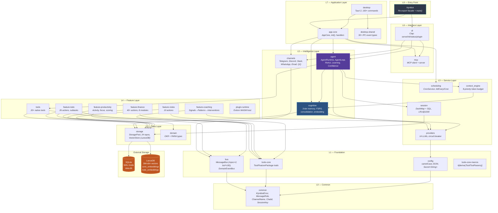
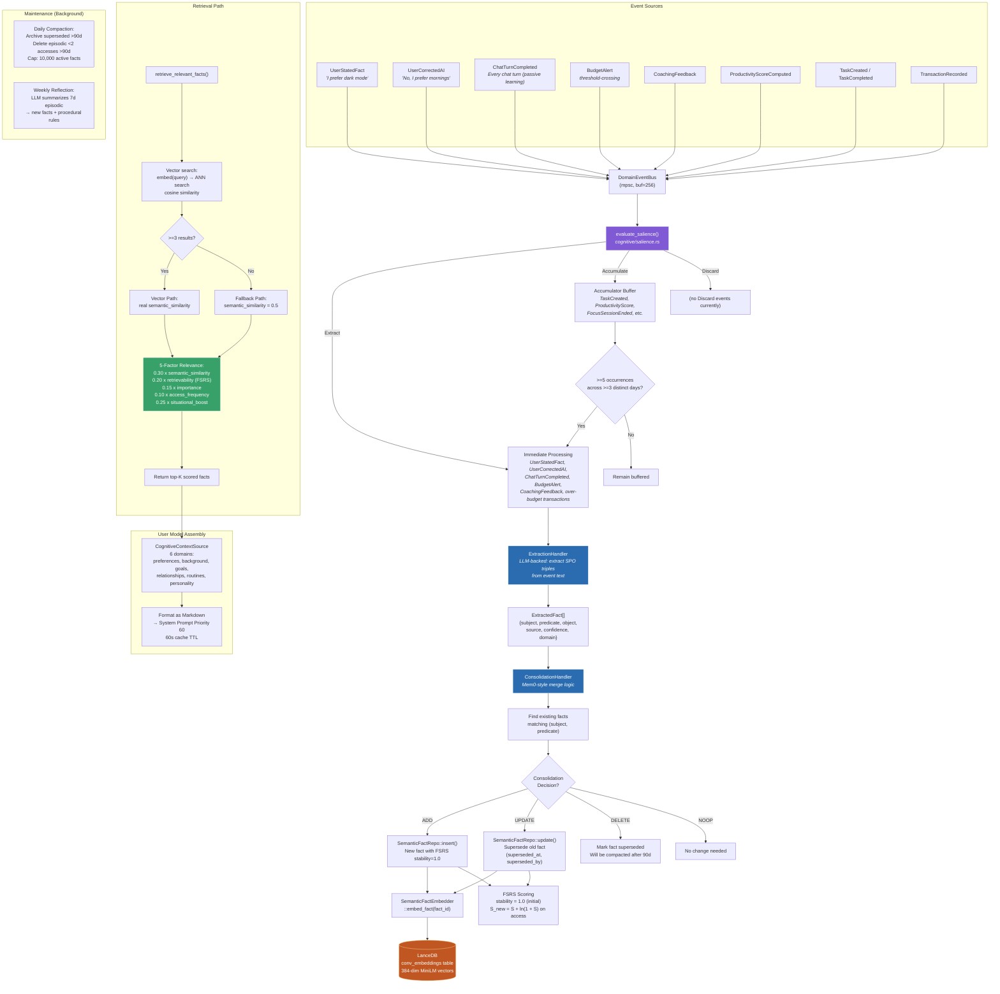
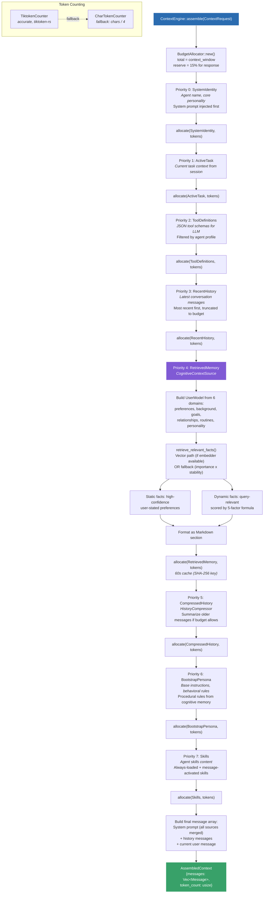
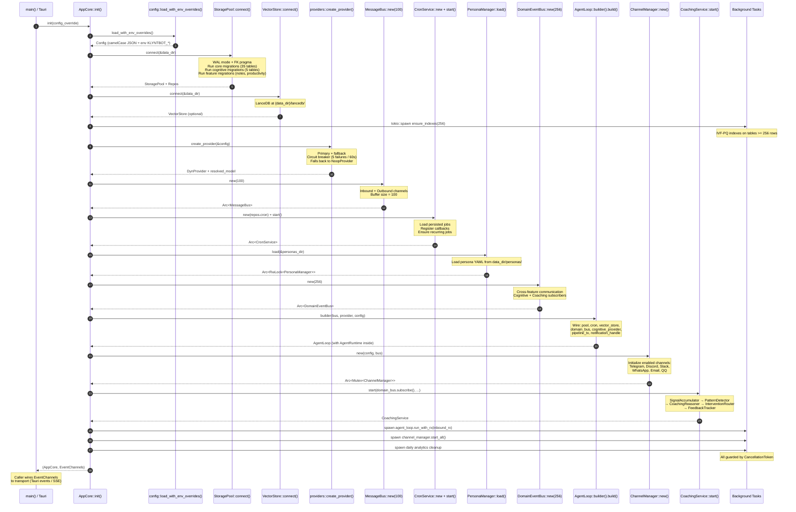
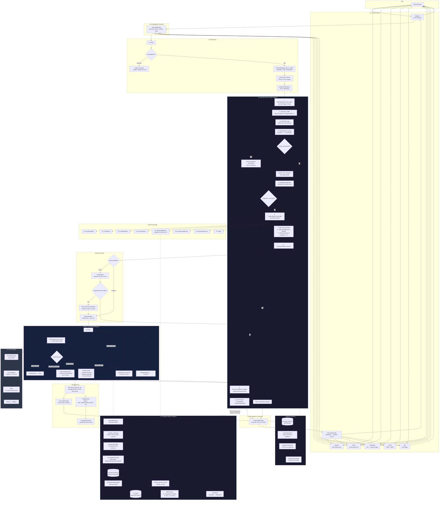

# Klyntbot Architecture Diagrams

> Updated: 2026-03-08 | Scope: Full end-to-end workflow across 26 crates

---

## Table of Contents

1. [High-Level Architecture](#1-high-level-architecture)
2. [End-to-End Message Processing Flow](#2-end-to-end-message-processing-flow)
3. [ReAct Loop + Tool Execution + Multi-Agent Delegation](#3-react-loop--tool-execution--multi-agent-delegation)
4. [Cognitive Memory & Data Pipeline](#4-cognitive-memory--data-pipeline)
5. [Adaptive Learning & Training Loop](#5-adaptive-learning--training-loop)
6. [Context Assembly Waterfall](#6-context-assembly-waterfall)
7. [Boot Sequence](#7-boot-sequence)
8. [Master Comprehensive Workflow Diagram](#8-master-comprehensive-workflow-diagram)
9. [Summary of the Complete Workflow](#9-summary-of-the-complete-workflow)
10. [Implementation Gaps & Technical Debt Analysis](#10-implementation-gaps--technical-debt-analysis)

---

## 1. High-Level Architecture



---

## 2. End-to-End Message Processing Flow

```mermaid
sequenceDiagram
    autonumber
    participant User
    participant Channel as Channel<br/>(Telegram/Discord/Slack...)
    participant Bus as MessageBus<br/>(mpsc, buf=100)
    participant Loop as AgentLoop<br/>::process_message
    participant Session as SessionManager<br/>(DashMap + SQL)
    participant Runtime as AgentRuntime<br/>::process_message
    participant AgentMgr as AgentManager<br/>::match_agent
    participant Analyzer as IntentAnalyzer<br/>::analyze
    participant ConfEval as ConfidenceEvaluator<br/>(AtomicU32)
    participant CtxEngine as ContextEngine<br/>::assemble
    participant CogCtx as CognitiveContextSource<br/>(UserModel + facts)
    participant Router as ExecutionRouter<br/>::execute
    participant LLM as LLM Provider<br/>(14 providers)
    participant Validator as ResponseValidator<br/>::validate
    participant CostTrack as CostTracker<br/>+ StrategyRepo
    participant DEB as DomainEventBus<br/>(cognitive pipeline)
    participant BusOut as MessageBus<br/>(outbound)

    User->>Channel: Send message
    Channel->>Bus: InboundMessage{channel, chat_id, content}
    Bus->>Loop: rx.recv()

    Loop->>Session: get_or_create(session_key)
    Session-->>Loop: Session{history, context}

    Loop->>Runtime: process_message(text, history, tools, ctx)

    Note over Runtime: Step 1 — Agent Matching
    Runtime->>AgentMgr: match_agent(message)
    AgentMgr-->>Runtime: AgentProfile{name, tools, mcp_tools, skills}

    Note over Runtime: Step 2 — Set active_profile (RwLock)
    Note over Runtime: Step 3 — Filter MCP tools by profile.mcp_tools

    Note over Runtime: Step 4 — Intent Classification
    Runtime->>Analyzer: analyze(message, tool_names)
    Note over Analyzer: Stage 1: Heuristics (zero-cost)<br/>Stage 2: LLM classifier (fallback)
    Analyzer-->>Runtime: IntentAnalysis{mode, confidence, signals}

    Note over Runtime: Step 5 — Confidence Check
    Runtime->>ConfEval: threshold()
    ConfEval-->>Runtime: f32 threshold
    alt confidence < threshold
        Runtime-->>Loop: "Could you clarify?"
    end

    Note over Runtime: Step 6 — Context Assembly
    Runtime->>CtxEngine: assemble(ContextRequest)
    CtxEngine->>CogCtx: build UserModel (6 domains)
    CogCtx-->>CtxEngine: Markdown persona + facts
    Note over CtxEngine: 8-priority waterfall allocation<br/>SHA-256 cached (60s TTL)
    CtxEngine-->>Runtime: AssembledContext{messages, token_count}

    Note over Runtime: Step 7 — Tool Filtering + Delegation injection
    Note over Runtime: Step 7c — Planning prompt if complexity >= 5

    Note over Runtime: Step 8 — Execute
    Runtime->>Router: execute(mode, messages, tools, params)
    Router->>LLM: chat()/chat_stream()
    LLM-->>Router: Response / ToolCalls
    Note over Router: Direct → single call<br/>Reactive → ReAct loop (1..max_iter)
    Router-->>Runtime: RouterResult{content, usage, iterations}

    Note over Runtime: Step 9 — Validate
    Runtime->>Validator: validate(content)
    Validator-->>Runtime: ValidationResult{is_valid, warnings}

    Note over Runtime: Step 10 — Record
    Runtime->>CostTrack: record_usage() + record_strategy()
    Runtime-->>Loop: RuntimeResult{content, mode_used, agent_name}

    Loop->>Session: save(session + new messages)
    Loop->>DEB: ChatTurnCompleted{user_message, session_key}
    Note over DEB: Passive learning — every chat turn<br/>feeds cognitive extraction pipeline
    Loop->>BusOut: OutboundMessage{channel, chat_id, content}
    BusOut->>Channel: send(formatted_content)
    Channel->>User: Formatted response
```

---

## 3. ReAct Loop + Tool Execution + Multi-Agent Delegation

```mermaid
flowchart TD
    Start([ReactiveEngine::execute]) --> Init["Initialize:<br/>messages, scratchpad = Scratchpad::new()<br/>max_iter = params.max_iterations or engine.max_iterations<br/>fabrication_retries = 0<br/>seen_tool_calls: HashSet"]

    Init --> PlanCheck{planning_prompt<br/>is Some?}
    PlanCheck -->|Yes| InjectPlan["messages.push(planning_prompt)<br/>— complexity >= 5 triggers this"]
    PlanCheck -->|No| LoopStart
    InjectPlan --> LoopStart

    LoopStart["for iteration in 1..=max_iterations"] --> CancelCheck{cancel_token<br/>is_cancelled?}
    CancelCheck -->|Yes| ReturnEmpty([EngineResult::Complete<br/>empty content])
    CancelCheck -->|No| EmitIter["emit AgentEvent::IterationStart<br/>{iteration, max}"]

    EmitIter --> RunCycle["ExecutionCore::run_cycle()<br/>→ LLM call with tools<br/>→ parallel tool execution<br/>→ duplicate detection via seen_tool_calls"]

    RunCycle --> Outcome{CycleOutcome?}

    Outcome -->|FinalResponse| PlanIter1{Is planning<br/>iteration 1?}
    PlanIter1 -->|Yes| ParsePlan["try_store_plan(content)<br/>→ ExecutionPlan::parse()<br/>emit PlanGenerated<br/>continue loop"]
    ParsePlan --> LoopStart
    PlanIter1 -->|No| Complete([EngineResult::Complete<br/>{content, usage, iterations, traces}])

    Outcome -->|FabricatedResponse| FabRetry{fabrication_retries<br/>> max_fabrication_retries?<br/><i>default: 2</i>}
    FabRetry -->|Yes| CompleteFab([EngineResult::Complete<br/>return fabricated content as-is])
    FabRetry -->|No| InjectForce["Inject force-tool prompt:<br/>'You MUST call the appropriate tool...'<br/>fabrication_retries += 1"]
    InjectForce --> LoopStart

    Outcome -->|ToolsExecuted| TrackTools["Track last_tool_name<br/>Parse plan from iter 1 if planning<br/>Mark plan steps completed<br/>emit PlanStepCompleted"]
    TrackTools --> DupCheck{All results are<br/>'Skipped: duplicate'?}
    DupCheck -->|Yes| InjectDup["Inject anti-dup prompt:<br/>'Do NOT repeat these calls'"]
    DupCheck -->|No| FailCheck{Any tool<br/>failures?}
    FailCheck -->|Yes| InjectReflect["Inject reflection prompt:<br/>'What went wrong?'"]
    FailCheck -->|No| ContinueLoop
    InjectDup --> ContinueLoop
    InjectReflect --> ContinueLoop
    ContinueLoop --> LoopStart

    Outcome -->|EmptyResponse| AddTrace["Add empty_response trace"] --> ContinueLoop

    LoopStart -->|max_iterations<br/>exhausted| Synthesize["Synthesize final response:<br/>LLM call with NO tools<br/>Include plan progress if available<br/>'Based on work so far...'"]
    Synthesize --> SynthResult([EngineResult::Complete<br/>{synthesized content}])

    subgraph "Tool Execution (ExecutionCore::run_cycle)"
        TC1["LLM returns tool_calls[]"] --> TC2["Bounded parallel execution<br/>Semaphore(10) + join_all<br/>Per-tool timeout (30s default)"]
        TC2 --> TC3["Duplicate detection:<br/>hash(tool_name + args) in seen_tool_calls"]
        TC3 --> TC4["OutcomeRecorder::record()<br/>privacy-safe: no args/content stored"]
        TC4 --> TC5["Append tool results to messages"]
    end

    subgraph "Multi-Agent Delegation"
        D1["IntentAnalyzer sets needs_orchestration=true"] --> D2["Runtime routes to 'general' agent<br/>(ORCHESTRATOR_AGENT)"]
        D2 --> D3["inject_delegation_tool()<br/>adds DelegateTool to filtered_tools"]
        D3 --> D4["DelegateTool::execute()<br/>ctx.delegation_depth check"]
        D4 --> D5{depth <<br/>MAX_DELEGATION_DEPTH?<br/><i>const: 2</i>}
        D5 -->|Yes| D6["Spawn sub-AgentRuntime::process_message<br/>delegation_depth += 1<br/>Match specialized agent profile"]
        D5 -->|No| D7["Return error:<br/>'Max delegation depth reached'"]
        D6 --> D8["5 built-in agents:<br/>general, task, finance,<br/>automation, communication"]
    end

    style Complete fill:#38a169,stroke:#fff,color:#fff
    style CompleteFab fill:#d69e2e,stroke:#fff,color:#fff
    style SynthResult fill:#3182ce,stroke:#fff,color:#fff
    style ReturnEmpty fill:#718096,stroke:#fff,color:#fff
```

---

## 4. Cognitive Memory & Data Pipeline



---

## 5. Adaptive Learning & Training Loop

```mermaid
flowchart LR
    subgraph "Per-Request (Hot Path)"
        ToolExec["Tool Execution<br/><i>ExecutionCore::run_cycle()</i>"] --> Outcome["ToolExecutionResult<br/>{tool_name, success,<br/>duration_ms, confidence}"]
        Outcome --> Recorder["OutcomeRecorder::record()<br/><i>Privacy-safe: no args/content</i><br/>→ learning_outcomes table"]
    end

    subgraph "Hourly Analysis (Background)"
        Timer["LearningService<br/><i>hourly tick</i>"] --> Load["OutcomeStore::list_since()<br/><i>load recent outcomes</i>"]
        Load --> Analyzer["LearningAnalyzer<br/>::analyze()"]
        Analyzer --> Bucket["Bucket by confidence range<br/>Compute success rates per band<br/>Calculate threshold_confidence"]
        Bucket --> AnalysisResult["AnalysisResult<br/>{total_outcomes,<br/>suggested_threshold,<br/>threshold_confidence,<br/>per-band stats}"]
    end

    subgraph "Threshold Adaptation"
        AnalysisResult --> ColdStart{"total_outcomes<br/>>= min_outcomes?<br/><i>default: 50</i>"}
        ColdStart -->|No| Skip["Skip adaptation<br/><i>insufficient data</i>"]
        ColdStart -->|Yes| Clamp["Clamp suggested to<br/>[min_threshold, max_threshold]"]
        Clamp --> Delta["delta = suggested - current<br/>clamped to +/-0.05<br/><i>MAX_THRESHOLD_STEP</i>"]
        Delta --> Significant{"|delta| >= 0.001?"}
        Significant -->|No| NoChange["No change"]
        Significant -->|Yes| Update["AdaptiveThresholds<br/>state.current_threshold += delta<br/>Push ThresholdChange to history<br/>Persist to learning_state table"]
    end

    subgraph "Confidence Evaluation (Per-Request)"
        Update --> Evaluator["ConfidenceEvaluator<br/><i>AtomicU32 <- f32 bits</i><br/>Lock-free hot path"]
        Evaluator --> Decision{"confidence <<br/>threshold?"}
        Decision -->|Yes| Clarify["Return clarification<br/><i>'Could you clarify?'</i>"]
        Decision -->|No| Proceed["Proceed with execution"]
    end

    Recorder -.->|"learning_outcomes<br/>(SQL, 30d retention)"| Load

    style Recorder fill:#2b6cb0,stroke:#fff,color:#fff
    style Analyzer fill:#805ad5,stroke:#fff,color:#fff
    style Evaluator fill:#38a169,stroke:#fff,color:#fff
    style Update fill:#d69e2e,stroke:#fff,color:#fff
```



---

## 6. Context Assembly Waterfall



---

## 7. Boot Sequence



---

## 8. Master Comprehensive Workflow Diagram



---

## 9. Summary of the Complete Workflow

1. **User messages** arrive via 6 platform channels (Telegram, Discord, Slack, WhatsApp, Email, QQ) through the `MessageBus` (mpsc, buffer=100) into the `AgentLoop`.
2. **Session management** (`DashMap` + SQLite, LRU@1000) provides conversation context and history.
3. The **10-step AgentRuntime pipeline** performs: agent matching → profile-based filtering → two-stage intent classification (heuristics→LLM) → confidence gating → 8-priority context assembly → tool filtering + delegation injection → execution routing → validation → cost/strategy recording.
4. **Direct mode** handles simple queries (single LLM call); **Reactive mode** runs a ReAct loop (1..max_iterations) with fabrication detection, duplicate prevention, failure reflection, and chain-of-thought planning for complexity >= 5. Tool calls execute in bounded parallel (semaphore capped at 10, per-tool 30s timeout).
5. **Multi-agent delegation** allows the `general` orchestrator to dispatch to 4 specialized agents (task, finance, automation, communication) with max depth 2.
6. **Cognitive memory** processes domain events through salience filtering → LLM extraction → Mem0-style consolidation → SemanticFactRepo (SQLite) + vector embedding (LanceDB, 384-dim MiniLM). Retrieval uses a 5-factor FSRS-scored relevance formula. **Passive learning** via `ChatTurnCompleted` events feeds every chat turn into the extraction pipeline (importance 0.8), enabling fact discovery from ordinary conversation.
7. **Adaptive learning** records tool outcomes (privacy-safe), analyzes hourly, adjusts confidence thresholds (+/-0.05/cycle, lock-free `AtomicU32`), and feeds back into the confidence gate.
8. Responses flow back through the `MessageBus` (outbound) → `ChannelFormatter` → platform-specific format → user.

---

## 10. Implementation Gaps & Technical Debt Analysis

### Critical

*No critical items remain* — R1 (vector search), R2 (unified memory), and R3 (CLI serve parity) are all marked SOLVED in SYSTEM_ANALYSIS.md.

### High

| # | Title | Location | Why It Matters | Suggested Fix |
|---|-------|----------|---------------|---------------|
| H1 | **Coaching feedback persistence fragility** | SYSTEM_ANALYSIS.md §6.2 #6, #9 — `FeedbackTracker` | `coaching_strategies` table was previously orphaned. R5/R11 wired it, but the integration may be fragile. | Verify `FeedbackTracker::persist()` is called on shutdown and `load_from_db()` on boot in `app-core/init.rs`. Add integration test. |
| H2 | **Vector store non-atomic upsert** | SYSTEM_ANALYSIS.md §6.2 #7 — `storage/src/vector_store.rs` | LanceDB upsert is delete-then-insert. R13 reordered to insert-first-then-delete for crash safety, but LanceDB still lacks true transactions. A crash between insert and delete leaves duplicates. | The insert-first approach (R13 SOLVED) is better but still not atomic. Monitor for duplicate vectors and add a dedup pass to compaction. |
| H3 | **MessageBus has no backpressure** | SYSTEM_ANALYSIS.md §6.3, §6.4 | Buffer=100 with `mpsc::channel`. If the agent loop is slow, senders (channels) will block, and overflow drops messages silently. No persistence for bus messages. | For personal use this is acceptable. For robustness, switch to bounded channel with `try_send()` + warn on capacity, or add a dead-letter queue. |
| H4 | **No external observability** | SYSTEM_ANALYSIS.md §6.2 #4 | Zero Prometheus/OTel metrics, no health endpoints, no distributed tracing. Desktop UI has `TransparencyData` per message, but there's no way to monitor the agent remotely. | Marked DEPRIORITIZED (R4) — justified for a local desktop app. If ever deployed as a service, this becomes critical. |

### Medium

| # | Title | Location | Why It Matters | Suggested Fix |
|---|-------|----------|---------------|---------------|
| M1 | **`escalation_count` field always 0** | SYSTEM_ANALYSIS.md §6.2 #10 | `StrategyRecordRow.escalation_count` is a dead field — never incremented. R9 added Direct→Reactive escalation but doesn't write to this field. | Repurpose to count Direct→Reactive escalations (wire in `ExecutionRouter`), or drop the column. |
| M2 | **`CharTokenCounter` fallback loses accuracy** | SYSTEM_ANALYSIS.md §6.4 | `chars / 4` is a rough approximation. When tiktoken-rs fails to load, context assembly may over- or under-allocate by 20-30%. | Log a warning when falling back. Consider bundling the tiktoken BPE data or using a more accurate character-based heuristic. |
| M3 | **WhatsApp/QQ require external bridges** | SYSTEM_ANALYSIS.md §4.1 | WhatsApp needs `ws://localhost:3001` (Node.js Baileys bridge), QQ needs a similar bridge. These are external processes not managed by the klyntbot binary. | Document the bridge setup clearly. Consider embedding the bridge or providing a Docker Compose config. |
| M4 | **No web chat channel** | SYSTEM_ANALYSIS.md §9.4 R14 | Users can only interact via 6 platform integrations or the desktop app. No browser-based fallback. | SSE streaming added to dev server (`291f4dc4`), enabling browser-based chat in dev mode. Full production web channel still needed. |
| M5 | **Session LRU eviction at 1000** | SYSTEM_ANALYSIS.md §6.4 | `DashMap` in-memory cache evicts at 1000 sessions. For personal use this is fine, but multi-tenant would need per-user limits and smarter eviction. | Acceptable for single-user. Document the limit. |
