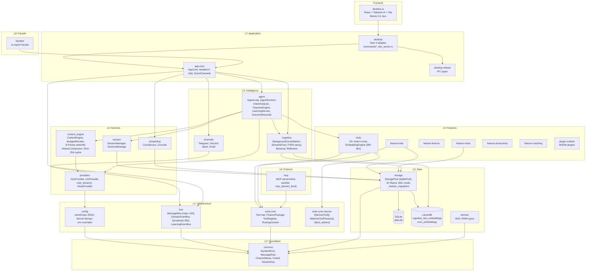
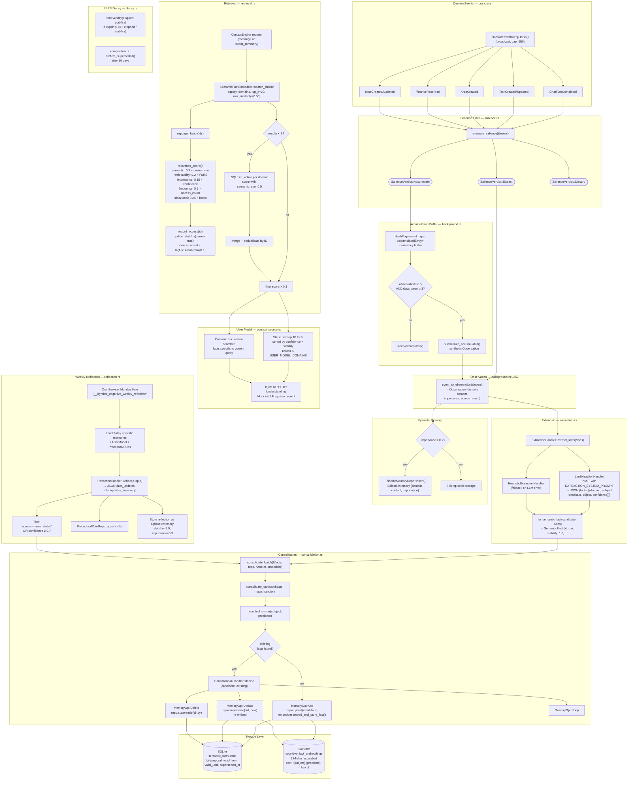
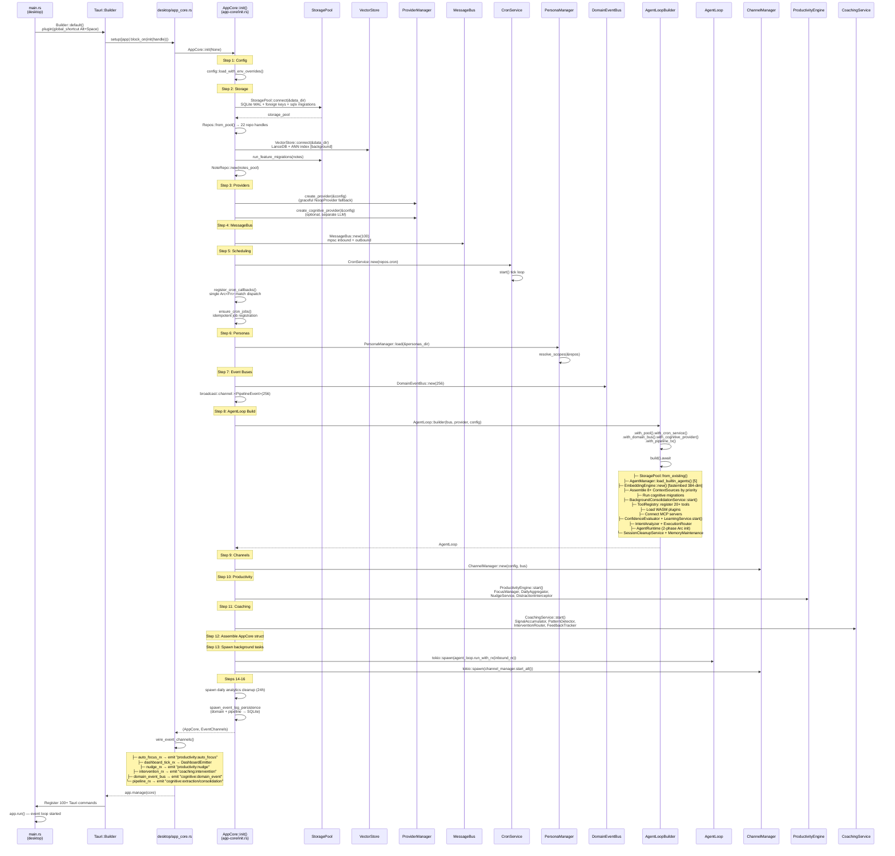
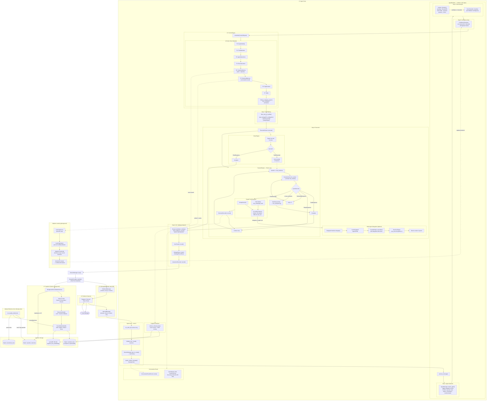

# Klyntbot Architecture Diagrams

## 1. High-Level Architecture



## 2. End-to-End Message Processing Flow

```mermaid
sequenceDiagram
    participant User
    participant Channel as Channel<br/>(Telegram/Discord/Slack)
    participant Bus as MessageBus<br/>(mpsc cap=100)
    participant AL as AgentLoop<br/>(mod.rs)
    participant SM as SessionManager
    participant AR as AgentRuntime<br/>(runtime.rs)
    participant AM as AgentManager<br/>(manager.rs)
    participant IA as IntentAnalyzer<br/>(analysis.rs)
    participant CE as ContextEngine<br/>(assembler.rs)
    participant ER as ExecutionRouter<br/>(router.rs)
    participant LLM as LLM Provider<br/>(DynProvider)
    participant RV as ResponseValidator
    participant CT as CostTracker
    participant DEB as DomainEventBus<br/>(broadcast 256)

    User->>Channel: sends message
    Channel->>Bus: bus.publish(InboundMessage)
    Bus->>AL: run_with_rx() receives msg

    Note over AL: Step 1: Validate message size
    Note over AL: Step 2: Handle Reactions → satisfaction score
    Note over AL: Step 3: SYSTEM_CHANNEL → process_system_message()

    AL->>SM: get_or_create(session_key)
    SM-->>AL: Session + history
    AL->>AL: spawn_embed_message() [background]

    AL->>AR: process_message(message, history, tools, event_tx)

    Note over AR: ── Step 1: Agent Selection ──
    AR->>AM: match_agent(message)
    AM-->>AR: AgentProfile (trigger-weighted scoring, fallback="general")
    Note over AR: emit AgentSelected + SkillLoaded events

    Note over AR: ── Step 2: Set active_profile ──
    AR->>AR: active_profile.write() = matched profile

    Note over AR: ── Step 3: Filter MCP tools ──
    AR->>AR: filter by profile.allows_mcp_server()
    Note over AR: Step 3b: if needs_orchestration → switch to "general",<br/>boost max_iterations ≥ 15

    Note over AR: ── Step 4: Intent Analysis ──
    AR->>IA: analyze(message, filtered_tool_names)
    Note over IA: Stage 1: analyze_heuristic()<br/>greeting→Direct(0.95), task→Reactive<br/>ambiguous→None
    opt confidence < heuristic_threshold
        IA->>LLM: IntentClassifier::classify() [JSON schema]
        LLM-->>IA: ExecutionMode + ComplexitySignals
    end
    IA-->>AR: IntentAnalysis { mode, confidence, needs_orchestration }

    Note over AR: ── Step 5: Confidence Check ──
    AR->>AR: if confidence < evaluator.threshold() → downgrade to Direct

    Note over AR: ── Step 6: Context Assembly ──
    AR->>CE: assemble(ContextRequest)
    Note over CE: 8-priority waterfall:<br/>Identity→Bootstrap→Area→Todo→<br/>Agent→Persona→Page→Cognitive
    CE-->>AR: AssembledContext { messages, token_usage }

    Note over AR: ── Step 7: Tool Filtering ──
    AR->>AR: filter_tools_for_profile()
    Note over AR: Step 7b: inject_delegation_tool() if depth < 2<br/>Step 7c: inject planning prompt if complexity ≥ 4

    Note over AR: ── Step 8: Execute ──
    AR->>ER: execute(mode, messages, tools, params)
    ER->>LLM: chat() or chat_stream()
    LLM-->>ER: LlmResponse (text or tool_calls)
    ER-->>AR: EngineResult::Complete { content, usage }

    Note over AR: ── Step 9: Validate ──
    AR->>RV: validate(content)
    Note over RV: strip &lt;confidence&gt; blocks<br/>truncate at max_response_chars<br/>system leak detection

    Note over AR: ── Step 10: Record ──
    AR->>CT: record_usage()
    AR->>AR: StrategyRepo::create(StrategyRecordRow)
    AR->>AR: InteractionRecorder::record()
    AR-->>AL: RuntimeResult { content, mode_used, agent_name }

    AL->>SM: save_to_session(assistant message)
    AL->>AL: spawn_embed_message() [background]
    AL->>DEB: publish(ChatTurnCompleted)
    AL->>Bus: publish_outbound(OutboundMessage)
    Bus->>Channel: send response
    Channel->>User: delivers reply
```

## 3. ReAct Loop + Tool Execution + Multi-Agent Delegation

```mermaid
flowchart TD
    START([ReactiveEngine::execute<br/>reactive.rs:L62]) --> INIT["iteration = 1<br/>max = analysis.iteration_budget()<br/>traces: Vec&lt;ToolTrace&gt;"]
    INIT --> CANCEL{CancellationToken<br/>cancelled?}
    CANCEL -->|yes| ABORT([Return empty EngineResult])
    CANCEL -->|no| ITER_EVENT["emit IterationStart {iteration, max}"]
    ITER_EVENT --> RUN_CYCLE

    subgraph CYCLE ["ExecutionCore::run_cycle() — core.rs:L315"]
        RUN_CYCLE["call_provider_streaming()<br/>or provider.chat()"] --> PARSE_RESP{LlmResponse<br/>has tool_calls?}
        PARSE_RESP -->|"no text"| EMPTY_OUT([CycleOutcome::EmptyResponse])
        PARSE_RESP -->|"text only"| CHECK_FAB{"is_fabricated_tool_response()?<br/>(context-aware heuristics)"}
        CHECK_FAB -->|yes| FAB_OUT([CycleOutcome::FabricatedResponse])
        CHECK_FAB -->|no| FINAL_OUT([CycleOutcome::FinalResponse])

        PARSE_RESP -->|"tool_calls present"| DEDUP{"Dedup check:<br/>hash(tool_name|args)<br/>vs seen_keys"}
        DEDUP -->|"all duplicates"| INJECT_FORCE["Inject force-different-action prompt"]
        INJECT_FORCE --> TOOLS_OUT
        DEDUP -->|"has new calls"| PAR_EXEC

        subgraph PAR_EXEC ["Parallel Tool Execution"]
            direction TB
            SEM["Semaphore(10) — max concurrency"]
            SEM --> TOOL1["Tool 1: acquire permit<br/>→ emit ToolStart<br/>→ registry.prepare() + tool.execute()<br/>→ timeout (30s default, 600s ask_user)<br/>→ emit ToolEnd<br/>→ record outcome"]
            SEM --> TOOL2["Tool 2: same flow"]
            SEM --> TOOLN["Tool N: same flow"]
        end

        PAR_EXEC --> TOOLS_OUT([CycleOutcome::ToolsExecuted])
    end

    %% Match on CycleOutcome
    FINAL_OUT --> RETURN([EngineResult::Complete<br/>{content, usage, iterations, traces}])
    EMPTY_OUT --> CONT_LOOP{iteration < max?}
    TOOLS_OUT --> ADD_REFLECT["Add reflection prompt<br/>if failures or duplicates"] --> CONT_LOOP
    FAB_OUT --> FAB_RETRY{fabrication_retries < 2?}
    FAB_RETRY -->|yes| FORCE_TOOL["Inject force-tool prompt<br/>fabrication_retries += 1"] --> RUN_CYCLE
    FAB_RETRY -->|no| RETURN

    CONT_LOOP -->|yes| INC["iteration += 1"] --> CANCEL
    CONT_LOOP -->|"no (at max)"| SYNTH["Push synthesis_prompt<br/>→ run_cycle(tools=[])<br/>→ force text output"] --> RETURN

    %% Direct Engine + Escalation
    DIRECT_START([DirectEngine::execute]) --> SINGLE_CYCLE["ExecutionCore::run_cycle()<br/>with empty tools slice"]
    SINGLE_CYCLE --> DIRECT_MATCH{CycleOutcome?}
    DIRECT_MATCH -->|FinalResponse| RETURN
    DIRECT_MATCH -->|FabricatedResponse| RETURN
    DIRECT_MATCH -->|ToolsExecuted| ESCALATE([EngineResult::Escalate<br/>→ Router re-runs as Reactive])
    DIRECT_MATCH -->|EmptyResponse| RETURN

    ESCALATE -.->|"auto-escalation"| START

    %% Delegation
    subgraph DELEGATION ["Multi-Agent Delegation — runtime.rs:L784"]
        direction TB
        DEL_TOOL["DelegationTool.execute()<br/>(injected if depth < MAX=2)"]
        DEL_TOOL --> DEL_HANDLER["DelegationHandler::delegate(<br/>agent_name, query, ctx, depth)"]
        DEL_HANDLER --> DEL_MATCH["AgentManager::get(agent_name)<br/>→ delegated AgentProfile"]
        DEL_MATCH --> DEL_CTX["ContextEngine::assemble()<br/>with delegated agent instructions"]
        DEL_CTX --> DEL_FILTER["filter_tools_for_profile()"]
        DEL_FILTER --> DEL_INJECT{"depth+1 < MAX_DEPTH(2)?"}
        DEL_INJECT -->|yes| DEL_ADD_TOOL["inject_delegation_tool(depth+1)"]
        DEL_INJECT -->|no| DEL_NO_TOOL["no delegation tool available"]
        DEL_ADD_TOOL --> DEL_EXEC["ExecutionRouter::execute(Reactive)<br/>max_iters=min(profile.max_iters, 8)"]
        DEL_NO_TOOL --> DEL_EXEC
        DEL_EXEC --> DEL_EVENT_FILTER["delegation_event_filter():<br/>suppress ContentChunk, IterationStart<br/>annotate ToolStart/ToolEnd with agent name"]
        DEL_EVENT_FILTER --> DEL_RETURN["Return content as String<br/>→ parent tool result"]
    end

    TOOL1 -.->|"if tool is delegate_to_agent"| DEL_TOOL
```

## 4. Cognitive Memory & Data Pipeline



## 5. Adaptive Learning & Training Loop

```mermaid
flowchart LR
    subgraph RECORDING ["Outcome Recording — recorder.rs"]
        TOOL_EXEC["Tool execution<br/>in ReactiveEngine"] --> RECORD["OutcomeRecorder::record()<br/>(privacy-by-omission:<br/>no tool_args, no user_message)"]
        RECORD --> HASH["FNV-1a hash session_key<br/>'telegram:abc123' →<br/>'telegram:a1b2c3d4'"]
        HASH --> STORE[("OutcomeStore<br/>(SQLite via OutcomeRepo)<br/>OutcomeRow {id, tool_name,<br/>success, duration_ms,<br/>channel_prefix}")]
    end

    subgraph SERVICE ["LearningService — service.rs:L1-L208"]
        LOOP["Background tokio::select! loop<br/>interval from config"] --> LOAD_OUTCOMES["Load recent outcomes<br/>from OutcomeStore"]
        LOAD_OUTCOMES --> ANALYZER
    end

    subgraph ANALYZER ["LearningAnalyzer"]
        direction TB
        ANALYZE["analyze(outcomes, feedback)"] --> BANDS["Compute per-tool ConfidenceBands:<br/>[0.0,0.3) [0.3,0.5) [0.5,0.7)<br/>[0.7,0.85) [0.85,1.0]"]
        BANDS --> SUGGEST["suggest_threshold:<br/>lowest band with ≥5 samples<br/>AND ≥80% success rate<br/>(default: 0.7)"]
        SUGGEST --> CONF["threshold_confidence:<br/>0.2 (≤10 pts) → 0.5 (≤50)<br/>→ 0.7 (≤200) → 0.9 (>200)"]
        CONF --> PATTERN["PatternAnalyzer::analyze()<br/>behavioral pattern extraction"]
    end

    subgraph ADAPTIVE ["AdaptiveThresholds — adaptive.rs"]
        SUGGEST --> APPLY["apply_analysis(analysis)"]
        APPLY --> COLD_CHECK{total_outcomes ≥<br/>min_outcomes (50)?}
        COLD_CHECK -->|no| SKIP["Cold-start protection:<br/>keep default threshold"]
        COLD_CHECK -->|yes| DELTA["Compute delta =<br/>suggested - current"]
        DELTA --> CLAMP["Clamp to ±MAX_THRESHOLD_STEP<br/>(0.05 per cycle)"]
        CLAMP --> BOUNDS["Clamp to [min_threshold,<br/>max_threshold]"]
        BOUNDS --> PERSIST["Persist to LearningStateRepo<br/>(key: 'adaptive_thresholds',<br/>JSON blob)"]
    end

    subgraph BROADCAST ["Event Propagation"]
        PERSIST --> PUB["LearningEventBus::publish()"]
        PUB --> THR_CHANGED["LearningEvent::ThresholdChanged"]
        PUB --> ANALYSIS_DONE["LearningEvent::AnalysisCompleted"]
        THR_CHANGED --> ATOMIC["ConfidenceEvaluator<br/>Arc&lt;AtomicU32&gt;::store(<br/>new_threshold.to_bits())"]
    end

    subgraph EVALUATOR ["ConfidenceEvaluator — evaluator.rs"]
        ATOMIC --> EVAL["evaluate(llm_output)"]
        EVAL --> PARSE["Parse &lt;confidence&gt; JSON:<br/>{intent_clarity, tool_fit,<br/>info_sufficiency}"]
        PARSE --> AVG["weighted_avg ≥ threshold()?"]
        AVG -->|yes| PROCEED["Allow current ExecutionMode"]
        AVG -->|no| DOWNGRADE["Downgrade to<br/>ExecutionMode::Direct"]
    end

    subgraph STRATEGY ["Strategy Feedback — StrategyRepo"]
        STRAT_RECORD["Every pipeline execution →<br/>StrategyRecordRow {<br/>predicted_strategy,<br/>actual_strategy,<br/>escalation_count,<br/>complexity_signals}"]
        STRAT_RECORD --> STRAT_CACHE["IntentAnalyzer caches<br/>StrategySummaryRow (60s TTL)<br/>→ injected into LLM<br/>classifier prompt"]
    end
```

## 6. Context Assembly Waterfall

```mermaid
flowchart TD
    START([ContextEngine::assemble<br/>assembler.rs:L120]) --> BUDGET["BudgetAllocator::new()<br/>total = model_context_window<br/>response_reserve = 15%<br/>available = 85% of total"]

    BUDGET --> P0["Priority 0: SystemIdentity<br/>───────────────────────<br/>IdentitySource: app name + version<br/>BootstrapSource: base instructions<br/>→ allocate(tokens used)"]

    P0 --> P1["Priority 1: ToolDefinitions<br/>───────────────────────<br/>Tool schemas (OpenAI function format)<br/>Only if mode ≠ Direct<br/>→ allocate(schema_tokens)"]

    P1 --> P2["Priority 2: AgentInstructions<br/>───────────────────────<br/>AgentContextSource reads active_profile<br/>→ AGENT.md content + skills/<br/>→ allocate(agent_tokens)"]

    P2 --> P3["Priority 3: PersonaContext<br/>───────────────────────<br/>PersonaContextSource<br/>→ active persona rules + style<br/>→ allocate(persona_tokens)"]

    P3 --> P4["Priority 4: CognitiveMemory<br/>───────────────────────<br/>CognitiveContextSource (60s TTL cache):<br/> Static: top 10 facts by confidence×stability<br/>   across 6 domains: identity, energy, work,<br/>   finance, learning, preferences<br/> Dynamic: vector search (384-dim fastembed)<br/>   top_k=30, min_sim=0.55, score>0.3<br/>   FSRS retrievability weighting<br/>→ '# User Understanding' block<br/>→ allocate(cognitive_tokens)"]

    P4 --> P5["Priority 5: RetrievedMemory<br/>───────────────────────<br/>CognitiveMemoryRetriever<br/>→ ConversationRecallService::search()<br/>   embed query → cosine search<br/>   time-decay: score × decay^days<br/>   (half_life=138 days)<br/>   threshold=0.4, limit=5<br/>→ allocate(memory_tokens)<br/>(skipped for Clarification mode)"]

    P5 --> P6["Priority 6: PageContext<br/>───────────────────────<br/>PageContextSource<br/>→ TODO items, area context<br/>→ allocate(page_tokens)"]

    P6 --> P7["Priority 7: Skills<br/>───────────────────────<br/>ProductivityContextSource<br/>→ focus state, nudges, scores<br/>→ allocate(skill_tokens)"]

    P7 --> REMAINING["remaining_budget =<br/>available - Σ(allocated)"]

    REMAINING --> COMPRESS["HistoryCompressor::compress_async()<br/>───────────────────────<br/>min_recent = 4 messages verbatim<br/>expand recent if budget allows<br/>older → chunks of 5 →<br/>  Abstractive: LLM per chunk<br/>  (fallback: Extractive)<br/>→ allocate(RecentHistory)<br/>→ allocate(CompressedHistory)"]

    COMPRESS --> ASSEMBLE["Build final message list:<br/>┌─ System prompt (all sources merged) ─┐<br/>│ MemorySystem (retrieved memories)    │<br/>│ SummarySystem(s) (compressed chunks)  │<br/>└─ Recent messages (min 4, verbatim)  ─┘"]

    ASSEMBLE --> CACHE["SHA-256 cache key:<br/>system_prompt + history_len +<br/>last_message + strategy +<br/>tool_count + window<br/>LRU capacity=8, generation-invalidated"]

    CACHE --> RESULT([AssembledContext<br/>{messages, token_usage,<br/>sources_used}])
```

## 7. Boot Sequence



## 8. Master Comprehensive Workflow Diagram



---

## Summary of the Complete Workflow

1. **Message ingestion**: User messages arrive via platform channels (Telegram/Discord/Slack/Email), are published to the `MessageBus` (mpsc, cap 100), and received by `AgentLoop::run_with_rx()`.

2. **Session + embedding**: `SessionManager` loads/creates session history. Messages are embedded in background via `ConversationRecallService` (384-dim fastembed → LanceDB).

3. **Agent matching**: `AgentManager` scores the message against 5 built-in agent profiles using trigger-weighted matching. Orchestration detection can override to the "general" agent with boosted iterations (≥15).

4. **Two-stage intent analysis**: Heuristic patterns (0ms) classify greetings/tasks/questions. Ambiguous messages fall through to an LLM classifier. `ConfidenceEvaluator` (lock-free `AtomicU32` threshold, continuously tuned by `LearningService`) can downgrade Reactive→Direct.

5. **Context assembly**: An 8-priority token waterfall fills the context window — system identity, tools, agent instructions, persona, cognitive memory (static user model + dynamic vector search with FSRS scoring), conversation recall, page context, and skills — then compresses history (min 4 verbatim + abstractive summaries).

6. **Execution**: `ExecutionRouter` dispatches to `DirectEngine` (single call) or `ReactiveEngine` (ReAct loop, 1..max_iterations). Tools execute in parallel (Semaphore(10), `join_all`). Hash-based dedup, fabrication detection with retry, and auto-escalation Direct→Reactive on unexpected tool calls.

7. **Delegation**: The orchestrator can delegate to specialized agents via `DelegationTool` (max depth=2). Sub-agents get their own context assembly, tool filtering, and Reactive execution with event filtering.

8. **Validation + recording**: `ResponseValidator` strips confidence blocks, truncates, and detects system leaks. `CostTracker`, `StrategyRepo`, and `InteractionRecorder` log everything.

9. **Cognitive pipeline**: `DomainEventBus` broadcasts `ChatTurnCompleted` → `BackgroundConsolidationService` applies salience filtering → LLM extraction → consolidation (Add/Update/Delete/Noop) → SQLite semantic facts + LanceDB embeddings. Episodic memories stored for importance ≥ 0.7.

10. **Learning loop**: `OutcomeRecorder` feeds tool results to `LearningService` → `LearningAnalyzer` computes per-tool confidence bands → `AdaptiveThresholds` adjusts the evaluator threshold (±0.05/cycle, min 50 outcomes) → lock-free propagation to `ConfidenceEvaluator`.

11. **Weekly reflection**: Monday 9am cron loads 7-day episodic memories + user model + procedural rules → LLM synthesis → consolidates new facts and upserts rules. The reflection itself is stored as an episodic memory (stability=5.0).

12. **Response delivery**: The validated response is published as `OutboundMessage` via `MessageBus`, routed through the originating channel back to the user.

---

## Implementation Gaps & Technical Debt Analysis

### High

**3. HistoryCompressor makes N/5 LLM calls for abstractive compression**
- **Location**: `crates/context_engine/src/` — history compression
- **Why it matters**: 100 messages → 19 LLM calls for compression, each blocking. No batching, no parallelism. Adds latency to every request with long histories.
- **Fix**: Batch chunks into a single LLM call with structured output, or parallelize chunk compression with `join_all`.

### Medium

**4. Single monolithic cron callback**
- **Location**: `crates/app-core/src/init.rs:L434-L618` — `register_cron_callbacks()`
- **Why it matters**: All cron job types share one `match job_name.as_str()` dispatch. Adding new jobs requires editing this growing match block.
- **Fix**: Use a trait-based callback registry where each job type registers its own handler.

**5. Context cache invalidated on every tool execution**
- **Location**: `crates/context_engine/src/assembler.rs` — generation counter
- **Why it matters**: `invalidate_cache()` bumps a generation counter that marks all 8 LRU entries stale. Since tool execution always triggers re-assembly, the cache only benefits the first assembly in a request cycle.
- **Fix**: Use a more granular invalidation strategy — only invalidate when specific context sources change (e.g., session history appended, new cognitive facts).

**6. `block_on` in Tauri setup blocks UI thread**
- **Location**: `crates/desktop/src/main.rs:L53`
- **Why it matters**: `tauri::async_runtime::block_on(app_core::init(handle))` blocks the Tauri setup thread for the entire boot sequence (potentially several seconds). Users see a blank window during initialization.
- **Fix**: Show a loading/splash screen, then complete initialization asynchronously. Or move heavy init (LLM provider, MCP connections, embedding engine) to a post-setup task.

### Resolved

The following gaps have been addressed:

- ~~Synthesis at max_iterations can return empty string~~ — Fixed: fallback to trace summary instead of empty string (`reactive.rs`)
- ~~BudgetAllocator silent failure on small context windows~~ — Fixed: warning emitted when remaining budget < 15% (`budget.rs`)
- ~~Reflexive stability inflation in FSRS~~ — Fixed: capped at `MAX_STABILITY = 30.0` (`decay.rs`)
- ~~USER_MODEL_DOMAINS hardcoded to 6~~ — Fixed: expanded to 10 domains with `other` catch-all field (`types.rs`, `repos/mod.rs`, `context_source.rs`)
- ~~Notes migrations run twice~~ — Fixed: removed duplicate call in `AgentLoopBuilder::build()` (`builder.rs`)
- ~~`threshold_confidence` computed but unused~~ — Fixed: scales `MAX_THRESHOLD_STEP` for faster convergence (`adaptive.rs`)
- ~~IntentPipeline is dead code~~ — Fixed: deleted `pipeline.rs`, moved `PipelineConfig` to `types.rs`, removed e2e tests
- ~~No test for delegation at max depth~~ — Already resolved: `test_delegation_tool_not_injected_at_max_depth` exists in `runtime.rs`
- ~~Cognitive provider created twice~~ — Fixed: stored `Option<DynProvider>` in `AppCore`, reflection handler uses it directly (`state.rs`, `cognitive.rs`)
- ~~AccumulatedEntry buffer not persisted across restarts~~ — Fixed: added `accumulated_observations` table, repo, and migration; `BackgroundConsolidationService` loads on startup, persists on add, deletes on promotion (`background.rs`, `repos/accumulated_observation.rs`)
- ~~Dev server dispatch must be manually updated~~ — Fixed: co-located `dispatch_dev()` functions in each command module with `DEV_COMMANDS` const arrays; chained dispatch in `dev_server.rs`; parity test ensures all Tauri commands have dev server coverage (`commands/*.rs`, `dev_server.rs`)
