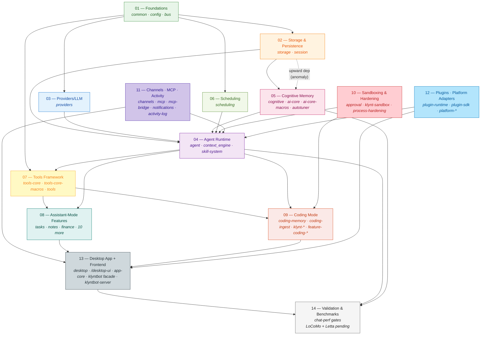

# KlyntBot — Architecture Overview

> **Status:** Stable (overall) — see per-subsystem badges in [Subsystem inventory](#subsystem-inventory).
> **Last verified:** 2026-05-17 (post-KCA-bench removal — workspace now 64 crates; subsystem 14 awaiting LoCoMo + Letta replacement).
> **Authoritative.** If this document disagrees with `CLAUDE.md`, `README.md`, or `AGENTS.md`, **this document wins** — those files lag and need a refresh pass. See [Document maintenance](#document-maintenance).

This file is the single entry point for understanding the project. It is intentionally long. Use the table of contents to jump.

---

## Contents

1. [TL;DR](#tldr)
2. [Read this if you're…](#read-this-if-youre)
3. [The picture](#the-picture)
4. [Mental model](#mental-model)
5. [Subsystem inventory](#subsystem-inventory)
6. [Critical-crate index](#critical-crate-index)
7. [Status badge legend](#status-badge-legend)
8. [Cross-cutting findings](#cross-cutting-findings)
9. [Storage layout](#storage-layout-klyntbot)
10. [End-to-end: assistant-mode chat turn](#end-to-end-assistant-mode-chat-turn)
11. [End-to-end: coding-mode chat turn](#end-to-end-coding-mode-chat-turn)
12. [End-to-end: reforge nightly cycle](#end-to-end-reforge-nightly-cycle)
13. [Extension points](#extension-points)
14. [Dev/prod isolation](#devprod-isolation)
15. [Build, test, validate](#build-test-validate)
16. [What's intentionally not in this system](#whats-intentionally-not-in-this-system)
17. [Glossary](#glossary)
18. [Open questions & debt](#open-questions--debt)
19. [Document maintenance](#document-maintenance)

---

## TL;DR

KlyntBot is a **local-first personal cognitive agent OS for macOS**, written in Rust and shipped as a single Tauri 2 desktop binary. It connects ~5 chat platforms (Telegram, Discord, Slack, Email, plus the desktop UI itself) to LLM providers (Anthropic, OpenAI, local MLX), with task/project/notes/finance management, persistent **cognitive memory** (FSRS5 decay, episodic/semantic extraction, Louvain community detection, personalized-pagerank retrieval), and a nightly self-improvement loop (**reforge**) that rewrites its own strategy files. All state lives in SQLite (WAL) + LanceDB under `~/.klyntbot/`.

It is **not** a chat wrapper. It is a **64-crate Rust workspace** with a dedicated agent runtime, a unified cognitive memory system (LoCoMo + Letta external evaluations pending — see [Subsystem 14](./subsystems/14-validation.md)), an embedded MCP server, a WASM plugin runtime, and a coding-mode that ingests events from 5 different external CLIs (Claude Code, Codex, kimi-cli, opencode, plus git post-commit hooks).

---

## Read this if you're…

| You are… | Start here | Then go to |
|---|---|---|
| **External evaluator / open-source visitor** | [TL;DR](#tldr) → [The picture](#the-picture) → [Cross-cutting findings](#cross-cutting-findings) | [README.md](../../README.md) for install instructions |
| **New contributor (human)** | Read top to bottom | Pick a subsystem from [the inventory](#subsystem-inventory), open `subsystems/NN-name.md` |
| **AI agent (Claude Code session)** | [Subsystem inventory](#subsystem-inventory) → [Critical-crate index](#critical-crate-index) → [Extension points](#extension-points) | The specific subsystem doc, plus `CLAUDE.md` for build commands |
| **Future-you (solo dev memory aid)** | [Cross-cutting findings](#cross-cutting-findings) → [Open questions & debt](#open-questions--debt) | `TECH_DEBT.md` |

---

## The picture

### Subsystem dependency map

The codebase is best understood as **14 subsystems** that sit in a partially ordered dependency stack. Lower subsystems are imported by higher ones; cross-stack arrows show non-obvious dependencies.



**Read it as:** dependencies flow upward. `Foundations` is at the bottom; nothing depends on `Validation & Benchmarks` (they sit at the top as consumers of everything). The dotted line marks the one known dependency-direction anomaly: `storage` depends on `ai-core` (which lives logically higher up in the stack — see [Cross-cutting finding #3](#3-migration-debt-in-flight)).

### Same picture, one layer deeper

```mermaid
flowchart LR
    subgraph SHELL ["Tauri shell + frontend"]
        DSK[desktop binary]
        UI[/desktop-ui<br/>React 19 + Vite]
        FAC[klyntbot facade<br/>klyntbot-server]
    end
    subgraph CORE ["Integration"]
        AC[app-core<br/>handlers + init]
    end
    subgraph RUNTIME ["Runtime + Cognition"]
        AGL[AgentLoop / AgentRuntime]
        CE[ContextEngine]
        SR[SkillRouter]
        EXC[ExecutionCore<br/>ReAct loop]
        PROV[ProviderRouter]
        COG[Cognitive memory<br/>+ Reforge]
    end
    subgraph EXT ["External I/O"]
        CH[Channels<br/>TG/DC/SL/EM]
        MCP[MCP server + client]
        BR[mcp-bridge<br/>Unix socket]
        NOT[Notifications<br/>OS + tray]
    end
    subgraph SYS ["System"]
        SQL[(SQLite WAL<br/>data.db)]
        LAN[(LanceDB<br/>lance/)]
        FS[~/.klyntbot/]
        LLM[LLM API]
    end

    UI --> DSK
    DSK --> AC
    FAC --> AC
    AC --> AGL
    AGL --> EXC
    AGL --> SR
    AGL --> CE
    EXC --> PROV
    PROV --> LLM
    AGL --> COG
    CE --> COG
    COG --> SQL
    COG --> LAN
    AC --> SQL
    AC --> FS
    CH --> AC
    MCP --> AC
    BR -.events.-> MCP
    NOT --> FS
```

---

## Mental model

The fastest way to think about KlyntBot is **three concentric rings**:

1. **The bus & store at the center.** Every signal eventually lands in `bus::DomainEventBus` (an in-process pub/sub) and persists into `~/.klyntbot/data.db` (SQLite) plus `~/.klyntbot/lance/` (vectors). Nearly every subsystem either publishes to or subscribes from the bus.
2. **The runtime + cognition ring.** When a message arrives (from any channel), `AgentRuntime` (in the `agent` crate) classifies intent via `SkillRouter`, assembles context via `ContextEngine` (token-budget-aware), and routes the LLM call via `ProviderRouter`. The result, tool calls, and side-effects feed back into `Cognitive` for memory extraction. Nightly, `Reforge` re-reads recent behavior and rewrites strategy files.
3. **The integration ring.** `app-core` is the actual integration crate — every handler lives there. The `desktop` binary is a thin Tauri adapter. Channels (Telegram, MCP, etc.) are thin adapters too. **The root `klyntbot` crate is a partial re-export facade, not a full integration point** — despite what CLAUDE.md says.

### Two operating modes

Sessions are tagged `assistant` or `coding` at creation and the mode is **immutable**. The two modes share infrastructure but use distinct entry points, distinct tool sets, and distinct system prompts (the "soul"):

- **Assistant mode** — the personal-agent surface. Tools like `tasks`, `notes`, `finance`, `memory`, `agent`. System prompt at `~/.klyntbot/KLYNTBOT.md`. Channels: all (TG/DC/SL/EM/desktop UI).
- **Coding mode** — the Claude-Code-style surface. Tools like `bash`, `read`, `edit`, `coding_todo`, `coding_task_*`. System prompt at `~/.klyntbot/KLYNTBOT-coding.md`. Channels: desktop UI only.

Tools declare `allowed_channels = "non_coding" | "coding_only" | "all"` so the LLM in coding mode literally never sees assistant-mode tools.

### How memory works

KlyntBot doesn't have "a memory feature." It has a **layered memory system**:

| Layer | Where | What it stores |
|---|---|---|
| **Working memory** | `agent::ContextEngine` | The current turn's assembled context (live, token-budgeted) |
| **Session history** | `storage::SessionRepo`, table `messages` | Every turn, every tool call, every tool result |
| **Cognitive episodic** | `cognitive::repos::episodic_memory` | Extracted episodes — "what happened" |
| **Cognitive semantic** | `cognitive::repos::semantic_memory` + LanceDB | Extracted facts — "what's true" |
| **Procedural memory** | `cognitive::repos::procedural_rule` | Distilled rules — "what to do when…" |
| **Skill effectiveness** | `cognitive::mirror::sources::skill_effectiveness` | (currently stub — `TODO(T7)`) |
| **Strategy files** | `~/.klyntbot/strategy/*.md`, archived in DB | Long-form rewriteable agent behavior, owned by `reforge` |

Chat-runtime perf gates (`./scripts/run_chat_perf_gates.sh`) catch TTFT / throughput / coalescer regressions. Memory-quality gates are pending — the previous KCA bench suite was removed 2026-05-17; LoCoMo (mem0) + Letta external evaluations are planned (see [Subsystem 14](./subsystems/14-validation.md)).

---

## Subsystem inventory

Each subsystem has a dedicated deep-dive at `docs/architecture/subsystems/NN-name.md`.

| #  | Subsystem | Status | Crates |
|---:|---|---|---|
| 01 | **Foundations** | 🟢 Stable | `common`, `config`, `bus` |
| 02 | **Storage & Persistence** | 🟢 Stable | `storage`, `session` |
| 03 | **Providers (LLM)** | 🟢 Stable | `providers` |
| 04 | **Agent Runtime** | 🟢 Stable | `agent`, `context_engine`, `skill-system` |
| 05 | **Cognitive Memory & Self-Improvement** | 🟡 In Progress | `cognitive`, `ai-core`, `ai-core-macros`, `autotuner` |
| 06 | **Scheduling & Automation** | 🟡 In Progress | `scheduling` *(dual-scheduler migration mid-flight)* |
| 07 | **Tools Framework** | 🟢 Stable | `tools-core`, `tools-core-macros`, `tools` |
| 08 | **Assistant-Mode Features** | 🟢 Stable *(mostly)* | `feature-tasks`, `feature-notes`, `feature-productivity`, `feature-finance`, `feature-focus`, `feature-coaching`, `feature-learning`, `feature-language-learning`, `feature-insights`, `feature-alarms`, `feature-launcher`, `voice-engine`, `analytics` |
| 09 | **Coding Mode** | 🟡 In Progress | `klynt-core`, `coding-agents-md`, `coding-ingest`, `coding-memory`, `feature-coding-bash`, `feature-coding-todo`, `klynt-protocol`, `klynt-hooks`, `klynt-execpolicy`, `klynt-skill-loader`, `klynt-pty`, `klynt-git-utils`, `klynt-truncation`, `lsp-client` |
| 10 | **Sandboxing & Process Hardening** | 🟢 Stable | `approval`, `klynt-sandbox`, `klynt-sandbox-helper`, `klynt-process-hardening` |
| 11 | **Channels, MCP & Activity** | 🟡 In Progress | `channels`, `notifications`, `mcp`, `mcp-bridge`, `activity-log` |
| 12 | **Plugin System & Platform Adapters** | 🟠 Scaffolded | `plugin-runtime`, `plugin-sdk`, `platform-input`, `platform-capture`, `platform-macos` |
| 13 | **Desktop App & Frontend** | 🟢 Stable | `desktop`, `desktop-shared`, `desktop-macros`, `crates/desktop-ui` *(stub)*, `/desktop-ui` *(root TS)*, `app-core`, `klyntbot` *(facade)*, `klyntbot-server` |
| 14 | **Validation & Benchmarks** | 🟠 Scaffolded *(replacement pending)* | *none — chat-perf via `scripts/run_chat_perf_gates.sh`; LoCoMo + Letta wiring pending* |

**Status counts:** 8 Stable, 4 In Progress, 2 Scaffolded, 0 Stub-only, 0 Deprecated subsystems.

---

## Critical-crate index

These **11 crates** each get a dedicated deep-dive at `docs/architecture/crates/CRATE.md`. They were chosen because their internals are touched constantly and "just read the source" doesn't scale.

| Crate | Lives in | Why critical |
|---|---|---|
| **`agent`** | Subsystem 04 | Owns `AgentLoop`, `AgentRuntime`, `ExecutionCore`, `SubagentRuntime`, all handler adapters. Every message passes through. The builder (`agent_loop/builder.rs`) wires every crate together at startup. |
| **`app-core`** | Subsystem 13 | The actual integration crate. Imports every feature, holds `AppCore`, orchestrates init. CLAUDE.md misattributes this role to the `klyntbot` facade. |
| **`cognitive`** | Subsystem 05 | Louvain community detection (394-line first-party impl), PPR retrieval (404-line first-party impl), reforge nightly cycle (16 phase markers, 3 LLM calls at handler level). Most complex internal service graph in the workspace. |
| **`context_engine`** | Subsystem 04 | Token budgeting, `TieredHistoryCompressor`, query enhancement, `InsightForge` retrieval pipeline. Mid-loop compression interacts with this from the `agent` side — interaction is non-obvious. |
| **`storage`** | Subsystem 02 | Every data path. Surprise: depends upward on `ai-core`. Legacy `content` column is still mirrored on every message write. |
| **`providers`** | Subsystem 03 | `LlmProvider` trait + Anthropic native + OpenAI adapter + circuit breaker + role routing + cache breakpoint synthesis. The fan-out point for every LLM call. |
| **`tools-core`** | Subsystem 07 | `Tool` / `FeaturePackage` / `ToolRegistry` / `ApprovalClass` traits. Changing anything here has workspace-wide blast radius. |
| **`mcp`** | Subsystem 11 | The external trust boundary. Tool exposure (whitelist), sampling delegation (LLM-to-LLM), circuit breaker, server-side approval *(currently always-decline placeholder)*. |
| **`coding-memory`** | Subsystem 09 | Distiller + Reforge phases + recall service + 15 MCP tools + symbol extraction. `SessionEndPass` and `CrossSessionDedup` are fully implemented; `CodingSynthesisPhase` and `RuleArtifactGenerationPhase` in `reforge_phase.rs` remain stubbed. |
| **`coding-ingest`** | Subsystem 09 | Owns `AgentEvent`, the `klyntbot-hook` binary, the daemon socket, and **5 ingest adapters** (`claude_code`, `codex`, `kimi_cli`, `opencode`, `git_post_commit` — CLAUDE.md says 4). |
| **`desktop`** | Subsystem 13 | The single deployable binary. Owns startup sequencing (hardening → mimalloc → AppCore → Tauri), the sub-10ms `--hook` short-circuit, and the MCP serve subcommand. |

---

## Status badge legend

Used at the top of every component doc and in the [Subsystem inventory](#subsystem-inventory).

| Badge | Meaning | When to use |
|---|---|---|
| 🟢 **Stable** | Implemented, tested, in production use. Bug-fix territory only. | Default for shipped features. |
| 🟡 **In Progress** | Implemented but actively evolving. APIs may change. May have known gaps. | Features with open migration debt or phased rollouts. |
| 🟠 **Scaffolded** | Infrastructure exists but not wired to user-visible functionality. | E.g. `platform-capture` is real and tested but no agent tool routes to it yet. |
| 🔴 **Stub** | Returns hardcoded/empty results. Marked `TODO`, `unimplemented!()`, or `NotImplementedInPhase`. | E.g. `lsp-client` methods, plugin `agent_ask_user` host function. |
| ⚫ **Deprecated** | Replaced; awaiting deletion. Don't add to it. | E.g. `LEGACY_COMMAND_NAMES` const in `desktop`. |

Each doc carries a `Status last verified: YYYY-MM-DD` line so readers know how stale the badge might be.

---

## Cross-cutting findings

Read these even if you skip everything else. They are the things no single subsystem owns, but every reader needs to know.

### 1. Doc drift audit (resolved)

The first pass of this doc system uncovered ~20 specific drift items between `CLAUDE.md` / `README.md` and the actual code: wrong crate count (`39 → 66`), stale layer model (`9 layers → 14 subsystems`), a fictional `SkillRouter` algorithm, wrong reforge phase count (`9 → 16`), wrong constant names (`INTERACTIVE_TOOL_TIMEOUT → LONG_RUNNING_TOOL_TIMEOUT`), a fictional `ANTHROPIC_CONTEXT_WINDOW` constant, wrong CSS framework (`"Plain CSS. No Tailwind"` while Tailwind was wired via `@tailwindcss/vite`), wrong bundle-budget number (`30 kB → 350 kB`), wrong perf-gate threshold (`15ms → 25ms`), wrong ingest-adapter count (`4 → 5`), references to nonexistent files (`kca-game-changer.md`, computer-use design spec), and the long-since-removed `MirrorEngine::start` `Arc<DomainEventBus>` parameter.

**All resolved** in the doc-alignment commits on 2026-05-17 (`6223d2fd3` + the quick-win sweep). The contract going forward: **`docs/architecture/` is authoritative**; if CLAUDE.md or README.md disagree, fix them. New drift gets logged under [`TECH_DEBT.md` § Documentation drift](./TECH_DEBT.md#5-documentation-drift).

**This document promotes the 14-subsystem map as the primary mental model.** Layers are kept only as a secondary "build order" annotation in [The picture](#the-picture).

### 2. Half-built features documented as if shipped

Multiple components have honest-looking type signatures, are referenced in CLAUDE.md or README.md, and have **stub bodies** that do nothing real. The most consequential:

| Component | File | Reality |
|---|---|---|
| `lsp-client` (all methods) | `crates/lsp-client/src/lib.rs:42,59`, `server_pool.rs:24,58,86` | Diagnostics, document symbols, server pool — all `TODO(T5)` stubs returning empty. |
| Notification channels for Telegram/Discord/Email | `crates/notifications/src/channel/mod.rs:64` | Concrete types exist but **not wired** into `NotificationDispatcher`. Alarms with those channel bits silently go nowhere. |
| MCP server approval | `crates/mcp/src/server/approval.rs:6,21` | `BlockingFallbackChannel` always returns Decline; remote MCP clients can never get approval. |
| 2 Reforge phases in `coding-memory` (legacy trait stubs) | `crates/coding-memory/src/reforge_phase.rs` | `CodingSynthesisPhase` (2.5) and `RuleArtifactGenerationPhase` (3.5) return `NotImplementedInPhase { required_phase: 5 }`. **However**, real implementations exist in `reforge/coding_synthesis.rs` and `reforge/rule_artifacts.rs` and are wired into `app-core::CodingPhaseRunnerImpl`. `SessionEndPass` and `CrossSessionDedup` in `reforge/` are fully implemented. |
| `InProcess` hook execution mode | `crates/klynt-protocol` + `crates/klynt-hooks` | Variant exists in `HookExecutionMode` enum but no dispatch path implements it — only `Subprocess` is wired. |
| `Hook.fail_open` field | `crates/klynt-hooks/src/engine/dispatcher.rs` | Field in schema is ignored; fail-open is hardcoded — hook errors are silently dropped regardless. Security implication: hooks can't actually enforce. |
| Plugin `agent_ask_user` host function | `crates/plugin-runtime/src/host/mod.rs:477` | Returns `"agent callbacks not connected"` unconditionally. Granting `Agent` permission to a plugin does nothing. |
| Voice phoneme alignment / F0 extraction | `crates/voice-engine/src/{phoneme_aligner,tone_analyzer}.rs` | Pronunciation scoring runs without real alignment data. |
| Computer Use (platform layer) | `crates/platform-macos/src/computer_use/` | Capture + input + AX tree walker are real, **but no agent tool, Tauri command, or MCP tool calls them.** |
| NSWorkspace observers | `crates/platform-macos/src/lifecycle.rs:176` | Stubbed; `// TODO: wire objc2 blocks`. |
| kimi-cli + opencode hook adapters | `crates/coding-ingest/src/hook_cli.rs` | Listed in `--help` USAGE as supported sources but short-circuit with `"poll-only (Phase 7)"`. Real ingestion happens via background pollers. |

See `TECH_DEBT.md` for the full list and severity guesses.

### 3. Migration debt in flight

Several long-running rewrites are visible in the source today:

- **Scheduling has two runners side-by-side.** `app-core/init/cron.rs` runs `CronExecutor`; `app-core/init/temporal_scheduler.rs` runs `TemporalScheduler`. Phase 3 (consolidating callbacks → bus subscribers) is incomplete. **Bonus:** the runtime log line at `temporal_scheduler.rs:99` says `"side-by-side with CronService"` — `CronService` was already removed; the actual pair is `TemporalScheduler` + `CronExecutor`. Stale text in production logs.
- **`storage` → `ai-core` is an upward dependency.** Confirmed at `crates/storage/Cargo.toml:7`. Anomaly vs the layer model — `ai-core` is logically higher.
- **Legacy `content` column mirroring.** `SessionRepo` still mirrors `Text` parts into the legacy `messages.content` column on every write (`crates/storage/src/repos/session.rs:914,933,966`). Reads fall back to wrapping legacy `content` in a `Text` part.
- **`LEGACY_COMMAND_NAMES` is dead-but-not-deleted.** `crates/desktop/src/lib.rs:16-19` — the array is empty; the comment says "Deleted in Phase E"; awaiting final removal.
- **`feature-tasks` query fallback to legacy summary** — `crates/feature-tasks/src/tool/actions/query.rs:203-209` falls back to legacy status-based summary when the new path fails.
- **`intent_pipeline` is vestigial.** `SourceContext::intent_summary` exists but is always `None`. The agent runtime is now fully flat; the field is dead but not deleted.

### 4. `desktop-ui` location confusion

The crate at `crates/desktop-ui/` is a **Specta-generated bindings stub** containing only `src/bindings.ts`. **The actual React frontend lives at the repo root: `/desktop-ui/`** (sibling of `Cargo.toml`, NOT inside `crates/`). Path aliases (`@/*`, `@app/*`, etc.) are relative to `/desktop-ui/src/`. Anyone — human or AI — looking inside `crates/desktop-ui/` for component source will find nothing useful. CLAUDE.md hints at this in its "Path aliases" section but doesn't make the structural distinction explicit.

### 5. 5 coding-ingest adapters, not 4

CLAUDE.md (under "Coding-memory Phase 7") lists 4 ingest adapters: `claude_code`, `codex`, `kimi_cli`, `opencode`. The actual count is **5** — `git_post_commit` is a standalone `.rs` file (not a subdirectory under `adapters/`) so it's easy to miss. All 5 implement `IngestAdapter` and emit `AgentEvent` tagged with `AgentSource`.

The root `klyntbot` facade (`src/lib.rs`) is also a partial re-export, not a full one as CLAUDE.md implies — only ~18 of 64 workspace crates are re-exported.

---

## Storage layout (`~/.klyntbot/`)

Everything KlyntBot persists lives under a single directory. Dev mode uses `~/.klyntbot-dev/` (or whatever `KLYNTBOT_HOME` points to).

```
~/.klyntbot/
├── config.json                          ← Config schema (camelCase JSON, hot-reloaded)
├── KLYNTBOT.md                          ← Assistant-mode system prompt ("soul")
├── KLYNTBOT-coding.md                   ← Coding-mode system prompt
├── data.db                              ← SQLite WAL (the main database)
├── lance/                               ← LanceDB vector store
│   ├── episodic_memory/
│   ├── semantic_memory/
│   └── notes_embeddings/
├── sessions/                            ← File-based session artefacts (not the canonical session log — that's in data.db)
├── workspace/                           ← Project workspace root for the agent
├── plugins/                             ← Discovered at startup; each plugin is a directory
│   └── <plugin-id>/
│       ├── plugin.wasm
│       └── klyntbot.plugin.json         ← Manifest
├── personas/                            ← Persona configs for the squad-chat feature
├── strategy/                            ← Strategy files (markdown, owned + rewritten by reforge)
├── skills/                              ← User-scoped skills (discovery root #1)
├── project-skills/                      ← Reforge-private per-repo skills (discovery root #2)
├── mcp-events.sock                      ← Unix socket; mcp-bridge IPC (4-byte LE length-prefixed JSON, 1MB cap)
├── .claude-code-integration-offered     ← One-time marker: don't auto-`claude mcp add` again
└── logs/
    └── (tracing logs, if file-sink enabled)
```

**Inside `data.db`** (50+ tables — selected highlights):
- `sessions` (with `mode CHECK ('assistant' | 'coding')`, `last_event_at` for zombie detection)
- `messages` (with `parts` JSON column + legacy `content` mirror)
- `tasks`, `projects`, `areas`, `okrs`, `notes`, `notebooks`, `entity_mentions`
- `transactions`, `accounts`, `budgets`, `portfolios`, `goals`
- `episodic_memory`, `semantic_memory`, `procedural_rule`, `semantic_edges`, `community_membership`
- `cron_jobs`, `scheduled_fires`, `alarms`, `focus_sessions`
- `approval_grants`, `approval_history`
- `reforge_suggestions`, `strategy_records`
- `coding_snapshots`, `coding_thread_messages`, `coding_tool_calls`
- `web_tree_memories` *(reserved for procedural-memory feature — schema present, usage TBD)*
- `mirror_*` (8 tables — engagement/effectiveness/skill signals for reforge)

---

## End-to-end: assistant-mode chat turn

What happens when a user sends a message in assistant mode, from keystroke to rendered response.

```mermaid
sequenceDiagram
    autonumber
    actor U as User
    participant FE as Frontend<br/>(/desktop-ui)
    participant DC as Tauri command<br/>(desktop crate)
    participant ACH as AppCore.chat_send
    participant TR as AssistantThreadRuntime
    participant AR as AgentRuntime
    participant CE as ContextEngine
    participant PR as ProviderRouter
    participant LLM as LLM API
    participant TG as ApprovalGate
    participant TX as Tool.execute()
    participant COG as Cognitive
    participant ST as Storage

    U->>FE: Type + Send
    FE->>DC: invoke("chat_send", {thread, msg})
    DC->>ACH: chat_send(...)
    ACH->>ST: insert user message + parts
    ACH->>TR: start_turn(...)
    Note over TR: rejects if active turn exists<br/>(double-send guard)
    TR->>AR: process(turn)
    AR->>CE: build_system_prompt<br/>(reads KLYNTBOT.md live;<br/>injects all skill summaries via SkillListingSource —<br/>model selects via skill_reference tool, NOT a router)
    AR->>CE: assemble_context<br/>(token-budgeted)
    AR->>PR: chat_completion(messages, tools, budget)
    PR->>LLM: HTTPS (Anthropic native or OpenAI-compatible)
    LLM-->>PR: response (text or tool_use blocks)
    PR-->>AR: response
    alt tool_use blocks present
        loop up to MAX_CONCURRENT_TOOLS=10 in parallel
            AR->>TG: ApprovalGate.check(tool, args, class)
            alt Approved (Safe or persistent grant)
                TG-->>AR: Approved
                AR->>TX: execute(args)
                Note over TX: 30s default timeout<br/>(600s for ask_user)
                TX-->>AR: ToolOutput::Text (≤50_000 bytes; truncated past)
                AR->>COG: live signals → DomainEventBus
            else Denied
                TG-->>AR: Denied
                AR-->>TR: emit Terminal{Error}
            end
        end
        AR->>CE: live_context_refresh<br/>(drain ContextUpdateQueue)
        Note over AR,CE: If tokens > 70% of context window:<br/>MidLoopCompressor replaces older<br/>tool results with summaries
        AR->>PR: next iteration
    else text response
        Note over AR: terminal — synthesize final message
    end
    AR->>ST: persist assistant message
    AR->>COG: extract episodic + semantic memories
    AR-->>TR: emit Terminal{Done}
    TR-->>FE: ThreadEvent::Terminal (Tauri channel "thread:event")
    FE-->>U: render
    Note over COG: async — episodic extraction,<br/>semantic edges, salience decay<br/>continue in background
```

**Key constants** (see [`subsystems/04-agent-runtime.md`](./subsystems/04-agent-runtime.md#key-constants-with-fileline) for file:line):
- `MAX_CONCURRENT_TOOLS = 10`
- `MAX_TOOL_RESULT_LENGTH = 50_000` bytes
- `LONG_RUNNING_TOOL_TIMEOUT = 600s` (only for interactive tools — `ask_user`)
- Default `tool_timeout = 30s`
- `COMPRESSION_THRESHOLD = 0.70`
- `MIN_RECENT_MESSAGES = 8` (preserved verbatim by `MidLoopCompressor`)
- `DEFAULT_TURN_CAP = 500` (subagents only — **main agent has no turn cap**)
- Context window: provided by `RuntimeConfig.context_window` (NOT a named `ANTHROPIC_CONTEXT_WINDOW` constant)

**Behavioral features** (see [`subsystems/04-agent-runtime.md`](./subsystems/04-agent-runtime.md) for details):
- **Focus-session message deferral** — `AgentLoop` buffers inbound messages when `FocusSessionStarted` fires on `DomainEventBus`, sends a single auto-reply per `(channel, sender)`, and drains the queue on `FocusSessionEnded`.
- **Predictive cache warming (KCA Track 7)** — After each completed turn, a detached `tokio::spawn` calls `LlmQueryPredictorHandler::predict_next` to pre-retrieve memories for predicted follow-up queries, storing them in `PredictiveCache` for potential cache hits on the next turn.

**Heartbeat & cancellation:**
- Backend emits `ThreadEvent::Heartbeat` every 30s.
- Frontend `useThreadWatchdog` resets a 90s timer per heartbeat; fires if no heartbeat while `isProcessing=true`.
- `chat_cancel(thread_id)` → `CancellationToken::cancel()`; observed at iteration boundary (in-flight tools run to their timeout before cancellation takes effect).

---

## End-to-end: coding-mode chat turn

Coding mode uses a different `ThreadRuntime` (`CodingThreadRuntime`), a different soul (`KLYNTBOT-coding.md`), and a different tool set (gated by `allowed_channels = "coding_only"`).

```mermaid
sequenceDiagram
    autonumber
    actor U as User
    participant FE as Frontend<br/>(coding feature)
    participant DC as Tauri command
    participant ACH as AppCore.coding_thread_start
    participant CTR as CodingThreadRuntime
    participant TH as turn_handler
    participant AR as AgentRuntime
    participant K as klynt-core<br/>(bash/read/edit/...)
    participant SB as klynt-sandbox<br/>(Seatbelt / Landlock)
    participant CI as coding-ingest
    participant CM as coding-memory
    participant ST as Storage

    U->>FE: Send (with optional file context)
    FE->>DC: invoke("coding_thread_start")
    DC->>ACH: coding_thread_start(...)
    Note over ACH: walks AGENTS.md tree<br/>(coding-agents-md crate)<br/>→ synthetic user message
    ACH->>CTR: start_turn(...)
    CTR->>TH: handle_turn
    TH->>AR: process(turn, coding context)
    AR->>K: tool calls (bash, read, edit, grep, ...)
    K->>SB: prepare sandbox (macOS Seatbelt .sbpl;<br/>Linux: Landlock + bwrap via helper)
    SB-->>K: sandboxed exec
    K-->>AR: ToolOutput
    Note over K,CI: tool events also emitted via<br/>coding-ingest as AgentEvent
    CI->>CM: ingest (Distiller → facts → recall index)
    AR->>ST: persist messages + snapshots (ghost commits if in git)
    AR-->>CTR: emit Terminal{Done}
    CTR-->>FE: ThreadEvent::Terminal
```

**Coding-mode specifics worth knowing:**
- **Snapshot rewind has two modes.** Rows with non-NULL `ghost_commit_sha` restore via `klynt_git_utils::restore_ghost_commit` (git working-tree restore). Rows with NULL fall back to the original BLOB path. Deleting `.git/` between snapshot and rewind makes ghost-mode rewind fail silently.
- **5 ingest adapters** (not 4): `claude_code`, `codex`, `kimi_cli`, `opencode`, `git_post_commit`. All poll-only except `claude_code` (hook-driven).
- **Cross-CLI normalization invariant.** `parse(serialize(event)) == event` — enforced by proptest at `crates/coding-ingest/tests/cross_cli_normalization.rs`.
- **Reforge writes go through `coding_memory::reforge::ReforgeWriter`.** Raw `DELETE` is rejected; removal must use `valid_until + superseded_by`.

---

## End-to-end: reforge nightly cycle

Triggered by the `JOB_REFORGE_NIGHTLY` cron at **03:00 local** (registered in `app-core/init/cron.rs`). The actual cycle has grown to **16 phase markers** (the file's own doc comment still says "8 phases" — stale).

```
[ 03:00 ] Reforge cycle starts (cognitive/services/reforge/service.rs::run_reforge)
   │       — 26-parameter signature; most params are Option<&dyn Trait> extension hooks
   │
   ├─ Phase 1   Collect ............................. Read strategy files + behavioral feedback + mirror signals
   ├─ Phase 2   Synthesize ..................[LLM #1] ReforgeHandler::synthesize (T=0.2, max_tokens=4096)
   ├─ Phase 2.5 Coding Synthesis ........[hook]....... CodingPhaseRunner::run_synthesis
   ├─ Phase 2.6 Cross-CLI transfer ......[hook]....... CrossCliPhaseRunner::run_cross_cli_transfer
   ├─ Phase 3   Review ......................[LLM #2] ReforgeHandler::review
   ├─ Phase 3.5 Rule Artifact Generation .[hook]...... CodingPhaseRunner::run_rule_artifacts
   ├─ Phase 3.6 Skill discovery ..........[hook]...... SkillDiscoveryRunner::run_skill_discovery
   ├─ Phase 4   Narrate .....................[LLM #3] ReforgeHandler::narrate (free text)
   ├─ Phase 5   Apply ............................... Persist reforge_suggestions + rewrite strategy files
   ├─ Phase 6   Optimize ..................[hook].... AutotunerBridge::{run_evaluation, create_trials}
   │                                                  + CodingPhaseRunner::run_selective_delete
   ├─ Phase 6.5  Graph Consolidation ......[hook]..... GraphEnrichmentHandler::enrich_graph
   ├─ Phase 6.5b Community Intelligence ...[hook]..... CommunityIntelligenceHandler::analyze_communities
   │                                                  (uses Louvain — 394 LOC first-party impl)
   ├─ Phase 6.5 ext Cross-session fact dedup [hook]... CodingPhaseRunner::run_cross_session_dedup
   ├─ Phase 6.7 Community Summaries ................. Deterministic; env-gated KCA_COMMUNITY_SUMMARIES=1
   ├─ Phase 7   Compact ............................. Trim retired data; rebuild indexes
   └─ Phase 7.7 Compression ......................... Deterministic dedup; env-gated KCA_REFORGE_COMPRESS=1
```

**3 LLM calls at the `ReforgeHandler` level** (Synthesize / Review / Narrate). Hook traits may add their own LLM calls in the agent layer; the actual call count depends on which hooks are wired.

**6 extension hook traits**: `ReforgeHandler`, `AutotunerBridge`, `GraphEnrichmentHandler`, `CommunityIntelligenceHandler`, `CodingPhaseRunner`, `CrossCliPhaseRunner`, `SkillDiscoveryRunner`. Each is `Option<&dyn Trait>` on `run_reforge` — the cycle degrades gracefully when a handler isn't installed.

PPR (404 LOC) is **not used in reforge** — it runs at retrieval time via `UnifiedMemoryService`. Don't confuse the two.

See [`subsystems/05-cognitive-memory.md`](./subsystems/05-cognitive-memory.md#the-reforge-cycle--all-16-phases) for the full per-phase reference.

---

## Extension points

How to add a new piece of functionality without breaking the system.

### Add a new tool (assistant or coding mode)

1. Pick the right crate:
   - Assistant-mode domain tool → likely a new `feature-*` crate, OR add to `crates/tools/src/domain/`.
   - Coding-mode tool → add to `crates/klynt-core/src/tools/`.
2. Implement with `#[derive(Tool)]` + `#[derive(ToolParams)]` from `tools-core-macros`. Multi-action tools use `#[tool_actions]` + `#[derive(ActionParams)]`.
3. Declare `approval_class` (Safe / Sensitive / Destructive / Admin) on the `Tool` trait.
4. Declare `allowed_channels` (`"all"` / `"non_coding"` / `"coding_only"`).
5. Wire it. **Four possible paths (this is non-obvious):**
   - **Path A (standard):** Implement `FeaturePackage::tools()` in your `feature-*` crate. Most tools use this.
   - **Path B (heavy deps):** Wire directly in `crates/agent/src/agent_loop/builder.rs` — used by `TaskTool`, `AlarmTool`, `LearningTool` because they need embedding, progress handler, alarm writer, domain bus.
   - **Path C (app-core init):** Wire in `crates/app-core/src/init/mod.rs` — used by `LauncherTool`. Architectural anomaly; not recommended.
   - **Path D (per-subagent):** Wire in `crates/agent/src/subagent.rs` — used by `AgentTaskTool`. Only for tools that need per-invocation context.
6. (Optional) Expose via MCP: add the registry name to `default_exposed_tools()` in `crates/config/src/schema/mcp.rs`. Plural/singular must match (`tasks` not `task`).
7. (Optional) Add migrations via `FeaturePackage::migrations()`.

### Add a new chat platform channel

1. Create or extend a crate under `crates/channels/src/adapters/`.
2. Implement the `Channel` trait (`crates/channels/src/lib.rs`).
3. Add config schema fields under `Config::channels::<platform>`.
4. Register in `ChannelManager`.
5. If the channel supports interactive forms, implement `supports_interaction` + `send_interaction`.
6. **Don't forget the notification side.** Even if your channel works for inbound/outbound chat, the notification *fan-out* (alarms, reminders) is currently unwired for TG/DC/EM. See `crates/notifications/src/channel/mod.rs:64`.

### Add a new skill

Skills are markdown files with YAML frontmatter (Agent Skills spec).

1. Drop a `SKILL.md` into one of four discovery roots (priority order):
   - `~/.klyntbot/skills/` — User
   - `~/.klyntbot/project-skills/{repo_id}/` — ReforgePrivate
   - `{repo_root}/.klyntbot/skills/` — Project
   - `{repo_root}/.klyntbot/team-skills/` — ReforgeTeam
2. The **six** built-in orchestrator skills live at `/skills/` (in-repo): `task-management`, `finance-management`, `automation`, `notebook`, `learning`, `coding-orchestrator`. (CLAUDE.md says 5 — stale.)
3. Skills declare `mcp_tools` to whitelist MCP tool access (`["*"]` = all, `[]` = none).
4. All skill summaries are auto-injected into the system prompt via `SkillListingSource`; the model loads full bodies on demand via the `skill_reference` tool. **No `SkillRouter` with keyword + semantic scoring exists** — the runtime is fully flat. CLAUDE.md's older description was stale.

### Add a WASM plugin

1. Use `crates/plugin-sdk` (re-exports `extism-pdk`) in a `cdylib`.
2. Implement plugin functions; declare permissions in `klyntbot.plugin.json` manifest (Network / Storage / Agent).
3. Drop `plugin.wasm` + manifest into `~/.klyntbot/plugins/<plugin-id>/`.
4. **Restart the desktop app** — there is no hot-reload.
5. **Caution:** the `Agent` permission grants nothing functional today (`agent_ask_user` host function is stubbed — `crates/plugin-runtime/src/host/mod.rs:477`).

### Add a Tauri command

Two macros enforce the surface — direct `#[tauri::command]` is **forbidden** in `crates/desktop/src/commands/` (a test fails if present).

- `#[klynt_command]` — happy path. Async, no `state` param, bare `T` return.
- `#[klynt_raw_command]` — sync, non-AppCore state, `rename_all`, etc.

After adding, list the function path in `desktop_macros::klynt_collect_commands![...]` in `specta_builder.rs`, then run `cargo tauri dev` once to regenerate `desktop-ui/src/bindings.ts`. The `registration_drift` and `bindings_are_current` tests fail until both steps are done.

### Add a context source

1. Implement `ContextSource` trait (in `context_engine`).
2. Register in `ContextEngine` (via `AppCore` init).
3. Token budget allocation is handled by `BudgetAllocator`.
4. Higher priority numbers win when budget is tight. `SoulContextSource` is the highest-priority built-in.

---

## Dev/prod isolation

Production: `~/.klyntbot/` — config + data + plugins.

Dev: set `KLYNTBOT_HOME=~/.klyntbot-dev` (via `.env` at repo root, or env var). Everything is mirrored under the dev directory — config, data.db, sessions, workspace, lance, plugins, personas. **Nothing in dev mode touches production state.**

The `.env` at repo root is auto-loaded. Typical contents:

```bash
KLYNTBOT_HOME=/Users/<you>/.klyntbot-dev
RUST_LOG=info,klyntbot=debug
```

Environment overrides for config follow the `KLYNTBOT_AGENTS__DEFAULTS__MODEL=gpt-4o` pattern (double underscore = nested key).

### `KCA_*` runtime feature flags

11 env-only flags control live agent + cognitive behavior. They are **not** in `config.json` — they are toggles for phased rollouts, escape hatches, and runtime tracing. All are optional; omitting them keeps default behavior.

> **Naming note:** these all retain the `KCA_*` prefix from when they shipped alongside the now-removed `kca-bench` / `kca-e2e` benchmark suite (deleted 2026-05-17). The prefix will be renamed (or each flag hard-coded into defaults) in a separate cleanup pass once the LoCoMo + Letta external evaluations are wired.

| Flag | Crate | Default | Effect |
|---|---|---|---|
| `KCA_DISABLE_COMPRESSION=1` | `context_engine` | off | Skips tiered history compression — verbatim history mode |
| `KCA_PHASE_4=1` | `agent` | off | Enables Phase-4 Letta-style memory-refusal recovery nudge |
| `KCA_PHASE_4_TOOL_DRIVEN=1` | `agent` | off | Uses tool-call nudge instead of text nudge |
| `KCA_PHASE_4_LEGACY_NUDGE=1` | `agent` | off | Falls back to legacy A/B nudge text |
| `KCA_COMMUNITY_SUMMARIES=1` | `cognitive` | off | Enables community summary generation in reforge |
| `KCA_REFORGE_COMPRESS=1` | `cognitive` | off | Enables LLM merge compression in reforge |
| `KCA_EPISODIC_THRESHOLD=<f32>` | `cognitive` | 0.3 | Overrides episodic memory importance threshold |
| `KCA_TRACE_FSRS=1` | `cognitive` | off | Emits per-card FSRS trace logs to stderr |
| `KCA_VECTOR=<provider>` | `app-core` | default | Forces a specific embedding provider |
| `KCA_OPENAI_EMBED_MODEL=<model>` | `tools/embedding` | default | Overrides OpenAI embedding model |
| `KCA_FACT_SEARCH_HANDLER=1` | `agent` | off | Routes fact search through handler path |

---

## Build, test, validate

Full quickstart in `CLAUDE.md`; condensed here:

```bash
cargo build --workspace
cargo nextest run --workspace                      # All tests, parallel
cargo nextest run -p agent                         # Single crate
cargo test --workspace --doc                       # Doctests (nextest doesn't support these)
cargo clippy --workspace --all-targets --all-features   # Must be 0 warnings
cargo fmt --all --check
cd desktop-ui && bun install && bun run build      # Frontend (bun, never npm)
cargo tauri dev                                    # Full app
```

**Validation gates.** The previous `run_kca_validation.sh` merge-gate script was removed 2026-05-17 along with the `kca-bench` and `kca-e2e` crates — replacement is LoCoMo (mem0) + Letta external evaluations, wiring pending. See [`subsystems/14-validation.md`](./subsystems/14-validation.md). Until those land, the enforced gates are chat-runtime only:

```bash
./scripts/run_chat_perf_gates.sh        # TTFT p95, stream throughput, relay cleanup, coalescer p95
./scripts/run_chat_proptest_soak.sh     # 10,000-case event-sequence invariants (release branches)
```

| Chat-perf gate | Threshold | Enforced? |
|---|---|---|
| Stream throughput | ≥ 5,000 evt/s | ✅ Yes |
| Relay cleanup (mean) | ≤ 1 ms | ✅ Yes |
| Coalescer p95 (10k chunks) | ≤ 16 ms | ✅ Yes |
| **TTFT p95** | `THRESHOLD_TTFT_P95_MS=25` ms | 🔴 **No** — "numeric gate deferred to PR8"; script runs the bench but never fails |
| **Bundle budget** | threads route ≤ 350 kB gzipped, total ≤ 2.5 MB | 🔴 **Not in any script** — `.size-limit.json` exists but is manually invoked via `bun run size-limit` |

**Dependency hygiene** (run before releases):

```bash
cargo machete                          # Fast unused-dep static check
cargo +nightly udeps --workspace       # Slower; compiler-driven
```

---

## What's intentionally not in this system

These are deliberate non-goals — not missing features.

- **Structured observability (OpenTelemetry, Prometheus, metrics dashboards).** This is a single-user local app. Existing `tracing` logs + `PipelineEvent` SSE stream are sufficient.
- **Windows / Linux desktop support.** macOS only. Linux has partial sandbox support via Landlock for the coding-mode sandbox helper, but the app itself is macOS.
- **A network plugin registry.** Plugins are loaded from disk only.
- **Backwards-compatibility migrations pre-1.0.** Schema can be altered in-place. After 0.1.0 release, this becomes a hard rule with versioned migrations.
- **An external `klynt-cli` binary.** The 2026-04-23 spec for this is explicitly deprecated; coding-mode runs through the desktop binary's `--hook` short-circuit instead.
- **Hot-reload for plugins.** Restart required.
- **Built-in AI task automations** (`plan_day`, `decompose`, `execute`, `suggest`, forecasting). Removed 2026-04-20. Compose via cron + skills + the `agent` tool instead.

---

## Glossary

| Term | Meaning |
|---|---|
| **KCA** | Klynt Cognitive Architecture — historical name for the cognitive memory subsystem + its (now-removed) custom bench suite. The bench crates were deleted 2026-05-17; LoCoMo + Letta external evaluations are pending. Some runtime feature flags retain the `KCA_*` prefix pending rename. |
| **FSRS5** | Free Spaced Repetition Scheduler v5 — the algorithm used for memory salience decay. |
| **Louvain** | Community-detection algorithm used on the semantic graph (first-party impl in `cognitive`). |
| **PPR** | Personalized PageRank — graph-traversal retrieval over the semantic graph (first-party impl in `cognitive`). |
| **Reforge** | The nightly self-improvement cycle (03:00 local). **16 phase markers, 3 LLM calls at the handler level, 6 extension hook traits.** Rewrites strategy files. |
| **Mirror** | Event-driven self-reflection subsystem (`cognitive::mirror`). **8 unconditional signal sources + 2 conditional + 1 stub.** Does NOT require `Arc<DomainEventBus>` (was removed). |
| **Soul** | The system prompt — `~/.klyntbot/KLYNTBOT.md` (assistant) or `KLYNTBOT-coding.md` (coding). Live-read with mtime caching. |
| **ReAct loop** | Reason + Act — the agent's iterative tool-calling loop. Implemented in `crates/agent/src/execution/`. |
| **Skill** | A markdown file (Agent Skills spec) with YAML frontmatter. Discovered from 4 roots; orchestrator skills load full body, others inject summary. |
| **Distiller** | The component (in `coding-memory`) that turns raw `AgentEvent`s from CLI adapters into structured coding-memory facts. |
| **MCP** | Model Context Protocol. KlyntBot has both an MCP server (exposes tools to Claude Code etc.) and an MCP client (consumes external MCP servers). Server exposure is **runtime-computed**: `default_exposed_tools()` returns empty Vec; `app-core` post-init fills it with `AiFeatureRegistry::tool_names()` ∪ `EXPLICIT_TOOL_ALLOWLIST` (which adds `memory`, `agent`, `annotate`, `cron`, `alarm`, `mirror`, `temporal`, `launcher`, plus 8 coding-memory recall tools). |
| **mcp-bridge** | Bespoke Unix-socket IPC (NOT the MCP wire format). Lets the standalone `klyntbot mcp serve --stdio` child receive live Tauri events from the desktop parent. |
| **AppCore** | The actual integration crate (`app-core`). Holds shared business logic; desktop commands are thin adapters that delegate. |
| **Ghost commit** | A snapshot mechanism for coding-mode rewinds. Stores git working-tree state via `klynt-git-utils::restore_ghost_commit` so undo doesn't need full file BLOBs. |
| **AVR cascade** | Accessibility tree → local VLM → cloud VLM. The planned perception pipeline for Computer Use (designed, not yet wired). |
| **Activity log** | The unified work-context graph (`activity-log` crate). Normalizes chat messages, tool calls, and window events into `WorkContext` / `WorkResource` / `ResourceEdge` rows. |

---

## Open questions & debt

The living debt inventory lives at [`TECH_DEBT.md`](./TECH_DEBT.md). Highlights:

- **`lsp-client` is a stub.** Diagnostics, document symbols, server pool — all `TODO(T5)`. If you call any method on it today you get an empty result.
- **Notification fan-out for TG/DC/EM is unwired.** Chat works; alarm dispatch over those channels doesn't.
- **MCP server-side approval always declines.** Remote MCP clients cannot get approval for sensitive tools.
- **Voice pronunciation pipeline is half-built.** Phoneme alignment + F0 contour extraction are TODOs; scoring runs without real data.
- **Scheduling dual-run.** `CronExecutor` and `TemporalScheduler` both run; Phase 3 consolidation incomplete.
- **`storage` depends upward on `ai-core`.** Architectural anomaly. Decide whether to invert (move trait to `common`?) or formalize.
- **Tool wiring has 4 different paths** (`FeaturePackage`, `agent::builder`, `app-core::init`, `subagent`). Decide if the inconsistency should be normalized.
- **`feature-insights`, `feature-learning`, `feature-alarms`** don't follow the `FeaturePackage` pattern. Misleading naming convention.
- **`ToolOutput::Structured` is defined but never produced** in production. Half-built upgrade path.
- **`ConcurrencyClass` enum in `bus`** is not consumed by `Tool` — `Tool` uses `is_concurrency_safe(args) -> bool` instead. Decide which to keep.
- **Computer Use platform layer is real, but not wired.** No agent tool, Tauri command, or MCP tool routes to `MacCapture` / `MacInput` / `walk_focused_app`. See [`subsystems/12-plugins-platform.md`](./subsystems/12-plugins-platform.md#computer-use-wiring-status) for the full inventory of what exists vs what's missing.
- **Two distinct `AutotunerBridge` traits** with the same name (`cognitive/services/reforge/mod.rs` vs `cognitive/mirror/types.rs`). Rename one to disambiguate.
- **Two `retrievability` functions** with different formulas — `fsrs5::retrievability` (power-law) for flashcards, `decay::retrievability` (exponential) for retrieval scoring. Easy to import the wrong one.
- **`run_reforge` has 26 parameters.** Refactor candidate (e.g., `ReforgeContext` builder).
- **`intent_pipeline` is vestigial.** `SourceContext::intent_summary` is always `None`; the runtime is flat. Decide: delete or repurpose.
- **Two `AlarmFired` `kind` strings** (`cron_job` vs `cron`) — internal dispatch vs user-facing notifications. Easy to confuse.
- **Doc drift.** First-pass audit fixed 2026-05-17 — see [Finding #1](#1-doc-drift-audit-resolved). Going forward: re-drift gets caught in [`TECH_DEBT.md` § Documentation drift](./TECH_DEBT.md#5-documentation-drift).

---

## Document maintenance

### When does this doc go stale

- A subsystem is added, removed, or significantly restructured.
- A new "critical crate" emerges (or a current one drops in importance).
- The status badge for any subsystem changes.
- A cross-cutting finding is resolved (e.g. the layer-model drift gets fixed in CLAUDE.md).
- The reforge phase count, agent execution constants, or validation gate thresholds change.

### How to update

1. Bump `Last verified: YYYY-MM-DD` at the top.
2. Update the section that changed.
3. If a subsystem boundary moved, update the master Mermaid diagram **and** the relevant subsystem doc(s).
4. If a critical-crate doc gets stale, update the per-crate doc — the index here links to it.
5. If a TECH_DEBT.md item is closed, remove it from there and update the [Cross-cutting findings](#cross-cutting-findings) if relevant.

### Validation

After substantive edits, validate by:

1. Running through the [Read this if you're…](#read-this-if-youre) jump table mentally — does each audience get what they need?
2. Asking a fresh Claude Code session: "Can you summarize the project architecture from `docs/architecture/00-overview.md`?" If the summary misses something important, fix the doc.
3. Spot-checking file:line references — files move; line numbers drift.

### Who owns this

The author of the change owns the doc update. There is no separate "docs team." A PR that changes architecture without updating this doc should be considered incomplete.
