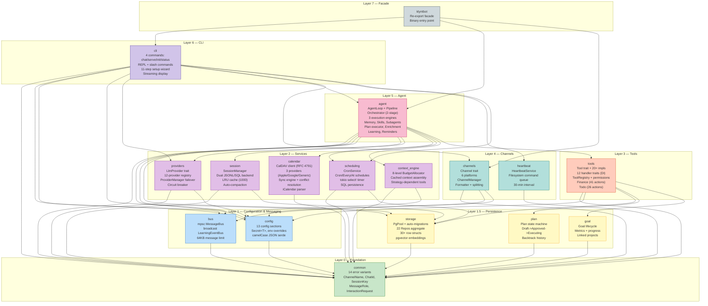
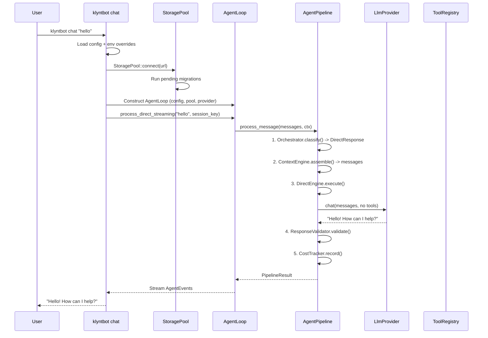
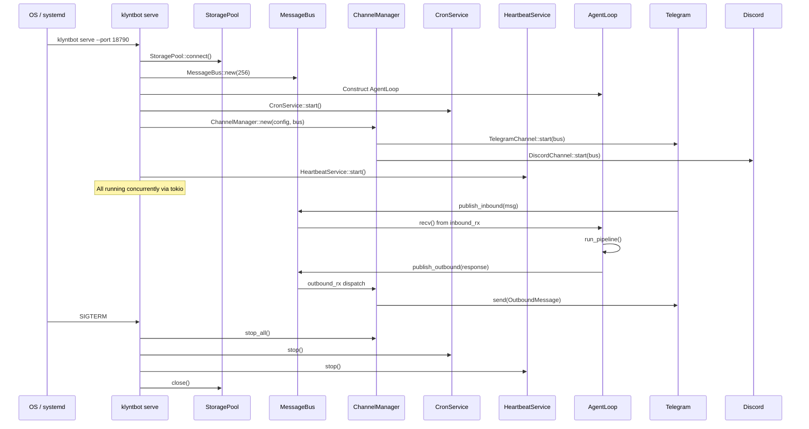
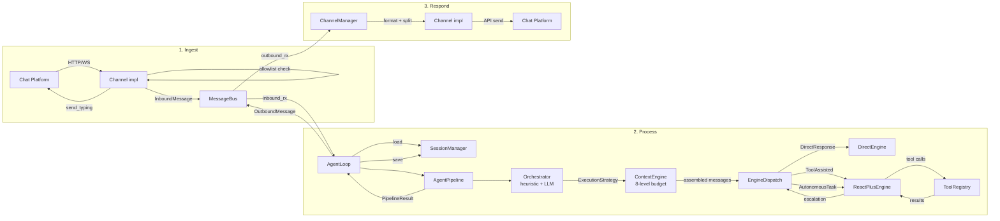

# Klyntbot System Overview

> **Version:** 0.4.0 (PostgreSQL era)
> **Codebase:** 16 crates, 359 Rust files, ~87K lines of source
> **Generated:** 2026-02-20

---

## Table of Contents

1. [What Is Klyntbot?](#1-what-is-klyntbot)
2. [Architecture Diagram](#2-architecture-diagram)
3. [Dependency Layer Map](#3-dependency-layer-map)
4. [Crate Summary Matrix](#4-crate-summary-matrix)
5. [Execution Flows](#5-execution-flows)
   - 5.1 [CLI Chat Flow](#51-cli-chat-flow)
   - 5.2 [Serve Daemon Flow](#52-serve-daemon-flow)
   - 5.3 [Message Lifecycle (Channel to Response)](#53-message-lifecycle-channel-to-response)
6. [Key Architectural Patterns](#6-key-architectural-patterns)
7. [Cross-Cutting Concerns](#7-cross-cutting-concerns)
8. [Feature Inventory](#8-feature-inventory)
9. [Detailed Documentation Index](#9-detailed-documentation-index)

---

## 1. What Is Klyntbot?

Klyntbot is a **Rust AI agent framework** — a single binary that:

- Connects to **6 chat platforms** (Telegram, Discord, Slack, WhatsApp, Email, QQ)
- Routes messages through a **5-stage orchestration pipeline** (classify -> assemble context -> execute -> validate -> track cost)
- Calls **12+ LLM providers** with automatic failover and circuit breaker
- Executes **20+ tools** (file I/O, shell, web, todo, projects, calendar, finance, memory, plans, goals, learning)
- Manages **persistent state** in PostgreSQL with pgvector for semantic search
- Runs **cron jobs**, **calendar sync**, **reminders**, and **adaptive learning** in the background

Two user-facing entry points: `klyntbot chat` (interactive REPL / one-shot) and `klyntbot serve` (multi-channel daemon).

---

## 2. Architecture Diagram



---

## 3. Dependency Layer Map

```
Layer 7: klyntbot ─── Re-export facade + binary entry point
    │
Layer 6: cli ─── 4 CLI commands, REPL, 11-step wizard
    │
Layer 5: agent ─── AgentLoop, Pipeline, Orchestrator, 3 engines, Memory, Skills
    │
Layer 4: channels, heartbeat ─── 6 platform adapters, daemon health
    │
Layer 3: tools ─── Tool trait, 20+ implementations, 12 DI handler traits
    │
Layer 2: providers, session, scheduling, calendar, context_engine ─── LLM, sessions, cron, CalDAV, budgets
    │
Layer 1.5: storage, plan, goal ─── PostgreSQL repos, state machines
    │
Layer 1: config, bus ─── Config schema, message passing
    │
Layer 0: common ─── Error types, domain newtypes, utilities
```

**Key rule:** Dependencies flow strictly upward. No circular dependencies — enforced by Cargo workspace.

**The dependency inversion trick:** Tools (Layer 3) define handler traits (`SpawnHandler`, `CronHandler`, `CalendarHandler`, etc.) that are implemented by agent (Layer 5). Injected as `Arc<dyn Trait>` at construction. This lets tools call upward without creating cycles.

---

## 4. Crate Summary Matrix

| Crate | Layer | Files | Lines | Key Types | Purpose |
|-------|-------|-------|-------|-----------|---------|
| `common` | 0 | 16 | 4.0K | `KlyntbotError`, `Result<T>`, `ChannelName`, `ChatId`, `SessionKey`, `MessageRole` | Error hierarchy, domain newtypes, utilities |
| `config` | 1 | 16 | 3.7K | `Config`, `Secret<T>` | 13-section config schema, env overrides, Secret wrapper |
| `bus` | 1 | 4 | 0.7K | `MessageBus`, `InboundMessage`, `OutboundMessage`, `LearningEventBus` | mpsc channel broker + broadcast learning events |
| `storage` | 1.5 | 48 | 8.4K | `StoragePool`, `Repos`, 22 `*Repo` structs, 30+ `*Row` structs | PostgreSQL + pgvector, auto-migrations, repository pattern |
| `plan` | 1.5 | 3 | 0.5K | `Plan`, `PlanStep`, `PlanStatus`, `BacktrackEntry` | Plan state machine (Draft->Approved->Executing->Completed/Failed) |
| `goal` | 1.5 | 3 | 0.4K | `Goal`, `GoalStatus`, `Metric`, `GoalProgress` | Strategic goal lifecycle with metrics |
| `providers` | 2 | 7 | 4.5K | `LlmProvider`, `ProviderRegistry`, `ProviderManager`, `LlmResponse` | 12 LLM backends, auto-detection, failover, circuit breaker |
| `session` | 2 | 2 | 1.1K | `Session`, `SessionManager` | Dual JSONL/SQL backend, LRU cache, auto-compaction |
| `scheduling` | 2 | 5 | 1.4K | `CronService`, `CronJob`, `CronSchedule` | Persistent cron with At/Every/Cron schedules |
| `calendar` | 2 | 14 | 3.3K | `CalendarProvider`, `CalDavClient`, `CalendarEvent`, `SyncState` | CalDAV (RFC 4791), 3 providers, two-way sync |
| `context_engine` | 2 | 6 | 1.6K | `ContextEngine`, `BudgetAllocator`, `ExecutionStrategy` | 8-level token budget, cached context assembly |
| `tools` | 3 | 48 | 18.3K | `Tool`, `ToolRegistry`, `RoutingContext`, 20+ tool structs | Tool trait + all implementations, handler traits (DI) |
| `channels` | 4 | 11 | 5.1K | `Channel`, `ChannelManager`, `DynChannel` | 6 platform adapters, formatter, message splitting |
| `heartbeat` | 4 | 2 | 0.2K | `HeartbeatService` | Filesystem-as-command-queue daemon health |
| `agent` | 5 | 58 | 15.5K | `AgentLoop`, `AgentPipeline`, `Orchestrator`, `EngineDispatch` | The brain: orchestration, execution, memory, skills, learning |
| `cli` | 6 | 49 | 18.9K | `Cli`, `Commands`, `WizardModule` | 4 commands, REPL, 11-step wizard, interactive prompts |

---

## 5. Execution Flows

### 5.1 CLI Chat Flow



### 5.2 Serve Daemon Flow



### 5.3 Message Lifecycle (Channel to Response)



---

## 6. Key Architectural Patterns

### 6.1 Dependency Inversion (Layers 3<->5)

Tools (Layer 3) define handler traits; agent (Layer 5) implements them. Injected as `Arc<dyn Trait>` at construction:

| Trait | Defined in (L3) | Implemented by (L5) | Purpose |
|-------|-----------------|---------------------|---------|
| `SpawnHandler` | `tools::spawn` | `agent::SubagentManager` | Background subagent spawning |
| `CronHandler` | `tools::cron_tool` | `scheduling::CronService` | Cron job CRUD |
| `CalendarHandler` | `tools::calendar_tool` | `agent::CalendarSyncAdapter` | CalDAV sync operations |
| `EnrichmentHandler` | `tools::enrichment` | `agent::EnrichmentEngine` | AI task field inference |
| `FinanceHandler` | `tools::finance_handler` | `agent::FinanceHandlerImpl` | Autonomous finance behaviors |
| `GoalHandler` | `tools::goal_tool` | `agent::GoalHandlerImpl` | Strategic goal management |
| `LearningHandler` | `tools::learning_tool` | `agent::LearningHandlerImpl` | Adaptive learning |
| `PlanHandler` | `tools::plan_tool` | `agent::PlanHandlerImpl` | Plan lifecycle |
| `PlanCompletionHandler` | `tools::plan_tool` | `agent::GoalHandlerImpl` | Plan->Goal completion |
| `EmbeddingHandler` | `tools::embedding_engine` | `tools::EmbeddingEngineImpl` | Todo embedding |
| `ConversationEmbeddingHandler` | `tools::conversation_embedding` | `agent::ConversationEmbeddingHandlerImpl` | Conversation embedding |
| `EnrichmentFeedbackHandler` | `tools::learning_feedback` | `agent::LearningHandlerImpl` | Enrichment feedback loop |

### 6.2 Repository Pattern (PgPool is Clone+Send+Sync)

All persistent state goes through `*Repo` structs holding `PgPool` (internally `Arc`). No `Arc<RwLock<Store>>` needed. The `Repos` aggregate provides convenient access to all 22 repositories from a single `Repos::from_pool(&pool)` call.

### 6.3 Two-Stage Orchestrator

1. **Heuristic pre-filter**: Pattern match on keywords (greetings, plan keywords, tool keywords, etc.) -> instant strategy classification, zero LLM cost
2. **LLM classifier fallback**: Only for ambiguous messages. Uses structured JSON output with confidence score. Below 0.5 confidence defaults to `ToolAssisted { max_iterations: 5 }`

### 6.4 Engine Escalation Chain

```
DirectEngine -> ReactPlusEngine(5 iters) -> ReactPlusEngine(50 iters)
```

Escalation is automatic: DirectEngine escalates if the LLM attempts tool calls. ReactPlus escalates at 80% of max iterations. Cap: 2 escalations.

### 6.5 Zero-Copy Message Passing

`Arc<Vec<Message>>` is passed between engines. Escalation uses `Arc::clone` (O(1)) rather than deep copy. Ownership transferred via `Arc::try_unwrap` when moving forward.

---

## 7. Cross-Cutting Concerns

### Error Handling

- **Centralized**: All errors convert to `KlyntbotError` (14 variants) in `common` crate
- **Domain sub-errors**: 9 sub-error enums (`ToolError`, `ProviderError`, `ChannelError`, etc.) auto-convert via `#[from]`
- **Storage exception**: `StorageError` uses manual `From` impl to keep `sqlx` out of `common`
- **Convention**: Use `common::Result<T>` everywhere

### Configuration

- **Single file**: `~/.klyntbot/config.json` (camelCase)
- **13 sections**: agents, channels, providers, tools, gateway, todo, confidence, calendar, project, conversation, learning, finance, provider_manager
- **Minimal diff save**: Only non-default values written to disk
- **Env overrides**: `KLYNTBOT_` prefix with `__` nesting separator
- **Secret wrapper**: API keys in `Secret<String>` — redacted in Debug/Display, explicit `.expose()` for access

### Logging

- **tracing + tracing-subscriber** with env-filter
- Log levels by command: `chat` -> warn (clean REPL), `serve --verbose` -> debug, default -> info
- Terminal utilities: spinners, tables, markdown, thinking renderer, color support

### Security

- `Secret<T>` prevents accidental credential logging
- Channel allowlists enforce per-platform access control
- Shell tool deny-list blocks dangerous commands (rm -rf, sudo, fork bombs, etc.)
- Telegram formatter escapes HTML injection
- Email requires explicit consent flag
- Tool permissions enforce per-channel privilege levels (ReadOnly < Standard < Elevated < Admin)

### Testing

- Unit tests: `#[cfg(test)] mod tests` inline in each crate
- Integration tests: `tests/` directory using facade crate
- `cargo nextest` for parallel execution
- PostgreSQL required for storage/integration tests
- Shared mock provider in `tests/mock_provider.rs`

---

## 8. Feature Inventory

| Feature | Subsystem | Crates Involved |
|---------|-----------|----------------|
| Multi-channel chat | Channels | channels, bus, agent, cli |
| LLM provider routing | Providers | providers, config |
| Failover + circuit breaker | Providers | providers (ProviderManager) |
| Tool execution | Tools | tools, agent (ExecutionCore) |
| Task management (26 actions) | Todo | tools (TodoTool), storage, agent (enrichment) |
| Project management | Projects | tools (ProjectTool), storage |
| Semantic search (pgvector) | Search | tools (embedding_engine), storage, context_engine |
| Conversation memory | Memory | tools (MemoryTool, ConversationEmbedding), agent (MemoryStore) |
| Multi-step plans | Planning | plan, tools (PlanTool), agent (plan_executor, plan_runner) |
| Strategic goals | Goals | goal, tools (GoalTool), agent (GoalHandlerImpl) |
| Calendar sync (CalDAV) | Calendar | calendar, tools (CalendarTool), agent (CalendarSyncAdapter) |
| Cron scheduling | Scheduling | scheduling, tools (CronTool), agent (CronHandlerAdapter) |
| Personal finance (41 actions) | Finance | tools (FinanceTool, PriceService), storage, agent (FinanceHandlerImpl) |
| Adaptive learning | Learning | tools (LearningTool), agent (LearningService), bus (LearningEventBus) |
| Task enrichment (AI) | Enrichment | tools (enrichment), agent (EnrichmentEngine) |
| Subagent spawning | Subagents | tools (SpawnTool), agent (SubagentManager) |
| Reminders + notifications | Reminders | agent (ReminderEngine, NotificationDispatcher) |
| Interactive setup wizard | Setup | cli (wizard, 11 steps) |
| Skills system | Skills | agent (SkillManager), skills/ directory |
| Heartbeat daemon health | Operations | heartbeat |
| Streaming responses | UX | agent (AgentEvent), cli (StreamRenderer) |

---

## 9. Detailed Documentation Index

| Document | Covers | Key Highlights |
|----------|--------|----------------|
| [01-core-infrastructure.md](01-core-infrastructure.md) | common, config, bus, storage | Error hierarchy (14 variants + 9 sub-errors), config schema (13 sections), MessageBus design, 22-repo Repos aggregate, pgvector conditional setup, 7 migrations |
| [02-agent-core.md](02-agent-core.md) | agent, context_engine, session | AgentLoop lifecycle, 5-stage pipeline, 2-stage orchestrator, 3 execution engines (Direct/ExecutionCore/ReactPlus), 8-level budget allocator, SessionManager dual backend, enrichment/learning/reminders subsystems |
| [03-tools-extensions.md](03-tools-extensions.md) | tools, plan, goal | Tool trait interface, 20+ tool implementations, 12 handler traits (DI), permission system (4 levels), FinanceTool (41 actions), TodoTool (26 actions), plan state machine, goal lifecycle |
| [04-channels-io.md](04-channels-io.md) | channels, heartbeat, cli | Channel trait, 6 platform integrations (auth/connection/formatting), ChannelManager dispatch, HeartbeatService filesystem queue, CLI 4 commands, REPL, 11-step wizard system |
| [05-domain-features.md](05-domain-features.md) | calendar, scheduling, providers, finance | CalDAV (RFC 4791) with 3 providers, CronService timer loop, 12-provider registry with auto-detection, ProviderManager circuit breaker, finance domain model (7 structs, 10 enums), PriceService (3 APIs) |
