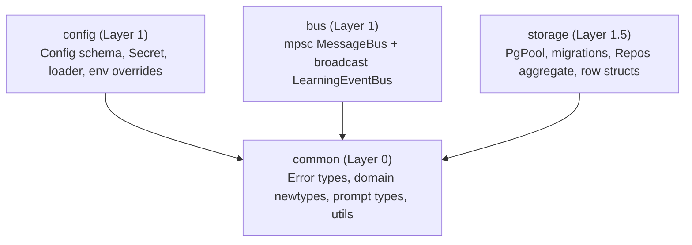
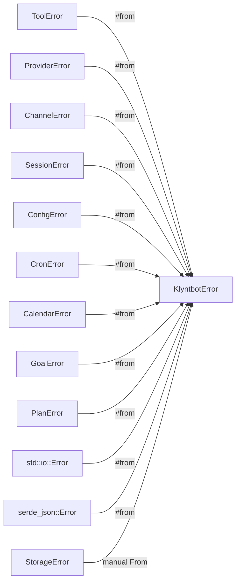
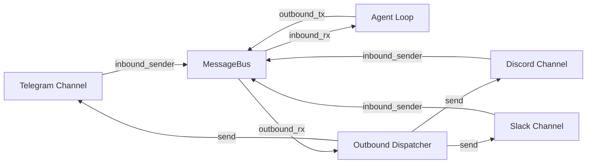
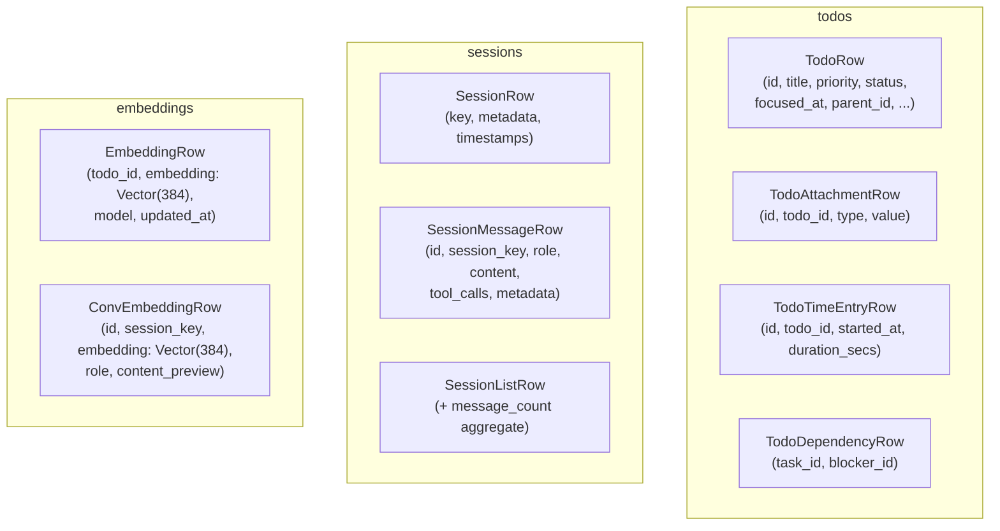
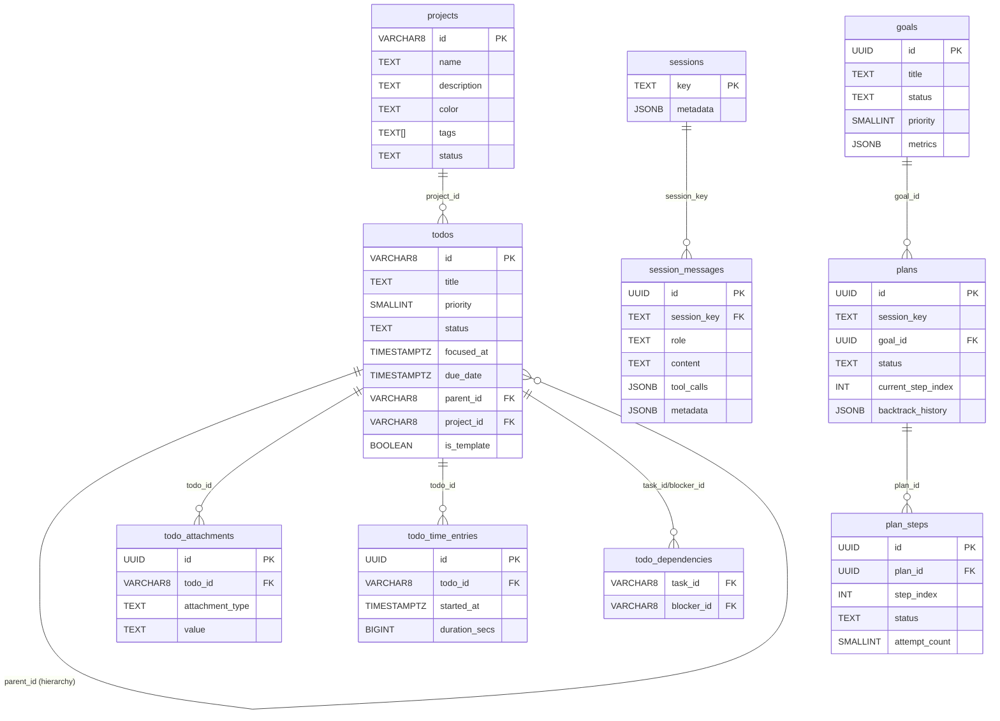
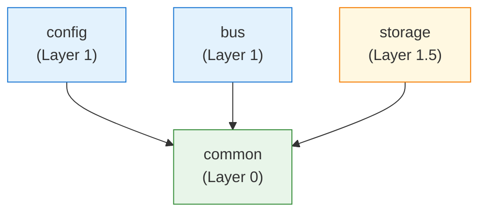

# Core Infrastructure — Architecture Analysis

> Crates: `common`, `config`, `bus`, `storage`
> Layer: 0–1.5 (foundation layers, no upstream workspace deps)
> Total: ~4 crates, ~17K lines of Rust + SQL

---

## Table of Contents

1. [Overview](#overview)
2. [common — Layer 0](#common--layer-0)
   - [Error hierarchy](#error-hierarchy)
   - [Core domain types](#core-domain-types)
   - [Interactive prompts](#interactive-prompts)
   - [Utilities](#utilities)
3. [config — Layer 1](#config--layer-1)
   - [Root Config struct](#root-config-struct)
   - [Config sections](#config-sections)
   - [Secret\<T\> wrapper](#secrett-wrapper)
   - [Loading & saving](#loading--saving)
   - [Environment variable overrides](#environment-variable-overrides)
4. [bus — Layer 1](#bus--layer-1)
   - [MessageBus (mpsc)](#messagebus-mpsc)
   - [LearningEventBus (broadcast)](#learningeventbus-broadcast)
   - [Event types](#event-types)
5. [storage — Layer 1.5](#storage--layer-15)
   - [StoragePool & migration system](#storagepool--migration-system)
   - [StorageError & conversion](#storageerror--conversion)
   - [Repository pattern & Repos aggregate](#repository-pattern--repos-aggregate)
   - [Row structs](#row-structs)
   - [Database schema overview](#database-schema-overview)
   - [pgvector & semantic search](#pgvector--semantic-search)
6. [Cross-crate dependency graph](#cross-crate-dependency-graph)
7. [Key design decisions](#key-design-decisions)

---

## Overview



These four crates form the sealed foundation of the workspace. All higher-level crates (providers, session, agent, channels, etc.) import from them; they never import from higher layers.

---

## common — Layer 0

**Path:** `crates/common/`
**Key exports:** `KlyntbotError`, `Result<T>`, `ChannelName`, `ChatId`, `SessionKey`, `MessageRole`, `InteractionRequest`, `FormResponse`

### Error hierarchy

`common` owns the entire error hierarchy. All errors ultimately convert to `KlyntbotError`.

```rust
pub enum KlyntbotError {
    Bus(String),
    BusDisconnected,
    Tool(#[from] ToolError),
    Provider(#[from] ProviderError),
    Channel(#[from] ChannelError),
    Session(#[from] SessionError),
    Config(#[from] ConfigError),
    Cron(#[from] CronError),
    Calendar(#[from] CalendarError),
    Goal(#[from] GoalError),
    Plan(#[from] PlanError),
    Storage(String),
    StorageNotFound(String),
    StorageConflict(String),
    Io(#[from] std::io::Error),
    Json(#[from] serde_json::Error),
}

pub type Result<T> = std::result::Result<T, KlyntbotError>;
```

Sub-error types are domain-specific error enums, each implementing `std::error::Error` via `thiserror`. They auto-convert to `KlyntbotError` via `#[from]` attributes:

| Sub-error type | Variants | Auto-converts via |
|---|---|---|
| `ToolError` | `NotFound`, `InvalidParams`, `ExecutionFailed`, `PermissionDenied` | `#[from] ToolError` |
| `ProviderError` | `Http`, `InvalidResponse`, `RateLimited`, `AuthFailed` | `#[from] ProviderError` |
| `ChannelError` | `ConnectionFailed`, `SendFailed`, `InvalidConfig` | `#[from] ChannelError` |
| `SessionError` | `NotFound`, `LoadFailed`, `SaveFailed`, `Io`, `Json` | `#[from] SessionError` |
| `ConfigError` | `NotFound`, `Invalid`, `MissingField`, `Io`, `Json` | `#[from] ConfigError` |
| `CronError` | `InvalidExpression`, `JobNotFound`, `ExecutionFailed`, `Io`, `Json` | `#[from] CronError` |
| `CalendarError` | `AuthFailed`, `ConnectionFailed`, `SyncFailed`, `NotFound`, `ProtocolError`, `Io`, `Json` | `#[from] CalendarError` |
| `GoalError` | `NotFound`, `InvalidState`, `StoreFailed`, `ValidationFailed` | `#[from] GoalError` |
| `PlanError` | `NotFound`, `GenerationFailed`, `InvalidState`, `ExecutionStalled`, `BacktrackLimitReached`, `StoreFailed` | `#[from] PlanError` |

`StorageError` (from the `storage` crate) is **not** a variant; instead it converts via a manual `From<StorageError> for KlyntbotError` impl in `storage/src/error.rs`, mapping:
- `StorageError::NotFound` → `KlyntbotError::StorageNotFound`
- `StorageError::Conflict` → `KlyntbotError::StorageConflict`
- all other `StorageError` → `KlyntbotError::Storage`



### Core domain types

All domain types are **newtypes** over `String`, deriving `Clone`, `PartialEq`, `Eq`, `Hash`, `Serialize`, `Deserialize`. They have `From<String>`, `From<&str>`, and `Display` impls.

```rust
pub struct ChannelName(String);   // e.g., "telegram", "discord"
pub struct ChatId(String);        // platform-specific chat identifier
pub struct SessionKey(String);    // composite "channel:chat_id"

pub enum MessageRole {
    System, User, Assistant, Tool
}
```

**`SessionKey`** is notable: it's constructed from a `(ChannelName, ChatId)` pair and can be split back:

```rust
impl SessionKey {
    pub fn new(channel: &ChannelName, chat_id: &ChatId) -> Self {
        Self(format!("{}:{}", channel.as_str(), chat_id.as_str()))
    }
    pub fn split(&self) -> Option<(ChannelName, ChatId)> { ... }
}
```

**`MessageRole`** has two parsing modes:
- `From<&str>`: lenient — unknown strings silently default to `User` (warn via `tracing`)
- `parse_strict(&str) -> Result<Self>`: strict — unknown strings return `Err(KlyntbotError::Bus(...))`

Use `parse_strict` at system boundaries (e.g., when deserializing external data). Use `From<&str>` for internal defaults.

### Interactive prompts

`common/src/prompts.rs` defines the typed form system used by the `ask_user` tool:

```rust
pub struct InteractionRequest {
    pub title: String,
    pub questions: Vec<Question>,  // 1–4 questions
}

pub struct Question {
    pub id: String,          // machine-readable key
    pub title: String,       // ≤12 char tab label
    pub text: String,        // full question text
    pub answer_type: AnswerType,
}

pub enum AnswerType {
    SingleSelect { options: Vec<AnswerOption> },
    MultiSelect  { options: Vec<AnswerOption> },
    YesNo        { default: Option<bool> },
    FreeText     { placeholder: Option<String> },
}

pub enum FormResponse {
    Completed(Vec<Answer>),
    Cancelled,
}
```

These types are in `common` so both `tools` (Layer 3, where `ask_user` creates them) and `cli` (Layer 6, where the terminal renderer consumes them) can share the types without creating a circular dependency.

Serde encoding: `AnswerType` and `AnswerValue` use `#[serde(tag = "type", rename_all = "snake_case")]` for tagged union serialization, producing JSON like `{"type": "single_select", "options": [...]}`.

### Utilities

`common/src/utils/` provides:

| Module | Contents |
|---|---|
| `helpers` | `format_timestamp_ms(ms: i64) -> String` — RFC 3339 from millisecond timestamp |
| `date` | Date/time utility functions |
| `notify` | OS-native notification support |
| `stream_renderer` | `StreamRenderer` — streaming text buffer with terminal output |
| `terminal/` | Sub-modules: `colors`, `spinners`, `tables`, `markdown`, `boxes`, `thinking_renderer` |

All terminal utilities are re-exported at the `utils` module level via `pub use terminal::*`.

---

## config — Layer 1

**Path:** `crates/config/`
**Key exports:** `Config`, `Secret<T>`, `load()`, `save()`, `load_sync()`, `save_sync()`, `load_with_env_overrides()`, `config_path()`, `config_dir()`, `init()`

### Root Config struct

```rust
#[derive(Debug, Clone, Serialize, Deserialize, Default)]
#[serde(rename_all = "camelCase")]
pub struct Config {
    pub agents:           AgentsConfig,
    pub channels:         ChannelsConfig,
    pub providers:        ProvidersConfig,
    pub tools:            ToolsConfig,
    pub gateway:          GatewayConfig,
    pub todo:             TodoConfig,
    pub confidence:       ConfidenceConfig,
    pub calendar:         CalendarConfig,
    pub project:          ProjectConfig,
    pub conversation:     ConversationConfig,
    pub learning:         LearningConfig,
    pub finance:          FinanceConfig,
    pub provider_manager: ProviderManagerConfig,
    pub timezone:         String,            // auto-detected from system, fallback "UTC"
    pub database_url:     Option<String>,    // skip_serializing_if = None
}
```

All sections have `#[serde(default)]` so partial config files work correctly — unspecified sections use `Default::default()`.

**`Config` methods:**
- `workspace_path() -> PathBuf` — expands `~` in `agents.defaults.workspace`
- `active_provider_name() -> &str` — returns the first configured provider (explicit field first, then API-key auto-detection in priority order)
- `is_provider_configured(name: &str) -> bool` — checks for non-empty API key
- `set_provider_key(name: &str, key: String)` — sets provider API key by name

### Config sections

| Section | Struct | Key fields |
|---|---|---|
| `agents` | `AgentsConfig` → `AgentDefaults` | `model` ("anthropic/claude-opus-4-5"), `provider: Option<String>`, `max_tokens` (8192), `temperature` (0.7), `max_tool_iterations` (20), `workspace` ("~/.klyntbot/workspace") |
| `channels` | `ChannelsConfig` | `telegram`, `discord`, `whatsapp`, `slack`, `email`, `qq`, `feishu`, `dingtalk`, `mochat` — all disabled by default |
| `providers` | `ProvidersConfig` | 12 providers: `anthropic`, `openai`, `openrouter`, `deepseek`, `gemini`, `groq`, `vllm`, `zhipu`, `dashscope`, `moonshot`, `minimax`, `aihubmix` |
| `tools` | `ToolsConfig` | `web` (brave_api_key, max_results=5), `exec` (timeout=60s, allowed_commands), `restrict_to_workspace=false`, `permissions: Option<PermissionsConfig>` |
| `gateway` | `GatewayConfig` | `host` ("0.0.0.0"), `port` (18790) |
| `todo` | `TodoConfig` | `notifications`, `focus` (max_slots=3), `enrichment` (enabled, auto_apply_threshold=0.85), `search` (semantic_threshold=0.5, rrf_k=60), `daily_planning`, `creation_mode` (AskFirst) |
| `calendar` | `CalendarConfig` | `providers: Vec<CalendarProviderConfig>`, `conflict_resolution`, sync interval |
| `confidence` | `ConfidenceConfig` | Confidence threshold settings |
| `conversation` | `ConversationConfig` | Embedding model, search settings for conversation history |
| `learning` | `LearningConfig` | Learning system parameters |
| `finance` | `FinanceConfig` | Finance module config (budgeting, scheduling, etc.) |
| `provider_manager` | `ProviderManagerConfig` | `primary`, `fallback`, `classifier_model` — all `Option<String>` |

**Channel configs** all follow the same pattern:
- `enabled: bool` (default: `false`)
- A `Secret<String>` token/key
- `allow_from: Vec<String>` — allowlist of user IDs

**Provider config:**
```rust
pub struct ProviderConfig {
    pub api_key:           Secret<String>,
    pub api_base:          Option<String>,      // custom API endpoint
    pub extra_headers:     Option<HashMap<String, String>>,
    pub native:            bool,                // use native API format
    pub cache_system_prompt: bool,              // Anthropic prompt caching
    pub extended_thinking: Option<ExtendedThinkingConfig>,
    pub api_version:       Option<String>,      // Anthropic API version header
}
```

**`PermissionsConfig`:**
```rust
pub struct PermissionsConfig {
    pub default_level: String,                 // "standard"
    pub channels: HashMap<String, String>,     // "telegram" → "readOnly"
}
```
Permission levels: `"readOnly"`, `"standard"`, `"elevated"`, `"admin"`.

### Secret\<T\> wrapper

```rust
#[derive(Clone, Serialize, Deserialize)]
#[serde(transparent)]
pub struct Secret<T>(T);
```

- `Debug` and `Display` both output `[REDACTED]`
- `expose() -> &T` — explicit access to inner value
- `into_inner(self) -> T` — consume and unwrap
- `is_empty() -> bool` — only available for `Secret<String>`
- Serializes/deserializes transparently (bare string in JSON)

### Loading & saving

```
~/.klyntbot/config.json    ← single JSON file (camelCase keys)
~/.klyntbot/sessions/      ← session storage
~/.klyntbot/workspace/     ← agent workspace
```

**Load:** `load()` reads the file; if absent, returns `Config::default()`. Missing fields in a partial config automatically fill with defaults via `#[serde(default)]`.

**Save:** `save()` / `save_sync()` use a `diff_json()` function that recursively compares the serialized config against a fresh `Config::default()`, omitting fields that match the default. This means saved files contain **only non-default values**, keeping them minimal and human-readable.

```rust
fn diff_json(actual: &Value, default: &Value) -> Value {
    // For objects: only include keys that differ from defaults
    // Empty resulting objects are pruned entirely
    // For leaf values: include if different
}
```

**API:** Both async (`load()`, `save()`) and sync (`load_sync()`, `save_sync()`) variants are provided. Use async in agent/request-handling code, sync in constructors, wizard, and tests.

### Environment variable overrides

`load_with_env_overrides()` applies environment variable overrides after loading the file. Variables use `KLYNTBOT_` prefix with `__` as nesting separator:

| Environment variable | Config field |
|---|---|
| `KLYNTBOT_AGENTS__DEFAULTS__MODEL` | `config.agents.defaults.model` |
| `KLYNTBOT_AGENTS__DEFAULTS__WORKSPACE` | `config.agents.defaults.workspace` |
| `KLYNTBOT_AGENTS__DEFAULTS__TEMPERATURE` | `config.agents.defaults.temperature` |
| `KLYNTBOT_AGENTS__DEFAULTS__MAX_TOKENS` | `config.agents.defaults.max_tokens` |
| `KLYNTBOT_DATABASE_URL` | `config.database_url` |
| `KLYNTBOT_PROVIDERS__ANTHROPIC__API_KEY` | `config.providers.anthropic.api_key` |
| `KLYNTBOT_PROVIDERS__OPENAI__API_KEY` | `config.providers.openai.api_key` |
| `KLYNTBOT_PROVIDERS__DEEPSEEK__API_KEY` | `config.providers.deepseek.api_key` |
| `KLYNTBOT_CHANNELS__TELEGRAM__TOKEN` | `config.channels.telegram.token` |
| `KLYNTBOT_CHANNELS__DISCORD__TOKEN` | `config.channels.discord.token` |
| `KLYNTBOT_CHANNELS__SLACK__BOT_TOKEN` | `config.channels.slack.bot_token` |
| `KLYNTBOT_CHANNELS__SLACK__APP_TOKEN` | `config.channels.slack.app_token` |
| `KLYNTBOT_TOOLS__WEB__BRAVE_API_KEY` | `config.tools.web.brave_api_key` |

Implementation uses three declarative macros:
- `env_string!` — `String` fields
- `env_parse!` — numeric fields (f32, u32) parsed from string
- `env_secret!` — `Secret<String>` fields

---

## bus — Layer 1

**Path:** `crates/bus/`
**Key exports:** `MessageBus`, `InboundMessage`, `OutboundMessage`, `LearningEventBus`, `LearningEvent`

The bus crate provides two independent messaging systems:

### MessageBus (mpsc)

`MessageBus` uses two `tokio::sync::mpsc` channels — one for inbound (channel → agent) and one for outbound (agent → channel). It acts as a broker between chat platform adapters and the agent loop.

```rust
pub struct MessageBus {
    inbound_tx:  mpsc::Sender<InboundMessage>,
    inbound_rx:  Mutex<Option<mpsc::Receiver<InboundMessage>>>,  // consumed once
    outbound_tx: mpsc::Sender<OutboundMessage>,
    outbound_rx: Mutex<Option<mpsc::Receiver<OutboundMessage>>>, // consumed once
}
```

**Key design:** receivers are wrapped in `Mutex<Option<...>>` and extracted with `.take()`. This enforces a "single consumer" constraint — each receiver can only be taken once. The agent loop takes `inbound_rx`; the outbound dispatcher takes `outbound_rx`.

**API:**

| Method | Description |
|---|---|
| `new(buffer_size: usize) -> Self` | Create bus with buffered channels |
| `take_inbound_rx() -> Option<Receiver<InboundMessage>>` | Take the inbound receiver (once only) |
| `take_outbound_rx() -> Option<Receiver<OutboundMessage>>` | Take the outbound receiver (once only) |
| `publish_inbound(msg) -> Result<()>` | Validate + send to inbound channel |
| `publish_outbound(msg) -> Result<()>` | Send to outbound channel |
| `inbound_sender() -> Sender<InboundMessage>` | Clone of the inbound sender (for channel adapters) |
| `outbound_sender() -> Sender<OutboundMessage>` | Clone of the outbound sender |

`publish_inbound()` validates message size before sending. If content exceeds `MAX_MESSAGE_SIZE` (64 KB), it returns `Err(KlyntbotError::Bus(...))`. If the receiver has been dropped, returns `Err(KlyntbotError::BusDisconnected)`.



### LearningEventBus (broadcast)

Unlike the mpsc `MessageBus`, `LearningEventBus` uses `tokio::sync::broadcast` — every subscriber gets every event independently:

```rust
pub struct LearningEventBus {
    tx: broadcast::Sender<LearningEvent>,
}

pub enum LearningEvent {
    ThresholdChanged { old_threshold: f32, new_threshold: f32, reason: String },
    AnalysisCompleted { total_outcomes: usize, suggested_threshold: f32 },
}
```

Usage: `LearningService` publishes events; `AgentLoop` (and future dashboard subscribers) subscribe. Default capacity is 16.

### Event types

**`InboundMessage`** (channel → agent):
```rust
pub struct InboundMessage {
    pub channel:   ChannelName,
    pub sender_id: String,
    pub chat_id:   ChatId,
    pub content:   String,
    pub timestamp: DateTime<Utc>,
    pub media:     Vec<String>,                         // optional media URLs
    pub metadata:  HashMap<String, serde_json::Value>,  // channel-specific extras
}
```
`session_key() -> SessionKey` is a convenience method that constructs the composite key.

**`OutboundMessage`** (agent → channel):
```rust
pub struct OutboundMessage {
    pub channel:  ChannelName,
    pub chat_id:  ChatId,
    pub content:  String,
    pub reply_to: Option<String>,                      // optional message ID to reply to
    pub media:    Vec<String>,
    pub metadata: HashMap<String, serde_json::Value>,
}
```
Builder methods: `.with_reply_to(id)`, `.with_media(url)`.

---

## storage — Layer 1.5

**Path:** `crates/storage/`
**Key exports:** `StoragePool`, `StorageError`, `Repos`, all `*Repo` types, all `*Row` types

### StoragePool & migration system

`StoragePool` is a thin newtype over `sqlx::PgPool`:

```rust
#[derive(Clone)]
pub struct StoragePool(sqlx::PgPool);

impl StoragePool {
    // Connects AND runs all pending migrations
    pub async fn connect(database_url: &str) -> Result<Self, StorageError>;

    // Lazy pool — defers connection, no migrations
    pub fn connect_lazy(database_url: &str) -> Result<Self, StorageError>;

    pub fn inner(&self) -> &sqlx::PgPool;
}
```

Migrations run via `sqlx::migrate!("./migrations")` which embeds all SQL files at compile time. Migration files are in `crates/storage/migrations/` and run in timestamp order:

| Migration file | Contents |
|---|---|
| `20240101000000_initial.sql` | Core tables: projects, todos, todo_attachments, todo_time_entries, todo_dependencies, sessions, session_messages, goals, goal_project_links, plans, plan_steps, learning_outcomes, strategy_records, enrichment_feedback, usage_records, cron_jobs, calendar_sync_state |
| `20240101000001_pgvector.sql` | Conditional pgvector setup — creates `todo_embeddings` and `conversation_embeddings` only if the `vector` extension is available |
| `20260219000000_memory_and_learning_state.sql` | Memory notes + learning state tables |
| `20260219000001_decision_log.sql` | Decision log table |
| `20260219000002_session_message_format.sql` | Session message format updates (tool_calls, metadata columns) |
| `20260219000003_calendar_event_cache.sql` | Calendar event cache table |
| `20260219100000_finance_tables.sql` | Finance tables (accounts, transactions, budgets, investments, goals, liabilities) |

**`PgPool` is `Clone + Send + Sync`** internally via `Arc`. This is a key architectural property — repos can be freely cloned and shared across tasks without any `Arc<Mutex<...>>` wrappers.

### StorageError & conversion

```rust
pub enum StorageError {
    Sqlx(#[from] sqlx::Error),
    Migration(#[from] sqlx::migrate::MigrateError),
    NotFound(String),
    Conflict(String),
}

// Manual From impl (in storage crate, not common)
impl From<StorageError> for common::KlyntbotError {
    fn from(e: StorageError) -> Self {
        match e {
            StorageError::NotFound(msg)  => KlyntbotError::StorageNotFound(msg),
            StorageError::Conflict(msg)  => KlyntbotError::StorageConflict(msg),
            other                        => KlyntbotError::Storage(other.to_string()),
        }
    }
}
```

This design keeps `sqlx` as a dependency of `storage` only — `common` has no knowledge of sqlx types.

### Repository pattern & Repos aggregate

Each repository holds a `PgPool` clone and exposes typed methods returning `Result<_, StorageError>`:

```rust
pub struct TodoRepo { pool: PgPool }

impl TodoRepo {
    pub fn new(pool: PgPool) -> Self;
    pub async fn add(&self, row: &TodoRow) -> Result<TodoRow, StorageError>;
    pub async fn get(&self, id: &str) -> Result<Option<TodoRow>, StorageError>;
    pub async fn get_or_err(&self, id: &str) -> Result<TodoRow, StorageError>;
    pub async fn update(&self, patch: &TodoPatch) -> Result<TodoRow, StorageError>;
    pub async fn delete(&self, id: &str) -> Result<bool, StorageError>;
    pub async fn list(&self, filter: &TodoFilter) -> Result<Vec<TodoRow>, StorageError>;
    pub async fn search_by_keyword(&self, query: &str, ...) -> Result<Vec<TodoRow>, StorageError>;
    // Focus, dependency, attachment, time-tracking, hierarchy, aggregation methods...
}
```

The `Repos` aggregate struct holds all repo instances constructed from one pool:

```rust
pub struct Repos {
    pool:                  sqlx::PgPool,        // raw pool for ad-hoc queries
    pub todos:             TodoRepo,
    pub projects:          ProjectRepo,
    pub sessions:          SessionRepo,
    pub goals:             GoalRepo,
    pub plans:             PlanRepo,
    pub embeddings:        EmbeddingRepo,
    pub conv_embeddings:   ConvEmbeddingRepo,
    pub outcomes:          OutcomeRepo,
    pub strategies:        StrategyRepo,
    pub usage:             UsageRepo,
    pub cron:              CronRepo,
    pub calendar_sync:     CalendarSyncRepo,
    pub calendar_event_cache: CalendarEventCacheRepo,
    pub memory_notes:      MemoryNoteRepo,
    pub learning_state:    LearningStateRepo,
    pub decision_log:      DecisionLogRepo,
    // Finance repos
    pub finance_accounts:     FinanceAccountRepo,
    pub finance_transactions: FinanceTransactionRepo,
    pub finance_budgets:      FinanceBudgetRepo,
    pub finance_investments:  FinanceInvestmentRepo,
    pub finance_goals:        FinanceGoalRepo,
    pub finance_liabilities:  FinanceLiabilityRepo,
}

impl Repos {
    pub fn from_pool(pool: &StoragePool) -> Self;
    pub fn pool(&self) -> &sqlx::PgPool;
}
```

**Construction pattern:**
```rust
let pool = StoragePool::connect(&database_url).await?;
let repos = Repos::from_pool(&pool);
// repos is Clone + Send + Sync — share freely
```

### Row structs

Row structs derive `sqlx::FromRow` for automatic deserialization from query results. They're pure data containers — no business logic.



**Complete row inventory:**

| Module | Row structs |
|---|---|
| `rows/todo.rs` | `TodoRow`, `TodoAttachmentRow`, `TodoTimeEntryRow`, `TodoDependencyRow` |
| `rows/project.rs` | `ProjectRow` |
| `rows/session.rs` | `SessionRow`, `SessionMessageRow`, `SessionListRow` |
| `rows/goal.rs` | `GoalRow`, `GoalProjectLinkRow` |
| `rows/plan.rs` | `PlanRow`, `PlanStepRow` |
| `rows/embedding.rs` | `EmbeddingRow`, `ConvEmbeddingRow` |
| `rows/cron.rs` | `CronJobRow` |
| `rows/calendar.rs` | `CalendarSyncStateRow`, `CalendarEventCacheRow` |
| `rows/memory.rs` | `MemoryNoteRow` |
| `rows/learning.rs` | `LearningStateRow`, `OutcomeRow`, `StrategyRecordRow`, `StrategySummaryRow`, `DecisionLogRow`, `EnrichmentFeedbackRow` |
| `rows/usage.rs` | `UsageRecordRow` |
| `rows/finance.rs` | `FinanceAccountRow`, `FinanceTransactionRow`, `FinanceBudgetRow`, `FinanceInvestmentRow`, `FinanceGoalRow`, `FinanceLiabilityRow`, plus filter/patch/aggregate structs |

### Database schema overview



**Notable schema design choices:**
- `todos.id` is `VARCHAR(8)` — short human-readable IDs (not UUIDs)
- `todos.tags` is `TEXT[]` with a GIN index for array containment queries (`@>`)
- `todo_dependencies` enforces no self-loops via `CHECK (task_id != blocker_id)`
- Cascade deletes: attachments, time entries, dependencies cascade when a todo is deleted
- `session_messages.tool_calls` and `.metadata` are `JSONB` — allows storing structured tool call data

### pgvector & semantic search

The pgvector migration (`20240101000001_pgvector.sql`) is **conditional** — it only creates embedding tables if `pgvector` is installed:

```sql
DO $$
BEGIN
    IF EXISTS (SELECT 1 FROM pg_available_extensions WHERE name = 'vector') THEN
        CREATE EXTENSION IF NOT EXISTS vector;
        -- Creates todo_embeddings and conversation_embeddings with vector(384) columns
        -- Creates IVFFlat indexes for approximate nearest neighbor (ANN) search
    ELSE
        RAISE NOTICE 'pgvector not available — skipping embedding tables';
    END IF;
END $$;
```

**Embedding architecture:**
- Dimension: 384 (paraphrase-multilingual-MiniLM-L12-v2)
- Index type: IVFFlat with `vector_cosine_ops` (cosine similarity ANN)
- `lists = 100` — good for datasets up to ~1M vectors

**`EmbeddingRepo`** and **`ConvEmbeddingRepo`** expose:
- Upsert (insert or update) embedding for a todo/conversation turn
- Semantic search: `SELECT ... ORDER BY embedding <=> $query_vec LIMIT $k`
- The `<=>` operator is pgvector's cosine distance operator

---

## Cross-crate dependency graph



- `common` has **no workspace dependencies** — only stdlib, `thiserror`, `serde`, `tracing`
- `config` and `bus` depend on `common` only
- `storage` depends on `common` only (not on `config` or `bus`)
- All higher layers (providers, session, agent, channels, etc.) depend on one or more of these four

---

## Key design decisions

### 1. Centralized error hierarchy in `common`

All error types live in Layer 0 (`common`). This prevents circular dependencies — every crate can use `KlyntbotError` without knowing about other crates. Domain-specific sub-errors (e.g., `PlanError`, `CalendarError`) auto-convert via `#[from]` on `KlyntbotError` variants.

`StorageError` is the one exception: it lives in `storage` (not `common`) to avoid pulling `sqlx` into the common crate. The `From<StorageError> for KlyntbotError` impl bridges the gap from storage's crate boundary.

### 2. Newtype domain types

`ChannelName`, `ChatId`, `SessionKey` are newtypes instead of bare `String`. This makes invalid states unrepresentable at the type level — you can't accidentally pass a `ChatId` where a `ChannelName` is expected. The `SessionKey::new(channel, chat_id)` factory enforces the `channel:chat_id` format invariant.

### 3. Config: minimal diff serialization

The `save()` function only writes fields that differ from defaults, keeping config files clean and making diffs readable. `load()` uses `#[serde(default)]` on all fields to fill gaps from defaults — so round-tripping through a minimal file always produces a valid `Config`.

### 4. Secret\<T\> — accidental exposure prevention

API keys and tokens are wrapped in `Secret<String>`, which redacts values in `Debug`/`Display`. This prevents accidental logging of credentials. Access requires an explicit `.expose()` call, making credential access visible in code review.

### 5. Repository pattern with PgPool

Repos hold `PgPool` (which is internally `Arc`-based), making them `Clone + Send + Sync`. This eliminates the need for `Arc<RwLock<Store>>` wrappers that were used before the v0.4.0 PostgreSQL migration. The `Repos` aggregate struct provides a single construction point and convenient access to all repos.

### 6. Conditional pgvector

The pgvector migration gracefully degrades — if the extension isn't installed, embedding tables are simply not created and the application starts normally with semantic search disabled. This allows running without pgvector in development or resource-constrained environments.

### 7. Two messaging buses for two use cases

- `MessageBus` (mpsc): point-to-point, FIFO, single consumer. Used for the critical channel↔agent message flow where ordering and exactly-once delivery matter.
- `LearningEventBus` (broadcast): fan-out, all subscribers get all events. Used for reactive system updates where multiple components need to react to learning system changes.

### 8. Prompts in `common`, not `tools`

The `InteractionRequest`/`FormResponse` types that represent the `ask_user` tool's UI live in `common` (Layer 0) rather than `tools` (Layer 3). This breaks the potential circular dependency between `tools` (which creates the request) and `cli` (which renders the response) — both can import from `common` without needing to know about each other.
