# System Architecture Overview

## What is Klyntbot?

Klyntbot is a personal AI agent -- a single Rust binary that connects 6+ chat platforms (Telegram, Discord, Slack, Email, CLI, MCP) to multiple LLM providers, with built-in task/project management, personal finance, productivity tracking, knowledge management, and persistent cognitive memory. All state lives in SQLite + LanceDB, running entirely on the user's machine.

The desktop application is built with Tauri 2 (Rust backend + React 19 frontend). External AI clients (Claude Code, Cursor) connect via MCP over stdio.

## Technology Stack

| Layer | Technology |
|---|---|
| Language | Rust (stable, MSRV 1.75) |
| Async Runtime | Tokio |
| Desktop Framework | Tauri 2 |
| Frontend | React 19, TypeScript, Tailwind CSS v4, Vite 6 |
| Relational Storage | SQLite (via sqlx, WAL mode) |
| Vector Storage | LanceDB (384-dim embeddings via fastembed) |
| LLM Providers | Anthropic (native), OpenAI-compat (12 providers) |
| MCP Protocol | rmcp (Model Context Protocol) |
| WASM Plugins | Extism |
| Build/Test | cargo-nextest, Biome 2.0, bun |

## Layered Architecture (L0-L8)

The workspace contains 33 crates organized into 9 dependency layers. Dependencies flow strictly upward -- a crate may only depend on crates in the same or lower layers.

```mermaid
graph TB
    subgraph L0["L0: Foundation"]
        common["common<br/>Error types, domain types"]
        platform["platform-macos<br/>Native macOS APIs"]
        toolscore["tools-core + macros<br/>Tool/FeaturePackage traits"]
        analytics["analytics<br/>FIRE, Monte Carlo, portfolio"]
    end

    subgraph L1["L1: Configuration & Messaging"]
        config["config<br/>Schema, loading, secrets"]
        bus["bus<br/>MessageBus, DomainEventBus"]
    end

    subgraph L2["L2: Persistence"]
        storage["storage<br/>SQLite repos, LanceDB vectors"]
    end

    subgraph L3["L3: Infrastructure Services"]
        providers["providers<br/>LLM adapters, failover"]
        session["session<br/>Conversation persistence"]
        scheduling["scheduling<br/>Cron jobs"]
        context["context_engine<br/>Token budget, compression"]
        skills["skill-system<br/>Discovery, routing"]
    end

    subgraph L4["L4: Features & Tools"]
        tools["tools<br/>System + domain tools"]
        tasks["feature-tasks<br/>30+ task actions"]
        finance["feature-finance<br/>60+ finance actions"]
        notes["feature-notes<br/>17 note actions"]
        productivity["feature-productivity<br/>Tracking, focus, AI"]
        coaching["feature-coaching<br/>Proactive interventions"]
        insights["feature-insights<br/>Insight reviews"]
        launcher["feature-launcher<br/>Spotlight search"]
        learning["feature-learning<br/>Flashcard generation"]
        actlog["activity-log<br/>Unified activity log"]
        plugins["plugin-runtime<br/>WASM sandbox"]
    end

    subgraph L5["L5: Orchestration"]
        channels["channels<br/>Telegram, Discord, Slack, Email"]
        agent["agent<br/>Runtime, ReAct loop, handlers"]
        cognitive["cognitive<br/>Memory, FSRS, knowledge graph"]
    end

    subgraph L6["L6: Protocol"]
        mcp["mcp<br/>MCP client + server primitives"]
    end

    subgraph L7["L7: Application"]
        appcore["app-core<br/>Business logic, init"]
        dshared["desktop-shared<br/>IPC types"]
        desktop["desktop<br/>Tauri adapter"]
    end

    subgraph L8["L8: Binaries"]
        klyntbot["klyntbot<br/>Re-export facade"]
        server["klyntbot-server<br/>MCP binary"]
    end

    L1 --> L0
    L2 --> L1
    L3 --> L2
    L4 --> L3
    L5 --> L4
    L6 --> L5
    L7 --> L6
    L8 --> L7
```



## All 33 Crates by Layer

| Layer | Crate | Purpose |
|---|---|---|
| L0 | `common` | Error hierarchy, domain types (`ChannelName`, `ChatId`, `SessionKey`, `MessageRole`), utilities |
| L0 | `platform-macos` | Native macOS APIs (window, clipboard, apps, browser, idle detection) |
| L0 | `tools-core` + `tools-core-macros` | `Tool`, `FeaturePackage`, `ToolRegistry` traits + derive macros |
| L0 | `analytics` | Pure computation: FIRE calculators, Monte Carlo, portfolio, spending analytics |
| L1 | `config` | Configuration schema, loading, env overrides, `Secret<T>`, workspace init |
| L1 | `bus` | `MessageBus` (MPSC), `DomainEventBus` (broadcast), `LearningEventBus` |
| L2 | `storage` | `StoragePool`, 22 repo structs, `VectorStore` (LanceDB), migration system |
| L3 | `providers` | `LlmProvider` trait, 12 adapters, streaming, failover, circuit breaker |
| L3 | `session` | `SessionManager` with LRU cache, SQL persistence, compaction |
| L3 | `scheduling` | `CronService` with At/Every/Cron schedules, SQL persistence |
| L3 | `context_engine` | Token budget, history compression, `InsightForge`, `ContextSource` trait |
| L3 | `skill-system` | `SkillCatalog`, `SkillRouter`, SKILL.md parsing, context injection |
| L4 | `tools` | System tools (filesystem, web, browser) + domain tools (memory, project, OKR) |
| L4 | `feature-tasks` | Task management: 30+ actions, focus, dependencies, AI decomposition |
| L4 | `feature-finance` | Personal finance: 60+ actions, multi-currency, FIRE planning |
| L4 | `feature-notes` | Knowledge management: notebooks, links, FTS5, versioning |
| L4 | `feature-productivity` | Activity tracking, focus sessions, distraction detection, AI intelligence |
| L4 | `feature-coaching` | Proactive coaching: signal accumulation, pattern detection, LLM reasoning |
| L4 | `feature-insights` | Versioned insight reviews with learning progress tracking |
| L4 | `feature-launcher` | Spotlight-style launcher: 16 search sources, clipboard, window management |
| L4 | `feature-learning` | LLM flashcard generation prompts |
| L4 | `activity-log` | Unified activity log with work context inference |
| L4 | `plugin-runtime` | WASM plugin sandbox (Extism) |
| L5 | `channels` | Platform adapters: Telegram, Discord, Slack, Email |
| L5 | `agent` | `AgentRuntime`, ReAct loop, intent analysis, all handler implementations |
| L5 | `cognitive` | Semantic facts, episodic memory, FSRS decay, knowledge graph, flashcards |
| L6 | `mcp` | MCP client (`McpManager`, `McpTool`), sanitization, security |
| L7 | `app-core` | `AppCore` struct, 8-phase init, 33 handler modules, adapters |
| L7 | `desktop-shared` | IPC types: 200+ request/response structs, 40+ event constants |
| L7 | `desktop` | Tauri 2 app: 250+ commands, dev server, focus timer, tray countdown |
| L8 | `klyntbot` | Re-export facade crate |
| L8 | `klyntbot-server` | `klyntbot-mcp` binary: MCP server with ToolRegistryBridge + AgentBridge |

## Key Architectural Decisions

1. **App-core + thin adapters**: All business logic lives in `app-core`. The desktop crate is a thin Tauri adapter; the dev server is a thin Axum adapter. Both delegate to `AppCore` methods.

2. **Dependency inversion via handler traits**: Lower-layer crates define trait interfaces (e.g., `DecompositionHandler` in `feature-tasks`). Higher-layer crates (agent) provide LLM-backed implementations injected as `Arc<dyn Trait>`.

3. **Derive-based tools**: `#[derive(Tool)]` + `#[derive(ToolParams)]` eliminate boilerplate. Multi-action tools use `#[tool_actions]` for automatic dispatch.

4. **Skill-based routing**: Five built-in orchestrator skills route messages to domain specialists. `SkillRouter` uses blended keyword + semantic scoring.

5. **Dual storage**: SQLite for relational data, LanceDB for 384-dim vector embeddings. `StoragePool` is `Clone+Send+Sync`.

6. **Feature packages**: Self-contained feature crates bundle tools, migrations, config, and health checks via the `FeaturePackage` trait.

7. **Zero clippy warnings**: Enforced across the workspace. `desktop` crate has pre-existing exceptions.

8. **Pre-release schema**: No migration scripts needed yet. Direct schema changes until first release.

## Message Processing Pipeline (High Level)

```
User Message
    |
    v
Channel Adapter (Telegram/Discord/Slack/Email/CLI/MCP)
    |
    v
MessageBus (MPSC inbound queue)
    |
    v
AgentLoop.process_message()
    |
    +-- SessionManager (get/create session)
    +-- SkillRouter (select orchestrator)
    +-- IntentAnalyzer (4-layer cascade: heuristics -> embedding -> LLM -> cognitive)
    +-- ContextEngine (token budget, memory retrieval, history compression)
    +-- ExecutionRouter
    |       +-- DirectEngine (single LLM call, no tools)
    |       +-- ReactiveEngine (ReAct loop with tools)
    +-- CostTracker (usage recording)
    +-- ResponseValidator
    |
    v
MessageBus (MPSC outbound queue)
    |
    v
Channel Adapter -> User
```

## Background Services

| Service | Purpose | Interval |
|---|---|---|
| BackgroundConsolidationService | Cognitive memory pipeline | 10s batches |
| ReminderEngine | Task deadline notifications | 5 min |
| RecurringTaskSpawner | Create recurring task instances | 1 min |
| LearningService | Adaptive threshold analysis | Configurable |
| SessionCleanupService | Expire old sessions | Configurable |
| CronService | Scheduled jobs (10+ handlers) | Deadline-driven |
| ProductivityEngine | Activity tracking | 5s poll |
| CoachingService | Proactive interventions | Event-driven |
| WorkContextInference | Activity grouping | 5 min |
| TrayCountdown | Menu bar countdown | 1s tick |
