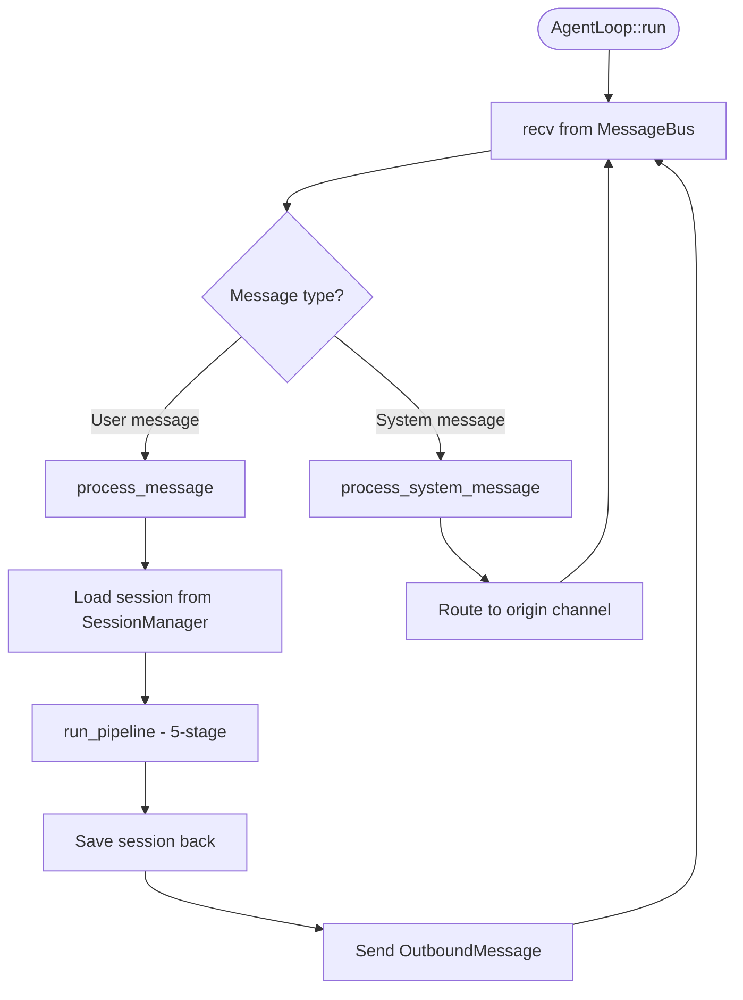
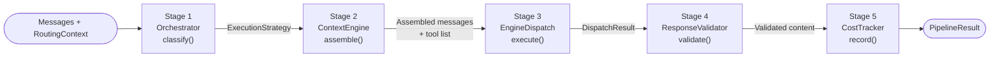
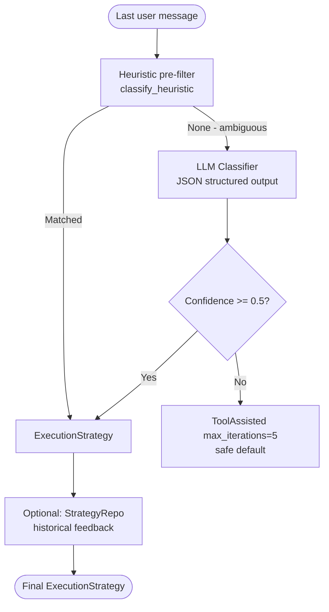
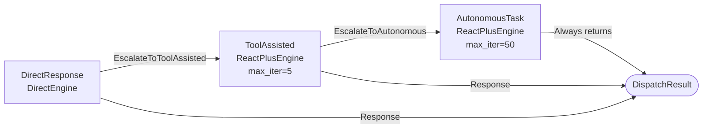
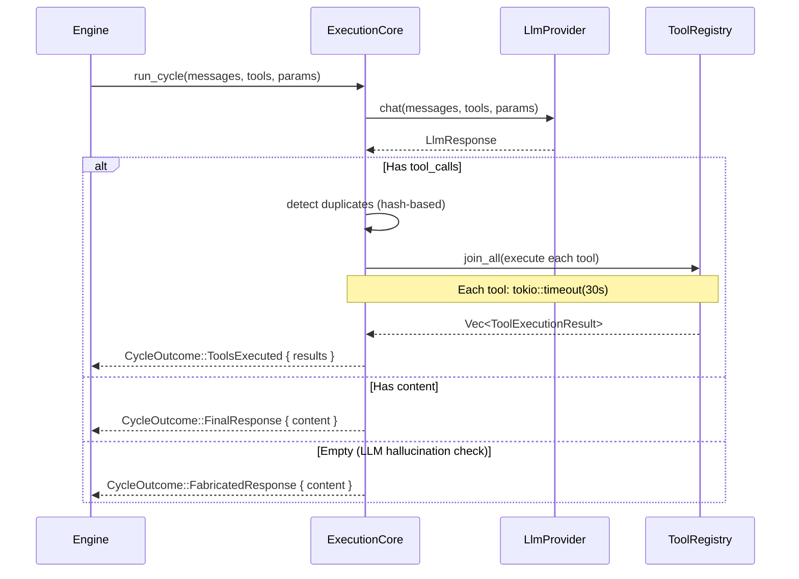
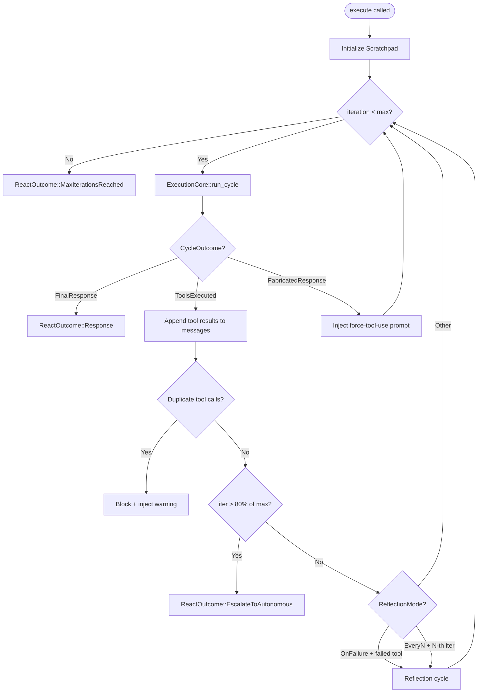
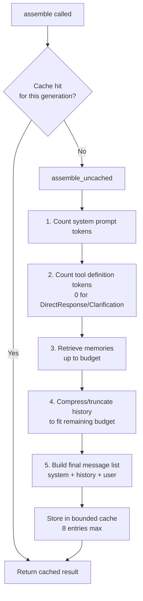
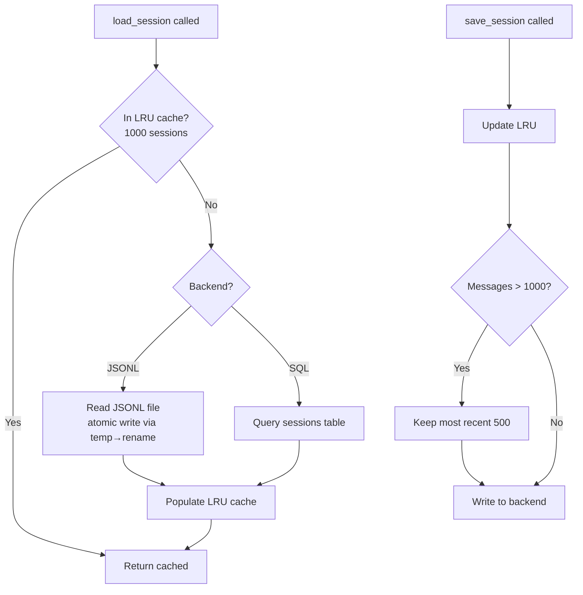
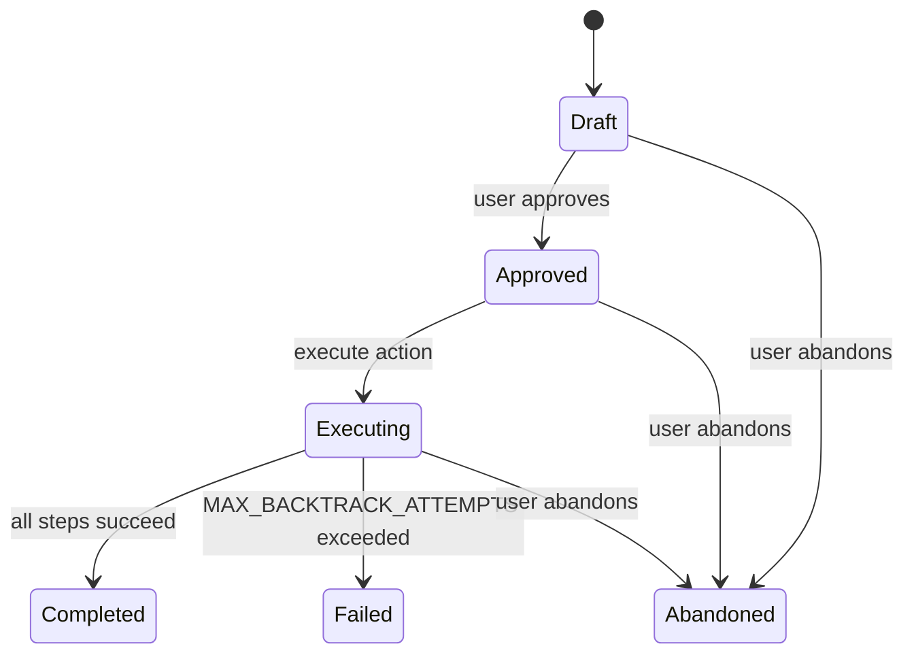
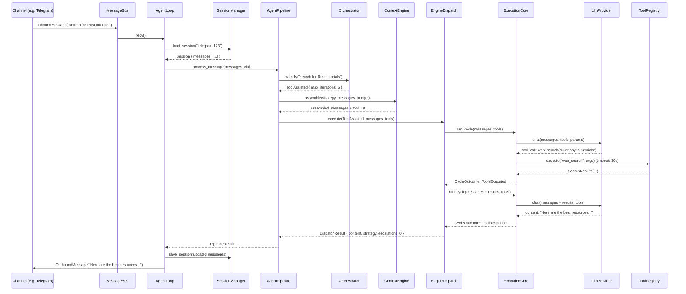

# Agent Core Architecture

> **Crates covered:** `agent` (Layer 5) · `context_engine` (Layer 2) · `session` (Layer 2)
> **Lines of code:** ~15,500 (agent) · ~1,600 (context_engine) · ~1,000 (session)
> **Last updated:** 2026-02-20

---

## Table of Contents

1. [Overview](#1-overview)
2. [Module Inventory](#2-module-inventory)
3. [AgentLoop — The Message Processing Core](#3-agentloop--the-message-processing-core)
4. [AgentPipeline — Five-Stage Orchestration](#4-agentpipeline--five-stage-orchestration)
5. [Orchestrator — Strategy Classification](#5-orchestrator--strategy-classification)
6. [Execution Engines](#6-execution-engines)
7. [ContextEngine — Token Budget & Assembly](#7-contextengine--token-budget--assembly)
8. [ContextBuilder — System Prompt Assembly](#8-contextbuilder--system-prompt-assembly)
9. [SessionManager — Conversation Persistence](#9-sessionmanager--conversation-persistence)
10. [Supporting Subsystems](#10-supporting-subsystems)
11. [Dependency Injection & Inversion](#11-dependency-injection--inversion)
12. [Key Type Definitions](#12-key-type-definitions)
13. [Data Flow: End-to-End Request](#13-data-flow-end-to-end-request)

---

## 1. Overview

The **agent core** is the brain of klyntbot. It takes inbound messages from any channel (Telegram, Discord, CLI, etc.), decides how to process them, assembles context, calls the LLM, executes tools, manages memory, and sends responses back. Everything is orchestrated through a layered pipeline:

```
InboundMessage (from MessageBus)
        │
        ▼
  ┌─────────────────────────────────────┐
  │           AgentLoop                 │
  │  run() → process_message()          │
  └────────────────┬────────────────────┘
                   │
                   ▼
  ┌─────────────────────────────────────┐
  │         AgentPipeline               │
  │  1. Orchestrator (classify)         │
  │  2. ContextEngine (assemble)        │
  │  3. EngineDispatch (execute)        │
  │  4. ResponseValidator (validate)    │
  │  5. CostTracker (record)            │
  └─────────────────────────────────────┘
                   │
                   ▼
          OutboundMessage (to Channel)
```

Key design properties:
- **Zero-copy escalation**: `Arc<Vec<Message>>` is passed between engines; escalation uses `Arc::clone` (O(1)) rather than deep copy.
- **Parallel tool execution**: All tool calls from a single LLM response are executed concurrently via `tokio::join_all` with per-tool timeouts.
- **Adaptive strategy**: The Orchestrator learns from historical performance via `StrategyRepo` feedback to improve future routing.
- **Budget-aware context**: `ContextEngine` enforces strict token budgets per priority level; lower-priority content is dropped before higher-priority content.

---

## 2. Module Inventory

### 2.1 `crates/agent/src/`

| Module | File(s) | Purpose |
|--------|---------|---------|
| `agent_loop` | `mod.rs`, `builder.rs` | Main agent loop: `run()`, `process_message()`, `process_direct()`, `process_direct_streaming()` |
| `pipeline` | `pipeline.rs` | 5-stage `AgentPipeline::process_message()` |
| `orchestrator` | `mod.rs`, `heuristics.rs`, `classifier.rs` | Strategy classification: heuristic pre-filter → LLM fallback |
| `execution` | `core.rs`, `dispatch.rs`, `react_plus.rs`, `direct.rs`, `types.rs` | LLM↔tool cycle engines and strategy dispatch |
| `context` | `context.rs` | `ContextBuilder` — system prompt assembly with TTL caches |
| `memory` | `memory.rs` | `MemoryStore` — SQL-backed long-term & daily memory |
| `skills` | `skills.rs` | `SkillManager` — built-in and workspace skill loading |
| `subagent` | `subagent.rs` | `SubagentManager` — background task spawning |
| `plan_executor` | `plan_executor.rs` | Per-step multi-cycle execution + step context builder |
| `plan_runner` | `plan_runner.rs` | Full plan state machine: Approved→Executing→Completed/Failed |
| `enrichment` | `engine.rs`, `priority.rs`, `duration.rs`, `scheduling.rs` | Task field auto-inference |
| `learning` | `service.rs`, `analyzer.rs`, `thresholds.rs` | Adaptive learning background service |
| `reminders` | `reminders.rs` | 4-rule reminder engine (5-min check interval) |
| `notifications` | `notifications.rs` | Notification routing to os_native or chat channels |
| `events` | `events.rs` | `AgentEvent` enum (11 variants) for streaming/CLI |
| `lib` | `lib.rs` | Public re-exports |

### 2.2 `crates/context_engine/src/`

| Module | File(s) | Purpose |
|--------|---------|---------|
| `assembler` | `assembler.rs` | `ContextEngine::assemble()` — cached context assembly |
| `budget` | `budget.rs` | `BudgetAllocator` — 8-level priority token budget |
| `lib` | `lib.rs` | `ExecutionStrategy` enum, public re-exports |

### 2.3 `crates/session/src/`

| Module | File(s) | Purpose |
|--------|---------|---------|
| `manager` | `manager.rs` | `SessionManager` — dual JSONL/SQL backend with LRU cache |

---

## 3. AgentLoop — The Message Processing Core

`AgentLoop` is the top-level runtime. It owns all dependencies and exposes a `run()` method that consumes messages from the `MessageBus` in an infinite loop.

### 3.1 Lifecycle



### 3.2 Key Constants

| Constant | Value | Purpose |
|----------|-------|---------|
| `DEFAULT_HISTORY_LIMIT` | 50 | Max messages passed to ContextEngine |

### 3.3 Processing Modes

| Method | Use Case | Notes |
|--------|----------|-------|
| `process_message()` | Channel messages (Telegram, Discord, etc.) | Full pipeline, session persistence |
| `process_direct()` | CLI one-shot | Returns `String`, no session persistence |
| `process_direct_streaming()` | CLI streaming REPL | `mpsc::Sender<AgentEvent>` + `CancellationToken` |

### 3.4 Builder

`AgentLoop` is assembled in `builder.rs` via `new_with_cron()`. All dependencies are wired at construction:

```
new_with_cron(config, pool, bus, provider, channels)
    │
    ├── ContextBuilder (with MemoryStore, SkillManager, TodoRepo, GoalRepo)
    ├── SessionManager (JSONL or SQL backend from config)
    ├── SubagentManager (limited tools: fs/shell/web)
    ├── ToolRegistry (all 12 tools registered with injection handles)
    │     ├── SpawnHandler → SubagentManager
    │     ├── CronHandler → CronService
    │     ├── CalendarHandler → CalendarSyncAdapter
    │     └── EnrichmentHandler → EnrichmentEngine
    ├── AgentPipeline (Orchestrator + ContextEngine + EngineDispatch)
    ├── LearningService (with LearningEventBus subscriber)
    ├── ReminderEngine (5-min background task)
    └── RecurringTaskSpawner
```

---

## 4. AgentPipeline — Five-Stage Orchestration

`AgentPipeline::process_message()` is the main orchestration entry point after session loading.



### Pipeline Result

```rust
pub struct PipelineResult {
    pub content: String,
    pub strategy_used: ExecutionStrategy,
    pub escalation_count: u32,
    pub validation: ValidationResult,
    pub usage: Usage,
}
```

Each stage emits `AgentEvent`s for real-time streaming:
- `ClassificationComplete { strategy }` after Stage 1
- `ContextAssembled { token_count }` after Stage 2
- `ExecutionStarted { engine }` before Stage 3
- `Done { content }` after Stage 5

---

## 5. Orchestrator — Strategy Classification

The Orchestrator uses a **two-stage** classification to pick an `ExecutionStrategy` without wasting tokens on obvious cases.

### 5.1 Classification Flow



### 5.2 Heuristic Patterns (`heuristics.rs`)

| Pattern Group | Keywords (sample) | → Strategy |
|---------------|-------------------|------------|
| `GREETINGS` | hi, hello, hey, thanks, bye | `DirectResponse` |
| `PLAN_KEYWORDS` | build a plan, create a roadmap, design a system | `AutonomousTask { max_iterations: 50 }` |
| `AUTONOMOUS_KEYWORDS` | autonomously, without stopping, batch process | `AutonomousTask { max_iterations: 15 }` |
| `TOOL_KEYWORDS` | search, find, look up, fetch, get | `ToolAssisted { max_iterations: 5 }` |
| `CODE_KEYWORDS` | write code, implement, debug, refactor | `ToolAssisted { max_iterations: 10 }` |
| `DIRECT_KEYWORDS` | what is, explain, describe, define | `DirectResponse` |
| Conflicting signals | (multiple groups matched) | `None` → LLM |

### 5.3 Strategy Performance Feedback

`build_strategy_context()` queries `StrategyRepo` for the last 30 days of outcomes:
- Average task duration per strategy
- Success/failure rates
- This is injected into the LLM classifier prompt as context

### 5.4 `ExecutionStrategy` Enum

```rust
pub enum ExecutionStrategy {
    DirectResponse,
    ToolAssisted { max_iterations: u32 },
    AutonomousTask { max_iterations: u32 },
    Clarification { reason: String },
}
```

---

## 6. Execution Engines

### 6.1 EngineDispatch — Strategy Router with Escalation

`EngineDispatch` maps `ExecutionStrategy` to an engine and handles automatic escalation when an engine signals it cannot handle the request.



**Escalation cap**: `max_escalations = 2` (configurable via `with_max_escalations()`).
**Arc optimization**: `Arc<Vec<Message>>` is passed; `Arc::clone` (O(1)) when an escalation needs the messages again; `Arc::try_unwrap` when moving ownership forward.

### 6.2 ExecutionCore — Single LLM↔Tool Cycle

`ExecutionCore::run_cycle()` is the atomic unit of all engines:



**Fabrication detection**: If the LLM returns content that appears to reference a tool call without actually making one (heuristic check on content patterns), `run_cycle()` returns `FabricatedResponse` so the engine can inject a force-tool-use prompt on retry.

### 6.3 CycleOutcome Enum

```rust
pub enum CycleOutcome {
    ToolsExecuted { results: Vec<ToolExecutionResult> },
    FinalResponse { content: String },
    EmptyResponse,
    FabricatedResponse { content: String },
}
```

### 6.4 ReactPlusEngine — Enhanced ReAct Loop

`ReactPlusEngine` runs the `ExecutionCore` in a loop, managing the full tool-use conversation:



**ReflectionMode variants:**

| Mode | When it triggers |
|------|-----------------|
| `OnFailure` | After any tool execution returns an error |
| `EveryN(n)` | Every N iterations regardless of outcome |
| `Never` | Disabled |

**Duplicate detection**: A `HashSet<u64>` (`seen_tool_calls`) stores a hash of `(tool_name, arguments)` for each call. Exact duplicates are blocked and a warning message is injected so the LLM can try a different approach.

**Escalation threshold**: At 80% of `max_iterations`, the engine returns `EscalateToAutonomous` rather than continuing, giving the dispatcher a chance to switch to a higher-limit engine.

### 6.5 DirectEngine

`DirectEngine` makes a single LLM call with no tools. If the LLM attempts a tool call (signaling it needs tools), it returns `DirectOutcome::EscalateToToolAssisted { messages }`.

### 6.6 DispatchResult

```rust
pub struct DispatchResult {
    pub content: String,
    pub final_strategy: ExecutionStrategy,
    pub escalation_count: u32,
    pub usage: Usage,
}
```

---

## 7. ContextEngine — Token Budget & Assembly

The `context_engine` crate enforces strict token budgets and assembles the final `[Message]` list passed to the LLM.

### 7.1 BudgetAllocator — 8-Level Priority System

```rust
pub enum Priority {
    SystemIdentity = 0,    // Highest — never dropped
    ActiveTask     = 1,
    ToolDefinitions = 2,
    RecentHistory  = 3,
    RetrievedMemory = 4,
    CompressedHistory = 5,
    BootstrapPersona = 6,
    Skills         = 7,    // Lowest — dropped first
}
```

**Reserve**: `BudgetConfig::standard()` reserves 15% of the context window for the response. Remaining tokens are distributed across priority levels. `try_allocate(priority, tokens)` returns `false` if the budget for that priority is exhausted.

### 7.2 Context Assembly Pipeline



**Cache invalidation**: Uses a `generation` counter. When the session is updated (new message added), the generation is incremented. The cache stores up to 8 entries keyed by `(session_key, generation, strategy)`.

### 7.3 Strategy-Dependent Tool Inclusion

| Strategy | Tool definitions included? |
|----------|---------------------------|
| `DirectResponse` | No (0 tool tokens) |
| `Clarification` | No (0 tool tokens) |
| `ToolAssisted` | Yes (up to budget) |
| `AutonomousTask` | Yes (up to budget) |

---

## 8. ContextBuilder — System Prompt Assembly

`ContextBuilder` (in `crates/agent/src/context.rs`) assembles the full system prompt string. It is called by `AgentPipeline` before `ContextEngine`.

### 8.1 System Prompt Structure

```
[Identity Section]
  - Agent name, current datetime, channel info

[Bootstrap Files] (TTL cached 60s)
  - AGENTS.md, SOUL.md, USER.md, TOOLS.md, IDENTITY.md, RESPONSE.md

[Memory Context] (TTL cached 60s)
  - Today's notes from MemoryStore
  - Long-term memory summary

[Todo Context] (TTL cached 60s)
  - Active todos from TodoRepo

[Goals Context] (TTL cached 60s)
  - Active goals from GoalRepo

[Confidence Prompt]
  - Threshold from LearningService adaptive thresholds

[Skills Summary]
  - XML skill list from SkillManager::generate_summary()

[Always-Loaded Skill Content]
  - Full content of skills marked `always: true`
```

### 8.2 TTL Cache Design

All expensive sections use a `(value, Instant)` tuple with 60-second TTL. On each call, stale entries are refreshed from the database asynchronously. This prevents a database round-trip on every message while keeping context reasonably fresh.

### 8.3 Plan Context

`build_plan_context()` builds a specialized context for plan execution — a 4-step look-ahead window showing:
- The current step (in detail)
- Next 3 steps (summary)
- Last 3 completed step results (truncated to 500 chars each)

---

## 9. SessionManager — Conversation Persistence

`SessionManager` (in `crates/session/src/manager.rs`) persists conversation history across messages.

### 9.1 Architecture



### 9.2 Session Key Format

```
{channel_name}:{chat_id}
```

Examples: `telegram:123456789`, `discord:987654321`, `cli:default`

### 9.3 SessionMessage

```rust
pub struct SessionMessage {
    pub id: Uuid,
    pub role: MessageRole,
    pub content: String,
    pub timestamp: DateTime<Utc>,
    pub request_id: Option<Uuid>,
    pub tool_calls: Option<Vec<ToolCall>>,
    pub metadata: Option<serde_json::Value>,
}
```

### 9.4 Compaction

When a session exceeds 1000 messages, it is compacted: the oldest messages are dropped, keeping the most recent 500. This happens transparently on save.

---

## 10. Supporting Subsystems

### 10.1 MemoryStore

SQL-backed via `MemoryNoteRepo` (PostgreSQL). Two memory types:

| Type | Key Pattern | Purpose |
|------|------------|---------|
| Long-term | `LONG_TERM_KEY` (constant) | Persistent facts about the user |
| Daily notes | `daily:{YYYY-MM-DD}` | Per-day notes and observations |

Methods: `read_today()`, `append_today()`, `read_long_term()`, `write_long_term()`, `get_recent_memories(n)`.

### 10.2 SkillManager

Loads skills from two sources:

| Source | Loading Method | Metadata |
|--------|---------------|---------|
| Built-in skills | `include_str!()` at compile time | YAML frontmatter |
| Workspace skills | `skills/SKILL.md` files at runtime | YAML frontmatter |

**YAML frontmatter fields:**

```yaml
---
name: my-skill
description: What this skill does
always: false        # If true: full content injected into every system prompt
triggers:            # Keywords that cause this skill to be included
  - keyword1
  - keyword2
requires_bins:       # Binaries that must be in PATH
  - git
requires_env:        # Env vars that must be set
  - GITHUB_TOKEN
---
```

`generate_summary()` returns an XML snippet listing all skills. `get_always_loaded()` returns the full content of skills where `always: true`.

### 10.3 SubagentManager

Spawns background `tokio::spawn` tasks with a simplified agent loop:

| Constraint | Value |
|------------|-------|
| Max iterations | 15 |
| Available tools | File I/O (×4), shell, web search, web fetch |
| Excluded tools | message, spawn, cron (prevents infinite recursion) |
| Result delivery | `InboundMessage` on the `"system"` channel |

### 10.4 EnrichmentEngine

Implements `EnrichmentHandler`. Auto-infers missing task fields:

| Field | Method | Example |
|-------|--------|---------|
| Priority | Keyword analysis on title | "urgent fix" → priority 1 |
| Duration | Keyword analysis on title | "refactor auth" → 120 min |
| Due date | Priority-based heuristic | Priority 1 → today |

Skips fields that are already set. Confidence threshold controls auto-apply.

### 10.5 LearningService

Background service that runs `LearningAnalyzer` periodically:

```
LearningService
    │
    ├── CancellationToken (for graceful shutdown)
    ├── JoinHandle (background loop)
    └── Notify (for trigger_analysis() demand runs)
            │
            ▼
    LearningAnalyzer::analyze()
            │
            ▼
    AdaptiveThresholds::update()
            │
            ▼
    LearningEventBus::publish(ThresholdChanged)
            │
            ▼
    AgentLoop subscriber → ContextBuilder::update_threshold()
```

### 10.6 ReminderEngine

Runs a background task every 5 minutes. Four reminder rules:

| Rule | Trigger | Fires |
|------|---------|-------|
| Due-soon | Due within 2 hours | Once |
| Focused deadline | Due within 1 hour | Once |
| Overdue nag | Overdue task | Every 24 hours |
| Calendar event | Event starts in 30 minutes | Once |

Notifications are dispatched through `NotificationDispatcher`.

### 10.7 NotificationDispatcher

Routes notifications to configured targets:
- `os_native`: System notification (macOS/Linux)
- `{channel_name}`: Sends to that channel (Telegram, Discord, etc.)

Tracks `last_active_channel` to know where to send context-sensitive notifications.

### 10.8 AgentEvent

Real-time events emitted during pipeline execution for CLI streaming and monitoring:

```rust
pub enum AgentEvent {
    ContentChunk { content: String },
    ToolStart { name: String, arguments: Value },
    ToolEnd { name: String, result: String },
    IterationStart { iteration: u32 },
    ClassificationComplete { strategy: ExecutionStrategy },
    ContextAssembled { token_count: u32 },
    ExecutionStarted { engine: String },
    Done { content: String },
    ConfidenceAssessed { confidence: f32 },
    Error { message: String },
    PlanStepCompleted { step_index: usize, result: String },
    PlanCompleted { plan_id: Uuid },
}
```

### 10.9 Plan Execution (plan_runner.rs + plan_executor.rs)

Plan execution is driven by `run_plan_execution()` in `plan_runner.rs`:



**Per-step execution** (`plan_executor.rs::run_step()`):
1. Build step context: 4-step look-ahead + last 3 completed results (500-char truncation)
2. Run up to `MAX_CYCLES_PER_STEP = 5` `ExecutionCore` cycles
3. On failure: retry with exponential backoff → after `max_attempts`: trigger backtrack
4. Backtrack: `regenerate_from()` calls LLM for replacement steps with JSON parsing + fallback

**Backtrack limit**: `MAX_BACKTRACK_ATTEMPTS = 3` full backtrack events before the plan is marked `Failed`.

---

## 11. Dependency Injection & Inversion

Several components need to call "upward" in the dependency graph (e.g., tools calling agent functions). These are resolved via trait objects injected at construction:

| Trait | Defined in | Implemented in | Purpose |
|-------|-----------|---------------|---------|
| `SpawnHandler` | `tools` (Layer 3) | `agent` (Layer 5) | Subagent spawning from `SpawnTool` |
| `CronHandler` | `tools` (Layer 3) | `agent` (Layer 5) | Cron job management from `CronTool` |
| `CalendarHandler` | `tools` (Layer 3) | `agent` (Layer 5) | Calendar sync from `CalendarTool` |
| `EnrichmentHandler` | `tools` (Layer 3) | `agent` (Layer 5) | Task enrichment from `TodoTool` |
| `PlanCompletionHandler` | `tools` (Layer 3) | `agent` (Layer 5) | Plan state notification |

All injected as `Arc<dyn Trait + Send + Sync>` at `AgentLoop` construction. This breaks circular dependencies while allowing tools to trigger agent behavior.

**Conversation embedding** uses a similar pattern: `ConversationEmbeddingHandlerImpl` is injected into `AgentLoop` and fires background embedding jobs (fire-and-forget `tokio::spawn`) for user and assistant messages.

---

## 12. Key Type Definitions

### ExecutionParams

```rust
pub struct ExecutionParams {
    pub model: String,
    pub tool_timeout: Duration,   // default: 30s
    pub chat_params: ChatParams,
}
```

### ExecutionCore

```rust
pub struct ExecutionCore {
    provider: Arc<dyn LlmProvider>,
    tool_registry: Arc<RwLock<ToolRegistry>>,
}
```

Core method: `run_cycle(messages, tools, params) -> Result<CycleOutcome>`

### ReactOutcome

```rust
pub enum ReactOutcome {
    Response { content: String, usage: Usage, iterations: u32 },
    EscalateToAutonomous { reason: String, usage: Usage },
    MaxIterationsReached { partial_content: Option<String>, usage: Usage },
}
```

### DispatchResult

```rust
pub struct DispatchResult {
    pub content: String,
    pub final_strategy: ExecutionStrategy,
    pub escalation_count: u32,
    pub usage: Usage,
}
```

### BudgetConfig

```rust
pub struct BudgetConfig {
    pub total_tokens: u32,
    pub response_reserve_pct: f32,  // default: 0.15 (15%)
    pub per_priority_limits: [u32; 8],
}
```

### Session

```rust
pub struct Session {
    pub key: String,                        // "channel:chat_id"
    pub messages: Vec<SessionMessage>,
    pub created_at: DateTime<Utc>,
    pub updated_at: DateTime<Utc>,
    pub metadata: Option<serde_json::Value>,
}
```

---

## 13. Data Flow: End-to-End Request

The following shows a complete request lifecycle for a tool-using message (e.g., "search for Rust async tutorials"):



**Total LLM calls for this example**: 2
**Tool calls**: 1 (web_search, executed in parallel if multiple)
**Escalations**: 0 (heuristic matched TOOL_KEYWORDS directly)

---

*Generated from codebase analysis of klyntbot v0.4.0*
