# Crate Dependency Map

This document shows how all 33 workspace crates depend on each other, grouped by layer.

## Mermaid Dependency Flowchart

```mermaid
flowchart TB
    subgraph L0["L0: Foundation"]
        common
        platform_macos["platform-macos"]
        tools_core["tools-core"]
        tools_core_macros["tools-core-macros"]
        analytics
    end

    subgraph L1["L1: Configuration & Messaging"]
        config
        bus
    end

    subgraph L2["L2: Persistence"]
        storage
    end

    subgraph L3["L3: Infrastructure"]
        providers
        session
        scheduling
        context_engine["context_engine"]
        skill_system["skill-system"]
    end

    subgraph L4["L4: Features"]
        tools
        feature_tasks["feature-tasks"]
        feature_finance["feature-finance"]
        feature_notes["feature-notes"]
        feature_productivity["feature-productivity"]
        feature_coaching["feature-coaching"]
        feature_insights["feature-insights"]
        feature_launcher["feature-launcher"]
        feature_learning["feature-learning"]
        activity_log["activity-log"]
        plugin_runtime["plugin-runtime"]
    end

    subgraph L5["L5: Orchestration"]
        channels
        agent
        cognitive
    end

    subgraph L6["L6: Protocol"]
        mcp
    end

    subgraph L7["L7: Application"]
        app_core["app-core"]
        desktop_shared["desktop-shared"]
        desktop
    end

    subgraph L8["L8: Binaries"]
        klyntbot
        klyntbot_server["klyntbot-server"]
    end

    %% L0 internal
    tools_core --> common
    tools_core --> tools_core_macros
    analytics --> common

    %% L1 deps
    config --> common
    bus --> common

    %% L2 deps
    storage --> common
    storage --> tools_core

    %% L3 deps
    providers --> common
    providers --> config
    session --> common
    session --> storage
    scheduling --> common
    scheduling --> storage
    context_engine --> common
    context_engine --> providers
    skill_system --> common
    skill_system --> config
    skill_system --> context_engine

    %% L4 deps
    tools --> common
    tools --> tools_core
    tools --> config
    tools --> storage
    tools --> bus
    tools --> cognitive

    feature_tasks --> common
    feature_tasks --> tools_core
    feature_tasks --> storage
    feature_tasks --> bus

    feature_finance --> common
    feature_finance --> tools_core
    feature_finance --> storage
    feature_finance --> analytics
    feature_finance --> bus

    feature_notes --> common
    feature_notes --> tools_core
    feature_notes --> storage

    feature_productivity --> common
    feature_productivity --> tools_core
    feature_productivity --> config
    feature_productivity --> storage
    feature_productivity --> bus
    feature_productivity --> activity_log
    feature_productivity --> platform_macos

    feature_coaching --> common
    feature_coaching --> bus
    feature_coaching --> cognitive
    feature_coaching --> storage

    feature_insights --> common
    feature_insights --> tools_core
    feature_insights --> storage
    feature_insights --> providers
    feature_insights --> feature_notes

    feature_launcher --> common
    feature_launcher --> storage
    feature_launcher --> tools_core
    feature_launcher --> platform_macos

    feature_learning --> common

    activity_log --> common
    activity_log --> cognitive
    activity_log --> config
    activity_log --> context_engine
    activity_log --> storage
    activity_log --> bus
    activity_log --> tools_core

    plugin_runtime --> common
    plugin_runtime --> config
    plugin_runtime --> bus
    plugin_runtime --> storage
    plugin_runtime --> tools_core

    %% L5 deps
    channels --> common
    channels --> bus
    channels --> config
    channels --> providers

    cognitive --> common
    cognitive --> storage
    cognitive --> bus
    cognitive --> context_engine
    cognitive --> tools_core

    agent --> common
    agent --> bus
    agent --> config
    agent --> cognitive
    agent --> providers
    agent --> session
    agent --> tools
    agent --> tools_core
    agent --> feature_tasks
    agent --> feature_finance
    agent --> feature_productivity
    agent --> feature_coaching
    agent --> feature_notes
    agent --> plugin_runtime
    agent --> mcp
    agent --> scheduling
    agent --> skill_system
    agent --> context_engine
    agent --> storage
    agent --> activity_log

    %% L6 deps
    mcp --> common
    mcp --> config
    mcp --> tools_core

    %% L7 deps
    desktop_shared --> common
    desktop_shared --> activity_log

    app_core --> desktop_shared
    app_core --> agent
    app_core --> bus
    app_core --> channels
    app_core --> cognitive
    app_core --> common
    app_core --> config
    app_core --> feature_coaching
    app_core --> feature_finance
    app_core --> feature_insights
    app_core --> feature_launcher
    app_core --> feature_learning
    app_core --> feature_notes
    app_core --> feature_productivity
    app_core --> feature_tasks
    app_core --> providers
    app_core --> scheduling
    app_core --> session
    app_core --> storage
    app_core --> tools
    app_core --> tools_core
    app_core --> activity_log
    app_core --> skill_system

    desktop --> app_core
    desktop --> desktop_shared
    desktop --> agent
    desktop --> klyntbot_server

    %% L8 deps
    klyntbot_server --> app_core
    klyntbot_server --> agent
    klyntbot_server --> mcp
    klyntbot_server --> tools_core
    klyntbot_server --> common
    klyntbot_server --> config
    klyntbot_server --> desktop_shared
```

## Key Dependency Patterns

### 1. Re-export Facade
`klyntbot` (L8) re-exports all public types from lower crates for ergonomic imports: `klyntbot::AgentLoop`, `klyntbot::Config`, etc.

### 2. Dependency Inversion
Lower-layer crates define trait interfaces; higher-layer crates provide implementations:

| Trait (defined in) | Implementation (in) |
|---|---|
| `ExtractionHandler` (cognitive) | `LlmExtractionHandler` (agent) |
| `ConsolidationHandler` (cognitive) | `LlmConsolidationHandler` (agent) |
| `DecompositionHandler` (feature-tasks) | `LlmDecompositionHandler` (agent) |
| `TaskExecutionHandler` (feature-tasks) | `LlmTaskExecutionHandler` (agent) |
| `CronHandler` (tools) | `CronHandlerAdapter` (agent) |
| `SpawnHandler` (tools) | `SubagentManager` (agent) |
| `DelegationHandler` (tools) | `AgentRuntime` (agent) |
| `ProgressHandler` (tools-core) | `ProgressHandlerImpl` (agent) |
| `ScopeResolver` (feature-insights) | `ScopeResolverImpl` (app-core) |
| `FlashcardAccessor` (feature-insights) | `FlashcardAccessorImpl` (app-core) |

### 3. Hub Crate Pattern
`agent` (L5) is the hub crate -- it depends on nearly every feature crate to provide handler implementations. `app-core` (L7) is the second hub, orchestrating all crates for initialization.

### 4. Minimal Feature Crate Dependencies
Feature crates (L4) have minimal cross-dependencies:
- `feature-insights` depends on `feature-notes` (needs note models)
- `feature-productivity` depends on `activity-log` and `platform-macos`
- `feature-coaching` depends on `cognitive` (for `UserSituation`)
- Most feature crates depend only on L0-L2 crates

### 5. Protocol Isolation
The `mcp` crate (L6) depends only on L0-L1 crates (`common`, `config`, `tools-core`), keeping the protocol layer thin. The full MCP server logic lives in `klyntbot-server` (L8) which bridges to `app-core`.
