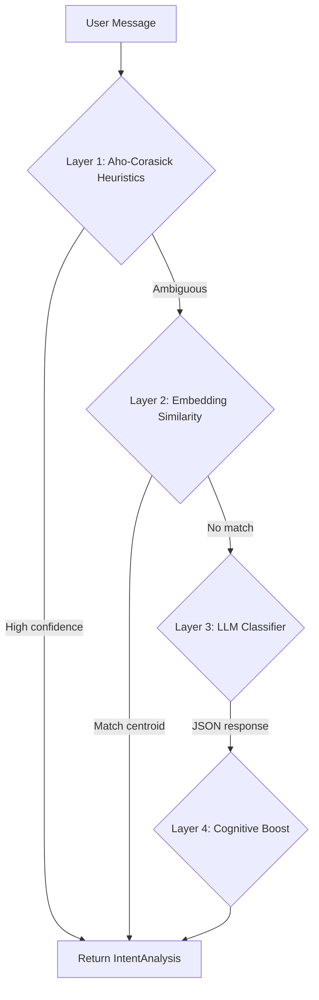
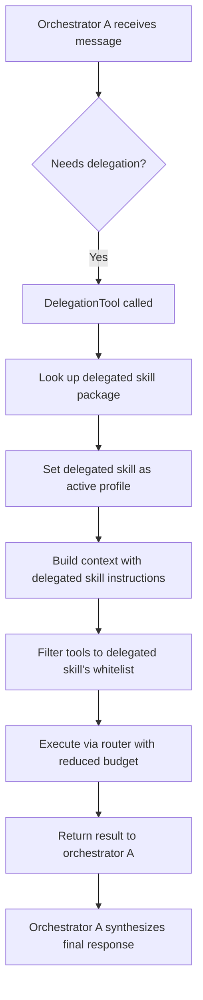

# Agent Runtime Pipeline

## Overview

Every user message flows through a 10-step pipeline in `AgentRuntime`. The pipeline selects an orchestrator skill, classifies intent, assembles context within a token budget, filters tools, and dispatches to either a Direct engine (single LLM call) or Reactive engine (ReAct loop with tools).

## Full Message Processing Sequence

```mermaid
sequenceDiagram
    participant User
    participant Channel
    participant Bus as MessageBus
    participant Loop as AgentLoop
    participant Session as SessionManager
    participant Runtime as AgentRuntime
    participant Router as SkillRouter
    participant Analyzer as IntentAnalyzer
    participant CE as ContextEngine
    participant ER as ExecutionRouter
    participant Direct as DirectEngine
    participant Reactive as ReactiveEngine
    participant Core as ExecutionCore
    participant LLM as LLM Provider
    participant Tools as ToolRegistry
    participant Tracker as CostTracker

    User->>Channel: Send message
    Channel->>Bus: publish_inbound(InboundMessage)
    Bus->>Loop: inbound_rx.recv()
    Loop->>Loop: Validate message size
    Loop->>Session: get_or_create(session_key)
    Session-->>Loop: Session with history

    Loop->>Runtime: process_message(msg, history, tools, ctx)

    Note over Runtime: Step 1: Skill Routing
    Runtime->>Router: select_orchestrator_blended(message, embedding, catalog)
    Router-->>Runtime: SkillPackage (e.g. task-management)

    Note over Runtime: Step 2: Set Active Profile
    Runtime->>Runtime: active_profile = selected skill

    Note over Runtime: Step 3: MCP Tool Filtering
    Runtime->>Runtime: Filter MCP tools by skill.mcp_tools

    Note over Runtime: Step 4: Intent Classification
    Runtime->>Analyzer: analyze(message, tool_names)
    Note over Analyzer: Layer 1: Aho-Corasick heuristics (0ms)
    Note over Analyzer: Layer 2: Embedding cosine similarity (<5ms)
    Note over Analyzer: Layer 3: LLM classifier (bounded timeout)
    Note over Analyzer: Layer 4: Cognitive fact boost
    Analyzer-->>Runtime: IntentAnalysis {mode, signals, confidence}

    Note over Runtime: Step 5: Confidence Check
    Runtime->>Runtime: Low confidence? Downgrade to Direct

    Note over Runtime: Step 6: Context Assembly
    Runtime->>CE: assemble(ContextRequest)
    CE-->>Runtime: AssembledContext {messages, token_count, budget_report}

    Note over Runtime: Step 7: Tool Filtering
    Runtime->>Runtime: filter_tools_for_profile(skill.tools)

    Note over Runtime: Step 8: Execution
    Runtime->>ER: execute(mode, messages, tools, params)

    alt Direct Mode
        ER->>Direct: execute(messages, NO tools)
        Direct->>Core: run_cycle(messages, None)
        Core->>LLM: chat(messages)
        LLM-->>Core: text response
        Core-->>Direct: CycleOutcome::TextResponse
        alt Tool calls detected (misclassification)
            Direct-->>ER: EngineResult::Escalate
            ER->>Reactive: auto-escalate to Reactive
        else Text only
            Direct-->>ER: EngineResult::Complete
        end
    else Reactive Mode
        ER->>Reactive: execute(messages, tools, max_iterations)
        loop ReAct iterations (max N)
            Reactive->>Core: run_cycle(messages, tools)
            Core->>LLM: chat(messages, tools)
            alt Tool calls
                LLM-->>Core: tool_calls
                Core->>Tools: execute(tool_name, args, ctx)
                Tools-->>Core: tool result string
                Core-->>Reactive: CycleOutcome::ToolCalls
            else Text response with stop
                LLM-->>Core: text
                Core-->>Reactive: CycleOutcome::TextResponse
            end
        end
        Reactive-->>ER: EngineResult::Complete
    end

    ER-->>Runtime: RouterResult

    Note over Runtime: Step 9: Validation
    Runtime->>Runtime: ResponseValidator.validate()

    Note over Runtime: Step 10: Recording
    Runtime->>Tracker: record(usage, model, mode, channel)
    Runtime-->>Loop: RuntimeResult

    Loop->>Session: save(assistant response)
    Loop->>Bus: publish_outbound(OutboundMessage)
    Bus->>Channel: send(formatted message)
    Channel->>User: Deliver response
```

## Pipeline Steps in Detail

### Step 1: Skill Routing

`SkillRouter.select_orchestrator_blended()` scores all orchestrator skills:

```
blended_score = keyword_score * keyword_weight + semantic_score * semantic_weight
```

Default weights: 0.7 / 0.3. When the autotuner has a promoted Champion, the Champion's `skill_keyword_weight` and `skill_semantic_weight` override these defaults via `RoutingContext.champion_params`.

- **Keyword score**: Token overlap between user message and skill description
- **Semantic score**: Cosine similarity of embeddings
- **Candidacy gate**: keyword > 0 OR semantic >= 0.5
- **Fallback**: "general" orchestrator if no candidate qualifies

Five built-in orchestrators: general, task-management, finance-management, automation, communication.

### Step 2: Set Active Profile

The selected `SkillPackage` is written to `active_profile`. The `SkillContextSource` reads this during context assembly to inject the orchestrator's instructions.

### Step 3: MCP Tool Filtering

Each skill declares which MCP servers it can access via `mcp_tools`:
- `["*"]` = all servers (general)
- `["google-calendar"]` = specific server (task-management)
- `[]` = none (finance, automation, communication)

### Step 4: Intent Classification (4-Layer Cascade)



| Layer | Speed | Method | When Used |
|---|---|---|---|
| Heuristics | 0ms | Aho-Corasick pattern matching | Clear-cut intents (greetings, domain keywords) |
| Embedding | <5ms | Cosine similarity vs intent centroids | Heuristic is ambiguous |
| LLM | ~500ms | Structured JSON classification prompt | Embedding inconclusive |
| Cognitive | ~1ms | FSRS fact lookup for user patterns | Post-processing boost |

Output: `IntentAnalysis` with `ExecutionMode` (Direct or Reactive), `ComplexitySignals`, and confidence score.

### Step 5: Confidence Check

If `analysis.confidence < threshold`, the runtime downgrades from Reactive to Direct mode rather than requesting clarification. This reduces unnecessary back-and-forth.

### Step 6: Context Assembly

The `ContextEngine` manages a token budget across priority levels:

| Priority | Content |
|---|---|
| SystemIdentity | Core system prompt |
| ActiveTask | Currently active task |
| ToolDefinitions | JSON schemas (Reactive only) |
| RecentHistory | Verbatim recent messages |
| RetrievedMemory | FSRS-scored facts + conversation recall |
| CompressedHistory | Summarized older messages |
| BootstrapPersona | Persona instructions |
| Skills | Orchestrator + activated skill instructions |

Available input budget = `context_window * 0.85` (15% reserved for response).

### Step 7: Tool Filtering

Tools are filtered by the active skill's `tools` whitelist. The `DelegationTool` is injected if the skill has `can_delegate_to` targets and delegation depth < 2.

### Step 8: Execution

#### Direct Mode
Single LLM call without tool definitions. If the LLM unexpectedly returns tool calls (misclassification), auto-escalates to Reactive mode.

#### Reactive Mode (ReAct Loop)

```
for iteration in 0..max_iterations:
    1. Send messages + tool definitions to LLM
    2. If text response with stop -> return
    3. If tool calls -> execute tools, append results
    4. If cancelled -> return partial result
    5. If max iterations -> force synthesis
```

**Iteration budget formula**: `min(max(estimated_tool_calls * 3, 10) + 5, 30)`

### Steps 9-10: Validation and Recording

- `ResponseValidator` checks response quality
- `CostTracker` records token usage and estimated cost
- `StrategyRepo` records classification accuracy for adaptive learning
- `InteractionRecorder` logs the interaction

### Shadow Scoring (Autotuner)

When the autotuner is enabled with active trials, the `AutoTunerOrchestrator` runs lightweight shadow scoring on every message in parallel with the main pipeline:

1. **Control path** runs normally with Champion params (or Config defaults) — drives the actual response.
2. **Shadow path** runs Layer 1-2 only (Aho-Corasick + embedding cosine) of IntentAnalyzer + SkillRouter for each active trial's `TrialParams`. No Layer 3 LLM calls. Overhead: <3ms total for 3 active trials.
3. **Ground truth** is recorded after response delivery — user corrections, satisfaction, token usage, response time — against both control and shadow predictions.

## Delegation Flow

When an orchestrator delegates to another skill:



Maximum delegation depth: 2. Orchestrator-only tools: `ask_user`, `memory`, `delegate`.

## Squad Execution (Multi-Persona)

When `squad_id` is set on a session:

1. Resolve squad members from `SquadRepo`
2. Build orchestrator context
3. If blackboard available: room debate (multi-round, shared state)
4. Otherwise: parallel fan-out to each persona
5. LLM synthesis of persona responses
6. Return `RuntimeResult` with `persona_responses`

## Event Streaming

Throughout execution, `AgentEvent`s are emitted for frontend transparency:

| Event | When |
|---|---|
| `AgentSelected` | Skill routing complete |
| `ClassificationComplete` | Intent classified |
| `ContextAssembled` | Context built |
| `ExecutionStarted` | Engine selected |
| `IterationStart` | Each ReAct iteration |
| `ToolStart` / `ToolEnd` | Tool execution lifecycle |
| `ContentChunk` | Streaming text tokens |
| `DelegationStarted` / `Completed` | Inter-agent delegation |
| `UsageReport` | Token usage |
| `AutoTunerReport` | Nightly experiment cycle completed |
| `AutoTunerPromotion` | Trial promoted to Champion |
| `AutoTunerRollback` | Champion reverted after regression |
| `Done` | Processing complete |
