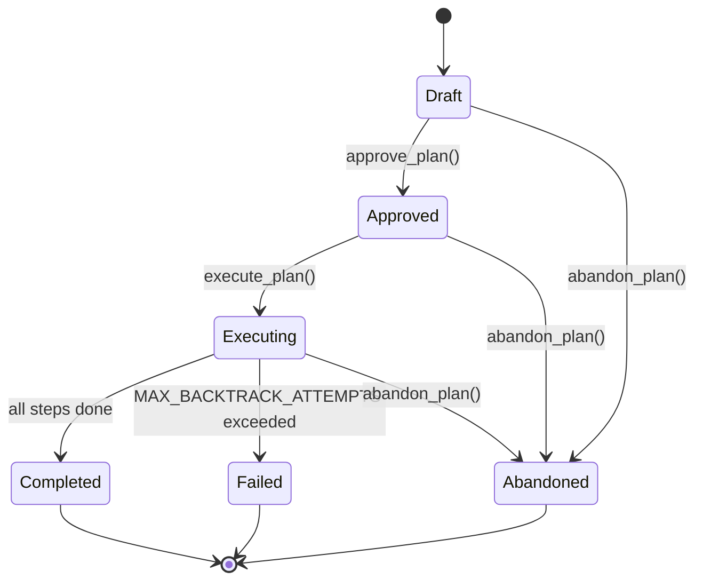
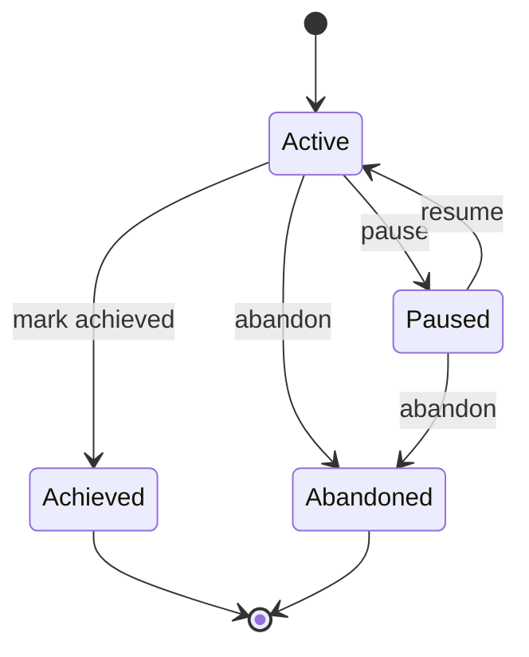

# 03 — Tools & Extensions Layer

> **Crates covered**: `tools` (Layer 3), `plan` (Layer 1.5), `goal` (Layer 1.5)
>
> **Lines of code**: ~18 300 (tools) + 527 (plan) + 422 (goal)

---

## Table of Contents

1. [Overview](#1-overview)
2. [Tool Trait & Core Abstractions](#2-tool-trait--core-abstractions)
3. [Tool Registry](#3-tool-registry)
4. [Permission System](#4-permission-system)
5. [Tool Inventory](#5-tool-inventory)
   - 5.1 [Filesystem Tools](#51-filesystem-tools)
   - 5.2 [Shell Tool (exec)](#52-shell-tool-exec)
   - 5.3 [Web Tools](#53-web-tools)
   - 5.4 [Message Tool](#54-message-tool)
   - 5.5 [Spawn Tool](#55-spawn-tool)
   - 5.6 [Cron Tool](#56-cron-tool)
   - 5.7 [Todo Tool](#57-todo-tool)
   - 5.8 [Project Tool](#58-project-tool)
   - 5.9 [Calendar Tool](#59-calendar-tool)
   - 5.10 [Finance Tool](#510-finance-tool)
   - 5.11 [Memory Tool](#511-memory-tool)
   - 5.12 [Plan Tool](#512-plan-tool)
   - 5.13 [Goal Tool](#513-goal-tool)
   - 5.14 [Learning Tool](#514-learning-tool)
   - 5.15 [AskUser Tool](#515-askuser-tool)
   - 5.16 [Embedding Tools](#516-embedding-tools)
6. [Handler Traits (Dependency Inversion)](#6-handler-traits-dependency-inversion)
7. [Supporting Modules](#7-supporting-modules)
8. [Plan Crate](#8-plan-crate)
9. [Goal Crate](#9-goal-crate)

---

## 1. Overview

The **tools** crate is the capability layer of klyntbot. Every action the LLM agent can take — reading a file, scheduling a reminder, tracking a task, managing investments — is implemented as a `Tool`. Tools are registered at startup, serialised to OpenAI function-calling JSON schemas, and dispatched by the agent loop.

The crate sits at **Layer 3** in the workspace dependency graph:

```
Layer 5: agent  ──uses──▶  Layer 3: tools  ──uses──▶  Layer 1.5: storage
                                                    ──uses──▶  Layer 0: common
```

Tools that need agent-level capabilities (spawning sub-agents, cron scheduling, calendar sync, etc.) use **dependency inversion**: a trait is _defined_ in `tools` at Layer 3 and _implemented_ in `agent` at Layer 5. This prevents circular dependencies while keeping the tool interface clean.

---

## 2. Tool Trait & Core Abstractions

### 2.1 The `Tool` Trait

```rust
#[async_trait]
pub trait Tool: Send + Sync {
    fn name(&self) -> &str;
    fn description(&self) -> &str;
    fn parameters(&self) -> Value;           // JSON Schema
    async fn execute(&self, args: Value, ctx: &RoutingContext) -> Result<String>;
    fn permission_level(&self) -> PermissionLevel { PermissionLevel::Standard }
    fn to_schema(&self) -> Value { /* → OpenAI function-calling format */ }
    fn validate_params(&self, params: &Value) -> Vec<String>;
}

pub type DynTool = Arc<dyn Tool>;
```

Every tool implementation provides:
- **`name()`** — stable string used for LLM function call dispatch (e.g. `"todo"`, `"finance"`)
- **`description()`** — injected into the LLM's system context so it knows when to use the tool
- **`parameters()`** — JSON Schema object defining accepted parameters; used for schema injection and `validate_params`
- **`execute()`** — async handler that receives deserialized `serde_json::Value` args and a `RoutingContext`
- **`permission_level()`** — defaults to `Standard`; override for privileged tools

### 2.2 `RoutingContext`

Passed to every `execute()` call. Carries caller metadata without requiring global mutable state.

```rust
#[derive(Clone)]
pub struct RoutingContext {
    pub channel: ChannelName,              // "cli", "telegram", "discord", …
    pub chat_id: ChatId,
    pub interaction_tx: Option<mpsc::Sender<InteractionBundle>>, // TTY only
}
```

`interaction_tx` is `Some` only in CLI (TTY) mode. The `ask_user` tool sends interaction bundles through this channel to block until the user replies.

### 2.3 `InteractionBundle`

Used by `ask_user` for interactive UI:

```rust
pub struct InteractionBundle {
    pub request: InteractionRequest,
    pub response_tx: oneshot::Sender<FormResponse>,
}
```

Each `InteractionBundle` carries its own `oneshot` response channel, enabling the tool to block on a single user reply without shared mutable state.

### 2.4 Parameter Validation

`validate_params` runs a recursive JSON Schema validator over the tool's declared `parameters()` schema:

- **Supported**: `type` (string, integer, number, boolean, array, object), `minLength`, `maxLength`, `minimum`, `maximum`, `required`, `properties`, `items`, `enum`
- Errors are collected as human-readable strings and returned to the LLM as an `InvalidParams` error

---

## 3. Tool Registry

`ToolRegistry` manages the lifecycle of all registered tools.

```rust
pub struct ToolRegistry {
    tools: HashMap<String, DynTool>,
    cached_definitions: Mutex<Option<Vec<Value>>>,  // lazily built, invalidated on change
    permissions: Option<ToolPermissions>,
}
```

### Key methods

| Method | Behaviour |
|---|---|
| `register(tool)` | Inserts tool by `name()`, invalidates definition cache |
| `unregister(name)` | Removes tool by name, invalidates cache |
| `get(name)` | Returns `Option<Arc<dyn Tool>>` |
| `get_definitions()` | Returns cached `Vec<Value>` of all tool schemas (OpenAI format) |
| `execute(name, params, ctx)` | Permission check → param validation → `tool.execute()` |
| `tool_names()` | List all registered names |

The definition cache (`Mutex<Option<Vec<Value>>>`) is built once on first call and invalidated whenever the registry changes. This avoids re-serializing all schemas on every LLM turn.

### Execution flow

```
registry.execute(name, params, ctx)
  ├── look up DynTool by name            → ToolError::NotFound
  ├── check ToolPermissions              → ToolError::PermissionDenied
  ├── validate_params(params)            → ToolError::InvalidParams
  └── tool.execute(params, ctx).await    → Result<String>
```

---

## 4. Permission System

Four levels, ordered by privilege:

| Level | Ordinal | Typical tools |
|---|---|---|
| `ReadOnly` | 0 | `read_file`, `list_dir`, `web_search`, `web_fetch` |
| `Standard` | 1 | `todo`, `project`, `calendar`, `memory`, `message`, `cron`, `finance`, `goal`, `plan`, `learning`, `ask_user` |
| `Elevated` | 2 | `exec`, `write_file`, `edit_file` |
| `Admin` | 3 | `spawn` |

Permissions are enforced **per channel**. `ToolPermissions` maps channel names to a granted level; a tool executes only if `granted_level >= required_level`.

```rust
pub struct ToolPermissions {
    channel_levels: HashMap<String, PermissionLevel>,
    default_level: PermissionLevel,     // fallback for unknown channels
}

impl ToolPermissions {
    pub fn is_allowed(&self, channel: &str, required: PermissionLevel) -> bool {
        let granted = self.channel_levels.get(channel).copied()
                          .unwrap_or(self.default_level);
        granted >= required
    }
}
```

When no `ToolPermissions` is configured on the registry (default), **all tools are allowed** regardless of channel (backward-compatible).

---

## 5. Tool Inventory

### Quick-reference table

| Tool name | Struct | Permission | Key actions / notes |
|---|---|---|---|
| `read_file` | `ReadFileTool` | ReadOnly | Reads file; optional dir restriction |
| `write_file` | `WriteFileTool` | Elevated | Creates parents; overwrites |
| `edit_file` | `EditFileTool` | Elevated | Exact-match replace; rejects ambiguous edits |
| `list_dir` | `ListDirTool` | ReadOnly | Lists entries with 📁/📄 prefix |
| `exec` | `ExecTool` | Elevated | Shell execution with safety deny-list + timeout |
| `web_search` | `WebSearchTool` | ReadOnly | Brave Search API; returns title/URL/snippet |
| `web_fetch` | `WebFetchTool` | ReadOnly | Fetches URL; HTML→text via html2text |
| `message` | `MessageTool` | Standard | Sends to outbound bus (any channel) |
| `spawn` | `SpawnTool` | Admin | Spawns background subagent via `SpawnHandler` |
| `cron` | `CronTool` | Standard | Add/list/remove cron jobs via `CronHandler` |
| `todo` | `TodoTool` | Standard | 26 actions; full task lifecycle + semantic search |
| `project` | `ProjectTool` | Standard | 6 actions; project CRUD + task listing |
| `calendar` | `CalendarTool` | Standard | sync/list_events/create_event/status |
| `finance` | `FinanceTool` | Standard | 41 actions across 7 sub-modules |
| `memory` | `MemoryTool` | Standard | search_conversations/search_all/purge/status |
| `plan` | `PlanTool` | Standard | create/show/approve/abandon/status/execute |
| `goal` | `GoalTool` | Standard | create/list/show/update/delete/progress |
| `learning` | `LearningTool` | Standard | status/analyze/history |
| `ask_user` | `AskUserTool` | Standard | Interactive questions (1-4 per call); TTY-only blocking |

---

### 5.1 Filesystem Tools

All filesystem tools accept an optional `allowed_dir: Option<PathBuf>` to restrict access to a workspace directory. Paths support `~` expansion via `shellexpand`.

#### `read_file`
- **Parameters**: `path` (required)
- **Behaviour**: Reads and returns file contents as a string; fails fast if not a file

#### `write_file`
- **Parameters**: `path`, `content` (both required)
- **Behaviour**: Creates parent directories automatically then writes; reports byte count

#### `edit_file`
- **Parameters**: `path`, `old_text`, `new_text` (all required)
- **Behaviour**: Reads file, asserts `old_text` appears exactly once, performs `str::replacen(old, new, 1)`, writes back. Fails if not found or ambiguous (> 1 occurrence).

#### `list_dir`
- **Parameters**: `path` (required)
- **Behaviour**: Lists directory entries sorted alphabetically with `📁`/`📄` emoji prefixes

#### `register_fs_tools(registry, allowed_dir)` (convenience fn)
Registers all four tools at once — used by both `AgentLoop` and subagent constructors to reduce boilerplate.

---

### 5.2 Shell Tool (`exec`)

```rust
pub struct ExecTool {
    timeout: Duration,
    working_dir: Option<PathBuf>,
    restrict_to_workspace: bool,
}
```

**Safety guards** (deny list, compiled once via `once_cell::Lazy`):

| Pattern | Blocked command class |
|---|---|
| `\brm\s+-[rf]{1,2}\b` | Recursive file deletion |
| `\b(format\|mkfs\|diskpart)\b` | Disk operations |
| `\bdd\s+if=` | Raw disk writes |
| `\b(shutdown\|reboot\|poweroff)\b` | System power |
| `:\(\)\s*\{.*\};\s*:` | Fork bomb |
| `\bcurl\s+.*\|\s*(sh\|bash)\b` | Remote code execution via pipe |
| `\bnc\s+-[el]` | Netcat listeners |
| `\bsudo\b` | Privilege escalation |
| … 10+ more | See `DENY_PATTERNS` in `shell.rs` |

**Workspace restriction** (when `restrict_to_workspace = true`):
- Blocks `../` path traversal
- Validates absolute paths in command against the working directory

**Output**: stdout + stderr (prefixed `STDERR:`), exit code on failure. Truncates at 10 000 chars.

---

### 5.3 Web Tools

#### `web_search` — Brave Search API
- **Parameters**: `query` (required), `count` (1-10, default: `max_results` from config)
- **API**: `GET https://api.search.brave.com/res/v1/web/search?q=…&count=…` with `X-Subscription-Token` header
- **Output**: Numbered list of `title / URL / description` entries

#### `web_fetch`
- **Parameters**: `url` (required), `extract_mode` (`markdown`|`text`), `max_chars` (default 50 000)
- **Behaviour**: HTTP GET → content-type detection → JSON pretty-print / HTML→text (`html2text`) / plain pass-through; truncates long responses
- **Validation**: Only `http://` and `https://` schemes; domain required; max 5 redirects

---

### 5.4 Message Tool

```rust
pub struct MessageTool {
    outbound_tx: mpsc::Sender<OutboundMessage>,
}
```

- **Parameters**: `content` (required), `channel` (optional), `chat_id` (optional)
- Defaults to the `RoutingContext` channel/chat when not specified
- Sends `OutboundMessage` to the shared `bus` outbound channel for delivery

---

### 5.5 Spawn Tool

```rust
pub struct SpawnTool {
    handler: Option<Arc<dyn SpawnHandler>>,
}
```

- **Permission**: `Admin`
- **Parameters**: `task` (required), `label` (optional display name)
- Delegates to `SpawnHandler::spawn()` which routes to `SubagentManager` in the agent crate
- Passes `RoutingContext` channel/chat so results return to the correct user

---

### 5.6 Cron Tool

```rust
pub struct CronTool {
    handler: Option<Arc<dyn CronHandler>>,
}
```

- **Parameters**: `action` (required: `add`|`list`|`remove`), plus action-specific fields
- `add` requires either `every_seconds` OR `cron_expr`, plus `message` and optional `name`
- `remove` requires `job_id`
- Uses `RoutingContext` to bind the job to the originating channel/user

**Schedule types**:
```rust
pub enum CronSchedule {
    Every { every_ms: u64 },            // polling interval
    Cron  { expr: String, tz: Option<String> }, // cron expression
}
```

---

### 5.7 Todo Tool

The most feature-rich tool: **26 actions** across task lifecycle management, hierarchical organization, semantic search, time tracking, recurrence, and daily planning.

```rust
pub struct TodoTool {
    repo: storage::TodoRepo,
    max_focus_slots: usize,
    focus_deadline_hours: u64,
    calendar_handler: Option<Arc<dyn CalendarHandler>>,    // optional: instant sync on changes
    enrichment_handler: Option<Arc<dyn EnrichmentHandler>>, // optional: AI field inference
    embedding_handler: Option<Arc<dyn EmbeddingHandler>>,   // optional: semantic search
    embedding_repo: Option<storage::EmbeddingRepo>,         // pgvector ANN
    semantic_threshold: f64,          // from config (default: 0.5)
    rrf_k: u32,                       // from config (default: 60)
    timezone: String,
    feedback_handler: Option<Arc<dyn EnrichmentFeedbackHandler>>,
}
```

#### Actions

| Action | Purpose |
|---|---|
| `add` | Create task; enrichment runs automatically if enabled |
| `list` | List tasks with filters (status, priority, tag, project, parent) |
| `update` | Patch task fields |
| `complete` | Mark task done |
| `delete` | Remove task |
| `show` | Show single task with all related data (attachments, time entries, deps) |
| `summary` | Counts by status across all tasks |
| `focus` | Pin task to focus slots (max `max_focus_slots`) |
| `unfocus` | Remove from focus |
| `add_subtask` | Create child task under `parent_id` |
| `move` | Reparent or reassign to a different project |
| `attach` | Add file/URL/note attachment |
| `detach` | Remove attachment by ID |
| `log_time` | Append a time entry (duration + note) |
| `tree` | Display full task hierarchy |
| `search` | Keyword search (SQL `ILIKE`) |
| `search_semantic` | pgvector ANN cosine similarity |
| `search_hybrid` | RRF merge of keyword + semantic |
| `report` | Completion stats for week/month |
| `add_dependency` | Record blocked-by relationship |
| `remove_dependency` | Remove dependency |
| `recur` | Attach RRULE to task; schedules future instances |
| `list_recurring` | List all recurring task templates |
| `delete_recurring` | Remove recurring template |
| `enrich` | Manual enrichment: AI infers priority/duration/due date |
| `plan` | Daily planning: score & prioritise top N tasks |

#### Scoring algorithm (for `plan` action)

```
score(task) = (urgency × priority_weight) + (age_days × 0.1)

urgency:        overdue=10, today=5, tomorrow=3, future=1, none=1
priority_weight: P1=5, P2=4, P3=3, P4=2, P5=1, none=3
age_days:       days since task was created
```

---

### 5.8 Project Tool

Six actions for project management:

| Action | Purpose |
|---|---|
| `create` | New project (name, description, color, tags) |
| `list` | List with optional status/tag/limit filters |
| `show` | Detailed view with aggregated task counts |
| `update` | Patch name, description, color, tags, status |
| `archive` | Set status to `Archived` |
| `tasks` | List tasks belonging to the project |

**Colors**: `Red | Orange | Yellow | Green | Blue | Purple | Gray`
**Statuses**: `Active | Paused | Completed | Archived`

---

### 5.9 Calendar Tool

Wraps `CalendarHandler` (defined in tools, implemented in agent) to provide CalDAV operations:

| Action | Purpose |
|---|---|
| `sync` | Trigger CalDAV sync with all providers |
| `list_events` | Return upcoming events (limit, default 10) |
| `create_event` | Create event with summary, description, start/end (RFC3339 + TZ) |
| `status` | Show sync health (last sync time, event count) |

The `TodoTool` also holds an optional `CalendarHandler` ref and calls `sync_calendar()` after task mutations that affect calendar-linked todos.

---

### 5.10 Finance Tool

The largest tool: **41 actions** dispatched across 7 sub-modules.

```rust
pub struct FinanceTool {
    accounts:     storage::FinanceAccountRepo,
    transactions: storage::FinanceTransactionRepo,
    budgets:      storage::FinanceBudgetRepo,
    investments:  storage::FinanceInvestmentRepo,
    goals:        storage::FinanceGoalRepo,
    liabilities:  storage::FinanceLiabilityRepo,
    price_service: PriceService,
    finance_handler: Option<Arc<dyn FinanceHandler>>,
    default_currency: String,
}
```

#### Action groups

| Sub-module | Actions |
|---|---|
| **Accounts** | `account_add`, `account_list`, `account_update`, `account_delete` |
| **Transactions** | `tx_add`, `tx_list`, `tx_update`, `tx_delete`, `tx_search`, `tx_recurring_add` |
| **Budgets** | `budget_create`, `budget_list`, `budget_status`, `budget_update`, `budget_delete` |
| **Investments** | `portfolio_create`, `portfolio_list`, `investment_add`, `investment_update`, `investment_tx`, `investment_summary`, `price_fetch`, `price_refresh` |
| **Goals & Liabilities** | `goal_create`, `goal_list`, `goal_update`, `goal_fire`, `goal_whatif`, `liability_add`, `liability_list`, `liability_update`, `net_worth` |
| **Reports** | `report_spending`, `report_income`, `report_trends`, `report_net_worth_history`, `daily_review` |
| **Settings** | `settings_get`, `settings_update`, `finance_health_check` |

**Budget methods**: `standard` (by category) | `six_jar` (JARS: essentials/savings/investment/education/entertainment/charity)
**Account types**: `cash` | `bank` | `ewallet` | `crypto_wallet` | `brokerage` | `other`
**Asset types**: `stock` | `etf` | `crypto` | `real_estate` | `bond` | `other`
**Goal types**: `savings` | `purchase` | `debt_payoff` | `fire` | `custom`
**Investment tx types**: `buy` | `sell` | `dividend` | `rental_income` | `interest` | `split`

---

### 5.11 Memory Tool

Semantic search over conversation history with cross-domain unified search:

```rust
pub struct MemoryTool {
    conversation_handler: Option<Arc<dyn ConversationEmbeddingHandler>>,
    semantic_threshold: f64,
    rrf_k: u32,
    todo_repo: Option<storage::TodoRepo>,
    todo_embedding_handler: Option<Arc<dyn EmbeddingHandler>>,
    embedding_repo: Option<storage::EmbeddingRepo>,
}
```

| Action | Purpose |
|---|---|
| `search_conversations` | Semantic ANN over conversation embeddings |
| `search_all` | RRF-merged results from todos (keyword+semantic) + conversations |
| `purge` | Delete embeddings: `all` / `session` / `before_date` |
| `status` | Total count, indexed channels, oldest/newest timestamps |

---

### 5.12 Plan Tool

Multi-step plan lifecycle management via `PlanHandler`:

| Action | Purpose |
|---|---|
| `create` | Draft a new plan (title, description, optional goal_id) |
| `show` | Display plan details (steps, progress, linked goal) |
| `approve` | Transition Draft → Approved |
| `abandon` | Transition any state → Abandoned |
| `status` | Show active plan for the current session |
| `execute` | Transition Approved → Executing (triggers `AgentLoop` step-by-step execution) |

---

### 5.13 Goal Tool

Strategic goal management via `GoalHandler`:

| Action | Purpose |
|---|---|
| `create` | New goal (title, description, priority 1-5) |
| `list` | List with optional status filter |
| `show` | Detailed view (metrics, linked projects, target date) |
| `update` | Patch title/description/priority/status |
| `delete` | Remove goal |
| `progress` | Calculate completion % from linked metrics |

**Goal statuses**: `Active → Paused → Active`, `Active → Achieved`, `Active/Paused → Abandoned`

---

### 5.14 Learning Tool

Exposes the adaptive learning system (enrichment feedback + threshold adaptation):

| Action | Purpose |
|---|---|
| `status` | Current confidence threshold, total outcomes, per-tool success rates |
| `analyze` | Trigger immediate re-analysis; return fresh LearningStatus |
| `history` | Last N adaptive threshold change records (oldest-first) |

```rust
pub struct LearningStatus {
    pub current_threshold: f32,
    pub total_outcomes: usize,
    pub suggested_threshold: f32,
    pub per_tool: HashMap<String, ToolSummary>,
}

pub struct ToolSummary {
    pub total_calls: usize,
    pub success_count: usize,
    pub avg_duration_ms: f64,
}
```

---

### 5.15 AskUser Tool

Interactive structured question system:

- **Parameters**: `title` + `questions[]` (1-4 questions)
- **Question types**: `single_select`, `multi_select`, `yes_no`, `free_text`
- **Blocking**: Sends an `InteractionBundle` to `ctx.interaction_tx` and awaits a `oneshot` reply
- **TTY fallback**: If `interaction_tx` is `None` (non-TTY), returns text instructions for the LLM to present conversationally
- **LLM directive**: Response includes `"Do NOT call ask_user again for this same question"` to prevent re-ask loops
- **Lenient parsing**: Titles silently truncated at 20 chars; > 4 questions silently capped

Supported answer formats:
```
single_select  → {value, label, description?}[] — exactly one selection
multi_select   → same options; multiple selections allowed
yes_no         → boolean with optional default
free_text      → open string with optional placeholder
```

---

### 5.16 Embedding Tools

#### `EmbeddingEngine` (not a `Tool`)

Wraps `fastembed::TextEmbedding` (paraphrase-multilingual-MiniLM-L12-v2, 384 dims):

```rust
pub struct EmbeddingEngine {
    model: Mutex<Option<TextEmbedding>>,  // lazy-initialized (~420MB download)
}
```

- **`embed(text)`** → `Vec<f32>` (384 dims); CPU-bound, run via `tokio::task::spawn_blocking`
- **`embed_batch(texts)`** → `Vec<Vec<f32>>` (more efficient)
- **`cosine_similarity(a, b)`** → `f64`; NaN-safe; returns 0.0 for zero-norm vectors
- **`is_available()`** → `bool`; `true` after first successful init

#### `EmbeddingHandler` trait (DI boundary)

```rust
#[async_trait]
pub trait EmbeddingHandler: Send + Sync {
    async fn embed_todo(&self, todo: &Todo) -> Result<Option<EmbeddingRecord>>;
    async fn embed_query(&self, query: &str) -> Result<Vec<f32>>;
    fn is_available(&self) -> bool;
}
```

`EmbeddingEngineImpl` is the production implementation: composes text as `"{title} {description} {tags}"`, runs CPU work in a blocking thread, then persists via `EmbeddingRepo`.

#### `ConversationEmbeddingStore`

SQL wrapper around `ConvEmbeddingRepo` (pgvector):

- **`upsert(record)`** — delete+insert semantics
- **`search(query, limit, threshold)`** — cosine ANN
- **`purge(filter)`** — by session key, before date, or all
- **`status()`** — count, channels, oldest/newest timestamps

---

## 6. Handler Traits (Dependency Inversion)

All handler traits are **defined in `tools`** (Layer 3) and **implemented in `agent`** (Layer 5). This is how tools at Layer 3 call upward-layer capabilities without creating circular dependencies.

| Trait | Defined in | Key methods | Implemented by |
|---|---|---|---|
| `SpawnHandler` | `tools::spawn` | `spawn(task, label, channel, chat_id) → String` | `agent::SubagentManager` |
| `CronHandler` | `tools::cron_tool` | `add_job(params)`, `list_jobs(include_internal)`, `remove_job(id)` | `scheduling::CronService` |
| `CalendarHandler` | `tools::calendar_tool` | `sync_calendar()`, `list_events(limit)`, `create_event(…)`, `get_status()`, `get_event(uid)`, `get_events_for_reconciliation()` | `agent::CalendarSyncAdapter` |
| `EnrichmentHandler` | `tools::enrichment` | `enrich_task(todo) → Option<EnrichmentResult>` | `agent::EnrichmentEngine` |
| `EnrichmentFeedbackHandler` | `tools::learning_feedback` | `record_feedback(entry)` | `agent::LearningHandlerImpl` |
| `FinanceHandler` | `tools::finance_handler` | `daily_review()`, `check_budgets()`, `refresh_prices()`, `analyze_spending(period)`, `run_health_check()`, `proactivity_level()` | `agent::FinanceHandlerImpl` |
| `GoalHandler` | `tools::goal_tool` | `create_goal`, `get_goal`, `list_goals`, `update_goal`, `delete_goal`, `calculate_progress` | `agent::GoalHandlerImpl` |
| `LearningHandler` | `tools::learning_tool` | `get_status()`, `analyze_now()`, `get_threshold_history(limit)` | `agent::LearningHandlerImpl` |
| `PlanHandler` | `tools::plan_tool` | `create_plan`, `get_plan`, `get_active_plan`, `approve_plan`, `abandon_plan`, `get_step_context`, `execute_plan` | `agent::PlanHandlerImpl` |
| `PlanCompletionHandler` | `tools::plan_tool` | `on_plan_completed(plan_id, goal_id, success, summary)` | `agent::GoalHandlerImpl` |
| `ConversationEmbeddingHandler` | `tools::conversation_embedding` | `embed_message(session, role, content, id)`, `search(query, limit, threshold)`, `purge(filter)`, `status()`, `is_available()` | `agent::ConversationEmbeddingHandlerImpl` |
| `EmbeddingHandler` | `tools::embedding_engine` | `embed_todo(todo)`, `embed_query(query)`, `is_available()` | `tools::EmbeddingEngineImpl` |

### Injection pattern

All handler-dependent tools accept `None` as default (gracefully unavailable) and use builder-style injection:

```rust
let todo_tool = TodoTool::new(repo, 3, 24, "UTC".into())
    .with_enrichment_handler(Arc::new(enrichment_engine))
    .with_embedding_handler(Arc::new(embedding_impl))
    .with_embedding_repo(embedding_repo)
    .with_calendar_handler(Arc::new(calendar_adapter))
    .with_feedback_handler(Arc::new(learning_handler))
    .with_search_config(0.5, 60);
```

---

## 7. Supporting Modules

### 7.1 `params::ParamExtractor`

Convenience wrapper for safe parameter extraction from `serde_json::Value`:

```rust
let p = ParamExtractor::new(&args);
let name = p.required_str("name")?;          // Err if missing or not a string
let limit = p.optional_u64("limit")?;        // Ok(None) if missing
let count = p.i64_or("count", 10)?;          // default 10 if missing
let tags = p.string_array_or_empty("tags")?; // Vec<String>, empty if missing
```

### 7.2 `search_utils`

Generic Reciprocal Rank Fusion (RRF) for merging ranked result lists:

```rust
pub enum SearchResult {
    Todo(Box<Todo>),
    Conversation(ConversationEmbeddingRecord),
}

pub fn rrf_merge(
    keyword_results: &[SearchResult],
    semantic_results: &[(String, f64)],   // (id, similarity)
    k: u32,                                // typical: 60
    items_by_id: &HashMap<String, SearchResult>,
) -> Vec<(SearchResult, f64, &'static str)>   // (item, rrf_score, "keyword"|"semantic"|"both")
```

**RRF formula**: `score(d) = Σ 1 / (k + rank_i)` for each ranked list `i` where `d` appears.

### 7.3 `rrule_utils`

Parses and evaluates iCalendar RRULE strings for recurring tasks:

```rust
pub struct RRule {
    pub freq: Frequency,           // Daily|Weekly|Monthly|Yearly
    pub interval: u32,
    pub byday: Vec<String>,        // "MO", "TU", …
    pub byhour: Vec<u32>,
    pub byminute: Vec<u32>,
    pub bymonthday: Vec<u32>,
    pub count: Option<u32>,
    pub until: Option<DateTime<Utc>>,
    pub exdate: Vec<DateTime<Utc>>,
}
```

Key functions:
- `RRule::parse(rule)` — parses; rejects `BYSETPOS`, `WKST`, `EXRULE`, `RDATE`
- `RRule::next_occurrences(from, max)` — generates future dates; respects COUNT/UNTIL/EXDATE
- `validate_rrule(rule)` — parse + syntax validate via `rrule` crate
- `next_occurrence(rule, after)` — convenience: first occurrence after given time
- `should_spawn_instance(next_date, now)` — `next_date.is_some_and(|d| d <= now)`
- `humanize_rrule(rule)` — "Every week on Monday, Wednesday, Friday"

### 7.4 `price_service::PriceService`

Fetches real-time asset prices for the `FinanceTool` investment actions. Supports a `CachedPrice` struct with TTL to avoid redundant API calls.

### 7.5 `embedding_store::EmbeddingStore` / `EmbeddingRecord`

Thin domain wrapper over `storage::EmbeddingRepo`. `EmbeddingRecord` carries `(id, embedding: Vec<f32>, model, embedded_at)`.

### 7.6 `finance_types`

Shared domain enums used across the finance sub-modules:

| Type | Variants |
|---|---|
| `AccountType` | Cash, Bank, EWallet, CryptoWallet, Brokerage, Other |
| `TransactionType` | Income, Expense, Transfer |
| `BudgetMethod` | Standard, SixJar |
| `BudgetPeriod` | Monthly, Weekly, Yearly, Custom |
| `JarType` | Essentials, Savings, Investment, Education, Entertainment, Charity |
| `GoalType` | Savings, Purchase, DebtPayoff, Fire, Custom |
| `GoalStatus` | Active, Achieved, Abandoned |
| `AssetType` | Stock, Etf, Crypto, RealEstate, Bond, Other |
| `InvestmentTxType` | Buy, Sell, Dividend, RentalIncome, Interest, Split |
| `LiabilityType` | Mortgage, CreditCard, PersonalLoan, StudentLoan, Other |

### 7.7 `finance_handler::ProactivityLevel`

Controls autonomous finance agent behaviour:

| Level | Behaviour |
|---|---|
| `Full` | Daily reviews, proactive budget warnings, price alerts |
| `Moderate` | Alerts only for significant events (budget > 80%, large price moves) |
| `Reactive` | Responds only to explicit queries; no unsolicited messages |

---

## 8. Plan Crate

The `plan` crate (Layer 1.5) defines the data structures and state machine for multi-step execution plans.

### 8.1 Data Structures

```rust
pub struct Plan {
    pub id: Uuid,
    pub session_key: String,
    pub goal_id: Option<Uuid>,
    pub title: String,
    pub description: String,
    pub status: PlanStatus,
    pub steps: Vec<PlanStep>,
    pub current_step_index: usize,
    pub iteration_limit: usize,          // default: 50
    pub backtrack_history: Vec<BacktrackEntry>,
    pub created_at: DateTime<Utc>,
    pub updated_at: DateTime<Utc>,
    pub completed_at: Option<DateTime<Utc>>,
}

pub struct PlanStep {
    pub id: Uuid,
    pub index: usize,
    pub description: String,
    pub reasoning: String,
    pub expected_tools: Vec<String>,
    pub status: StepStatus,
    pub attempt_count: u8,
    pub max_attempts: u8,                // default: 3
    pub result: Option<String>,
    pub started_at: Option<DateTime<Utc>>,
    pub completed_at: Option<DateTime<Utc>>,
}

pub struct BacktrackEntry {
    pub step_index: usize,
    pub attempt: u8,
    pub failure_reason: String,
    pub timestamp: DateTime<Utc>,
}
```

### 8.2 Plan State Machine



`PlanStatus::validate_transition(from, to)` enforces valid edges. Terminal states (`Completed`, `Failed`, `Abandoned`) accept no further transitions. No-op transitions (same → same) always succeed.

### 8.3 Step State Machine

```
Pending → Executing → Completed
                    → Failed
                    → Skipped
```

### 8.4 Backtracking

When a step exceeds `max_attempts`:
1. A `BacktrackEntry` is appended to `plan.backtrack_history`
2. `PlanExecutor::regenerate_from()` prompts the LLM for replacement steps
3. If LLM returns invalid JSON, a single `"Retry: <step>"` fallback step is inserted
4. After `MAX_BACKTRACK_ATTEMPTS = 3` full backtrack events, the plan is marked `Failed`

---

## 9. Goal Crate

The `goal` crate (Layer 1.5) defines strategic goals that span multiple projects and plans.

### 9.1 Data Structures

```rust
pub struct Goal {
    pub id: Uuid,
    pub title: String,
    pub description: String,
    pub status: GoalStatus,
    pub priority: u8,                        // 1-5 (validated)
    pub target_date: Option<DateTime<Utc>>,
    pub created_at: DateTime<Utc>,
    pub updated_at: DateTime<Utc>,
    pub metrics: Vec<Metric>,
    pub linked_project_ids: Vec<Uuid>,
    pub metadata: HashMap<String, String>,   // extensible key-value
}

pub struct Metric {
    pub name: String,
    pub current: f64,
    pub target: f64,
    pub unit: String,
}

pub struct GoalProgress {
    pub goal_id: Uuid,
    pub completion_percentage: f64,          // 0.0-100.0
    pub metrics: Vec<Metric>,
    pub summary: String,
}
```

`Metric::progress_percentage()` returns `(current / target * 100).min(100.0)`, guarded against division by zero.

### 9.2 Goal State Machine



`GoalStatus::validate_transition(from, to)` enforces valid edges. `Achieved` and `Abandoned` are terminal states. `Paused → Achieved` is explicitly blocked (must go through `Active` first).

### 9.3 Lifecycle

Plans can be **linked to a goal** via `plan.goal_id`. When a plan completes (success or failure), `PlanCompletionHandler::on_plan_completed()` is called, which can update goal metrics and potentially transition goal status.
