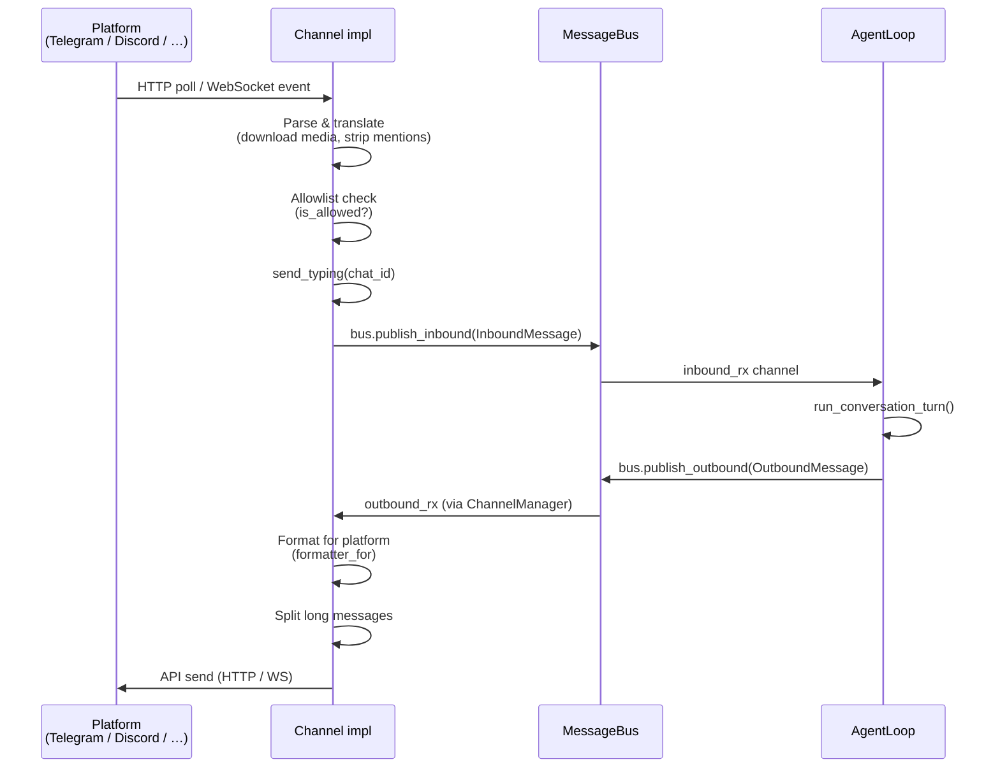
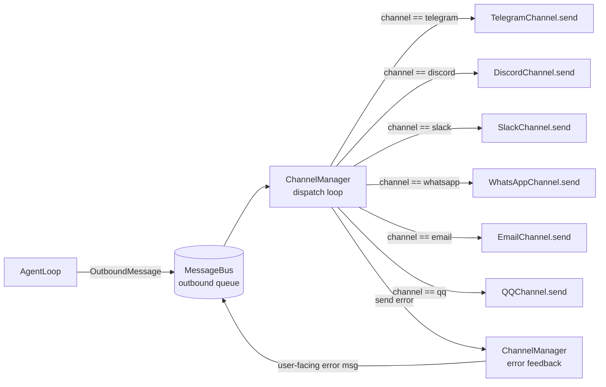
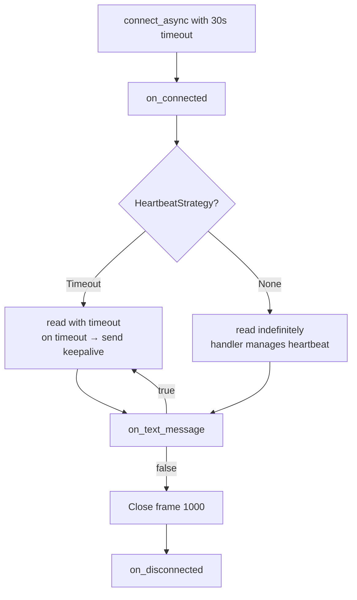
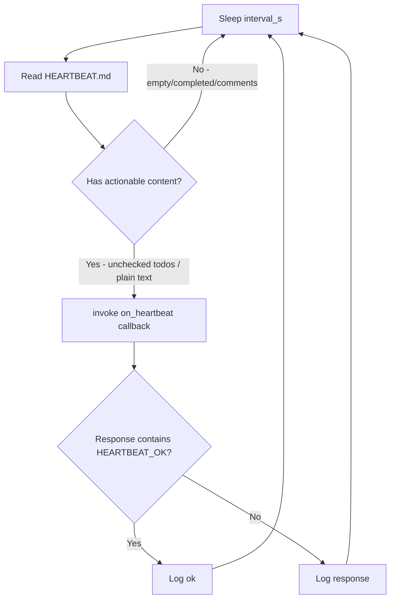
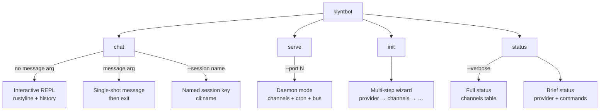
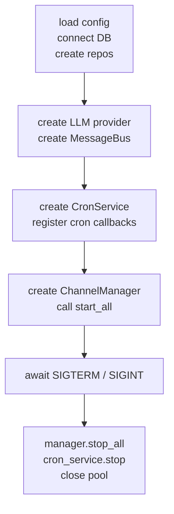
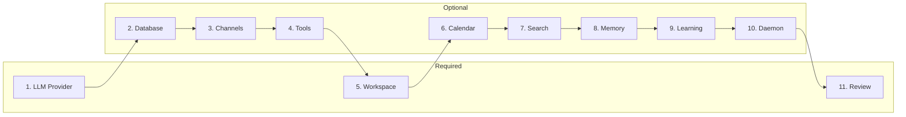

# 04 — Channels & I/O Layer

> **Crates:** `channels` (Layer 4), `heartbeat` (Layer 4), `cli` (Layer 6)
> **Lines of code:** ~24K total (channels 5K, heartbeat 232, cli 19K)

---

## Table of Contents

1. [Overview](#1-overview)
2. [Message Lifecycle](#2-message-lifecycle)
3. [Channels Crate](#3-channels-crate)
   - 3.1 [Channel Trait](#31-channel-trait)
   - 3.2 [ChannelManager](#32-channelmanager)
   - 3.3 [Telegram](#33-telegram)
   - 3.4 [Discord](#34-discord)
   - 3.5 [Slack](#35-slack)
   - 3.6 [WhatsApp](#36-whatsapp)
   - 3.7 [Email](#37-email)
   - 3.8 [QQ](#38-qq)
   - 3.9 [WebSocket Manager](#39-websocket-manager)
   - 3.10 [Formatter](#310-formatter)
   - 3.11 [Message Splitting](#311-message-splitting)
   - 3.12 [Channel Comparison Table](#312-channel-comparison-table)
4. [Heartbeat Crate](#4-heartbeat-crate)
5. [CLI Crate](#5-cli-crate)
   - 5.1 [Command Structure](#51-command-structure)
   - 5.2 [Chat Handler](#52-chat-handler)
   - 5.3 [Serve Handler](#53-serve-handler)
   - 5.4 [Status Handler](#54-status-handler)
   - 5.5 [Interactive Module](#55-interactive-module)
   - 5.6 [Wizard System](#56-wizard-system)
   - 5.7 [Wizard Steps Reference](#57-wizard-steps-reference)
6. [Security Considerations](#6-security-considerations)

---

## 1. Overview

The Channels & I/O layer sits at Layers 4 and 6 of the klyntbot architecture. It is responsible for:

- **Ingesting messages** from 6 chat platforms (Telegram, Discord, WhatsApp, Slack, Email, QQ) and placing them on the internal message bus.
- **Delivering responses** from the agent to the correct platform in the correct format.
- **Periodic agent health checks** via the HeartbeatService.
- **User-facing CLI**: interactive chat, daemon mode, setup wizard, and status display.

```
┌─────────────────────────────────────────────────────────────────┐
│                        External World                           │
│  Telegram  Discord  Slack  WhatsApp  Email  QQ                  │
└────────┬──────┬───────┬──────┬──────┬──────┬───────────────────┘
         │      │       │      │      │      │
         ▼      ▼       ▼      ▼      ▼      ▼
┌─────────────────────────────────────────────────────────────────┐
│                     channels crate (Layer 4)                    │
│  Channel trait · ChannelManager · Formatter · WsManager         │
└──────────────────────────┬──────────────────────────────────────┘
                           │  MessageBus (bus crate)
                           ▼
┌─────────────────────────────────────────────────────────────────┐
│                      agent crate (Layer 5)                      │
│  AgentLoop · ContextEngine · ToolRegistry · PlanExecutor        │
└─────────────────────────────────────────────────────────────────┘
                           │
                           ▼
┌─────────────────────────────────────────────────────────────────┐
│                      cli crate (Layer 6)                        │
│  chat · serve · init · status · wizard · interactive            │
└─────────────────────────────────────────────────────────────────┘
```

---

## 2. Message Lifecycle

### Inbound (platform → agent)



### Outbound routing



---

## 3. Channels Crate

### 3.1 Channel Trait

**File:** `crates/channels/src/lib.rs`

```rust
#[async_trait]
pub trait Channel: Send + Sync {
    /// Channel identifier used in OutboundMessage routing.
    fn name(&self) -> &str;

    /// Long-running task: connects to platform, polls/listens,
    /// publishes InboundMessages to the bus.
    async fn start(&self, bus: Arc<MessageBus>) -> Result<()>;

    /// Signal the channel to stop its background task.
    async fn stop(&self) -> Result<()>;

    /// Send a single OutboundMessage to the platform.
    async fn send(&self, msg: &OutboundMessage) -> Result<()>;

    /// Return true if this sender_id is on the allowlist.
    fn is_allowed(&self, sender_id: &str) -> bool;

    /// Optional typing indicator (default no-op).
    async fn send_typing(&self, _chat_id: &str) -> Result<()> { Ok(()) }
}

pub type DynChannel = Arc<dyn Channel>;
```

The `send_typing` default no-op lets channels that have no typing concept (Email, QQ) skip the implementation entirely, while Telegram and Discord provide animated indicators.

---

### 3.2 ChannelManager

**File:** `crates/channels/src/manager.rs`

```rust
pub struct ChannelManager {
    channels: Arc<RwLock<HashMap<String, DynChannel>>>,
    bus: Arc<MessageBus>,
    outbound_rx: Option<mpsc::Receiver<OutboundMessage>>,
    config: Arc<Config>,
}
```

**Responsibilities:**

| Responsibility | How it works |
|---|---|
| Channel registry | `HashMap<String, DynChannel>` keyed by `channel.name()` |
| Initialization | Reads config, creates each enabled channel, logs failures |
| Outbound dispatch | Owns `outbound_rx`; loops routing each message to its channel |
| Error feedback | On send failure, publishes a user-facing error back to the bus |
| Lifecycle | `start_all()` spawns each channel as a `tokio::task`, `stop_all()` calls `stop()` |

**Anti-recursion guard:** If the error-feedback message itself fails to send, the manager logs and gives up (preventing infinite retry loops).

---

### 3.3 Telegram

**File:** `crates/channels/src/telegram.rs`
**Connection:** HTTP Bot API — long polling

```rust
pub struct TelegramChannel {
    config: TelegramConfig,
    client: Client,                  // reqwest
    api_base: String,                // https://api.telegram.org/bot{token}
    transcriber: Option<TranscriptionProvider>, // Groq for voice
    running: Arc<AtomicBool>,
    typing_tasks: Arc<RwLock<HashMap<String, JoinHandle<()>>>>,
}
```

**Polling loop:** Issues `getUpdates` with `timeout=30`; advances the `offset` after each batch to prevent redelivery. On error, sleeps 5 s and reconnects.

**Retry:** `api_call_with_retry()` — three attempts with 1 s / 2 s / 4 s exponential backoff; parses `TelegramResponse { ok, result, description }`.

**Media handling:** Downloads attachments to `~/.klyntbot/media/` with sanitized filenames. Voice messages are transcribed via Groq (if configured) or annotated as file references.

**Typing indicator:** Spawns a task that POSTs `sendChatAction` (type=`typing`) every 4 s (Telegram's indicator expires after ~5 s). Cancelled when a reply is sent or the channel stops.

**Bot commands:**

| Command | Effect |
|---|---|
| `/start` | Welcome message |
| `/help` | Lists commands |
| `/reset` | Publishes `__RESET_SESSION__` magic message to clear memory |

**Outbound:** Converts Markdown → Telegram HTML via `TelegramFormatter`. Chunks replies at 4 096 chars with a 100 ms inter-chunk delay. Falls back to plain text if HTML parsing fails.

---

### 3.4 Discord

**File:** `crates/channels/src/discord.rs`
**Connection:** Discord Gateway WebSocket

```rust
pub struct DiscordChannel {
    config: DiscordConfig,
    client: Client,
    seq: Arc<RwLock<Option<i64>>>,       // sequence number for heartbeat
    running: Arc<AtomicBool>,
    typing_tasks: Arc<RwLock<HashMap<String, JoinHandle<()>>>>,
    bus: Mutex<Option<Arc<MessageBus>>>,
    heartbeat_task: Mutex<Option<JoinHandle<()>>>,
}
```

**Gateway opcodes:**

| Opcode | Name | Handler |
|---|---|---|
| 10 | HELLO | Starts heartbeat task; sends IDENTIFY |
| 0 | Dispatch | Routes to event handlers (MESSAGE_CREATE, READY) |
| 7 | RECONNECT | Triggers reconnection |
| 9 | INVALID_SESSION | Resets auth; reconnects |
| 11 | HEARTBEAT_ACK | Logged |

**Heartbeat:** Spawned from `handle_hello()` using the server-supplied `heartbeat_interval_ms`. Sends `{"op": 1, "d": seq}` on every tick. Aborted on disconnect via `heartbeat_task.abort()`.

**Message processing:** Filters bot self-messages; downloads attachments (20 MB cap); records `message_id`, `guild_id`, `thread_ts` in metadata.

**Send:** Uses Discord REST API (not the gateway write socket). Handles HTTP 429 with backoff. Stops typing before sending; supports `message_reference` for replies.

**Graceful close:** Sends WebSocket close frame code 1000 (Normal Closure).

---

### 3.5 Slack

**File:** `crates/channels/src/slack.rs`
**Connection:** Slack Socket Mode WebSocket

```rust
pub struct SlackChannel {
    config: SlackConfig,
    client: Client,
    bot_user_id: Arc<RwLock<Option<String>>>,
    running: Arc<AtomicBool>,
    bus: Mutex<Option<Arc<MessageBus>>>,
}
```

**Auth:** `auth.test` REST call verifies bot token and retrieves `bot_user_id` (prevents self-replies).

**Socket Mode:** `apps.connections.open` returns a fresh ephemeral WebSocket URL each connection; not cached.

**Envelope ACK:** Slack requires an ACK JSON response before processing — sent immediately on receipt to prevent redelivery.

**Event filtering rules:**

- Only `message` and `app_mention` event types
- Ignores message subtypes (bot messages, channel join notices)
- In channels/groups: responds only to direct mentions (`<@BOTID>`)
- In DMs: responds to all messages
- Strips `<@BOTID>` prefix from content

**Reactions:** Adds `:eyes:` reaction on receipt (best-effort, non-blocking).

**Metadata stored:**

```json
{
  "slack": {
    "thread_ts": "1234567890.123456",
    "channel_type": "channel"
  }
}
```

Used for reply threading: non-DM channels thread replies using `thread_ts`.

**Outbound:** `chat.postMessage` REST API; Slack mrkdwn format (`*bold*`, `~strike~`, `<url|text>`); 8 000 char limit.

---

### 3.6 WhatsApp

**File:** `crates/channels/src/whatsapp.rs`
**Connection:** WebSocket bridge to an external Node.js [Baileys](https://github.com/WhiskeySockets/Baileys) service

WhatsApp uses a **reverse-bridge architecture**: klyntbot does not connect to WhatsApp directly. Instead, a separately running Baileys bridge service manages the WhatsApp session and forwards messages over a local WebSocket.

```rust
pub struct WhatsAppChannel {
    config: WhatsAppConfig,
    running: Arc<AtomicBool>,
    bus: Mutex<Option<Arc<MessageBus>>>,
    ws_writer: Arc<Mutex<Option<Arc<Mutex<WsSink>>>>>,
}
```

**Bridge message types:**

| Type | Meaning |
|---|---|
| `qr` | QR code string printed to log for scanning |
| `message` | Incoming user message |
| `status` | Connection status update (logged) |
| `error` | Bridge error (logged) |

**Inbound JSON shape:**
```json
{ "type": "message", "from": "+1234567890", "chatId": "+1234567890", "body": "text" }
```

**Outbound JSON shape:**
```json
{ "type": "send", "to": "+1234567890", "body": "text" }
```

Allowlist checks sender phone number against `config.channels.whatsapp.allow_from`.

---

### 3.7 Email

**File:** `crates/channels/src/email.rs`
**Connection:** IMAP polling (inbound) + SMTP (outbound)

**Privacy gate:** Email is feature-gated (`#[cfg(feature = "email")]`) and requires explicit opt-in:

```rust
fn validate_config(&self) -> Result<()> {
    if !self.config.consent_granted {
        return Err(/* "explicit consent required" */);
    }
    // ...
}
```

**Deduplication state:**

```rust
last_subject_by_chat: Arc<RwLock<HashMap<String, String>>>,
last_message_id_by_chat: Arc<RwLock<HashMap<String, String>>>,
processed_uids: Arc<RwLock<HashSet<String>>>,
```

- `processed_uids` prevents reprocessing the same IMAP UID on reconnection.
- `last_subject_by_chat` enables thread tracking (re-using the same subject in replies).

**HTML parsing:** `mail_parser` parses MIME structure; `html2text` converts HTML bodies to plain text.

**Transport:** Uses `lettre` for SMTP sends. Supports TLS or plain TCP for IMAP.

**Chat ID:** Email address of sender (one conversation thread per address).

---

### 3.8 QQ

**File:** `crates/channels/src/qq.rs`
**Connection:** QQ Bot Gateway WebSocket (JSON-RPC style)

```rust
pub struct QQChannel {
    config: QQConfig,
    client: Client,
    access_token: Arc<RwLock<Option<String>>>,
    processed_ids: Arc<RwLock<VecDeque<String>>>,  // rolling dedup window
    running: Arc<AtomicBool>,
    bus: Mutex<Option<Arc<MessageBus>>>,
    seq: RwLock<Option<i64>>,
}
```

**Auth:** REST `app/getAppAccessToken` with `appId` + `clientSecret`. Token cached and passed in the WebSocket HELLO acknowledgement.

**Events handled:**

| Event | Action |
|---|---|
| `READY` | Bot connected, logged |
| `C2C_MESSAGE_CREATE` | Direct message from user → publish to bus |

**Deduplication:** Maintains a `VecDeque<String>` of recently seen message IDs to prevent re-processing on reconnection.

**Allowlist:** Checks `author.id` or `author.user_openid` against `config.channels.qq.allow_from`.

---

### 3.9 WebSocket Manager

**File:** `crates/channels/src/ws_manager.rs`

Shared boilerplate used by Discord, Slack, WhatsApp, and QQ. Channels implement `WsHandler` and the manager handles connect / heartbeat / read-loop / shutdown.

```rust
pub trait WsHandler: Send + Sync {
    async fn on_connected(&self, write: &Arc<Mutex<WsSink>>)
        -> Result<Option<HeartbeatStrategy>>;
    async fn on_text_message(&self, text: &str, write: &Arc<Mutex<WsSink>>)
        -> Result<bool>;   // false = disconnect
    async fn on_disconnected(&self) {}
}

pub enum HeartbeatStrategy {
    Timeout {
        timeout: Duration,
        build_payload: Box<dyn Fn() -> WsMessage + Send + Sync>,
    },
    None,   // Handler manages heartbeat itself (e.g., Discord spawns its own task)
}
```

**Run loop phases:**



---

### 3.10 Formatter

**File:** `crates/channels/src/formatter.rs`

```rust
pub trait ChannelFormatter: Send + Sync {
    fn format(&self, markdown: &str) -> String;
}

pub fn formatter_for(channel: &str) -> &'static dyn ChannelFormatter
```

| Formatter | Channel(s) | Strategy |
|---|---|---|
| `TelegramFormatter` | Telegram | Markdown → HTML; sentinel-protects code blocks; escapes `<`, `>`, `&`; `[link](url)` → `<a href="url">` |
| `PassthroughFormatter` | Discord | No-op; Discord renders Markdown natively |
| `SlackFormatter` | Slack | `**bold**` → `*bold*`; `~~strike~~` → `~strike~`; `[text](url)` → `<url\|text>` |
| `PlainTextFormatter` | WhatsApp, Email, QQ | Strips all markup; links become `text (url)` |

**Security:** The Telegram formatter escapes HTML attributes in link URLs, preventing `[click](url" onmouseover="bad")` injection attacks.

**Code block protection:** Before any substitution, code blocks are replaced with unique sentinel strings and restored afterwards — preventing double-formatting of code content.

---

### 3.11 Message Splitting

**File:** `crates/channels/src/utils.rs`

Per-channel character limits:

| Channel | Limit |
|---|---|
| Telegram | 4 096 |
| Discord | 2 000 |
| WhatsApp | 4 000 |
| Slack | 8 000 |
| Email | 8 000 |
| default | 4 000 |

**Split priority:** paragraph break → line break → sentence break → word break → hard character boundary (UTF-8 safe via `is_char_boundary` walk-back).

---

### 3.12 Channel Comparison Table

| Channel | Auth | Connection | Inbound | Outbound | Typing | Media | Rate limit |
|---|---|---|---|---|---|---|---|
| Telegram | Bot token | HTTP long-poll | `getUpdates` | `sendMessage` (HTML) | `sendChatAction` every 4 s | Download to disk | Backoff 1/2/4 s |
| Discord | Bot token | WebSocket Gateway | Gateway events | REST API | POST `/typing` every 8 s | Download (20 MB cap) | HTTP 429 backoff |
| Slack | Bot + App token | Socket Mode WS | Envelope ACK | `chat.postMessage` | None | N/A | N/A |
| WhatsApp | QR scan (Baileys) | WS bridge to Node | Bridge JSON | Bridge JSON | None | N/A | Bridge-managed |
| Email | IMAP credentials | IMAP poll + SMTP | `mail_parser` | `lettre` SMTP | None | MIME attachments | N/A |
| QQ | App ID + secret | WebSocket Gateway | `C2C_MESSAGE_CREATE` | REST API | None | N/A | N/A |

---

## 4. Heartbeat Crate

**File:** `crates/heartbeat/src/lib.rs`
**Purpose:** Periodically wakes the agent to check for tasks in `HEARTBEAT.md`.

```rust
pub struct HeartbeatService {
    workspace: PathBuf,
    on_heartbeat: Option<HeartbeatCallback>,
    interval_s: u64,
    enabled: bool,
    running: Arc<RwLock<bool>>,
    task: Arc<RwLock<Option<JoinHandle<()>>>>,
}

pub type HeartbeatCallback =
    Arc<dyn Fn(&str) -> Result<String, Box<dyn std::error::Error>> + Send + Sync>;
```

**Default interval:** 30 minutes (1 800 s).

**Tick logic:**



**Empty-file detection:** The reader skips:
- Blank lines
- Headings (`#`)
- HTML comments (`<!-- … -->`)
- Empty checkboxes (`- [ ]`)
- Completed checkboxes (`- [x]`)

Only unchecked items with text (`- [ ] Buy milk`) or plain prose constitute actionable content.

**Example `HEARTBEAT.md`:**

```markdown
# Scheduled Tasks
- [ ] Review open pull requests
- [ ] Send weekly status update

<!-- Done:
- [x] Deploy to staging
-->
```

**Manual trigger:** `trigger_now()` fires an immediate tick outside the interval cycle.

**Design philosophy:** The heartbeat uses the filesystem as a zero-dependency command queue. The agent reads, acts, and can rewrite the file to mark items done — no database required for this loop.

---

## 5. CLI Crate

### 5.1 Command Structure

**File:** `crates/cli/src/commands.rs`



```rust
pub enum Commands {
    Chat {
        message: Option<String>,
        #[arg(short, long, default_value = "cli:default")]
        session: String,
        #[arg(short = 'V', long)]
        verbose: bool,
    },
    Serve {
        #[arg(short, long, default_value = "18790")]
        port: u16,
        #[arg(short, long)]
        verbose: bool,
    },
    Init,
    Status {
        #[arg(short, long)]
        verbose: bool,
    },
}
```

---

### 5.2 Chat Handler

**File:** `crates/cli/src/chat.rs`

**Initialization chain:**

1. Load config (with `KLYNTBOT_*` env overrides)
2. Create LLM provider
3. Create message bus (not used in CLI but required by `AgentLoop`)
4. `StoragePool::connect()` → run migrations
5. `Repos::from_pool(&pool)` → all repositories
6. Construct `AgentLoop`
7. Format session key: `"cli:{session}"` (default: `"cli:default"`)

**Single-shot mode:**

```
klyntbot chat "What is Rust?"
```

Calls `run_with_streaming()` once, prints response, exits.

**Interactive REPL mode:**

```
klyntbot chat           # or klyntbot chat --session work
```

Uses `rustyline::Editor` with history persisted to `~/.klyntbot/history.txt`. The `SlashCommandHelper` provides tab completion and inline hints for slash commands.

**REPL slash commands:**

| Command | Effect |
|---|---|
| `/exit`, `/quit` | Exit the REPL |
| `/clear` | Clear the terminal screen |
| `/session` | Display current session ID |
| `/status` | Show agent status |
| `/history` | Show recent input history |
| `/help` | List all slash commands |
| `/paste` | Enter multi-line paste mode |

**Error guidance:** On database connection failure, the REPL prints a hint suggesting `klyntbot init`.

---

### 5.3 Serve Handler

**File:** `crates/cli/src/serve.rs`

The serve command starts the daemon: channels, cron, heartbeat, and the agent pipeline all run concurrently.



**Cron callbacks registered at startup:**

| Job name | Action |
|---|---|
| `todo_focus_check` | Send focus deadline reminders via NotificationDispatcher |
| `todo_daily_digest` | Summarise tasks for today |
| `todo_overdue_check` | Auto-unfocus expired focus items |
| `__klyntbot_weekly_report` | Trigger the weekly-report skill |
| `__klyntbot_calendar_sync` | Run calendar sync now |
| `__klyntbot_daily_planning` | Trigger daily-planning skill |
| `__klyntbot_finance_daily_review` | Finance module daily review |

**Callback pattern:**

```rust
cron_service.set_callback(Arc::new(move |job| {
    let todo_repo = todo_repo.clone();
    let rt = tokio::runtime::Handle::current();
    rt.block_on(async move {
        match job.name.as_str() {
            "todo_focus_check" => { /* ... */ Ok(Some("Checked N tasks".into())) }
            _ => Ok(None),
        }
    })
}));
```

Callbacks are synchronous (required by the scheduler interface) and use `Handle::current().block_on()` to run async code.

**Message bus wiring:**

- `ChannelManager` takes ownership of `bus.take_outbound_rx()` at construction.
- Each channel publishes inbound messages via `bus.publish_inbound()`.
- `AgentLoop` consumes inbound and publishes outbound.
- `ChannelManager` dispatch loop routes outbound to the correct channel.

---

### 5.4 Status Handler

**File:** `crates/cli/src/status.rs`

**Brief output** (default):

```
klyntbot v0.4.0

Status: ✓ Ready
Provider: anthropic/claude-3-5-sonnet

Commands:
  chat        Start interactive chat
  serve       Start gateway daemon
  status      Show detailed status
  init        Run setup wizard
  --help      Show all commands

Try: klyntbot chat
```

**Verbose output** (`--verbose`): Extends the above with a table of all channels and their enabled/disabled state.

**Provider detection order:** anthropic → openai → openrouter → deepseek → `"none"`. First provider with a non-empty API key is shown as active.

---

### 5.5 Interactive Module

**File:** `crates/cli/src/interactive.rs`

Provides `SlashCommandHelper` — a `rustyline` helper that adds:

- **Tab completion:** Activates only on lines starting with `/`; filters commands by prefix.
- **Inline hints:** Shows the next matching command in a dimmed style as the user types; Tab accepts.
- **Non-intrusive:** No interference with normal text input.

---

### 5.6 Wizard System

#### Framework

**File:** `crates/cli/src/wizard/framework.rs`

```rust
pub trait WizardModule {
    fn name(&self) -> &str;
    fn description(&self) -> &str;
    fn is_required(&self) -> bool { true }
    fn is_applicable(&self, state: &WizardState) -> bool { true }
    fn run(&self, state: &mut WizardState) -> Result<StepResult>;
}

pub enum StepResult {
    Next,    // Advance to next step
    Back,    // Return to previous step
    Skip,    // User declined optional step
    Cancel,  // User aborted the wizard
}
```

**WizardState:**

```rust
pub struct WizardState {
    pub config: Config,          // Being built incrementally
    pub total_steps: usize,
    pub current_step: usize,
    pub is_fresh_install: bool,  // true if no config on disk yet
}
```

On construction, `WizardState::new()` checks whether `~/.klyntbot/config.json` exists. If so it loads the existing config (allowing re-configuration); otherwise it starts from `Config::default()`.

#### Navigation


**Auto-save:** After each `Next` or `Skip` result, the config is saved to disk — progress is never lost if the user closes the terminal mid-wizard.

**Cancel:** Ctrl+C at any prompt raises an error that the runner catches as `StepResult::Cancel`. No config is written.

#### Prompt types

**File:** `crates/cli/src/wizard/prompts/`

| Module | Prompt type | Description |
|---|---|---|
| `text.rs` | Free text | Supports default value; validates before advancing |
| `yes_no.rs` | Yes / No | Single keypress in TTY; line-based in CI |
| `select.rs` | Single-select | Arrow-key navigation from a list |
| `multi_select.rs` | Multi-select | Space to toggle; Enter to confirm |
| `secret.rs` | Password | Input masked with `*` |

**RawModeGuard (RAII):** Every interactive prompt wraps the terminal in raw mode. The guard restores normal mode on `Drop`, ensuring the terminal is always restored even if a prompt panics or returns early.

**Non-TTY fallback:** All prompts check `is_terminal()`. If stdin or stdout is a pipe (CI, scripts, automation), they fall back to line-based input, making the wizard scriptable.

**Terminal utilities:**
- `erase_lines(n)` — moves cursor up N lines and clears them (used to redraw menus).
- `read_key()` — reads a single `crossterm::KeyCode`; converts Ctrl+C to an error.

---

### 5.7 Wizard Steps Reference



| # | Step | Required | Purpose | Config produced |
|---|---|---|---|---|
| 1 | LLM Provider | Yes | Select and configure AI provider; set API key, model, optional base URL | `providers.{name}.apiKey`, `providers.{name}.model`, `agents.defaults.model` |
| 2 | Database | No | Detect / install PostgreSQL + pgvector; test connection; run migrations | `databaseUrl` |
| 3 | Chat Channels | No | Enable/disable channels; enter credentials; set allowlists | `channels.{name}.*` |
| 4 | Tool Permissions | No | Restrict tool access to workspace; disable dangerous tools | `tools.restrictToWorkspace`, `tools.disabled` |
| 5 | Workspace & Notifications | Yes | Set workspace directory; configure notification dispatcher | `workspace`, `notifications.*` |
| 6 | Calendar Sync | No | Configure CalDAV credentials (Google OAuth or generic URL) | `calendar.*` |
| 7 | Semantic Search | No | Enable pgvector search; download embedding model (~420 MB) | `todo.search.*` |
| 8 | Conversation Memory | No | Configure memory retention and embedding dimensions | `memory.*` |
| 9 | Learning System | No | Enable strategy/outcome logging | `learning.*` |
| 10 | Background Daemon | No | Configure `launchd`/`systemd` service file for auto-start | (system service file) |
| 11 | Review & Confirm | Yes | Display summary of all chosen settings; confirm or go back | (no new config) |

**Channel step detail:** For each channel, the wizard:
1. Shows current configuration status (masked credentials).
2. Asks whether to enable.
3. If yes: prompts for required credentials via `secret.rs`.
4. Prompts for allowlist (phone numbers, user IDs, etc.).
5. For platforms requiring OAuth (Discord, Slack): spins up a local HTTP server (`oauth.rs`) to receive the redirect and extract tokens automatically.

**Database step detail:** Smart binary detection:
1. Check `PATH` via `which psql`.
2. Scan Homebrew cellar: `/opt/homebrew/opt/postgresql@*/bin/` (Apple Silicon).
3. Scan Linux apt paths: `/usr/lib/postgresql/*/bin/`.
4. Offer to install via Homebrew or apt if not found.
5. Run `pg_isready` to confirm the server is running.
6. Attempt `StoragePool::connect()` to verify DB access and run migrations.

---

## 6. Security Considerations

| Area | Risk | Mitigation |
|---|---|---|
| API keys | Leaked in logs/debug | Wrapped in `Secret<String>`; `.expose()` required for access; redacted in `Debug`/`Display` |
| Telegram HTML | XSS / attribute injection | Quotes in URLs escaped to `&quot;`; `<`, `>`, `&` escaped |
| Email | Unsolicited access | `consent_granted: true` required in config; feature-gated behind `#[cfg(feature = "email")]` |
| Allowlists | Unauthorised senders | All channels enforce `is_allowed()` before publishing to bus |
| Error loops | Infinite retry on send failure | Anti-recursion guard in ChannelManager; at most one error-feedback message per failure |
| WhatsApp session | QR phishing | Bridge service is local; QR printed to server log only |
| Wizard secrets | Shoulder surfing | Password prompts use `secret.rs` masking |
| CLI sessions | Session hijacking | Sessions namespaced `"cli:{name}"`; separate from channel sessions |
