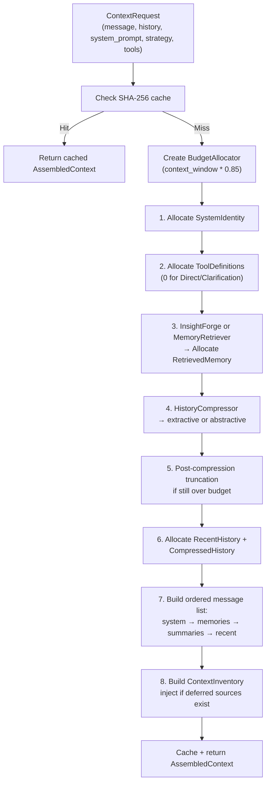
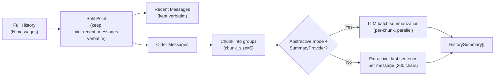
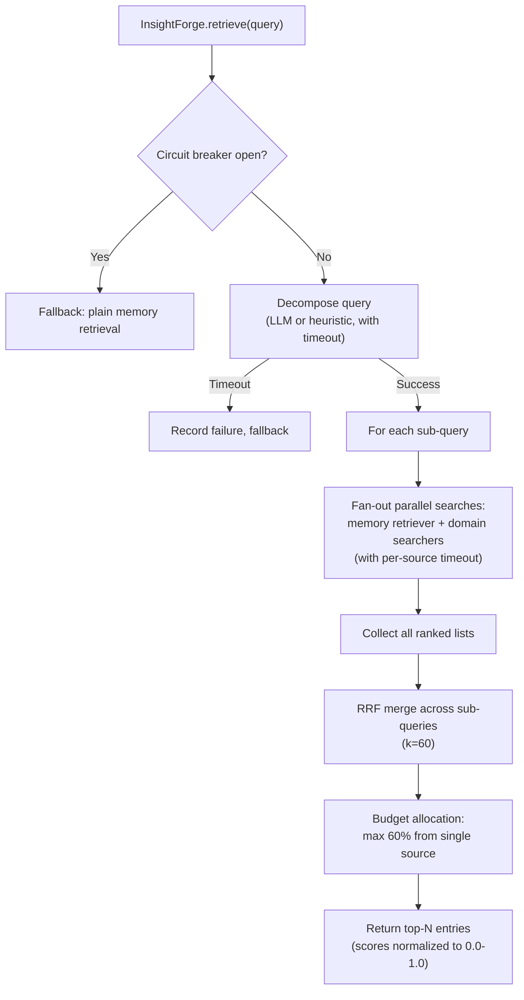

# Context Engine

## Overview

The `context_engine` crate orchestrates everything that goes into the LLM context window. It manages a token budget across priority levels, compresses conversation history, retrieves relevant memories, assembles pluggable context sources into a system prompt, and provides multi-dimensional retrieval via InsightForge.

## Context Assembly Pipeline



## Token Budget Allocation

Content is allocated in waterfall priority order. Higher priority gets budget first.

| Priority | Ordinal | Description | Typical Size |
|---|---|---|---|
| `SystemIdentity` | 0 | Core system prompt + identity | 500-2000 tokens |
| `ActiveTask` | 1 | Currently active task context | 200-500 tokens |
| `ToolDefinitions` | 2 | JSON schemas for available tools | 2000-8000 tokens |
| `RecentHistory` | 3 | Verbatim recent conversation messages | 2000-10000 tokens |
| `RetrievedMemory` | 4 | Embedding-retrieved memories | 500-2000 tokens |
| `CompressedHistory` | 5 | Summarized older conversation history | 500-3000 tokens |
| `BootstrapPersona` | 6 | Persona bootstrapping instructions | 200-1000 tokens |
| `Skills` | 7 | Skill instructions and activated context | 1000-5000 tokens |

Available input = `total_context_window * 0.85` (15% reserved for response generation).

The `BudgetAllocator` warns when remaining budget drops below 15%.

## History Compression



Two modes:
- **Extractive** (default): No LLM call. Takes first sentence/snippet from each message.
- **Abstractive**: LLM-generated summaries via `SummaryProvider`. Falls back to extractive per-chunk on error.

Always keeps at least 4 recent messages verbatim.

## Memory Retrieval

### MemoryRetriever Trait

```rust
#[async_trait]
pub trait MemoryRetriever: Send + Sync {
    async fn retrieve(&self, query: &str, limit: usize) -> Vec<MemoryEntry>;
}
```

Implemented by `UnifiedMemoryService` in the cognitive crate, which merges:
1. **Cognitive facts** -- FSRS-scored semantic facts via vector search
2. **Conversation recall** -- Time-decayed past conversation messages

Merged via Reciprocal Rank Fusion (RRF, k=60).

### Memory Sources in Context

Retrieved memories are grouped in the system prompt:
1. `## Relevant Facts` -- CognitiveFact entries
2. `## Related Conversations` -- ConversationRecall entries
3. `## Related Information` -- Domain search results

## Context Sources

Pluggable context sources inject information into the system prompt:

```rust
#[async_trait]
pub trait ContextSource: Send + Sync {
    fn name(&self) -> &str;
    fn priority(&self) -> u8;        // Higher = appears earlier
    async fn provide(&self, ctx: &SourceContext) -> Option<String>;
    fn estimated_tokens(&self) -> usize { 500 }
    fn protected(&self) -> bool { false }  // Never pruned
}
```

Registered sources (by priority):

| Source | Priority | Content |
|---|---|---|
| `IdentitySource` | 100 | User name, timezone, workspace |
| `BootstrapSource` | 95 | Workspace bootstrap files |
| `SkillContextSource` | 90 | Active orchestrator + skill instructions |
| `PersonaContextSource` | 85 | Active persona instructions |
| `SessionContextSource` | 80 | Session-level context (page, mode) |
| `ConfidenceSource` | 70 | Current confidence threshold |
| `AnnotationContextSource` | 65 | Critical annotations |
| `CognitiveContextSource` | 60 | Static facts + procedural rules |
| `ProjectContextSource` | 55 | Project instructions, role |
| `AreaSource` | 50 | Active areas |
| `TodoSource` | 45 | Focus tasks |
| `ProductivityContextSource` | 40 | Current focus state, score |
| `PageContextSource` | 35 | Page-level UI context |

## InsightForge (Multi-Dimensional Retrieval)

InsightForge decomposes complex queries into sub-queries, fans out parallel searches, and merges results via RRF.



### Domain Searchers

Feature crates implement `DomainSearcher` for their data:

| Searcher | Data Source |
|---|---|
| `NoteSearcher` | NoteRepo (feature-notes) |
| `TaskSearcher` | Repos (storage) |
| `GraphSearcher` | EntityRepo (cognitive knowledge graph) |
| `FinanceSearcher` | Repos (storage) |

### Activation Criteria

InsightForge activates when:
- Config `enabled` is `true`
- Strategy is not `Clarification`
- Message length >= 20 characters

### Circuit Breaker

Per-session circuit breaker prevents cascading failures:
- Trips after 3 failures within a session
- When open, falls back to plain memory retrieval
- Resets after 300 seconds

## Context Expansion

After initial assembly, deferred context sources can be loaded mid-execution via `ContextRequestTool`:

```rust
engine.expand(current_context, source_name, source_ctx)
```

1. Finds the named source in registered sources
2. Calls `provide()` to get content
3. Checks if tokens fit within remaining budget
4. Appends as system message, updates token count
5. Increments context version number

## Caching

- Cache key: SHA-256 of system prompt, history length, last message, message text, strategy, tool count + first tool name, context window
- Deterministic across process restarts
- Configurable cache capacity
