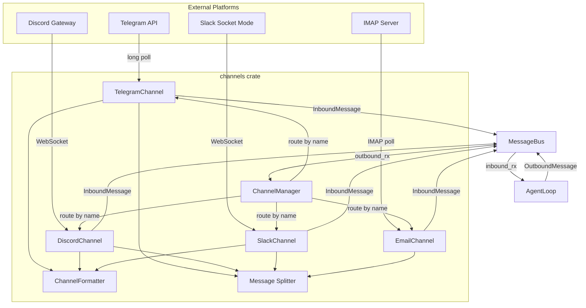

# Channel Integrations

## Overview

The channels crate implements the port/adapter pattern for chat platform integrations. A single `Channel` trait defines the contract; each platform adapter implements it. The `ChannelManager` orchestrates lifecycle and outbound message dispatch.

## Channel Trait

```rust
#[async_trait]
pub trait Channel: Send + Sync {
    fn name(&self) -> &str;
    async fn start(&self, bus: Arc<MessageBus>) -> Result<()>;
    async fn stop(&self) -> Result<()>;
    async fn send(&self, msg: &OutboundMessage) -> Result<()>;
    fn is_allowed(&self, sender_id: &str) -> bool;
    async fn send_typing(&self, chat_id: &str) -> Result<()>;
    fn supports_interaction(&self) -> bool;
    async fn send_interaction(&self, chat_id: &str, request: &InteractionRequest) -> Result<FormResponse>;
}
```

## Platform Comparison

| Feature | Telegram | Discord | Slack | Email |
|---|---|---|---|---|
| **Transport** | HTTP long polling | Raw WebSocket Gateway v10 | Socket Mode WebSocket | IMAP + SMTP |
| **Message Limit** | 4096 chars | 2000 chars | 8000 chars | 8000 chars |
| **Formatting** | HTML (MarkdownV2 -> HTML) | Native Markdown | Slack mrkdwn | Plain text |
| **Media** | Photo/voice/audio/doc download | Attachment download (20MB) | N/A | N/A |
| **Voice** | Groq Whisper transcription | No | No | No |
| **Interactions** | Inline keyboards | Buttons + Select menus | Block Kit buttons/selects | No |
| **Typing** | 4s interval (expires at ~5s) | 8s interval | No | No |
| **Auth** | Bot token + allowlist | Bot token + intents + allowlist | Bot + App token + allowlist | IMAP/SMTP + consent |

## Message Flow



### Inbound Path
1. Platform adapter receives message (poll, WebSocket, IMAP)
2. Check allowlist via `check_allowlist()`
3. Normalize content (strip bot mention, transcribe voice, download media)
4. Publish `InboundMessage` to `MessageBus`
5. `AgentLoop` receives and processes

### Outbound Path
1. `AgentLoop` publishes `OutboundMessage` to `MessageBus`
2. `ChannelManager` dispatcher reads from `outbound_rx`
3. Look up channel by name
4. Format via `formatter_for(channel)`, split via `split_message()`
5. Send chunks with rate-limit retry
6. On failure, send user-facing error feedback

## Shared Infrastructure

### WebSocketManager
Shared connect-heartbeat-read loop for Discord and Slack:
- `WsHandler` trait with `on_connected`, `on_text_message`, `on_disconnected`
- Two heartbeat strategies: `Timeout` (Slack) and `None` (Discord manages its own)
- `reconnect_loop()` for automatic reconnection (5s delay)

### TypingManager
Per-chat typing indicator lifecycle:
- `start(chat_id, interval, send_fn)` -- spawns repeating task
- `stop(chat_id)` -- aborts the task
- Channel-specific intervals: 4s Telegram, 8s Discord

### InteractionTracker
Thread-safe pending interaction state (`DashMap`):
- `PendingCallback::Single` for button presses
- `PendingCallback::FreeText` for text input
- 5-minute timeout for responses
- Callback data format: `"askuser:{chat_id}:{question_id}:{value}"`

### Message Formatting
Four formatters:
- **TelegramFormatter**: Markdown to HTML with code block protection
- **PassthroughFormatter**: No-op for Discord (native markdown)
- **SlackFormatter**: Markdown to Slack mrkdwn
- **PlainTextFormatter**: Strip all markdown for email

All regexes compiled once via `OnceLock`.

### Message Splitting
Priority-ordered split points: paragraph breaks, line breaks, sentence breaks, word breaks, hard character split (UTF-8 safe).

## Connection to Agent Runtime

Channels connect to the agent via `MessageBus`:
- **Inbound**: `InboundMessage` with channel, sender_id, chat_id, content, media, metadata
- **Outbound**: `OutboundMessage` with channel, chat_id, content, reply_to, media
- `SessionKey` format: `"channel:chat_id"` (e.g., `"telegram:123456"`)
