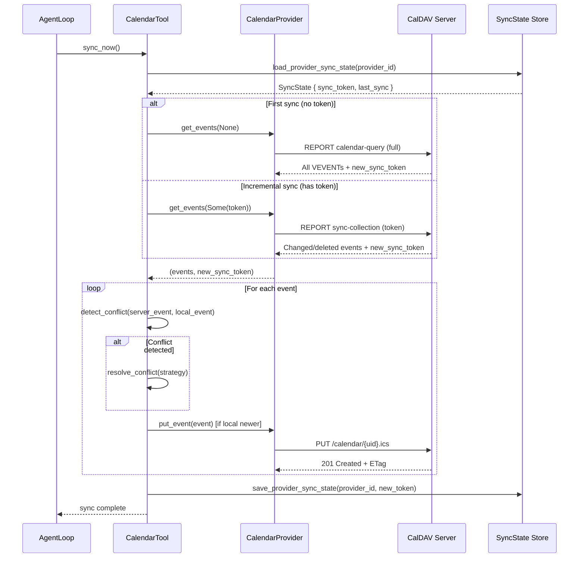
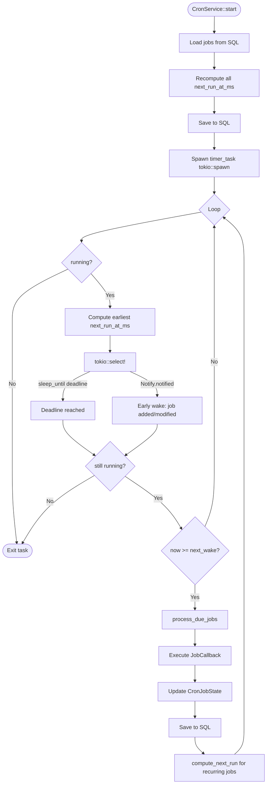
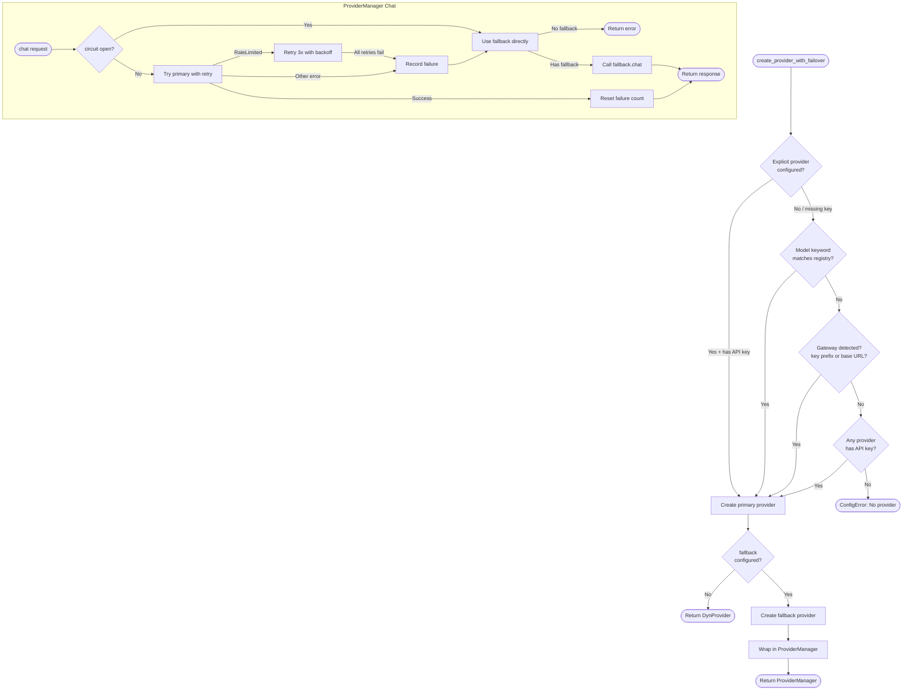
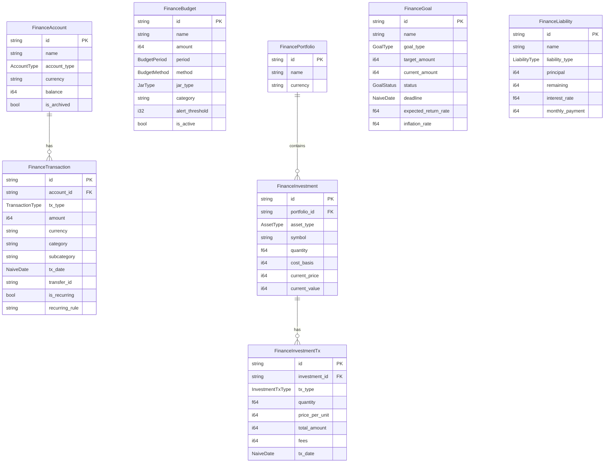
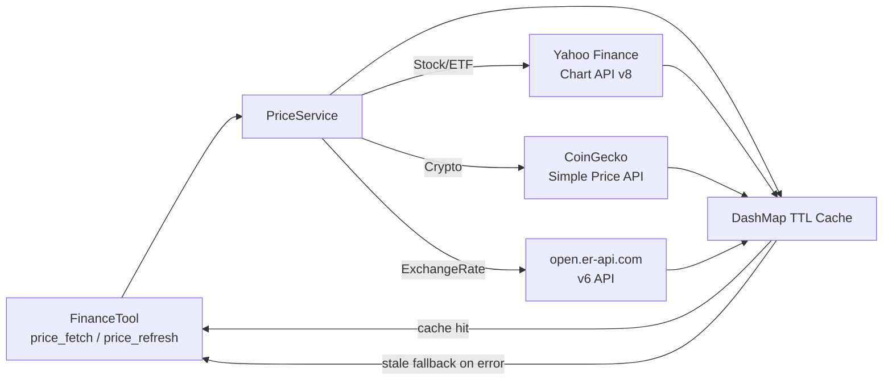

# 05 — Domain Features

> Calendar, Scheduling, LLM Providers, and Finance subsystem deep-dive.

---

## Table of Contents

1. [Calendar Crate](#1-calendar-crate)
   - 1.1 [Overview](#11-overview)
   - 1.2 [CalendarProvider Trait](#12-calendarprovider-trait)
   - 1.3 [Provider Implementations](#13-provider-implementations)
   - 1.4 [CalDAV Client](#14-caldav-client)
   - 1.5 [iCalendar Parser / Generator](#15-icalendar-parser--generator)
   - 1.6 [Sync Engine](#16-sync-engine)
   - 1.7 [Sync State Persistence](#17-sync-state-persistence)
   - 1.8 [CalDAV Sync Cycle Diagram](#18-caldav-sync-cycle-diagram)
2. [Scheduling Crate](#2-scheduling-crate)
   - 2.1 [Overview](#21-overview)
   - 2.2 [CronJob Struct](#22-cronjob-struct)
   - 2.3 [CronSchedule Variants](#23-cronschedule-variants)
   - 2.4 [CronService Architecture](#24-cronservice-architecture)
   - 2.5 [Service Lifecycle](#25-service-lifecycle)
   - 2.6 [Job Execution](#26-job-execution)
   - 2.7 [Cron Tick Loop Diagram](#27-cron-tick-loop-diagram)
3. [Providers Crate](#3-providers-crate)
   - 3.1 [Overview](#31-overview)
   - 3.2 [LlmProvider Trait](#32-llmprovider-trait)
   - 3.3 [Provider Registry](#33-provider-registry)
   - 3.4 [Provider Comparison Table](#34-provider-comparison-table)
   - 3.5 [Provider Auto-Detection Flow](#35-provider-auto-detection-flow)
   - 3.6 [Streaming](#36-streaming)
   - 3.7 [ProviderManager — Failover & Circuit Breaker](#37-providermanager--failover--circuit-breaker)
   - 3.8 [Provider Routing Diagram](#38-provider-routing-diagram)
4. [Finance Subsystem](#4-finance-subsystem)
   - 4.1 [Overview](#41-overview)
   - 4.2 [Domain Model](#42-domain-model)
   - 4.3 [Type Enum Tables](#43-type-enum-tables)
   - 4.4 [FinanceTool Actions](#44-financetool-actions)
   - 4.5 [FinanceHandler Trait](#45-financehandler-trait)
   - 4.6 [PriceService](#46-priceservice)
   - 4.7 [Finance Domain Model Diagram](#47-finance-domain-model-diagram)

---

## 1. Calendar Crate

### 1.1 Overview

**Crate:** `crates/calendar/` (Layer 2)
**Lines:** ~3,300
**Files:** 12

The calendar crate provides a provider-agnostic abstraction over CalDAV (RFC 4791) and Google Calendar REST API. It handles event creation, update, deletion, incremental sync via sync tokens (RFC 6578), conflict detection and resolution, and iCalendar (RFC 5545) VEVENT generation/parsing.

**Public exports from `lib.rs`:**

```rust
pub use caldav::{generate_vevent, parse_vevent, CalDavAuth, CalDavClient};
pub use provider::CalendarProvider;
pub use providers::{AppleCalendarProvider, GenericCalDavProvider, GoogleCalendarProvider};
pub use state::{load_provider_sync_state, save_provider_sync_state};
pub use sync_engine::{detect_conflict, resolve_conflict};
pub use types::{CalendarEvent, ConflictResolutionStrategy, EventSource, SyncState};
```

### 1.2 CalendarProvider Trait

Defined in `crates/calendar/src/provider.rs`. All calendar backends implement this trait uniformly.

```rust
#[async_trait]
pub trait CalendarProvider: Send + Sync {
    fn name(&self) -> &str;
    fn provider_id(&self) -> &str;

    /// Fetch events, optionally using an incremental sync token.
    /// Returns (events, new_sync_token).
    async fn get_events(
        &self,
        sync_token: Option<&str>,
    ) -> Result<(Vec<CalendarEvent>, Option<String>)>;

    /// Create or update an event on the remote calendar. Returns ETag.
    async fn put_event(&self, event: &CalendarEvent) -> Result<String>;

    /// Delete an event by UID.
    async fn delete_event(&self, uid: &str) -> Result<()>;

    /// Test connectivity and authentication.
    async fn test_connection(&self) -> Result<()>;
}
```

**Key types:**

```rust
pub struct CalendarEvent {
    pub uid: String,           // iCalendar UID
    pub summary: String,
    pub description: Option<String>,
    pub start: DateTime<Utc>,
    pub end: DateTime<Utc>,
    pub source: EventSource,   // CalDAV | TodoItem
    pub etag: Option<String>,  // CalDAV ETag for sync
    pub status: Option<String>, // CONFIRMED | CANCELLED | TENTATIVE | COMPLETED
}

pub struct SyncState {
    pub sync_token: Option<String>,  // RFC 6578 incremental sync token
    pub last_sync: Option<DateTime<Utc>>,
}
```

### 1.3 Provider Implementations

| Provider | File | Auth Method | Protocol | Discovery |
|---|---|---|---|---|
| `AppleCalendarProvider` | `providers/apple.rs` | HTTP Basic (iCloud app-specific password) | CalDAV | ✅ auto (well-known → principal → home) |
| `GoogleCalendarProvider` | `providers/google.rs` | OAuth2 Bearer + auto-refresh | REST API v3 | ❌ (direct REST endpoint) |
| `GenericCalDavProvider` | `providers/generic.rs` | HTTP Basic | CalDAV | ✅ optional (best-effort) |

**Apple Calendar (`AppleCalendarProvider`):**
- Wraps `CalDavClient` in a `RwLock<CalDavClient>`
- Lazy discovery: on first operation, performs the full well-known → principal → calendar-home → calendar-name discovery sequence
- Discovery is cached via a `RwLock<bool>` flag; subsequent calls skip re-discovery
- Base URL heuristic: discovery skipped if URL already contains `/calendars/` or ends with `.ics`

**Google Calendar (`GoogleCalendarProvider`):**
- Uses the REST API v3 instead of CalDAV (Google restricts CalDAV to explicitly enabled API)
- Stores `access_token` and `token_expiry` in `RwLock<>` for concurrent refresh safety
- Auto-refreshes the OAuth2 token when within 5 minutes of expiry
- Handles 410 Gone (expired sync token) by falling back to full sync
- JSON↔CalendarEvent conversion: Google uses lowercase status (`"confirmed"`) → converted to iCal uppercase (`"CONFIRMED"`)
- Creates events via `/import` endpoint (preserves iCalUID); updates via `PUT` to `/events/{id}`

**Generic CalDAV (`GenericCalDavProvider`):**
- Suitable for Nextcloud, Fastmail, Zoho, Radicale, and any RFC 4791 server
- `provider_id` is sanitized from the label: `"My Fastmail Calendar!"` → `"generic-my-fastmail-calendar-"`
- Discovery: attempts well-known sequence; falls back gracefully if discovery fails, using the URL as-is

### 1.4 CalDAV Client

`crates/calendar/src/caldav/client.rs` — pure HTTP CalDAV operations.

**Authentication:**
```rust
pub enum CalDavAuth {
    Basic { username: String, password: String },
    Bearer { token: String },  // Google OAuth2
}
```

**HTTP Operations:**
| Method | CalDAV Operation | RFC |
|---|---|---|
| `PROPFIND` (Depth: 0) | Principal URL discovery | RFC 4918 |
| `PROPFIND` (Depth: 0) | Calendar-home-set discovery | RFC 4791 |
| `PROPFIND` (Depth: 1) | List calendars by displayname | RFC 4918 |
| `REPORT` (calendar-query) | Full sync — fetch all VEVENTs | RFC 4791 |
| `REPORT` (sync-collection) | Incremental sync with token | RFC 6578 |
| `PUT` | Create/update event `.ics` | RFC 4791 |
| `DELETE` | Remove event `.ics` | RFC 4791 |

**Discovery Sequence (4 steps):**
1. `PROPFIND /.well-known/caldav` → extract `current-user-principal` href
2. `PROPFIND {principal_url}` → extract `calendar-home-set` href
3. `PROPFIND {calendar_home_url}` (Depth:1) → list all calendars
4. Match by `displayname` (case-insensitive); fall back to first calendar if name not found

**Sync Modes:**
- **Full sync** (no token): sends `calendar-query` REPORT requesting all VEVENTs with `VCALENDAR/VEVENT` filter
- **Incremental sync** (with token): sends `sync-collection` REPORT per RFC 6578; server returns only changed/deleted entries

XML parsing uses `quick_xml` with stateful event tracking across `Start/End/Text/Empty` events.

### 1.5 iCalendar Parser / Generator

`crates/calendar/src/caldav/parser.rs` — minimal RFC 5545 subset.

**`parse_vevent(ical_data: &str) -> Result<CalendarEvent>`:**
- Line-by-line scan, only processes content inside `BEGIN:VEVENT` / `END:VEVENT`
- Field name and parameters split at first `;` (e.g., `DTSTART;TZID=Asia/Bangkok`)
- Parsed fields: `UID`, `SUMMARY`, `DESCRIPTION`, `DTSTART`, `DTEND`, `STATUS`
- Datetime parsing: supports `YYYYMMDDTHHMMSSZ` (UTC), `YYYYMMDDTHHMMSS` (floating), and `TZID=...` timezone-aware formats
- `TZID` parsing uses `chrono_tz::Tz` for IANA timezone names; unknown zones return a `ProtocolError`

**`generate_vevent(event: &CalendarEvent, timezone: &str) -> Result<String>`:**
- Generates `VCALENDAR` → `VTIMEZONE` (if non-UTC) → `VEVENT`
- `VTIMEZONE` component includes `STANDARD` and `DAYLIGHT` subcomponents based on actual timezone rules
- Non-UTC events use `DTSTART;TZID=X:YYYYMMDDTHHMMSS` format
- UTC events use `DTSTART:YYYYMMDDTHHMMSSZ` format
- CRLF line endings (`\r\n`) as required by RFC 5545

### 1.6 Sync Engine

`crates/calendar/src/sync_engine.rs` — two-way sync with conflict resolution.

**Conflict Detection:**
```rust
pub fn detect_conflict(server: &CalendarEvent, local: &CalendarEvent) -> bool {
    // Same UID + any field differs (summary, description, start, end, etag, status)
}
```

**Conflict Resolution Strategies:**

```rust
pub enum ConflictResolutionStrategy {
    ServerWins,     // Default — always return server version
    ClientWins,     // Always return local version
    LastWriteWins,  // ETag lexicographic comparison as recency proxy
    Manual,         // Return server as placeholder; caller surfaces to user
}
```

| Strategy | Behavior | Fallback |
|---|---|---|
| `ServerWins` | Always return server event | — |
| `ClientWins` | Always return local event | — |
| `LastWriteWins` | Higher ETag string wins | Server (when no ETags) |
| `Manual` | Return server as safe placeholder | — |

`LastWriteWins` note: CalDAV servers commonly use monotonically increasing ETag values (integers, timestamps). Lexicographic comparison is a best-effort heuristic.

### 1.7 Sync State Persistence

`crates/calendar/src/state.rs` — `load_provider_sync_state` / `save_provider_sync_state`.

Sync state is keyed by `provider_id()` (e.g., `"apple"`, `"google"`, `"generic-nextcloud"`) and persists the sync token and last sync timestamp across restarts. This enables incremental sync on the next run.

### 1.8 CalDAV Sync Cycle Diagram



---

## 2. Scheduling Crate

### 2.1 Overview

**Crate:** `crates/scheduling/` (Layer 2)
**Lines:** ~1,400
**Files:** 5

The scheduling crate provides a persistent cron job service backed by PostgreSQL. It manages job registration, lifecycle (enable/disable/delete), next-run-time computation, and execution via an injected callback. The timer loop uses `tokio::time::sleep_until` for precision and a `Notify` mechanism for immediate wake-up when jobs are modified.

### 2.2 CronJob Struct

```rust
pub struct CronJob {
    pub id: String,              // 8-char UUID prefix
    pub name: String,
    pub enabled: bool,           // default: true
    pub schedule: CronSchedule,
    pub payload: CronPayload,
    pub state: CronJobState,
    pub created_at_ms: i64,
    pub updated_at_ms: i64,
    pub delete_after_run: bool,  // One-shot: delete after execution
}

pub struct CronPayload {
    pub kind: String,            // default: "agent_turn"
    pub message: String,         // Message sent to agent
    pub deliver: bool,           // Whether to deliver response to channel
    pub channel: Option<String>, // Target channel (telegram, discord, etc.)
    pub to: Option<String>,      // Recipient chat ID
}

pub struct CronJobState {
    pub next_run_at_ms: Option<i64>,
    pub last_run_at_ms: Option<i64>,
    pub last_status: Option<String>,  // "ok" | "error" | "skipped"
    pub last_error: Option<String>,
}
```

### 2.3 CronSchedule Variants

```rust
#[serde(tag = "kind", rename_all = "lowercase")]
pub enum CronSchedule {
    At { at_ms: i64 },               // One-shot at exact timestamp
    Every { every_ms: u64 },         // Fixed interval (e.g., 60000 = 1 min)
    Cron { expr: String,             // Standard cron expression
            tz: Option<String> },    // IANA timezone (e.g., "Asia/Bangkok")
}
```

**Schedule computation:**

| Variant | Next-run logic |
|---|---|
| `At` | `at_ms` if `at_ms > now_ms`, else `None` (expired) |
| `Every` | `now_ms + every_ms` |
| `Cron` | Computed via `cron::Schedule::upcoming(tz)` |

Cron expressions use 6-field format: `sec min hour day month dow` (e.g., `"0 0 9 * * *"` = daily 9am).
Timezone-aware: `tz = None` → UTC; invalid timezone → warn + fallback to UTC.

### 2.4 CronService Architecture

`crates/scheduling/src/service/mod.rs` and `service/executor.rs`.

```rust
pub struct CronService {
    store: Arc<RwLock<CronStore>>,       // In-memory job list
    on_job: Option<JobCallback>,          // Arc<dyn Fn(&CronJob) -> Result<Option<String>>>
    running: Arc<RwLock<bool>>,
    timer_task: Arc<RwLock<Option<JoinHandle<()>>>>,
    repo: Option<storage::CronRepo>,     // SQL persistence (None only in tests)
    wake: Arc<Notify>,                    // Early-wake signal
}

pub type JobCallback = Arc<dyn Fn(&CronJob) -> Result<Option<String>> + Send + Sync>;
```

**Persistence:** `CronJobRow` ↔ `CronJob` conversion via `job_to_row` / `row_to_job`. JSON-serialized `schedule` and `payload` fields stored in SQL JSONB columns.

### 2.5 Service Lifecycle

**`start()`:**
1. Set `running = true`
2. Load jobs from `CronRepo` (SQL → `CronStore`)
3. Recompute `next_run_at_ms` for all enabled jobs
4. Save updated state back to SQL
5. Spawn the timer loop as a Tokio task

**`stop()`:**
1. Set `running = false`
2. Abort the timer task via `JoinHandle::abort()`

**Job management API:**

| Method | Description |
|---|---|
| `add_job(...)` | Creates job, computes next run, saves to SQL, wakes timer |
| `remove_job(id)` | Removes job, saves SQL, wakes timer |
| `enable_job(id, bool)` | Enables/disables; clears or recomputes `next_run_at_ms` |
| `run_job(id, force)` | Immediate execution; ignores `enabled` if `force=true` |
| `list_jobs(include_disabled)` | Returns sorted by `next_run_at_ms` |
| `status()` | Returns JSON `{enabled, jobs, nextWakeAtMs}` |

### 2.6 Job Execution

`crates/scheduling/src/service/executor.rs`

```rust
// Callback result handling
match callback(job) {
    Ok(_) => { status = "ok"; }
    Err(e) => { status = "error"; error_msg = Some(e.to_string()); }
}

// Post-execution state update
match &job.schedule {
    CronSchedule::At { .. } => {
        if job.delete_after_run {
            // Remove from store
        } else {
            job.enabled = false;        // Disable one-shot jobs
            job.state.next_run_at_ms = None;
        }
    }
    _ => {
        // Recurring: compute next run
        job.state.next_run_at_ms = compute_next_run(&job.schedule, now_ms());
    }
}
```

**One-shot behavior:**
- `At` schedule + `delete_after_run = true` → job removed after run
- `At` schedule + `delete_after_run = false` → job disabled, stays in store

### 2.7 Cron Tick Loop Diagram



---

## 3. Providers Crate

### 3.1 Overview

**Crate:** `crates/providers/` (Layer 2)
**Lines:** ~4,500
**Files:** 7

The providers crate defines the `LlmProvider` trait and all concrete LLM backend implementations. It also contains the `ProviderRegistry` (static routing table), model auto-detection logic, and `ProviderManager` (failover + circuit breaker).

### 3.2 LlmProvider Trait

Defined in `crates/providers/src/types.rs`.

```rust
#[async_trait]
pub trait LlmProvider: Send + Sync {
    // Required methods
    async fn chat(
        &self,
        messages: &[Message],
        tools: Option<&[Value]>,
        params: &ChatParams,
    ) -> Result<LlmResponse>;

    fn default_model(&self) -> &str;
    fn name(&self) -> &str;

    // Optional (with defaults)
    async fn chat_stream(...) -> Result<LlmStream>;    // Default: wraps chat() in single chunk
    fn supports_streaming(&self) -> bool;              // Default: false
    async fn count_tokens(...) -> Result<usize>;       // Default: len(json) / 4
    fn capabilities(&self) -> ProviderCapabilities;    // Default: see below
    fn context_window(&self) -> usize;                 // Default: 128_000
    async fn health_check(&self) -> Result<ProviderHealth>; // Default: Unknown
}

pub type DynProvider = Arc<dyn LlmProvider>;
```

**`ProviderCapabilities` flags:**
```rust
pub struct ProviderCapabilities {
    pub extended_thinking: bool,    // Chain-of-thought reasoning
    pub structured_outputs: bool,   // JSON schema response mode
    pub prompt_caching: bool,       // Anthropic prompt caching
    pub native_token_counting: bool,// Exact token counting API
    pub vision: bool,               // Default: true
    pub streaming: bool,            // Default: true
    pub tool_choice_required: bool, // Enforce tool use
    pub parallel_tool_calls: bool,  // Default: true
}
```

**Key request/response types:**

```rust
pub struct ChatParams {
    pub model: String,
    pub temperature: Option<f32>,
    pub max_tokens: Option<u32>,
    pub response_format: Option<ResponseFormat>,
}

pub struct LlmResponse {
    pub content: Option<String>,
    pub tool_calls: Vec<ToolCall>,
    pub finish_reason: String,
    pub usage: Usage,
    pub reasoning_content: Option<String>,  // DeepSeek-R1 thinking
}

pub struct Usage {
    pub prompt_tokens: u32,
    pub completion_tokens: u32,
    pub total_tokens: u32,
    pub cache_read_tokens: u32,   // Anthropic prompt cache
    pub cache_write_tokens: u32,
}
```

**Message variants:**
```rust
pub enum Message {
    System { content: String },
    User { content: UserContent },      // Text or MultiPart (vision)
    Assistant {
        content: Option<String>,
        tool_calls: Option<Vec<ToolCallMessage>>,
        reasoning_content: Option<String>,
    },
    Tool { tool_call_id: String, name: String, content: String },
}
```

### 3.3 Provider Registry

`crates/providers/src/registry.rs` — static `ProviderSpec` table.

```rust
pub struct ProviderSpec {
    pub name: &'static str,              // Config key (e.g., "anthropic")
    pub keywords: &'static [&'static str], // Model-name match keywords
    pub env_key: &'static str,
    pub display_name: &'static str,
    pub prefix: &'static str,            // Model prefix (e.g., "deepseek/")
    pub skip_prefixes: &'static [&'static str],
    pub is_gateway: bool,                // Can route any model
    pub is_local: bool,
    pub detect_by_key_prefix: &'static str,  // e.g., "sk-or-" for OpenRouter
    pub detect_by_base_keyword: &'static str, // e.g., "aihubmix"
    pub default_api_base: &'static str,
    pub strip_model_prefix: bool,        // AiHubMix: strip "anthropic/" then add "openai/"
    pub model_overrides: &'static [(&'static str, &'static [(&'static str, &'static str)])],
}
```

**Registry lookup methods:**
| Method | Description |
|---|---|
| `find_by_model(model)` | Keyword match; skips gateways/local |
| `find_by_name(name)` | Exact config-key match |
| `find_gateway(name, key, base)` | Priority: name → key prefix → base keyword |
| `resolve_model(model, gateway)` | Applies prefix; handles skip_prefixes and strip |
| `get_model_overrides(model)` | Returns per-model param overrides (e.g., temp for Kimi) |

### 3.4 Provider Comparison Table

| Provider | Config Key | Model Keywords | Default API Base | Gateway | Local | Prefix | Key Detection |
|---|---|---|---|---|---|---|---|
| OpenRouter | `openrouter` | `openrouter` | `openrouter.ai/api/v1` | ✅ | ❌ | `openrouter/` | `sk-or-` prefix |
| AiHubMix | `aihubmix` | `aihubmix` | `aihubmix.com/v1` | ✅ | ❌ | `openai/` | Base URL keyword |
| Anthropic | `anthropic` | `anthropic`, `claude` | `api.anthropic.com/v1` | ❌ | ❌ | (none) | — |
| OpenAI | `openai` | `openai`, `gpt` | `api.openai.com/v1` | ❌ | ❌ | (none) | — |
| DeepSeek | `deepseek` | `deepseek` | `api.deepseek.com/v1` | ❌ | ❌ | `deepseek/` | — |
| Gemini | `gemini` | `gemini` | `generativelanguage.googleapis.com/v1` | ❌ | ❌ | `gemini/` | — |
| Zhipu AI | `zhipu` | `zhipu`, `glm`, `zai` | `open.bigmodel.cn/api/paas/v4` | ❌ | ❌ | `zai/` | — |
| DashScope | `dashscope` | `qwen`, `dashscope` | `dashscope.aliyuncs.com/compatible-mode/v1` | ❌ | ❌ | `dashscope/` | — |
| Moonshot | `moonshot` | `moonshot`, `kimi` | `api.moonshot.ai/v1` | ❌ | ❌ | `moonshot/` | — |
| MiniMax | `minimax` | `minimax` | `api.minimax.io/v1` | ❌ | ❌ | `minimax/` | — |
| vLLM | `vllm` | `vllm` | `localhost:8000/v1` | ❌ | ✅ | `hosted_vllm/` | — |
| Groq | `groq` | `groq` | `api.groq.com/openai/v1` | ❌ | ❌ | `groq/` | — |

**Special behaviors:**
- **Anthropic native mode**: When `providers.anthropic.native = true`, uses `AnthropicNativeProvider` (Anthropic Messages API) instead of `OpenAiCompatProvider`. Enables prompt caching, extended thinking, and native token counting.
- **Kimi K2.5 override**: `temperature` is forced to `1.0` (model requirement).
- **AiHubMix strip**: Strips `"anthropic/"` from model names before applying `"openai/"` prefix.

### 3.5 Provider Auto-Detection Flow

`create_provider(config)` in `crates/providers/src/lib.rs`:

```
Priority 1: Explicit `config.agents.defaults.provider` field
     ↓ (if not set or API key missing)
Priority 2: Model name keyword → ProviderRegistry::find_by_model()
     ↓ (if no match)
Priority 3: Gateway detection (API key prefix / api_base keyword)
     ↓ (if no gateway matches)
Priority 4: First configured provider with non-empty API key
     ↓ (if none found)
Error: "No LLM provider configured"
```

### 3.6 Streaming

**`LlmStream` type alias:**
```rust
pub type LlmStream = Pin<Box<dyn Stream<Item = Result<LlmStreamChunk>> + Send>>;

pub struct LlmStreamChunk {
    pub content: Option<String>,              // Text delta
    pub tool_call_delta: Option<ToolCallDelta>, // Accumulated tool call arguments
    pub is_final: bool,
    pub finish_reason: Option<String>,
    pub reasoning_content: Option<String>,   // Thinking model reasoning delta
}
```

**Default implementation:** Providers that don't implement `chat_stream()` fall back to calling `chat()` and wrapping the full response in a single `LlmStreamChunk` with `is_final: true`. This allows all providers to satisfy the streaming API surface.

**`OpenAiCompatProvider`:** Real streaming via Server-Sent Events (SSE). Accumulates tool call JSON across delta chunks using `ToolCallDelta.index` to track parallel tool calls.

**`AnthropicNativeProvider`:** Streaming via Anthropic's native SSE format. Handles `content_block_start`, `content_block_delta`, `content_block_stop` events.

### 3.7 ProviderManager — Failover & Circuit Breaker

`crates/providers/src/manager.rs`

```rust
pub struct ProviderManager {
    primary: DynProvider,
    fallback: Option<DynProvider>,
    pub classifier_provider: Option<DynProvider>,  // Optional complexity routing
    failure_count: Arc<AtomicU32>,
    circuit_open_until: Arc<RwLock<Option<Instant>>>,
    circuit_config: CircuitBreakerConfig,
}

pub struct CircuitBreakerConfig {
    pub failure_threshold: u32,    // Default: 5
    pub reset_timeout_secs: u64,   // Default: 60
}
```

**Retry behavior (rate-limit errors):**
- 3 attempts maximum
- Exponential delays: 500ms → 1s → 2s
- Non-rate-limit errors (e.g., 401 AuthFailed) fail fast (no retry)

**Circuit breaker state machine:**
```
Closed (normal) → [failure_threshold non-retryable errors]
                → Open (bypass primary, route to fallback)
                → [reset_timeout_secs elapsed]
                → Closed (try primary again)
```

**`create_provider_with_failover(config)` behavior:**
1. Creates primary via `create_provider()`
2. If `config.provider_manager.fallback` is set, creates fallback provider
3. Optionally creates a classifier provider for complexity routing
4. Wraps in `ProviderManager`

### 3.8 Provider Routing Diagram



---

## 4. Finance Subsystem

### 4.1 Overview

**Files:**
- `crates/tools/src/finance_types.rs` — Domain enums and structs
- `crates/tools/src/finance_handler.rs` — `FinanceHandler` trait (dependency inversion)
- `crates/tools/src/price_service.rs` — HTTP price fetcher with cache
- `crates/tools/src/finance_tool/` — `FinanceTool` implementation (37+ actions)

The finance subsystem is a comprehensive personal finance manager. It uses the repository pattern via `storage::Finance*Repo` structs. All monetary amounts are stored in the smallest currency unit (cents/satoshis/etc.) as `i64`.

### 4.2 Domain Model

**Core domain structs (with storage `From` impls):**

```rust
pub struct FinanceAccount {
    pub id: String,
    pub name: String,
    pub account_type: AccountType,
    pub currency: String,
    pub balance: i64,          // Smallest unit (cents)
    pub institution: Option<String>,
    pub notes: Option<String>,
    pub is_archived: bool,
    pub created_at: DateTime<Utc>,
    pub updated_at: DateTime<Utc>,
}

pub struct FinanceTransaction {
    pub id: String,
    pub account_id: String,
    pub tx_type: TransactionType,
    pub amount: i64,
    pub currency: String,
    pub category: Option<String>,
    pub subcategory: Option<String>,
    pub counterparty: Option<String>,
    pub notes: Option<String>,
    pub tx_date: NaiveDate,
    pub transfer_id: Option<String>,  // Links debit + credit sides of transfer
    pub is_recurring: bool,
    pub recurring_rule: Option<String>,  // Cron expression
    pub created_at: DateTime<Utc>,
    pub updated_at: DateTime<Utc>,
}

pub struct FinanceBudget {
    pub id: String,
    pub name: String,
    pub amount: i64,
    pub currency: String,
    pub period: BudgetPeriod,
    pub category: Option<String>,
    pub method: BudgetMethod,
    pub jar_type: Option<JarType>,  // Six-Jar category
    pub start_date: NaiveDate,
    pub end_date: Option<NaiveDate>,
    pub is_active: bool,
    pub alert_threshold: i32,       // 0-100 percentage
    pub created_at: DateTime<Utc>,
    pub updated_at: DateTime<Utc>,
}

pub struct FinancePortfolio {
    pub id: String,
    pub name: String,
    pub description: Option<String>,
    pub currency: String,
    ...
}

pub struct FinanceInvestment {
    pub id: String,
    pub portfolio_id: String,
    pub asset_type: AssetType,
    pub symbol: Option<String>,    // Ticker (AAPL, bitcoin)
    pub name: String,
    pub quantity: f64,
    pub cost_basis: i64,           // Total cost in smallest unit
    pub current_price: Option<i64>,
    pub current_value: Option<i64>,
    pub purchase_date: Option<NaiveDate>,
    ...
}

pub struct FinanceGoal {
    pub id: String,
    pub name: String,
    pub goal_type: GoalType,
    pub target_amount: i64,
    pub current_amount: i64,
    pub status: GoalStatus,
    pub deadline: Option<NaiveDate>,
    pub monthly_contribution: Option<i64>,
    pub expected_return_rate: Option<f64>,
    pub inflation_rate: Option<f64>,
    ...
}

pub struct FinanceLiability {
    pub id: String,
    pub name: String,
    pub liability_type: LiabilityType,
    pub principal: i64,
    pub remaining: i64,
    pub interest_rate: Option<f64>,
    pub monthly_payment: Option<i64>,
    pub due_date: Option<NaiveDate>,
    ...
}
```

### 4.3 Type Enum Tables

**AccountType:**

| Variant | `as_str()` | `from_str_loose` aliases |
|---|---|---|
| `Cash` | `cash` | `cash` |
| `Bank` | `bank` | `bank` |
| `Ewallet` | `ewallet` | `ewallet`, `e_wallet` |
| `CryptoWallet` | `crypto_wallet` | `crypto_wallet`, `cryptowallet` |
| `Brokerage` | `brokerage` | `brokerage` |
| `Other` (default) | `other` | `other` |

**TransactionType:**

| Variant | `as_str()` | Notes |
|---|---|---|
| `Income` | `income` | |
| `Expense` (default) | `expense` | |
| `Transfer` | `transfer` | Links debit + credit via `transfer_id` |

**BudgetPeriod:**

| Variant | `as_str()` | `from_str_loose` aliases |
|---|---|---|
| `Monthly` (default) | `monthly` | `monthly`, `month` |
| `Weekly` | `weekly` | `weekly`, `week` |
| `Yearly` | `yearly` | `yearly`, `year`, `annual` |
| `Custom` | `custom` | `custom` |

**BudgetMethod:**

| Variant | `as_str()` | `from_str_loose` aliases |
|---|---|---|
| `Standard` (default) | `standard` | `standard` |
| `SixJar` | `six_jar` | `six_jar`, `sixjar`, `6jar` |

**JarType (Six-Jar budgeting):**

| Variant | `as_str()` | Purpose |
|---|---|---|
| `Essentials` | `essentials` | Rent, food, utilities |
| `Savings` | `savings` | Emergency fund |
| `Investment` | `investment` | Stocks, crypto |
| `Education` | `education` | Books, courses |
| `Entertainment` | `entertainment` | Fun, hobbies |
| `Charity` | `charity` | Donations |

**AssetType:**

| Variant | `as_str()` | `from_str_loose` aliases | Used by PriceService |
|---|---|---|---|
| `Stock` | `stock` | `stock`, `stocks`, `equity` | Yahoo Finance API |
| `Etf` | `etf` | `etf` | Yahoo Finance API |
| `Crypto` | `crypto` | `crypto`, `cryptocurrency` | CoinGecko API |
| `RealEstate` | `real_estate` | `real_estate`, `realestate`, `property` | (manual) |
| `Bond` | `bond` | `bond`, `bonds`, `fixed_income` | (manual) |
| `Other` (default) | `other` | `other` | (manual) |
| `ExchangeRate` | `exchange_rate` | `exchange_rate`, `forex`, `fx` | open.er-api.com |

**InvestmentTxType:**

| Variant | `as_str()` | `from_str_loose` aliases |
|---|---|---|
| `Buy` (default) | `buy` | `buy`, `purchase` |
| `Sell` | `sell` | `sell`, `sale` |
| `Dividend` | `dividend` | `dividend` |
| `RentalIncome` | `rental_income` | `rental_income`, `rental`, `rent` |
| `Interest` | `interest` | `interest` |
| `Split` | `split` | `split` |

**GoalType:**

| Variant | `as_str()` | Notes |
|---|---|---|
| `Savings` (default) | `savings` | Emergency fund, savings target |
| `Purchase` | `purchase` | Saving for a specific purchase |
| `DebtPayoff` | `debt_payoff` | Debt elimination goal |
| `Fire` | `fire` | Financial Independence, Retire Early |
| `Custom` | `custom` | User-defined goal |

**GoalStatus:**

| Variant | `as_str()` | `from_str_loose` aliases |
|---|---|---|
| `Active` (default) | `active` | `active`, `in_progress` |
| `Achieved` | `achieved` | `achieved`, `completed`, `done` |
| `Abandoned` | `abandoned` | `abandoned`, `cancelled` |

**LiabilityType:**

| Variant | `as_str()` | `from_str_loose` aliases |
|---|---|---|
| `Mortgage` | `mortgage` | `mortgage`, `home_loan` |
| `CreditCard` | `credit_card` | `credit_card`, `creditcard`, `cc` |
| `PersonalLoan` | `personal_loan` | `personal_loan`, `personal` |
| `StudentLoan` | `student_loan` | `student_loan`, `student`, `education_loan` |
| `Other` (default) | `other` | `other` |

### 4.4 FinanceTool Actions

`FinanceTool` dispatches 41 actions across 7 sub-modules:

| Module | Actions |
|---|---|
| **accounts** | `account_add`, `account_list`, `account_update`, `account_delete` |
| **transactions** | `tx_add`, `tx_list`, `tx_update`, `tx_delete`, `tx_search`, `tx_recurring_add` |
| **budgets** | `budget_create`, `budget_list`, `budget_status`, `budget_update`, `budget_delete` |
| **investments** | `portfolio_create`, `portfolio_list`, `investment_add`, `investment_update`, `investment_tx`, `investment_summary`, `price_fetch`, `price_refresh` |
| **goals** | `goal_create`, `goal_list`, `goal_update`, `goal_fire`, `goal_whatif`, `liability_add`, `liability_list`, `liability_update`, `net_worth` |
| **reports** | `report_spending`, `report_income`, `report_trends`, `report_net_worth_history`, `daily_review` |
| **health** | `finance_health_check` |
| **settings** | `settings_get`, `settings_update` |

**Tool construction:**
```rust
pub struct FinanceTool {
    accounts: storage::FinanceAccountRepo,
    transactions: storage::FinanceTransactionRepo,
    budgets: storage::FinanceBudgetRepo,
    investments: storage::FinanceInvestmentRepo,
    goals: storage::FinanceGoalRepo,
    liabilities: storage::FinanceLiabilityRepo,
    price_service: PriceService,
    finance_handler: Option<Arc<dyn FinanceHandler>>,
    default_currency: String,
}
```

`finance_handler` is optionally attached via `with_finance_handler(handler)` for proactive behaviors (daily review, budget alerts). When `None`, autonomous actions are unavailable.

### 4.5 FinanceHandler Trait

`crates/tools/src/finance_handler.rs` — dependency inversion for autonomous finance behaviors.

```rust
#[async_trait]
pub trait FinanceHandler: Send + Sync {
    /// Generate a comprehensive daily financial review narrative.
    async fn daily_review(&self) -> Result<String>;

    /// Check all active budgets; return alerts for exceeded thresholds.
    async fn check_budgets(&self) -> Result<Vec<BudgetAlert>>;

    /// Refresh market prices for all tracked investments.
    async fn refresh_prices(&self) -> Result<PriceUpdateSummary>;

    /// Analyse spending patterns for a given period (e.g. "this_month").
    async fn analyze_spending(&self, period: &str) -> Result<String>;

    /// Run data integrity health checks.
    async fn run_health_check(&self) -> Result<String>;

    /// Return the configured proactivity level.
    fn proactivity_level(&self) -> ProactivityLevel;
}
```

**Proactivity levels:**
```rust
pub enum ProactivityLevel {
    Full,      // Daily reviews, budget warnings, price alerts
    Moderate,  // Significant events only (budget >80%, large price moves)
    Reactive,  // Explicit queries only — no unsolicited messages
}
```

**Support types:**
```rust
pub struct BudgetAlert {
    pub budget_name: String,
    pub category: Option<String>,
    pub spent: i64,
    pub limit: i64,
    pub percentage: f64,   // 0.0 – 100.0+
    pub currency: String,
}

pub struct PriceUpdateSummary {
    pub updated: usize,
    pub failed: usize,
    pub details: Vec<String>,  // Per-asset result lines
}
```

**Dependency inversion:** `FinanceHandler` is defined in `tools` (Layer 3) but implemented by `FinanceHandlerImpl` in `agent` (Layer 5). This avoids a circular dependency between `tools` → `agent`.

### 4.6 PriceService

`crates/tools/src/price_service.rs` — HTTP price fetcher with `DashMap`-backed TTL cache.

```rust
#[derive(Clone)]
pub struct PriceService {
    client: reqwest::Client,      // 10s timeout, "klyntbot/1.0" user-agent
    cache: Arc<DashMap<String, CachedPrice>>,  // Thread-safe, shared across clones
    cache_ttl: Duration,
}
```

**Price sources by asset type:**

| AssetType | API | Endpoint |
|---|---|---|
| `Stock`, `Etf` | Yahoo Finance Chart v8 | `query1.finance.yahoo.com/v8/finance/chart/{symbol}` |
| `Crypto` | CoinGecko Simple Price | `api.coingecko.com/api/v3/simple/price?ids={id}&vs_currencies={vs}` |
| `ExchangeRate` | open.er-api.com v6 | `open.er-api.com/v6/latest/{from}` |

**Cache key format:** `{SYMBOL}` for stocks; `{COIN}:{VS_CURRENCY}` for crypto; `{FROM}:{TO}` for exchange rates. All uppercase.

**Retry policy:** Up to 2 retries on HTTP 429 (Too Many Requests) with delays 1s → 3s.

**Stale cache fallback:** On HTTP error, returns stale (expired) cache entry rather than propagating the error. Source tagged as `"cache_stale"`.

**Crypto ticker mapping:** Common tickers auto-mapped to CoinGecko IDs:
`BTC` → `"bitcoin"`, `ETH` → `"ethereum"`, `SOL` → `"solana"`, `BNB` → `"binancecoin"`, and 20+ more.

**Symbol format for pairs:** `"bitcoin/eur"` → split at `/` → coin=`"bitcoin"`, vs=`"eur"`. If no `/`, defaults to `"usd"`.

**Unified entry point:**
```rust
pub async fn fetch_price(
    &self,
    symbol: &str,
    asset_type: AssetType,
) -> Result<PriceResult, String>
```
Dispatches to `fetch_stock`, `fetch_crypto`, or `fetch_exchange_rate` based on `asset_type`.

### 4.7 Finance Domain Model Diagram



**Price data flow:**

