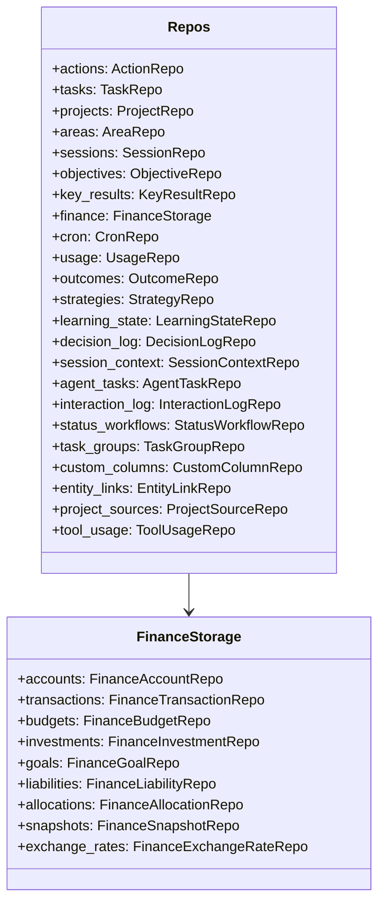
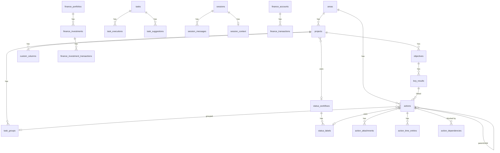

# Storage Architecture: SQLite + LanceDB

## Dual Storage Design

Klyntbot uses two complementary storage engines:

| Engine | Purpose | Location | Access Pattern |
|---|---|---|---|
| **SQLite** | Relational data, FTS5 full-text search | `{data_dir}/data.db` | `StoragePool` -> `Repos` |
| **LanceDB** | 384-dim vector embeddings for semantic search | `{data_dir}/lance/` | `VectorStore` |

Data dir defaults to `~/.klyntbot`. Override via `KLYNTBOT_HOME` env var.

## StoragePool

`StoragePool` wraps `sqlx::SqlitePool` (Clone+Send+Sync, no `Arc<RwLock>` needed):

```rust
StoragePool::connect(data_dir)       // Opens/creates DB, enables WAL+FK+busy_timeout, runs migrations
StoragePool::connect_in_memory()     // Tests: all migrations applied in-memory
StoragePool::from_existing(pool)     // Wraps already-migrated pool (skips migrations)
```

PRAGMA settings on every connect: `journal_mode=WAL`, `foreign_keys=ON`, `busy_timeout=5000`.

## Repos Aggregate

`Repos::from_pool(&pool)` constructs all 22+ repositories:



## Key Tables (ER Diagram)



## LanceDB Vector Store

9 embedding tables, all 384-dimensional Float32 vectors:

| Table | Purpose | Extra Fields |
|---|---|---|
| `todo_embeddings` | Action/todo item embeddings | model, updated_at |
| `task_embeddings` | Task item embeddings | model, updated_at |
| `note_embeddings` | Note content embeddings | model, updated_at |
| `conv_embeddings` | Conversation message embeddings | session_key, role, content_preview, full_content |
| `cognitive_fact_embeddings` | Semantic fact embeddings | domain, text, importance, stability, confidence |
| `activity_embeddings` | Activity log embeddings | source, work_context_id, timestamp |
| `work_context_embeddings` | Work context embeddings | updated_at |
| `insight_embeddings` | Insight content embeddings | updated_at |
| `entity_embeddings` | Knowledge graph entity embeddings | name, entity_type, description |

### Operations

- `upsert_embedding(table, id, vector, fields)` -- insert-then-delete-old for crash safety
- `search_similar(table, query, limit, threshold)` -- nearest-neighbor, score = 1 - distance
- `search_cognitive_facts(query, domains, top_k, min_similarity)` -- domain-filtered fact search
- `search_conv_embeddings(query, limit, threshold)` -- conversation search with metadata
- `ensure_indexes(min_rows)` -- creates IVF-PQ cosine indexes when tables have 256+ rows
- `dedup_table(table, ts_column)` -- removes duplicates keeping newest per ID

## Migration System

### Core Migrations
`crates/storage/migrations/001_initial.sql` -- full baseline schema. Runs automatically via sqlx during `StoragePool::connect()`.

### Feature Migrations
Feature crates register their own migrations via `FeatureMigration`:

```rust
pub struct FeatureMigration {
    pub feature_name: String,
    pub version: i64,
    pub description: String,
    pub sql: String,
}
```

Tracked in `_feature_migrations` table with `(feature_name, version)` primary key. Applied transactionally during startup by `StoragePool::run_feature_migrations()`.

Feature crates with migrations:
- `feature-notes` (v6): notebooks, notes, tags, links, versions, FTS5
- `feature-tasks` (v1): tasks table with agentic fields
- `feature-finance` (v1): accounts, transactions, budgets, investments, goals, liabilities
- `feature-productivity` (v1): activity events, focus sessions, daily summaries
- `cognitive` (v1): semantic facts, episodic memories, procedural rules, flashcards, entities
- `activity-log` (v1): unified activity log tables
- `feature-launcher` (v1): frequencies, clipboard history, FTS5

## Repository Pattern

Repos use declarative macros to eliminate CRUD boilerplate:

| Macro | Generates |
|---|---|
| `crud_repo!(Repo, "table", Row, "label")` | `new`, `get`, `get_or_err`, `delete` |
| `focus_impl!(Repo, "table", Row)` | `focus`, `unfocus`, `list_focused` |
| `delete_older_than_impl!("table", "col")` | Retention cleanup method |
| `get_by_ids_impl!("table", Row)` | Batch fetch with IN clause |

All row types derive `Debug, Clone, FromRow, Serialize` with `#[serde(rename_all = "camelCase")]`.

## Analytics Cleanup

`repos.cleanup_analytics()` runs retention deletes in parallel:
- `strategy_records`: 90 days
- `learning_outcomes`: 30 days
- `interaction_log`: 60 days
- `tool_usage`: 90 days
- `enrichment_feedback`: 90 days
