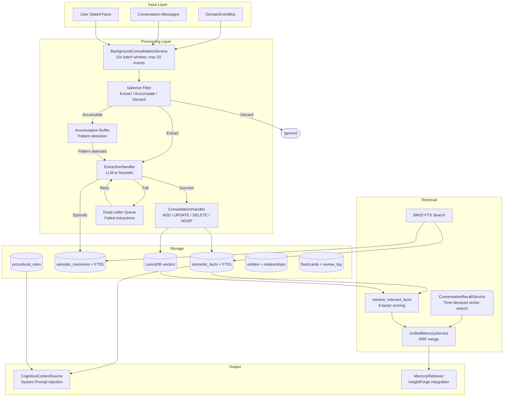

# Cognitive Memory System

## Overview

The cognitive crate implements Klyntbot's persistent memory. It stores what the agent learns about the user as structured semantic facts (SPO triples), episodic memories (narrative events), and procedural rules (learned behaviors). The system uses FSRS (Free Spaced Repetition Scheduler) for memory decay, bi-temporal storage for fact versioning, and a Mem0-inspired consolidation pipeline.

## Architecture



## Memory Types

### Semantic Facts (SPO Triples)
The primary memory unit with bi-temporal markers and FSRS decay:

| Field | Purpose |
|---|---|
| `subject`, `predicate`, `object` | Structured knowledge triple |
| `domain` | Category: identity, energy, work, finance, learning, preferences, general, tasks, coaching, meta |
| `confidence` | 0.0-1.0 extraction confidence |
| `valid_from` / `valid_until` | When fact was/stopped being true in the real world |
| `recorded_at` / `superseded_at` | When system recorded/superseded this fact |
| `stability` | FSRS stability parameter (days) |
| `access_count` | Retrieval reinforcement counter |
| `memory_type` | fact, decision, milestone, pattern, insight |
| `scope_type` / `scope_id` | global, project, squad, persona |

### Episodic Memories
Narrative records of significant events with importance scores, FSRS decay, and scoping.

### Procedural Rules
Behavioral rules learned from patterns: "When X happens, do Y." Active rules are injected into the system prompt.

## Memory Pipeline

### 1. Salience Filter
Classifies `DomainEvent`s into three tiers:

| Verdict | Events | Processing |
|---|---|---|
| **Extract** | ChatTurnCompleted, UserStatedFact, BudgetAlert, coaching feedback | Immediate extraction |
| **Accumulate** | ProductivityScoreComputed, FocusSessionEnded, normal TaskCompleted | Buffered for pattern detection |
| **Discard** | SessionCreated, RuleEvolved | Ignored |

### 2. Accumulation and Promotion
Observations are buffered and promoted to extraction when:
- Count >= `promote_threshold` (configurable, default 5)
- Seen across >= `min_days` distinct days (configurable, default 3)

### 3. Extraction
`ExtractionHandler` converts observations to `ExtractedFact` candidates:
- **LLM path**: Sends batch to LLM, parses structured SPO output
- **Heuristic fallback**: Regex-based extraction when LLM fails
- Failed extractions go to dead-letter queue for periodic retry

### 4. Consolidation (Mem0-style)
For each candidate fact, decides: ADD, UPDATE, DELETE, or NOOP.
- Looks up existing facts with matching subject/predicate
- `ConsolidationHandler.decide_batch()` makes the decision
- UPDATE supersedes old fact (sets `superseded_at` + `superseded_by`)
- Embeddings updated in LanceDB alongside SQLite writes

## Memory Retrieval

### FSRS Decay
```
R = exp(ln(0.9) * elapsed_days / stability)
```
At stability=S days, retrievability is 0.9 (90% recall probability).

### 6-Factor Relevance Scoring
```
relevance = semantic_similarity * 0.30    (from vector search)
           + retrievability * 0.20         (FSRS decay)
           + importance * 0.15             (confidence)
           + access_frequency * 0.10       (log-normalized)
           + situational_boost * 0.20      (from UserSituation)
           + temporal_recency * 0.05       (recency of valid_from)
```

### UnifiedMemoryService
Merges cognitive facts and conversation recall via Reciprocal Rank Fusion (RRF, k=60):
1. `retrieve_relevant_facts()` -- FSRS-scored facts from vector + SQL
2. `ConversationRecallService` -- Time-decayed conversation messages
3. Deduplicate by content (facts win over conversation matches)

## Weekly Reflection
Periodic cross-domain pattern synthesis (Monday 9am):
1. Load episodic memories from past 7 days (min 20 required)
2. Load current `UserModel` and procedural rules
3. LLM-powered reflection produces fact updates and rule updates
4. Store reflection summary as episodic memory

## Memory Lifecycle

### Compaction (daily)
- Archive superseded facts older than 90 days
- Delete low-access episodic memories older than 90 days
- Enforce size budget: archive low-stability facts if count > 10,000

### Scope Promotion
Facts can escalate scope: persona -> squad -> global

## Knowledge Graph
`EntityRepo` stores graph entities and relationships:
- `EntityRow`: name, type, description, aliases
- `RelationshipRow`: from, to, relation_type, confidence
- `GraphNeighborhood`: entity + inbound/outbound edges
- Used for scenario reasoning graph traversal

## FSRS-5 Flashcard System
Separate from cognitive memory decay:
- 19 default weights for initial stability/difficulty
- `retrievability()`, `next_stability()`, `next_difficulty()`, `optimal_interval()`
- Used by `FlashcardRepo` for scheduling spaced repetition reviews

## Integration Points

1. **Context assembly**: `CognitiveContextSource` injects static facts + procedural rules
2. **Memory retrieval**: `UnifiedMemoryService` as `MemoryRetriever` for InsightForge
3. **Background processing**: `BackgroundConsolidationService` subscribes to DomainEventBus
4. **Situation awareness**: `UserSituation` modulates retrieval scoring and coaching
5. **Squad execution**: `SquadRepo`, `BlackboardRepo`, `PersonaRepo` for multi-persona debate
