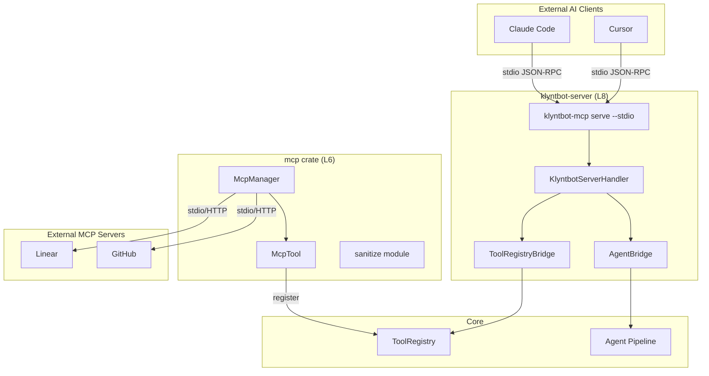
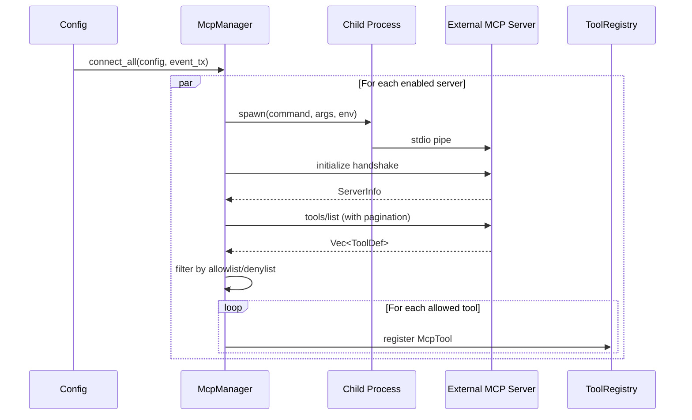
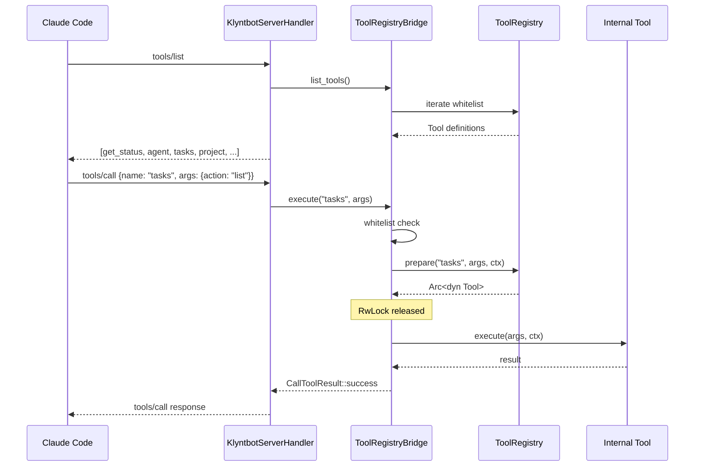
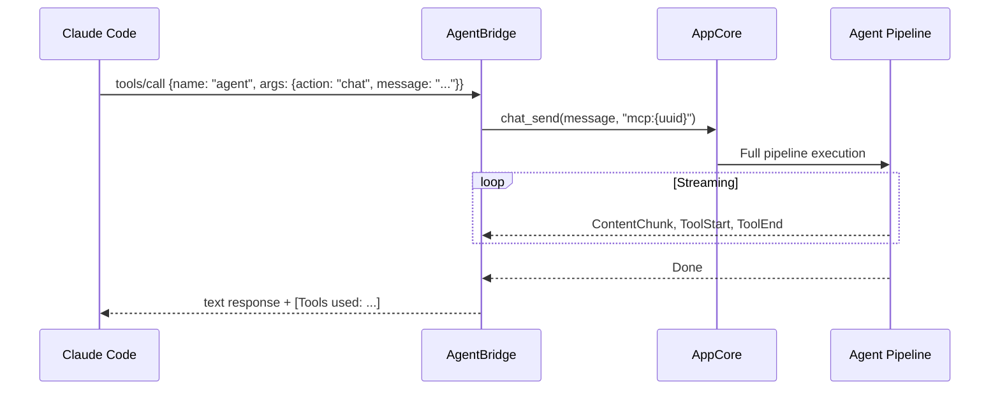

# MCP Architecture

## Overview

Klyntbot provides bidirectional MCP (Model Context Protocol) integration:
- **MCP Client**: Connects to external MCP servers (Linear, GitHub, Notion, etc.)
- **MCP Server**: Exposes internal tools to external AI clients (Claude Code, Cursor)

Built on the `rmcp` library for protocol handling, transport layers, and JSON-RPC framing.

## Architecture



## MCP Client

### McpManager Lifecycle



### McpTool Adapter
Wraps remote MCP tools as `tools_core::Tool`:
- **Name**: `mcp_{sanitized_server}_{sanitized_tool}` (max 64 chars)
- **Permission**: `PermissionLevel::Elevated` (network calls)
- **Timeout**: Per-server configurable (`tool_timeout_sec`, default 120)
- **Execution**: Calls `peer.call_tool()` with original tool name

### Tool Name Sanitization
- Replace non-alphanumeric chars with `_`
- Format: `mcp_{server}_{tool}`
- Truncate at 55 chars + 8-char hex hash suffix if over 64

### Transport Support
- **Stdio**: Spawns child process, communicates via stdin/stdout
- **HTTP**: Streamable HTTP with optional OAuth Bearer token

### Per-Server Tool Filtering
- `enabled_tools` (allowlist) -- when set, only these tools are registered
- `disabled_tools` (denylist) -- excluded tools
- Allowlist takes precedence over denylist

## MCP Server

### Tool Categories
1. **`get_status`** -- Built-in, always present
2. **`agent`** -- Natural language delegation to full AI pipeline (if whitelisted)
3. **Registry tools** -- Internal tools exposed via ToolRegistryBridge

### Server Call Flow



### Agent Tool Flow



Interactive prompts (`ask_user`) are auto-declined since MCP has no interactive capability.

### Entity Update Events
After mutating tool calls, `entity:updated` events are emitted for desktop UI cache invalidation. Read-only actions (list, show, get, search) are skipped.

## Tool Whitelisting

### Server-side (exposing tools)
Configured via `config.json` -> `mcp.server.exposedTools`:

Default whitelist: `tasks`, `project`, `area`, `notes`, `memory`, `okr`, `finance`, `productivity`, `work_context`, `agent`

### Client-side (filtering external tools)
Per-server `enabled_tools` / `disabled_tools` in config.

### Skill-level MCP Access Control
Each skill declares which MCP servers it can access:

| Skill | MCP Access |
|---|---|
| general | `["*"]` (all) |
| task-management | `["google-calendar"]` |
| finance-management | `[]` (none) |
| automation | `[]` (none) |
| communication | `[]` (none) |

## Security

- **Path validation**: `validate_path()` canonicalizes paths, blocks traversal attacks
- **Input sanitization**: `sanitize_input()` strips control chars, truncates to 50,000 chars
- **Namespace isolation**: WASM plugins get `plugin_{id}_` prefix for storage operations

## Claude Code Integration

```json
{
  "mcpServers": {
    "klyntbot": {
      "command": "<path>/target/debug/klyntbot-mcp",
      "args": ["serve", "--stdio"],
      "env": { "KLYNTBOT_HOME": "~/.klyntbot-dev" }
    }
  }
}
```

Tools appear as `mcp__klyntbot__<tool_name>` in Claude Code. Tracing output goes to stderr to keep stdout clean for JSON-RPC.
