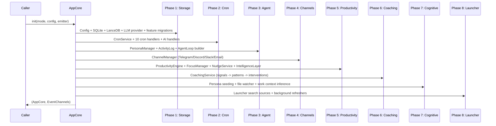
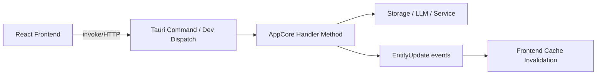
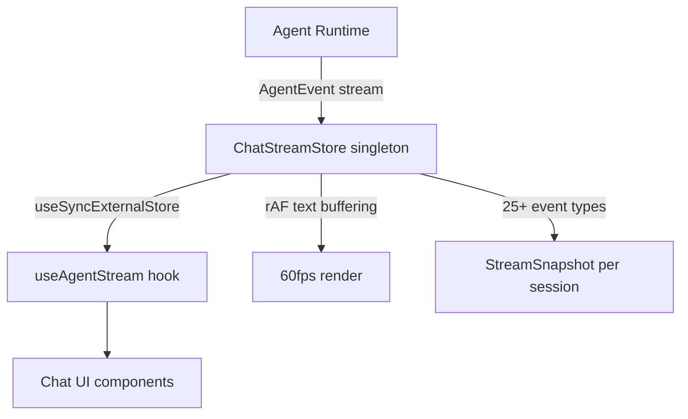

# Desktop Application Architecture

## Overview

The Klyntbot desktop app is built with Tauri 2 (Rust backend + React 19 frontend). The `desktop` crate is a thin adapter that wires `AppCore` to Tauri IPC. All business logic lives in `app-core`.

## AppCore Initialization (8 Phases)

## Dual-Mode Development

| Mode | Transport | Event System | How to Start |
|---|---|---|---|
| **Tauri** | `invoke()` IPC | Tauri events | `cargo tauri dev` |
| **Browser** | HTTP POST to `:3456` | SSE + CustomEvent | `bun run dev` + dev server |

The `ipc()` function in the frontend auto-detects mode:
- **Tauri**: `@tauri-apps/api/core` `invoke<T>(cmd, args)`
- **Browser**: `fetch("/api/{cmd}")` via Vite proxy to Rust dev server on `:3456`

## Command Architecture (250+ Commands)

Every command module exports `pub const DEV_COMMANDS: &[&str]` for parity testing. A compile-time test ensures every Tauri command has a dev server equivalent (excluding Tauri-only commands).

### Command Count by Domain

| Domain | Commands |
|---|---|
| Notes | 62 |
| Productivity | 33 |
| Finance | 27 |
| Cognitive/Coaching | 27 |
| Tasks | 17 |
| Work Contexts | 11 |
| Launcher | 9 |
| Chat | 8 |
| Workflows | 8 |
| Columns | 8 |
| Settings | 7 |
| Cron | 7 |
| Squads | 7 |
| Projects | 7 |
| Focus Timer | 7 |
| Agents | 6 |
| Capture | 6 |
| Areas | 5 |
| Distraction | 5 |
| Language | 5 |
| Annotations | 5 |
| OKR | 8 |
| Others | ~15 |

## Event System (40+ Events)

Events flow from Rust to the frontend for real-time updates:

### Agent Events (`agent:*`)
`content_chunk`, `done`, `tool_start`, `tool_end`, `error`, `entity_created`, `interaction_request`, `classification_complete`, `execution_started`, `iteration_start`, `usage_report`, `memory_access`, `skill_loaded`, `agent_selected`, `delegation_started/completed`, `persona_perspective`, `debate_round_started/completed`, `consensus_reached`, `budget_warning`

### Entity Events
`entity:updated` -- Triggers frontend cache invalidation by `EntityKind`

### Productivity Events
`activity:tick`, `activity:switch`, `focus:state_changed`, `focus:auto_detected`, `focus:tick`, `focus:completed`, `productivity:distraction`, `productivity:nudge`, `distraction:detected`, `score:updated`

### Coaching Events
`coaching:intervention`, `distraction:intervention`, `distraction:verdict`

### MCP Events
`mcp:oauth_complete`, `mcp:oauth_error`, `mcp:server_status`, `mcp:startup_complete`

## Agent Streaming Architecture

Key design decisions:
- **Global singleton** (`ChatStreamStore`): Survives React unmount/remount during navigation
- **requestAnimationFrame buffering**: Content chunks batched for smooth 60fps rendering
- **Browser dev SSE bridge**: `EventSource` connections per session, bridged to `CustomEvent`

## Frontend Architecture

### Tech Stack
React 19 + TypeScript + Tailwind CSS v4 + Vite 6 + Zustand + TipTap + Recharts + Cytoscape

### State Management (Hybrid)
1. **Zustand stores** (feature-local): Tab navigation, filters, view mode, launcher state
2. **ChatStreamStore singleton**: All active chat streams via `useSyncExternalStore`
3. **React Context**: Theme, toast notifications, status workflows
4. **URL state**: Route params drive dashboard navigation
5. **useQuery cache**: SWR-style server state with 30s stale time

### Theme System
Three-layer approach:
1. CSS custom properties in `:root` / `[data-theme]`
2. `@theme inline` blocks register as Tailwind v4 tokens
3. Tailwind utilities consume tokens

Two themes: **Dark** (oklch, glassmorphism) and **Retro/Nexora** (white, flat, monospace).

### Glass Material System
11 glass utility classes for different UI contexts (panel, sidebar, toolbar, input, button, floating, dropdown, card, bubble).

### Routing
`createHashRouter` for Tauri webview compatibility. All page components lazy-loaded. Standalone windows (launcher, tray, quick-capture, distraction-overlay) render outside AppShell.

## Focus Timer

State machine: `Idle <-> Running <-> Paused`

Features:
- Three modes: Focus, Pomodoro, Break
- 1-second tokio interval for tray countdown
- Coordinates with tray countdown via `FOCUS_ACTIVE` atomic flag
- Sound alerts: macOS `afplay` system sounds
- 30-second warning pops open tray window

## Tray Countdown

Shows next upcoming event/task deadline in macOS menu bar:
- Polls DB every 30 seconds
- Ticks every 1 second: `"<< 24:57 . Standup"`
- Only items due today (local timezone)
- Yields to focus timer when active

## Dev Server

Debug-only Axum server on `:3456`:
- `POST /api/{cmd}` -- Routes to command dispatch
- `GET /api/events/{sessionKey}` -- SSE for chat streaming
- `GET /api/cognitive/stream` -- SSE for domain + pipeline events
- `POST /api/v1/ingest` -- Activity log ingestion
- CORS for localhost:1420 (Vite dev server)
