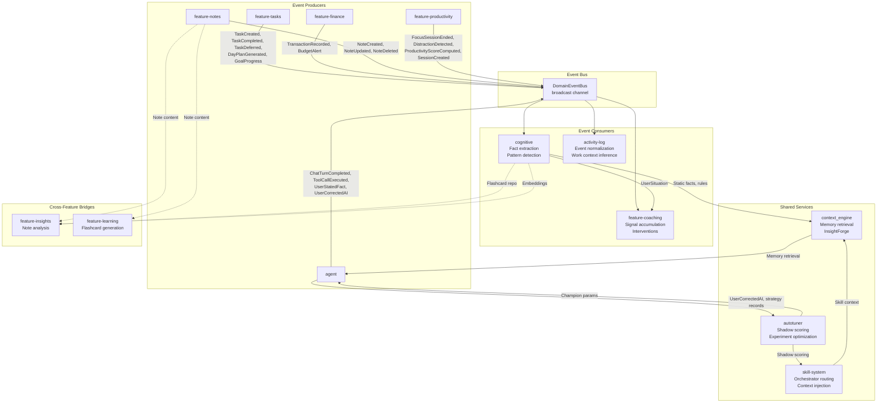
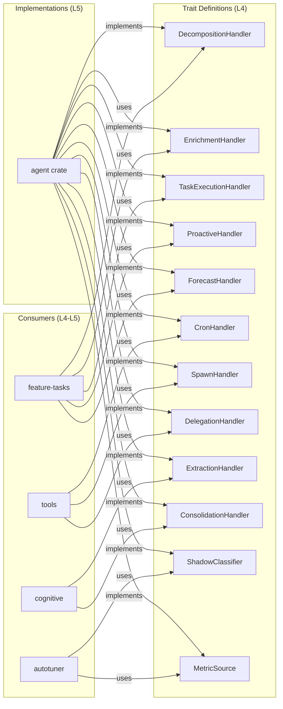
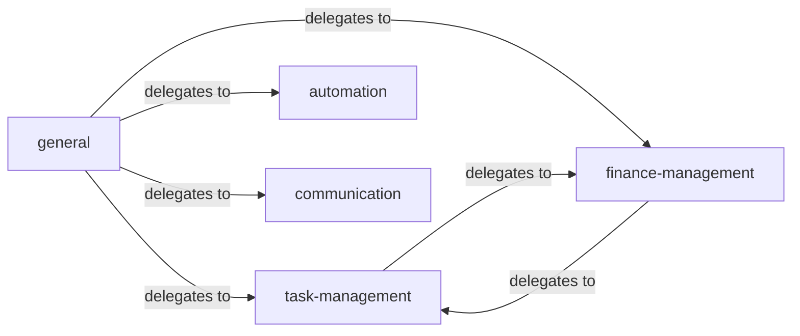

# Feature Interconnections

## Overview

Klyntbot's features do not operate in isolation. They communicate through the `DomainEventBus`, shared storage repositories, the cognitive memory pipeline, and handler trait injection. This document maps every cross-feature connection.

## Interconnection Graph

## DomainEvent Flow by Producer

### feature-tasks Events
| Event | Consumers | Effect |
|---|---|---|
| `TaskCreated` | cognitive (accumulate), activity-log | Pattern tracking, activity normalization |
| `TaskCompleted` | cognitive (extract if high deviation), coaching, activity-log | Fact extraction on deviations, coaching signals |
| `TaskDeferred` | cognitive (accumulate), coaching | Task avoidance pattern detection |
| `TaskStatusChanged` | activity-log | Work context inference |
| `DayPlanGenerated` | cognitive (accumulate) | Planning pattern tracking |
| `GoalProgress` | cognitive (accumulate) | OKR progress tracking |
| `TaskExecutionProgress` | agent (forwarded to UI) | Real-time execution updates |

### feature-finance Events
| Event | Consumers | Effect |
|---|---|---|
| `TransactionRecorded` | cognitive (extract if over-budget) | Budget deviation fact extraction |
| `BudgetAlert` | cognitive (extract), coaching | Financial stress signal |

### feature-notes Events
| Event | Consumers | Effect |
|---|---|---|
| `NoteCreated/Updated/Deleted` | cognitive (extract), activity-log | Knowledge activity tracking |
| `NoteContentChanged` | cognitive (extract) | Content change detection |

### feature-productivity Events
| Event | Consumers | Effect |
|---|---|---|
| `FocusSessionStarted` | coaching (pause interventions) | Quiet coaching during focus |
| `FocusSessionEnded` | cognitive (extract if high quality), coaching (debrief) | Quality fact extraction, consolidated debrief |
| `DistractionDetected` | cognitive (accumulate), coaching (signal) | Distraction pattern detection |
| `ProductivityScoreComputed` | cognitive (accumulate) | Score trend tracking |
| `ActivitySessionCompleted` | cognitive (accumulate) | Daily activity tracking |

### agent Events
| Event | Consumers | Effect |
|---|---|---|
| `ChatTurnCompleted` | cognitive (extract) | Primary fact extraction source |
| `ToolCallExecuted` | activity-log | Tool usage tracking |
| `UserStatedFact` | cognitive (immediate extract) | Direct fact creation |
| `UserCorrectedAI` | cognitive (immediate extract) | Correction-based learning |

## Cross-Feature Connections

### Task <-> Finance
- `task-management` skill delegates to `finance-management` and vice versa
- Tasks can have financial context (budget tasks, expense tracking)
- `FinanceSearcher` provides financial context to InsightForge for task-related queries

### Task <-> Productivity
- Focus sessions track time against tasks (`action_id` on `FocusSession`)
- `TaskFocusStarted/Ended` events connect task and productivity tracking
- Productivity scoring considers task completion rates
- Energy levels on tasks inform daily planning

### Cognitive <-> Agent
- `CognitiveContextSource` injects static facts + procedural rules into system prompt
- `UnifiedMemoryService` provides dynamic memory retrieval for context assembly
- `BackgroundConsolidationService` processes events from agent interactions
- Agent implements `ExtractionHandler` and `ConsolidationHandler` via dependency inversion
- `UserSituation` modulates memory retrieval relevance scoring

### Coaching <-> Productivity
- `SignalAccumulator` converts productivity events (distraction, focus) into coaching signals
- `UserSituation` computed from productivity data drives coaching receptivity
- Focus mode integration: interventions queued during focus, delivered as debrief after
- Behavioral patterns (e.g., "always distracted at 3pm") drive coaching timing

### Activity Log <-> All Features
- `ActivityLogSubscriber` normalizes domain events from all features into unified `ActivityLogEntry` format
- Work context inference groups related activities across features
- `WorkContextTool` exposes grouped context to the agent
- `WorkContextSource` injects active work context into LLM system prompt

### Notes <-> Insights
- `feature-insights` depends on `feature-notes` for note content
- Insight review generates multi-tab analysis from note content
- Smart merge detects overlapping note contexts
- Progress tracking via flashcard success and semantic drift

### Notes <-> Learning
- `feature-learning` generates flashcard prompts from note content
- `app-core` orchestrates: fetch note -> build prompt -> LLM call -> persist flashcards
- Flashcards stored in cognitive crate's `FlashcardRepo`

### Autotuner <-> Agent/SkillRouter/IntentAnalyzer
- `ShadowClassifier` (in agent) runs Layer 1-2 of IntentAnalyzer + SkillRouter with trial params for shadow scoring
- `MetricCollector` (in agent) subscribes to `UserCorrectedAI`, `CoachingFeedback`, `TaskExecutionCompleted` events for ground truth
- `StrategyRepo` provides execution mode accuracy (Direct/Reactive classification)
- Champion params propagate to live pipeline via `RoutingContext.champion_params`
- Nightly cycle runs via `CronService` — evaluates trials, promotes winners, generates new variants via LLM
- `AutoTunerEvent`s are mapped to `AgentEvent` variants for the Transparency Panel

### Cognitive <-> Coaching
- `UserSituation` (computed in cognitive) drives coaching decisions
- Coaching feedback (`CoachingFeedback` domain event) feeds back into cognitive fact extraction
- `BehavioralPatternDetected` events create cognitive facts about user patterns
- Coaching strategy effectiveness is tracked in `CoachingStrategyRepo`

## Handler Trait Interconnections

The dependency inversion pattern creates implicit interconnections:

## Skill Delegation Graph

The `general` orchestrator handles multi-domain requests by decomposing into discrete steps, delegating each to the appropriate specialist, and synthesizing results.

## Shared Storage Access

Multiple features access the same repositories:

| Repository | Primary Feature | Also Used By |
|---|---|---|
| `ActionRepo` / `TaskRepo` | feature-tasks | agent (enrichment, planning), app-core (queries) |
| `ProjectRepo` | tools (ProjectTool) | feature-tasks (scoping), app-core (handlers) |
| `AreaRepo` | tools (AreaTool) | feature-tasks (scoping), context sources |
| `SessionRepo` | session | agent (history), app-core (chat) |
| `SemanticFactRepo` | cognitive | agent (retrieval, context), coaching (situation) |
| `VectorStore` | storage | cognitive (facts), tools (embedding), notes (search), activity-log |
| `TrialRepo` | storage | autotuner (trials, experiments, shadow log) |
| `LearningStateRepo` | storage | agent (learning), autotuner (champion state, toast counter, pace) |
