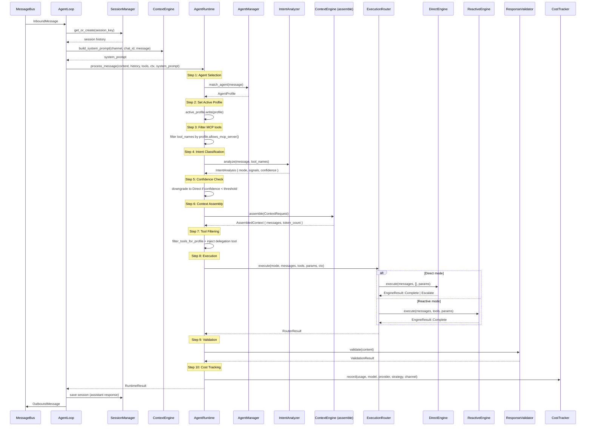
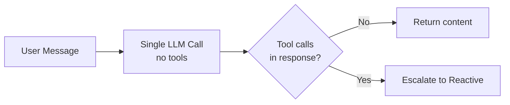
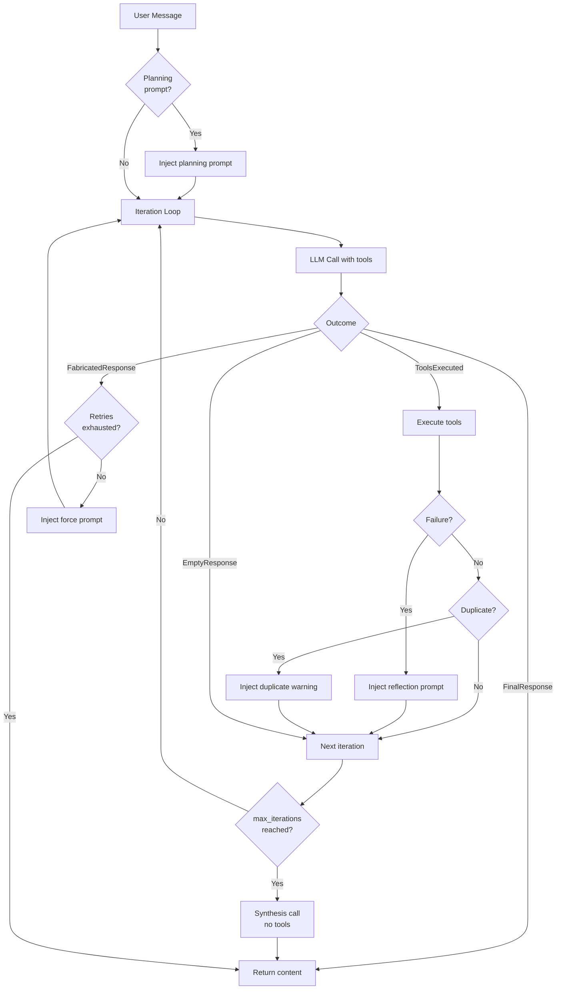

# Agent Runtime

## Overview

The agent runtime is the central execution pipeline that processes every user message in klyntbot. It sits at layer L5 in the workspace hierarchy (`crates/agent/src/agent_runtime/runtime.rs`) and orchestrates the full journey from raw inbound message to validated, cost-tracked response.

The runtime follows an **agent-first** design: agent selection happens before intent classification, so the matched agent profile shapes everything downstream -- system prompt injection, tool filtering, iteration budgets, and MCP server access.

Key entry points:

- `AgentLoop::process_message` -- receives `InboundMessage` from the message bus, manages session state, and delegates to `AgentLoop::run_pipeline`.
- `AgentLoop::run_pipeline` -- builds the system prompt via `ContextEngine::build_system_prompt`, converts history, and calls `AgentRuntime::process_message`.
- `AgentRuntime::process_message` -- the 10-step pipeline documented below.

Source files:

| Component | Path |
|---|---|
| AgentLoop | `crates/agent/src/agent_loop/mod.rs` |
| AgentRuntime | `crates/agent/src/agent_runtime/runtime.rs` |
| IntentAnalyzer | `crates/agent/src/intent_pipeline/analysis.rs` |
| ExecutionRouter | `crates/agent/src/intent_pipeline/router.rs` |
| DirectEngine | `crates/agent/src/intent_pipeline/engines/direct.rs` |
| ReactiveEngine | `crates/agent/src/intent_pipeline/engines/reactive.rs` |
| AgentProfile / AgentManager | `crates/agent/src/agent_profile/types.rs`, `manager.rs` |
| ResponseValidator | `crates/agent/src/output/validator.rs` |
| CostTracker | `crates/agent/src/output/cost_tracker.rs` |
| ContextEngine | `crates/context_engine/src/assembler.rs` |
| BudgetAllocator | `crates/context_engine/src/budget.rs` |

---

## Pipeline Sequence Diagram



---

## Stage Details

### 1. Agent Selection

**Component:** `AgentManager::match_agent` in `crates/agent/src/agent_profile/manager.rs`

The agent manager holds a `HashMap<String, Arc<AgentProfile>>` loaded from five built-in agents (general, task, finance, automation, communication) plus optional workspace agents from disk.

Selection algorithm:

1. Normalize the message (lowercase, hyphens to spaces).
2. For each agent, scan its `triggers` list. Each matching trigger contributes its word count as a score (longer triggers outscore shorter ones). Ties are broken by hit count.
3. The agent with the highest score wins. If no triggers match, the **general** agent is used as fallback.

```rust
// AgentManager::match_agent returns &Arc<AgentProfile>
pub fn match_agent(&self, message: &str) -> &Arc<AgentProfile>
```

**Orchestration override:** If the intent analyzer determines `needs_orchestration == true` (multi-agent request), the runtime re-routes to the `"general"` agent as orchestrator, regardless of the initial match.

### 2. Intent Analysis

**Component:** `IntentAnalyzer` in `crates/agent/src/intent_pipeline/analysis.rs`

A two-stage classifier that determines the `ExecutionMode`:

**Stage 1 -- Heuristic classification** (`analyze_heuristic`):
Zero-cost keyword/pattern matching. Returns `Some(IntentAnalysis)` for clear-cut intents:
- Greetings, single-word messages, short factual questions -> `Direct`
- Messages containing tool-action keywords (create, search, delete, etc.) -> `Reactive`
- Messages referencing multiple agent domains -> `needs_orchestration = true`

**Stage 2 -- LLM classifier** (`IntentClassifier`):
Only invoked when heuristics return `None` (ambiguous messages). Makes a lightweight LLM call with a structured prompt to classify the message. Uses a configurable `heuristic_confidence_threshold` from `OrchestratorConfig` to decide when to bypass the LLM.

The result is an `IntentAnalysis`:

```rust
pub struct IntentAnalysis {
    pub mode: ExecutionMode,
    pub signals: ComplexitySignals,
    pub confidence: f32,
    pub source: AnalysisSource,       // Heuristic | LlmClassifier | MidExecutionEscalation
    pub reasoning: String,
    pub needs_orchestration: bool,
}
```

`ComplexitySignals` computes a `complexity_score()` (0-7) and an `iteration_budget()` using the formula `min(max(estimated_tool_calls * 3, 10) + 5, 30)`.

### 3. Context Assembly

**Component:** `ContextEngine` in `crates/context_engine/src/assembler.rs`

The context engine assembles the full message list sent to the LLM, respecting a strict token budget. It uses a **waterfall allocation** scheme via `BudgetAllocator` (`crates/context_engine/src/budget.rs`).

**Budget configuration:** 85% of the context window is available for input; 15% is reserved for the model's response.

**Priority waterfall** (allocated in order, highest first):

| Priority | Enum Value | Description |
|---|---|---|
| 0 | `SystemIdentity` | Base system prompt |
| 1 | `ActiveTask` | Current task/project context |
| 2 | `ToolDefinitions` | JSON schemas for available tools (0 for Direct mode) |
| 3 | `RecentHistory` | Verbatim recent conversation messages |
| 4 | `RetrievedMemory` | Embedding-based memory entries via `MemoryRetriever` |
| 5 | `CompressedHistory` | Older history compressed into summaries |
| 6 | `BootstrapPersona` | User persona/preferences |
| 7 | `Skills` | Agent skill content |

Assembly steps:
1. Allocate system prompt tokens.
2. Allocate tool definition tokens (zero for `DirectResponse` and `Clarification` strategies).
3. Retrieve relevant memories via embedding search (skipped for `Clarification` mode).
4. Compress history to fit remaining budget using `HistoryCompressor` (supports extractive and abstractive modes via `SummaryProvider`).
5. Post-compression enforcement: truncate oldest recent messages if they exceed the history budget.
6. Build final message list: system prompt, memory, summaries, recent history.

The engine caches assembled contexts using SHA-256 keys derived from all request inputs.

### 4. Tool Filtering

**Component:** `AgentProfile::allowed_tool_names` and `AgentProfile::allows_mcp_server` in `crates/agent/src/agent_profile/types.rs`

Tool filtering happens in two stages within `AgentRuntime::process_message`:

**MCP server filtering (Step 3):** Tool names matching the `mcp_{server}_{tool}` pattern are checked against the agent's `mcp_tools` list:
- Empty `mcp_tools` -> deny all MCP tools
- `["*"]` -> allow all MCP servers
- `["google-calendar"]` -> allow only that server's tools

**Native tool filtering (Step 7):** `filter_tools_for_profile` applies the agent's `tools` allowlist:
- Empty `tools` list -> full access to all native tools
- Non-empty list -> only those tools plus `ask_user` (always included)

**Orchestration mode:** When `needs_orchestration` is true, tools are restricted to `["ask_user", "memory"]` plus the dynamically injected `delegate` tool.

**Delegation injection (Step 7b):** If the agent's `can_delegate_to` list is non-empty and delegation depth < `MAX_DELEGATION_DEPTH` (2), a `DelegationTool` is injected into the tool list.

### 5. Execution

**Component:** `ExecutionRouter` in `crates/agent/src/intent_pipeline/router.rs`

The router dispatches to one of two engines based on `ExecutionMode`:

#### DirectEngine

**File:** `crates/agent/src/intent_pipeline/engines/direct.rs`

Single LLM call with no tools. If the LLM unexpectedly produces tool calls (misclassification), returns `EngineResult::Escalate` which triggers auto-escalation to Reactive mode.

```rust
pub struct DirectEngine {
    core: Arc<ExecutionCore>,
}
```

#### ReactiveEngine

**File:** `crates/agent/src/intent_pipeline/engines/reactive.rs`

ReAct (Reasoning + Acting) loop that iterates until:
- The LLM produces a final text response (`CycleOutcome::FinalResponse`)
- `max_iterations` is reached (triggers synthesis)
- A cancellation token fires

```rust
pub struct ReactiveEngine {
    core: Arc<ExecutionCore>,
    max_iterations: u32,
}
```

Loop features:
- **Planning:** For complex tasks (complexity_score >= 4), a planning prompt is injected before iteration 1. The plan is parsed and tracked via `Scratchpad`.
- **Fabrication detection:** If the LLM returns text describing tool use instead of actually calling tools, a force-retry prompt is injected (up to `max_fabrication_retries`).
- **Duplicate blocking:** Repeated identical tool calls are blocked with an explanation prompt.
- **Failure reflection:** When tools fail, a reflection prompt is injected asking the LLM to adjust its approach.
- **Cancellation:** Checked at the start of each iteration via `CancellationToken`.

**Synthesis at max iterations:** When the iteration limit is reached, the engine injects a synthesis prompt and makes one final LLM call with no tools to force a text response summarizing completed work.

#### Auto-escalation

When `DirectEngine` returns `EngineResult::Escalate`, the router automatically retries with `ReactiveEngine` using the original messages. Token usage from both attempts is combined.

### 6. Response Validation

**Component:** `ResponseValidator` in `crates/agent/src/output/validator.rs`

Three validation checks run on every response:

1. **Length truncation:** Responses exceeding `max_response_tokens * 4` characters are truncated at a word boundary with an ellipsis.
2. **System prompt leak detection:** Scans for patterns like `"you are klyntbot"`, `"<system>"`, `"my system prompt says"`, etc. Matched patterns are redacted with `[redacted]`.
3. **Quality check:** Flags empty responses as invalid; warns on extremely short responses (< 3 words).

```rust
pub struct ResponseValidator {
    max_response_chars: usize,
    check_leaked_system_prompt: bool,
}

pub struct ValidationResult {
    pub is_valid: bool,
    pub warnings: Vec<ValidationWarning>,
    pub filtered_content: String,
}
```

Additionally, `<confidence>` blocks (from the confidence evaluation system) are stripped before validation.

### 7. Cost Tracking

**Component:** `CostTracker` in `crates/agent/src/output/cost_tracker.rs`

Records every LLM call to SQL via `storage::UsageRepo`. Tracks prompt tokens, completion tokens, cache read/write tokens, and estimated cost in USD.

**Pricing table** (per million tokens):

| Model | Input | Output | Cache Read | Cache Write |
|---|---|---|---|---|
| claude-opus-4 | $15.00 | $75.00 | $1.50 | $18.75 |
| claude-sonnet-4 | $3.00 | $15.00 | $0.30 | $3.75 |
| claude-3-5-haiku | $0.80 | $4.00 | $0.08 | $1.00 |
| gpt-4o | $2.50 | $10.00 | $1.25 | $0.00 |
| gpt-4o-mini | $0.15 | $0.60 | $0.075 | $0.00 |
| gemini-2.0-flash | $0.10 | $0.40 | $0.025 | $0.00 |
| deepseek-chat | $0.27 | $1.10 | $0.07 | $0.00 |
| deepseek-reasoner | $0.55 | $2.19 | $0.14 | $0.00 |

Unknown models fall back to substring matching (e.g., any model containing "sonnet" gets Sonnet pricing). Completely unknown models receive $0.00 cost.

**Budget alerts:** When `monthly_budget_usd` is configured, `check_budget()` returns a `BudgetAlert` at 80% and 100% of the monthly spend:

```rust
pub struct BudgetAlert {
    pub monthly_spend_usd: f64,
    pub monthly_budget_usd: f64,
    pub usage_percent: f64,
}
```

---

## Agent Profiles

### Format

Agent profiles are defined as `AGENT.md` files with YAML frontmatter, stored in `agents/{name}/AGENT.md`. Built-in agents are compiled into the binary via `include_str!`.

```yaml
---
name: task
description: Task and project management specialist
tools: [task, area, project, okr, notes, ask_user, memory]
mcp_tools: ["google-calendar"]
triggers: [todo, task, create a task, my tasks, weekly review]
max_iterations: 12
can_delegate_to: [finance]
always_skills: [todo, daily-planner]
---

You are the task management agent. ...
```

### Key Fields

| Field | Type | Default | Description |
|---|---|---|---|
| `name` | String | required | Unique agent identifier |
| `description` | String | `""` | Human-readable description |
| `tools` | Vec\<String\> | `[]` | Allowed native tools (empty = full access) |
| `mcp_tools` | Vec\<String\> | `[]` | Allowed MCP servers (`["*"]` = all, `[]` = none) |
| `triggers` | Vec\<String\> | `[]` | Keywords for agent matching (lowercased) |
| `max_iterations` | u32 | `10` | Caps the reactive engine's iteration count |
| `can_delegate_to` | Vec\<String\> | `[]` | Agents this one can delegate work to |
| `always_skills` | Vec\<String\> | `[]` | Skills always injected into the system prompt |

### Skills

Each agent can have skills in `agents/{name}/skills/{skill}.md`. Skills use the same frontmatter format with additional metadata fields:

```yaml
---
name: todo
description: Task creation with confidence scoring
license: MIT
metadata:
  author: klyntbot
  version: "1.0.0"
  always: true
  triggers: "create task,add todo"
  agent: task
---

Task creation instructions here.
```

Skill loading modes:
- **Always-loaded:** `always: true` or listed in the agent's `always_skills` -- injected into every system prompt for that agent.
- **Trigger-activated:** Loaded when the user's message matches a skill's `triggers`.
- **Name-fallback:** If no triggers are defined, the skill is activated when its name appears in the message (with hyphen-to-space normalization).

### Built-in Agents

Five built-in agents are compiled via `include_str!`:

| Agent | Triggers (sample) | Tools | MCP | Delegation |
|---|---|---|---|---|
| general | *(fallback -- no triggers)* | ask_user, memory, web_search, spawn, learning | `["*"]` | task, finance, automation, communication |
| task | todo, task, project, weekly review, notes | task, area, project, okr, notes | google-calendar | finance |
| finance | budget, spending, transaction, expense | finance, ask_user, memory | *(none)* | *(none)* |
| automation | remind, reminder, schedule, cron | *(varies)* | *(varies)* | *(none)* |
| communication | message, email, slack | *(varies)* | *(varies)* | *(none)* |

---

## Execution Modes

### Direct Mode



- Single LLM call with an empty tools array.
- Used for greetings, factual Q&A, and low-confidence messages.
- If the LLM returns tool calls despite receiving no tool definitions, the router auto-escalates to Reactive mode (combining token usage from both attempts).

### Reactive Mode



- ReAct loop running up to `max_iterations` cycles.
- Per-request iteration limit comes from `ExecutionParams.max_iterations`, falling back to the engine default.
- The agent profile's `max_iterations` field caps the classifier's dynamic budget.
- Synthesis at limit: injects a summary prompt and makes one final no-tools call.

---

## Key Types

| Type | File | Description |
|---|---|---|
| `AgentLoop` | `crates/agent/src/agent_loop/mod.rs` | Top-level processing loop, owns bus/session/runtime |
| `AgentRuntime` | `crates/agent/src/agent_runtime/runtime.rs` | 10-step pipeline orchestrator |
| `RuntimeResult` | `crates/agent/src/agent_runtime/runtime.rs` | Final output: content, mode, classification, validation |
| `AgentManager` | `crates/agent/src/agent_profile/manager.rs` | Agent registry with trigger-based matching |
| `AgentProfile` | `crates/agent/src/agent_profile/types.rs` | Parsed AGENT.md: tools, triggers, mcp_tools, skills |
| `AgentSkill` | `crates/agent/src/agent_profile/types.rs` | Parsed skill.md: content, triggers, always flag |
| `IntentAnalyzer` | `crates/agent/src/intent_pipeline/analysis.rs` | Two-stage heuristic + LLM classifier |
| `IntentAnalysis` | `crates/agent/src/intent_pipeline/types.rs` | Classification result: mode, signals, confidence |
| `ExecutionMode` | `crates/agent/src/intent_pipeline/types.rs` | `Direct` or `Reactive { max_iterations }` |
| `ComplexitySignals` | `crates/agent/src/intent_pipeline/types.rs` | Tool count, sequential deps, failure risk, etc. |
| `ExecutionRouter` | `crates/agent/src/intent_pipeline/router.rs` | Dispatches to Direct or Reactive engine |
| `RouterResult` | `crates/agent/src/intent_pipeline/router.rs` | Engine output: content, usage, iterations, traces |
| `DirectEngine` | `crates/agent/src/intent_pipeline/engines/direct.rs` | Single-call engine with escalation support |
| `ReactiveEngine` | `crates/agent/src/intent_pipeline/engines/reactive.rs` | ReAct loop with planning, reflection, synthesis |
| `ContextEngine` | `crates/context_engine/src/assembler.rs` | Budget-aware context assembly with caching |
| `ContextRequest` | `crates/context_engine/src/assembler.rs` | Input to assembly: message, history, strategy, tools |
| `AssembledContext` | `crates/context_engine/src/assembler.rs` | Output: ordered messages, token count, budget report |
| `BudgetAllocator` | `crates/context_engine/src/budget.rs` | Waterfall token allocator with 8 priorities |
| `Priority` | `crates/context_engine/src/budget.rs` | Enum: SystemIdentity through Skills (0-7) |
| `ResponseValidator` | `crates/agent/src/output/validator.rs` | Length, leak detection, quality checks |
| `ValidationResult` | `crates/agent/src/output/validator.rs` | Valid flag, warnings, filtered content |
| `CostTracker` | `crates/agent/src/output/cost_tracker.rs` | SQL-backed usage recording with budget alerts |
| `PipelineConfig` | `crates/agent/src/intent_pipeline/types.rs` | Model, context window, max response tokens |

---

## Configuration Points

All configuration flows through `Config` (`crates/config`) with `camelCase` JSON serialization. Environment override pattern: `KLYNTBOT_AGENTS__DEFAULTS__MODEL=gpt-4o`.

| Setting | Config Path | Default | Description |
|---|---|---|---|
| Model | `agents.defaults.model` | `claude-sonnet-4-20250514` | LLM model for execution |
| Context window | `agents.defaults.context_window` | `128000` | Token budget for context assembly |
| Max response tokens | `agents.defaults.max_tokens` | `4096` | Response length cap (also used by validator) |
| Temperature | `agents.defaults.temperature` | *(provider default)* | LLM sampling temperature |
| Monthly budget | `orchestrator.monthly_budget_usd` | `None` | Cost cap with 80%/100% alerts |
| Heuristic confidence threshold | `orchestrator.heuristic_confidence_threshold` | *(configured)* | Below this, LLM classifier is invoked |
| Satisfaction window | `orchestrator.satisfaction_window_minutes` | *(configured)* | Time window for reaction-based satisfaction scoring |
| History limit | *(builder)* | *(configured)* | Max history messages loaded per request |
| Max iterations (per agent) | `agents/{name}/AGENT.md` | `10` | Caps reactive loop iterations |
| MCP servers | `mcp.servers` | `[]` | External MCP server definitions |
