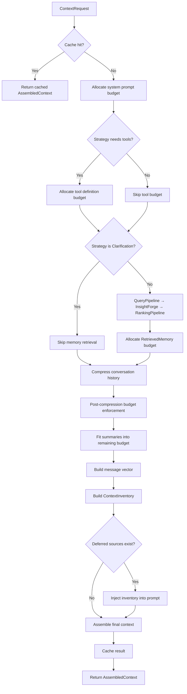

# Context Engine

## Overview

The Context Engine (`crates/context_engine/`) sits between the agent runtime and the LLM provider. It orchestrates everything the model sees in its context window -- system prompts, conversation history, retrieved memories, tool definitions, and domain-specific context -- all within a strict token budget. Every LLM call flows through `ContextEngine::assemble()`, which produces a deterministic, budget-aware `AssembledContext` that the provider consumes directly. The engine is provider-agnostic: it works with any model backend as long as a `TokenCounter` is supplied.

## Architecture

The `ContextEngine` struct is the central orchestrator. It composes several subsystems via dependency injection:

```rust
pub struct ContextEngine {
    compressor: HistoryCompressor,
    token_counter: Arc<dyn TokenCounter>,
    memory_retriever: Option<Arc<dyn MemoryRetriever>>,
    memory_retrieval_limit: usize,
    cache: Arc<Mutex<ContextCache>>,
    sources: Vec<Box<dyn ContextSource>>,
    insight_forge: Option<Arc<InsightForge>>,
    query_rewriter: Option<Arc<dyn QueryRewriter>>,       // legacy, kept for backward compat
    query_pipeline: Option<Arc<QueryPipeline>>,            // preferred: multi-stage enhancement
    ranking_pipeline: Option<Arc<RankingPipeline>>,        // result reranking
}
```

| Field | Role |
|---|---|
| `compressor` | Compresses older conversation history into summaries to fit the token budget |
| `token_counter` | Pluggable token estimation (BPE, heuristic, or model-specific) |
| `memory_retriever` | Embedding-based retrieval of semantic facts, episodic memories, and conversation recall |
| `memory_retrieval_limit` | Hard cap on retrieved entries per query (default: 5) |
| `cache` | Bounded LRU cache keyed by SHA-256 of request inputs |
| `sources` | Pluggable system prompt builders, sorted by priority descending |
| `insight_forge` | Multi-dimensional retrieval with query decomposition and Reciprocal Rank Fusion |
| `query_rewriter` | Legacy single-stage rewriter — used as fallback when `query_pipeline` is not wired |
| `query_pipeline` | Multi-stage query enhancement (signal enrichment → PRF → multi-query) gated by `EnhancementBudget` |
| `ranking_pipeline` | Result reranking stages (heuristic → LLM) applied after retrieval |

Construction uses a builder pattern -- each `with_*` method returns `Self` for chaining:

```rust
let engine = ContextEngine::new()
    .with_token_counter(token_counter_for_model("claude-sonnet-4-5-20250514"))
    .with_memory_retriever(unified_memory)
    .with_insight_forge(forge)
    .with_query_pipeline(query_pipeline)
    .with_ranking_pipeline(ranking_pipeline)
    .with_sources(context_sources)
    .with_summary_provider(llm_summarizer)
    .with_memory_retrieval_limit(8);
```

The main entry point is `assemble()`, with an advanced variant `assemble_with_prefetched()` that accepts pre-fetched memory results to overlap retrieval with other work (e.g., intent classification).

## ContextRequest and AssembledContext

### Input: ContextRequest

```rust
pub struct ContextRequest {
    pub message_text: String,                        // User message (used for embedding lookup)
    pub history: Vec<Message>,                       // Full conversation history
    pub system_prompt: String,                       // Base system prompt
    pub strategy: ExecutionStrategy,                 // Affects budget allocation
    pub tool_definitions: Vec<serde_json::Value>,    // Tool JSON schemas
    pub context_window: usize,                       // Model's context window size
    pub session_key: Option<String>,                 // Per-session circuit breaker tracking
    pub retrieval_context: Option<RetrievalContext>, // Signals for query enhancement
    pub enhancement_budget: EnhancementBudget,       // Cost envelope (from DepthMode)
}
```

### Output: AssembledContext

```rust
pub struct AssembledContext {
    pub messages: Vec<Message>,           // Ordered: system, memories, summaries, recent history
    pub token_count: usize,              // Estimated total tokens consumed
    pub budget_report: BudgetReport,     // Per-priority allocation breakdown
    pub inventory: ContextInventory,     // Loaded vs. deferred context sources
    pub budget_remaining: usize,         // Tokens available for on-demand expansion
    pub version: u32,                    // Incremented on each expand() call
    pub retrieved_memory_count: usize,   // For autotuner memory_relevance metric
    pub rewrite_triggered: bool,         // Whether query rewriting fired (legacy)
    pub rewrite_source: Option<String>,  // "heuristic" or "llm" (legacy)
    pub enhancement_trace: Option<EnhancementTrace>, // Per-stage pipeline trace
}
```

### ExecutionStrategy

The strategy determines how tools are budgeted and whether memory retrieval activates:

```rust
pub enum ExecutionStrategy {
    DirectResponse,                          // No tools; memory retrieval still runs
    ToolAssisted { max_iterations: u32 },    // Tools available, budget includes schemas
    AutonomousTask { max_iterations: u32 },  // Full autonomous multi-step execution
    Clarification { reason: String },        // No tools, no memory retrieval
}
```

`DirectResponse` still retrieves memories for personalized conversational answers. Only `Clarification` skips retrieval entirely.

## Token Budget Waterfall

The `BudgetAllocator` enforces a strict token budget using a priority-ordered waterfall. Each priority level requests tokens; the allocator grants `min(requested, remaining)`.

### Reserve

15% of the total context window is reserved for the LLM's response. The remaining 85% is the input budget.

```rust
pub struct BudgetConfig {
    pub total_context_window: usize,
    pub response_reserve_pct: f32,  // 0.15
}
```

For a 128k context window: 19,200 tokens reserved for response, 108,800 available for input.

### Priority Levels

| Priority | Ord | What it covers | Notes |
|---|---|---|---|
| `SystemIdentity` | 0 | Base system prompt, persona, identity | Always allocated first |
| `ActiveTask` | 1 | Current task context | Injected when a task is focused |
| `ToolDefinitions` | 2 | Tool JSON schemas | Skipped for `DirectResponse` and `Clarification` |
| `RecentHistory` | 3 | Last N messages verbatim | Minimum 4 messages always kept |
| `RetrievedMemory` | 4 | Semantic facts, episodic memories, domain results | From `MemoryRetriever` or `InsightForge` |
| `CompressedHistory` | 5 | Older messages as extractive/abstractive summaries | Fitted into remaining budget after recent history |
| `BootstrapPersona` | 6 | Base persona/skill bootstrap | Initial greeting and capabilities |
| `Skills` | 7 | Available skills listing | Lowest priority -- first to be squeezed |

The allocator emits a `tracing::warn` when remaining budget drops below 15% of available input, signaling that lower-priority content is being silently truncated.

### Budget Report

Every `AssembledContext` includes a `BudgetReport` showing exactly how tokens were distributed:

```rust
pub struct BudgetReport {
    pub total_window: usize,
    pub total_allocated: usize,
    pub remaining: usize,
    pub per_priority: Vec<(Priority, usize)>,  // Sorted by priority ordinal
}
```

## Pluggable Context Sources

The `ContextSource` trait defines a provider of system prompt sections. Sources are registered via `with_sources()`, sorted by `priority()` descending, and queried concurrently via `join_all`.

```rust
#[async_trait]
pub trait ContextSource: Send + Sync {
    fn name(&self) -> &str;
    fn priority(&self) -> u8;                               // Higher = earlier in prompt
    async fn provide(&self, ctx: &SourceContext) -> Option<String>;
    fn estimated_tokens(&self) -> usize { 500 }             // Budget planning
    fn protected(&self) -> bool { false }                   // Immune to compaction
}
```

Each source receives a `SourceContext` with channel, chat ID, message text, intent summary, and optional project ID.

### Built-in Sources (sorted by priority)

| Source | Priority | Crate | What it provides |
|---|---|---|---|
| `IdentitySource` | 100 | agent | User facts, current date/time, timezone |
| `PersonaContextSource` | 95 | agent | Dynamic persona override per session |
| `PageContextSource` | 90 | agent | Active UI view context for desktop |
| `BootstrapSource` | 90 | agent | Initial greeting, capabilities listing |
| `SessionMemoryContextSource` | 88 | agent | Persistent session-scoped memory |
| `SessionContextSource` | 85 | agent | Session metadata (channel, preferences) |
| `ProjectContextSource` | 80 | agent | Project-specific instructions and context |
| `AreaSource` | 75 | agent | Life areas (health, career, finance) |
| `TodoSource` | 70 | agent | Current TODO items |
| `ProductivityContextSource` | 55 | agent | Task deadlines, calendar events |
| `SoulContextSource` | 50 | skill-system | Base persona identity ("soul" prompt) |
| `AnnotationContextSource` | 50 | agent | Critical user annotations |
| `ConfidenceSource` | 50 | agent | Confidence calibration prompt |
| `SkillListingSource` | 40 | skill-system | Available skills catalog |

Sections are joined with `\n\n---\n\n` separators. Sources returning `None` are silently skipped.

### Context Inventory

The `ContextInventory` tracks what was loaded, deferred, or available:

```rust
pub enum ContextItemStatus {
    Loaded { tokens_used: usize },
    Deferred { reason: String },
    Available { description: String },
}
```

When deferred sources exist, the inventory is injected into the prompt so the agent can request them via the `context_request` tool. The `expand()` method on `ContextEngine` loads a deferred source into an existing `AssembledContext`, incrementing the context version.

## History Compression

The `HistoryCompressor` splits conversation history into two tiers: recent messages kept verbatim and older messages compressed into summaries.

```rust
pub struct CompressorConfig {
    pub snippet_length: usize,        // Max chars per extractive snippet (default: 200)
    pub mode: CompressorMode,         // Extractive or Abstractive
    pub chunk_size: usize,            // Messages per summary chunk (default: 5)
    pub min_recent_messages: usize,   // Always kept verbatim (default: 4)
}
```

### Compression Strategy

1. Always keep at least `min_recent_messages` from the end of history (never compressed)
2. Expand the recent window using up to half the remaining budget
3. Group older messages into chunks of `chunk_size`
4. Compress each chunk using the configured mode

### Compression Modes

**Extractive** (default, zero LLM cost): Extracts the first meaningful snippet from each message. Uses intelligent boundary detection -- prefers sentence boundaries (`.` `!` `?` followed by space), falls back to word boundaries, and avoids cutting mid-abbreviation (e.g., "Dr.Smith").

**Abstractive** (requires `SummaryProvider`): Sends each chunk to an LLM for a natural-language summary via `SummaryProvider::summarize_batch()`. Falls back to extractive per-chunk on provider error. The `SummaryProvider` trait returns `Vec<Result<String, String>>` so individual segments can fail independently.

### Post-compression Enforcement

After compression, the assembler enforces the budget again: if recent messages alone exceed the history budget (e.g., a single tool result is huge), the oldest recent messages are dropped one at a time until the budget fits.

## Memory Retrieval Integration

Memory retrieval uses the `MemoryRetriever` trait, typically backed by `UnifiedMemoryService` from the cognitive crate:

```rust
#[async_trait]
pub trait MemoryRetriever: Send + Sync {
    async fn retrieve(&self, query: &str, limit: usize) -> Vec<MemoryEntry>;
}
```

Each `MemoryEntry` carries its source type for structured formatting:

```rust
pub enum MemorySource {
    CognitiveFact,          // FSRS-scored semantic facts
    ConversationRecall,     // Time-decay scored past messages
    EpisodicMemory,         // Significant event records
    Domain { name: String }, // Notes, tasks, finance, knowledge graph
}
```

Retrieved memories are formatted into structured sections (`## Relevant Facts`, `## Related Conversations`, `## Related Information`) and injected as a system message after the main system prompt.

### InsightForge: Multi-dimensional Retrieval

When `InsightForge` is wired, simple vector search is replaced with a multi-stage pipeline:

1. **Activation gate**: Skips for `Clarification` strategy or messages under 20 characters
2. **Circuit breaker check**: Per-session breaker (3 failures, 300s cooldown) falls back to plain retrieval
3. **Query decomposition**: `QueryDecomposer` trait splits the query into sub-queries
4. **Fan-out search**: Each sub-query searches all sources in parallel (memory retriever + domain searchers), each with a per-source timeout (800ms default)
5. **RRF merge**: Reciprocal Rank Fusion (`k=60`) across all ranked lists, deduplicating by ID
6. **Source budget**: No single source can provide more than 60% of final results
7. **Score re-normalization**: Top entry gets score 1.0, others proportional

The `QueryDecomposer` has two implementations:

| Decomposer | LLM cost | How it works |
|---|---|---|
| `HeuristicDecomposer` | Zero | Stop-word filtering + dimension suffixes ("background context", "current status", "risks and blockers", etc.) |
| `LlmDecomposer` | One LLM call | Structured prompt asking for sub-queries |
| `FallbackDecomposer` | Conditional | Tries heuristic first; falls back to LLM if fewer than N sub-queries produced |

Domain-specific data is plugged in via `DomainSearcher`:

```rust
#[async_trait]
pub trait DomainSearcher: Send + Sync {
    fn domain_name(&self) -> &str;
    async fn search(&self, query: &str, limit: usize) -> Vec<MemoryEntry>;
}
```

## Query Enhancement Pipeline

The enhancement pipeline replaces the single-stage rewriter with two distinct pipelines separated by retrieval as an explicit boundary:

```
User Query → QueryPipeline → QueryBundle → Retrieval → RankingPipeline → EnhancementOutput
```

Types live in `crates/context_engine/src/enhancement/`:

```rust
pub struct QueryBundle {
    pub original: String,            // Raw user query, preserved
    pub primary: String,             // Enriched version used for retrieval
    pub variants: Vec<String>,       // Extra query variants from PRF / multi-query
    pub confidence: f32,
    pub sources: Vec<QuerySource>,   // Which stages contributed
}

pub struct EnhancementBudget {
    pub max_latency_ms: u64,
    pub max_llm_calls: u32,
    pub max_expansion_tokens: usize,
}
```

The budget is derived from the user's `DepthMode`: `Normal` (0 LLM calls), `DeepThink` (2 LLM calls, 500ms), `Ultra` (4 LLM calls, 1000ms). Each stage inspects the budget and skips itself gracefully if it can't run.

### Stages

**QueryPipeline** runs in order:

| Stage | Type | When it runs | What it does |
|---|---|---|---|
| `SignalEnrichment` | Heuristic | always | Wraps the legacy `ContextualQueryRewriter` — injects correction/view/task/skill/recent-msg signals |
| `PseudoRelevanceFeedback` | Heuristic | Normal+ | Retrieves top-3 results (score ≥ 0.6), extracts discriminative terms, appends as query variant |
| `MultiQuery` | LLM | Deep+ only (budget-gated) | LLM generates up to 3 query variants for fan-out retrieval |

**RankingPipeline** runs after retrieval:

| Stage | Type | When it runs | What it does |
|---|---|---|---|
| `HeuristicRerank` | Heuristic | always | Boosts results by query-term overlap with the enriched query |
| `LlmRerank` | LLM | Deep+ only (budget-gated) | Pairwise relevance scoring of top-N results via LLM |

Each stage implements a `QueryStage` or `RankingStage` trait. Failures are caught at the pipeline level — a failed stage logs a warning, records the failure in `EnhancementTrace`, and passes the previous bundle through unchanged so subsequent stages still run.

### RetrievalContext

The `RetrievalContext` carries signals that inform query enrichment:

```rust
pub struct RetrievalContext {
    pub active_skill: Option<String>,
    pub active_task: Option<ActiveTaskContext>,   // Title, project, domain
    pub recent_user_messages: Vec<String>,
    pub situation: Option<UserSituationSnapshot>, // Energy, focus, deadline pressure
    pub active_view: Option<ActiveView>,          // Current UI dashboard
    pub recent_correction: Option<CorrectionContext>,
    pub hierarchical_intent: Option<HierarchicalIntent>,
}
```

Corrections are populated by `CorrectionTracker` (in `crates/agent/src/adapters/correction_tracker.rs`), which subscribes to `DomainEvent::UserCorrectedAI` on the event bus and keeps the most recent correction per session key. Capped at 100 sessions to prevent unbounded growth.

### InsightForge Integration

The assembler calls `InsightForge::retrieve_with_bundle(&bundle)` which:
1. Decomposes `bundle.primary` via the existing heuristic/LLM decomposer
2. Appends `bundle.variants` (from PRF / multi-query) as additional sub-queries
3. Deduplicates and fans out to all sources via the existing fan-out + RRF merge

The fan-out, RRF merge, and source budget logic is unchanged — the pipeline just feeds it a richer set of sub-queries.

### EnhancementTrace

Every pipeline run produces an `EnhancementTrace` that records per-stage latency, LLM calls, status (ran/skipped/failed), and output summary:

```rust
pub struct StageTrace {
    pub name: QuerySource,
    pub status: StageStatus,  // Ran | Skipped(reason) | Failed(error)
    pub latency_ms: u64,
    pub llm_calls: u32,
    pub llm_tokens: u32,
    pub output_summary: String,
}
```

The trace is attached to `AssembledContext.enhancement_trace` and emitted via `AgentEvent::RetrievalEnhanced` (handled by the streaming relay as the `agent:retrieval_enhanced` SSE event). The frontend's `TransparencyPanel` renders it as an "Enhancement" section showing each stage with its status, latency, and totals.

The trace is also consumed by the autotuner (as an A/B signal for pipeline parameters) and by Reforge (aggregated nightly via `EnhancementTraceRepo` to detect patterns like "PRF consistently adds noise" → suggest raising `minScoreThreshold`).

## Token Counting

The `TokenCounter` trait provides synchronous token estimation to avoid async overhead in the inner assembly loop:

```rust
pub trait TokenCounter: Send + Sync {
    fn estimate_text(&self, text: &str) -> usize;
}
```

### Implementations

| Counter | Accuracy | Cost | When used |
|---|---|---|---|
| `AnthropicTokenCounter` | ~5% error for English | Zero (heuristic: 3.5 chars/token) | Auto-selected for Claude models |
| `TiktokenCounter` | Exact for OpenAI models | CPU (BPE encoding via cl100k_base) | Auto-selected for GPT models |
| `CharTokenCounter` | ~15% error | Zero (heuristic: 4 chars/token) | Fallback if tiktoken fails to initialize |

Model-aware selection via `token_counter_for_model()`:

```rust
pub fn token_counter_for_model(model: &str) -> Arc<dyn TokenCounter> {
    if model contains "claude" or "anthropic" → AnthropicTokenCounter
    else → best_token_counter() (TiktokenCounter or CharTokenCounter fallback)
}
```

The shared `estimate_message_tokens()` function handles per-role overhead (assistant messages add 20 tokens for tool_calls metadata, tool results add 10 tokens for the tool_use_id envelope).

## Caching

The `ContextCache` is a bounded LRU cache (default capacity: 2) keyed by SHA-256 hash of request inputs:

**Cache key inputs:**
- System prompt
- History length + last message content
- Message text
- Strategy discriminant
- Tool definition count + first tool name
- Context window size
- Retrieval context fields (active skill, task title, correction)

**Why capacity 2:** During ReAct loops each iteration changes the cache key (growing message history), so older snapshots become stale immediately. Two entries retain the current + one prior without wasting memory.

**Invalidation:** No explicit invalidation needed. Tool execution appends to history, which changes the cache key. The SHA-256 hash is deterministic across process restarts (unlike `DefaultHasher` which is randomized per run).

Cache uses `tokio::sync::Mutex` since the critical section is async-safe and the contention is minimal (one assembly at a time per session).

## Assembly Pipeline



### Step-by-step

1. **Cache check** -- SHA-256 hash of `ContextRequest` fields. Return immediately on hit.

2. **System prompt budget** -- Estimate tokens for the base system prompt, allocate under `Priority::SystemIdentity`.

3. **Tool definitions budget** -- For `ToolAssisted` and `AutonomousTask` strategies, estimate tokens for all tool JSON schemas. Allocated under `Priority::ToolDefinitions`. Skipped for `DirectResponse` and `Clarification`.

4. **Memory retrieval** -- Unless strategy is `Clarification`:
   - If prefetched memory was provided, use it directly
   - If `query_pipeline` is wired, run it to produce a `QueryBundle` (signal enrichment → PRF → multi-query, each budget-gated)
   - Call `InsightForge::retrieve_with_bundle()` to decompose, fan out, and RRF-merge results
   - If `ranking_pipeline` is wired, run reranking stages (heuristic → LLM, budget-gated)
   - Legacy fallback: when no pipeline is configured, the old `query_rewriter` path with `rewrite_or_spawn` is used instead
   - Format results into structured sections, allocate under `Priority::RetrievedMemory`
   - Capture `EnhancementTrace` on `AssembledContext.enhancement_trace` for observability

5. **History compression** -- Pass remaining budget to `HistoryCompressor::compress_async()`:
   - Keep at least `min_recent_messages` verbatim
   - Expand recent window if budget allows (up to half remaining)
   - Compress older messages into chunks (extractive or abstractive)
   - Post-compression: if recent messages exceed budget, drop oldest until they fit

6. **Message assembly** -- Build ordered `Vec<Message>`:
   - System message (base prompt)
   - Retrieved memory context (as system message)
   - Compressed history summaries (as system messages)
   - Recent messages verbatim

7. **Context inventory** -- Track all registered sources' load status. If any sources were deferred, inject inventory into the prompt so the agent can request them on demand.

8. **Cache and return** -- Store in LRU cache, return `AssembledContext`.

### Prefetch Optimization

The `prefetch_memory()` method runs memory retrieval independently, returning `(formatted_text, entry_count, rewrite_triggered, rewrite_source, enhancement_trace)`. This lets callers overlap retrieval with intent classification:

```rust
// In the agent runtime:
let (memory_future, intent_future) = tokio::join!(
    engine.prefetch_memory(&message, session_key, retrieval_ctx),
    analyzer.classify(&message),
);
let context = engine.assemble_with_prefetched(request, memory_result).await;
```

### On-demand Expansion

The `expand()` method loads a deferred context source into an existing `AssembledContext`:

```rust
pub async fn expand(
    &self,
    current: &AssembledContext,
    source_name: &str,
    source_ctx: &SourceContext,
) -> common::Result<AssembledContext>
```

It checks budget before cloning, increments the context version, and updates the inventory. Returns an error if the source would exceed the remaining budget.

## Related Documentation

- [Agent Runtime](agent-runtime.md) -- how `ContextEngine` is invoked from the execution pipeline
- [Cognitive Memory](cognitive-memory.md) -- the memory system that feeds `MemoryRetriever`
- [Core Infrastructure](core-infrastructure.md) -- `StoragePool`, message bus, and configuration

## Key Files

| Path | What it contains |
|---|---|
| `crates/context_engine/src/assembler/mod.rs` | `ContextEngine` struct, `assemble()`, cache logic, memory retrieval orchestration |
| `crates/context_engine/src/assembler/types.rs` | `ContextRequest`, `AssembledContext`, `ExecutionStrategy` |
| `crates/context_engine/src/assembler/cache.rs` | `ContextCache` bounded LRU implementation |
| `crates/context_engine/src/budget.rs` | `BudgetAllocator`, `Priority` enum, `BudgetReport` |
| `crates/context_engine/src/source.rs` | `ContextSource` trait, `SourceContext` |
| `crates/context_engine/src/history_compressor/` | `HistoryCompressor`, `CompressorConfig`, extractive/abstractive modes |
| `crates/context_engine/src/memory_retriever.rs` | `MemoryRetriever` trait, `MemoryEntry`, `MemorySource` |
| `crates/context_engine/src/insight_forge/` | `InsightForge`, `QueryDecomposer`, `DomainSearcher`, `retrieve_with_bundle`, RRF merge, circuit breaker |
| `crates/context_engine/src/enhancement/` | `QueryPipeline`, `RankingPipeline`, `QueryBundle`, `EnhancementBudget`, `EnhancementTrace`, `PrfStage`, `HeuristicRerankStage` |
| `crates/context_engine/src/rewriter.rs` | `QueryRewriter` trait (legacy), `RetrievalContext`, `RewriteResult` |
| `crates/context_engine/src/token_counter.rs` | `TokenCounter` trait, `AnthropicTokenCounter`, `TiktokenCounter`, `CharTokenCounter` |
| `crates/context_engine/src/inventory.rs` | `ContextInventory`, deferred/loaded tracking, prompt formatting |
| `crates/context_engine/src/ttl_cache.rs` | `TtlCache` for individual context sources |
| `crates/context_engine/src/summary_provider.rs` | `SummaryProvider` trait for abstractive compression |
| `crates/agent/src/context_sources/` | All built-in `ContextSource` implementations |
| `crates/skill-system/src/soul.rs` | `SoulContextSource` -- base persona identity |
| `crates/skill-system/src/listing.rs` | `SkillListingSource` -- skills catalog |
