# Crate Dependency Map

## Overview

The klyntbot workspace is organized into 9 layers (L0 through L8) containing 26 crates plus a root facade. Dependencies flow **strictly upward** -- a crate at layer N may only depend on crates at layers 0 through N-1. This constraint prevents circular dependencies, keeps compile times predictable, and makes it clear where new code belongs.

Two crates are excluded from the workspace: `plugin-sdk` (published separately for third-party plugin authors) and `tests/fixtures/hello_plugin` (test-only WASM fixture).

## Layer Diagram

```mermaid
flowchart TB
    subgraph L0["Layer 0 — Foundation"]
        common
    end

    subgraph L1["Layer 1 — Core Infrastructure"]
        config
        bus
        tools-core
        tools-core-macros
    end

    subgraph L2["Layer 2 — Storage & Domain"]
        storage
        domain
    end

    subgraph L3["Layer 3 — Services"]
        providers
        session
        scheduling
        context_engine
    end

    subgraph L4["Layer 4 — Features & Tools"]
        tools
        feature-todo
        feature-finance
        feature-notes
        feature-productivity
        feature-coaching
        plugin-runtime
        activity-log
    end

    subgraph L5["Layer 5 — Orchestration"]
        channels
        agent
        cognitive
    end

    subgraph L6["Layer 6 — Protocol"]
        mcp
    end

    subgraph L7["Layer 7 — Application"]
        app-core
        desktop-shared
        desktop
    end

    subgraph L8["Layer 8 — Facade"]
        klyntbot
    end

    %% L0 → L1
    config --> common
    bus --> common
    tools-core --> common
    tools-core --> tools-core-macros

    %% L0/L1 → L2
    storage --> common
    storage --> tools-core
    domain --> common

    %% L0-L2 → L3
    providers --> common
    providers --> config
    session --> common
    session --> storage
    scheduling --> common
    scheduling --> storage
    context_engine --> common
    context_engine --> providers

    %% L0-L3 → L4
    tools --> common
    tools --> config
    tools --> tools-core
    tools --> storage
    tools --> bus
    tools --> domain
    tools --> cognitive
    tools --> feature-todo
    feature-todo --> common
    feature-todo --> bus
    feature-todo --> tools-core
    feature-todo --> storage
    feature-finance --> common
    feature-finance --> bus
    feature-finance --> tools-core
    feature-finance --> storage
    feature-notes --> common
    feature-notes --> tools-core
    feature-notes --> storage
    feature-productivity --> common
    feature-productivity --> bus
    feature-productivity --> config
    feature-productivity --> tools-core
    feature-productivity --> storage
    feature-productivity --> activity-log
    feature-coaching --> common
    feature-coaching --> bus
    feature-coaching --> cognitive
    feature-coaching --> storage
    plugin-runtime --> common
    plugin-runtime --> config
    plugin-runtime --> bus
    plugin-runtime --> storage
    plugin-runtime --> tools-core
    activity-log --> common
    activity-log --> config
    activity-log --> bus
    activity-log --> cognitive
    activity-log --> context_engine
    activity-log --> storage
    activity-log --> tools-core

    %% L0-L4 → L5
    channels --> common
    channels --> bus
    channels --> config
    channels --> providers
    cognitive --> common
    cognitive --> bus
    cognitive --> storage
    cognitive --> context_engine
    cognitive --> tools-core
    agent --> common
    agent --> bus
    agent --> config
    agent --> cognitive
    agent --> providers
    agent --> session
    agent --> tools
    agent --> tools-core
    agent --> feature-todo
    agent --> feature-finance
    agent --> feature-productivity
    agent --> feature-coaching
    agent --> feature-notes
    agent --> plugin-runtime
    agent --> mcp
    agent --> scheduling
    agent --> domain
    agent --> context_engine
    agent --> storage
    agent --> activity-log

    %% L0-L5 → L6
    mcp --> common
    mcp --> config
    mcp --> tools-core

    %% L0-L6 → L7
    app-core --> common
    app-core --> bus
    app-core --> config
    app-core --> agent
    app-core --> channels
    app-core --> cognitive
    app-core --> providers
    app-core --> scheduling
    app-core --> session
    app-core --> storage
    app-core --> tools
    app-core --> tools-core
    app-core --> desktop-shared
    app-core --> feature-coaching
    app-core --> feature-notes
    app-core --> feature-productivity
    app-core --> activity-log
    desktop-shared --> common
    desktop-shared --> activity-log
    desktop --> app-core
    desktop --> desktop-shared
    desktop --> agent
    desktop --> bus
    desktop --> channels
    desktop --> cognitive
    desktop --> common
    desktop --> config
    desktop --> context_engine
    desktop --> feature-coaching
    desktop --> feature-notes
    desktop --> feature-productivity
    desktop --> providers
    desktop --> scheduling
    desktop --> session
    desktop --> storage
    desktop --> tools
    desktop --> tools-core

    %% L8 facade
    klyntbot --> common
    klyntbot --> config
    klyntbot --> bus
    klyntbot --> providers
    klyntbot --> session
    klyntbot --> scheduling
    klyntbot --> domain
    klyntbot --> tools
    klyntbot --> channels
    klyntbot --> agent
    klyntbot --> cognitive
    klyntbot --> context_engine
    klyntbot --> feature-coaching
    klyntbot --> storage
    klyntbot --> plugin-runtime
    klyntbot --> mcp
```



## Crate Reference

### Layer 0 -- Foundation

| Crate | Purpose | Key Exports | Internal Deps | Key External Deps |
|-------|---------|-------------|---------------|-------------------|
| `common` | Foundation types, error handling, and utilities used across the entire workspace. | `KlyntbotError`, `Result`, `ChannelName`, `ChatId`, `MessageRole`, `SessionKey`, `EntityCard`, `InteractionRequest`, `Question`, `Answer` | *(none)* | `thiserror`, `serde`, `serde_json`, `chrono`, `tokio`, `reqwest`, `crossterm`, `chrono-tz`, `iana-time-zone` |

### Layer 1 -- Core Infrastructure

| Crate | Purpose | Key Exports | Internal Deps | Key External Deps |
|-------|---------|-------------|---------------|-------------------|
| `config` | Configuration schema definition and JSON file I/O. Handles env-var overrides and default paths. | `Config`, `Secret`, `McpConfig`, `McpServerDef`, `TelegramConfig`, `DiscordConfig`, `SlackConfig`, `EmailConfig`, `ContentConfig`, `TrustLevel`, `load`, `save`, `config_dir` | `common` | `serde`, `serde_json`, `dirs`, `shellexpand`, `iana-time-zone` |
| `bus` | Async message bus for channel-to-agent communication. Carries inbound and outbound messages plus domain and learning events. | `MessageBus`, `InboundMessage`, `OutboundMessage`, `MessageKind`, `DomainEvent`, `DomainEventBus`, `LearningEvent`, `LearningEventBus` | `common` | `tokio`, `serde`, `serde_json`, `uuid`, `chrono` |
| `tools-core` | Core tool framework -- `Tool` trait, `FeaturePackage` trait, `ToolRegistry`, derive macros, and parameter extraction/validation. | `Tool`, `DynTool`, `ToolParams`, `ToolExecute`, `RoutingContext`, `FeaturePackage`, `FeatureMigration`, `HealthStatus`, `ToolRegistry`, `ParamExtractor`, `PermissionLevel`, `ToolMetadata`, `ProgressHandler`, `InteractionChannel`, `Searchable` | `common`, `tools-core-macros` | `async-trait`, `regex`, `serde_json`, `tokio` |
| `tools-core-macros` | Proc-macro crate providing `#[derive(Tool)]`, `#[derive(ToolParams)]`, `#[derive(ActionParams)]`, `#[tool_actions]`, and `#[derive(DomainEnum)]`. | *(proc macros: `Tool`, `ToolParams`, `ActionParams`, `DomainEnum`, `tool_actions`)* | *(none)* | `syn`, `quote`, `proc-macro2` |

### Layer 2 -- Storage & Domain

| Crate | Purpose | Key Exports | Internal Deps | Key External Deps |
|-------|---------|-------------|---------------|-------------------|
| `storage` | SQLite storage layer with connection pooling, automatic migrations, repository pattern, and LanceDB vector store. | `StoragePool`, `Repos`, `VectorStore`, `StorageError`, `ActionRepo`, `SessionRepo`, `CronRepo`, `UsageRepo`, `ObjectiveRepo`, `KeyResultRepo`, `AreaRepo`, `ProjectRepo`, `FinanceStorage`, plus row types | `common`, `tools-core` | `sqlx`, `lancedb`, `arrow`, `arrow-array`, `arrow-schema`, `uuid`, `chrono`, `futures-util` |
| `domain` | PARA (Projects, Areas, Resources, Archives) and OKR (Objectives & Key Results) domain types. | `Area`, `AreaStatus`, `AreaColor`, `Project`, `ProjectStatus`, `Objective`, `ObjectiveStatus`, `KeyResult`, `KeyResultStatus`, `TrackingMode`, plus patch types | `common` | `uuid`, `chrono`, `serde`, `serde_json` |

### Layer 3 -- Services

| Crate | Purpose | Key Exports | Internal Deps | Key External Deps |
|-------|---------|-------------|---------------|-------------------|
| `providers` | LLM provider abstraction with implementations for Anthropic (native + OpenAI-compat), OpenAI, OpenRouter, DeepSeek, Gemini, Groq, and more. Includes failover via `ProviderManager`. | `LlmProvider`, `DynProvider`, `ProviderManager`, `AnthropicNativeProvider`, `OpenAiCompatProvider`, `ProviderRegistry`, `ChatParams`, `LlmResponse`, `LlmStream`, `Message`, `ToolCall`, `Usage`, `TranscriptionProvider`, `create_provider`, `create_provider_with_failover` | `common`, `config` | `reqwest`, `async-trait`, `futures-util`, `base64` |
| `session` | Conversation session persistence backed by SQLite via `storage::SessionRepo`. Manages multi-channel session state. | `SessionManager`, `Session`, `SessionMessage`, `SessionInfo` | `common`, `storage` | `dashmap`, `indexmap`, `serde`, `chrono`, `tokio`, `uuid` |
| `scheduling` | Cron job scheduling and management with timezone-aware execution. | `CronService`, `JobCallback`, `CronJob`, `CronJobState`, `CronOrigin`, `CronPayload`, `CronSchedule`, `CronError` | `common`, `storage` | `cron`, `chrono`, `chrono-tz`, `uuid`, `tokio` |
| `context_engine` | Token-budget-aware context assembly for LLM calls. Handles history compression, memory retrieval, source prioritization, and token counting (tiktoken). | `ContextEngine`, `ContextRequest`, `AssembledContext`, `ExecutionStrategy`, `BudgetAllocator`, `BudgetConfig`, `HistoryCompressor`, `CompressorMode`, `ContextSource`, `MemoryRetriever`, `TokenCounter`, `TiktokenCounter`, `TtlCache`, `SummaryProvider` | `common`, `providers` | `tiktoken-rs`, `sha2`, `async-trait`, `futures-util` |

### Layer 4 -- Features & Tools

| Crate | Purpose | Key Exports | Internal Deps | Key External Deps |
|-------|---------|-------------|---------------|-------------------|
| `tools` | Core tool implementations (filesystem, web, message, spawn, cron, browser, delegation) and domain tool interfaces (learning, memory, project, area, OKR). Also houses embedding infrastructure (fastembed + LanceDB). | `Tool`, `DynTool`, `RoutingContext`, `FeaturePackage`, `ToolRegistry`, `AgentTaskTool`, `AreaTool`, `OkrTool`, `MemoryTool`, `LearningTool`, `DelegationTool`, `BrowserTool`, `ContextRequestTool`, `DocsTool`, `EmbeddingEngine`, `EmbeddingStore`, `ConversationRecallHandler` | `common`, `tools-core`, `config`, `storage`, `cognitive`, `feature-todo`, `bus`, `domain` | `reqwest`, `scraper`, `html2text`, `url`, `shellexpand`, `walkdir`, `globset`, `fastembed` (optional) |
| `feature-todo` | Self-contained task/action management feature package. 25-action `TaskTool` with recurring tasks (rrule), attachments, time tracking, and enrichment. | `TodoFeature`, `TaskTool`/`TodoTool`, `Action`/`Todo`, `ActionStatus`/`TodoStatus`, `TodoConfig`, `EmbeddingHandler`, `EnrichmentHandler`, `ProgressHandler` | `common`, `bus`, `tools-core`, `storage` | `rrule`, `sqlx`, `chrono`, `uuid`, `futures-util` |
| `feature-finance` | Personal finance feature package. 40+ action `FinanceTool` covering accounts, transactions, budgets, investments, goals, liabilities, and FIRE planning. | `FinanceFeature`, `FinanceTool`, `FinanceConfig`, `FinanceHandler`, `PriceService`, `AccountType`, `TransactionType`, `BudgetMethod`, `GoalType`, `JarType` | `common`, `bus`, `tools-core`, `storage` | `reqwest`, `dashmap`, `urlencoding`, `tempfile` |
| `feature-notes` | Notes and knowledge management feature package with notebooks, tags, bi-directional links, and versioning. | `NotesFeature`, `NoteRepo`, `NotesTool` | `common`, `tools-core`, `storage` | `sqlx`, `chrono`, `uuid` |
| `feature-productivity` | Productivity tracking feature package with focus sessions, distraction analysis, daily aggregation, pattern detection, and calendar integration. macOS-native window tracking. | `ProductivityFeature`, `ProductivityEngine`, `ProductivityTool`, `FocusManager`, `NudgeService`, `DailyAggregator`, `ProductivityPatternAnalyzer`, `ProductivityHandler`, `ProductivityConfig` | `common`, `bus`, `config`, `tools-core`, `storage`, `activity-log` | `sqlx`, `tokio-util`, `dirs`, `regex`; macOS: `objc2`, `objc2-app-kit`, `core-graphics` |
| `feature-coaching` | Proactive intelligence engine with signal accumulation, pattern detection, LLM-powered coaching, intervention routing, and closed-loop feedback. | `CoachingService`, `PatternDetector`, `CoachingDecision`, `CoachingReasonerHandler`, `InterventionRouter`, `SignalAccumulator`, `FeedbackTracker` | `common`, `bus`, `cognitive`, `storage` | `tokio-util`, `async-trait`, `uuid` |
| `plugin-runtime` | WASM plugin sandbox. Loads `.wasm` plugins from `~/.klyntbot/plugins/`, wraps their tools as `Tool` impls, and registers them via `PluginPackage`. | `PluginManager`, `PluginManifest`, `PluginPackage`, `WasmPlugin` | `common`, `config`, `bus`, `storage`, `tools-core` | `extism`, `anyhow`, `reqwest`, `dirs` |
| `activity-log` | Unified activity logging with work-context inference. Ingests window events, chat messages, tool calls, and domain events. Normalizes and assigns work contexts. | `ActivityLogRepo`, `ActivityIngestionService`, `ActivityLogSubscriber`, `ActivityLogEntry`, `WorkContext`, `WorkResource`, `WorkContextTool`, `ContextActionRepo`, `PrivacyFilter` | `common`, `cognitive`, `config`, `context_engine`, `storage`, `bus`, `tools-core` | `sqlx`, `sha2`, `ulid`, `tokio-util` |

### Layer 5 -- Orchestration

| Crate | Purpose | Key Exports | Internal Deps | Key External Deps |
|-------|---------|-------------|---------------|-------------------|
| `channels` | Chat platform integrations for Telegram, Discord, Slack, and Email (feature-gated). Provides the `Channel` trait and `ChannelManager`. | `Channel`, `DynChannel`, `ChannelManager`, `TelegramChannel`, `DiscordChannel`, `SlackChannel`, `EmailChannel` (feature-gated) | `common`, `bus`, `config`, `providers` | `reqwest`, `tokio-tungstenite`, `dashmap`, `base64`, `mime_guess`, `futures-util`, `html2text`; optional: `async-imap`, `lettre`, `mail-parser`, `native-tls` |
| `agent` | Core agent orchestration. Houses `AgentLoop` (ReAct loop), `AgentRuntime`, intent pipeline, execution core, persona management, enrichment, and handler implementations for all injected traits. | `AgentLoop`, `AgentRuntime`, `ExecutionCore`, `AgentEvent`, `EnrichmentEngine`, `PersonaManager`, `SubagentManager`, `ReminderEngine`, `RecurringTaskSpawner`, `NotificationDispatcher`, `LearningService`, `ConfidenceEvaluator`, `CronHandlerAdapter`, `ProgressHandlerImpl` | `common`, `bus`, `config`, `cognitive`, `providers`, `session`, `tools`, `tools-core`, `feature-todo`, `feature-finance`, `feature-productivity`, `feature-coaching`, `feature-notes`, `plugin-runtime`, `mcp`, `scheduling`, `domain`, `context_engine`, `storage`, `activity-log` | `serde_yaml`, `which`, `futures-util`, `tokio-util`, `base64`, `mime_guess`, `regex`, `chrono-tz` |
| `cognitive` | Cognitive memory system with FSRS-based decay, bi-temporal semantic facts, episodic memory, Mem0-style consolidation, conversation recall, and weekly reflection. | `CognitiveContextSource`, `ConversationRecallService`, `SemanticFactEmbedder`, `TextEmbedder`, `ExtractionHandler`, `ConsolidationHandler`, `ReflectionHandler`, `CognitiveMemoryRetriever`, `UserSituation`, `PipelineEvent`, plus repo types (`SemanticFactRepo`, `EpisodicMemoryRepo`, `EventLogRepo`, etc.) | `common`, `storage`, `bus`, `context_engine`, `tools-core` | `sqlx`, `tokio-util`, `async-trait`, `uuid` |

### Layer 6 -- Protocol

| Crate | Purpose | Key Exports | Internal Deps | Key External Deps |
|-------|---------|-------------|---------------|-------------------|
| `mcp` | MCP (Model Context Protocol) client and server integration. Connects to external MCP servers, discovers tools, and exposes klyntbot tools to external AI agents. | `McpManager`, `McpServerRunner`, `McpStartupEvent`, `sanitize` | `common`, `config`, `tools-core` | `rmcp` (client + server + transports), `anyhow`, `futures-util`, `http` |

### Layer 7 -- Application

| Crate | Purpose | Key Exports | Internal Deps | Key External Deps |
|-------|---------|-------------|---------------|-------------------|
| `desktop-shared` | Shared IPC types between `app-core` and the Tauri `desktop` adapter. Defines command/event shapes for the frontend. | Entity link types, IPC command/event structs | `common`, `activity-log` | `serde`, `chrono` |
| `app-core` | Application core with shared business-logic handlers for both the Tauri desktop app and the dev HTTP server. Manages initialization, file watching, and event routing. | `AppCore`, `EntityUpdate`, `HandlerResult`, `EventChannels` | `common`, `bus`, `config`, `agent`, `channels`, `cognitive`, `providers`, `scheduling`, `session`, `storage`, `tools`, `tools-core`, `desktop-shared`, `feature-coaching`, `feature-notes`, `feature-productivity`, `activity-log` | `dashmap`, `futures-util`, `tokio-util`, `base64`, `notify`, `notify-debouncer-mini` |
| `desktop` | Thin Tauri v2 adapter. Delegates all business logic to `AppCore`. Provides tray icon, global shortcuts, and an embedded dev HTTP server. | *(Tauri commands -- not a library crate)* | `common`, `bus`, `config`, `app-core`, `desktop-shared`, `agent`, `channels`, `cognitive`, `context_engine`, `feature-coaching`, `feature-notes`, `feature-productivity`, `providers`, `scheduling`, `session`, `storage`, `tools`, `tools-core` | `tauri`, `tauri-plugin-global-shortcut`, `tauri-plugin-notification`, `axum`, `tower-http`, `open`, `rand`, `reqwest` |

### Layer 8 -- Facade

| Crate | Purpose | Key Exports | Internal Deps | Key External Deps |
|-------|---------|-------------|---------------|-------------------|
| `klyntbot` | Root re-export facade and binary entry point. Consumers use `klyntbot::AgentLoop`, `klyntbot::Config`, etc. | *(re-exports from all workspace crates)* | `common`, `config`, `bus`, `providers`, `session`, `scheduling`, `domain`, `tools`, `channels`, `agent`, `cognitive`, `context_engine`, `feature-coaching`, `storage`, `plugin-runtime`, `mcp` | *(none beyond what workspace crates bring)* |

## Dependency Rules

1. **Upward-only flow.** A crate at layer N may depend on any crate at layers 0 through N-1, but never on a crate at the same layer or a higher layer. For example, `storage` (L2) depends on `common` (L0) and `tools-core` (L1), but never on `agent` (L5).

2. **Dependency inversion for cross-layer callbacks.** When a higher-layer crate needs to provide behavior to a lower-layer crate, a trait is defined in the lower layer and implemented in the higher layer. The trait is injected as `Arc<dyn Trait>` at runtime. Examples:
   - `ProgressHandler` is defined in `tools-core` (L1) and implemented in `agent` (L5).
   - `InteractionChannel` is defined in `tools-core` (L1) and implemented by channel adapters in `channels` (L5).
   - `SummaryProvider` is defined in `context_engine` (L3) and implemented via LLM calls in `agent` (L5).
   - Handler traits like `SpawnHandler`, `CronHandler`, `DelegationHandler`, `EmbeddingHandler`, `EnrichmentHandler`, `ConversationRecallHandler`, and `ContextExpansionHandler` follow the same pattern.

3. **No same-layer dependencies.** Crates within the same layer do not depend on each other, with one exception: `tools-core` depends on `tools-core-macros` because it re-exports the proc macros. Additionally, `tools` (L4) depends on `cognitive` (L5) and `feature-todo` (L4) -- these cross-layer and same-layer edges exist for practical reasons (the `tools` crate provides domain tool wrappers that need cognitive memory access and todo type re-exports).

4. **Enforcement.** The layering is enforced by Cargo itself -- circular dependencies cause a compile error. The workspace `Cargo.toml` declares all internal crates as workspace dependencies, making version alignment automatic.

5. **Feature gates.** Optional heavyweight dependencies use Cargo features:
   - `email` (default) -- gates IMAP/SMTP deps in `channels`.
   - `semantic-search` (default) -- gates `fastembed` in `tools`.
   - `browser-integration` -- gates headless browser support in `tools`.
   - `plugin-integration` -- gates WASM plugin loading in `plugin-runtime`.

## Adding a New Crate

1. **Create the crate directory:**
   ```bash
   cargo init crates/my-feature --lib
   ```

2. **Determine the correct layer.** Choose the lowest layer that satisfies all required dependencies. If the crate only needs `common`, it belongs at L1. If it needs `storage`, it belongs at L2 or higher. If it needs `agent`, it belongs at L7 or higher.

3. **Add to the workspace.** In the root `Cargo.toml`:
   ```toml
   # In [workspace] members
   members = [
       # ...
       "crates/my-feature",
   ]

   # In [workspace.dependencies]
   my-feature = { path = "crates/my-feature" }
   ```

4. **Declare dependencies in the new crate's `Cargo.toml`.** Use workspace references for all shared dependencies:
   ```toml
   [dependencies]
   common.workspace = true
   storage.workspace = true    # only if needed
   tools-core.workspace = true # only if implementing Tool/FeaturePackage
   serde = { workspace = true }
   tokio = { workspace = true }
   ```

5. **Verify the dependency direction.** Ensure you are not depending on any crate at the same layer or higher. Run:
   ```bash
   cargo build -p my-feature
   ```
   Cargo will reject circular dependencies at compile time.

6. **If implementing a feature package**, follow the `FeaturePackage` trait from `tools-core`:
   - Provide `name()`, `tools()`, `migrations()`, `config_key()`, `default_config()`, `health_check()`.
   - Place migration SQL files in `crates/my-feature/migrations/`.
   - Register the package in `agent`'s initialization code.

7. **Wire into the facade.** If the crate should be publicly accessible via `klyntbot::`, add it as a dependency in the root `Cargo.toml` `[dependencies]` section and re-export in `src/lib.rs`.
