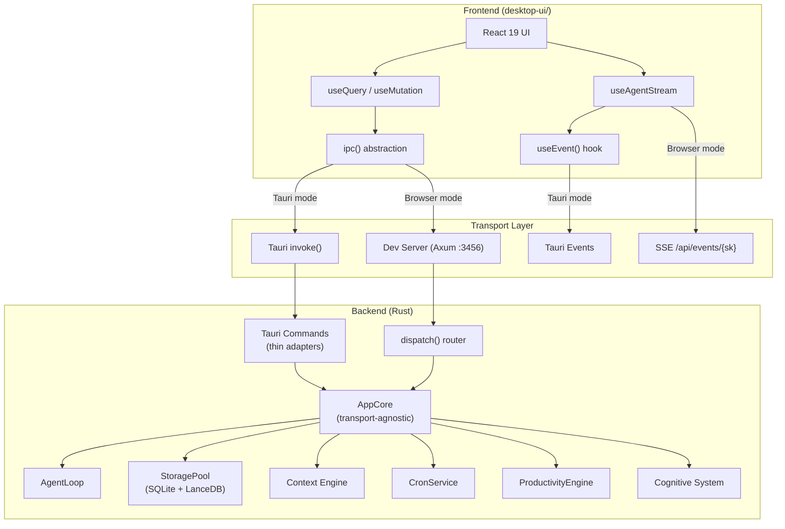
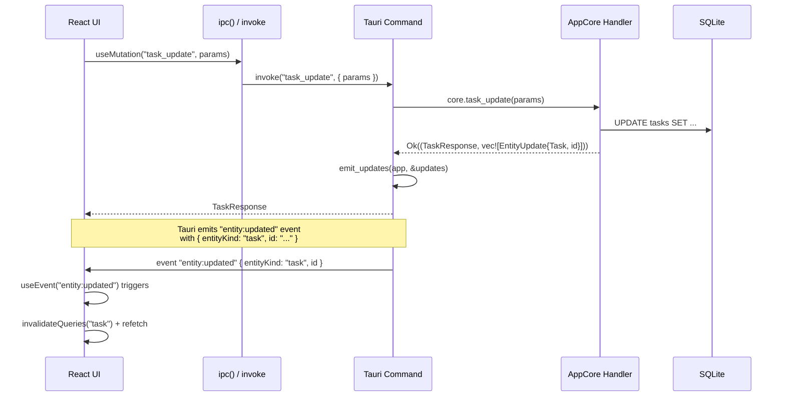
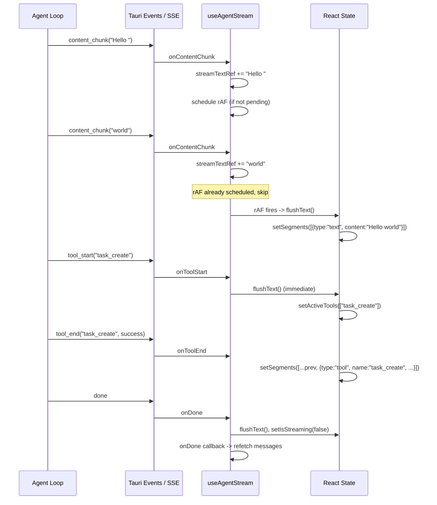

# Desktop App Architecture

## Overview

The Klynt desktop app is a Tauri 2 application with a React 19 frontend. It uses a dual-mode architecture: in production the React UI communicates with Rust via Tauri's native IPC (`invoke`), while in development a parallel Axum HTTP server on port 3456 exposes the same commands as REST endpoints so the UI can be opened in a regular browser for faster iteration.

All business logic lives in the `app-core` crate as a transport-agnostic `AppCore` struct. The `desktop` crate is a thin Tauri adapter, and the dev server is a thin Axum adapter -- both delegate to the same `AppCore` handlers.

**Key crates:**

| Crate | Role |
|---|---|
| `app-core` | Transport-agnostic state and handlers (`AppCore`, `HandlerResult<T>`) |
| `desktop` | Tauri adapter -- command registration, tray, window management, event wiring |
| `desktop-shared` | Shared types between Rust and frontend (`EntityKind`, event payloads, command DTOs) |
| `desktop-ui/` | React 19 + Tailwind v4 frontend (Vite, Biome) |

## Application Architecture Diagram



## AppCore Pattern

`AppCore` is the central application state struct defined in `crates/app-core/src/state.rs`. It is deliberately transport-agnostic -- it has no Tauri or Axum dependencies. It holds references to the agent loop, storage, message bus, cron service, productivity engine, cognitive system, and all feature-specific managers.

### HandlerResult\<T\>

Mutating handlers return `HandlerResult<T>`, defined as:

```rust
pub type HandlerResult<T> = Result<(T, Vec<EntityUpdate>), ApiError>;
```

The tuple contains:
- The response data (`T`) to send back to the caller.
- A list of `EntityUpdate` values describing which entities were mutated.

```rust
pub struct EntityUpdate {
    pub kind: EntityKind,  // Task, Project, Note, Finance, etc.
    pub id: String,
}
```

The transport layer (Tauri or dev server) is responsible for extracting the updates and broadcasting them to the UI. Read-only queries return `Result<T, ApiError>` directly.

### Initialization

`AppCore::init_with_sender()` bootstraps everything: storage pool, agent loop, cron service, productivity engine, coaching, and cognitive system. The `desktop` crate's `app_core::init()` wraps this to wire `EventChannels` (mpsc/broadcast receivers) to Tauri event emitters. The result is stored as `Arc<AppCore>` in Tauri's managed state.

## Tauri Commands

The `desktop` crate registers **160+ Tauri commands** in `main.rs` via `tauri::generate_handler![]`. Commands are organized into modules under `crates/desktop/src/commands/`:

| Module | Domain |
|---|---|
| `tasks` | Task CRUD, today view, subtasks, projects, objectives |
| `chat` | Threads, messages, send, cancel, interactions |
| `notes` | Notes, notebooks, versions, attachments, search |
| `finance` | Accounts, transactions, budgets, goals, investments, reports |
| `productivity` | Focus, sessions, categories, insights, calendar |
| `projects` | Project CRUD, instructions, roles |
| `objectives` / `key_results` | OKR management |
| `areas` | Life area CRUD and reordering |
| `cognitive` | Memory facts, rules, episodic, coaching, compaction, reflection |
| `workflows` / `groups` / `columns` | Workflow, group, and custom column management |
| `settings` | MCP config, app info, config sections |
| `cron` | Automation CRUD, enable/disable, manual run |
| `distraction` | Distraction rules, dismiss, allow |
| `work_context` | Context inference, timeline, dashboard intelligence |
| `capture` | Shell hook, ingestion tokens |
| `window` | Resize, open URL, show dashboard, quit |

### Thin Adapter Pattern

Each Tauri command is a thin adapter that delegates to an `AppCore` method:

1. Extract parameters from Tauri's `invoke` arguments.
2. Call the corresponding `AppCore` handler.
3. For mutations: call `emit_updates(&app, &updates)` to broadcast `EntityUpdate` events.
4. Return the response data (or error).

The `emit_updates()` function in `commands/mod.rs` iterates over the update list and emits a Tauri event (`entity:updated`) for each mutated entity:

```rust
pub fn emit_updates(app: &tauri::AppHandle, updates: &[app_core::EntityUpdate]) {
    for u in updates {
        emit_entity_updated(app, u.kind.clone(), &u.id);
    }
}
```

## Dev Server

In debug builds, an Axum HTTP server starts on `127.0.0.1:3456` alongside the Tauri app. It allows the Vite dev server at `localhost:1420` to be opened directly in Chrome with full API functionality.

### Routing

All commands are exposed as `POST /api/{cmd}` via a `dispatch()` function that chains per-module `dispatch_dev()` functions:

```
POST /api/task_list        -> commands::tasks::dispatch_dev("task_list", ...)
POST /api/chat_send        -> dispatch_chat_send(...)  (inline, needs SSE state)
POST /api/note_create      -> commands::notes::dispatch_dev("note_create", ...)
GET  /api/events/{sk}      -> SSE stream for chat session
GET  /api/cognitive/stream  -> SSE stream for cognitive debug events
POST /api/v1/ingest        -> Activity log ingestion
POST /api/v1/ingest/batch  -> Batch activity log ingestion
```

CORS headers allow requests from `http://localhost:1420`.

### Compile-Time Parity Test

The dev server includes two tests that enforce parity with Tauri command registration:

- **`dev_server_covers_all_tauri_commands`** -- Parses `main.rs` to extract registered command names, then verifies each has a corresponding `dispatch_dev` entry (minus a `TAURI_ONLY` allowlist for desktop-specific commands like `resize_window` and `permissions_check_accessibility`).
- **`dev_server_has_no_orphan_commands`** -- Verifies no `dispatch_dev` entries exist without a corresponding Tauri command.

Each command module exports a `DEV_COMMANDS` constant listing its command names, making parity checking automatic.

## Dual-Mode IPC

The frontend uses a single `ipc()` function (`desktop-ui/src/shared/hooks/useIpc.ts`) that transparently selects the transport:

```typescript
export async function ipc<T>(cmd: string, args?: Record<string, unknown>): Promise<T> {
  if (isTauri) {
    return invoke<T>(cmd, args);           // Tauri native IPC
  }
  // Browser dev mode: POST to Axum dev server via Vite proxy
  const res = await fetch(`/api/${cmd}`, {
    method: "POST",
    headers: { "Content-Type": "application/json" },
    body: JSON.stringify(args ?? {}),
  });
  return res.json();
}
```

`isTauri` is a static boolean detected from the `__TAURI_INTERNALS__` global.

### Event Bridging

`useEvent()` (`desktop-ui/src/shared/hooks/useEvent.ts`) similarly bridges the two modes:

- **Tauri mode:** Calls `listen()` from `@tauri-apps/api/event`, which subscribes to Tauri's native event system. Includes a `cancelled` guard to prevent duplicate processing during React StrictMode's double-mount.
- **Browser mode:** Listens for `CustomEvent` on `window`. SSE events from the dev server are bridged to `CustomEvent` dispatches in `useAgentStream.ts`.

### Vite Proxy

`vite.config.ts` proxies `/api` and `/attachments` to the dev server:

```typescript
proxy: {
  "/api":         { target: "http://127.0.0.1:3456", changeOrigin: true },
  "/attachments": { target: "http://127.0.0.1:3456", changeOrigin: true },
}
```

## Entity Update Flow



The `useQuery` hook uses a lightweight in-memory SWR cache (30-second stale time) with request deduplication. When an `entity:updated` event arrives, affected queries are invalidated and re-fetched.

## Chat Streaming

Agent responses stream differently depending on the transport:

### Tauri Mode

1. UI calls `ipc("chat_send", { content, sessionKey })`.
2. The Tauri command creates the user message, starts the agent loop, and returns immediately.
3. The agent loop emits events via `AppEventEmitter` (backed by `tauri::Emitter`).
4. Events flow: `agent:content_chunk`, `agent:tool_start`, `agent:tool_end`, `agent:iteration_start`, `agent:usage_report`, ..., `agent:done`.
5. `useAgentStream` receives them via `useEvent()` listeners.

### Browser Dev Mode

1. UI calls `fetch("/api/chat_send", ...)` via `ipc()`.
2. Before sending, `useAgentStream.startStreaming()` opens an `EventSource` to `GET /api/events/{sessionKey}`.
3. The dev server's `dispatch_chat_send` creates a `broadcast::channel` per session and spawns the agent loop with an `SseEmitter`.
4. The SSE handler subscribes to the broadcast channel and streams events as SSE.
5. The `EventSource` listener in `useAgentStream` dispatches received SSE events as `CustomEvent` on `window`, which `useEvent()` picks up.

### rAF Batching

Text chunks (`agent:content_chunk`) accumulate in a ref (`streamTextRef`) without triggering re-renders. A `requestAnimationFrame` callback flushes the buffer into React state at most once per frame. Tool boundaries (`agent:tool_start`) force an immediate flush to ensure text segments are properly separated from tool segments.



## Multi-Window Architecture

The app defines four windows in `tauri.conf.json`:

| Window | Label | Size | Behavior |
|---|---|---|---|
| **Main** | `main` | 1200x800 | Primary app shell. Starts hidden, shown after init. Close hides (prevents exit) and switches to Accessory activation policy (removes from Dock). |
| **Launcher** | `launcher` | 660x580 | Quick-access overlay. Transparent, no decorations, always-on-top. Toggle with **Alt+Space**. Auto-hides on blur. Uses HUD window effect. |
| **Tray** | `tray` | 320x600 | System tray popup. Transparent, no decorations, always-on-top. Toggle via tray icon click or **Alt+Shift+Space**. Auto-hides on blur. Positioned near tray icon. |
| **Distraction Overlay** | `distraction-overlay` | 420x280 | Distraction intervention popup. Transparent, centered, always-on-top, grabs focus. |

### Window Behaviors

- **dismiss_on_blur**: Launcher and tray windows register a `Focused(false)` handler that calls `window.hide()`. This makes them behave like native popovers.
- **Hide on close**: The main window intercepts `CloseRequested`, prevents the close, and hides instead. On macOS, the app switches to `ActivationPolicy::Accessory` to remove from the Dock.
- **Exit prevention**: The `RunEvent::ExitRequested` handler calls `api.prevent_exit()` to keep the process alive when all windows are hidden.
- **System tray**: Built with `TrayIconBuilder`, uses a template icon. Click toggles the tray window.

### Global Shortcuts

| Shortcut | Action |
|---|---|
| **Alt+Space** | Toggle launcher window (center + show/hide) |
| **Alt+Shift+Space** | Toggle tray window |

## Frontend Architecture

### Directory Structure

The frontend uses a feature-based organization:

```
desktop-ui/src/
  app/             # Router, layouts (AppShell)
  features/
    chat/          # Chat UI, useAgentStream, message rendering
    tasks/         # Task list, board, tree views, project/objective detail
    notes/         # Note editor (TipTap), notebooks, search
    finance/       # Accounts, transactions, budgets, investments
    dashboard/     # Day/week/month/year calendar views
    productivity/  # Focus timer, categories, insights (being merged into dashboard)
    settings/      # General, MCP, git, environments, integrations
    system/        # Work contexts, categories, inference debug, event log
    tray/          # Launcher page, system tray page
    distraction/   # Distraction overlay
    setup/         # First-run setup wizard
  shared/
    hooks/         # useIpc, useQuery, useMutation, useEvent, useAgentStream, etc.
    lib/           # Utilities, date helpers, error parsing
    components/    # Shared UI components
    types/         # TypeScript type definitions
  styles/          # theme.css (design system)
```

### Routing

Uses `react-router` v7 with `createHashRouter` (hash-based routing required for Tauri's file:// protocol). The router defines:

- **Main shell routes** (`/` redirects to `/day/{today}`): dashboard calendar views, tasks, chat, notes, finance, system, settings.
- **Setup wizard** (`/setup/*`): multi-step onboarding flow.
- **Standalone windows**: `/launcher`, `/tray`, `/distraction-overlay` -- no app shell wrapper.

All page components are lazy-loaded via `React.lazy()` with dynamic imports for code splitting.

### Data Fetching

No external state management library (no Redux, Zustand, or React Query). Custom hooks handle everything:

- **`useQuery(cmd, args?, fallback?, staleTime?)`** -- SWR-style data fetching with:
  - In-memory cache with 30-second stale time.
  - Request deduplication (reuses in-flight promises).
  - Pass `null` for `args` to skip fetching (conditional queries).
  - Returns `{ data, loading, error, refetch }`.

- **`useMutation(cmd, wrapKey?)`** -- Write operations. `wrapKey` nests params under a key for Tauri struct arguments.

- **`invalidateQueries(cmdPrefix)`** -- Clears cache entries matching a prefix, triggering refetch on next render.

Both hooks use `ipc()` internally, so they work identically in Tauri and browser modes.

## Design System

The design system is defined in `desktop-ui/src/styles/theme.css` using CSS custom properties and Tailwind CSS v4's `@theme inline` directive. There is no `tailwind.config.js`.

### Token Architecture

```
:root CSS variables  -->  @theme inline  -->  Tailwind utility classes
```

1. **CSS variables** define the raw values in `:root`:
   - Surface staircase: `--surface-lowest` through `--surface-highest` (rgba white at increasing opacity)
   - Text hierarchy: `--text-primary`, `--text-secondary`, `--text-muted`, `--text-dim`
   - Brand: `--brand` (#f97316 orange), `--brand-hover`, `--brand-glow`
   - Semantic: `--success`, `--destructive`, `--info`, `--warning`
   - Glass materials: `--surface-glass`, `--glass-border`, `--surface-glass-sidebar`, `--surface-glass-subtle`
   - Border: `--border`, `--border-subtle`
   - Timeline colors using `oklch()` color space

2. **`@theme inline`** registers these variables as Tailwind tokens, generating utility classes like `bg-surface-base`, `text-muted`, `border-border`.

3. **Usage**: Components use Tailwind utilities exclusively. Never hardcode hex/rgba values.

### Glassmorphism

The `glass-panel` class provides a glassmorphism effect for floating UI elements (dropdowns, popups, dialogs). It uses `@apply backdrop-blur-[80px] backdrop-saturate-150` rather than raw CSS `backdrop-filter` properties (the CSS minifier breaks combined `backdrop-filter` declarations).

### Dark Theme

The app is dark-theme-only. The root background is `#000000` with surfaces built from semi-transparent white layers at increasing opacity (the "Tahoe glass tiers" pattern). Text uses a four-level hierarchy from bright (`#f0f2f5`) to dim (`#5a616b`).

### CSS Constraints

- Never use raw `backdrop-filter: blur() saturate()` -- use Tailwind's `@apply backdrop-blur-* backdrop-saturate-*`.
- Parent `backdrop-blur` blocks child `backdrop-filter`.
- Never use `overflow-x-auto` / `overflow: hidden` on containers with absolute dropdown children -- use portals instead.

## Development Workflow

### Mode 1: Full Tauri App

```bash
cargo tauri dev
```

Starts the Vite dev server (port 1420) and the Tauri app with hot reload. The dev HTTP server on port 3456 also starts automatically.

### Mode 2: Browser-Only Dev

Run two terminals:

```bash
# Terminal 1: Rust backend
cargo run -p dev-api

# Terminal 2: Frontend
cd desktop-ui && bun run dev
```

Open `http://localhost:1420` in Chrome. The Vite proxy forwards `/api` requests to port 3456. This mode offers faster iteration (browser DevTools, no Tauri rebuild on Rust changes).

### Key Dependencies

| Package | Role |
|---|---|
| `react` 19 | UI framework (with React Compiler via babel plugin) |
| `react-router` 7 | Hash-based routing |
| `@tauri-apps/api` 2 | Tauri IPC bridge |
| `tailwindcss` 4 + `@tailwindcss/vite` | Styling (CSS-first config) |
| `@biomejs/biome` 2 | Linting and formatting (replaces ESLint + Prettier) |
| `@tiptap/*` | Rich text editor for notes |
| `recharts` 3 | Charts for finance and productivity |
| `lucide-react` | Icon library |
| `@dnd-kit/*` | Drag-and-drop for task reordering |
| `@radix-ui/*` | Accessible UI primitives (checkbox, progress) |

### Gotchas

- **npm vs bun**: `tauri.conf.json`'s `beforeBuildCommand` uses `npm run build`. The project requires `bun`. For `cargo tauri dev`, either start Vite manually or ensure `npm` is available. The `beforeDevCommand` is set to empty string to avoid this issue during development.
- **SSE bypass**: In browser dev mode, SSE connections to `/api/events/{sessionKey}` bypass the Vite proxy's default behavior. The proxy is configured to forward to port 3456, but EventSource connections may need the connection to stay open. The `KeepAlive` setting on the Axum SSE handler ensures the connection persists.
- **Config changes require restart**: Changing `config.json` requires restarting the desktop app -- there is no hot-reload for configuration.
- **Window visibility**: The main window starts hidden (`visible: false` in `tauri.conf.json`) to avoid a blank flash during initialization, then is shown programmatically after `AppCore` init completes.
