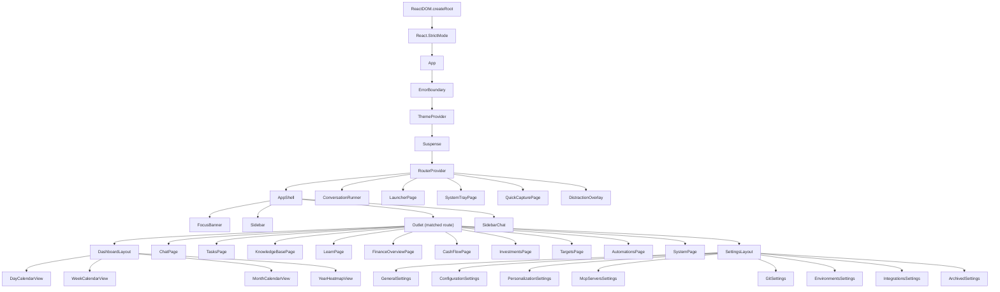
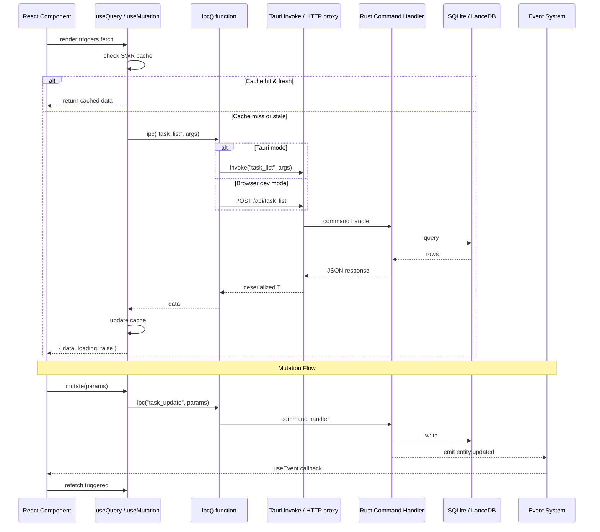
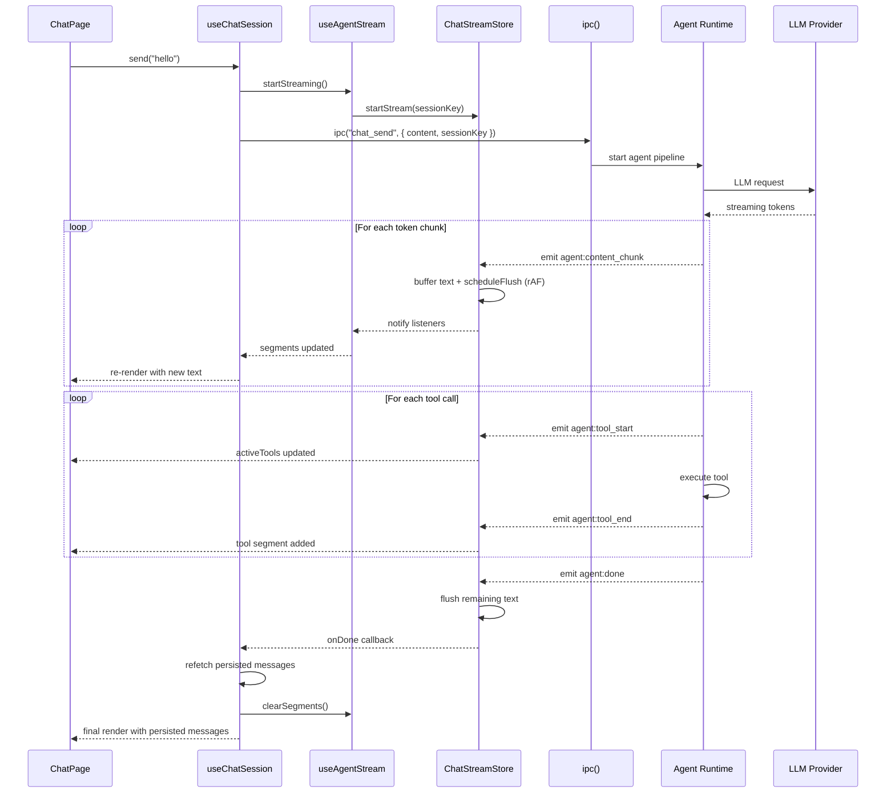

# Frontend Architecture: desktop-ui

> React 19 + TypeScript + Tailwind CSS v4 + Tauri 2 desktop application frontend.

## Tech Stack

| Layer | Technology | Version | Notes |
|---|---|---|---|
| Framework | React | 19 | With React Compiler via `babel-plugin-react-compiler` |
| Language | TypeScript | 5.7+ | Strict mode, bundler module resolution |
| Styling | Tailwind CSS | v4 | `@tailwindcss/vite` plugin, `@theme inline` tokens, no config file |
| Build | Vite | 6.3 | ESNext target, path aliases `@/`, `@shared/`, `@features/`, `@app/` |
| Desktop | Tauri | 2.x | `@tauri-apps/api` for IPC, `@tauri-apps/plugin-updater` + `plugin-process` |
| Routing | React Router | 7.13 | Hash router (`createHashRouter`) for Tauri compatibility |
| State | Zustand | 5.x | Feature-local stores (tasks, launcher); global `ChatStreamStore` singleton |
| Rich Text | TipTap | 3.20 | Full editor suite with 18+ extensions including tables, code blocks, math |
| Charts | Recharts | 3.7 | Used for finance, productivity, and dashboard visualizations |
| Animation | Motion | 12.35 | Framer Motion successor for page transitions and micro-interactions |
| Icons | Lucide React | 0.487 | Consistent icon set across all features |
| Graph | Cytoscape | 3.33 | Knowledge graph visualization with Cola and fCose layouts |
| Markdown | react-markdown | 10.1 | With `remark-gfm` and `rehype-highlight` |
| Diagrams | Mermaid | 11.13 | Rendered within note insight panels |
| Linting | Biome | 2.4 | Replaces ESLint + Prettier; format + lint + import organization |
| Testing | Vitest | 4.x | With `@testing-library/react` and `jsdom` |
| Drag & Drop | dnd-kit | 6.3 | Sortable tabs and task board columns |
| UI Primitives | Radix UI | Various | Dialog, DropdownMenu, Popover, ContextMenu, Checkbox, Avatar, Progress, Separator |
| Date Utils | date-fns | 4.1 | Calendar and date arithmetic |

## Directory Structure

```
desktop-ui/
  src/
    main.tsx                    # ReactDOM.createRoot entry point
    App.tsx                     # Root: ErrorBoundary > ThemeProvider > RouterProvider
    test-setup.ts               # Vitest global setup
    app/                        # Application shell layer
      router.tsx                # Hash router definition (all routes)
      layouts/
        AppShell.tsx            # Main layout: Sidebar + Outlet + SidebarChat + FocusBanner
        Sidebar.tsx             # Icon-only nav rail (52px wide, glass-sidebar)
      providers/
        ThemeProvider.tsx        # Theme context (dark | retro), localStorage persistence
    features/                   # Feature-sliced modules (one per domain)
      automations/              # Cron job management
      chat/                     # AI chat interface (main + sidebar + launcher variants)
      dashboard/                # Day/week/month/year calendar timeline views
      debug/                    # Debug tabs (events, pipeline, memory, coaching)
      distraction/              # Full-screen distraction intervention overlay
      finance/                  # Personal finance (overview, cash flow, investments, targets)
      launcher/                 # Spotlight-style command launcher (separate Tauri window)
      learn/                    # Spaced repetition flashcard system
      notes/                    # Knowledge base (editor, graph, inbox, insights, perspectives)
      productivity/             # Activity tracking, focus timer, categories, analytics
      settings/                 # App configuration (general, MCP, git, integrations, etc.)
      setup/                    # First-run conversational setup wizard
      system/                   # System management (contexts, categories, inference tabs)
      tasks/                    # Task/project/area management (Linear-style UI)
      tray/                     # System tray window + launcher chat
      work-contexts/            # Work context tracking and switching
    shared/                     # Cross-feature shared code
      components/               # Shared React components
        chat/SidebarChat.tsx    # Slide-out contextual chat panel
        focus/FocusBanner.tsx   # Top-of-screen focus session indicator
        ErrorBoundary.tsx       # Root error boundary with retry
        CollapsibleSection.tsx  # Animated collapsible section
        MiniCalendar.tsx        # Compact calendar widget
        ToastContainer.tsx      # Toast notification renderer
        ui/KlyntLogo.tsx        # Brand logo SVG component
      composites/               # Higher-level compound components
        Card/                   # Card, CardHeader, CardContent, CardFooter, CardTitle
        Chart/                  # DonutChart, ProgressRing
        DataTable.tsx           # Generic sortable data table
        DateNavigator/          # Day/week/month navigation with arrows
        Dialog/                 # Dialog, ConfirmDialog (wraps Radix)
        EmptyState/             # Placeholder for empty lists
        Form/                   # FormField, FormSection
        PageHeader/             # Consistent page header with title + actions
        SettingsCard/           # Settings section card with toggle
        SlidePanel/             # Animated slide-in side panel
      hooks/                    # Shared custom hooks (see "Custom Hooks" section below)
      lib/                      # Pure utility functions
        cn.ts                   # `cn()` — clsx + tailwind-merge
        cron.ts                 # Cron expression utilities
        dates.ts                # Date formatting, timezone helpers, navigation
        errors.ts               # Error parsing utilities
        format.ts               # Number/currency formatting
        group-by.ts             # Array grouping utility
        tagColor.ts             # Deterministic tag color generation
        updater.ts              # Tauri auto-update check
        utils.ts                # isTauri detection, formatDuration, formatTokens, formatCost, groupBy
        activity-sessions.ts    # Activity session merging logic
      stores/
        chatStreamStore.ts      # Global singleton ChatStreamStore class (see "Agent Streaming")
      styles/
        glass.css               # Glassmorphism utility classes (see "Glass Material System")
        themes/
          _base.css             # Structural tokens (spacing, radius, typography, animation)
          dark.css              # Dark theme (oklch colors, glass materials, radial gradients)
          retro.css             # "Nexora" retro theme (white, flat, 0px radii, monospace)
      types/                    # TypeScript type definitions mirroring Rust backend structs
        agent.ts                # CoachingIntervention
        chat.ts                 # ChatMessage, streaming event payloads, TransparencyData
        common.ts               # ApiError, StatusWorkflow, TimelineEntry, CronJob, SidebarItem
        config.ts               # McpServerConfig, OAuthStartParams
        dashboard.ts            # CalendarEvent
        entity-links.ts         # EntityLink, LinkedEntities, ProjectSource
        finance.ts              # FinanceAccount, Transaction, Budget, Investment, etc.
        notes.ts                # Note, Notebook, NoteLink, NoteVersion, InboxItem
        productivity.ts         # ActivityCategory, FocusSession, InsightCard, TrackedApp, etc.
        tasks.ts                # Task, Project, Area, Objective, KeyResult, CustomColumn
        workContexts.ts         # WorkContext, WorkContextDetail, ContextTimelineBlock
      ui/                       # Atomic UI primitives
        Badge.tsx               # Colored label badge
        Button.tsx              # Primary button with variants (CVA)
        Checkbox.tsx            # Radix checkbox wrapper
        ContextMenu.tsx         # Right-click context menu (Radix)
        Input.tsx               # Text input with glass styling
        KlyntLogo.tsx           # Logo component
        Progress.tsx            # Progress bar (Radix)
        SaveButton.tsx          # Button with loading/saved states
        SecretInput.tsx         # Password input with show/hide toggle
        ShortcutRecorder.tsx    # Keyboard shortcut capture widget
        Skeleton.tsx            # Loading skeleton placeholder
        Spinner.tsx             # Animated loading spinner
        Toggle.tsx              # On/off toggle switch
        Tooltip.tsx             # Hover tooltip
    styles/
      index.css                 # CSS entry point (imports all style files)
      tailwind.css              # Tailwind v4 `@import "tailwindcss"` directive
      theme.css                 # Root CSS variables + @theme inline registration + animations
      fonts.css                 # Font-face declarations
      prose.css                 # Markdown/prose content styling
      editor.css                # TipTap editor-specific styles
```

## Routing

All routes use `createHashRouter` for Tauri webview compatibility. The router is defined in `src/app/router.tsx`. All page components are lazy-loaded with `React.lazy()`.

### Route Map

| Path | Component | Layout | Description |
|---|---|---|---|
| `/` | `DashboardRedirect` | AppShell | Redirects to `/day/{today}` |
| `/day/:date` | `DayCalendarView` | AppShell > DashboardLayout | Day timeline with calendar + activity tracks |
| `/week/:date` | `WeekCalendarView` | AppShell > DashboardLayout | Week overview |
| `/month/:date` | `MonthCalendarView` | AppShell > DashboardLayout | Month calendar grid |
| `/year/:year` | `YearHeatmapView` | AppShell > DashboardLayout | Year heatmap |
| `/chat` | `ChatPage` | AppShell | Full-page AI chat with thread list |
| `/tasks` | `TasksPage` | AppShell | Task management with tabs, board, and detail views |
| `/notes` | `KnowledgeBasePage` | AppShell | Knowledge base: editor, graph, navigation sidebar |
| `/learn` | `LearnPage` | AppShell | Spaced repetition flashcard dashboard and review |
| `/finance` | `FinanceOverviewPage` | AppShell | Finance dashboard with net worth, health score, donut |
| `/finance/cashflow` | `CashFlowPage` | AppShell | Cash flow: transactions, budgets, spending heatmap |
| `/finance/investments` | `InvestmentsPage` | AppShell | Portfolio and investment tracking |
| `/finance/targets` | `TargetsPage` | AppShell | Financial goals and liabilities |
| `/automations` | `AutomationsPage` | AppShell | Cron job scheduler management |
| `/system` | `SystemPage` | AppShell | System management with tabbed interface |
| `/system/:tab` | `SystemPage` | AppShell | System page with specific tab (contexts, categories, inference, events) |
| `/settings/general` | `GeneralSettings` | AppShell > SettingsLayout | General app settings |
| `/settings/configuration` | `ConfigurationSettings` | AppShell > SettingsLayout | LLM provider configuration |
| `/settings/personalization` | `PersonalizationSettings` | AppShell > SettingsLayout | Persona/behavior settings |
| `/settings/mcp` | `McpServersSettings` | AppShell > SettingsLayout | MCP server management |
| `/settings/git` | `GitSettings` | AppShell > SettingsLayout | Git integration settings |
| `/settings/environments` | `EnvironmentsSettings` | AppShell > SettingsLayout | Environment variable management |
| `/settings/integrations` | `IntegrationsSettings` | AppShell > SettingsLayout | Third-party integrations (OAuth) |
| `/settings/archived` | `ArchivedSettings` | AppShell > SettingsLayout | Archived/deprecated settings |
| `/setup` | `ConversationRunner` | None | First-run setup wizard (standalone) |
| `/launcher` | `LauncherPage` | None | Spotlight-style launcher (separate Tauri window) |
| `/tray` | `SystemTrayPage` | None | System tray popover (separate Tauri window) |
| `/quick-capture` | `QuickCapturePage` | None | Quick note capture overlay (separate Tauri window) |
| `/distraction-overlay` | `DistractionOverlay` | None | Full-screen distraction intervention (separate Tauri window) |

**Standalone windows** (`/setup`, `/launcher`, `/tray`, `/quick-capture`, `/distraction-overlay`) render outside the AppShell and are shown in dedicated Tauri windows with transparent backgrounds and native vibrancy effects.

## Application Shell

### AppShell (`src/app/layouts/AppShell.tsx`)

The main layout wraps all in-app routes. Responsibilities:

1. **Setup gate** -- queries `app_info` on mount; redirects to `/setup/welcome` if `setupCompleted === false`
2. **Focus banner** -- renders a `FocusBanner` at the top when a task has an active focus session (`focusedAt != null`)
3. **Sidebar** -- 52px icon-only navigation rail with glass material
4. **Content area** -- `<Outlet />` renders the matched route's component
5. **Sidebar chat** -- slide-out contextual AI chat panel (hidden on `/chat` page to avoid duplication)
6. **Event listeners** -- listens for `entity:updated` (refreshes focus state), `open-chat` (opens sidebar chat), `navigate` (programmatic navigation from tray/launcher)

### Sidebar (`src/app/layouts/Sidebar.tsx`)

Icon-only vertical nav with items: Chat, Dashboard, Tasks, Notes, Learn, Finance, Automations | System, Settings. Shows a badge on "Learn" with the count of due flashcards (polled every 30s). Also includes a "Quick chat" toggle button for the sidebar chat panel.

## Tauri IPC Integration

### `ipc()` Function (`src/shared/hooks/useIpc.ts`)

The foundational IPC layer. Dual-mode:

- **Tauri mode** (`isTauri === true`): delegates to `@tauri-apps/api/core` `invoke<T>(cmd, args)`
- **Browser dev mode** (`isTauri === false`): makes HTTP POST to `/api/{cmd}` via Vite's dev proxy, which forwards to the Rust dev server on `:3456`

```
ipc<T>(cmd: string, args?: Record<string, unknown>): Promise<T>
```

All data fetching and mutations flow through this single function, ensuring consistent error handling and transport abstraction.

### `useQuery()` Hook (`src/shared/hooks/useQuery.ts`)

SWR-style data fetching with:
- **In-memory cache** with configurable stale time (default 30s)
- **Request deduplication** -- concurrent calls to the same command share one in-flight promise
- **Conditional fetching** -- pass `null` for `args` to skip
- **Stale-while-revalidate** -- serves cached data immediately, fetches in background if stale

```typescript
useQuery<T>(cmd, args?, fallback?, staleTime?) -> { data, loading, error, refetch }
```

### `useMutation()` Hook (`src/shared/hooks/useMutation.ts`)

Write operation wrapper with:
- **`wrapKey` parameter** -- nests params under a key for Tauri struct commands (e.g. `{ params: {...} }`)
- **Automatic `entity:updated` events** -- infers entity kind from command prefix (`task_`, `note_`, etc.) and dispatches browser-side `CustomEvent` so `useEvent` listeners auto-refresh

```typescript
useMutation<T, P>(cmd, wrapKey?) -> { mutate, loading, error }
```

### `useEvent()` Hook (`src/shared/hooks/useEvent.ts`)

Subscribes to events from the Rust backend:
- **Tauri mode**: uses `@tauri-apps/api/event` `listen<T>(event, handler)` with a `cancelled` guard for StrictMode safety
- **Browser dev mode**: listens for `CustomEvent` on `window`

Auto-cleanup on unmount. Used extensively for real-time updates: `entity:updated`, `open-chat`, `navigate`, focus state changes, etc.

### Data Flow

```
UI Component
    |
    v
useQuery("task_list") / useMutation("task_update")
    |
    v
ipc<T>(cmd, args)
    |
    +-- [Tauri mode] --> invoke() --> Rust command handler --> SQLite/LanceDB
    |
    +-- [Browser dev] --> fetch("/api/cmd") --> Vite proxy --> dev HTTP server --> same Rust handlers
    |
    v
Response (JSON) --> setState --> re-render
    |
    v
useMutation dispatches "entity:updated" CustomEvent
    |
    v
useEvent("entity:updated") in other components --> refetch
```

## Agent Streaming Architecture

The AI chat streaming system is architecturally significant. It uses a **global singleton store** (`ChatStreamStore`) that survives React component lifecycle, connected to via `useSyncExternalStore`.

### ChatStreamStore (`src/shared/stores/chatStreamStore.ts`)

A class-based singleton (`chatStreamStore`) that:

1. **Manages stream state per session key** -- each active session has a `StreamSnapshot` with segments, active tools, transparency data, persona messages, debate rounds, etc.
2. **Buffers text chunks** -- accumulates `agent:content_chunk` events in a text buffer, flushing via `requestAnimationFrame` for smooth 60fps rendering
3. **Registers event listeners once** -- singleton listeners for 25+ SSE event types, dispatched to the correct session's state
4. **Browser dev mode SSE bridge** -- creates `EventSource` connections per session, bridging SSE events to `CustomEvent` on `window`
5. **Deferred refetch** -- if a stream finishes while no component is subscribed, sets `needsRefetch: true` for the next mount

### useAgentStream Hook (`src/features/chat/hooks/useAgentStream.ts`)

React hook that subscribes to `ChatStreamStore` via `useSyncExternalStore`:

```typescript
useAgentStream(sessionKey, onDone?) -> {
  segments, isStreaming, activeTools, error,
  activeInteraction, transparency,
  personaMessages, debateRounds, judgeDecisions,
  startStreaming, failStreaming, clearSegments, ...
}
```

### useChatSession Hook (`src/features/chat/hooks/useChatSession.ts`)

Composes `useQuery` (message history) + `useAgentStream` (live streaming) into a single interface:

```typescript
useChatSession(sessionKey, onDone?, options?) -> {
  messages, segments, isStreaming, input, setInput, send,
  transparency, activeTools, error, activeInteraction,
  personaMessages, debateRounds, ...
}
```

Handles optimistic pending user messages, automatic segment clearing when persisted messages arrive, and squad chat mode.

### Streaming Event Types

The system handles 25+ event types from the Rust agent runtime:

| Event | Purpose |
|---|---|
| `agent:content_chunk` | Incremental text tokens |
| `agent:tool_start` / `agent:tool_end` | Tool execution lifecycle |
| `agent:done` | Stream completion |
| `agent:error` | Stream failure |
| `agent:classification_complete` | Intent classification result |
| `agent:execution_started` | Execution engine selection |
| `agent:iteration_start` | ReAct loop iteration |
| `agent:usage_report` | Token usage + cost |
| `agent:memory_access` | Memory retrieval events |
| `agent:skill_loaded` | Skill activation |
| `agent:learning_event` | Behavioral learning |
| `agent:agent_selected` | Agent routing decision |
| `agent:subagent_spawned` | Sub-agent creation |
| `agent:delegation_started` / `completed` | Inter-agent delegation |
| `agent:plan_generated` / `plan_step_completed` | Plan execution progress |
| `agent:interaction_request` | Interactive form prompt (ask_user) |
| `agent:persona_perspective` | Persona viewpoint in squad mode |
| `agent:debate_round_started` / `completed` | Multi-persona debate rounds |
| `agent:debate_judge_decision` | Judge arbitration |
| `agent:consensus_reached` | Debate resolution |
| `agent:memory_promoted` | Memory scope promotion |
| `entity:updated` | Entity change notification for cache invalidation |

## State Management

The application uses a **hybrid approach** -- no single global store. Instead:

### 1. Zustand Stores (Feature-Local)

Used for UI state that needs to persist across component mounts within a feature:

| Store | Location | Purpose |
|---|---|---|
| `useTabStore` | `features/tasks/store/tab-store.ts` | Tab navigation stacks, active tab, drag reorder |
| `useFilterStore` | `features/tasks/store/filter-store.ts` | Active task filters (status, assignee, priority, labels, project) |
| `useViewStore` | `features/tasks/store/view-store.ts` | List vs grid view mode (persisted to localStorage) |
| `useSearchStore` | `features/tasks/store/search-store.ts` | Task search query state |
| `useCreateIssueStore` | `features/tasks/store/create-issue-store.ts` | Create issue modal state |
| `useLauncherStore` | `features/launcher/stores/launcherStore.ts` | Launcher mode, query, results, selection, history |

### 2. ChatStreamStore Singleton

Global class instance managing all active chat streams. Connected via `useSyncExternalStore` -- not Zustand.

### 3. React Context

| Context | Location | Purpose |
|---|---|---|
| `ThemeContext` | `app/providers/ThemeProvider.tsx` | Theme selection (dark / retro) |
| `ToastContext` | `shared/hooks/useToast.ts` | Shared toast notifications |
| `StatusWorkflowContext` | `features/tasks/contexts/StatusWorkflowContext.tsx` | Task status labels for the current project |
| `PortalContext` | `features/tasks/components/portal-context.tsx` | Portal container ref for dropdowns |

### 4. URL State

Route params (`:date`, `:tab`, `:year`) drive dashboard navigation. The current route determines the active sidebar item and contextual chat scope.

### 5. Server State via useQuery

All backend data is fetched via `useQuery` with SWR caching. No client-side data normalization -- components fetch what they need directly.

## Custom Hooks Reference

### Shared Hooks (`src/shared/hooks/`)

| Hook | Description |
|---|---|
| `ipc` | Typed Tauri invoke wrapper with HTTP fallback (see IPC section) |
| `useQuery` | SWR-cached data fetching via IPC with dedup and conditional skip |
| `useMutation` | Write operations via IPC with auto entity:updated dispatch |
| `useEvent` | Tauri event subscription with StrictMode-safe cleanup |
| `useAutoResizeTextarea` | Auto-grows textarea to fit content, resets on clear |
| `useClickOutside` | Fires callback when clicking outside a ref element |
| `useCopyToClipboard` | Clipboard write with auto-resetting "copied" state |
| `useCustomColumns` | Fetches custom columns for a project + column value CRUD mutations |
| `useEntityLinks` | Fetches linked entities (tasks, notes, conversations, sources, objectives) for an entity |
| `useFocusSession` | Elapsed timer for an active focus session with formatted display |
| `useSetToggle` | `Set<string>` state with toggle function |
| `useToast` | Toast notification state with auto-dismiss timer |
| `useTransparentBackground` | Sets transparent document background for overlay windows; supports native vibrancy |
| `useWindowAutoResize` | Auto-resizes Tauri window to match content via ResizeObserver + MutationObserver |
| `useWorkflows` | Fetches status workflows and effective labels for a project |

### Re-exported Hooks (backward compatibility wrappers)

| Hook in `shared/hooks/` | Delegates to |
|---|---|
| `useChatSession` | `features/chat/hooks/useChatSession` |
| `useCoachingNudge` | `features/chat/hooks/useCoachingNudge` |
| `useFocusTimer` | `features/productivity/hooks/useFocusTimer` |
| `useGroups` | `features/chat/hooks/useGroups` |
| `usePageContext` | `features/productivity/hooks/usePageContext` |

### Chat Feature Hooks (`src/features/chat/hooks/`)

| Hook | Description |
|---|---|
| `useAgentStream` | Subscribes to ChatStreamStore for streaming state (see Agent Streaming) |
| `useChatSession` | Composes useQuery + useAgentStream into a complete chat session interface |
| `useCoachingNudge` | Manages coaching intervention nudge display and dismissal |
| `useEvent` | (feature-local copy) Tauri event subscription |
| `useGroups` | Chat thread grouping by date (Today, Yesterday, Last Week, etc.) |
| `useIpc` | (feature-local copy) IPC wrapper |

### Tasks Feature Hooks (`src/features/tasks/hooks/`)

| Hook | Description |
|---|---|
| `useTasks` | Fetches tasks, projects, areas; provides CRUD mutations; auto-refreshes on entity:updated events |
| `useIssueDetail` | Fetches single task detail with linked entities |
| `useTasksContext` | Context provider for tasks page shared state |

### Notes Feature Hooks (`src/features/notes/hooks/`)

| Hook | Description |
|---|---|
| `useAnnotations` | Note annotation CRUD (highlights, comments) |
| `useBacklinks` | Fetches backlinks for a note |
| `useCardGeneration` | AI flashcard generation from note content |
| `useColaPhysics` | Cola physics layout for knowledge graph |
| `useCytoscapeElements` | Builds Cytoscape graph elements from note link data |
| `useCytoscapeGraph` | Manages Cytoscape graph instance lifecycle |
| `useCytoscapeTheme` | Theme-aware Cytoscape stylesheet generation |
| `useEditorActions` | TipTap editor action dispatch (bold, italic, heading, etc.) |
| `useFlashcards` | Flashcard review session management |
| `useGraphData` | Fetches graph data (notes + links) from backend |
| `useGraphPositionCache` | Caches graph node positions to avoid relayout |
| `useGraphSettings` | Graph visualization settings (layout, filters, depth) |
| `useInbox` | Inbox item management (AI-suggested notes to process) |
| `useInsightEvolution` | Insight evolution timeline data |
| `useInsightReview` | AI insight review panel state |
| `useInsightSSE` | SSE connection for real-time insight generation |
| `useInsightVersions` | Insight version history |
| `useLanguageBreakdown` | Language analysis for multilingual notes |
| `useLanguageConfig` | Language learning configuration |
| `useLinkedContext` | Context panel data for linked notes |
| `useNoteSuggestions` | AI-powered note suggestions |
| `usePersonas` | Persona management for multi-perspective analysis |
| `usePerspective` | Active perspective state (annotated view, study mode) |
| `useProgressiveReveal` | Progressive content reveal for study mode |
| `useSquads` | Squad (persona group) management |
| `useTranslationPractice` | Language translation practice session |
| `useUnlinkedMentions` | Discovers unlinked mentions of note titles in other notes |
| `useVocabularySave` | Vocabulary word saving for language learning |

### Finance Feature Hooks (`src/features/finance/hooks/`)

| Hook | Description |
|---|---|
| `useCurrencyDisplayMode` | Toggle between original/converted currency display |
| `useFinanceCurrency` | Fetch exchange rates and configured base currency |
| `usePeriodState` | Period selector state (month/year navigation) |
| `usePrivacyMode` | Toggle to blur sensitive financial amounts |

### Productivity Feature Hooks (`src/features/productivity/hooks/`)

| Hook | Description |
|---|---|
| `useFocusTimer` | Pomodoro-style focus timer with presets (25m, 50m, 90m, custom) and Tauri IPC |
| `usePageContext` | Page-level context for productivity views (date range, active section) |

### Launcher Feature Hooks (`src/features/launcher/hooks/`)

| Hook | Description |
|---|---|
| `useDashboardData` | Fetches launcher dashboard data (upcoming tasks, recent items) |
| `useExecuteItem` | Executes a selected launcher item (open, navigate, run) |
| `useKeyboardNavigation` | Arrow key, Enter, Escape keyboard navigation |
| `useLauncherSearch` | Debounced search with IPC backend query |

### Learn Feature Hooks (`src/features/learn/hooks/`)

| Hook | Description |
|---|---|
| `useLearnDashboard` | Dashboard data: decks, stats, due counts |
| `useReviewSession` | Active review session: current card, rating, progress |

### Work Contexts Feature Hooks (`src/features/work-contexts/hooks/`)

| Hook | Description |
|---|---|
| `useContextResume` | Resume data for a paused work context |
| `useContextTimeline` | Timeline blocks for context day view |
| `useWorkContexts` | CRUD for work contexts with search support |

### Setup Feature Hooks (`src/features/setup/hooks/`)

| Hook | Description |
|---|---|
| `useConversationRunner` | Manages the conversational setup wizard state machine |
| `useTypewriter` | Typewriter text animation effect |

## Theme System

### Architecture

The theme system uses a three-layer approach:

1. **CSS custom properties** defined in `:root` and `[data-theme="..."]` selectors
2. **`@theme inline` blocks** that register CSS vars as Tailwind v4 design tokens
3. **Tailwind utility classes** that consume the tokens (e.g., `bg-background`, `text-brand`, `border-border`)

### Token Categories

| Category | Examples | Usage |
|---|---|---|
| Core (shadcn/ui) | `--background`, `--foreground`, `--card`, `--primary`, `--muted` | Base layout colors |
| Surface staircase | `--surface-lowest` through `--surface-highest` | Elevation layers |
| Text hierarchy | `--text-primary`, `--text-secondary`, `--text-muted`, `--text-dim` | Typography colors |
| Brand | `--brand`, `--brand-hover`, `--brand-glow` | Accent color (orange in dark, gold in retro) |
| Semantic | `--success`, `--info`, `--warning`, `--destructive`, `--purple` | Status colors |
| Origin badges | `--origin-system`, `--origin-ai`, `--origin-user`, `--origin-plugin` | Source indicators |
| Timeline | 18 `--timeline-*` tokens | Dashboard visualization colors |
| Glass material | `--surface-glass`, `--glass-border`, `--surface-glass-subtle`, etc. | Glassmorphism effects |
| Charts | `--chart-1` through `--chart-5` | Recharts palette |
| Shape | `--radius` (base), computed `--radius-sm` through `--radius-pill` | Border radius scale |
| Shadows | `--shadow-2xs` through `--shadow-2xl` | Elevation shadows |

### Theme Variants

**Dark theme** (default): Pure black background with oklch-based colors, glassmorphism effects, and multi-layered radial gradients on `<body>`.

**Retro ("Nexora") theme**: White background, flat surfaces (no glassmorphism), 0px border radius everywhere, grid pattern background, monospace accents (JetBrains Mono), gold/amber brand color. All `backdrop-filter` effects are disabled via `!important` override.

Theme switching is controlled by `data-theme` attribute on `<html>`, persisted in `localStorage`, and managed by `ThemeProvider`.

## Glass Material System

Defined in `src/shared/styles/glass.css` as Tailwind `@layer utilities` classes:

| Class | Use Case | Blur | Background |
|---|---|---|---|
| `.glass-panel` | Dialogs, popovers | 80px | `--surface-glass` (white 8%) |
| `.glass-sidebar` | Navigation sidebar | 100px | `--surface-glass-sidebar` (white 6%) |
| `.glass-toolbar` | Standalone toolbar bars | 60px | white 7% |
| `.glass-input` | Form inputs | 40px | `--surface-glass-subtle` (white 6%) |
| `.glass-button` | Interactive buttons | 30px | `--surface-glass-subtle` (white 6%) |
| `.glass-floating` | Overlay windows (launcher, tray) | 80px | dark 82% |
| `.glass-dropdown` | In-app floating menus | 80px | dark 75% |
| `.glass-card` | Content cards | 50px | white 4% |
| `.glass-bubble` | Assistant chat messages | 40px | white 7% |
| `.glass-bubble-user` | User chat messages | 40px | white 8% |
| `.context-menu` | Right-click menus | 80px | dark 88% |
| `.glass-badge` | Small pill labels | 20px | white 6% |
| `.glass-divider` | Horizontal separators | N/A | Gradient white 8% |

Additional utility classes: `.note-card` (hover lift effect), `.tag-pill` (colored glass tags), `.version-dot` / `.version-line` (timeline indicators), `.tabular-nums` (monospace digits).

**Performance**: `.resizing` class disables backdrop-filter during drag operations. Native vibrancy (`data-vibrancy`) disables CSS backdrop-filter to prevent flicker.

## Feature Completeness

### Chat (`features/chat/`)
- **Pages**: ChatPage (full page), LauncherChatPage (embedded in launcher)
- **Components**: ChatInput, MessageList, SegmentedMessage, ThreadList, ThreadButton, ThreadContextMenu, TransparencyPanel, TransparencyToggle, TokenBadge, PlanProgress, InteractionCard, CoachingNudge, VoiceToggle
- **Persona/Squad**: PersonaMessage, PersonaMessageList, SquadChatHeader, DebateView, DebateRound, ConsensusIndicator, JudgeAnnotation
- **UI**: ContextMenu, CollapsedInteraction, GroupHeader
- **Status**: Feature-complete with streaming, tool visualization, transparency panel, persona debates, interactive forms

### Tasks (`features/tasks/`)
- **Pages**: TasksPage
- **Views**: AllIssues (list/grid), IssueBoard (kanban), ProjectView, AreaView, GroupIssues
- **Detail**: IssueDetailView, IssueDetailSidebar (properties, AI insights, time tracking, work state), IssueDetailBreadcrumb, IssueDetailTabs (content, activity), DecompositionPanel/Modal
- **Management**: CreateIssueModal, Filter, SearchIssues, HeaderNav, HeaderOptions, TabBar, TabContent, TabContextMenu, TabPill, AddTabMenu
- **Selectors**: StatusSelector, PrioritySelector, AssigneeUser, LabelBadge, ProjectBadge
- **UI Primitives**: avatar, button, command, context-menu, dialog, dropdown-menu, popover, separator (feature-local Radix wrappers)
- **Stores**: tab-store, filter-store, view-store, search-store, create-issue-store
- **Status**: Feature-complete Linear-style task management with custom columns, drag-and-drop tabs, kanban board

### Notes (`features/notes/`)
- **Pages**: KnowledgeBasePage, QuickCapturePage
- **Navigation**: NavigationSidebar, NotebookTree, NoteFinder, TagsExplorer, InboxSection
- **Editor**: NoteEditor, NoteEditorPanel, EditorCore (TipTap), EditorToolbar, BubbleToolbar, SlashCommandMenu, SplitEditor, SplitToolbar
- **Editor extensions**: WikiLinkNode, EntityMention, MathNode (KaTeX), AnnotationMark, UniqueID, VimCommandLine, VimStatusLine
- **Editor vim mode**: Full vim emulation with LineModel, ProseMirrorAdapter, SearchCursor
- **Language learning**: LanguageLearningPanel, TranslationSection, WordsSection, PracticeSection, ConfusableSection, CollapsibleSection
- **Graph**: GraphView (Cytoscape), GraphToolbar, GraphMinimap, GraphLegend, GraphNodeTooltip, GraphSettingsPopover
- **Insights**: InsightReviewPanel, SynthesisTab, ConceptMapTab, GapAnalysisTab, PerspectivesTab, SelfAssessmentTab, PersonaCard, PersonaChat, SquadManager, SquadPicker, MermaidRenderer, InsightEvolutionChart, InsightVersionList, InsightScopePopover, KnowledgeGrowthMetrics, ManagePersonasModal, ChangesBanner, FlashcardReview, ScenarioChallenge
- **Context panels**: ContextPanel, BacklinksPanel, LinkedViewPanel, LinkedNotes, EntityReferencesPanel, AISuggestionsPanel
- **Other**: NoteCreationDialog, LinkInsertDialog, NoteTags, NoteVersionHistory, VersionHistoryOverlay, PerspectiveOverlay, AnnotationPopover, AnnotatedView, StudyModeView, CardGenerationModal
- **Status**: Extremely feature-rich knowledge management with graph visualization, AI insights, vim mode, language learning, persona perspectives

### Finance (`features/finance/`)
- **Pages**: FinanceOverviewPage, CashFlowPage, InvestmentsPage, TargetsPage
- **Components**: FinanceLayout, FinanceSkeleton, NetWorthCard, HealthScoreRing, MonthlyPulse, BudgetStrip, CategoryRanking, CashFlowStats, DaySummary, SpendingHeatmap, Donut, Card, FormModal, SlidePanel, CurrencyToggle, PrivacyToggle, PeriodSelector, SensitiveDivider
- **Status**: Complete personal finance dashboard with multi-currency support, privacy mode, health scoring

### Dashboard (`features/dashboard/`)
- **Components**: DashboardLayout, DayCalendarView, DayColumnsView, WeekCalendarView, MonthCalendarView, YearHeatmapView, ActivityTrack, CalendarTrack, CalendarSync, ContextRibbon, ProductivityStrip, SummaryPanel
- **Lib**: activity-sessions, buildContainers, layers, timeline-utils
- **Status**: Complete multi-view calendar/timeline dashboard

### Productivity (`features/productivity/`)
- **Pages**: DayPage, WeekPage, MonthPage, CategoriesPage
- **Components**: ProductivityLayout, DayView, WeekView, MonthView, PomodoroTimer, FocusSessionsList, FocusStateIndicator, FocusTrayIndicator, AutoFocusToast, DistractionBanner, DistractionInterventionBanner, Timeline, HourlyHeatmap, LiveScoreRing, ProductivityScoreRing, ScoreTrendChart, MonthlyChart, WeeklyChart, MonthlyStats, WeeklyStats, BreakdownDonuts, TopApps, TrackedAppsList, CategoriesList, CategoryList, CategoryEditor, DateNavigator, InsightCardList, PatternsCard, WorkHoursCard, ProjectsCard, GoalsProgress, AddGoalDialog, ActivityFeed, AiSummaryCard, TimeEntrySection, LearnedRulesCard, WeeklyAssessmentCard
- **Status**: Complete productivity tracking with focus timer, app categorization, AI insights

### Settings (`features/settings/`)
- **Pages**: GeneralSettings, ConfigurationSettings, PersonalizationSettings, McpServersSettings, GitSettings, EnvironmentsSettings, IntegrationsSettings, ArchivedSettings
- **Components**: SettingsLayout, ThemeSwitcher, PermissionsCard
- **MCP**: AddServerDialog, McpServerCard, McpServerIcon, recommendedServers
- **Status**: Complete settings management with MCP server configuration

### Learn (`features/learn/`)
- **Pages**: LearnPage
- **Components**: DashboardHome, DeckList, ImmersiveReview, CardRenderer, RatingButtons, StatsBar, PostSession, QuickAdd, QuickGenerate, NotePicker
- **Status**: Complete spaced repetition system with AI-generated flashcards

### Automations (`features/automations/`)
- **Pages**: AutomationsPage
- **Status**: Cron job management UI

### System (`features/system/`)
- **Pages**: SystemPage
- **Tabs**: CategoriesTab, ContextsTab, InferenceTab
- **Status**: System management with integrated debug tools

### Work Contexts (`features/work-contexts/`)
- **Components**: ContextDayView, ContextDetailPanel, ContextSearchDialog, ContextSidebar, ContextTimeline
- **Status**: Work context tracking and switching

### Setup (`features/setup/`)
- **Components**: ConversationRunner, TypewriterText, FinancePanel, InlineCheckboxList, InlineInput, InlineMasked, InlineSelect, InlineTags
- **Finance sub-forms**: AccountsForm, FinanceBasicsForm, FireForm, GoalsForm, IncomeForm, InvestmentsForm, LiabilitiesForm
- **Status**: Complete conversational first-run wizard

### Launcher (`features/launcher/`)
- **Components**: Dashboard, LauncherInput, ResultsList, DetailPanel, ActionMenu, LauncherChat
- **Status**: Spotlight-style universal search and command launcher

### Tray (`features/tray/`)
- **Pages**: SystemTrayPage, LauncherPage
- **Components**: FocusControl, LauncherChat
- **Status**: System tray popover with focus timer and quick chat

### Debug (`features/debug/`)
- **Pages**: DebugDashboardPage
- **Tabs**: EventsTab, PipelineTab, MemoryTab, CoachingTab
- **Status**: Integrated into System page

### Distraction (`features/distraction/`)
- **Components**: DistractionOverlay
- **Status**: Full-screen intervention overlay

## Component Tree Diagram



## Data Flow Diagram



## AI Streaming Data Flow



## Key Design Decisions

1. **Hash router over browser router**: Required for Tauri webview which loads from `tauri://localhost/` -- history-based routing would not work.

2. **Dual-mode IPC**: The `ipc()` function enables full browser-based development without Tauri by proxying to an HTTP dev server. SSE streaming uses direct `EventSource` connections (bypassing Vite proxy which buffers SSE).

3. **Global ChatStreamStore singleton**: Streaming state must survive React component unmount/remount during navigation. A class-based singleton with `useSyncExternalStore` provides this while maintaining React's concurrent mode compatibility.

4. **requestAnimationFrame text buffering**: Content chunks arrive at high frequency; batching via rAF prevents excessive re-renders while maintaining smooth visual streaming.

5. **Feature-sliced architecture**: Each domain (tasks, notes, finance, etc.) is a self-contained module with its own pages, components, hooks, stores, and lib utilities. Cross-feature dependencies go through `shared/`.

6. **No global state management library**: The combination of Zustand (UI state), useQuery cache (server state), and React context (theme, toast) avoids the complexity of Redux/MobX while keeping state close to where it's used.

7. **Tailwind v4 with CSS-first configuration**: No `tailwind.config.js`. All design tokens are CSS custom properties registered via `@theme inline`, enabling runtime theme switching via CSS variable overrides.

8. **React Compiler**: Enabled via `babel-plugin-react-compiler` in the Vite config, automatically memoizing components and hooks to reduce manual `useMemo`/`useCallback` usage.

9. **Separate Tauri windows for overlays**: Launcher, tray, quick capture, and distraction overlay each render in dedicated Tauri windows with transparent backgrounds, enabling native desktop integration (system tray, global shortcuts, always-on-top overlays).
