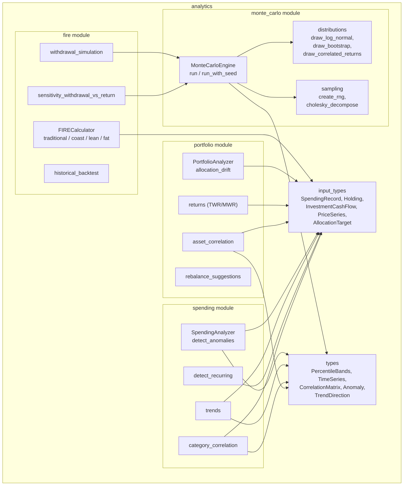

# Layer 0: `analytics` Crate

## Overview

The `analytics` crate provides pure computation for financial analysis. It has no storage dependency, no async, and no side effects. All inputs are pre-fetched data structs; all outputs are computation results. Every function that uses randomness accepts a seed for reproducibility.

The crate is organized into four major modules:
- **`fire`** -- FIRE (Financial Independence, Retire Early) calculators (Traditional, Coast, Lean, Fat, withdrawal simulation, sensitivity analysis, historical backtesting)
- **`monte_carlo`** -- Monte Carlo simulation engine for financial projections
- **`portfolio`** -- Portfolio analytics (drift detection, rebalancing, returns, asset correlation)
- **`spending`** -- Spending analytics (anomaly detection, trend analysis, recurring charge detection, category correlation)

**Crate path:** `crates/analytics/`

### Dependencies

| Dependency | Purpose |
|---|---|
| `common` | Error types, `Decimal` re-export |
| `rust_decimal` | Arbitrary-precision decimal arithmetic |
| `rand` | Random number generation |
| `rand_chacha` | Deterministic ChaCha20 PRNG for reproducible simulations |
| `serde` | Serialization of result types |
| `chrono` | Date types (`NaiveDate`) |

### Test Dependencies

| Dependency | Purpose |
|---|---|
| `proptest` | Property-based testing |
| `rust_decimal_macros` | `dec!()` macro for test literals |

### Benchmark/Validation Tests

- `tests/benchmarks/cfiresim_validation.rs` -- validates Monte Carlo output against cFIREsim
- `tests/benchmarks/trinity_validation.rs` -- validates against Trinity Study results

---

## Input Types (`input_types` Module)

Lightweight structs that feature crates convert storage row types into before passing to analytics functions.

### `SpendingRecord`

```rust
pub struct SpendingRecord {
    pub date: NaiveDate,
    pub amount: Decimal,
    pub tx_type: SpendingType,
    pub category: Option<String>,
    pub counterparty: Option<String>,
}
```

### `SpendingType`

```rust
pub enum SpendingType { Income, Expense }
```

### `Holding`

```rust
pub struct Holding {
    pub name: String,
    pub symbol: Option<String>,
    pub asset_class: String,
    pub current_value: Decimal,
    pub cost_basis: Decimal,
    pub quantity: Decimal,
}
```

### `InvestmentCashFlow`

```rust
pub struct InvestmentCashFlow {
    pub date: NaiveDate,
    pub amount: Decimal,
    pub holding_symbol: Option<String>,
}
```

### `PriceSeries`

```rust
pub struct PriceSeries {
    pub symbol: String,
    pub asset_class: String,
    pub prices: Vec<(NaiveDate, Decimal)>,
}
```

### `AllocationTarget`

```rust
pub struct AllocationTarget {
    pub asset_class: String,
    pub target_weight: Decimal,
    pub tolerance_band: Decimal,
}
```

### `RecurringFrequency`

```rust
pub enum RecurringFrequency { Weekly, Biweekly, Monthly, Quarterly, Annual }
```

---

## Shared Output Types (`types` Module)

### `PercentileBands`

Year-by-year percentile bands from Monte Carlo simulations.

```rust
pub struct PercentileBands {
    pub p5: Vec<Decimal>,
    pub p25: Vec<Decimal>,
    pub p50: Vec<Decimal>,
    pub p75: Vec<Decimal>,
    pub p95: Vec<Decimal>,
    pub survival_rate: Vec<Decimal>,
    pub labels: Vec<String>,
}
```

### `TimeSeries`

```rust
pub struct TimeSeries {
    pub points: Vec<(NaiveDate, Decimal)>,
    pub label: String,
}
```

### `CorrelationMatrix`

```rust
pub struct CorrelationMatrix {
    pub labels: Vec<String>,
    pub coefficients: Vec<Vec<Decimal>>,
}
```

### `Anomaly`

```rust
pub struct Anomaly {
    pub date: NaiveDate,
    pub category: String,
    pub amount: Decimal,
    pub z_score: Decimal,
    pub severity: AnomalySeverity,
    pub explanation: String,
}
```

### `AnomalySeverity`

```rust
pub enum AnomalySeverity { Low, Medium, High }
```

### `AnomalyDirection`

```rust
pub enum AnomalyDirection { SpikesOnly, DropsOnly, Both }
```

### `TrendDirection`

```rust
pub enum TrendDirection { Increasing, Decreasing, Stable }
```

---

## FIRE Module (`fire`)

### `FIRECalculator`

Stateless calculator struct with associated functions for all FIRE variants.

#### Traditional FIRE

```rust
FIRECalculator::traditional(params: &FIREParams) -> FIREResult
```

**`FIREParams`:**
- `annual_expenses`, `current_portfolio`, `monthly_savings` -- financial inputs
- `expected_return`, `inflation_rate` -- rates (nominal, e.g., 0.07)
- `withdrawal_rates: Vec<Decimal>` -- withdrawal rates to evaluate (e.g., `[0.04, 0.035, 0.03]`)

**`FIREResult`:**
- `fire_numbers: Vec<FIRENumber>` -- FIRE number per withdrawal rate
- `months_to_fire: Option<u32>` -- months to reach FIRE (None if unreachable)
- `years_to_fire: Option<Decimal>`
- `current_progress: Decimal` -- 0.0 to 1.0+
- `real_return: Decimal` -- computed real return after inflation

Uses the future-value formula with monthly compounding to compute months to target.

#### Coast FIRE

```rust
FIRECalculator::coast(params: &CoastFIREParams) -> CoastFIREResult
```

Calculates how much you need now so compound growth alone reaches the FIRE number by retirement age.

**`CoastFIREResult`:** `coast_number`, `fire_number`, `is_coast_fire`, `surplus_or_deficit`, `years_to_coast`.

#### Lean FIRE / Fat FIRE

```rust
FIRECalculator::lean(params: &LeanFIREParams) -> FIREResult
FIRECalculator::fat(params: &FatFIREParams) -> FIREResult
```

Delegates to `traditional()` with essential expenses (Lean) or desired lifestyle spending (Fat).

#### Withdrawal Simulation

```rust
FIRECalculator::withdrawal_simulation(params: &WithdrawalParams) -> Result<WithdrawalResult>
```

Runs a Monte Carlo simulation for withdrawal success rate.

**`WithdrawalParams`:** `portfolio`, `annual_withdrawal`, `strategy`, `years`, `return_model`, `inflation`, `monte_carlo_runs`, `seed`.

**`WithdrawalResult`:** `success_rate`, `simulation: SimulationResult`.

#### Sensitivity Analysis

```rust
FIRECalculator::sensitivity_withdrawal_vs_return(
    base: &WithdrawalParams,
    withdrawal_rates: &[Decimal],
    return_rates: &[Decimal],
    config: &SensitivityConfig,
) -> Result<SensitivityResult>
```

Runs a Monte Carlo simulation for each `(withdrawal_rate, return_rate)` grid cell. Each cell gets a unique derived seed for reproducibility.

**`SensitivityResult`:** `grid: Vec<Vec<SensitivityPoint>>`, `withdrawal_rates`, `return_rates`.

#### Historical Backtesting

```rust
FIRECalculator::historical_backtest(params: &HistoricalBacktestParams) -> HistoricalBacktestResult
```

Rolling-window backtesting using embedded historical data (US stock returns and inflation 1928-2024, from Shiller/Damodaran). Data is parsed from CSV at first use via `OnceLock`.

**`HistoricalBacktestResult`:** `success_rate`, `total_periods`, `successful_periods`, `failed_periods`, `worst_start_year`, `worst_end_balance`, `best_start_year`, `best_end_balance`.

---

## Monte Carlo Module (`monte_carlo`)

### `MonteCarloEngine`

Stateless engine struct.

```rust
MonteCarloEngine::run(config: &SimulationConfig) -> Result<SimulationResult>
MonteCarloEngine::run_with_seed(config: &SimulationConfig, seed: u64) -> Result<SimulationResult>
```

### `SimulationConfig`

```rust
pub struct SimulationConfig {
    pub runs: u32,
    pub years: u32,
    pub initial_portfolio: Decimal,
    pub annual_contribution: Decimal,
    pub annual_withdrawal: Decimal,
    pub withdrawal_strategy: WithdrawalStrategy,
    pub return_model: ReturnModel,
    pub inflation: InflationModel,
    pub seed: Option<u64>,
}
```

### `ReturnModel`

| Variant | Description |
|---|---|
| `LogNormal { mean_return, std_dev }` | Parametric log-normal returns |
| `HistoricalBootstrap { returns }` | Resample from historical return vector |
| `AssetAllocation { assets }` | Multi-asset with correlation structure (uses Cholesky decomposition) |

### `AssetClass`

```rust
pub struct AssetClass {
    pub name: String,
    pub weight: Decimal,
    pub mean_return: Decimal,
    pub std_dev: Decimal,
    pub correlation_row: Vec<Decimal>,
}
```

### `InflationModel`

| Variant | Description |
|---|---|
| `Fixed(Decimal)` | Constant annual rate |
| `Variable { mean, std_dev }` | Stochastic inflation (normal distribution) |

### `WithdrawalStrategy`

| Variant | Description |
|---|---|
| `FixedRate(Decimal)` | Constant percentage of current portfolio |
| `FixedDollar(Decimal)` | Constant dollar amount (inflation-adjusted) |
| `GuytonKlinger { initial_rate, ceiling_rate, floor_rate, capital_preservation_threshold }` | Guardrails strategy with dynamic adjustment |
| `VPW { age }` | Variable Percentage Withdrawal based on remaining life expectancy |

### `SimulationResult`

```rust
pub struct SimulationResult {
    pub config_summary: ConfigSummary,
    pub success_rate: Decimal,
    pub percentile_bands: PercentileBands,
    pub terminal_values: TerminalStats,
    pub worst_sequence: WorstSequence,
}
```

### `TerminalStats`

```rust
pub struct TerminalStats {
    pub median: Decimal,
    pub mean: Decimal,
    pub p5: Decimal,
    pub p95: Decimal,
    pub min: Decimal,
    pub max: Decimal,
    pub ruin_count: u32,
}
```

### `WorstSequence`

```rust
pub struct WorstSequence {
    pub seed_index: u32,
    pub portfolio_by_year: Vec<Decimal>,
    pub ruin_year: Option<u32>,
}
```

### Submodules

- **`distributions`** -- `draw_log_normal()`, `draw_bootstrap()`, `draw_correlated_returns()`
- **`sampling`** -- `create_rng(seed, run_idx)`, `cholesky_decompose()`, `decimal_sqrt()`

---

## Portfolio Module (`portfolio`)

### `PortfolioAnalyzer`

Stateless analyzer struct.

#### Allocation Drift

```rust
PortfolioAnalyzer::allocation_drift(holdings: &[Holding], targets: &[AllocationTarget]) -> DriftResult
```

**`DriftResult`:**
- `allocations: Vec<AssetAllocation>` -- per-class drift details
- `needs_rebalancing: bool` -- true if any class exceeds its tolerance band
- `drift_score: Decimal` -- sum of |drift| across all classes

**`AssetAllocation`:** `asset_class`, `current_weight`, `target_weight`, `drift`, `drift_pct`, `current_value`, `target_value`, `exceeds_band`.

#### Rebalancing Suggestions

```rust
PortfolioAnalyzer::rebalance_suggestions(
    holdings: &[Holding],
    targets: &[AllocationTarget],
    strategy: RebalanceStrategy,
    contribution: Decimal,
    min_trade_amount: Decimal,
) -> RebalanceResult
```

**`RebalanceStrategy`:**

| Strategy | Description |
|---|---|
| `FullRebalance` | Buy and sell to match targets exactly |
| `ContributionOnly` | Only buy using new money; never sell |
| `ThresholdOnly` | Only rebalance classes exceeding tolerance band |

**`RebalanceResult`:** `suggestions: Vec<RebalanceSuggestion>`, `total_portfolio_value`, `contribution_needed`.

**`RebalanceSuggestion`:** `asset_class`, `action` (`"buy"` or `"sell"`), `amount`, `from_weight`, `to_weight`.

#### Returns Calculation

```rust
PortfolioAnalyzer::returns(
    start_value: Decimal,
    end_value: Decimal,
    cash_flows: &[InvestmentCashFlow],
    start_date: NaiveDate,
    end_date: NaiveDate,
) -> ReturnsResult
```

**`ReturnsResult`:** `twr` (Modified Dietz), `mwr` (Newton's method IRR, may return `None` if not converging), `twr_annualized` (CAGR), `total_gain`, `total_invested`.

#### Asset Correlation

```rust
PortfolioAnalyzer::asset_correlation(
    price_series: &[PriceSeries],
    config: &AssetCorrelationConfig,
) -> CorrelationMatrix
```

Computes Pearson correlation matrix between assets based on monthly returns. Requires a minimum number of overlapping months (default: 12).

---

## Spending Module (`spending`)

### `SpendingAnalyzer`

Stateless analyzer struct with four analysis methods.

#### Anomaly Detection

```rust
SpendingAnalyzer::detect_anomalies(txs: &[SpendingRecord], config: &AnomalyConfig) -> Vec<Anomaly>
```

Uses the **modified z-score method** (based on Median Absolute Deviation) for robustness against outliers:

1. Groups expenses by category
2. Computes median and MAD per category
3. Calculates modified z-score: `z = 0.6745 * (x - median) / MAD`
4. Flags transactions exceeding the z-threshold

**`AnomalyConfig`:**
- `z_threshold: Decimal` (default: 2.5)
- `min_data_points: usize` (default: 5)
- `direction: AnomalyDirection` (default: `SpikesOnly`)

**Severity classification:** |z| > 5.0 = High, > 3.5 = Medium, else Low.

Falls back to mean absolute deviation when MAD = 0 (all values identical).

#### Trend Analysis

```rust
SpendingAnalyzer::trends(txs: &[SpendingRecord], config: &TrendConfig) -> TrendReport
```

**`TrendConfig`:** `window_months` (default: 3), `min_months` (default: 3).

**`TrendReport`:**
- `overall_direction: TrendDirection` -- classified by moving average change (>5% = increasing, <-5% = decreasing)
- `monthly_totals: Vec<(String, Decimal)>` -- `("YYYY-MM", amount)` pairs
- `moving_average: Vec<(String, Decimal)>` -- sliding window averages
- `period_over_period: Vec<(String, Decimal)>` -- month-over-month percentage change
- `category_trends: Vec<CategoryTrend>` -- per-category breakdown

**`CategoryTrend`:** `category`, `direction`, `average_monthly`, `latest_monthly`, `change_pct`.

#### Recurring Charge Detection

```rust
SpendingAnalyzer::detect_recurring(
    txs: &[SpendingRecord],
    config: &RecurringConfig,
    as_of: NaiveDate,
) -> Vec<RecurringCharge>
```

**`RecurringConfig`:**
- `min_occurrences: usize` (default: 3)
- `amount_tolerance_pct: Decimal` (default: 0.10 = 10%)
- `max_lookback_days: i64` (default: 365)

**Detection algorithm:**
1. Groups expenses by counterparty
2. Checks amount consistency (% within tolerance of median)
3. Computes inter-transaction intervals
4. Classifies frequency from median interval (weekly/biweekly/monthly/quarterly/annual)
5. Computes confidence score (40% amount consistency + 60% interval regularity)

**`RecurringCharge`:** `counterparty`, `frequency`, `average_amount`, `confidence` (0.0-1.0), `annual_cost`, `last_date`, `is_overdue` (>1.5x expected interval), `occurrences`.

#### Category Correlation

```rust
SpendingAnalyzer::category_correlation(
    txs: &[SpendingRecord],
    config: &CorrelationConfig,
) -> CorrelationMatrix
```

**`CorrelationConfig`:** `min_months: usize` (default: 6).

Computes Pearson correlation matrix across spending categories using monthly totals. Categories with fewer than `min_months` shared months get a coefficient of 0.

---

## Embedded Historical Data

The `data/` directory contains CSV files compiled into the binary via `include_str!()`:

| File | Content | Source Period |
|---|---|---|
| `us_stock_returns_1928_2024.csv` | Annual US stock returns | 1928-2024 |
| `us_bond_returns_1928_2024.csv` | Annual US bond returns | 1928-2024 |
| `us_inflation_1928_2024.csv` | Annual US inflation rates | 1928-2024 |

Loaded lazily via `OnceLock` on first use (historical backtesting).

---

## Mermaid Module Diagram



---

## Key Design Decisions

1. **Pure computation, no IO** -- All data is passed in; results are returned. No storage access, no HTTP calls, no file IO (except embedded CSV data).

2. **Deterministic randomness** -- Every function using randomness accepts a `seed` parameter. `MonteCarloEngine::run_with_seed()` produces identical results for the same seed. Per-run RNGs are derived from `(seed, run_index)` for parallelism safety.

3. **Decimal arithmetic** -- Uses `rust_decimal::Decimal` throughout for financial precision. Falls back to `f64` only for transcendental functions (ln, exp, sqrt, powf) via `to_f64()` / `from_f64_retain()`.

4. **Cholesky pre-computation** -- For multi-asset Monte Carlo, the correlation matrix is decomposed once before the simulation loop, avoiding per-iteration overhead.

5. **Lazy historical data** -- CSV data is embedded at compile time and parsed once on first use via `OnceLock`, avoiding startup cost when backtesting is not used.
