# Layer 0: `common` Crate

## Overview

The `common` crate is the foundational layer of the klyntbot workspace. It provides the unified error hierarchy, strong domain types, utility functions, and trait ports used by every other crate in the system. It has no internal dependencies on other workspace crates.

**Crate path:** `crates/common/`

### Dependencies

| Dependency | Purpose |
|---|---|
| `thiserror` | Derive macro for error types |
| `serde`, `serde_json` | Serialization/deserialization |
| `chrono`, `chrono-tz` | Date/time parsing with timezone support |
| `tokio` | Async runtime (process commands for notifications) |
| `async-trait` | Async trait support |
| `tracing` | Structured logging |
| `reqwest` | HTTP client construction |
| `rust_decimal` | Arbitrary-precision decimals (re-exported as `Decimal`) |

---

## Error Hierarchy

All errors flow through the `KlyntbotError` enum. Domain-specific error types auto-convert via `#[from]` attributes. The crate also provides a `Result<T>` type alias.

### `KlyntbotError`

The top-level error type. Every crate in the workspace uses `common::Result<T>` which aliases `std::result::Result<T, KlyntbotError>`.

| Variant | Source | Description |
|---|---|---|
| `Bus(String)` | -- | Message bus errors |
| `BusDisconnected` | -- | Bus channel closed |
| `Tool(ToolError)` | `#[from]` | Tool execution errors |
| `Provider(ProviderError)` | `#[from]` | LLM provider errors |
| `Channel(ChannelError)` | `#[from]` | Chat platform errors |
| `Session(SessionError)` | `#[from]` | Session persistence errors |
| `Config(ConfigError)` | `#[from]` | Configuration errors |
| `Cron(String)` | -- | Scheduling errors |
| `Storage(String)` | -- | General storage errors |
| `StorageNotFound(String)` | -- | Entity not found in storage |
| `StorageConflict(String)` | -- | Duplicate key / conflict |
| `Io(std::io::Error)` | `#[from]` | IO errors |
| `Json(serde_json::Error)` | `#[from]` | JSON serialization errors |

### `ToolError`

| Variant | Description |
|---|---|
| `NotFound(String)` | Tool name not found in registry |
| `InvalidParams(String)` | Parameter validation failed |
| `ExecutionFailed(String)` | Tool execution failed |
| `PermissionDenied(String)` | Insufficient channel permissions |

### `ProviderError`

| Variant | Description |
|---|---|
| `Http(String)` | HTTP request failed |
| `InvalidResponse(String)` | Unexpected response format |
| `RateLimited { provider, retry_after }` | Rate limit hit (with optional retry delay) |
| `AuthFailed { provider, config_key }` | Authentication failure (includes config path hint) |

### `ChannelError`

| Variant | Description |
|---|---|
| `ConnectionFailed(String)` | Could not connect to platform |
| `SendFailed(String)` | Message delivery failed |
| `InvalidConfig(String)` | Channel configuration invalid |

### `SessionError`

| Variant | Description |
|---|---|
| `NotFound(String)` | Session not found |
| `LoadFailed(String)` | Failed to load session from disk |
| `SaveFailed(String)` | Failed to persist session |
| `Io(std::io::Error)` | IO error (`#[from]`) |
| `Json(serde_json::Error)` | JSON error (`#[from]`) |

### `ConfigError`

| Variant | Description |
|---|---|
| `NotFound(String)` | Config file missing |
| `Invalid(String)` | Config format/content invalid |
| `MissingField(String)` | Required field absent |
| `Io(std::io::Error)` | IO error (`#[from]`) |
| `Json(serde_json::Error)` | JSON error (`#[from]`) |

### `Result<T>` Type Alias

```rust
pub type Result<T> = std::result::Result<T, KlyntbotError>;
```

---

## Core Domain Types

### `ChannelName`

Newtype wrapping `String` for chat platform identifiers (e.g., `"telegram"`, `"discord"`, `"cli"`).

- `ChannelName::new(impl Into<String>) -> Self`
- `as_str() -> &str`
- Implements: `Debug`, `Clone`, `PartialEq`, `Eq`, `Hash`, `Serialize`, `Deserialize`, `Display`, `From<String>`, `From<&str>`

### `ChatId`

Newtype wrapping `String` for chat/conversation identifiers within a channel.

- `ChatId::new(impl Into<String>) -> Self`
- `as_str() -> &str`
- Implements: `Debug`, `Clone`, `PartialEq`, `Eq`, `Hash`, `Serialize`, `Deserialize`, `Display`, `From<String>`, `From<&str>`

### `SessionKey`

Composite key in the format `"channel:chat_id"` used to uniquely identify a session.

- `SessionKey::new(channel: &ChannelName, chat_id: &ChatId) -> Self`
- `SessionKey::from_parts(channel: &str, chat_id: &str) -> Self`
- `as_str() -> &str`
- `split() -> Option<(ChannelName, ChatId)>` -- decomposes back into parts
- Implements: `Debug`, `Clone`, `PartialEq`, `Eq`, `Hash`, `Serialize`, `Deserialize`, `Display`, `From<String>`, `From<&str>`

### `MessageRole`

Enum for conversation message roles. Serialized as lowercase strings.

| Variant | String |
|---|---|
| `System` | `"system"` |
| `User` | `"user"` |
| `Assistant` | `"assistant"` |
| `Tool` | `"tool"` |

- `From<&str>` -- lenient, defaults unknown values to `User` with a warning
- `parse_strict(s: &str) -> Result<Self>` -- strict parsing, returns error for unknown values
- Implements: `Debug`, `Clone`, `PartialEq`, `Eq`, `Serialize`, `Deserialize`, `Display`

### `AppMode`

Runtime mode controlling which subsystems initialize during `AppCore::init()`.

| Variant | Description |
|---|---|
| `Desktop` (default) | Full desktop app with all features |
| `Server` | Headless MCP server with storage, agent, cron only |

### Well-Known Constants

| Constant | Value | Purpose |
|---|---|---|
| `SYSTEM_CHANNEL` | `"system"` | Internal system messages |
| `CLI_CHANNEL` | `"cli"` | CLI chat channel |
| `MCP_CHANNEL` | `"mcp"` | MCP server channel |
| `TELEGRAM_RESET_SENDER` | `"telegram_reset"` | Telegram session reset sender |

---

## Entity Card

`EntityCard` is emitted by tools when they create entities (tasks, notes, etc.) and flows through the event stream to the UI.

```rust
pub struct EntityCard {
    pub entity_type: String,
    pub entity_id: String,
    pub title: String,
    pub subtitle: Option<String>,
    pub route: Option<String>,
    pub icon_hint: String,
    pub metadata: HashMap<String, serde_json::Value>,
}
```

Serialized with `camelCase` field names. The `metadata` field is skipped when empty.

---

## Interactive Prompts (`prompts` Module)

Types for the structured `ask_user` tool interaction system, allowing the agent to present multi-question forms to users.

### `InteractionRequest`

Top-level request containing a title and 1-4 questions.

### `Question`

A single question with:
- `id: String` -- machine-readable identifier
- `title: String` -- short tab header label
- `text: String` -- full question text
- `answer_type: AnswerType` -- expected answer kind

### `AnswerType` (tagged enum, `snake_case`)

| Variant | Fields | Description |
|---|---|---|
| `SingleSelect` | `options: Vec<AnswerOption>` | Pick one |
| `MultiSelect` | `options: Vec<AnswerOption>` | Pick multiple |
| `YesNo` | `default: Option<bool>` | Boolean toggle |
| `FreeText` | `placeholder: Option<String>` | Text input |

### `AnswerOption`

```rust
pub struct AnswerOption {
    pub value: String,        // machine-readable
    pub label: String,        // human-readable
    pub description: Option<String>,
}
```

### `Answer` and `AnswerValue`

| AnswerValue Variant | Fields |
|---|---|
| `Selected` | `value: String` |
| `MultiSelected` | `values: Vec<String>` |
| `YesNo` | `answer: bool` |
| `Text` | `content: String` |
| `Skipped` | (none) |

### `FormResponse`

```rust
pub enum FormResponse {
    Completed(Vec<Answer>),
    Cancelled,
}
```

---

## Autotuner Types (`autotuner` Module)

### `TrialParams`

Per-request parameter overrides for autotuner experiments. Defined in `common` (L0) so it can be referenced by `RoutingContext` (in `tools-core`, L1) without circular dependencies.

Each field is `Option` — `None` means "use Config default." All fields use `#[serde(default)]` for forward-compatible deserialization when Phase 2 adds new fields.

```rust
#[derive(Clone, Debug, Serialize, Deserialize, Default, PartialEq)]
#[serde(default)]
pub struct TrialParams {
    // Phase 1: SkillRouter knobs
    pub skill_keyword_weight: Option<f64>,
    pub skill_semantic_weight: Option<f64>,
    pub skill_activation_threshold: Option<f64>,

    // Phase 1: IntentAnalyzer knobs
    pub heuristic_confidence_threshold: Option<f64>,
    pub llm_classifier_timeout_ms: Option<u64>,

    // Phase 1: Cognitive retrieval relevance weights (3 of 6 tuned)
    pub relevance_weight_semantic: Option<f64>,
    pub relevance_weight_retrievability: Option<f64>,
    pub relevance_weight_situation: Option<f64>,
}
```

**Key method:** `resolve_relevance_weights(default_importance, default_frequency, default_temporal) -> [f64; 6]` — resolves all 6 relevance weights to a normalized array summing to 1.0. Phase 1 tunes 3 weights; the other 3 come from Config defaults.

---

## Ports (`ports` Module)

Trait-based ports for dependency inversion. Implementations live in higher layers.

### `NotificationSender`

```rust
#[async_trait]
pub trait NotificationSender: Send + Sync {
    async fn send(&self, title: &str, body: &str) -> Result<()>;
}
```

Default implementation `OsNotificationSender` (in `notify` module) delegates to platform-specific commands.

---

## Utility Modules

### `date` -- Date/Time Parsing

**`parse_datetime(s: &str, fallback_tz: &str) -> Option<DateTime<Utc>>`**

Single source of truth for date parsing. Accepts:
1. RFC3339 with timezone (`2026-02-17T21:00:00+07:00`)
2. ISO datetime without timezone (`2026-02-17T21:00:00`)
3. `YYYY-MM-DD HH:MM:SS`
4. `YYYY-MM-DD HH:MM`
5. Date only (`2026-02-17`) -- midnight in fallback timezone
6. Natural language: `today`, `tomorrow`, `yesterday`, `next monday`, `in 3 days`, `in 2 weeks`

Non-timezone strings are interpreted in the provided `fallback_tz` (IANA timezone string).

**`timezone_utc_offset(timezone: &str) -> String`**

Returns the current UTC offset for a timezone (e.g., `"+07:00"`).

### `helpers` -- String and JSON Utilities

| Function | Signature | Description |
|---|---|---|
| `extract_json_array` | `(s: &str) -> &str` | Extract first `[...]` substring from text |
| `extract_json_object` | `(s: &str) -> Option<&str>` | Extract first `{...}` substring from text |
| `strip_llm_fences` | `(s: &str) -> &str` | Remove ` ```json ` / ` ``` ` code fences from LLM output |
| `truncate_at_boundary` | `(s: &str, max_bytes: usize) -> &str` | Truncate at UTF-8 char boundary |
| `truncate_chars` | `(s: &str, max_chars: usize, suffix: &str) -> String` | Truncate to N chars with suffix |
| `tool_def_name` | `(def: &Value) -> Option<&str>` | Extract function name from OpenAI tool definition JSON |
| `cosine_similarity` | `(a: &[f32], b: &[f32]) -> f64` | Cosine similarity (NaN-safe, zero-norm-safe) |

### `http` -- HTTP Client Construction

| Function | Description |
|---|---|
| `build_http_client(timeout: Duration) -> Result<Client>` | Build a reqwest client with timeout |
| `build_http_client_with_builder(configure: F) -> Result<Client>` | Build with custom `ClientBuilder` config |

### `notify` -- OS Notifications

| Function | Description |
|---|---|
| `send_os_notification(title, body) -> Result<()>` | Platform-specific notification (macOS: osascript, Linux: notify-send, Windows: PowerShell toast) |

Input is sanitized to prevent shell/script injection. Control characters are stripped, quotes are escaped per platform.

---

## Mermaid Class Diagram

```mermaid
classDiagram
    class KlyntbotError {
        <<enum>>
        Bus(String)
        BusDisconnected
        Tool(ToolError)
        Provider(ProviderError)
        Channel(ChannelError)
        Session(SessionError)
        Config(ConfigError)
        Cron(String)
        Storage(String)
        StorageNotFound(String)
        StorageConflict(String)
        Io(io::Error)
        Json(serde_json::Error)
    }

    class ToolError {
        <<enum>>
        NotFound(String)
        InvalidParams(String)
        ExecutionFailed(String)
        PermissionDenied(String)
    }

    class ProviderError {
        <<enum>>
        Http(String)
        InvalidResponse(String)
        RateLimited
        AuthFailed
    }

    class ChannelError {
        <<enum>>
        ConnectionFailed(String)
        SendFailed(String)
        InvalidConfig(String)
    }

    class SessionError {
        <<enum>>
        NotFound(String)
        LoadFailed(String)
        SaveFailed(String)
        Io(io::Error)
        Json(serde_json::Error)
    }

    class ConfigError {
        <<enum>>
        NotFound(String)
        Invalid(String)
        MissingField(String)
        Io(io::Error)
        Json(serde_json::Error)
    }

    KlyntbotError --> ToolError : from
    KlyntbotError --> ProviderError : from
    KlyntbotError --> ChannelError : from
    KlyntbotError --> SessionError : from
    KlyntbotError --> ConfigError : from

    class ChannelName {
        -String
        +new(impl Into~String~) Self
        +as_str() &str
    }

    class ChatId {
        -String
        +new(impl Into~String~) Self
        +as_str() &str
    }

    class SessionKey {
        -String
        +new(&ChannelName, &ChatId) Self
        +from_parts(&str, &str) Self
        +as_str() &str
        +split() Option~(ChannelName, ChatId)~
    }

    SessionKey --> ChannelName : contains
    SessionKey --> ChatId : contains

    class MessageRole {
        <<enum>>
        System
        User
        Assistant
        Tool
        +parse_strict(&str) Result~Self~
    }

    class AppMode {
        <<enum>>
        Desktop
        Server
    }

    class EntityCard {
        +entity_type: String
        +entity_id: String
        +title: String
        +subtitle: Option~String~
        +route: Option~String~
        +icon_hint: String
        +metadata: HashMap
    }

    class NotificationSender {
        <<trait>>
        +send(title, body) Result~()~
    }
```



---

## Re-exports from `lib.rs`

The crate root re-exports all key types for ergonomic imports:

```rust
pub use entity_card::EntityCard;
pub use error::{ChannelError, ConfigError, KlyntbotError, ProviderError, Result, SessionError, ToolError};
pub use prompts::{Answer, AnswerOption, AnswerType, AnswerValue, FormResponse, InteractionRequest, Question};
pub use types::{AppMode, ChannelName, ChatId, MessageRole, SessionKey, CLI_CHANNEL, MCP_CHANNEL, SYSTEM_CHANNEL, TELEGRAM_RESET_SENDER};
pub use rust_decimal::Decimal;
pub use date::parse_datetime;
pub use helpers::{truncate_at_boundary, truncate_chars};
pub use http::{build_http_client, build_http_client_with_builder};
pub use ports::NotificationSender;
pub use autotuner::TrialParams;
```
