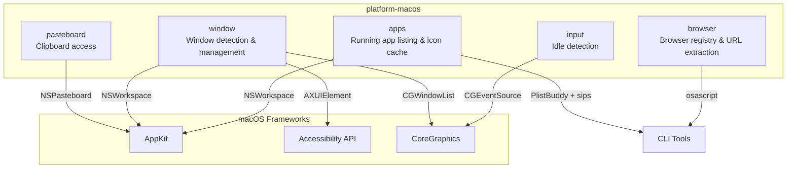

# Layer 0: `platform-macos` Crate

## Overview

The `platform-macos` crate provides native macOS API bindings for window management, clipboard access, application listing, browser detection, input idle detection, and application icon extraction. All public functions have cross-platform no-op stubs (returning `None`, `false`, `0.0`, or empty collections) so the crate compiles on all platforms.

**Crate path:** `crates/platform-macos/`

### Dependencies

| Dependency | Platform | Purpose |
|---|---|---|
| `tracing` | All | Structured logging |
| `base64` | All | Icon data URI encoding |
| `objc2` | macOS | Objective-C runtime bindings |
| `objc2-app-kit` | macOS | NSWorkspace, NSRunningApplication, NSPasteboard |
| `objc2-foundation` | macOS | NSString, NSArray |
| `core-graphics` | macOS | CGWindowListCopyWindowInfo, CGDisplay, CGEvent |
| `core-foundation` | macOS | CFString, CFNumber, CFArray, CFDictionary |

---

## Modules

### `pasteboard` -- Clipboard Access

| Function | Signature | Description |
|---|---|---|
| `pasteboard_change_count()` | `-> i64` | Current change count of the general pasteboard. Increments on each clipboard change; useful for change detection without polling content. |
| `read_pasteboard_string()` | `-> Option<String>` | Read the current string content from the general pasteboard. |

**macOS API:** `NSPasteboard.generalPasteboard()`, `stringForType(NSPasteboardTypeString)`.

### `window` -- Window Detection and Management

#### Types

```rust
pub struct WindowInfo {
    pub app_name: String,
    pub bundle_id: Option<String>,
    pub window_title: Option<String>,
    pub pid: i32,
}
```

#### Functions

| Function | Signature | Description |
|---|---|---|
| `get_frontmost_window()` | `-> Option<WindowInfo>` | Get the currently focused window's app name, bundle ID, window title, and PID. |
| `get_frontmost_app_name()` | `-> Option<String>` | Lightweight variant -- returns only the app name without AX/CG title lookups. |
| `get_screen_frame()` | `-> (f64, f64, f64, f64)` | Main display frame as `(x, y, width, height)`. |
| `set_window_frame(pid, x, y, w, h)` | `-> bool` | Move and resize the focused window of an application. Returns `true` on success. |

**Window title resolution strategy:**

1. **Accessibility API** (`AXUIElement`) -- preferred; permission persists across recompiles.
2. **CoreGraphics** (`CGWindowListCopyWindowInfo`) -- fallback; Screen Recording permission resets on unsigned binaries.

**macOS APIs used:**
- `NSWorkspace.sharedWorkspace().frontmostApplication()`
- `AXUIElementCreateApplication`, `AXUIElementCopyAttributeValue`, `AXUIElementSetAttributeValue`
- `CGWindowListCopyWindowInfo`, `CGDisplay.main().bounds()`
- `AXValueCreate` for CGPoint/CGSize position/size values

### `apps` -- Running Application Listing and Icon Caching

#### Types

```rust
pub struct RunningApp {
    pub name: String,
    pub bundle_id: Option<String>,
    pub pid: i32,
    pub path: Option<PathBuf>,
}
```

```rust
pub struct AppIconCache {
    cache_dir: PathBuf,
}
```

#### Functions

| Function | Signature | Description |
|---|---|---|
| `running_applications()` | `-> Vec<RunningApp>` | List all regular (non-background) running applications visible in the Dock. |

#### `AppIconCache` Methods

| Method | Description |
|---|---|
| `new(cache_dir: PathBuf) -> Self` | Create a new disk-backed icon cache. Creates the directory if needed. |
| `resolve_icon(&self, app_path: &Path, tmp_dir: &Path) -> (Option<String>, bool)` | Resolve an app icon as a base64 PNG data URI. Returns `(data_uri, was_cache_hit)`. |

**Icon resolution pipeline:**
1. Check disk cache: `{cache_dir}/{stem}.png` + `{stem}.mtime` (invalidated if app mtime changes)
2. On cache miss: read `CFBundleIconFile` from `Info.plist` via `/usr/libexec/PlistBuddy`
3. Convert `.icns` to 32px PNG via `sips`
4. Encode as base64 data URI, write to disk cache

**Important:** `resolve_icon` and the internal `extract_icon` use blocking `std::process::Command`. Callers in async contexts must use `tokio::task::spawn_blocking`.

### `browser` -- Browser Registry and Utilities

#### Types

```rust
pub struct BrowserDef {
    pub name: &'static str,
    pub bundle_prefix: &'static str,
    pub profile_dir: Option<&'static str>,
    pub title_suffix: &'static str,
}
```

#### Constants

`BROWSERS: &[BrowserDef]` -- registry of 11 known browsers:

| Browser | Bundle Prefix | Chromium Profile Dir | Title Suffix |
|---|---|---|---|
| Google Chrome | `com.google.chrome` | `Google/Chrome/Default` | ` - Google Chrome` |
| Arc | `company.thebrowser.browser` | `Arc/User Data/Default` | ` - Arc` |
| Brave Browser | `com.brave.browser` | `BraveSoftware/Brave-Browser/Default` | ` - Brave` |
| Microsoft Edge | `com.microsoft.edgemac` | `Microsoft Edge/Default` | ` - Microsoft Edge` |
| Safari | `com.apple.safari` | (none) | ` - Safari` |
| Firefox | `org.mozilla.firefox` | (none) | ` - Mozilla Firefox` |
| Vivaldi | `com.vivaldi.vivaldi` | (none) | ` - Vivaldi` |
| Opera | `com.operasoftware.opera` | (none) | ` - Opera` |
| Chromium | -- | (none) | ` - Chromium` |
| Orion | -- | (none) | ` - Orion` |
| Zen Browser | -- | (none) | ` - Zen` |

#### Functions

| Function | Signature | Description |
|---|---|---|
| `is_browser(app_name, bundle_id)` | `-> bool` | Check if an app is a known browser by name or bundle ID. Case-insensitive. |
| `chromium_profile_dir(browser_name)` | `-> Option<PathBuf>` | Resolve a Chromium browser's profile directory under `~/Library/Application Support/`. Accepts short keys like `"chrome"` or full names. |
| `extract_site_name(window_title)` | `-> Option<String>` | Strip the browser suffix from a window title to extract the site name (e.g., `"GitHub - Google Chrome"` becomes `"GitHub"`). |
| `get_browser_url(app_name, bundle_id)` | `-> Option<String>` | Get the active tab URL via AppleScript. Works for Chrome-family and Safari. **Blocking** -- use `spawn_blocking` in async. |

**Security:** `get_browser_url` sanitizes `app_name` before embedding in AppleScript to prevent injection.

### `input` -- Idle Detection

| Function | Signature | Description |
|---|---|---|
| `seconds_since_last_input()` | `-> f64` | Seconds since the last mouse/keyboard input event. Uses `CGEventSourceSecondsSinceLastEventType`. |

---

## Cross-Platform Stubs

Every public function has a `#[cfg(not(target_os = "macos"))]` stub that returns a sensible default:

| Function | Non-macOS Return |
|---|---|
| `pasteboard_change_count()` | `0` |
| `read_pasteboard_string()` | `None` |
| `get_frontmost_window()` | `None` |
| `get_frontmost_app_name()` | `None` |
| `get_screen_frame()` | `(0.0, 0.0, 0.0, 0.0)` |
| `set_window_frame(...)` | `false` |
| `running_applications()` | `Vec::new()` |
| `AppIconCache::resolve_icon(...)` | `(None, false)` |
| `get_browser_url(...)` | `None` |
| `seconds_since_last_input()` | `0.0` |

---

## Mermaid Module Diagram


