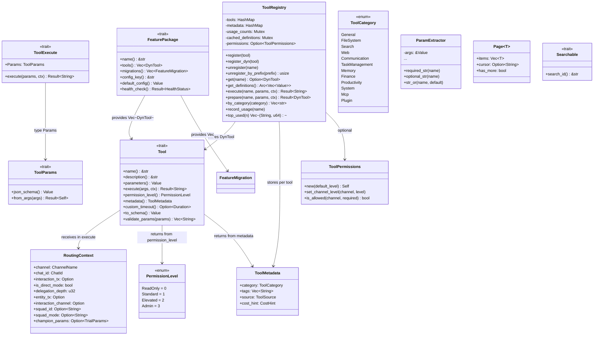
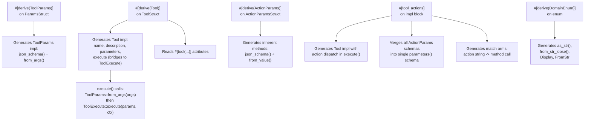

# Layer 0: `tools-core` and `tools-core-macros` Crates

## Overview

The `tools-core` crate provides the tool framework that all klyntbot feature packages build on. It defines the `Tool` trait, `FeaturePackage` trait, `ToolRegistry`, `RoutingContext`, parameter extraction helpers, search utilities, and permission model. The companion `tools-core-macros` crate provides proc macros (`#[derive(Tool)]`, `#[derive(ToolParams)]`, `#[derive(ActionParams)]`, `#[tool_actions]`, `#[derive(DomainEnum)]`) that eliminate boilerplate when implementing tools.

**Crate paths:** `crates/tools-core/`, `crates/tools-core-macros/`

### `tools-core` Dependencies

| Dependency | Purpose |
|---|---|
| `common` | Error types, domain types |
| `tools-core-macros` | Proc macros (re-exported) |
| `async-trait` | Async trait support |
| `regex` | JSON Schema pattern validation (cached) |
| `serde_json` | JSON value manipulation |
| `serde` | Serialization |
| `tokio` | Async channels (mpsc, oneshot) |
| `tracing` | Structured logging |

### `tools-core-macros` Dependencies

| Dependency | Purpose |
|---|---|
| `syn` | Rust syntax parsing |
| `quote` | Code generation |
| `proc-macro2` | Token stream manipulation |

---

## Core Traits

### `Tool` Trait

The primary interface for all agent tools. Every tool in the system implements this trait, either manually or via derive macros.

```rust
#[async_trait]
pub trait Tool: Send + Sync {
    fn name(&self) -> &str;
    fn description(&self) -> &str;
    fn parameters(&self) -> Value;
    async fn execute(&self, args: Value, ctx: &RoutingContext) -> Result<String>;

    // Optional overrides with defaults:
    fn permission_level(&self) -> PermissionLevel { PermissionLevel::Standard }
    fn metadata(&self) -> ToolMetadata { ToolMetadata::default() }
    fn custom_timeout(&self) -> Option<Duration> { None }
    fn to_schema(&self) -> Value { /* OpenAI function-calling format */ }
    fn validate_params(&self, params: &Value) -> Vec<String> { /* JSON Schema validation */ }
}
```

| Method | Description |
|---|---|
| `name()` | Machine-readable tool name used in function calls |
| `description()` | Human-readable description for LLM tool selection |
| `parameters()` | JSON Schema describing accepted parameters |
| `execute(args, ctx)` | Execute the tool with JSON arguments and routing context |
| `permission_level()` | Required permission level (default: `Standard`) |
| `metadata()` | Rich metadata for discovery (category, tags, cost) |
| `custom_timeout()` | Per-tool timeout override (used by MCP tools) |
| `to_schema()` | Convert to OpenAI `{"type":"function","function":{...}}` format |
| `validate_params(params)` | Validate params against JSON Schema; returns error messages |

**Type alias:** `pub type DynTool = Arc<dyn Tool>;`

### `ToolParams` Trait

Typed parameter parsing and schema generation. Implemented via `#[derive(ToolParams)]`.

```rust
pub trait ToolParams: Sized {
    fn json_schema() -> Value;
    fn from_args(args: Value) -> common::Result<Self>;
}
```

### `ToolExecute` Trait

Typed tool execution bridge. When combined with `#[derive(Tool)]`, the macro generates the untyped `Tool` implementation that deserializes JSON args into the typed `Params` and delegates to this trait.

```rust
#[async_trait]
pub trait ToolExecute: Send + Sync {
    type Params: ToolParams;
    async fn execute(&self, params: Self::Params, ctx: &RoutingContext) -> common::Result<String>;
}
```

### `FeaturePackage` Trait

Trait for self-contained feature crates that bundle tools, migrations, and config.

```rust
#[async_trait]
pub trait FeaturePackage: Send + Sync {
    fn name(&self) -> &str;
    fn tools(&self) -> Vec<DynTool>;
    fn migrations(&self) -> Vec<FeatureMigration>;
    fn config_key(&self) -> &str;
    fn default_config(&self) -> Value;
    async fn health_check(&self) -> Result<HealthStatus> { Ok(HealthStatus::Healthy) }
}
```

### Supporting Types for `FeaturePackage`

```rust
pub struct FeatureMigration {
    pub feature_name: String,
    pub version: i64,
    pub description: String,
    pub sql: String,
}

pub enum HealthStatus {
    Healthy,
    Degraded(String),
    Unhealthy(String),
}
```

### Port Traits

#### `ProgressHandler`

```rust
#[async_trait]
pub trait ProgressHandler: Send + Sync {
    async fn recalculate_kr_progress(&self, key_result_id: &str) -> Result<()>;
}
```

Defined at Layer 1 for tools that cascade OKR progress. Implemented in the `agent` crate (Layer 5).

#### `InteractionChannel`

```rust
#[async_trait]
pub trait InteractionChannel: Send + Sync {
    fn supports_interaction(&self) -> bool;
    async fn send_interaction(&self, chat_id: &str, request: &InteractionRequest) -> Result<FormResponse>;
}
```

For channels supporting native structured interactions (Telegram inline keyboards, Discord buttons, Slack Block Kit).

#### `ConfigPersistence`

```rust
#[async_trait]
pub trait ConfigPersistence: Send + Sync {
    async fn load_section(&self, key: &str) -> Result<Value>;
    async fn save_section(&self, key: &str, value: Value) -> Result<()>;
}
```

Runtime config read/write without depending on the config crate.

---

## `RoutingContext`

Carries channel/chat identity and optional interaction channels through every tool execution.

```rust
#[derive(Clone)]
pub struct RoutingContext {
    pub channel: ChannelName,
    pub chat_id: ChatId,
    pub interaction_tx: Option<mpsc::Sender<InteractionBundle>>,
    pub is_direct_mode: bool,
    pub delegation_depth: u32,
    pub entity_tx: Option<mpsc::Sender<EntityCard>>,
    pub interaction_channel: Option<Arc<dyn InteractionChannel>>,
    pub squad_id: Option<String>,
    pub squad_mode: Option<String>,
    pub champion_params: Option<common::TrialParams>,
}
```

| Field | Description |
|---|---|
| `channel` | Platform channel name |
| `chat_id` | Chat/conversation identifier |
| `interaction_tx` | Channel for `ask_user` tool to send structured interaction requests (CLI only) |
| `is_direct_mode` | When true, responses go via event stream rather than message bus |
| `delegation_depth` | Tracks nested delegation depth (0 = top-level) |
| `entity_tx` | Channel for tools to emit `EntityCard` events |
| `interaction_channel` | Platform-native interaction channel (for buttons/menus) |
| `squad_id` | Optional squad context for multi-persona responses |
| `squad_mode` | Squad mode: `"quick"` or `"debate"` |
| `champion_params` | Autotuner champion parameter overrides (None = use Config defaults) |

**Constructors:**
- `RoutingContext::new(channel, chat_id)` -- non-interactive mode
- `RoutingContext::with_interaction(channel, chat_id, interaction_tx)` -- interactive direct mode
- `RoutingContext::with_squad(channel, chat_id, squad_id)` -- squad context

---

## `ToolRegistry`

Central registry for dynamic tool management.

```rust
pub struct ToolRegistry {
    tools: HashMap<String, DynTool>,
    metadata: HashMap<String, ToolMetadata>,
    usage_counts: Mutex<HashMap<String, u64>>,
    cached_definitions: Mutex<Option<Arc<Vec<Value>>>>,
    permissions: Option<ToolPermissions>,
}
```

### Methods

| Method | Description |
|---|---|
| `new() -> Self` | Create empty registry |
| `set_permissions(perms)` | Set per-channel permission configuration |
| `register(tool)` | Register a tool (takes ownership, wraps in Arc) |
| `register_dyn(tool: DynTool)` | Register a pre-wrapped dynamic tool |
| `unregister(name)` | Remove a tool by name |
| `unregister_by_prefix(prefix) -> usize` | Remove all tools with name prefix; returns count removed |
| `get(name) -> Option<DynTool>` | Look up a tool |
| `has(name) -> bool` | Check if tool exists |
| `get_definitions() -> Arc<Vec<Value>>` | Get all tool schemas in OpenAI format (cached; interior mutability) |
| `execute(name, params, ctx) -> Result<String>` | Look up, validate, and execute a tool |
| `prepare(name, params, ctx) -> Result<DynTool>` | Look up + validate without executing (prevents deadlocks during delegation) |
| `get_metadata(name) -> Option<&ToolMetadata>` | Get rich metadata for a tool |
| `by_category(category) -> Vec<&str>` | Get tool names in a category |
| `record_usage(name)` | Increment usage counter (interior mutability) |
| `top_used(n) -> Vec<(String, u64)>` | Top N most-used tools |
| `tool_names() -> Vec<String>` | All registered tool names |
| `len() -> usize` | Number of registered tools |
| `is_empty() -> bool` | Whether registry is empty |

The definition cache is invalidated on register/unregister. The `prepare` method clones the `DynTool` (Arc increment) so callers can drop the registry borrow before calling `tool.execute()`.

---

## Metadata Types

### `ToolCategory`

```rust
pub enum ToolCategory {
    General, FileSystem, Search, Web, Communication,
    TaskManagement, Memory, Finance, Productivity,
    System, Mcp, Plugin,
}
```

### `ToolSource`

```rust
pub enum ToolSource {
    Native,
    Feature(String),
    Mcp(String),
    Plugin(String),
    External,
}
```

### `CostHint`

```rust
pub enum CostHint { Free, Low, Medium, High, Variable }
```

### `ToolMetadata`

```rust
pub struct ToolMetadata {
    pub category: ToolCategory,
    pub tags: Vec<String>,
    pub source: ToolSource,
    pub cost_hint: CostHint,
}
```

---

## Permission Model

### `PermissionLevel`

Ordered permission levels (comparisons use `>=`):

| Level | Value | Examples |
|---|---|---|
| `ReadOnly` | 0 | `read_file`, `list_dir`, `web_search` |
| `Standard` | 1 | `tasks`, `project`, `memory` |
| `Elevated` | 2 | `exec`, `write_file`, `edit_file` |
| `Admin` | 3 | `spawn` |

### `ToolPermissions`

Per-channel permission configuration:

```rust
pub struct ToolPermissions {
    channel_levels: HashMap<String, PermissionLevel>,
    default_level: PermissionLevel,
}
```

| Method | Description |
|---|---|
| `new(default_level)` | Create with default level for unconfigured channels |
| `set_channel_level(channel, level)` | Set level for a specific channel |
| `is_allowed(channel, required) -> bool` | Check if channel has sufficient permission |

---

## Pagination

```rust
pub struct Page<T> {
    pub items: Vec<T>,
    pub cursor: Option<String>,
    pub has_more: bool,
}
```

Constructors: `new(items, cursor, has_more)`, `empty()`, `single_page(items)`.

---

## Search Utilities

### `Searchable` Trait

```rust
pub trait Searchable {
    fn search_id(&self) -> &str;
}
```

### Reciprocal Rank Fusion (RRF)

Two merge functions for combining ranked lists from multiple search signals:

| Function | Signals | Description |
|---|---|---|
| `rrf_merge(keyword, semantic, k, items_by_id)` | 2 | Merge keyword + semantic results |
| `rrf_merge_triple(keyword, semantic, bm25, k, items_by_id)` | 3 | Merge keyword + semantic + BM25 results |

**RRF formula:** `score(d) = sum(1 / (k + rank_i + 1))` for each list containing `d`.

Returns `Vec<(T, f64, &'static str)>` with item, RRF score, and source label (`"keyword"`, `"semantic"`, `"both"`, `"bm25"`, `"all"`, etc.).

---

## `ParamExtractor`

Zero-cost helper for extracting typed values from `serde_json::Value` arguments.

```rust
pub struct ParamExtractor<'a> { args: &'a Value }
```

### Required Extractors (return `Err` if missing or wrong type)

| Method | Return Type |
|---|---|
| `required_str(name)` | `Result<&str>` |
| `required_i64(name)` | `Result<i64>` |
| `required_u64(name)` | `Result<u64>` |
| `required_bool(name)` | `Result<bool>` |
| `required_array(name)` | `Result<&Vec<Value>>` |
| `required_object(name)` | `Result<&Map<String, Value>>` |

### Optional Extractors (return `Ok(None)` if absent, `Err` if wrong type)

| Method | Return Type |
|---|---|
| `optional_str(name)` | `Result<Option<&str>>` |
| `optional_i64(name)` | `Result<Option<i64>>` |
| `optional_u64(name)` | `Result<Option<u64>>` |
| `optional_f64(name)` | `Result<Option<f64>>` |
| `optional_bool(name)` | `Result<Option<bool>>` |
| `optional_array(name)` | `Result<Option<&Vec<Value>>>` |

### Default-Value Extractors

| Method | Return Type |
|---|---|
| `str_or(name, default)` | `Result<&str>` |
| `i64_or(name, default)` | `Result<i64>` |
| `string_array_or_empty(name)` | `Result<Vec<String>>` |

---

## JSON Schema Validation

The `validation` module (internal) validates `serde_json::Value` against JSON Schema, supporting:

- Type checking: `string`, `integer`, `number`, `boolean`, `array`, `object`
- String constraints: `minLength`, `maxLength`, `pattern` (regex, cached globally)
- Numeric constraints: `minimum`, `maximum`
- Array constraints: `minItems`, `maxItems`, `items` (recursive)
- Object constraints: `required`, `properties` (recursive), `additionalProperties: false`
- Composition: `enum`, `oneOf`, `anyOf`

---

## Derive Macros (`tools-core-macros`)

### `#[derive(Tool)]`

Generates a full `Tool` trait implementation from metadata attributes and a `ToolExecute` impl.

**Required attributes:**
```rust
#[derive(Tool)]
#[tool(
    name = "read_file",
    description = "Read the contents of a file",
    params = "ReadFileParams"
)]
struct ReadFileTool { /* ... */ }
```

**Optional attributes:**
- `permission = "elevated"` -- maps to `PermissionLevel` (values: `read_only`, `standard`, `elevated`, `admin`)
- `category = "FileSystem"` -- maps to `ToolCategory`
- `tags = "file,read,content"` -- comma-separated tags
- `cost = "Free"` -- maps to `CostHint` (values: `Free`, `Low`, `Medium`, `High`, `Variable`)

**Generated code:** Implements `Tool` with `name()`, `description()`, `parameters()` (delegated to `ToolParams::json_schema()`), `execute()` (deserializes via `ToolParams::from_args()` then delegates to `ToolExecute::execute()`), and optionally `permission_level()` and `metadata()`.

**Requires:** The struct must implement `ToolExecute<Params = ParamsType>`.

### `#[derive(ToolParams)]`

Generates `ToolParams` trait implementation for a struct.

```rust
#[derive(ToolParams)]
struct ReadFileParams {
    /// The file path to read
    #[param(required)]
    path: String,

    /// Maximum number of lines
    #[param(min = 1, max = 10000)]
    max_lines: Option<i64>,
}
```

**Field attributes (`#[param(...)]`):**
- `required` -- adds to JSON Schema `required` array; generated extraction returns error if missing
- `min = N` -- adds `minimum` to JSON Schema
- `max = N` -- adds `maximum` to JSON Schema
- `min_length = N` -- adds `minLength` to JSON Schema
- `max_length = N` -- adds `maxLength` to JSON Schema

**Supported Rust types:** `String`, `bool`, integer primitives (`i8`..`i64`, `u8`..`u64`), `f32`, `f64`, `Vec<T>`, `Option<T>` where `T` is a supported type.

**Doc comments** on fields become the `description` in the JSON Schema.

**Generated code:** `json_schema()` returns a JSON Schema object; `from_args(Value)` parses a `serde_json::Value` into the struct.

Unit structs are supported and generate an empty schema with no required fields.

### `#[derive(ActionParams)]`

Like `ToolParams` but generates inherent methods instead of a trait impl:
- `fn json_schema() -> Value` (inherent)
- `fn from_value(args: &Value) -> Result<Self, String>` (inherent)

Used for per-action parameter structs in multi-action tools.

### `#[tool_actions]`

Attribute macro for multi-action tools. Generates `Tool` implementation with automatic action dispatch.

```rust
#[tool_actions(
    name = "tasks",
    description = "Manage tasks and to-dos",
    category = "TaskManagement",
    tags = "task,todo,project",
    cost = "Free"
)]
impl TaskTool {
    #[action(name = "create")]
    async fn create(&self, params: CreateTaskParams, ctx: &RoutingContext) -> Result<String> { /* ... */ }

    #[action(name = "list")]
    async fn list(&self, params: ListTaskParams, ctx: &RoutingContext) -> Result<String> { /* ... */ }

    #[action(name = "update")]
    async fn update(&self, params: UpdateTaskParams, ctx: &RoutingContext) -> Result<String> { /* ... */ }
}
```

**Generated schema:** Merges all action param schemas into a single `parameters()` schema with an `action` enum field listing all action names. Shared parameter names across actions use the first definition (warns on type conflicts at runtime).

**Generated dispatch:** `execute()` reads the `"action"` field from the JSON args and dispatches to the corresponding method. Unknown actions return `ToolError::InvalidParams`.

**Action method signature:** `async fn method_name(&self, params: ParamsType, ctx: &RoutingContext) -> Result<String>`

### `#[derive(DomainEnum)]`

Generates `as_str()`, `from_str_loose()`, `Display`, and `FromStr` for unit enums.

```rust
#[derive(DomainEnum)]
enum Priority {
    #[aliases("p1", "critical")]
    High,
    #[aliases("p2")]
    Medium,
    #[aliases("p3")]
    Low,
    #[canonical("none")]
    NoPriority,
}
```

**Attributes:**
- `#[aliases("alt1", "alt2")]` -- additional lowercase strings that map to this variant
- `#[canonical("custom")]` -- override the canonical string (default: PascalCase converted to snake_case)

**Generated code:**
- `as_str() -> &'static str` -- returns the canonical string
- `from_str_loose(s: &str) -> Option<Self>` -- case-insensitive matching of canonical name + aliases
- `Display` -- delegates to `as_str()`
- `FromStr` -- delegates to `from_str_loose()`, returns error for unknown values

---

## Complete Usage Example

```rust
use tools_core::{Tool, ToolParams, ToolExecute, RoutingContext};

// 1. Define params with ToolParams derive
#[derive(ToolParams)]
struct GreetParams {
    /// The name to greet
    #[param(required)]
    name: String,

    /// Optional greeting style
    style: Option<String>,
}

// 2. Define tool struct with Tool derive
#[derive(Tool)]
#[tool(
    name = "greet",
    description = "Generate a greeting",
    params = "GreetParams",
    category = "General",
    tags = "greeting,hello",
    cost = "Free"
)]
struct GreetTool;

// 3. Implement ToolExecute for business logic
#[async_trait::async_trait]
impl ToolExecute for GreetTool {
    type Params = GreetParams;

    async fn execute(&self, params: GreetParams, _ctx: &RoutingContext) -> common::Result<String> {
        let style = params.style.as_deref().unwrap_or("casual");
        match style {
            "formal" => Ok(format!("Good day, {}.", params.name)),
            _ => Ok(format!("Hey {}!", params.name)),
        }
    }
}
```

For multi-action tools:

```rust
use tools_core::{tool_actions, ActionParams, RoutingContext};

#[derive(ActionParams)]
struct CreateParams {
    /// Item title
    #[param(required)]
    title: String,
}

#[derive(ActionParams)]
struct ListParams {
    /// Maximum items to return
    limit: Option<i64>,
}

struct ItemTool;

#[tool_actions(name = "items", description = "Manage items")]
impl ItemTool {
    #[action(name = "create")]
    async fn create(&self, params: CreateParams, ctx: &RoutingContext) -> common::Result<String> {
        Ok(format!("Created: {}", params.title))
    }

    #[action(name = "list")]
    async fn list(&self, params: ListParams, ctx: &RoutingContext) -> common::Result<String> {
        Ok("Items: ...".to_string())
    }
}
```

---

## Mermaid Class Diagram



---

## Macro Generation Flow


