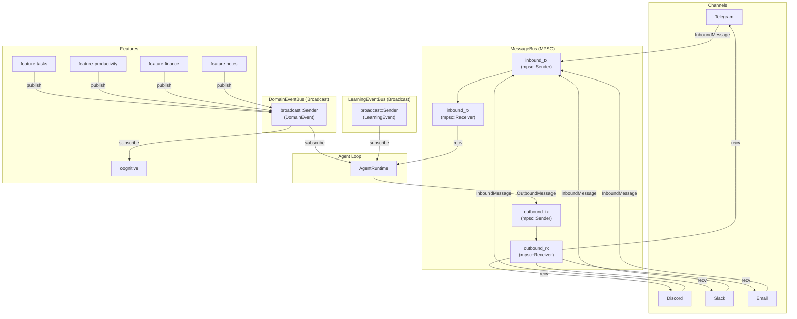
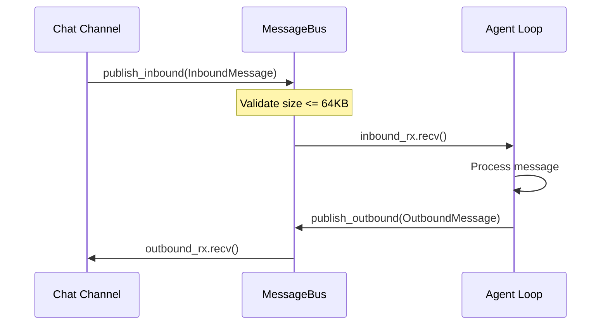
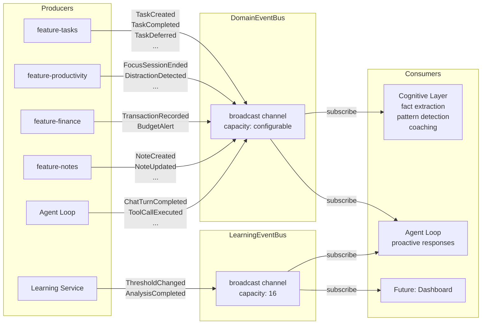

# Layer 1: Bus Crate

> `crates/bus/` -- Async message bus for channel-to-agent communication and cross-feature domain events.

## Overview

The `bus` crate provides three independent messaging systems for inter-component communication:

1. **MessageBus** -- Point-to-point async MPSC queue connecting chat channels to the agent loop (inbound messages from users, outbound responses back to channels).
2. **DomainEventBus** -- Broadcast channel for cross-feature domain events. Feature crates publish events (task created, focus ended, etc.) without knowing about consumers. The cognitive layer subscribes to all events for fact extraction and pattern detection.
3. **LearningEventBus** -- Broadcast channel for learning system events (threshold changes, analysis completions).

### Dependencies

| Dependency | Purpose |
|---|---|
| `common` | `ChannelName`, `ChatId`, `SessionKey`, `KlyntbotError`, `Result` |
| `tokio` | `mpsc` and `broadcast` channels, async runtime |
| `serde`, `serde_json` | Serialization for event types and message metadata |
| `tracing` | Debug/warning logs |
| `chrono` | `DateTime<Utc>` timestamps on messages |

## Architecture



## MessageBus

The primary message queue for channel-to-agent communication. Uses `tokio::sync::mpsc` for ordered, single-consumer delivery.

### Struct: `MessageBus`

```rust
pub struct MessageBus {
    inbound_tx: mpsc::Sender<InboundMessage>,
    inbound_rx: Mutex<Option<mpsc::Receiver<InboundMessage>>>,
    outbound_tx: mpsc::Sender<OutboundMessage>,
    outbound_rx: Mutex<Option<mpsc::Receiver<OutboundMessage>>>,
}
```

The receivers are wrapped in `Mutex<Option<...>>` because they can only be taken once. The bus itself is typically wrapped in `Arc<MessageBus>` and shared between the channel adapters and the agent loop.

### Methods

| Method | Signature | Description |
|---|---|---|
| `new(buffer_size)` | `fn new(usize) -> Self` | Create bus with specified MPSC buffer capacity |
| `publish_inbound(msg)` | `async fn(&self, InboundMessage) -> Result<()>` | Validate and send an inbound message. Rejects messages > 64 KB. |
| `publish_outbound(msg)` | `async fn(&self, OutboundMessage) -> Result<()>` | Send an outbound message |
| `take_inbound_rx()` | `fn(&self) -> Option<Receiver<InboundMessage>>` | Take ownership of inbound receiver (one-time) |
| `take_outbound_rx()` | `fn(&self) -> Option<Receiver<OutboundMessage>>` | Take ownership of outbound receiver (one-time) |
| `inbound_sender()` | `fn(&self) -> Sender<InboundMessage>` | Clone the inbound sender (for additional producers) |
| `outbound_sender()` | `fn(&self) -> Sender<OutboundMessage>` | Clone the outbound sender |

### Message Flow



### Properties

- **Ordered delivery** -- messages from a single producer arrive in FIFO order.
- **Single consumer** -- each receiver can only be taken once via `take_*_rx()`.
- **Multiple producers** -- senders are cloneable via `inbound_sender()` / `outbound_sender()`.
- **Backpressure** -- bounded buffer; `publish_*` awaits when buffer is full.
- **Validation** -- `publish_inbound()` rejects messages exceeding `MAX_MESSAGE_SIZE` (64 KB) with a `KlyntbotError::Bus` error.

## Event Types

### InboundMessage

Represents a message received from any chat channel.

```rust
pub struct InboundMessage {
    pub channel: ChannelName,                          // e.g., "telegram", "discord"
    pub sender_id: String,                             // User identifier
    pub chat_id: ChatId,                               // Chat/channel identifier
    pub content: String,                               // Message text
    pub timestamp: DateTime<Utc>,                      // Defaults to Utc::now()
    pub media: Vec<String>,                            // Media URLs
    pub metadata: HashMap<String, serde_json::Value>,  // Channel-specific metadata
    pub kind: MessageKind,                             // Text or Reaction
}
```

| Method | Returns | Description |
|---|---|---|
| `new(channel, sender_id, chat_id, content)` | `InboundMessage` | Constructor with defaults |
| `with_kind(kind)` | `Self` | Builder: set message kind |
| `session_key()` | `SessionKey` | Composite key `"channel:chat_id"` |
| `validate()` | `Result<(), String>` | Check content size <= 64 KB |

### OutboundMessage

Represents a message to send to a chat channel.

```rust
pub struct OutboundMessage {
    pub channel: ChannelName,
    pub chat_id: ChatId,
    pub content: String,
    pub reply_to: Option<String>,                      // Message ID to reply to
    pub media: Vec<String>,                            // Media URLs to send
    pub metadata: HashMap<String, serde_json::Value>,
}
```

| Method | Returns | Description |
|---|---|---|
| `new(channel, chat_id, content)` | `OutboundMessage` | Constructor |
| `with_reply_to(message_id)` | `Self` | Builder: set reply target |
| `with_media(url)` | `Self` | Builder: append media URL |

### MessageKind

```rust
pub enum MessageKind {
    Text,      // Default -- normal text message
    Reaction,  // Emoji reaction on a previous message
}
```

### Constant

`MAX_MESSAGE_SIZE: usize = 65536` -- maximum allowed content size in bytes.

## DomainEventBus

Broadcast bus for cross-feature domain events. Uses `tokio::sync::broadcast` so multiple subscribers each receive every event independently.

### Struct: `DomainEventBus`

```rust
pub struct DomainEventBus {
    tx: broadcast::Sender<DomainEvent>,
}
```

| Method | Signature | Description |
|---|---|---|
| `new(capacity)` | `fn new(usize) -> Self` | Create bus with broadcast channel capacity |
| `publish(event)` | `fn(&self, DomainEvent)` | Send event to all subscribers. Logs warning if no receivers. |
| `subscribe()` | `fn(&self) -> Receiver<DomainEvent>` | Get independent event receiver |
| `subscriber_count()` | `fn(&self) -> usize` | Number of active subscribers |

### Properties

- **Multi-consumer** -- each `subscribe()` call creates an independent receiver that gets every event.
- **Non-blocking publish** -- `publish()` does not await; events are dropped with a warning if no subscribers exist.
- **Shared via `Arc`** -- the inner `broadcast::Sender` is reference-counted, so `Arc<DomainEventBus>` is the intended sharing pattern.

### DomainEvent Enum

All cross-feature events in a single enum. Organized by domain:

#### Productivity Events

| Variant | Fields | Description |
|---|---|---|
| `ActivitySessionCompleted` | `date: String, total_active_secs: i64, productive_secs: i64, distracting_secs: i64` | Daily activity summary |
| `FocusSessionStarted` | `session_type: String, target_mins: i64` | Focus session began |
| `FocusSessionEnded` | `duration_secs: i64, quality: f64, interruptions: i32` | Focus session ended |
| `DistractionDetected` | `app: String, duration_secs: Option<i64>, context: String` | Distraction detected |
| `ProductivityScoreComputed` | `date: String, score: f64` | Daily productivity score |

#### Productivity Intelligence Layer Events

| Variant | Fields | Description |
|---|---|---|
| `SessionCreated` | `session_id, session_type, dominant_category, predicted_energy` | Intelligence session started |
| `SessionEnded` | `session_id, session_type, duration_secs, quality_score, category_purity` | Intelligence session ended |
| `QualityScored` | `score_date, session_id, overall_score, components` | Quality scoring completed |
| `PredictiveAlert` | `forecast_type, window_start, window_end, predicted_value, suggested_action` | Forecast alert |
| `NarrativeGenerated` | `date, sentiment, excerpt` | Daily narrative generated |
| `RuleEvolved` | `rule_id, action, category, confidence, source` | Classification rule evolved |
| `VoiceJournalProcessed` | `journal_id, extracted_fact_count, sentiment` | Voice journal processed |

#### Task Events

| Variant | Fields | Description |
|---|---|---|
| `TaskCreated` | `task_id, project, estimate_mins, task_type` | Task created |
| `TaskCompleted` | `task_id, actual_duration_mins, estimated_duration_mins, deviation_pct` | Task completed |
| `TaskDeferred` | `task_id, times_deferred` | Task postponed |
| `TaskDecomposed` | `source_task_id, subtask_ids, total_estimated_mins` | Task broken into subtasks |
| `TaskExecutionStarted` | `task_id, execution_id, agent_profile` | Agent execution began |
| `TaskExecutionCompleted` | `task_id, execution_id, tokens_used, cost_usd, artifacts_count` | Agent execution completed |
| `TaskExecutionFailed` | `task_id, execution_id, error, retry_count` | Agent execution failed |
| `TaskExecutionProgress` | `task_id, execution_id, current_step, percentage, latest_tool, reasoning_snippet, cost_so_far_usd, elapsed_secs` | Execution progress update |
| `TaskBlocked` | `task_id, blocker_id` | Task blocked by another |
| `TaskUnblocked` | `task_id, was_blocked_by` | Blocker resolved |
| `TaskStatusChanged` | `task_id, from, to, actor` | Status transition |
| `TaskPriorityChanged` | `task_id, from, to, actor` | Priority change |
| `TaskFieldUpdated` | `task_id, field, from, to, actor` | Generic field update |
| `DayPlanGenerated` | `task_count, total_estimated_mins` | Daily plan created |
| `ProactiveSuggestionCreated` | `suggestion_id, suggestion_type, task_id, confidence` | AI suggestion |
| `TaskFocusStarted` | `task_id, energy_level` | Focus session on task |
| `TaskFocusEnded` | `task_id, duration_secs` | Focus on task ended |
| `EstimationRecorded` | `task_id, estimated_mins, actual_mins, deviation_pct` | Estimation calibration data |
| `GoalProgress` | `objective_id, progress, target` | OKR progress update |

#### Finance Events

| Variant | Fields | Description |
|---|---|---|
| `TransactionRecorded` | `category: String, amount: f64, is_over_budget: bool` | Transaction logged |
| `BudgetAlert` | `category: String, spent: f64, limit: f64` | Budget threshold reached |

#### Notes Events

| Variant | Fields | Description |
|---|---|---|
| `NoteCreated` | `note_id, title` | Note created |
| `NoteUpdated` | `note_id, title` | Note metadata updated |
| `NoteContentChanged` | `note_id, content` | Note body changed |
| `NoteDeleted` | `note_id` | Note deleted |

#### Hierarchy Events

| Variant | Fields | Description |
|---|---|---|
| `TaskHierarchyChanged` | `project_id: String` | Project task tree changed (triggers BookIndex rebuild) |

#### Chat Events

| Variant | Fields | Description |
|---|---|---|
| `ChatTurnCompleted` | `user_message: String, session_key: String` | User-agent exchange completed |

#### Tool Events

| Variant | Fields | Description |
|---|---|---|
| `ToolCallExecuted` | `tool_name, args_preview, session_key, duration_ms` | Tool invocation recorded |

#### Cross-Domain Events

| Variant | Fields | Description |
|---|---|---|
| `UserStatedFact` | `fact: String, domain: String` | User stated a personal fact |
| `UserCorrectedAI` | `original: String, correction: String` | User corrected the AI |

#### Coaching Events

| Variant | Fields | Description |
|---|---|---|
| `CoachingFeedback` | `intervention_id: String, response: FeedbackResponse` | User feedback on coaching |
| `BehavioralPatternDetected` | `pattern_type, pattern_key, sample_count, detail` | Behavioral pattern identified |

#### Contradiction Events

| Variant | Fields | Description |
|---|---|---|
| `ContradictionDetected` | `existing_subject, existing_predicate, existing_object, new_object, confidence` | Knowledge contradiction found |

### FeedbackResponse Enum

```rust
pub enum FeedbackResponse {
    Helpful,         // User found intervention helpful
    Dismissed,       // User dismissed the suggestion
    StopSuggesting,  // User wants this type of suggestion stopped
}
```

## LearningEventBus

Broadcast bus for learning system events. Same pattern as `DomainEventBus`.

### Struct: `LearningEventBus`

```rust
pub struct LearningEventBus {
    tx: broadcast::Sender<LearningEvent>,
}
```

| Method | Signature | Description |
|---|---|---|
| `new(capacity)` | `fn new(usize) -> Self` | Create bus |
| `publish(event)` | `fn(&self, LearningEvent)` | Publish (no-op if no subscribers) |
| `subscribe()` | `fn(&self) -> Receiver<LearningEvent>` | Subscribe to events |

### LearningEvent Enum

| Variant | Fields | Description |
|---|---|---|
| `ThresholdChanged` | `old_threshold: f32, new_threshold: f32, reason: String` | Adaptive confidence threshold changed |
| `AnalysisCompleted` | `total_outcomes: usize, suggested_threshold: f32` | Full analysis cycle completed |

## Event Flow Diagram



## Public Re-exports from `bus` crate

```rust
pub use domain_events::{DomainEvent, DomainEventBus, FeedbackResponse};
pub use events::{InboundMessage, MessageKind, OutboundMessage};
pub use learning_events::{LearningEvent, LearningEventBus};
pub use queue::MessageBus;
```

## File Layout

```
crates/bus/
  Cargo.toml
  src/
    lib.rs               # Crate root, re-exports
    events.rs            # InboundMessage, OutboundMessage, MessageKind, MAX_MESSAGE_SIZE
    queue.rs             # MessageBus (MPSC queues)
    domain_events.rs     # DomainEvent enum, DomainEventBus, FeedbackResponse
    learning_events.rs   # LearningEvent enum, LearningEventBus
```

## Design Decisions

1. **MPSC for MessageBus, broadcast for domain events.** Chat messages need single-consumer ordered delivery (one agent loop processes each message). Domain events need multi-consumer fanout (cognitive layer, agent loop, and future dashboards all need every event).

2. **Receivers behind `Mutex<Option<...>>`** in `MessageBus`. The MPSC receiver is not `Clone`, so it can only have one consumer. The `take_*_rx()` pattern enforces this at the type level -- calling it twice returns `None`.

3. **No `Arc` wrapper on `DomainEventBus`/`LearningEventBus`.** The inner `broadcast::Sender` is already reference-counted. Users wrap in `Arc<DomainEventBus>` externally.

4. **Fire-and-forget `publish()` on broadcast buses.** `DomainEventBus::publish()` logs a warning when there are no receivers, but does not block or error. This keeps producers fully decoupled from consumers. `LearningEventBus::publish()` silently drops events when there are no receivers.

5. **64 KB message size limit.** `InboundMessage::validate()` rejects content exceeding `MAX_MESSAGE_SIZE`. This is enforced in `MessageBus::publish_inbound()` but not in the raw `mpsc::Sender` obtained via `inbound_sender()`.
