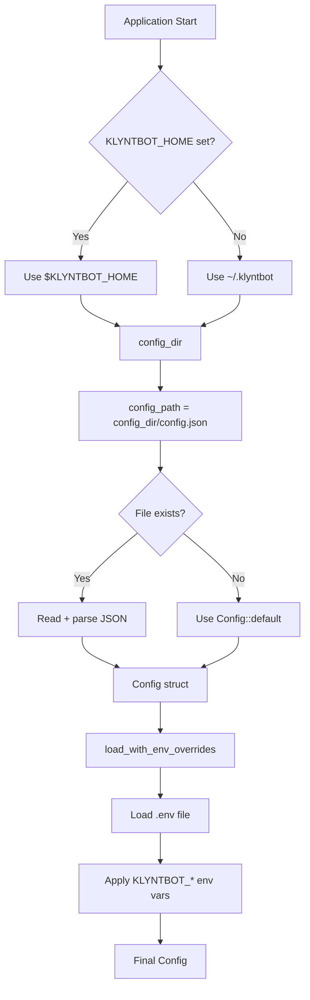
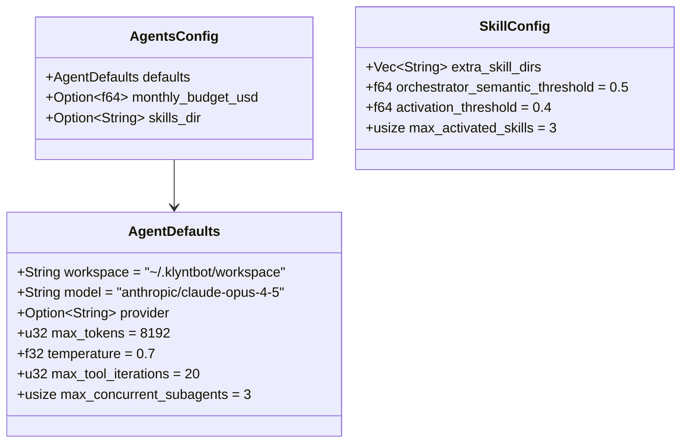
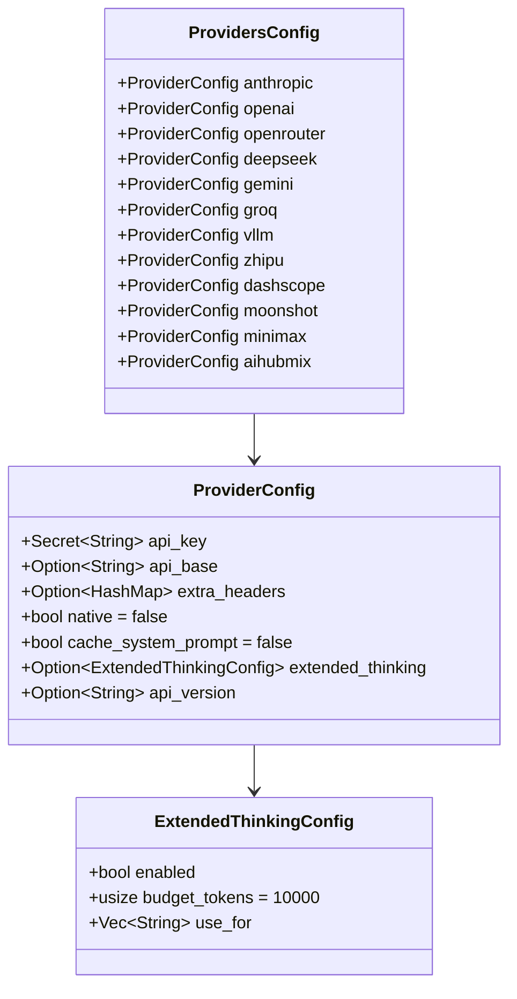
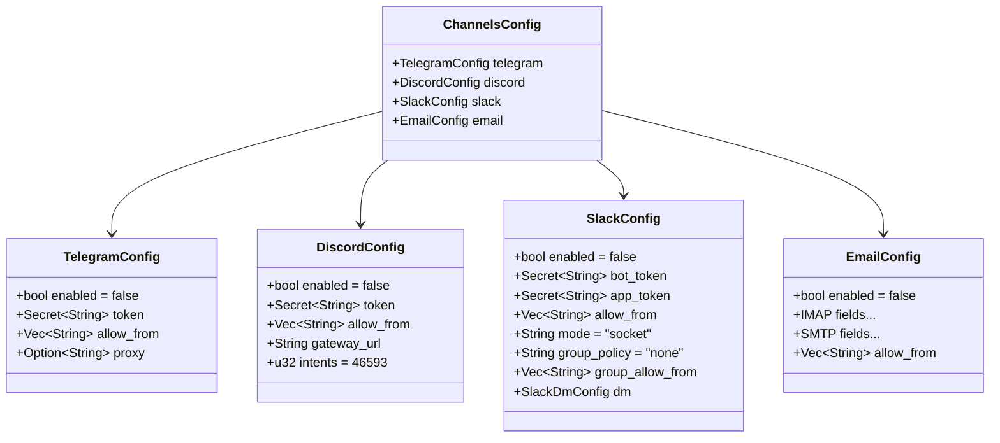
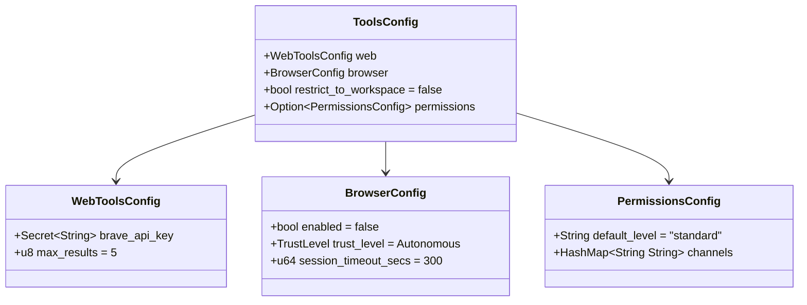
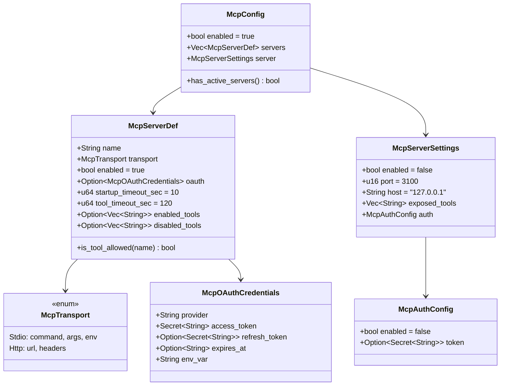

# Layer 1: Config Crate

> `crates/config/` -- Configuration schema definition, loading, saving, and environment variable overrides.

## Overview

The `config` crate is a Layer 1 crate that defines the entire configuration schema for Klyntbot as a single root `Config` struct. It handles:

- **Schema definition** -- All configuration sections as nested `#[serde(rename_all = "camelCase")]` structs with sensible defaults.
- **File I/O** -- Loading from and saving to `{KLYNTBOT_HOME}/config.json` (async and sync variants).
- **Minimal saves** -- Only fields that differ from defaults are written to disk (via recursive JSON diffing).
- **Environment overrides** -- `KLYNTBOT_*` env vars applied on top of file-based config, with `.env` file auto-loading.
- **Secret redaction** -- API keys wrapped in `Secret<String>`, which prints `[REDACTED]` in Debug/Display output.
- **Workspace bootstrapping** -- `init()` creates directory structure and copies embedded workspace templates.

### Dependencies

| Dependency | Purpose |
|---|---|
| `common` | `Result<T>`, `ConfigError` |
| `serde`, `serde_json` | Serialization (camelCase JSON) |
| `dirs` | Home directory resolution |
| `tokio` | Async file I/O |
| `iana-time-zone` | System timezone auto-detection |
| `dotenvy` | `.env` file loading |
| `tracing` | Warning logs |

## Config Loading Flow



### Loading Functions

| Function | Signature | Description |
|---|---|---|
| `load()` | `async fn load() -> Result<Config>` | Async load from file or default |
| `load_sync()` | `fn load_sync() -> Result<Config>` | Synchronous load (for constructors, tests) |
| `load_with_env_overrides()` | `async fn load_with_env_overrides() -> Result<Config>` | Load + apply `.env` + `KLYNTBOT_*` env vars |
| `save()` | `async fn save(config: &Config) -> Result<()>` | Async save (minimal diff only) |
| `save_sync()` | `fn save_sync(config: &Config) -> Result<()>` | Synchronous save |
| `init()` | `async fn init() -> Result<()>` | Create directory structure + workspace templates |
| `config_dir()` | `fn config_dir() -> Result<PathBuf>` | Resolve home directory |
| `config_path()` | `fn config_path() -> Result<PathBuf>` | Resolve config file path |
| `exists()` | `fn exists() -> bool` | Check if config file exists |

### Minimal Save (Diff-based)

The `save()` and `save_sync()` functions serialize only fields that differ from `Config::default()`. This is implemented via `diff_json()`, which recursively compares the serialized config against the serialized default and prunes unchanged branches. Empty objects are also pruned.

Example: if only the model and one API key are set, the saved file contains:

```json
{
  "agents": { "defaults": { "model": "openai/gpt-4" } },
  "providers": { "openai": { "apiKey": "sk-..." } }
}
```

All other fields are omitted and restored from defaults on load via `#[serde(default)]`.

## Environment Variable Overrides

Environment variables use the prefix `KLYNTBOT_` with double underscores (`__`) for nesting. A `.env` file in the current directory is auto-loaded via `dotenvy`.

### Supported Environment Variables

| Variable | Config Path | Type |
|---|---|---|
| `KLYNTBOT_AGENTS__DEFAULTS__MODEL` | `agents.defaults.model` | String |
| `KLYNTBOT_AGENTS__DEFAULTS__WORKSPACE` | `agents.defaults.workspace` | String |
| `KLYNTBOT_AGENTS__DEFAULTS__TEMPERATURE` | `agents.defaults.temperature` | f32 |
| `KLYNTBOT_AGENTS__DEFAULTS__MAX_TOKENS` | `agents.defaults.max_tokens` | u32 |
| `KLYNTBOT_PROVIDERS__ANTHROPIC__API_KEY` | `providers.anthropic.api_key` | Secret |
| `KLYNTBOT_PROVIDERS__OPENAI__API_KEY` | `providers.openai.api_key` | Secret |
| `KLYNTBOT_PROVIDERS__OPENROUTER__API_KEY` | `providers.openrouter.api_key` | Secret |
| `KLYNTBOT_PROVIDERS__DEEPSEEK__API_KEY` | `providers.deepseek.api_key` | Secret |
| `KLYNTBOT_PROVIDERS__GEMINI__API_KEY` | `providers.gemini.api_key` | Secret |
| `KLYNTBOT_PROVIDERS__GROQ__API_KEY` | `providers.groq.api_key` | Secret |
| `KLYNTBOT_PROVIDERS__VLLM__API_KEY` | `providers.vllm.api_key` | Secret |
| `KLYNTBOT_PROVIDERS__ZHIPU__API_KEY` | `providers.zhipu.api_key` | Secret |
| `KLYNTBOT_PROVIDERS__DASHSCOPE__API_KEY` | `providers.dashscope.api_key` | Secret |
| `KLYNTBOT_PROVIDERS__MOONSHOT__API_KEY` | `providers.moonshot.api_key` | Secret |
| `KLYNTBOT_PROVIDERS__MINIMAX__API_KEY` | `providers.minimax.api_key` | Secret |
| `KLYNTBOT_PROVIDERS__AIHUBMIX__API_KEY` | `providers.aihubmix.api_key` | Secret |
| `KLYNTBOT_DATA_DIR` | `data_dir` | String |
| `KLYNTBOT_HOME` | `data_dir` (fallback) | String |
| `KLYNTBOT_CHANNELS__TELEGRAM__TOKEN` | `channels.telegram.token` | Secret |
| `KLYNTBOT_CHANNELS__DISCORD__TOKEN` | `channels.discord.token` | Secret |
| `KLYNTBOT_CHANNELS__SLACK__BOT_TOKEN` | `channels.slack.bot_token` | Secret |
| `KLYNTBOT_CHANNELS__SLACK__APP_TOKEN` | `channels.slack.app_token` | Secret |
| `KLYNTBOT_TOOLS__WEB__BRAVE_API_KEY` | `tools.web.brave_api_key` | Secret |

### Internal Macros

Three macros simplify env var application:

- `env_string!("VAR", field)` -- sets field from env var string
- `env_parse!("VAR", field, type)` -- parses env var as the given type
- `env_secret!("VAR", field)` -- wraps env var in `Secret::new()`

## Secret\<T\>

`Secret<T>` is a transparent serde wrapper that redacts values in `Debug` and `Display` output.

```rust
pub struct Secret<T>(T);

impl<T> Secret<T> {
    pub fn new(value: T) -> Self;
    pub fn expose(&self) -> &T;       // Access the inner value
    pub fn into_inner(self) -> T;      // Consume and unwrap
}

impl Secret<String> {
    pub fn is_empty(&self) -> bool;
}

// Debug and Display both print "[REDACTED]"
// Default for Secret<String> is Secret("")
// Serializes transparently (the raw value appears in JSON)
```

## Root Config Struct

```mermaid
classDiagram
    class Config {
        +AgentsConfig agents
        +ChannelsConfig channels
        +ProvidersConfig providers
        +ToolsConfig tools
        +GatewayConfig gateway
        +TodoConfig todo
        +ConfidenceConfig confidence
        +ProjectConfig project
        +ConversationConfig conversation
        +LearningConfig learning
        +FinanceConfig finance
        +NotesConfig notes
        +ProductivityConfig productivity
        +OrchestratorConfig orchestrator
        +ProviderManagerConfig provider_manager
        +String timezone
        +Option~String~ data_dir
        +PacksConfig packs
        +PluginsConfig plugins
        +CognitiveConfig cognitive
        +UserConfig user
        +WorkContextConfig work_context
        +CaptureConfig capture
        +ContentConfig content
        +McpConfig mcp
        +SkillConfig skills
        +IntegrationsConfig integrations
        +Option~String~ project_root
        +LanguageConfig language
        +LauncherConfig launcher
        +ScenarioConfig scenario
        +ShortcutsConfig shortcuts
        +bool setup_completed
        +workspace_path() PathBuf
        +data_dir_path() PathBuf
        +all_providers() Vec
        +active_provider_name() str
        +is_provider_configured(name) bool
        +set_provider_key(name, key) bool
    }
    Config --> AgentsConfig
    Config --> ChannelsConfig
    Config --> ProvidersConfig
    Config --> ToolsConfig
    Config --> GatewayConfig
    Config --> TodoConfig
    Config --> ConfidenceConfig
    Config --> ProjectConfig
    Config --> ConversationConfig
    Config --> LearningConfig
    Config --> FinanceConfig
    Config --> NotesConfig
    Config --> ProductivityConfig
    Config --> OrchestratorConfig
    Config --> ProviderManagerConfig
    Config --> PacksConfig
    Config --> PluginsConfig
    Config --> CognitiveConfig
    Config --> UserConfig
    Config --> WorkContextConfig
    Config --> CaptureConfig
    Config --> ContentConfig
    Config --> McpConfig
    Config --> SkillConfig
    Config --> IntegrationsConfig
    Config --> LanguageConfig
    Config --> LauncherConfig
    Config --> ScenarioConfig
    Config --> ShortcutsConfig
```



### Config Methods

| Method | Returns | Description |
|---|---|---|
| `workspace_path()` | `PathBuf` | Expands `~/` in `agents.defaults.workspace` |
| `data_dir_path()` | `PathBuf` | Resolves data dir: `data_dir` field -> `KLYNTBOT_HOME` env -> `~/.klyntbot` |
| `all_providers()` | `Vec<(&str, &ProviderConfig)>` | All 12 providers in detection priority order |
| `active_provider_name()` | `&str` | Explicit provider field or first with non-empty key; `"none"` if nothing configured |
| `is_provider_configured(name)` | `bool` | Whether the named provider has a non-empty API key |
| `set_provider_key(name, key)` | `bool` | Set API key by provider name; returns false for unknown providers |

### Top-Level Fields

| JSON Key | Rust Field | Type | Default |
|---|---|---|---|
| `agents` | `agents` | `AgentsConfig` | (see below) |
| `channels` | `channels` | `ChannelsConfig` | all disabled |
| `providers` | `providers` | `ProvidersConfig` | all empty keys |
| `tools` | `tools` | `ToolsConfig` | (see below) |
| `gateway` | `gateway` | `GatewayConfig` | 127.0.0.1:18790 |
| `todo` | `todo` | `TodoConfig` | (see below) |
| `confidence` | `confidence` | `ConfidenceConfig` | threshold 0.7 |
| `project` | `project` | `ProjectConfig` | enabled |
| `conversation` | `conversation` | `ConversationConfig` | (see below) |
| `learning` | `learning` | `LearningConfig` | (see below) |
| `finance` | `finance` | `FinanceConfig` | (see below) |
| `notes` | `notes` | `NotesConfig` | max 50 versions |
| `productivity` | `productivity` | `ProductivityConfig` | (see below) |
| `orchestrator` | `orchestrator` | `OrchestratorConfig` | (see below) |
| `providerManager` | `provider_manager` | `ProviderManagerConfig` | all None |
| `timezone` | `timezone` | `String` | auto-detected via `iana-time-zone` |
| `dataDir` | `data_dir` | `Option<String>` | None |
| `packs` | `packs` | `PacksConfig` | (see below) |
| `plugins` | `plugins` | `PluginsConfig` | (see below) |
| `cognitive` | `cognitive` | `CognitiveConfig` | (see below) |
| `user` | `user` | `UserConfig` | empty name |
| `workContext` | `work_context` | `WorkContextConfig` | (see below) |
| `capture` | `capture` | `CaptureConfig` | (see below) |
| `content` | `content` | `ContentConfig` | (see below) |
| `mcp` | `mcp` | `McpConfig` | (see below) |
| `skills` | `skills` | `SkillConfig` | (see below) |
| `integrations` | `integrations` | `IntegrationsConfig` | empty |
| `projectRoot` | `project_root` | `Option<String>` | None |
| `language` | `language` | `LanguageConfig` | (see below) |
| `launcher` | `launcher` | `LauncherConfig` | (see below) |
| `scenario` | `scenario` | `ScenarioConfig` | depth 2 |
| `shortcuts` | `shortcuts` | `ShortcutsConfig` | (see below) |
| `setupCompleted` | `setup_completed` | `bool` | false |

---

## Config Sections (Full Schema)

### AgentsConfig



| JSON Path | Type | Default | Description |
|---|---|---|---|
| `agents.defaults.workspace` | String | `"~/.klyntbot/workspace"` | Workspace directory (tilde-expanded) |
| `agents.defaults.model` | String | `"anthropic/claude-opus-4-5"` | Default LLM model identifier |
| `agents.defaults.provider` | Option\<String\> | None | Explicit provider override |
| `agents.defaults.maxTokens` | u32 | 8192 | Max output tokens |
| `agents.defaults.temperature` | f32 | 0.7 | Sampling temperature |
| `agents.defaults.maxToolIterations` | u32 | 20 | Max ReAct loop iterations |
| `agents.defaults.maxConcurrentSubagents` | usize | 3 | Max parallel sub-agent tasks |
| `agents.monthlyBudgetUsd` | Option\<f64\> | None | Monthly LLM cost cap (USD) |
| `agents.skillsDir` | Option\<String\> | None | External skills directory |

**Constant:** `DEFAULT_MODEL = "anthropic/claude-opus-4-5"`

### SkillConfig

| JSON Path | Type | Default | Description |
|---|---|---|---|
| `skills.extraSkillDirs` | Vec\<String\> | `[]` | Additional skill scan directories |
| `skills.orchestratorSemanticThreshold` | f64 | 0.5 | Semantic score threshold for orchestrator selection |
| `skills.activationThreshold` | f64 | 0.4 | Per-message skill activation threshold |
| `skills.maxActivatedSkills` | usize | 3 | Max non-orchestrator skills per message |

### ProvidersConfig



12 providers, each with `ProviderConfig`:

| JSON Path | Type | Default | Description |
|---|---|---|---|
| `providers.<name>.apiKey` | Secret\<String\> | `""` | API key (redacted in debug) |
| `providers.<name>.apiBase` | Option\<String\> | None | Custom API base URL |
| `providers.<name>.extraHeaders` | Option\<HashMap\> | None | Additional HTTP headers |
| `providers.<name>.native` | bool | false | Use native API format (not OpenAI-compat) |
| `providers.<name>.cacheSystemPrompt` | bool | false | Enable prompt caching (Anthropic) |
| `providers.<name>.extendedThinking` | Option\<ExtendedThinkingConfig\> | None | Chain-of-thought config |
| `providers.<name>.apiVersion` | Option\<String\> | None | API version header (Anthropic) |

**ExtendedThinkingConfig:**

| Field | Type | Default | Description |
|---|---|---|---|
| `enabled` | bool | -- | Enable extended thinking |
| `budgetTokens` | usize | 10000 | Token budget for thinking |
| `useFor` | Vec\<String\> | `[]` | Task types (e.g., "planning", "debugging") |

**Supported provider names:** anthropic, openai, openrouter, deepseek, gemini, groq, vllm, zhipu, dashscope, moonshot, minimax, aihubmix.

### ProviderManagerConfig

| JSON Path | Type | Default | Description |
|---|---|---|---|
| `providerManager.primary` | Option\<String\> | None | Primary provider name |
| `providerManager.fallback` | Option\<String\> | None | Fallback provider name |
| `providerManager.classifierModel` | Option\<String\> | None | Model for complexity classifier |

### ChannelsConfig



#### Telegram

| JSON Path | Type | Default |
|---|---|---|
| `channels.telegram.enabled` | bool | false |
| `channels.telegram.token` | Secret\<String\> | `""` |
| `channels.telegram.allowFrom` | Vec\<String\> | `[]` |
| `channels.telegram.proxy` | Option\<String\> | None |

#### Discord

| JSON Path | Type | Default |
|---|---|---|
| `channels.discord.enabled` | bool | false |
| `channels.discord.token` | Secret\<String\> | `""` |
| `channels.discord.allowFrom` | Vec\<String\> | `[]` |
| `channels.discord.gatewayUrl` | String | `"wss://gateway.discord.gg/?v=10&encoding=json"` |
| `channels.discord.intents` | u32 | 46593 |

Discord intents bitmask: GUILD_MESSAGES (1<<9), GUILD_MESSAGE_REACTIONS (1<<10), DIRECT_MESSAGES (1<<12), DIRECT_MESSAGE_REACTIONS (1<<13), MESSAGE_CONTENT (1<<15).

#### Slack

| JSON Path | Type | Default |
|---|---|---|
| `channels.slack.enabled` | bool | false |
| `channels.slack.botToken` | Secret\<String\> | `""` |
| `channels.slack.appToken` | Secret\<String\> | `""` |
| `channels.slack.allowFrom` | Vec\<String\> | `[]` |
| `channels.slack.mode` | String | `"socket"` |
| `channels.slack.groupPolicy` | String | `"none"` |
| `channels.slack.groupAllowFrom` | Vec\<String\> | `[]` |
| `channels.slack.dm.enabled` | bool | false |
| `channels.slack.dm.allowFrom` | Vec\<String\> | `[]` |

#### Email

| JSON Path | Type | Default |
|---|---|---|
| `channels.email.enabled` | bool | false |
| `channels.email.imapHost` | String | `""` |
| `channels.email.imapPort` | u16 | 993 |
| `channels.email.imapUsername` | String | `""` |
| `channels.email.imapPassword` | Secret\<String\> | `""` |
| `channels.email.imapMailbox` | String | `"INBOX"` |
| `channels.email.imapUseSsl` | bool | true |
| `channels.email.smtpHost` | String | `""` |
| `channels.email.smtpPort` | u16 | 587 |
| `channels.email.smtpUsername` | String | `""` |
| `channels.email.smtpPassword` | Secret\<String\> | `""` |
| `channels.email.smtpUseTls` | bool | true |
| `channels.email.smtpUseSsl` | bool | false |
| `channels.email.fromAddress` | String | `""` |
| `channels.email.allowFrom` | Vec\<String\> | `[]` |
| `channels.email.consentGranted` | bool | false |
| `channels.email.autoReplyEnabled` | bool | true |
| `channels.email.maxBodyChars` | u32 | 12000 |
| `channels.email.markSeen` | bool | true |
| `channels.email.pollIntervalSeconds` | u32 | 30 |
| `channels.email.subjectPrefix` | String | `"Re: "` |

### ToolsConfig



| JSON Path | Type | Default |
|---|---|---|
| `tools.web.braveApiKey` | Secret\<String\> | `""` |
| `tools.web.maxResults` | u8 | 5 |
| `tools.browser.enabled` | bool | false |
| `tools.browser.trustLevel` | TrustLevel | `"autonomous"` |
| `tools.browser.sessionTimeoutSecs` | u64 | 300 |
| `tools.restrictToWorkspace` | bool | false |
| `tools.permissions` | Option\<PermissionsConfig\> | None |
| `tools.permissions.defaultLevel` | String | `"standard"` |
| `tools.permissions.channels` | HashMap\<String, String\> | `{}` |

**TrustLevel enum:** `strict` (ask before every write), `autonomous` (ask for dangerous only, default), `full` (no confirmation).

### GatewayConfig

| JSON Path | Type | Default |
|---|---|---|
| `gateway.host` | String | `"127.0.0.1"` |
| `gateway.port` | u16 | 18790 |

### MCP Config



#### MCP Client (connecting to external MCP servers)

| JSON Path | Type | Default |
|---|---|---|
| `mcp.enabled` | bool | true |
| `mcp.servers` | Vec\<McpServerDef\> | `[]` |

Per-server definition:

| Field | Type | Default | Description |
|---|---|---|---|
| `name` | String | -- | Server identifier |
| `transport` | `"stdio"` or `"http"` | -- | Transport type (tagged enum) |
| `command` | String | -- | (stdio) Command to execute |
| `args` | Vec\<String\> | `[]` | (stdio) Command arguments |
| `env` | HashMap | `{}` | (stdio) Environment variables |
| `url` | String | -- | (http) Server URL |
| `headers` | HashMap | `{}` | (http) HTTP headers |
| `enabled` | bool | true | Whether server is active |
| `oauth` | Option\<McpOAuthCredentials\> | None | OAuth credentials |
| `startupTimeoutSec` | u64 | 10 | Connection + discovery timeout |
| `toolTimeoutSec` | u64 | 120 | Per-tool-call timeout |
| `enabledTools` | Option\<Vec\<String\>\> | None | Allowlist (takes precedence over denylist) |
| `disabledTools` | Option\<Vec\<String\>\> | None | Denylist |

**Constants:** `DEFAULT_STARTUP_TIMEOUT_SEC = 10`, `DEFAULT_TOOL_TIMEOUT_SEC = 120`

#### MCP Server (exposing Klyntbot as an MCP server)

| JSON Path | Type | Default |
|---|---|---|
| `mcp.server.enabled` | bool | false |
| `mcp.server.port` | u16 | 3100 |
| `mcp.server.host` | String | `"127.0.0.1"` |
| `mcp.server.exposedTools` | Vec\<String\> | (see below) |
| `mcp.server.auth.enabled` | bool | false |
| `mcp.server.auth.token` | Option\<Secret\<String\>\> | None |

**Default exposed tools:** `["tasks", "project", "area", "notes", "memory", "okr", "finance", "productivity", "work_context", "agent"]`

### TodoConfig

| JSON Path | Type | Default |
|---|---|---|
| `todo.notifications.targets` | Vec\<String\> | `["os_native"]` |
| `todo.notifications.focusReminders` | bool | true |
| `todo.notifications.dailyDigest` | bool | true |
| `todo.notifications.dailyDigestTime` | String | `"09:00"` |
| `todo.focus.maxSlots` | usize | 3 |
| `todo.focus.deadlineHours` | u64 | 18 |
| `todo.enrichment.enabled` | bool | true |
| `todo.enrichment.autoApplyThreshold` | f64 | 0.85 |
| `todo.enrichment.useLlm` | bool | false |
| `todo.search.enabled` | bool | true |
| `todo.search.semanticThreshold` | f64 | 0.5 |
| `todo.search.embeddingModel` | String | `"paraphrase-multilingual-MiniLM-L12-v2"` |
| `todo.search.rrfK` | u32 | 60 |
| `todo.dailyPlanning.enabled` | bool | true |
| `todo.dailyPlanning.planningTime` | String | `"08:00"` |

### ConfidenceConfig

| JSON Path | Type | Default |
|---|---|---|
| `confidence.threshold` | f32 | 0.7 |
| `confidence.enabled` | bool | true |
| `confidence.toolOverrides` | HashMap\<String, f32\> | `{}` |

### ConversationConfig

| JSON Path | Type | Default |
|---|---|---|
| `conversation.embedding.enabled` | bool | true |
| `conversation.embedding.excludeChannels` | Vec\<String\> | `[]` |
| `conversation.embedding.excludeRoles` | Vec\<String\> | `["system", "tool"]` |
| `conversation.search.enabled` | bool | true |
| `conversation.search.semanticThreshold` | f64 | 0.5 |
| `conversation.search.maxResults` | usize | 20 |
| `conversation.session.historyLimit` | usize | 50 |
| `conversation.session.maxCacheSize` | usize | 1000 |
| `conversation.session.ttlDays` | u32 | 30 |
| `conversation.session.cleanupIntervalHours` | u32 | 1 |
| `conversation.memory.decayHalfLifeDays` | u32 | 138 |
| `conversation.memory.maxAgeDays` | u32 | 90 |
| `conversation.memory.consolidationEnabled` | bool | false |
| `conversation.memory.maintenanceIntervalHours` | u32 | 24 |

### LearningConfig

| JSON Path | Type | Default |
|---|---|---|
| `learning.enabled` | bool | true |
| `learning.analysisIntervalSecs` | u64 | 3600 |
| `learning.minThreshold` | f32 | 0.4 |
| `learning.maxThreshold` | f32 | 0.9 |
| `learning.minOutcomesForAdaptation` | usize | 50 |

### FinanceConfig

| JSON Path | Type | Default |
|---|---|---|
| `finance.enabled` | bool | true |
| `finance.defaultCurrency` | String | `"USD"` |
| `finance.proactivityLevel` | String | `"full"` |
| `finance.inflation.rate` | f64 | 3.3 |
| `finance.inflation.source` | String | `"manual"` |
| `finance.expectedReturns.stocks` | f64 | 10.0 |
| `finance.expectedReturns.crypto` | f64 | 15.0 |
| `finance.expectedReturns.realEstate` | f64 | 8.0 |
| `finance.expectedReturns.bonds` | f64 | 5.0 |
| `finance.budgeting.defaultMethod` | String | `"standard"` |
| `finance.budgeting.alertThreshold` | u8 | 80 |
| `finance.budgeting.sixJarRatios.essentials` | u8 | 55 |
| `finance.budgeting.sixJarRatios.savings` | u8 | 10 |
| `finance.budgeting.sixJarRatios.investment` | u8 | 10 |
| `finance.budgeting.sixJarRatios.education` | u8 | 10 |
| `finance.budgeting.sixJarRatios.entertainment` | u8 | 10 |
| `finance.budgeting.sixJarRatios.charity` | u8 | 5 |
| `finance.priceRefresh.enabled` | bool | true |
| `finance.priceRefresh.intervalHours` | u32 | 4 |
| `finance.priceRefresh.cacheTtlMinutes` | u32 | 15 |
| `finance.scheduling.dailyReviewTime` | String | `"21:00"` |
| `finance.scheduling.weeklyReportDay` | String | `"monday"` |
| `finance.scheduling.budgetCheckTime` | String | `"09:00"` |
| `finance.scheduling.timezone` | Option\<String\> | None |
| `finance.categories.autoCategorize` | bool | true |
| `finance.categories.confidenceThreshold` | f64 | 0.8 |
| `finance.fire.enabled` | bool | false |
| `finance.fire.currentAge` | Option\<u32\> | None |
| `finance.fire.targetRetirementAge` | Option\<u32\> | None |
| `finance.fire.annualExpenses` | Option\<i64\> | None |
| `finance.fire.safeWithdrawalRate` | f64 | 4.0 |
| `finance.fire.fireType` | String | `"regular"` |
| `finance.fire.targetNumber` | Option\<i64\> | None |
| `finance.fire.monthlySavingsRate` | Option\<i64\> | None |
| `finance.fire.currentNetWorth` | Option\<i64\> | None |
| `finance.exchangeRates` | Option\<HashMap\<String, f64\>\> | None |

**Helper function:** `default_finance_categories() -> Vec<FinanceDefaultCategory>` -- returns 28 default categories across 5 groups (income, essential, lifestyle, savings, giving).

### NotesConfig

| JSON Path | Type | Default |
|---|---|---|
| `notes.maxVersionsPerNote` | usize | 50 |

### ProductivityConfig

| JSON Path | Type | Default |
|---|---|---|
| `productivity.enabled` | bool | true |
| `productivity.tracking.pollIntervalSecs` | u64 | 5 |
| `productivity.tracking.idleThresholdSecs` | u64 | 120 |
| `productivity.tracking.batchWriteIntervalSecs` | u64 | 30 |
| `productivity.tracking.rawRetentionDays` | u64 | 7 |
| `productivity.tracking.bucketRetentionDays` | u64 | 365 |
| `productivity.focus.defaultDurationMins` | u64 | 45 |
| `productivity.focus.breakIntervalMins` | u64 | 90 |
| `productivity.focus.breakDurationMins` | u64 | 10 |
| `productivity.focus.maxDailyFocusHours` | u64 | 8 |
| `productivity.focus.softBlockEnabled` | bool | true |
| `productivity.focus.softBlockCooldownSecs` | u64 | 60 |
| `productivity.focus.softBlockTempPassMins` | u64 | 5 |
| `productivity.focus.softBlockLlmEnabled` | bool | true |
| `productivity.focus.softBlockLlmTimeoutMs` | u64 | 3000 |
| `productivity.focus.learnedRuleThreshold` | u64 | 3 |
| `productivity.focus.autoDetectEnabled` | bool | true |
| `productivity.focus.autoDetectMinMins` | u64 | 15 |
| `productivity.focus.autoDetectProductiveThreshold` | f64 | 0.8 |
| `productivity.focus.autoDetectMaxSwitches` | u64 | 2 |
| `productivity.focus.cooldownGraceSecs` | u64 | 120 |
| `productivity.nudges.breakReminders` | bool | true |
| `productivity.nudges.focusSuggestions` | bool | true |
| `productivity.nudges.dailySummary` | bool | true |
| `productivity.nudges.burnoutAlerts` | bool | true |
| `productivity.nudges.cooldownMins` | u64 | 15 |
| `productivity.nudges.quietHoursStart` | Option\<String\> | None |
| `productivity.nudges.quietHoursEnd` | Option\<String\> | None |
| `productivity.privacy.excludedApps` | Vec\<String\> | `[]` |
| `productivity.privacy.excludeWindowTitles` | bool | false |
| `productivity.privacy.excludedUrlPatterns` | Vec\<String\> | `[]` |

### OrchestratorConfig

| JSON Path | Type | Default |
|---|---|---|
| `orchestrator.heuristicConfidenceThreshold` | f32 | 0.85 |
| `orchestrator.llmClassifierTimeout` | u64 | 2000 |
| `orchestrator.llmClassifierModel` | Option\<String\> | None |
| `orchestrator.maxEscalations` | u32 | 1 |
| `orchestrator.maxFabricationRetries` | u32 | 2 |
| `orchestrator.satisfactionWindowMinutes` | u64 | 15 |

### PacksConfig

| JSON Path | Type | Default |
|---|---|---|
| `packs.enabled` | Vec\<String\> | `["task-management", "productivity", "ai-intelligence", "developer-tools"]` |
| `packs.enabledSkills` | Vec\<String\> | `[]` |

**PackTier enum:** `core`, `recommended`, `optional` (kebab-case serialization, ordered).

### PluginsConfig

| JSON Path | Type | Default |
|---|---|---|
| `plugins.enabled` | bool | true |
| `plugins.registryUrl` | String | `"https://plugins.klyntbot.io/index.json"` |
| `plugins.sandboxMemoryMb` | u32 | 64 |
| `plugins.allowNetworkByDefault` | bool | false |

### CognitiveConfig

| JSON Path | Type | Default |
|---|---|---|
| `cognitive.model` | Option\<String\> | None |
| `cognitive.provider` | Option\<String\> | None |
| `cognitive.temperature` | Option\<f32\> | None |
| `cognitive.maxTokens` | Option\<u32\> | None |
| `cognitive.reflectionMaxTokens` | Option\<u32\> | None |
| `cognitive.reflectionSchedule` | Option\<String\> | None |
| `cognitive.dynamicFactsEnabled` | bool | true |
| `cognitive.staticFactLimit` | usize | 10 |
| `cognitive.dynamicFactLimit` | usize | 15 |
| `cognitive.vectorTopK` | usize | 30 |
| `cognitive.minSimilarity` | f64 | 0.55 |
| `cognitive.accumulatePromoteThreshold` | usize | 5 |
| `cognitive.accumulateMinDays` | usize | 3 |
| `cognitive.maxStability` | f64 | 30.0 |
| `cognitive.relevanceWeightSemantic` | f64 | 0.30 |
| `cognitive.relevanceWeightRetrievability` | f64 | 0.20 |
| `cognitive.relevanceWeightImportance` | f64 | 0.15 |
| `cognitive.relevanceWeightFrequency` | f64 | 0.10 |
| `cognitive.relevanceWeightSituation` | f64 | 0.25 |
| `cognitive.relevanceWeightTemporal` | f64 | 0.05 |
| `cognitive.insightForgeEnabled` | bool | true |
| `cognitive.insightForgeMaxSubQueries` | usize | 5 |
| `cognitive.insightForgePerSourceLimit` | usize | 5 |
| `cognitive.insightForgeTotalLimit` | usize | 15 |
| `cognitive.insightForgePerSourceTimeoutMs` | u64 | 800 |
| `cognitive.bookIndex.enabled` | bool | true |
| `cognitive.bookIndex.entityResolution.topK` | usize | 10 |
| `cognitive.bookIndex.entityResolution.gradientThreshold` | f64 | 0.6 |
| `cognitive.bookIndex.entityResolution.minSimilarity` | f64 | 0.3 |
| `cognitive.bookIndex.entityResolution.useLlmDisambiguation` | bool | false |
| `cognitive.bookIndex.retrieval.maxNodes` | usize | 50 |
| `cognitive.bookIndex.retrieval.maxMapNodes` | usize | 10 |
| `cognitive.bookIndex.retrieval.operatorTimeoutMs` | u64 | 600 |
| `cognitive.bookIndex.retrieval.pagerankDamping` | f64 | 0.85 |
| `cognitive.bookIndex.retrieval.pagerankIterations` | u32 | 20 |

Note: Relevance weights should sum to ~1.0 (current defaults: 0.30 + 0.20 + 0.15 + 0.10 + 0.25 + 0.05 = 1.05).

### UserConfig

| JSON Path | Type | Default |
|---|---|---|
| `user.name` | String | `""` |

### WorkContextConfig

| JSON Path | Type | Default |
|---|---|---|
| `workContext.enabled` | bool | true |
| `workContext.inferenceIntervalMins` | u64 | 5 |
| `workContext.assignmentThreshold` | f64 | 0.55 |
| `workContext.mergeThreshold` | f64 | 0.85 |
| `workContext.maxDormancyDays` | f64 | 7.0 |
| `workContext.maxActiveContexts` | usize | 50 |
| `workContext.semanticWeight` | f64 | 0.50 |
| `workContext.temporalWeight` | f64 | 0.25 |
| `workContext.resourceWeight` | f64 | 0.25 |

### CaptureConfig

| JSON Path | Type | Default |
|---|---|---|
| `capture.shellHook.enabled` | bool | false |
| `capture.shellHook.excludePatterns` | Vec\<String\> | `["export *=*", "ssh-keygen*", "gpg *", "pass *", "aws configure*"]` |
| `capture.fileWatcher.enabled` | bool | false |
| `capture.fileWatcher.directories` | Vec\<String\> | `[]` |
| `capture.fileWatcher.ignorePatterns` | Vec\<String\> | `["node_modules", ".git", "target", "build", "dist", "__pycache__", ".next", ".cache", ".DS_Store"]` |
| `capture.fileWatcher.debounceMs` | u64 | 500 |
| `capture.ingestionApi.enabled` | bool | true |
| `capture.ingestionApi.port` | u16 | 3456 |
| `capture.ingestionApi.token` | Option\<String\> | None |

### ContentConfig

| JSON Path | Type | Default |
|---|---|---|
| `content.sources` | Vec\<ContentSourceConfig\> | `[]` |
| `content.trustPolicy` | String | `"official,maintainer"` |
| `content.refreshIntervalSecs` | u64 | 86400 |
| `content.contentDir` | PathBuf | `""` |

Each `ContentSourceConfig` has: `name` (String), `url` (Option\<String\>), `path` (Option\<String\>).

### IntegrationsConfig

| JSON Path | Type | Default |
|---|---|---|
| `integrations.aiTools` | Vec\<String\> | `[]` |

### LanguageConfig

| JSON Path | Type | Default |
|---|---|---|
| `language.sourceLang` | Option\<String\> | None |
| `language.targetLang` | Option\<String\> | None |
| `language.autoDetect` | bool | true |
| `language.proficiencyLevel` | Option\<String\> | None |

### LauncherConfig

| JSON Path | Type | Default |
|---|---|---|
| `launcher.enabled` | bool | true |
| `launcher.sources.apps.enabled` | bool | true |
| `launcher.sources.systemPrefs.enabled` | bool | true |
| `launcher.sources.brew.enabled` | bool | true |
| `launcher.sources.sshHosts.enabled` | bool | true |
| `launcher.sources.gitRepos.enabled` | bool | true |
| `launcher.sources.gitRepos.scanDirs` | Vec\<String\> | `["~/Projects", "~/Developer"]` |
| `launcher.sources.scripts.enabled` | bool | true |
| `launcher.sources.scripts.dir` | String | `"~/.klyntbot/scripts"` |
| `launcher.sources.files.enabled` | bool | true |
| `launcher.sources.contentGrep.enabled` | bool | true |
| `launcher.sources.contentGrep.defaultScope` | String | `"."` |
| `launcher.sources.contacts.enabled` | bool | true |
| `launcher.sources.runningApps.enabled` | bool | true |
| `launcher.sources.bookmarks.enabled` | bool | true |
| `launcher.sources.bookmarks.browser` | String | `"chrome"` |
| `launcher.sources.browserHistory.enabled` | bool | true |
| `launcher.sources.browserHistory.browser` | String | `"chrome"` |
| `launcher.sources.browserHistory.maxDays` | i64 | 30 |
| `launcher.sources.tasks.enabled` | bool | true |
| `launcher.sources.notes.enabled` | bool | true |
| `launcher.sources.clipboard.enabled` | bool | true |
| `launcher.sources.clipboard.maxEntries` | i64 | 1000 |

### ScenarioConfig

| JSON Path | Type | Default |
|---|---|---|
| `scenario.maxGraphDepth` | u32 | 2 |

### ShortcutsConfig

| JSON Path | Type | Default |
|---|---|---|
| `shortcuts.launcher` | String | `"alt+space"` |
| `shortcuts.tray` | String | `"alt+shift+space"` |
| `shortcuts.quickCapture` | String | `"super+shift+c"` |

### ProjectConfig

| JSON Path | Type | Default |
|---|---|---|
| `project.enabled` | bool | true |

## Workspace Templates

On `init()`, these files are copied to `{data_dir}/workspace/` if they do not already exist:

- `SOUL.md`
- `AGENTS.md`
- `USER.md`
- `TOOLS.md`
- `RESPONSE.md`
- `HEARTBEAT.md`

Source files are embedded at compile time via `include_str!()` from `workspace/`.

## Public Re-exports from `config` crate

The following types are re-exported from `config::lib.rs`:

**Functions:** `load_with_env_overrides`, `config_dir`, `config_path`, `init`, `load`, `load_sync`, `save`, `save_sync`

**Types:** `Config`, `Secret`, `BookEntityResolutionConfig`, `BookIndexConfig`, `BookRetrievalCfg`, `ContentConfig`, `ContentSourceConfig`, `DiscordConfig`, `EmailConfig`, `ExtendedThinkingConfig`, `FinanceBudgetingConfig`, `FinanceCategoryConfig`, `FinanceConfig`, `FinanceDefaultCategory`, `FinanceExpectedReturnsConfig`, `FinanceInflationConfig`, `FinancePriceRefreshConfig`, `FinanceSchedulingConfig`, `FireConfig`, `LearningConfig`, `McpAuthConfig`, `McpConfig`, `McpOAuthCredentials`, `McpServerDef`, `McpServerSettings`, `McpTransport`, `OrchestratorConfig`, `PackTier`, `PacksConfig`, `PermissionsConfig`, `ProviderManagerConfig`, `ShortcutsConfig`, `SixJarRatios`, `SlackConfig`, `TelegramConfig`, `TodoEnrichmentConfig`, `TrustLevel`

**Constants:** `DEFAULT_STARTUP_TIMEOUT_SEC`, `DEFAULT_TOOL_TIMEOUT_SEC`

**Free functions:** `default_finance_categories()`

## File Layout

```
crates/config/
  Cargo.toml
  src/
    lib.rs               # Crate root, re-exports
    loader.rs            # File I/O, init(), diff_json()
    env.rs               # Environment variable overrides
    schema/
      mod.rs             # Module declarations + integration tests
      core.rs            # Secret<T>, Config (root), expand_tilde(), shared defaults
      agents.rs          # AgentsConfig, AgentDefaults, SkillConfig
      channels.rs        # ChannelsConfig, Telegram/Discord/Slack/Email configs
      providers.rs       # ProvidersConfig, ProviderConfig, ExtendedThinkingConfig, ProviderManagerConfig
      tools.rs           # ToolsConfig, WebToolsConfig, BrowserConfig, TrustLevel, PermissionsConfig
      gateway.rs         # GatewayConfig
      mcp.rs             # McpConfig, McpServerDef, McpTransport, McpServerSettings, McpAuthConfig, McpOAuthCredentials
      todo.rs            # TodoConfig, notifications, focus, enrichment, search, daily planning
      confidence.rs      # ConfidenceConfig
      project.rs         # ProjectConfig
      conversation.rs    # ConversationConfig, embedding, search, session, memory
      learning.rs        # LearningConfig
      finance.rs         # FinanceConfig and 8 sub-structs, default_finance_categories()
      notes.rs           # NotesConfig
      productivity.rs    # ProductivityConfig, tracking, focus, nudges, privacy
      orchestrator.rs    # OrchestratorConfig
      packs.rs           # PacksConfig, PackTier
      plugins.rs         # PluginsConfig
      cognitive.rs       # CognitiveConfig, BookIndexConfig, BookEntityResolutionConfig, BookRetrievalCfg
      user.rs            # UserConfig
      work_context.rs    # WorkContextConfig
      capture.rs         # CaptureConfig, ShellHookConfig, FileWatcherConfig, IngestionApiConfig
      content.rs         # ContentConfig, ContentSourceConfig
      integrations.rs    # IntegrationsConfig
      language.rs        # LanguageConfig
      launcher.rs        # LauncherConfig + 8 source sub-configs
      scenario.rs        # ScenarioConfig
      shortcuts.rs       # ShortcutsConfig
```
