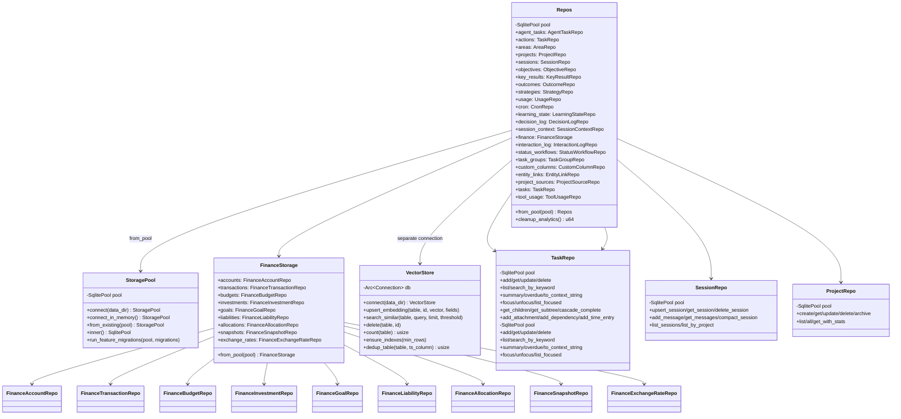

# Layer 2: Storage Crate Architecture

> `crates/storage/` -- SQLite + LanceDB persistence layer for klyntbot.

## Overview

The storage crate is the single persistence boundary for the entire application. It provides:

- **StoragePool** -- a newtype around `sqlx::SqlitePool` with automatic WAL mode, foreign keys, busy timeout, and migration execution on connect.
- **23 repository structs** -- each wrapping `SqlitePool` with domain-specific CRUD, filtering, aggregation, and retention methods.
- **Repos** -- an aggregate struct that constructs all repositories from a single pool, providing convenient `repos.tasks`, `repos.sessions`, etc. access.
- **VectorStore** -- a LanceDB-backed embedding store for semantic similarity search across 9 tables.
- **FinanceStorage** -- a sub-aggregate of 9 finance-specific repositories.
- **FeatureMigration system** -- allowing feature crates to register and run their own schema migrations independently of the core migration.

All relational data lives in `{data_dir}/data.db` (SQLite). Vector embeddings live in `{data_dir}/lance/` (LanceDB). Data dir defaults to `~/.klyntbot`.

## Dependencies

```
common, tools-core, sqlx, lancedb, arrow-array, arrow-schema,
uuid, chrono, serde, serde_json, thiserror, tracing, futures-util
```

---

## StoragePool

**File:** `src/pool.rs`

A `Clone`-able newtype wrapper around `sqlx::SqlitePool`. Three constructors:

| Method | Description |
|--------|-------------|
| `connect(data_dir: &Path)` | Opens/creates `{data_dir}/data.db`, enables WAL + FK + busy_timeout(5000), runs all `./migrations` |
| `connect_in_memory()` | In-memory SQLite with all migrations applied. Used by tests and as fallback. |
| `from_existing(pool)` | Wraps an existing `SqlitePool` without running migrations. For already-migrated pools only. |

### PRAGMA settings

On every `connect()`:
- `journal_mode=WAL` (concurrent readers)
- `foreign_keys=ON` (referential integrity)
- `busy_timeout=5000` (5s retry on lock contention)

### Feature Migrations

`StoragePool::run_feature_migrations(pool, migrations)` runs feature-owned migrations that have not been applied. Each migration is:
1. Checked against `_feature_migrations` table for `(feature_name, version)`.
2. If missing, runs the SQL and records it, both within an explicit transaction.

---

## Repos Aggregate

**File:** `src/repos/mod.rs`

```rust
pub struct Repos {
    pool: SqlitePool,
    pub agent_tasks: AgentTaskRepo,
    pub actions: TaskRepo,
    pub areas: AreaRepo,
    pub projects: ProjectRepo,
    pub sessions: SessionRepo,
    pub objectives: ObjectiveRepo,
    pub key_results: KeyResultRepo,
    pub outcomes: OutcomeRepo,
    pub strategies: StrategyRepo,
    pub usage: UsageRepo,
    pub cron: CronRepo,
    pub learning_state: LearningStateRepo,
    pub decision_log: DecisionLogRepo,
    pub session_context: SessionContextRepo,
    pub finance: FinanceStorage,
    pub interaction_log: InteractionLogRepo,
    pub status_workflows: StatusWorkflowRepo,
    pub task_groups: TaskGroupRepo,
    pub custom_columns: CustomColumnRepo,
    pub entity_links: EntityLinkRepo,
    pub project_sources: ProjectSourceRepo,
    pub tasks: TaskRepo,
    pub tool_usage: ToolUsageRepo,
}
```

### Construction

```rust
let pool = StoragePool::connect(data_dir).await?;
let repos = Repos::from_pool(&pool);
```

All repos are `Clone + Send + Sync` because `SqlitePool` is `Arc`-based internally.

### Analytics Cleanup

`repos.cleanup_analytics()` runs retention deletes in parallel:
- `strategy_records`: 90 days
- `learning_outcomes`: 30 days
- `interaction_log`: 60 days
- `tool_usage`: 90 days
- `enrichment_feedback`: 90 days

### Shared Types

- `ItemSummary { todo, doing, done, total }` -- aggregate counts by status, shared between actions and tasks.
- `ActionSummary` and `TaskSummary` are type aliases for `ItemSummary`.

---

## Declarative Macros

**File:** `src/macros.rs`

The storage crate uses 5 macros to eliminate CRUD boilerplate:

| Macro | Generates |
|-------|-----------|
| `crud_repo!(Repo, "table", Row, "label")` | Struct with `new`, `get`, `get_or_err`, `delete` |
| `crud_repo!(@no_delete ...)` | Same but without `delete` (for custom delete signatures) |
| `focus_impl!(Repo, "table", Row)` | `focus`, `unfocus`, `list_focused` methods |
| `delete_older_than_impl!("table", "ts_col")` | `delete_older_than(days, now)` retention method |
| `get_by_ids_impl!("table", Row)` | `get_by_ids(ids)` batch-fetch with IN clause |

`escape_like(s)` is a helper function that escapes `\`, `%`, `_` for safe SQL `LIKE` patterns.

---

## Repository Structs and Methods

### TaskRepo

**Files:** `src/repos/task_repo/` (mod, core, filter, aggregation, hierarchy, attachments, dependencies, time_entries)

**Table:** `actions`

**Core CRUD:**
- `add(row) -> TaskRow`
- `get(id) -> Option<TaskRow>`
- `get_or_err(id) -> TaskRow`
- `get_by_ids(ids) -> Vec<TaskRow>`
- `update(patch: TaskPatch) -> TaskRow`
- `delete(id) -> bool`

**Filter/Search:**
- `list(filter: TaskFilter) -> Vec<TaskRow>` -- filter by status, tags, area, project, key_result, priority, due date range, status_group, group_id, templates
- `list_templates() -> Vec<TaskRow>`
- `search_by_keyword(query, limit) -> Vec<TaskRow>`

**Aggregation:**
- `summary() -> ActionSummary`
- `summary_by_group() -> HashMap<String, i64>`
- `overdue() -> Vec<TaskRow>`
- `to_context_string() -> String` (LLM context injection)
- `count_by_kr(kr_id) -> (total, completed)`

**Hierarchy:**
- `get_children(parent_id) -> Vec<TaskRow>`
- `count_children(parent_id) -> (total, completed)`
- `count_children_bulk(parent_ids) -> HashMap<String, (i64, i64)>`
- `get_subtree(root_id) -> Vec<TaskRow>` (recursive CTE)
- `move_task(id, new_parent, new_project) -> TaskRow` (cycle detection)
- `cascade_complete(root_id) -> u64`

**Focus (macro-generated):**
- `focus(id, max_slots, deadline) -> bool`
- `unfocus(id) -> bool`
- `list_focused() -> Vec<TaskRow>`

**Attachments:**
- `add_attachment(action_id, type, value, title, tags) -> ActionAttachmentRow`
- `remove_attachment(action_id, attachment_id) -> bool`
- `list_attachments(action_id) -> Vec<ActionAttachmentRow>`

**Dependencies:**
- `add_dependency(action_id, blocker_id)` (cycle detection via recursive CTE)
- `remove_dependency(action_id, blocker_id) -> bool`
- `get_blockers(action_id) -> Vec<TaskRow>`
- `incomplete_blockers(action_id) -> Vec<TaskRow>`
- `get_blocking(blocker_id) -> Vec<TaskRow>`
- `get_dependencies(action_id) -> Vec<ActionDependencyRow>`

**Time Entries:**
- `add_time_entry(action_id, source, started_at, duration, note) -> ActionTimeEntryRow`
- `close_time_entry(action_id, entry_id) -> ActionTimeEntryRow`
- `list_time_entries(action_id) -> Vec<ActionTimeEntryRow>`
- `time_entries_in_range(start, end) -> Vec<TimeEntryWithTask>`
- `tasks_for_timeline(start, end) -> Vec<TaskRow>`

**Templates:**
- `add_template(row) -> TaskRow`
- `delete_template(id) -> bool`

### TaskRepo

**Files:** `src/repos/task_repo/` (mod, core, reporting, hierarchy, activity, attachments, dependencies, time_entries, executions, suggestions, decompositions, estimations)

**Table:** `tasks` (feature migration from `feature-tasks`)

Mirrors `TaskRepo` structure with additional task-specific fields:

**Core CRUD:**
- `add(row) -> TaskRow`
- `get(id) -> Option<TaskRow>`
- `get_or_err(id) -> TaskRow`
- `get_by_ids(ids) -> Vec<TaskRow>`
- `update(patch: TaskPatch) -> TaskRow`
- `delete(id) -> bool`

**Filter/Search:**
- `list(filter: TaskFilter) -> Vec<TaskRow>` -- additional filters: task_type, execution_state, energy_level, completed
- `list_templates() -> Vec<TaskRow>`
- `search_by_keyword(query, limit) -> Vec<TaskRow>`

**Reporting:**
- `summary() -> TaskSummary`
- `summary_by_group() -> HashMap<String, i64>`
- `overdue() -> Vec<TaskRow>`
- `to_context_string() -> String`

**Focus (macro-generated):**
- `focus`, `unfocus`, `list_focused`

### ProjectRepo

**File:** `src/repos/project_repo.rs`

**Table:** `projects`

- `create(row) -> ProjectRow`
- `get(id) -> Option<ProjectRow>`
- `get_or_err(id) -> ProjectRow`
- `update(patch: ProjectPatch) -> ProjectRow`
- `delete(id) -> bool`
- `archive(id) -> ProjectRow`
- `list(filter: ProjectFilter) -> Vec<ProjectRow>`
- `all() -> Vec<ProjectRow>`
- `count_tasks_by_status(project_id) -> Vec<(String, i64)>`
- `update_instructions(id, instructions) -> bool`
- `update_user_role(id, role) -> bool`
- `get_with_stats(id) -> Option<ProjectWithStats>`

### AreaRepo

**File:** `src/repos/area.rs`

**Table:** `areas`

- `create(row) -> AreaRow`
- `get(id) -> Option<AreaRow>`
- `get_or_err(id) -> AreaRow`
- `list(status: Option<&str>) -> Vec<AreaRow>`
- `update(id, name, description, color, icon, status) -> AreaRow`
- `delete(id) -> bool`
- `reorder(id, position) -> AreaRow`
- `count_projects(area_id) -> i64`
- `count_actions(area_id) -> i64`

### ObjectiveRepo

**File:** `src/repos/objective.rs`

**Table:** `objectives`

- `create(row) -> ObjectiveRow`
- `get(id) -> Option<ObjectiveRow>`
- `get_or_err(id) -> ObjectiveRow`
- `list(project_id, status) -> Vec<ObjectiveRow>`
- `update(id, title, description, status, priority, due_date) -> ObjectiveRow`
- `delete(id) -> bool`
- `recalculate_progress(id) -> f64` (AVG of child KR progresses)

### KeyResultRepo

**File:** `src/repos/key_result.rs`

**Table:** `key_results`

- `create(row) -> KeyResultRow`
- `get(id) -> Option<KeyResultRow>`
- `get_or_err(id) -> KeyResultRow`
- `list(objective_id) -> Vec<KeyResultRow>`
- `update(id, title, description, status, due_date) -> KeyResultRow`
- `delete(id) -> bool`
- `update_metric(id, current_value) -> KeyResultRow` (recalculates progress for metric-type KRs)
- `update_progress(id, progress)` (direct set for action-tracking mode)
- `count_actions(kr_id) -> (total, completed)`

### SessionRepo

**File:** `src/repos/session.rs`

**Tables:** `sessions`, `session_messages`

- `upsert_session(key, metadata, squad_id) -> SessionRow`
- `get_session(key) -> SessionRow`
- `list_sessions() -> Vec<SessionListRow>` (with message counts)
- `count_sessions() -> i64`
- `add_message(session_key, id, role, content, request_id, tool_calls, metadata, persona_id) -> SessionMessageRow`
- `batch_add_messages(session_key, ...)  -> u64` (chunked INSERT OR IGNORE, 111 rows per batch)
- `get_messages(session_key) -> Vec<SessionMessageRow>`
- `get_recent_messages(session_key, limit) -> Vec<SessionMessageRow>`
- `count_messages(session_key) -> i64`
- `compact_session(session_key, keep_count) -> u64`
- `rename_session(key, new_title) -> bool`
- `set_squad_id(key, squad_id)`
- `delete_session(key) -> bool`
- `update_last_assistant_metadata(session_key, tool_calls, metadata) -> bool`
- `update_assistant_metadata_by_id(message_id, tool_calls, metadata) -> bool`
- `list_by_project(project_id) -> Vec<SessionListRow>`
- `delete_stale_sessions(ttl_days) -> u64`

### SessionContextRepo

**File:** `src/repos/session_context.rs`

**Table:** `session_context`

- `upsert(params: SessionContextParams) -> SessionContextRow`
- `get(session_key) -> Option<SessionContextRow>`
- `update(session_key, context_type, entity_kind, entity_id, area_id, project_id) -> Option<SessionContextRow>`
- `delete(session_key) -> bool`
- `list_by_area(area_id) -> Vec<SessionContextRow>`
- `list_visible() -> Vec<SessionContextRow>` (non-ephemeral or pinned)
- `cleanup_old_ephemeral(days) -> u64`
- `pin(session_key) -> bool`

### AgentTaskRepo

**File:** `src/repos/agent_task.rs`

**Table:** `agent_tasks`

- `create(session_key, description, blocked_by) -> AgentTaskRow`
- `get(task_id) -> AgentTaskRow`
- `claim(task_id, agent_id) -> AgentTaskRow`
- `update_status(task_id, status, result, error) -> AgentTaskRow`
- `list_by_session(session_key) -> Vec<AgentTaskRow>`
- `list_available(session_key) -> Vec<AgentTaskRow>` (pending, unclaimed, all blockers completed)
- `delete_by_session(session_key) -> u64`

### CronRepo

**File:** `src/repos/cron.rs`

**Table:** `cron_jobs`

- `upsert(row) -> CronJobRow`
- `get(id) -> CronJobRow`
- `list() -> Vec<CronJobRow>`
- `list_active() -> Vec<CronJobRow>`
- `set_enabled(id, enabled)`
- `update_run_state(id, last_run_at_ms, next_run_at_ms, last_status, last_error, updated_at_ms)`
- `delete(id) -> bool`

### UsageRepo

**File:** `src/repos/usage.rs`

**Table:** `usage_records`

- `create(row) -> UsageRecordRow`
- `aggregate_by_model(since) -> Vec<(model, total_tokens, total_cost)>`
- `aggregate_by_day(since) -> Vec<(date_string, total_cost)>`
- `total_cost_current_month() -> f64`
- `totals_since(since) -> (request_count, total_cost)`

### StrategyRepo

**File:** `src/repos/strategy.rs`

**Table:** `strategy_records`

- `create(row) -> StrategyRecordRow`
- `get(id: Uuid) -> StrategyRecordRow`
- `list_by_strategy(strategy, since) -> Vec<StrategyRecordRow>`
- `get_accuracy(strategy, since) -> Option<f32>`
- `get_strategy_summaries(since) -> Vec<StrategySummaryRow>`
- `list_by_date_range(from, to) -> Vec<StrategyRecordRow>`
- `set_satisfaction_for_chat(chat_id, since, satisfaction) -> bool`
- `count_all() -> i64`
- `get_overall_stats() -> OverallStats`
- `delete_older_than(days, now) -> u64`
- `get_tool_stats() -> Vec<ToolStatsRow>`

### OutcomeRepo

**File:** `src/repos/outcome.rs`

**Tables:** `learning_outcomes`, `enrichment_feedback`

- `create(row) -> OutcomeRow`
- `list_by_date_range(from, to) -> Vec<OutcomeRow>`
- `list_by_tool(tool_name) -> Vec<OutcomeRow>`
- `count_stats(since) -> (total, success)`
- `delete_older_than(days, now) -> u64`
- `delete_enrichment_feedback_older_than(days, now) -> u64`
- `create_enrichment_feedback(task_id, field, suggested, actual, accepted, confidence) -> EnrichmentFeedbackRow`
- `list_enrichment_feedback() -> Vec<EnrichmentFeedbackRow>`

### LearningStateRepo

**File:** `src/repos/learning_state.rs`

**Table:** `learning_state`

- `get(key) -> Option<LearningStateRow>`
- `get_value(key) -> Option<serde_json::Value>`
- `set(key, value) -> LearningStateRow`
- `get_all() -> Vec<LearningStateRow>`
- `delete(key) -> bool`

### DecisionLogRepo

**File:** `src/repos/decision_log.rs`

**Table:** `decision_log`

- `create(row) -> DecisionLogRow`
- `list_recent(limit) -> Vec<DecisionLogRow>`
- `list_by_date_range(from, to) -> Vec<DecisionLogRow>`

### InteractionLogRepo

**File:** `src/repos/interaction_log.rs`

**Table:** `interaction_log`

- `create(agent_name, tool_names, channel, duration_ms) -> InteractionLogRow`
- `create_with_timestamp(..., timestamp) -> InteractionLogRow`
- `list_recent(limit) -> Vec<InteractionLogRow>`
- `count_by_agent() -> Vec<(String, i64)>`
- `delete_older_than(days, now) -> u64`
- `count() -> i64`

### ToolUsageRepo

**File:** `src/repos/tool_usage.rs`

**Table:** `tool_usage`

- `insert(row)`
- `delete_older_than(days, now) -> u64`
- `aggregate_by_tool(days: Option<i64>) -> Vec<ToolUsageStatsRow>`

### CoachingStrategyRepo

**File:** `src/repos/coaching_strategy.rs`

**Table:** `coaching_strategies` (cognitive feature migration)

- `upsert(input: UpsertCoachingStrategy)` (by strategy_type + domain)
- `list_all() -> Vec<CoachingStrategyRow>`

### StatusWorkflowRepo

**File:** `src/repos/status_workflow.rs`

**Tables:** `status_workflows`, `status_labels`

**Workflow CRUD:**
- `get(id) -> Option<StatusWorkflowRow>`
- `get_global_default() -> Option<StatusWorkflowRow>`
- `list_templates() -> Vec<StatusWorkflowRow>`
- `list_all() -> Vec<StatusWorkflowRow>`
- `create(name, is_template) -> StatusWorkflowRow`
- `update_name(id, name) -> StatusWorkflowRow`
- `delete(id) -> bool` (cannot delete global default)
- `duplicate(source_id, new_name) -> StatusWorkflowRow`

**Label CRUD:**
- `get_label(id) -> Option<StatusLabelRow>`
- `get_labels(workflow_id) -> Vec<StatusLabelRow>`
- `add_label(workflow_id, name, color, status_group, position) -> StatusLabelRow`
- `update_label(id, name, color, status_group, position) -> StatusLabelRow`
- `delete_label(id) -> bool`
- `reorder_labels(workflow_id, label_ids)`
- `get_effective_labels(project_workflow_id) -> Vec<StatusLabelRow>` (fallback to global default)
- `get_labels_by_ids(ids) -> Vec<StatusLabelRow>`
- `find_label_by_group(workflow_id, status_group) -> Option<StatusLabelRow>`

### TaskGroupRepo

**File:** `src/repos/task_group.rs`

**Table:** `task_groups`

- `list(project_id: Option<&str>) -> Vec<TaskGroupRow>`
- `get(id) -> Option<TaskGroupRow>`
- `create(project_id, name, color, position) -> TaskGroupRow`
- `update(id, name, color, position) -> TaskGroupRow`
- `delete(id) -> bool`
- `reorder(project_id, group_ids)`
- `count_tasks(group_id) -> u32`
- `count_tasks_bulk(group_ids) -> HashMap<String, u32>`

### CustomColumnRepo

**File:** `src/repos/custom_column.rs`

**Tables:** `custom_columns`, `custom_column_values`

**Column definitions:**
- `list_columns(project_id) -> Vec<CustomColumnRow>`
- `get_column(id) -> Option<CustomColumnRow>`
- `create_column(row) -> CustomColumnRow`
- `update_column(id, name, options_json, width) -> CustomColumnRow`
- `delete_column(id) -> bool` (cascades values)
- `reorder_columns(project_id, ids)`

**Column values:**
- `get_values(task_id) -> Vec<CustomColumnValueRow>`
- `get_values_bulk(task_ids) -> Vec<CustomColumnValueRow>`
- `set_value(task_id, column_id, value_json)` (upsert)
- `delete_value(task_id, column_id) -> bool`

### EntityLinkRepo

**File:** `src/repos/entity_link_repo.rs`

**Table:** `entity_links`

- `create(source_kind, source_id, target_kind, target_id, link_type, metadata) -> EntityLinkRow`
- `delete(id) -> bool`
- `list_by_entity(kind, id) -> Vec<EntityLinkRow>` (bidirectional)
- `get_project_links(project_id) -> Vec<EntityLinkRow>`

### ProjectSourceRepo

**File:** `src/repos/project_source_repo.rs`

**Table:** `project_sources`

- `create(project_id, source_type, title, content, url, file_path) -> ProjectSourceRow`
- `get(id) -> Option<ProjectSourceRow>`
- `list_by_project(project_id) -> Vec<ProjectSourceRow>`
- `delete(id) -> bool`
- `update_content(id, content) -> bool`

### Finance Repositories (via FinanceStorage)

**File:** `src/finance_storage.rs`

`FinanceStorage` is a sub-aggregate of 9 repos, all generated via `crud_repo!` macro:

| Repo | Table | Row Type |
|------|-------|----------|
| `FinanceAccountRepo` | `finance_accounts` | `FinanceAccountRow` |
| `FinanceTransactionRepo` | `finance_transactions` | `FinanceTransactionRow` |
| `FinanceBudgetRepo` | `finance_budgets` | `FinanceBudgetRow` |
| `FinanceInvestmentRepo` | `finance_investments` | `FinanceInvestmentRow` |
| `FinanceGoalRepo` | `finance_goals` | `FinanceGoalRow` |
| `FinanceLiabilityRepo` | `finance_liabilities` | `FinanceLiabilityRow` |
| `FinanceAllocationRepo` | `finance_allocation_targets` | `FinanceAllocationTargetRow` |
| `FinanceSnapshotRepo` | `finance_net_worth_snapshots` | `FinanceNetWorthSnapshotRow` |
| `FinanceExchangeRateRepo` | `finance_exchange_rates` | `FinanceExchangeRateRow` |

Each has `crud_repo!`-generated `get`, `get_or_err`, `delete` plus custom create/update/list/filter methods.

---

## Row Types (Data Models)

All row types derive `Debug, Clone, FromRow, Serialize` with `#[serde(rename_all = "camelCase")]`.

### TaskRow (`actions`)
`id, title, description?, area_id, project_id?, key_result_id?, parent_id?, priority?, due_date?, tags: Vec<String>, status, focused_at?, focus_deadline?, focus_expired_count, created_at, updated_at, completed_at?, total_tracked_secs, estimated_minutes?, calendar_event_uid?, last_reminded_at?, recurrence_rule?, recurrence_parent_id?, is_template, next_instance_date?, status_label_id?, position, group_id?`

### ActionAttachmentRow (`action_attachments`)
`id: Uuid, action_id, attachment_type, value, title?, tags: Vec<String>, created_at`

### ActionTimeEntryRow (`action_time_entries`)
`id: Uuid, action_id, source, started_at, ended_at?, duration_secs?, note?`

### ActionDependencyRow (`action_dependencies`)
`action_id, blocker_id`

### TaskRow (`tasks`)
Same as TaskRow plus: `task_type, acceptance_criteria?, agent_config?, execution_state, spawned_execution_id?, context_snapshot?, energy_level?, estimated_focus_blocks?, actual_minutes?, complexity_score?, completed, objective_id?`

### TaskActivityRow (`task_activity`)
`id, task_id, activity_type, field_changed?, old_value?, new_value?, actor_type, actor_id?, summary?, created_at`

### TaskExecutionRow (`task_executions`)
`id, task_id, status, agent_profile?, started_at?, completed_at?, duration_secs?, tokens_used?, cost_usd?, input_context?, output_summary?, error_message?, artifacts?, metrics?, retry_count, created_at`

### TaskSuggestionRow (`task_suggestions`)
`id, task_id?, suggestion_type, title, description?, confidence, action_payload?, status, trigger?, created_at, resolved_at?`

### TaskDecompositionRow (`task_decompositions`)
`id, task_id, plan, confidence, status, reasoning?, created_at, applied_at?`

### TaskEstimationRow (`task_estimation_history`)
`id, task_id, estimated_minutes, actual_minutes, deviation_pct, complexity_score?, energy_level?, tags: Vec<String>, completed_at`

### TaskAttachmentRow (`task_attachments`)
`id: Uuid, task_id, attachment_type, value, title?, tags: Vec<String>, created_at, source`

### TaskTimeEntryRow (`task_time_entries`)
`id: Uuid, task_id, source, started_at, ended_at?, duration_secs?, note?, energy_level?`

### TaskDependencyRow (`task_dependencies`)
`task_id, blocker_id, dep_type`

### ProjectRow (`projects`)
`id, area_id, name, description?, color, tags: Vec<String>, status, created_at, updated_at, workflow_id?, instructions?, ai_personality?, user_role?, start_date?, target_end_date?, settings?`

### AreaRow (`areas`)
`id, name, description?, color, icon?, position, status, created_at, updated_at`

### ObjectiveRow (`objectives`)
`id, project_id, title, description?, status, priority?, due_date?, progress, created_at, updated_at, completed_at?`

### KeyResultRow (`key_results`)
`id, objective_id, title, description?, status, tracking_mode, target_value?, current_value, unit?, progress, due_date?, created_at, updated_at, completed_at?`

### SessionRow (`sessions`)
`key, metadata: Value, created_at, updated_at, project_id?, conversation_type?, pinned, squad_id?`

### SessionMessageRow (`session_messages`)
`id: Uuid, session_key, role, content, timestamp, request_id?, tool_calls?: Value, metadata?: Value, persona_id?`

### SessionListRow (aggregated query)
Same as `SessionRow` plus `message_count: i64`

### SessionContextRow (`session_context`)
`session_key, context_type, entity_kind?, entity_id?, area_id?, project_id?, is_ephemeral, is_pinned, created_at, updated_at`

### AgentTaskRow (`agent_tasks`)
`id, session_key, description, status, owner_agent_id?, parent_task_id?, result?, error?, blocked_by (JSON array), created_at, updated_at`

### CronJobRow (`cron_jobs`)
`id, name, enabled, origin, schedule: Value, payload: Value, next_run_at_ms?, last_run_at_ms?, last_status?, last_error?, created_at_ms, updated_at_ms, delete_after_run`

### UsageRecordRow (`usage_records`)
`id: Uuid, timestamp, request_id, model, provider, prompt_tokens, completion_tokens, cache_read_tokens, cache_write_tokens, estimated_cost_usd, channel, strategy`

### StrategyRecordRow (`strategy_records`)
`id: Uuid, timestamp, request_id, predicted_strategy, actual_strategy, escalation_count, iterations_used, max_iterations, success, user_satisfaction?, response_time_ms, chat_id?, tool_name?, tool_success?, tool_duration_ms?, complexity_signals: Value, execution_mode?`

### StrategySummaryRow (aggregated query)
`predicted_strategy, sample_count, correct_count, avg_escalations`

### OutcomeRow (`learning_outcomes`)
`id, session_key, tool_name, success, error_category?, duration_ms, confidence_score?, confidence_dimensions?: Value, execution_mode: Value, created_at`

### EnrichmentFeedbackRow (`enrichment_feedback`)
`id: i32, task_id, field, suggested_value, actual_value?, accepted, confidence, timestamp`

### LearningStateRow (`learning_state`)
`key, value: Value, updated_at`

### InteractionLogRow (`interaction_log`)
`id: i32, timestamp, agent_name, tool_names, channel, duration_ms?`

### DecisionLogRow (`decision_log`)
`id, session_key, iteration, tool_names: Value, user_message_preview, assessment: Value, outcome?, created_at`

### ToolUsageRow (`tool_usage`)
`id, tool_name, action?, session_key?, channel?, intent_category?, success, duration_ms?, error_message?, created_at`

### ToolUsageStatsRow (aggregated query)
`tool_name, call_count, success_count, avg_duration_ms?`

### StatusWorkflowRow (`status_workflows`)
`id, name, is_template, is_global_default, created_at, updated_at`

### StatusLabelRow (`status_labels`)
`id, workflow_id, name, color, status_group, position, created_at`

### TaskGroupRow (`task_groups`)
`id, project_id?, name, color?, position, created_at`

### CustomColumnRow (`custom_columns`)
`id, project_id, name, column_type, options_json?, position, width?, created_at`

### CustomColumnValueRow (`custom_column_values`)
`task_id, column_id, value_json`

### EntityLinkRow (`entity_links`)
`id, source_kind, source_id, target_kind, target_id, link_type, metadata?, created_at`

### ProjectSourceRow (`project_sources`)
`id, project_id, source_type, title, content?, url?, file_path?, embedding_id?, metadata?, tags, created_at, updated_at`

### CoachingStrategyRow (`coaching_strategies`)
`id, strategy_type, domain, times_used, times_accepted, times_led_to_improvement, avg_improvement_magnitude?, confidence, last_used?, created_at`

### Finance Row Types

| Type | Table |
|------|-------|
| `FinanceAccountRow` | `finance_accounts` |
| `FinanceTransactionRow` | `finance_transactions` |
| `FinanceBudgetRow` | `finance_budgets` |
| `FinancePortfolioRow` | `finance_portfolios` |
| `FinanceInvestmentRow` | `finance_investments` |
| `FinanceInvestmentTxRow` | `finance_investment_transactions` |
| `FinanceGoalRow` | `finance_goals` |
| `FinanceLiabilityRow` | `finance_liabilities` |
| `FinanceExchangeRateRow` | `finance_exchange_rates` |
| `FinanceAllocationTargetRow` | `finance_allocation_targets` |
| `FinanceNetWorthSnapshotRow` | `finance_net_worth_snapshots` |
| `BudgetUsageRow` | aggregated (budget + spent) |
| `PortfolioSummaryRow` | aggregated (portfolio totals) |

All finance amounts are stored as `i64` (cents/minor units). Multi-currency support uses `base_*` columns for normalized values.

---

## Error Handling

**File:** `src/error.rs`

```rust
pub enum StorageError {
    Sqlx(sqlx::Error),
    Migration(String),
    NotFound(String),
    Conflict(String),
    Vector(String),
}
```

`OptionExt<T>` trait provides `.ok_or_not_found(label)` for ergonomic `Option -> Result` conversion.

`StorageError` converts to `common::KlyntbotError` via `From`:
- `NotFound` -> `KlyntbotError::StorageNotFound`
- `Conflict` -> `KlyntbotError::StorageConflict`
- Others -> `KlyntbotError::Storage`

---

## Migration System

### Core Migrations

`crates/storage/migrations/001_initial.sql` contains the full baseline schema. All tables are created in a single migration. SQLx's built-in migration runner (`sqlx::migrate!("./migrations")`) handles this automatically during `StoragePool::connect()`.

### Feature Migrations

Feature crates (e.g., `feature-tasks`, `feature-coaching`, `cognitive`) register their own migrations via the `FeatureMigration` struct (defined in `tools-core`):

```rust
pub struct FeatureMigration {
    pub feature_name: String,
    pub version: i64,
    pub description: String,
    pub sql: String,
}
```

Each `FeaturePackage` returns `Vec<FeatureMigration>` from its `migrations()` method. At startup, `app-core` collects all feature migrations and calls `StoragePool::run_feature_migrations()`, which:

1. Checks `_feature_migrations` table for each `(feature_name, version)`.
2. If not applied, runs the SQL and records the migration -- both in one transaction.
3. Skips already-applied migrations.

The `_feature_migrations` tracking table is part of the core schema:

```sql
CREATE TABLE _feature_migrations (
    feature_name TEXT NOT NULL,
    version      INTEGER NOT NULL,
    description  TEXT NOT NULL DEFAULT '',
    applied_at   TEXT NOT NULL DEFAULT (strftime('%Y-%m-%dT%H:%M:%SZ', 'now')),
    PRIMARY KEY (feature_name, version)
);
```

---

## LanceDB Vector Store

**Files:** `src/vector_store/` (mod, schemas, crud, cognitive, conv, maintenance)

### Connection

`VectorStore::connect(data_dir)` opens `{data_dir}/lance/` and ensures 9 tables exist:

| Table | Schema Fields |
|-------|---------------|
| `todo_embeddings` | id, vector(384), model, updated_at |
| `task_embeddings` | id, vector(384), model, updated_at |
| `note_embeddings` | id, vector(384), model, updated_at |
| `conv_embeddings` | id, vector(384), session_key, role, content_preview, full_content, created_at |
| `cognitive_fact_embeddings` | id, vector(384), domain, text, importance, stability, confidence, updated_at |
| `activity_embeddings` | id, vector(384), source, work_context_id, timestamp, updated_at |
| `work_context_embeddings` | id, vector(384), updated_at |
| `insight_embeddings` | id, vector(384), updated_at |
| `entity_embeddings` | id, vector(384), name, entity_type, description?, updated_at |

All vectors are 384-dimensional Float32 (FixedSizeList).

### Core CRUD

- `upsert_embedding(table, id, vector, extra_fields)` -- insert-then-delete-old for crash safety
- `search_similar(table, query, limit, threshold) -> Vec<(id, score)>` -- nearest-neighbor, score = 1 - distance
- `delete(table, id)` -- delete by ID
- `delete_where(table, predicate)` -- delete by SQL predicate (validated)
- `get_embedding(table, id) -> Option<Vec<f32>>` -- fetch raw vector
- `count(table) -> usize`

### Cognitive Facts

- `upsert_cognitive_fact(params: CognitiveFactParams)` -- upsert with domain, text, importance, stability, confidence
- `search_cognitive_facts(query_vector, domains, top_k, min_similarity) -> Vec<(id, score)>` -- domain-filtered search

### Conversation Search

- `search_conv_embeddings(query, limit, threshold) -> Vec<(id, session_key, role, content_preview, full_content, created_at, score)>`

### Maintenance

- `ensure_indexes(min_rows)` -- creates IVF-PQ cosine indexes on tables with enough data
- `dedup_table(table, ts_column) -> usize` -- removes duplicate rows, keeping newest per ID

### Security

All predicate values are sanitized via `sanitize_predicate_value()` which rejects semicolons, newlines, and comment markers, and escapes single quotes. Full predicates are validated via `validate_predicate()`.

---

## Circuit Breaker Persistence

**File:** `src/circuit_breaker.rs`

A minimal persistence layer for circuit breaker state across restarts:

- `ensure_table(pool)` -- creates `circuit_breaker_state` table
- `load(pool) -> Option<DateTime<Utc>>` -- load open-until deadline
- `save(pool, open_until)` -- persist open-until deadline (single-row upsert)

---

## Mermaid: Repos Class Diagram



## Mermaid: ER Diagram (Database Schema)

```mermaid
erDiagram
    areas {
        TEXT id PK
        TEXT name UK
        TEXT description
        TEXT color
        TEXT icon
        INTEGER position
        TEXT status
        TEXT created_at
        TEXT updated_at
    }

    status_workflows {
        TEXT id PK
        TEXT name
        INTEGER is_template
        INTEGER is_global_default
        TEXT created_at
        TEXT updated_at
    }

    status_labels {
        TEXT id PK
        TEXT workflow_id FK
        TEXT name
        TEXT color
        TEXT status_group
        INTEGER position
        TEXT created_at
    }

    projects {
        TEXT id PK
        TEXT area_id FK
        TEXT name
        TEXT description
        TEXT color
        TEXT tags
        TEXT status
        TEXT workflow_id FK
        TEXT instructions
        TEXT ai_personality
        TEXT user_role
        TEXT start_date
        TEXT target_end_date
        TEXT settings
        TEXT created_at
        TEXT updated_at
    }

    objectives {
        TEXT id PK
        TEXT project_id FK
        TEXT title
        TEXT description
        TEXT status
        INTEGER priority
        TEXT due_date
        REAL progress
        TEXT created_at
        TEXT updated_at
        TEXT completed_at
    }

    key_results {
        TEXT id PK
        TEXT objective_id FK
        TEXT title
        TEXT description
        TEXT status
        TEXT tracking_mode
        REAL target_value
        REAL current_value
        TEXT unit
        REAL progress
        TEXT due_date
        TEXT created_at
        TEXT updated_at
        TEXT completed_at
    }

    task_groups {
        TEXT id PK
        TEXT project_id FK
        TEXT name
        TEXT color
        INTEGER position
        TEXT created_at
    }

    actions {
        TEXT id PK
        TEXT title
        TEXT description
        TEXT area_id FK
        TEXT project_id FK
        TEXT key_result_id FK
        TEXT parent_id FK
        INTEGER priority
        TEXT due_date
        TEXT tags
        TEXT status
        TEXT focused_at
        TEXT focus_deadline
        INTEGER focus_expired_count
        TEXT created_at
        TEXT updated_at
        TEXT completed_at
        INTEGER total_tracked_secs
        INTEGER estimated_minutes
        TEXT calendar_event_uid
        TEXT recurrence_rule
        INTEGER is_template
        TEXT status_label_id FK
        INTEGER position
        TEXT group_id FK
    }

    action_attachments {
        TEXT id PK
        TEXT action_id FK
        TEXT attachment_type
        TEXT value
        TEXT title
        TEXT tags
        TEXT created_at
    }

    action_time_entries {
        TEXT id PK
        TEXT action_id FK
        TEXT source
        TEXT started_at
        TEXT ended_at
        INTEGER duration_secs
        TEXT note
    }

    action_dependencies {
        TEXT action_id FK
        TEXT blocker_id FK
    }

    tasks {
        TEXT id PK
        TEXT title
        TEXT area_id FK
        TEXT project_id FK
        TEXT task_type
        TEXT execution_state
        TEXT energy_level
        INTEGER complexity_score
        INTEGER completed
        TEXT objective_id FK
    }

    task_activity {
        TEXT id PK
        TEXT task_id FK
        TEXT activity_type
        TEXT field_changed
        TEXT old_value
        TEXT new_value
        TEXT actor_type
        TEXT created_at
    }

    task_executions {
        TEXT id PK
        TEXT task_id FK
        TEXT status
        TEXT agent_profile
        INTEGER tokens_used
        REAL cost_usd
        TEXT created_at
    }

    task_suggestions {
        TEXT id PK
        TEXT task_id FK
        TEXT suggestion_type
        TEXT title
        REAL confidence
        TEXT status
        TEXT created_at
    }

    task_decompositions {
        TEXT id PK
        TEXT task_id FK
        TEXT plan
        REAL confidence
        TEXT status
        TEXT created_at
    }

    task_estimation_history {
        TEXT id PK
        TEXT task_id FK
        INTEGER estimated_minutes
        INTEGER actual_minutes
        REAL deviation_pct
        TEXT completed_at
    }

    task_attachments {
        TEXT id PK
        TEXT task_id FK
        TEXT attachment_type
        TEXT value
        TEXT source
        TEXT created_at
    }

    task_time_entries {
        TEXT id PK
        TEXT task_id FK
        TEXT source
        TEXT started_at
        TEXT energy_level
    }

    task_dependencies {
        TEXT task_id FK
        TEXT blocker_id FK
        TEXT dep_type
    }

    sessions {
        TEXT key PK
        TEXT metadata
        TEXT created_at
        TEXT updated_at
        TEXT project_id FK
        TEXT conversation_type
        INTEGER pinned
        TEXT squad_id
    }

    session_messages {
        TEXT id PK
        TEXT session_key FK
        TEXT role
        TEXT content
        TEXT timestamp
        TEXT request_id
        TEXT tool_calls
        TEXT metadata
        TEXT persona_id
    }

    session_context {
        TEXT session_key PK_FK
        TEXT context_type
        TEXT entity_kind
        TEXT entity_id
        TEXT area_id
        TEXT project_id
        INTEGER is_ephemeral
        INTEGER is_pinned
    }

    agent_tasks {
        TEXT id PK
        TEXT session_key
        TEXT description
        TEXT status
        TEXT owner_agent_id
        TEXT parent_task_id FK
        TEXT result
        TEXT error
        TEXT blocked_by
    }

    cron_jobs {
        TEXT id PK
        TEXT name
        INTEGER enabled
        TEXT origin
        TEXT schedule
        TEXT payload
        INTEGER next_run_at_ms
        INTEGER delete_after_run
    }

    usage_records {
        TEXT id PK
        TEXT timestamp
        TEXT model
        TEXT provider
        INTEGER prompt_tokens
        INTEGER completion_tokens
        REAL estimated_cost_usd
        TEXT channel
    }

    learning_outcomes {
        TEXT id PK
        TEXT session_key
        TEXT tool_name
        INTEGER success
        INTEGER duration_ms
        REAL confidence_score
        TEXT created_at
    }

    strategy_records {
        TEXT id PK
        TEXT timestamp
        TEXT predicted_strategy
        TEXT actual_strategy
        INTEGER success
        REAL user_satisfaction
        INTEGER response_time_ms
        TEXT chat_id
    }

    enrichment_feedback {
        INTEGER id PK
        TEXT task_id
        TEXT field
        TEXT suggested_value
        INTEGER accepted
        REAL confidence
    }

    learning_state {
        TEXT key PK
        TEXT value
        TEXT updated_at
    }

    decision_log {
        TEXT id PK
        TEXT session_key
        INTEGER iteration
        TEXT tool_names
        TEXT assessment
        TEXT created_at
    }

    interaction_log {
        INTEGER id PK
        TEXT timestamp
        TEXT agent_name
        TEXT tool_names
        TEXT channel
        INTEGER duration_ms
    }

    tool_usage {
        TEXT id PK
        TEXT tool_name
        TEXT action
        TEXT session_key
        INTEGER success
        INTEGER duration_ms
        TEXT created_at
    }

    entity_links {
        TEXT id PK
        TEXT source_kind
        TEXT source_id
        TEXT target_kind
        TEXT target_id
        TEXT link_type
        TEXT metadata
    }

    project_sources {
        TEXT id PK
        TEXT project_id FK
        TEXT source_type
        TEXT title
        TEXT content
        TEXT url
        TEXT file_path
    }

    custom_columns {
        TEXT id PK
        TEXT project_id FK
        TEXT name
        TEXT column_type
        TEXT options_json
        INTEGER position
        INTEGER width
    }

    custom_column_values {
        TEXT task_id FK
        TEXT column_id FK
        TEXT value_json
    }

    finance_accounts {
        TEXT id PK
        TEXT name
        TEXT account_type
        TEXT currency
        INTEGER balance
        INTEGER base_balance
        REAL exchange_rate
    }

    finance_transactions {
        TEXT id PK
        TEXT account_id FK
        TEXT tx_type
        INTEGER amount
        TEXT category
        TEXT tx_date
        INTEGER base_amount
        REAL exchange_rate
    }

    finance_budgets {
        TEXT id PK
        TEXT name
        INTEGER amount
        TEXT period
        TEXT category
        TEXT method
        INTEGER is_active
    }

    finance_portfolios {
        TEXT id PK
        TEXT name
        TEXT currency
    }

    finance_investments {
        TEXT id PK
        TEXT portfolio_id FK
        TEXT asset_type
        TEXT symbol
        TEXT name
        INTEGER cost_basis
        INTEGER current_value
    }

    finance_investment_transactions {
        TEXT id PK
        TEXT investment_id FK
        TEXT tx_type
        INTEGER total_amount
        TEXT tx_date
    }

    finance_goals {
        TEXT id PK
        TEXT name
        TEXT goal_type
        INTEGER target_amount
        INTEGER current_amount
        TEXT status
    }

    finance_liabilities {
        TEXT id PK
        TEXT name
        TEXT liability_type
        INTEGER principal
        INTEGER remaining
        REAL interest_rate
    }

    finance_exchange_rates {
        TEXT from_currency PK
        TEXT to_currency PK
        REAL rate
        TEXT fetched_at
    }

    finance_allocation_targets {
        TEXT id PK
        TEXT portfolio_id FK
        TEXT asset_class
        TEXT target_weight
    }

    finance_net_worth_snapshots {
        TEXT id PK
        TEXT snapshot_date
        INTEGER net_worth
        TEXT breakdown
    }

    _feature_migrations {
        TEXT feature_name PK
        INTEGER version PK
        TEXT description
        TEXT applied_at
    }

    areas ||--o{ projects : "has"
    areas ||--o{ actions : "has"
    projects ||--o{ objectives : "has"
    projects ||--o{ task_groups : "has"
    projects ||--o{ project_sources : "has"
    projects ||--o{ custom_columns : "has"
    projects }o--o| status_workflows : "uses"
    objectives ||--o{ key_results : "has"
    key_results ||--o{ actions : "linked"
    status_workflows ||--o{ status_labels : "has"
    actions }o--o| status_labels : "uses"
    actions }o--o| task_groups : "grouped"
    actions ||--o{ action_attachments : "has"
    actions ||--o{ action_time_entries : "has"
    actions ||--o{ action_dependencies : "blocked by"
    actions }o--o| actions : "parent/child"
    tasks ||--o{ task_activity : "has"
    tasks ||--o{ task_executions : "has"
    tasks ||--o{ task_suggestions : "has"
    tasks ||--o{ task_decompositions : "has"
    tasks ||--o{ task_estimation_history : "has"
    tasks ||--o{ task_attachments : "has"
    tasks ||--o{ task_time_entries : "has"
    tasks ||--o{ task_dependencies : "blocked by"
    sessions ||--o{ session_messages : "has"
    sessions ||--o| session_context : "has"
    custom_columns ||--o{ custom_column_values : "has"
    finance_accounts ||--o{ finance_transactions : "has"
    finance_portfolios ||--o{ finance_investments : "has"
    finance_portfolios ||--o{ finance_allocation_targets : "has"
    finance_investments ||--o{ finance_investment_transactions : "has"
    agent_tasks }o--o| agent_tasks : "parent/child"
```

---

## File Map

| Path | Purpose |
|------|---------|
| `src/lib.rs` | Public API -- re-exports all types |
| `src/pool.rs` | StoragePool (connection + migration) |
| `src/error.rs` | StorageError enum + OptionExt |
| `src/macros.rs` | crud_repo!, focus_impl!, delete_older_than_impl!, get_by_ids_impl!, escape_like |
| `src/repos/mod.rs` | Repos aggregate + ItemSummary |
| `src/repos/task_repo/` | TaskRepo (8 submodules) |
| `src/repos/task_repo/` | TaskRepo (11 submodules) |
| `src/repos/project_repo.rs` | ProjectRepo |
| `src/repos/area.rs` | AreaRepo |
| `src/repos/objective.rs` | ObjectiveRepo |
| `src/repos/key_result.rs` | KeyResultRepo |
| `src/repos/session.rs` | SessionRepo |
| `src/repos/session_context.rs` | SessionContextRepo |
| `src/repos/agent_task.rs` | AgentTaskRepo |
| `src/repos/cron.rs` | CronRepo |
| `src/repos/usage.rs` | UsageRepo |
| `src/repos/strategy.rs` | StrategyRepo |
| `src/repos/outcome.rs` | OutcomeRepo |
| `src/repos/learning_state.rs` | LearningStateRepo |
| `src/repos/decision_log.rs` | DecisionLogRepo |
| `src/repos/interaction_log.rs` | InteractionLogRepo |
| `src/repos/tool_usage.rs` | ToolUsageRepo |
| `src/repos/coaching_strategy.rs` | CoachingStrategyRepo |
| `src/repos/status_workflow.rs` | StatusWorkflowRepo |
| `src/repos/task_group.rs` | TaskGroupRepo |
| `src/repos/custom_column.rs` | CustomColumnRepo |
| `src/repos/entity_link_repo.rs` | EntityLinkRepo |
| `src/repos/project_source_repo.rs` | ProjectSourceRepo |
| `src/repos/trial_repo.rs` | TrialRepo (autotuner trials, experiments, shadow log) |
| `src/repos/finance_*.rs` | 9 finance repositories |
| `src/rows/` | 21 row-type modules |
| `src/finance_storage.rs` | FinanceStorage aggregate |
| `src/vector_store/` | VectorStore (5 submodules) |
| `src/circuit_breaker.rs` | Circuit breaker state persistence |
| `migrations/001_initial.sql` | Baseline DDL (all core tables) |
