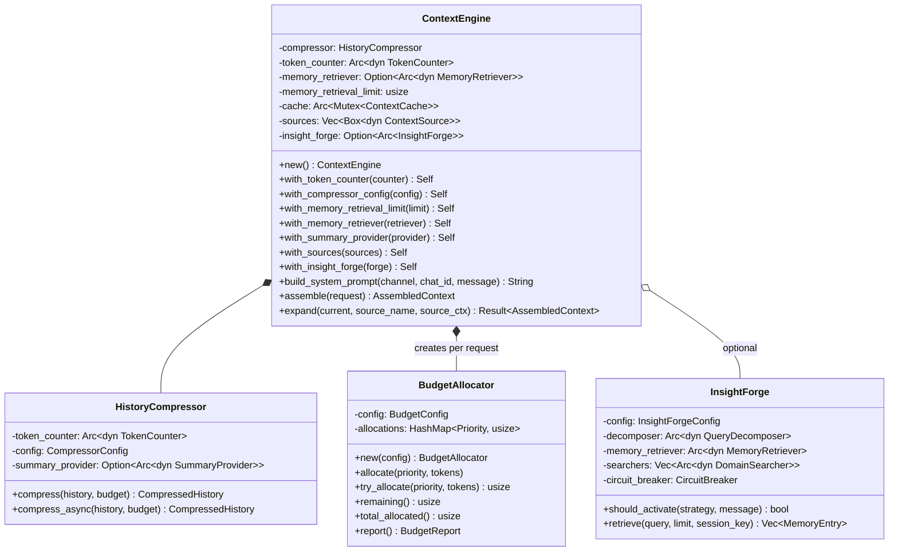
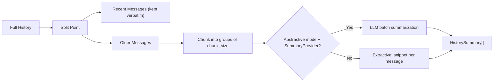
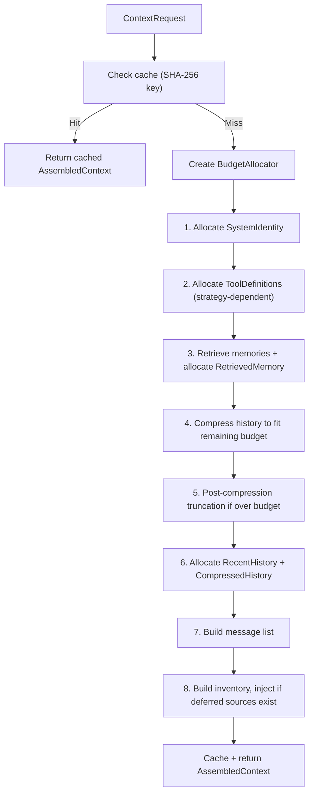
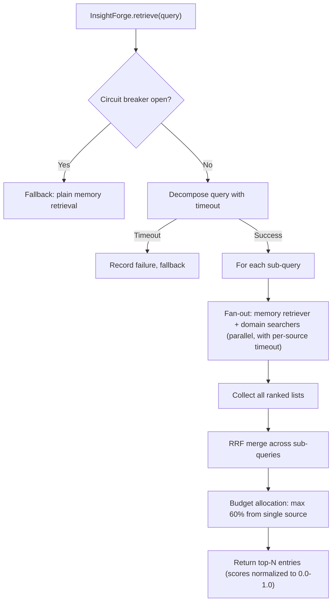

# Layer 3: Context Engine Crate

> `crates/context_engine/` -- Token budget management, context window optimization, history compression, memory retrieval, and system prompt assembly.

## Overview

The `context_engine` crate orchestrates everything that goes into the LLM context window. It manages a token budget across priority levels, compresses conversation history (extractive or LLM-abstractive), retrieves relevant memories via embeddings, assembles pluggable context sources into a system prompt, and caches assembled contexts with SHA-256 keys. The `InsightForge` subsystem provides multi-dimensional retrieval with query decomposition, parallel domain search, and Reciprocal Rank Fusion (RRF) merging.

## Dependencies

| Dependency | Purpose |
|---|---|
| `common` | `KlyntbotError`, `Result`, `ToolError`, helpers |
| `providers` | `Message`, `UserContent` types |
| `serde`, `serde_json` | Serialization |
| `tokio` | Async runtime, `Mutex` |
| `async-trait` | Async trait support |
| `sha2` | Context cache key hashing |
| `tiktoken-rs` | BPE token counting (cl100k_base) |
| `dashmap` | Concurrent caching |
| `futures-util` | Parallel source loading |
| `chrono` | TTL cache expiration |

## Module Structure

```
context_engine/
  assembler/         -- ContextEngine, AssembledContext, caching
  book_index/        -- Book/document index (GT-link, entity resolution)
  budget.rs          -- Token budget allocation
  history_compressor/ -- Extractive and abstractive history compression
  insight_forge/     -- Multi-dimensional retrieval (decomposition, domain search, RRF)
  inventory.rs       -- Context source inventory tracking
  memory_retriever.rs -- Memory retrieval trait
  operators/         -- Query operators (synthesizer, formulator, selector, reasoner)
  retrieval_planner/ -- Retrieval strategy classification
  source.rs          -- ContextSource trait
  summary_provider.rs -- SummaryProvider trait for abstractive compression
  token_counter.rs   -- Token estimation
  ttl_cache.rs       -- Simple TTL cache utility
```

## Architecture



## Token Counting

### `TokenCounter` Trait

```rust
pub trait TokenCounter: Send + Sync {
    fn estimate_text(&self, text: &str) -> usize;
}
```

Synchronous trait to avoid async overhead in the inner estimation loop.

### Implementations

| Implementation | Accuracy | Method |
|---|---|---|
| `CharTokenCounter` | Low (heuristic) | `text.len().div_ceil(4)` -- 4 chars per token |
| `TiktokenCounter` | High (BPE) | `cl100k_base` encoding via `tiktoken-rs` |

### Factory Functions

| Function | Description |
|---|---|
| `default_token_counter()` | Returns `CharTokenCounter` |
| `best_token_counter()` | Tries `TiktokenCounter`; falls back to `CharTokenCounter` with warning |

## Token Budget

### Priority Levels (Waterfall Order)

Content is allocated in priority order. Higher priority content gets budget first.

| Priority | Ordinal | Description |
|---|---|---|
| `SystemIdentity` | 0 | Core system prompt / identity |
| `ActiveTask` | 1 | Currently active task context |
| `ToolDefinitions` | 2 | JSON schemas for available tools |
| `RecentHistory` | 3 | Verbatim recent conversation messages |
| `RetrievedMemory` | 4 | Embedding-retrieved memories |
| `CompressedHistory` | 5 | Summarized older conversation history |
| `BootstrapPersona` | 6 | Persona bootstrapping instructions |
| `Skills` | 7 | Skill instructions and context |

### `BudgetConfig`

| Field | Default | Description |
|---|---|---|
| `total_context_window` | Model-dependent | Total context window tokens |
| `response_reserve_pct` | `0.15` (15%) | Reserved for model response generation |

Available input = `total_context_window * 0.85`.

### `BudgetAllocator`

Tracks allocations across priorities:

| Method | Description |
|---|---|
| `allocate(priority, tokens)` | Allocate up to `tokens`, capped at remaining budget. Warns at <15% remaining. |
| `try_allocate(priority, tokens)` | Returns how many tokens were actually allocated |
| `remaining()` | Tokens still available |
| `total_allocated()` | Sum across all priorities |
| `get(priority)` | Current allocation for a specific priority |
| `report()` | Full `BudgetReport` with per-priority breakdown |

## History Compression

### `HistoryCompressor`

Compresses conversation history to fit within a token budget while preserving the most recent messages verbatim.

### Strategy



### `CompressorConfig`

| Field | Default | Description |
|---|---|---|
| `snippet_length` | 200 | Max characters per extractive snippet |
| `mode` | `Extractive` | Compression mode |
| `chunk_size` | 5 | Messages per summary chunk |
| `min_recent_messages` | 4 | Always keep at least this many recent messages verbatim |

### `CompressorMode`

| Mode | Description |
|---|---|
| `Extractive` | No LLM call. Takes first sentence/snippet from each message. |
| `Abstractive` | LLM-generated summaries via `SummaryProvider`. Falls back to extractive per-chunk on error. |

### `CompressedHistory`

| Field | Type | Description |
|---|---|---|
| `summaries` | `Vec<HistorySummary>` | Summaries of older messages |
| `recent_messages` | `Vec<Message>` | Recent messages kept verbatim |
| `total_tokens` | `usize` | Estimated total tokens |

### `HistorySummary`

| Field | Type | Description |
|---|---|---|
| `content` | `String` | Summary text |
| `message_range` | `(usize, usize)` | Index range of original messages covered |
| `token_count` | `usize` | Estimated tokens |

### `SummaryProvider` Trait

```rust
#[async_trait]
pub trait SummaryProvider: Send + Sync {
    async fn summarize_batch(&self, segments: Vec<Vec<Message>>) -> Vec<Result<String, String>>;
}
```

Batch summarization -- individual segments may fail independently, allowing per-segment fallback to extractive.

## Memory Retrieval

### `MemoryRetriever` Trait

```rust
#[async_trait]
pub trait MemoryRetriever: Send + Sync {
    async fn retrieve(&self, query: &str, limit: usize) -> Vec<MemoryEntry>;
}
```

Implemented in higher layers (agent, storage) to plug in actual vector-database lookups.

### `MemoryEntry`

| Field | Type | Description |
|---|---|---|
| `id` | `String` | Unique identifier |
| `content` | `String` | Memory text |
| `score` | `f64` | Similarity score (0.0-1.0) |
| `source` | `MemorySource` | Origin of the memory |
| `raw_score` | `f64` | Pre-normalization score |

### `MemorySource`

| Variant | Description |
|---|---|
| `CognitiveFact` | Extracted semantic fact (FSRS-scored) |
| `ConversationRecall` | Past conversation message (time-decay scored) |
| `Domain { name }` | Domain-specific search result (notes, tasks, finance, graph) |

Memory entries are grouped by source in the assembled context:
1. `## Relevant Facts` (CognitiveFact)
2. `## Related Conversations` (ConversationRecall)
3. `## Related Information` (Domain)

## Context Sources

### `ContextSource` Trait

```rust
#[async_trait]
pub trait ContextSource: Send + Sync {
    fn name(&self) -> &str;
    fn priority(&self) -> u8;
    async fn provide(&self, ctx: &SourceContext) -> Option<String>;
    fn estimated_tokens(&self) -> usize { 500 }
    fn protected(&self) -> bool { false }
}
```

| Method | Default | Description |
|---|---|---|
| `name()` | -- | Human-readable name for logging |
| `priority()` | -- | Higher values appear earlier in prompt |
| `provide()` | -- | Produce a context section, or `None` to skip |
| `estimated_tokens()` | 500 | Token estimate for budget planning |
| `protected()` | `false` | If true, content is never pruned during compaction |

### `SourceContext`

Per-request metadata passed to context sources:

| Field | Type | Description |
|---|---|---|
| `channel` | `String` | Channel name (e.g., "telegram", "discord", "cli") |
| `chat_id` | `String` | Chat/conversation ID |
| `message` | `Option<String>` | Current user message |
| `intent_summary` | `Option<String>` | Condensed intent summary |
| `project_id` | `Option<String>` | Project ID for project-scoped sources |

## Context Inventory

### `ContextInventory`

Tracks which context sources are loaded, deferred, or available.

| Method | Description |
|---|---|
| `upsert(item)` | Add or update an inventory item |
| `tokens_loaded()` | Total tokens used by loaded sources |
| `has_deferred()` | Whether any sources were deferred |
| `deferred_sources()` | Names of deferred sources |
| `mark_loaded(name, tokens)` | Mark a deferred source as loaded |
| `format_for_prompt(budget_total, budget_remaining)` | Format as human-readable summary for system prompt |

### `ContextItemStatus`

| Status | Description |
|---|---|
| `Loaded { tokens_used }` | Content loaded into prompt |
| `Deferred { reason }` | Exists but deferred (e.g., budget constraints) |
| `Available { description }` | Available but not queried this assembly |

## ContextEngine (Assembler)

### Assembly Pipeline



### Strategy-Dependent Behavior

| Strategy | Tools Budget | Memory Retrieval |
|---|---|---|
| `DirectResponse` | 0 (no tools) | Yes |
| `ToolAssisted { max_iterations }` | Full tool token estimate | Yes |
| `AutonomousTask { max_iterations }` | Full tool token estimate | Yes |
| `Clarification { reason }` | 0 (no tools) | No (skipped) |

### `ContextRequest`

| Field | Type | Description |
|---|---|---|
| `message_text` | `String` | User's message (for memory lookup) |
| `history` | `Vec<Message>` | Full conversation history |
| `system_prompt` | `String` | System prompt to prepend |
| `strategy` | `ExecutionStrategy` | Chosen execution strategy |
| `tool_definitions` | `Vec<Value>` | Tool JSON schemas |
| `context_window` | `usize` | Model context window size |
| `session_key` | `Option<String>` | Session key for InsightForge circuit breaker |

### `AssembledContext`

| Field | Type | Description |
|---|---|---|
| `messages` | `Vec<Message>` | Ordered: system, memories, summaries, recent history |
| `token_count` | `usize` | Estimated total tokens |
| `budget_report` | `BudgetReport` | Per-priority allocation breakdown |
| `inventory` | `ContextInventory` | Loaded vs. deferred sources |
| `budget_remaining` | `usize` | Remaining token budget for expansion |
| `version` | `u32` | Incremented on each `expand()` call |

### Context Expansion

`expand(current, source_name, source_ctx)` loads a deferred context source:
1. Finds the named source in registered sources
2. Calls `provide()` to get content
3. Checks if tokens fit within remaining budget (rejects if insufficient)
4. Appends as system message, updates token count and inventory
5. Increments version number

### Caching

- Cache key: SHA-256 of system prompt, history length, last message, message text, strategy discriminant, tool count + first tool name, context window
- Deterministic across process restarts (unlike `DefaultHasher`)
- Configurable cache capacity (default: from `DEFAULT_CACHE_CAPACITY`)

### Builder Pattern

```rust
let engine = ContextEngine::new()
    .with_token_counter(best_token_counter())
    .with_compressor_config(config)
    .with_memory_retrieval_limit(10)
    .with_memory_retriever(retriever)
    .with_summary_provider(llm_summarizer)
    .with_sources(vec![source1, source2])
    .with_insight_forge(forge);
```

## InsightForge (Multi-Dimensional Retrieval)

### Overview

InsightForge decomposes complex queries into sub-queries, fans out parallel searches across the memory retriever and registered domain searchers, then merges results via Reciprocal Rank Fusion (RRF).

### `InsightForgeConfig`

| Field | Default | Description |
|---|---|---|
| `enabled` | `true` | Master enable/disable |
| `max_sub_queries` | 5 | Maximum sub-queries from decomposer |
| `per_source_limit` | 5 | Max results per source per sub-query |
| `total_limit` | 15 | Hard cap on total returned entries |
| `per_source_timeout_ms` | 800 | Timeout per domain source search |
| `decomposer_timeout_ms` | 2000 | Timeout for decomposition step |
| `circuit_breaker_threshold` | 3 | Failures before circuit trips |
| `circuit_breaker_cooldown_secs` | 300 | Seconds before circuit resets |

### Retrieval Flow



### Activation Criteria

`should_activate()` returns `true` when:
- Config `enabled` is `true`
- Strategy is not `Clarification`
- Message length >= 20 characters

### Traits

#### `QueryDecomposer`

```rust
#[async_trait]
pub trait QueryDecomposer: Send + Sync {
    async fn decompose(&self, query: &str, context: Option<&str>) -> Vec<String>;
}
```

Implementations:
- `HeuristicDecomposer` -- rule-based keyword extraction
- `LlmDecomposer` -- LLM-powered decomposition via `DecomposerLlm` trait
- `FallbackDecomposer` -- tries LLM first, falls back to heuristic

#### `DomainSearcher`

```rust
#[async_trait]
pub trait DomainSearcher: Send + Sync {
    fn domain_name(&self) -> &str;
    async fn search(&self, query: &str, limit: usize) -> Vec<MemoryEntry>;
}
```

Implemented by feature crates to provide domain-specific search (notes, tasks, finance, etc.).

#### `DecomposerLlm`

```rust
#[async_trait]
pub trait DecomposerLlm: Send + Sync {
    async fn decompose(&self, system: &str, user: &str) -> common::Result<String>;
}
```

### RRF Merge

Reciprocal Rank Fusion with `k = 60`:
- Each item in a ranked list receives score `1 / (60 + rank + 1)`
- Items appearing in multiple lists accumulate scores
- Deduplicated by ID (keeps highest original score)
- Re-normalized so top score = 1.0
- Budget allocation: no single source provides more than 60% of results

### Circuit Breaker

Per-session circuit breaker:
- Trips after `threshold` failures within a session
- When open, InsightForge falls back to plain memory retrieval
- Resets after `cooldown_secs`

## TTL Cache Utility

`TtlCache` -- single-value cache with time-based expiration for context sources.

```rust
let cache = TtlCache::new(60); // 60-second TTL
cache.set("computed value".to_string());
let value = cache.get(); // Some("computed value") if not expired
```

Uses `std::sync::Mutex` (not tokio) since the critical section is CPU-only.

## Constants

| Constant | Value | Location |
|---|---|---|
| `DEFAULT_MEMORY_RETRIEVAL_LIMIT` | 5 | `assembler/types.rs` |
| `DEFAULT_SNIPPET_LENGTH` | 200 chars | `history_compressor/types.rs` |
| `DEFAULT_CACHE_CAPACITY` | Module-level | `assembler/cache.rs` |
| `LOW_BUDGET_THRESHOLD` | 0.15 (15%) | `budget.rs` |
