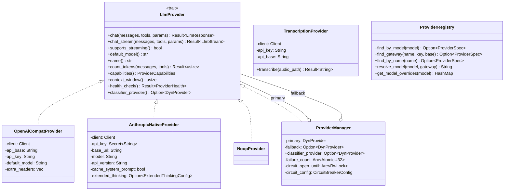
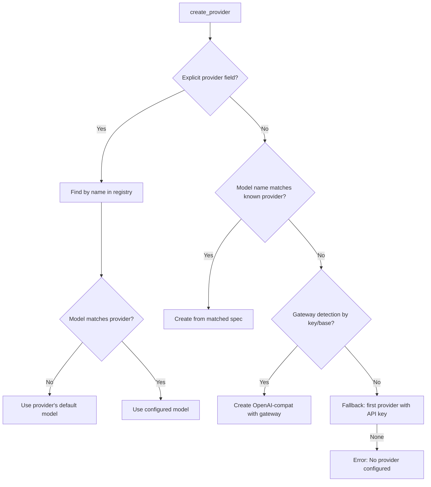
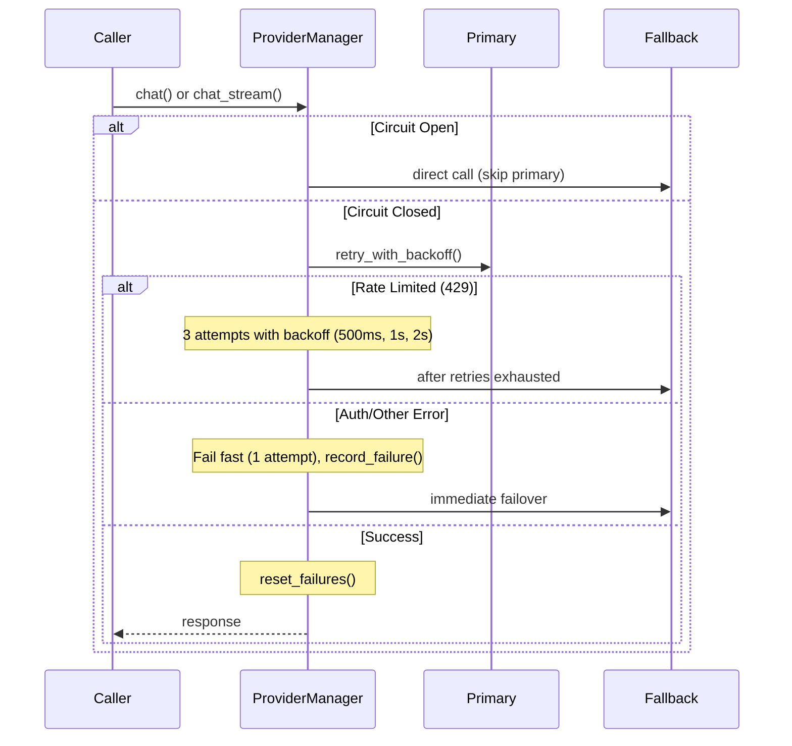

# Layer 3: Providers Crate

> `crates/providers/` -- LLM provider abstraction, adapters, streaming, failover, and registry.

## Overview

The `providers` crate is the unified interface between Klyntbot and all LLM APIs. It defines the `LlmProvider` trait and ships concrete adapters for Anthropic (native Messages API), OpenAI-compatible endpoints (covering OpenAI, DeepSeek, Gemini, Groq, Zhipu, DashScope, Moonshot, MiniMax, vLLM, OpenRouter, AiHubMix), a Groq Whisper transcription adapter, and a no-op stub. A static `ProviderRegistry` holds routing metadata for 12 providers, and a `ProviderManager` adds retry, failover, and circuit breaker logic on top.

## Dependencies

| Dependency | Purpose |
|---|---|
| `common` | `KlyntbotError`, `ProviderError`, `Result`, `build_http_client` |
| `config` | `Config`, `Secret<String>`, `ExtendedThinkingConfig` |
| `async-trait` | Async trait support |
| `reqwest` | HTTP client |
| `futures-util` | Stream combinators |
| `serde`, `serde_json` | Serialization |
| `base64` | Encoding |

## Architecture



## Core Trait: `LlmProvider`

Defined in `types.rs`. All provider adapters and the `ProviderManager` implement this async trait.

### Methods

| Method | Default | Description |
|---|---|---|
| `chat()` | -- | Non-streaming chat completion. Returns `LlmResponse`. |
| `chat_stream()` | Falls back to `chat()` wrapped as single chunk | Streaming chat completion. Returns `LlmStream`. |
| `supports_streaming()` | `false` | Whether native streaming is supported. |
| `default_model()` | -- | Default model identifier. |
| `name()` | -- | Provider name for logging. |
| `count_tokens()` | Char-based estimate (len/4) | Token counting. Anthropic native overrides with API call. |
| `capabilities()` | All false except `vision`, `streaming`, `parallel_tool_calls` | Capability flags for adaptive orchestration. |
| `context_window()` | `128_000` | Context window size for the current model. |
| `health_check()` | `ProviderHealth::Unknown` | Check provider availability. |
| `classifier_provider()` | `None` | Optional dedicated lightweight provider for classification. |

## Type Alias

```rust
pub type DynProvider = Arc<dyn LlmProvider>;
```

## Public Types

### Messages and Content

| Type | Description |
|---|---|
| `Message` | Tagged enum: `System`, `User`, `Assistant`, `Tool`. Convenience constructors: `Message::system()`, `::user()`, `::assistant()`, `::tool()`, `::user_multipart()`, `::assistant_with_content_and_tools()`. |
| `UserContent` | `Text(String)` or `MultiPart(Vec<ContentPart>)` |
| `ContentPart` | `Text { text }` or `ImageUrl { image_url }` |
| `ImageUrl` | `{ url: String }` |
| `ToolCallMessage` | `{ id, type, function: FunctionCall }` |
| `FunctionCall` | `{ name, arguments: String }` (JSON string) |

### Request/Response

| Type | Description |
|---|---|
| `ChatParams` | `{ model, temperature, max_tokens, response_format }`. Builder pattern: `ChatParams::new("gpt-4o").with_temperature(0.7).with_max_tokens(4096)`. |
| `ResponseFormat` | Enum: `Text`, `JsonObject`, `JsonSchema { name, schema }` |
| `LlmResponse` | `{ content, tool_calls, finish_reason, usage, reasoning_content }` |
| `ToolCall` | `{ id, name, arguments: Value }` |
| `Usage` | `{ prompt_tokens, completion_tokens, total_tokens, cache_read_tokens, cache_write_tokens }` |
| `ProviderCapabilities` | Flags: `extended_thinking`, `structured_outputs`, `prompt_caching`, `native_token_counting`, `vision`, `streaming`, `tool_choice_required`, `parallel_tool_calls` |
| `ProviderHealth` | Enum: `Healthy`, `Degraded(String)`, `Unhealthy(String)`, `Unknown` |

### Streaming

| Type | Description |
|---|---|
| `LlmStream` | `Pin<Box<dyn Stream<Item = Result<LlmStreamChunk>> + Send>>` |
| `LlmStreamChunk` | `{ content, tool_call_delta, is_final, finish_reason, reasoning_content }` |
| `ToolCallDelta` | `{ index, id, name, arguments }` -- accumulated across chunks |

## Supported Providers (Registry)

All providers are defined in the static `PROVIDERS` array in `registry.rs`.

| Name | Type | Default Model | Context Window | API Base |
|---|---|---|---|---|
| `openrouter` | Gateway | `anthropic/claude-sonnet-4` | 128K (default) | `https://openrouter.ai/api/v1` |
| `aihubmix` | Gateway | `gpt-4o` | 128K (default) | `https://aihubmix.com/v1` |
| `anthropic` | Standard | `claude-sonnet-4-20250514` | 200K (native) | `https://api.anthropic.com/v1` |
| `openai` | Standard | `gpt-4o` | 8K-200K (model-dependent) | `https://api.openai.com/v1` |
| `deepseek` | Standard | `deepseek-chat` | 128K (default) | `https://api.deepseek.com/v1` |
| `gemini` | Standard | `gemini-2.0-flash` | 128K (default) | `https://generativelanguage.googleapis.com/v1` |
| `zhipu` | Standard | `glm-4-flash` | 128K (default) | `https://open.bigmodel.cn/api/paas/v4` |
| `dashscope` | Standard | `qwen-plus` | 128K (default) | `https://dashscope.aliyuncs.com/compatible-mode/v1` |
| `moonshot` | Standard | `moonshot-v1-8k` | 128K (default) | `https://api.moonshot.ai/v1` |
| `minimax` | Standard | `abab6.5s-chat` | 128K (default) | `https://api.minimax.io/v1` |
| `vllm` | Local | `default` | 128K (default) | `http://localhost:8000/v1` |
| `groq` | Auxiliary | `llama-3.3-70b-versatile` | 128K (default) | `https://api.groq.com/openai/v1` |

### Provider Resolution Order (factory.rs)



### Model Name Resolution

`ProviderRegistry::resolve_model()` handles automatic prefixing:

- **Anthropic/OpenAI**: no prefix needed (e.g., `claude-opus-4`, `gpt-4o`)
- **DeepSeek**: prefixed as `deepseek/deepseek-chat`
- **Gemini**: prefixed as `gemini/gemini-pro`
- **Gateways**: gateway prefix applied (e.g., `openrouter/claude-opus-4`); `aihubmix` strips existing prefix first

### Per-Model Overrides

`ProviderRegistry::get_model_overrides()` returns parameter overrides for specific models. Currently: Kimi K2.5 requires `temperature >= 1.0`.

## Adapter Implementations

### `OpenAiCompatProvider`

- Covers all OpenAI-compatible APIs (OpenAI, DeepSeek, Groq, Zhipu, DashScope, Moonshot, MiniMax, vLLM, OpenRouter, AiHubMix)
- Uses Bearer token auth
- Supports `extra_headers` for provider-specific headers
- Context window lookup by model prefix (`model_context_window()`)
- Capabilities: `structured_outputs: true`
- Health check: `GET /models` endpoint with 5s timeout
- Streaming via SSE (no `event:` lines, only `data:` lines)

### `AnthropicNativeProvider`

- Direct Anthropic Messages API (not OpenAI-compat)
- Uses `x-api-key` header + `anthropic-version` header
- **Native features**: prompt caching (`cache_control: ephemeral`), native token counting via `/v1/messages/count_tokens`, extended thinking (`thinking` block)
- Capabilities: all true (extended_thinking, structured_outputs, prompt_caching, native_token_counting, vision, streaming, tool_choice_required, parallel_tool_calls)
- Context window: 200K
- Message format conversion: OpenAI-style messages to Anthropic content blocks; tool results wrapped as `user` role with `tool_result` content blocks
- Tool schema conversion: OpenAI `{ type: function, function: { name, description, parameters } }` to Anthropic `{ name, description, input_schema }`
- Structured output: `JsonSchema` injects a synthetic tool and forces `tool_choice`; `JsonObject` prepends a system instruction
- SSE streaming uses named events (`content_block_start`, `content_block_delta`, `message_delta`, etc.)

### `TranscriptionProvider`

- Voice transcription via Groq Whisper API
- Uses `whisper-large-v3` model
- Multipart form upload with MIME type detection from file extension
- Supported formats: mp3, wav, m4a, webm, flac, mp4, mpeg/mpga (defaults to ogg)

### `NoopProvider`

- Stub for unconfigured state
- All `chat()` calls return a configuration error
- Health check returns `Unhealthy`
- Allows the app to boot into setup wizard without panicking

## Streaming Infrastructure (`streaming.rs`)

The `sse_chunk_stream()` function provides shared SSE parsing for both adapters:

```rust
pub fn sse_chunk_stream<F>(response: reqwest::Response, parser: F) -> LlmStream
```

- Line-buffers the byte stream
- Parses `event:` and `data:` lines
- Calls the provider-specific `parser(event_type, data)` for each event
- Parser returns `Ok(Some(chunk))` to emit, `Ok(None)` to skip, `Err(e)` to propagate

## ProviderManager (Failover + Circuit Breaker)

`ProviderManager` wraps a primary and optional fallback provider with resilience logic.

### Behavior



### Circuit Breaker

- Opens after `failure_threshold` consecutive failures (default: 5)
- Stays open for `reset_timeout_secs` (default: 60s)
- When open, all calls go directly to fallback (primary is skipped)
- After timeout, circuit closes and primary is tried again
- `OnCircuitOpen` callback for external persistence of circuit state
- `restore_circuit_state()` restores state from persisted UTC deadline on app restart

### Public API

| Method | Description |
|---|---|
| `ProviderManager::new(primary, fallback, classifier)` | Create with default circuit breaker config |
| `ProviderManager::with_config(primary, fallback, classifier, config)` | Create with custom circuit breaker config |
| `set_circuit_open_callback(callback)` | Attach persistence callback |
| `restore_circuit_state(open_until_utc)` | Restore from persisted deadline |
| `check_health()` | Returns `(primary_health, Option<fallback_health>)` |

## Factory Functions

| Function | Description |
|---|---|
| `create_provider(config)` | Create single provider from config (resolution order above) |
| `create_provider_with_failover(config)` | Wrap in `ProviderManager` if fallback configured |
| `create_provider_with_failover_full(config)` | Also returns the `Arc<ProviderManager>` for callback attachment |
| `create_cognitive_provider(config)` | Provider for background cognitive tasks (uses `config.cognitive.*` settings) |
| `cognitive_chat_params(config, default_max_tokens)` | Build `ChatParams` for cognitive LLM calls |

## Error Handling

`map_http_error(status_code, body, provider_name)` centralizes HTTP status to error mapping:

| Status | Error |
|---|---|
| 429 | `ProviderError::RateLimited { provider, retry_after }` |
| 401/403 | `ProviderError::AuthFailed { provider, config_key }` |
| Other | `ProviderError::InvalidResponse(...)` |

Retry-after extraction parses `retry_after` from JSON body (top-level or nested under `error`).

## Constants

- `DEFAULT_CONTEXT_WINDOW`: 128,000 tokens
- `ANTHROPIC_CONTEXT_WINDOW`: 200,000 tokens
- `DEFAULT_ANTHROPIC_VERSION`: `"2023-06-01"`
