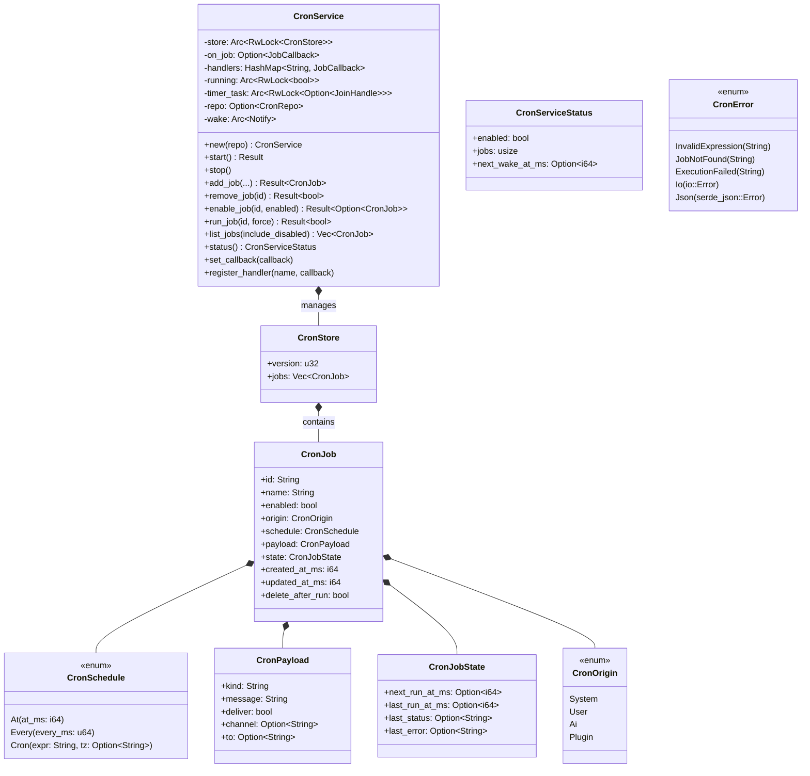
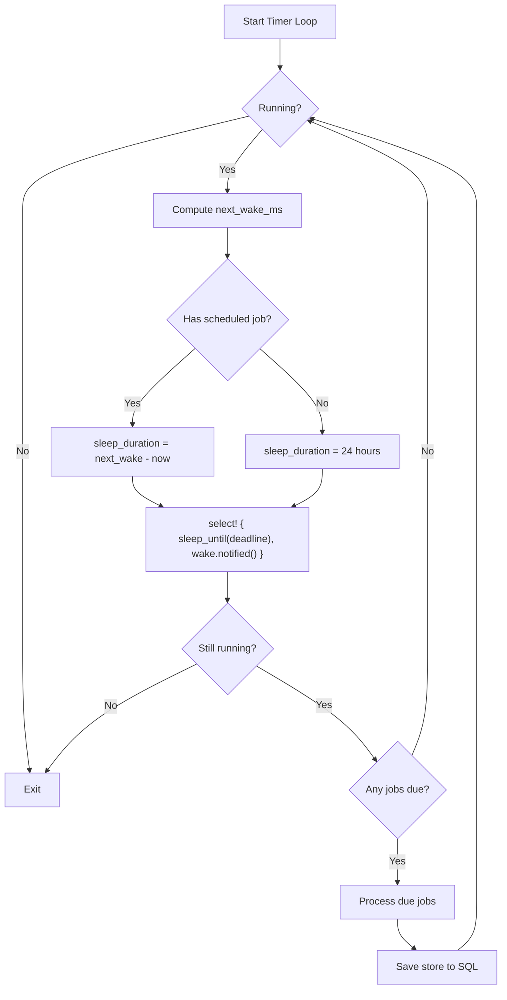
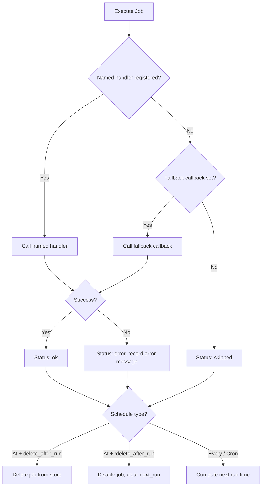

# Layer 3: Scheduling Crate

> `crates/scheduling/` -- Cron job scheduling with SQL persistence, named handlers, and deadline-driven timer loop.

## Overview

The `scheduling` crate provides `CronService`, a job scheduler that supports one-shot (`At`), recurring interval (`Every`), and cron expression (`Cron`) schedule types. Jobs are persisted to SQLite via `storage::CronRepo` and executed in a tokio-spawned timer loop that sleeps precisely until the next job deadline. A `Notify`-based wake mechanism ensures the timer recalculates when jobs are added, modified, or removed.

## Dependencies

| Dependency | Purpose |
|---|---|
| `common` | `KlyntbotError`, `Result` |
| `storage` | `CronRepo`, `CronJobRow` |
| `cron` | Cron expression parsing |
| `chrono`, `chrono-tz` | Timestamps and timezone support |
| `uuid` | Job ID generation |
| `tokio` | Async runtime, timers, `RwLock`, `Notify` |
| `thiserror` | Error derivation |
| `serde`, `serde_json` | Serialization |

## Architecture



## Public Types

### `CronSchedule`

Tagged enum (`#[serde(tag = "kind")]`) with three schedule types:

| Variant | Fields | Description |
|---|---|---|
| `At` | `at_ms: i64` | One-time execution at a specific UTC timestamp (ms) |
| `Every` | `every_ms: u64` | Recurring execution at fixed intervals (ms) |
| `Cron` | `expr: String, tz: Option<String>` | Cron expression (6-field: sec min hour day month dow) with optional timezone |

Timezone support uses `chrono-tz` for named timezones (e.g., `America/New_York`, `Asia/Tokyo`). Invalid timezone strings fall back to UTC with a warning.

### `CronPayload`

Defines what happens when a job fires:

| Field | Type | Default | Description |
|---|---|---|---|
| `kind` | `String` | `"agent_turn"` | Payload type |
| `message` | `String` | `""` | Message content to deliver or process |
| `deliver` | `bool` | `false` | Whether to deliver the response to a channel |
| `channel` | `Option<String>` | `None` | Target channel (e.g., `"telegram"`) |
| `to` | `Option<String>` | `None` | Target chat/user ID |

### `CronOrigin`

Identifies who created the job:
- `System` -- built-in system jobs
- `User` -- user-created via UI/command
- `Ai` -- AI-created via tool call
- `Plugin` -- plugin-created

### `CronJobState`

Runtime state tracked per-job:

| Field | Type | Description |
|---|---|---|
| `next_run_at_ms` | `Option<i64>` | Next scheduled execution time (UTC ms) |
| `last_run_at_ms` | `Option<i64>` | Last execution time |
| `last_status` | `Option<String>` | `"ok"`, `"error"`, or `"skipped"` |
| `last_error` | `Option<String>` | Error message from last failed execution |

### `CronJob`

Complete job definition. All serialization uses `#[serde(rename_all = "camelCase")]`.

### `CronServiceStatus`

Snapshot of service state: `{ enabled, jobs, next_wake_at_ms }`.

### `CronError`

Cron-specific errors. Converts to `KlyntbotError::Cron(String)` via `From`.

| Variant | Description |
|---|---|
| `InvalidExpression` | Invalid cron expression syntax |
| `JobNotFound` | Job ID not found |
| `ExecutionFailed` | Callback returned an error |
| `Io` | File I/O error |
| `Json` | JSON serialization error |

## `JobCallback`

```rust
pub type JobCallback = Arc<dyn Fn(&CronJob) -> Result<Option<String>> + Send + Sync>;
```

Callback type for job execution. Returns `Ok(Some(response))` on success or `Err` on failure.

## CronService

### Construction and Setup

```rust
let mut service = CronService::new(repo);
service.set_callback(fallback_callback);           // generic fallback handler
service.register_handler("daily-review", handler); // named handler for specific job name
service.start().await?;
```

### Timer Loop



Key design points:
- Uses `tokio::time::sleep_until()` for precise deadline-driven scheduling (no polling)
- `Notify` wakes the loop immediately when jobs are added/modified/removed
- `tokio::select!` allows early wake from both timer and notify

### Job Execution Flow



### Public API

| Method | Description |
|---|---|
| `new(repo)` | Create service backed by SQL `CronRepo` |
| `start()` | Load from SQL, recompute schedules, start timer loop |
| `stop()` | Set running=false, abort timer task |
| `set_callback(callback)` | Set fallback execution callback |
| `register_handler(name, callback)` | Register named handler (checked first during execution) |
| `add_job(name, schedule, message, deliver, channel, to, delete_after_run, origin)` | Add a new job, auto-generates UUID-based ID |
| `remove_job(job_id)` | Remove by ID, returns whether job existed |
| `enable_job(job_id, enabled)` | Enable/disable; recomputes next_run on enable, clears on disable |
| `run_job(job_id, force)` | Manually execute; `force=true` runs even if disabled |
| `list_jobs(include_disabled)` | List jobs sorted by next_run_at_ms |
| `status()` | Returns `CronServiceStatus` snapshot |

## Persistence (SQL)

### Store Module (`service/store.rs`)

- `load_store()`: Reads all rows from `CronRepo`, converts to domain `CronJob` objects
- `save_store()`: Upserts all in-memory jobs to SQL, deletes orphaned SQL rows not in memory
- Corrupt schedule JSON disables the job with an error log (never panics)
- Unknown `origin` values default to `User` with a warning

### Domain <-> SQL Conversion

`job_to_row()` and `row_to_job()` handle bidirectional conversion between `CronJob` and `CronJobRow`. Schedule and payload are serialized as JSON values.

## Schedule Computation

`compute_next_run(schedule, now_ms)` computes the next execution time:

| Schedule | Logic |
|---|---|
| `At { at_ms }` | Returns `Some(at_ms)` if in the future, `None` if past |
| `Every { every_ms }` | Returns `Some(now + every_ms)` |
| `Cron { expr, tz }` | Parses cron expression, computes next occurrence in the given timezone (UTC if unspecified or invalid) |

## Thread Safety

- `CronService` uses `Arc<RwLock<_>>` for shared mutable state
- Timer loop runs as a detached `tokio::spawn` task
- `Notify` provides a lock-free wake mechanism
- All public methods use async locking (no blocking)
