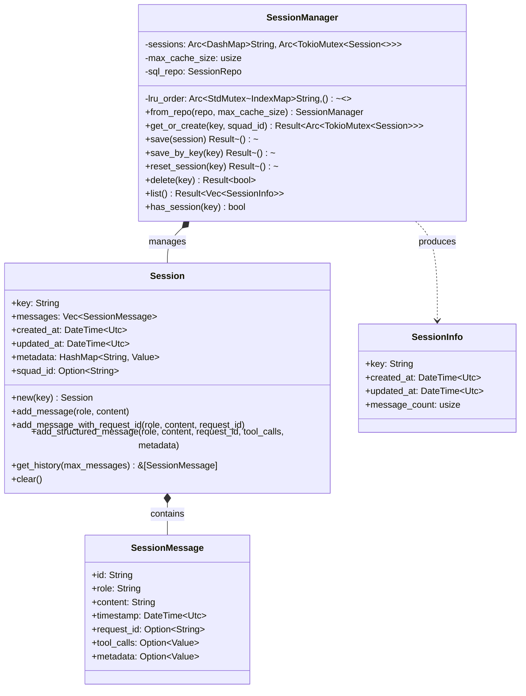
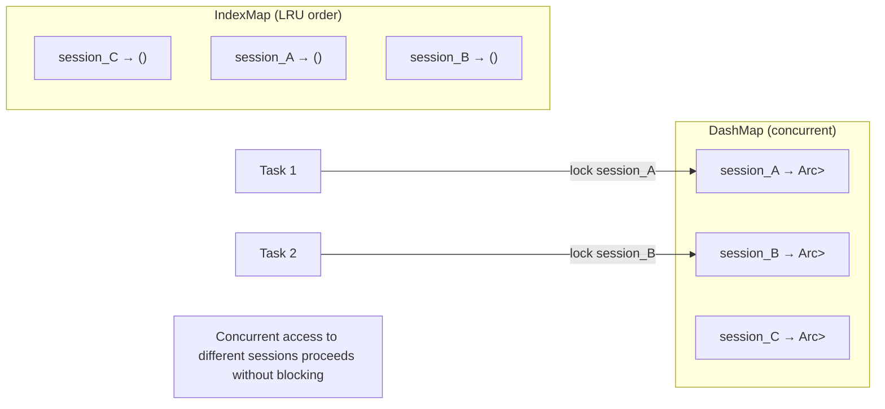
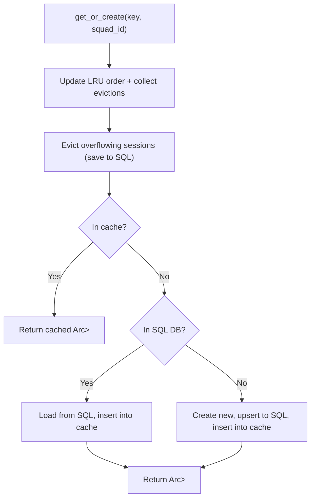

# Layer 3: Session Crate

> `crates/session/` -- Conversation session persistence with SQL-backed storage and in-memory LRU cache.

## Overview

The `session` crate provides `SessionManager`, a concurrent, SQL-backed session store for conversation history. It maintains an in-memory LRU cache of active sessions, lazily loading from SQLite and evicting least-recently-used sessions when the cache is full. Each session is independently locked via per-key `tokio::Mutex`, eliminating global write lock contention. `SessionManager` is `Clone + Send + Sync` -- all clones share the same underlying state, so no `Arc<RwLock<SessionManager>>` wrapper is needed.

## Dependencies

| Dependency | Purpose |
|---|---|
| `common` | `KlyntbotError`, `Result` |
| `storage` | `SessionRepo`, `SessionRow`, `SessionMessageRow` |
| `dashmap` | Concurrent per-session map |
| `indexmap` | O(1) LRU ordering |
| `serde`, `serde_json` | Serialization |
| `chrono` | Timestamps |
| `uuid` | Message ID generation (UUID v4) |
| `tokio` | Async mutex |

## Architecture



## Public Types

### `Session`

A conversation session containing an ordered list of messages.

| Field | Type | Description |
|---|---|---|
| `key` | `String` | Session key (typically `channel:chat_id`) |
| `messages` | `Vec<SessionMessage>` | Ordered message history |
| `created_at` | `DateTime<Utc>` | Creation timestamp |
| `updated_at` | `DateTime<Utc>` | Last modification timestamp |
| `metadata` | `HashMap<String, Value>` | Extensible session metadata |
| `squad_id` | `Option<String>` | Multi-persona squad ID (when set, uses squad execution) |

#### Methods

| Method | Description |
|---|---|
| `Session::new(key)` | Create empty session |
| `add_message(role, content)` | Append message with auto-generated UUID v4 ID |
| `add_message_with_request_id(role, content, request_id)` | Append with optional correlation ID |
| `add_structured_message(role, content, request_id, tool_calls, metadata)` | Full structured append with tool call and metadata JSON |
| `get_history(max_messages)` | Return the last N messages as a slice |
| `clear()` | Remove all messages |

### `SessionMessage`

A single message within a session.

| Field | Type | Description |
|---|---|---|
| `id` | `String` | UUID v4 identifier |
| `role` | `String` | Message role: `system`, `user`, `assistant`, `tool` |
| `content` | `String` | Message content |
| `timestamp` | `DateTime<Utc>` | When the message was created |
| `request_id` | `Option<String>` | Correlation ID for request tracing |
| `tool_calls` | `Option<Value>` | Structured tool call data (function name, arguments, result) |
| `metadata` | `Option<Value>` | Extensible metadata (reasoning, content parts, etc.) |

### `SessionInfo`

Lightweight summary for session listing.

| Field | Type | Description |
|---|---|---|
| `key` | `String` | Session key |
| `created_at` | `DateTime<Utc>` | Creation time |
| `updated_at` | `DateTime<Utc>` | Last update time |
| `message_count` | `usize` | Number of messages |

## SessionManager

### Construction

```rust
let manager = SessionManager::from_repo(repo, max_cache_size).await;
```

`max_cache_size` controls the in-memory LRU cache capacity. When exceeded, the least-recently-used session is persisted to SQL and evicted.

### Concurrency Model



- **DashMap**: Concurrent read/write access to sessions by key. No global lock needed.
- **Per-session TokioMutex**: Callers lock individual sessions. Different sessions can be modified concurrently.
- **IndexMap LRU**: `std::sync::Mutex<IndexMap>` tracks access order. O(1) promote (shift_remove + insert) and evict (shift_remove_index(0)). Held only briefly during LRU bookkeeping.

### `get_or_create` Flow



### Persistence

`save()` persists a session to SQL:
1. Upserts session metadata (key, metadata JSON, squad_id)
2. Batch-inserts all messages (`ON CONFLICT DO NOTHING` for idempotency)
3. Checks message count against compaction threshold

### Compaction

When a session exceeds `COMPACTION_THRESHOLD` (1000 messages):
1. Inserts a system marker message: `[Session compacted: N older messages removed]`
2. Calls `compact_session()` to keep only the most recent `COMPACTION_KEEP` (500) messages
3. Compaction is automatic on every `save()` call

### Public API

| Method | Description |
|---|---|
| `from_repo(repo, max_cache_size)` | Create manager backed by SQL repository |
| `get_or_create(key, squad_id)` | Get or create session, returns `Arc<TokioMutex<Session>>` |
| `save(session)` | Persist session to SQL with auto-compaction |
| `save_by_key(key)` | Lock and persist by key |
| `reset_session(key)` | Remove from cache + delete from DB |
| `delete(key)` | Remove from cache + LRU + delete from DB |
| `has_session(key)` | Check if session is in the in-memory cache |
| `list()` | List all sessions from DB (sorted by `updated_at DESC`) |

## Session Keys

Session keys follow the format `channel:chat_id`, e.g.:
- `telegram:123456`
- `discord:guild_id:channel_id`
- `cli:local`
- `mcp:session_key`

## Constants

| Constant | Value | Description |
|---|---|---|
| `COMPACTION_THRESHOLD` | 1000 | Compact when message count exceeds this |
| `COMPACTION_KEEP` | 500 | Messages to retain after compaction |

## Thread Safety

`SessionManager` implements `Clone + Send + Sync`:
- All state is behind `Arc` wrappers
- `DashMap` is inherently concurrent
- `IndexMap` is behind `std::sync::Mutex` (held briefly)
- Individual sessions are behind `tokio::sync::Mutex`
