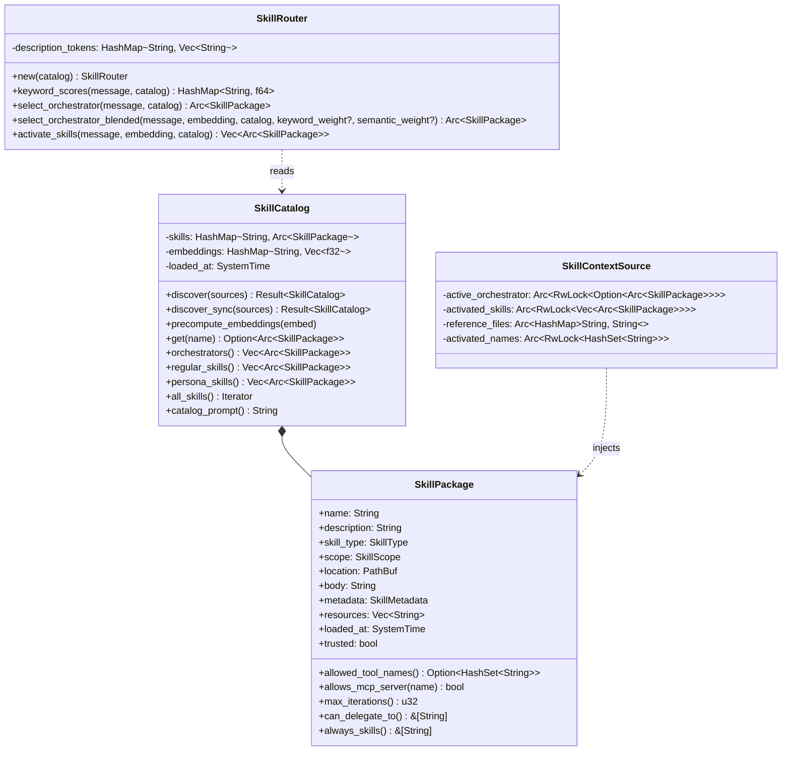
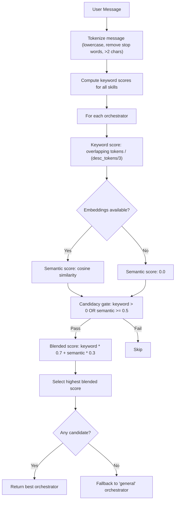
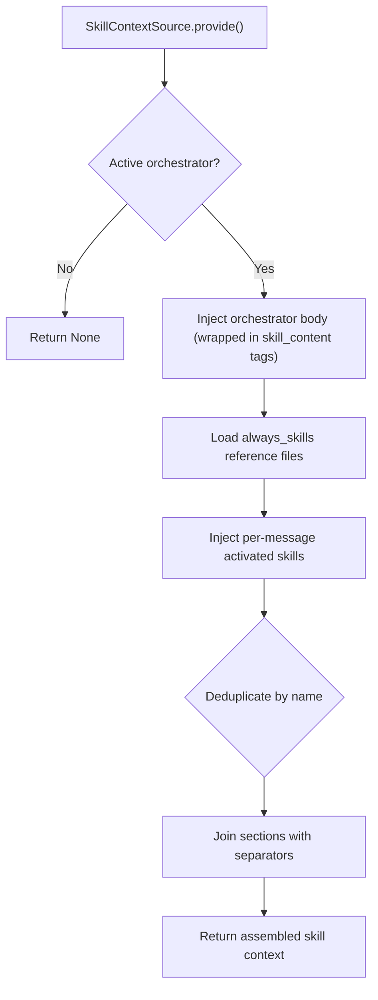

# Layer 3: Skill System Crate

> `crates/skill-system/` -- Skill discovery, parsing, routing, persona support, and context injection for the orchestrator skill architecture.

## Overview

The `skill-system` crate implements the Agent Skills specification for Klyntbot. It discovers skills from built-in sources, user directories, and project directories; parses `SKILL.md` files with YAML frontmatter; routes incoming messages to the best orchestrator using blended keyword + semantic scoring; activates relevant non-orchestrator skills; and injects skill instructions into the LLM context via the `ContextSource` trait from `context_engine`.

Five built-in orchestrator skills ship compiled into the binary: general, task-management, finance-management, automation, and communication. Each has a `SKILL.md` with instructions and a `references/` folder with detailed sub-skill documentation.

## Dependencies

| Dependency | Purpose |
|---|---|
| `common` | `KlyntbotError`, `Result`, `ConfigError`, `cosine_similarity` |
| `config` | Configuration types |
| `context_engine` | `ContextSource`, `SourceContext` traits |
| `serde`, `serde_json`, `serde_yaml` | YAML frontmatter + JSON metadata parsing |
| `tokio` | Async filesystem scanning, `RwLock` |
| `async-trait` | Async trait support |
| `chrono` | Timestamps |

## Module Structure

```
skill-system/
  context.rs    -- SkillContextSource (ContextSource implementation)
  discovery.rs  -- SkillCatalog, SkillSource, built-in skills, filesystem scanning
  lib.rs        -- Module re-exports
  parser.rs     -- SKILL.md YAML frontmatter parsing
  persona.rs    -- PERSONA.md parsing for persona skills
  router.rs     -- SkillRouter (keyword + semantic routing)
  types.rs      -- Core types (SkillPackage, SkillType, SkillCatalog, etc.)
```

## Architecture



## Public Types

### `SkillType`

| Variant | Description |
|---|---|
| `Skill` | Regular skill (activated per-message based on relevance) |
| `Orchestrator` | Top-level orchestrator (exactly one active per message) |
| `Persona` | Persona skill (parsed from PERSONA.md) |

### `SkillScope`

Priority for shadowing: higher scope overrides lower.

| Variant | Priority | Description |
|---|---|---|
| `BuiltIn` | 0 (lowest) | Compiled into the binary |
| `User` | 1 | User's `~/.klyntbot/skills/` directory |
| `Project` | 2 (highest) | Project-local skills directory |

### `SkillPackage`

Complete parsed skill definition.

| Field | Type | Description |
|---|---|---|
| `name` | `String` | Skill identifier (kebab-case, max 64 chars) |
| `description` | `String` | Human-readable description (required) |
| `skill_type` | `SkillType` | Skill, Orchestrator, or Persona |
| `scope` | `SkillScope` | BuiltIn, User, or Project |
| `location` | `PathBuf` | Directory path or `builtin::{name}` |
| `body` | `String` | Markdown instructions (injected into context) |
| `metadata` | `SkillMetadata` | Parsed frontmatter metadata |
| `resources` | `Vec<String>` | Bundled files (`scripts/`, `references/`, `assets/`) |
| `loaded_at` | `SystemTime` | When the skill was loaded |
| `trusted` | `bool` | `true` for BuiltIn and User scopes |

#### Key Methods

| Method | Description |
|---|---|
| `allowed_tool_names()` | Returns `None` (all tools) if `tools` field omitted; `Some(set)` with `ask_user` always included when explicit |
| `allows_mcp_server(name)` | Checks `mcp_tools` field: `["*"]` allows all, `[]` denies all |
| `max_iterations()` | Max ReAct loop iterations (default: 10) |
| `can_delegate_to()` | Skills this orchestrator can delegate to |
| `always_skills()` | Reference files always loaded with this orchestrator |

### `SkillMetadata`

| Field | Type | Description |
|---|---|---|
| `license` | `Option<String>` | License identifier |
| `compatibility` | `Option<String>` | Compatibility version |
| `custom` | `HashMap<String, Value>` | Custom metadata (excludes `klyntbot` key) |
| `klyntbot` | `Option<KlyntbotMeta>` | Klyntbot-specific metadata |

### `KlyntbotMeta`

| Field | Type | Default | Description |
|---|---|---|---|
| `skill_type` | `SkillType` | `Skill` | Skill type (from `type` YAML field) |
| `tools` | `Option<Vec<String>>` | `None` (all) | Allowed tool names |
| `mcp_tools` | `Vec<String>` | `[]` | Allowed MCP server names (`["*"]` = all) |
| `can_delegate_to` | `Vec<String>` | `[]` | Delegation targets |
| `max_iterations` | `Option<u32>` | `None` (10) | ReAct loop limit |
| `always_skills` | `Vec<String>` | `[]` | Always-loaded reference files |
| `invokes` | `Vec<String>` | `[]` | Skills this one may chain to |

### `SkillChange`

Enum for tracking catalog updates: `Added(name)`, `Removed(name)`, `Updated(name)`.

### `EmbedFn`

```rust
pub type EmbedFn = Arc<dyn Fn(&str) -> common::Result<Vec<f32>> + Send + Sync>;
```

Callback for embedding text, avoiding a dependency on the `cognitive` crate.

## SKILL.md Format

Skills follow the Agent Skills specification with YAML frontmatter:

```markdown
---
name: task-management
description: >
  Create, organize, and track tasks using OKR+PARA.
  Use when the user mentions todos or tasks.
metadata:
  author: klyntbot
  version: "1.0.0"
  klyntbot:
    type: orchestrator
    tools: [tasks, project, area]
    mcp_tools: ["google-calendar"]
    can_delegate_to: [finance-management]
    max_iterations: 12
    always_skills: [todo, daily-planner]
    invokes: [productivity]
---

You are the task management specialist.

## Behavior
- Create tasks efficiently
```

### Parser Features (`parser.rs`)

- **Lenient YAML**: Fixes unquoted colons in values (common cross-client issue)
- **Lenient name validation**: Warns but loads skills with non-conforming names (uppercase, special chars, length > 64)
- **Description required**: Skills without a description are rejected
- **Name/directory match**: Warns when skill name does not match directory name

## Skill Discovery

### `SkillSource`

| Variant | Description |
|---|---|
| `BuiltIn(Vec<(String, String)>)` | Compiled-in skills (name, SKILL.md content) |
| `Directory(PathBuf, SkillScope)` | Filesystem directory to scan |
| `Personas(Vec<(String, String)>)` | Persona skill files (name, PERSONA.md content) |
| `Inline(...)` | Test-only source |

### Built-in Skills

Five orchestrator skills compiled via `include_str!`:

| Skill | Type | Description |
|---|---|---|
| `general` | Orchestrator | General-purpose assistant, greetings, unmatched requests |
| `task-management` | Orchestrator | Tasks, projects, areas, OKR+PARA, planning, reviews |
| `finance-management` | Orchestrator | Expenses, budgets, financial goals |
| `automation` | Orchestrator | Cron jobs, automation workflows |
| `communication` | Orchestrator | Messaging, notifications |

### Built-in Reference Files

21 reference files compiled via `include_str!`, organized by skill:

- **general**: search, skill-creator, browser, memory, summarize
- **task-management**: todo, daily-planner, task-decompose, project-management, weekly-review, retrospective, reports
- **finance-management**: budgeting, spending-intelligence, analytics-actions, fire-planning, portfolio-analysis, financial-health
- **automation**: cron
- **communication**: messaging, notification

### Filesystem Scanning

`SkillCatalog::discover()` scans directories with safety bounds:

| Limit | Value | Description |
|---|---|---|
| `MAX_SCAN_DEPTH` | 4 | Maximum directory nesting |
| `MAX_SCAN_DIRS` | 2000 | Maximum directories to scan |

Skipped directories: `node_modules`, `__pycache__`, `.venv`, `target`, `dist`, `build`, `.next`, and any directory starting with `.`.

Bundled resources (`scripts/`, `references/`, `assets/` subdirectories) are enumerated at discovery time.

### Scope Shadowing

When the same skill name exists in multiple scopes, higher-priority scope wins:
- Project > User > BuiltIn
- A user's `search` skill overrides the built-in `search`

### `SkillCatalog`

| Method | Description |
|---|---|
| `discover(sources)` | Async discovery (supports filesystem scanning) |
| `discover_sync(sources)` | Sync discovery (built-in + inline only) |
| `precompute_embeddings(embed)` | Compute description embeddings for semantic matching |
| `get(name)` | Lookup by name |
| `orchestrators()` | All trusted orchestrator skills |
| `regular_skills()` | All trusted non-orchestrator skills |
| `persona_skills()` | All trusted persona skills |
| `all_skills()` | Iterator over all skills |
| `catalog_prompt()` | XML catalog for Tier 1 injection into system prompt |

### Catalog Prompt Format

Generated by `catalog_prompt()` for Tier 1 system prompt injection:

```xml
<available_skills>
  <skill name="automation" type="orchestrator" location="builtin::automation">
    <description>Cron jobs, automation workflows.</description>
  </skill>
  <skill name="search" type="skill" location="/home/user/.klyntbot/skills/search">
    <description>Web search and information retrieval.</description>
    <resources>
      <file>scripts/search.py</file>
      <file>references/api-docs.md</file>
    </resources>
  </skill>
</available_skills>
```

Persona skills are excluded from the catalog prompt.

## Skill Routing

### `SkillRouter`

Routes messages to the best orchestrator and activates relevant non-orchestrator skills using blended keyword + semantic scoring.

### Routing Flow



### Scoring Formula

```
blended_score = keyword_score * keyword_weight + semantic_score * semantic_weight
```

Default weights: `keyword_weight = 0.7`, `semantic_weight = 0.3`. These can be overridden per-request via optional `keyword_weight`/`semantic_weight` parameters on `select_orchestrator_blended()`, used by the autotuner to shadow-score routing with trial parameters.

- **Keyword score**: `min(1.0, hits / max(1.0, desc_tokens / 3.0))`
- **Semantic score**: Cosine similarity between query embedding and skill description embedding
- **Candidacy gate**: Requires `keyword_score > 0` OR `semantic_score >= 0.5`

### Skill Activation

`activate_skills()` selects non-orchestrator skills:
- Computes blended scores for all regular skills
- Filters by `SKILL_ACTIVATION_THRESHOLD` (0.4)
- Sorts by score descending
- Returns top `MAX_ACTIVATED_SKILLS` (3)

### Constants

| Constant | Value | Description |
|---|---|---|
| `GENERAL_SKILL_NAME` | `"general"` | Fallback orchestrator name |
| `SKILL_ACTIVATION_THRESHOLD` | 0.4 | Minimum blended score for skill activation |
| `MAX_ACTIVATED_SKILLS` | 3 | Maximum non-orchestrator skills activated per message |

### Stop Words

Common English stop words are filtered during tokenization to reduce false-positive matches:
`the`, `and`, `for`, `are`, `but`, `not`, `you`, `all`, `can`, `has`, ... (40+ words)

Words shorter than 3 characters are also filtered.

## MCP Tool Access Control

Each skill declares which MCP servers it can access via the `mcp_tools` field:

| Value | Meaning |
|---|---|
| `["*"]` | Access all MCP servers |
| `["google-calendar"]` | Access only google-calendar server |
| `[]` (default) | No MCP access |

Checked via `SkillPackage::allows_mcp_server(server_name)`.

## Context Injection

### `SkillContextSource`

Implements `context_engine::ContextSource` to inject skill instructions into the LLM system prompt.

| Property | Value |
|---|---|
| `name()` | `"skill_profile"` |
| `priority()` | 35 |
| `protected()` | `true` (never pruned during compaction) |

### Injection Behavior



### Progressive Disclosure (Agent Skills Spec)

The skill system implements three tiers of progressive disclosure:

| Tier | When | What |
|---|---|---|
| **Tier 1** | Always | XML catalog listing all available skills (via `catalog_prompt()`) |
| **Tier 2** | On activation | Full `SKILL.md` body injected via `<skill_content>` tags |
| **Tier 3** | On demand | Bundled resources listed as `<skill_resources>` with file paths |

### Deduplication

`SkillContextSource` tracks activated skill names per session via `HashSet`. Skills already injected are skipped on subsequent messages, preventing duplicate context.

### Reference File Resolution

Always-loaded skills are resolved from the reference files map using two key patterns:
1. `{skill_location}/references/{name}.md` (filesystem skills)
2. `builtin::{skill_name}/references/{name}.md` (built-in skills)

## Persona Skills

### `ParsedPersonaSkill`

| Field | Type | Description |
|---|---|---|
| `name` | `String` | Persona identifier |
| `description` | `String` | Human-readable description |
| `version` | `String` | Version (default: "1.0.0") |
| `icon` | `String` | Display icon |
| `domains` | `Vec<String>` | Applicable domains (e.g., ["finance", "productivity"]) |
| `metadata` | `PersonaSkillMetadata` | Persona-specific metadata |
| `body` | `String` | Persona instructions |

### `PersonaSkillMetadata`

| Field | Type | Default | Description |
|---|---|---|---|
| `expertise_areas` | `Vec<String>` | `[]` | Areas of expertise |
| `analysis_frameworks` | `Vec<String>` | `[]` | Analytical frameworks used |
| `questioning_style` | `String` | `"analytical"` | How the persona asks questions |
| `tone` | `String` | `"neutral"` | Communication tone |
| `cognitive_bias` | `String` | `"balanced"` | Cognitive orientation |
| `references` | `Vec<String>` | `[]` | Reference file names |

Persona skills are parsed from `PERSONA.md` files via `parse_persona_skill()` and registered as `SkillType::Persona`. They are excluded from the XML catalog prompt and from routing, but are discoverable via `SkillCatalog::persona_skills()`.

## Public Re-exports from `lib.rs`

```rust
pub use persona::{parse_persona_skill, ParsedPersonaSkill, PersonaSkillMetadata};
```

All other types are accessed via their respective modules:
- `skill_system::types::*`
- `skill_system::discovery::*`
- `skill_system::router::*`
- `skill_system::context::*`
- `skill_system::parser::*`
