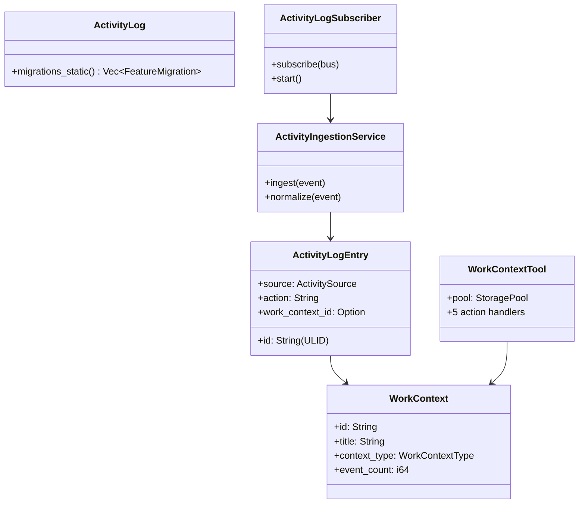

# Layer 4: Activity Log (`crates/activity-log/`)

## Overview

The `activity-log` crate provides a unified activity logging system that normalizes events from multiple sources (OS windows, browser, terminal, chat, tool calls, file system, calendar, IDE, notes, domain events, tasks, focus sessions) into a common `ActivityLogEntry` format. It also implements work context inference -- automatically grouping related activities into coherent "work contexts" -- and exposes a `WorkContextTool` for the agent.

## Dependencies

- `common`, `cognitive`, `config`, `context_engine`, `storage`, `bus`, `tools-core`
- External: `chrono`, `sqlx`, `sha2`, `ulid`, `tokio-util`, `async-trait`

## Module Organization

```
crates/activity-log/src/
  lib.rs                    # ActivityLog struct + migrations + re-exports
  types.rs                  # ActivityLogEntry, ActivitySource, ActivityActor, WorkContext, etc.
  repo.rs                   # ActivityLogRepo (SQLite persistence)
  service.rs                # ActivityIngestionService (event processing)
  subscriber.rs             # ActivityLogSubscriber (DomainEventBus listener)
  normalizers.rs            # Event normalizer framework
  privacy.rs                # PrivacyFilter
  context_source.rs         # WorkContextSource (context engine integration)
  inference.rs              # Work context inference logic
  inference_loop.rs         # Background inference loop
  work_context_repo.rs      # WorkContextRepo
  work_context_tool.rs      # WorkContextTool (agent tool)
  work_resource_repo.rs     # WorkResourceRepo
  context_action_repo.rs    # ContextActionRepo
  context_resource_repo.rs  # ContextResourceRepo
  resource_edge_repo.rs     # ResourceEdgeRepo
```

## Key Types (`types.rs`)

### ActivityLogEntry
```rust
pub struct ActivityLogEntry {
    pub id: String,              // ULID for time-ordered IDs
    pub timestamp: DateTime<Utc>,
    pub source: ActivitySource,
    pub actor: ActivityActor,
    pub resource_type: Option<String>,
    pub resource_id: Option<String>,
    pub resource_name: Option<String>,
    pub action: String,
    pub content_preview: Option<String>,  // max 500 chars
    pub content_hash: Option<String>,     // SHA-256 for dedup
    pub metadata: Option<Value>,
    pub app_name: Option<String>,
    pub project_id: Option<String>,
    pub work_context_id: Option<String>,
    pub embedding_id: Option<String>,
    pub duration_secs: Option<i64>,
    pub session_key: Option<String>,
    pub is_sensitive: bool,
}
```

### ActivitySource (12 variants)
`OsWindow`, `Browser`, `Terminal`, `Chat`, `ToolCall`, `FileSystem`, `Calendar`, `Ide`, `Note`, `DomainEvent`, `Task`, `FocusSession`

### ActivityActor
User or agent identification for the activity.

### WorkContext
```rust
pub struct WorkContext {
    pub id: String,
    pub title: String,
    pub context_type: WorkContextType,
    pub status: WorkContextStatus,
    pub event_count: i64,
    pub total_duration_secs: i64,
    ...
}
```

### WorkContextType / WorkContextStatus
Context lifecycle types and states.

### ResourceEdge / WorkResource
Resource graph edges and nodes for tracking relationships between activities.

### ContextAssignment
Links an activity log entry to a work context.

## Event Normalizers (`normalizers.rs`)

Normalizer framework that converts diverse event types into `ActivityLogEntry`:

| Normalizer | Input | Description |
|-----------|-------|-------------|
| `WindowEventNormalizer` | `WindowEventInput` | OS window focus changes |
| `ChatMessageNormalizer` | `ChatMessageInput` | Chat messages (any channel) |
| `ToolCallNormalizer` | `ToolCallInput` | Agent tool invocations |
| `DomainEventNormalizer` | `DomainEvent` | Bus domain events |

All normalizers implement the `ActivityNormalizer` trait.

### `normalize_domain_event(event) -> Option<ActivityLogEntry>`
Converts domain events (task completed, focus session ended, etc.) into activity log entries.

## Services

### ActivityIngestionService (`service.rs`)
Central ingestion point that receives raw events, normalizes them, applies privacy filtering, and persists to the activity log.

### ActivityLogSubscriber (`subscriber.rs`)
Subscribes to `DomainEventBus` and feeds events into the ingestion service. Background task with graceful shutdown.

### PrivacyFilter (`privacy.rs`)
Filters sensitive content from activity entries before persistence. Configurable rules for content preview redaction.

## Work Context Inference (`inference.rs`, `inference_loop.rs`)

Automatically groups related activities into "work contexts" -- coherent units of work like "Working on PR #123" or "Researching auth patterns".

- Analyzes temporal proximity, resource overlap, and app/project patterns
- Background inference loop runs periodically
- Results stored via `WorkContextRepo`

## WorkContextTool (5 Actions)

| Action | Description |
|--------|-------------|
| `list` | List active work contexts with event counts and durations |
| `show` | Show context details with associated resources |
| `rename` | Rename a work context |
| `link_project` | Link a context to a project |
| `search` | Search contexts by query |

## Migrations

Single migration (version 1) creates the unified activity log tables.

```rust
pub struct ActivityLog;

impl ActivityLog {
    pub fn migrations_static() -> Vec<FeatureMigration> { ... }
}
```

Note: `ActivityLog` is not a `FeaturePackage` -- it provides migrations separately for flexibility.


