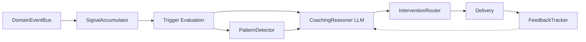

# Layer 4: Feature Coaching (`crates/feature-coaching/`)

## Overview

The `feature-coaching` crate implements a proactive intelligence engine that monitors domain events, accumulates behavioral signals, detects patterns, uses LLM-powered reasoning to decide interventions, and routes them through appropriate channels. It integrates with the focus session system to pause coaching during deep work and deliver consolidated debriefs afterward.

## Dependencies

- `common`, `bus`, `cognitive`, `storage`
- External: `chrono`, `serde`, `tokio`, `tokio-util`, `uuid`, `async-trait`

## Module Organization

```
crates/feature-coaching/src/
  lib.rs                     # Re-exports
  service.rs                 # CoachingService (background event loop)
  signal_accumulator/
    mod.rs                   # SignalAccumulator
    types.rs                 # Signal, TriggerCondition, TriggerFired
    conversion.rs            # DomainEvent -> Signal conversion
  pattern_detector.rs        # PatternDetector
  reasoner.rs                # CoachingReasonerHandler trait, CoachingDecision
  router.rs                  # InterventionRouter, rate limiting
  feedback.rs                # FeedbackTracker, PendingBehavioral
```

## Key Types and Traits

### CoachingService (`service.rs`)

Background service that subscribes to `DomainEventBus` and runs the full pipeline:

1. **Signal accumulation** -- push each event into `SignalAccumulator`
2. **Situation update** -- incrementally update `UserSituation` from events
3. **Trigger evaluation** -- check if accumulated signals fire any triggers
4. **Pattern detection** -- record triggers in `PatternDetector`
5. **LLM reasoning** -- call `CoachingReasonerHandler::reason()` for each trigger
6. **Intervention routing** -- route through `InterventionRouter` (with rate limiting)
7. **Feedback tracking** -- record delivery in `FeedbackTracker`

**Focus mode integration**: When `FocusSessionStarted` is received, triggers are queued instead of delivered. On `FocusSessionEnded`, a consolidated debrief is generated from queued triggers.

```rust
pub struct CoachingService {
    cancel_token: CancellationToken,
    task_handle: Option<JoinHandle<()>>,
}
```

### SignalAccumulator (`signal_accumulator/`)

Converts `DomainEvent` instances into typed signals, maintains sliding windows of recent signals, and evaluates trigger conditions.

- `push_event(&event)` -- convert and store signal
- `evaluate(&situation) -> Vec<TriggerFired>` -- check all conditions against accumulated signals

**TriggerCondition**: Named rules like `distraction_streak` (3+ distractions in window), `prolonged_inactivity`, `task_avoidance_pattern`, etc.

**TriggerFired**: `{ condition_name, confidence, context }` -- emitted when a condition is met.

### PatternDetector (`pattern_detector.rs`)

Records trigger history and detects recurring patterns (e.g., "user always gets distracted at 3pm"). Feeds pattern information into the reasoner for more contextual coaching.

### CoachingReasonerHandler (`reasoner.rs`)

Trait for LLM-powered coaching decisions (dependency inversion -- implemented in agent layer):

```rust
#[async_trait]
pub trait CoachingReasonerHandler: Send + Sync {
    async fn reason(&self, input: &ReasonerInput) -> Result<CoachingDecision>;
}
```

**ReasonerInput**: `{ situation, trigger, patterns, relevant_memories, recent_interventions }`

**CoachingDecision**: `{ should_intervene, confidence, message, intervention_type, reasoning, observations }`

**InterventionType**: `ChatMessage`, `Notification`, `TrayAlert`, `None`

### InterventionRouter (`router.rs`)

Routes decisions to appropriate delivery channels with rate limiting to prevent notification fatigue.

- `InterventionChannel`: delivery target
- `RoutingResult`: `Delivered(intervention)` | `RateLimited { reason }` | `Skipped`
- `DeliveredIntervention`: `{ id, intervention_type, message, delivered_at, trigger_name }`

### FeedbackTracker (`feedback.rs`)

Tracks intervention delivery and user feedback for closed-loop learning:
- `record_delivery(&intervention)` -- log that an intervention was sent
- `PendingBehavioral` -- tracks pending behavioral observations

## Situation Model

Uses `UserSituation` from the `cognitive` crate:
- `focus_state` (0.0-1.0) -- current focus level
- `distraction_risk` (0.0-1.0) -- current distraction risk
- `deadline_pressure` (0.0-1.0) -- urgency level
- `task_avoidance_detected` -- behavioral flag
- `hours_active_today` -- accumulated active hours
- `coaching_receptivity` (0.0-1.0) -- how receptive user is to coaching

Situation is incrementally updated from domain events (distraction detected, focus session started/ended, task deferred, budget alert, activity session completed).


