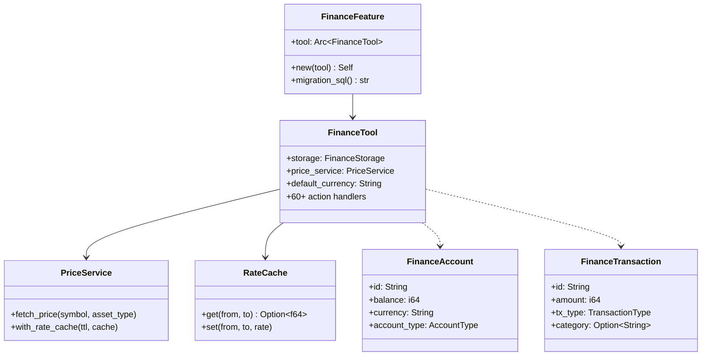

# Layer 4: Feature Finance (`crates/feature-finance/`)

## Overview

The `feature-finance` crate provides a self-contained personal finance management system with 60+ actions covering accounts, transactions, budgets, investments, portfolios, goals, liabilities, FIRE planning, spending analytics, and net worth tracking. All monetary values are stored as integers (cents) using `rust_decimal` for precision. The `analytics` crate provides FIRE calculations and Monte Carlo simulations.

## Dependencies

- `common`, `tools-core`, `storage`, `analytics`, `bus`
- External: `rust_decimal`, `reqwest`, `dashmap`, `urlencoding`, `chrono`, `uuid`

## FeaturePackage Implementation

```rust
pub struct FinanceFeature {
    tool: Arc<FinanceTool>,
}

impl FeaturePackage for FinanceFeature {
    fn name(&self) -> &str { "finance" }
    fn tools(&self) -> Vec<DynTool> { vec![self.tool.clone()] }
    fn migrations(&self) -> Vec<FeatureMigration> {
        // version 1: accounts, transactions, budgets, portfolios,
        // investments, investment_txs, goals, liabilities
    }
    fn config_key(&self) -> &str { "finance" }
    fn default_config(&self) -> Value { FinanceConfig::default() }
}
```

Unlike TasksFeature, FinanceFeature registers its tool via `tools()` (not wired separately).

## Domain Types (`types/domain.rs`)

### Enums (10 total, all derive `DomainEnum`)

| Enum | Variants | Usage |
|------|----------|-------|
| `AccountType` | Cash, Bank, Ewallet, CryptoWallet, Brokerage, Other | Account classification |
| `TransactionType` | Income, Expense, Transfer | Transaction direction |
| `BudgetPeriod` | Monthly, Weekly, Yearly, Custom | Budget cycle |
| `BudgetMethod` | Standard, SixJar | Budget allocation strategy |
| `JarType` | Essentials, Savings, Investment, Education, Entertainment, Charity | Six-Jar categories |
| `AssetType` | Stock, Etf, Crypto, RealEstate, Bond, Other, ExchangeRate | Investment asset types |
| `InvestmentTxType` | Buy, Sell, Dividend, RentalIncome, Interest, Split | Investment transactions |
| `GoalType` | Savings, Purchase, DebtPayoff, Fire, Custom | Financial goal types |
| `GoalStatus` | Active, Achieved, Abandoned | Goal lifecycle |
| `LiabilityType` | Mortgage, CreditCard, PersonalLoan, StudentLoan, Other | Debt types |

All enums use the `DomainEnum` derive macro which generates `Display`, `FromStr`, alias matching (e.g., "e_wallet" -> Ewallet), and serde support.

### Domain Structs (8 total)

| Struct | Key Fields |
|--------|-----------|
| `FinanceAccount` | id, name, account_type, currency, balance (cents), institution |
| `FinanceTransaction` | id, account_id, tx_type, amount (cents), category, counterparty, tx_date, is_recurring |
| `FinanceBudget` | id, name, amount (cents), period, category, method, jar_type, alert_threshold |
| `FinancePortfolio` | id, name, description, currency |
| `FinanceInvestment` | id, portfolio_id, asset_type, symbol, quantity, cost_basis, current_price |
| `FinanceInvestmentTx` | id, investment_id, tx_type, quantity, price_per_unit, total_amount, fees |
| `FinanceGoal` | id, name, goal_type, target_amount, current_amount, monthly_contribution, expected_return_rate |
| `FinanceLiability` | id, name, liability_type, principal, remaining, interest_rate, monthly_payment |

## FinanceTool (60+ Actions)

### Action Groups

| Group | Actions |
|-------|---------|
| **Accounts** | `account_add`, `account_list`, `account_update`, `account_delete` |
| **Transactions** | `tx_add`, `tx_list`, `tx_update`, `tx_delete`, `tx_search`, `tx_recurring_add` |
| **Budgets** | `budget_create`, `budget_list`, `budget_status`, `budget_update`, `budget_delete` |
| **Investments** | `portfolio_create`, `portfolio_list`, `investment_add`, `investment_update`, `investment_tx`, `investment_summary`, `price_fetch`, `price_refresh` |
| **Portfolio Analytics** | `portfolio_drift`, `portfolio_rebalance`, `portfolio_returns`, `portfolio_correlation` |
| **Goals & Liabilities** | `goal_create`, `goal_list`, `goal_update`, `goal_fire`, `goal_whatif`, `liability_add`, `liability_list`, `liability_update`, `net_worth` |
| **Reports** | `report_spending`, `report_income`, `report_trends`, `report_net_worth_history`, `daily_review` |
| **Spending Analytics** | `analyze_spending_anomalies`, `analyze_spending_trends`, `analyze_recurring_charges`, `analyze_category_correlation` |
| **FIRE Planning** | `fire_traditional`, `fire_coast`, `fire_lean`, `fire_fat`, `fire_withdrawal_sim`, `fire_backtest`, `fire_sensitivity` |
| **Allocation** | `allocation_target_set`, `allocation_target_list` |
| **Snapshots** | `snapshot_record`, `snapshot_history` |
| **Settings** | `settings_get`, `settings_update` |
| **Health** | `finance_health_check` |

### Builder Pattern

```rust
FinanceTool::from_storage_pool(&pool, "USD")
    .with_finance_handler(handler)
    .with_config_persistence(cp)
    .with_domain_bus(bus)
    .with_rate_cache(cache)
```

Or manual construction:
```rust
FinanceTool::new(storage, price_service, "USD")
```

## Services

### PriceService (`price_service.rs`)

Fetches live market data for investments. Supports multiple asset types (stocks, crypto, forex). Uses in-memory TTL caching with configurable staleness period. Backed by `RateCache` for two-layer caching (memory + SQLite).

### RateCache (`rate_cache.rs`)

Two-layer exchange rate cache: in-memory `DashMap` (fast) backed by SQLite `FinanceExchangeRateRepo` (persistent). Configurable staleness period in minutes.

### FinanceHandler (`handler.rs`)

Trait for proactive finance operations (budget alerts, daily reviews). Defines `ProactivityLevel` (Low/Medium/High) and `BudgetAlert` types. Implemented in the agent layer.

### Currency Utilities (`currency.rs`)

Formatting and conversion helpers. `rebase.rs` handles currency rebasing for multi-currency net worth calculations.

## Configuration (`FinanceConfig`)

Configurable via `config.json` under the `finance` key. Includes default currency, proactivity level, and FIRE calculation parameters.


