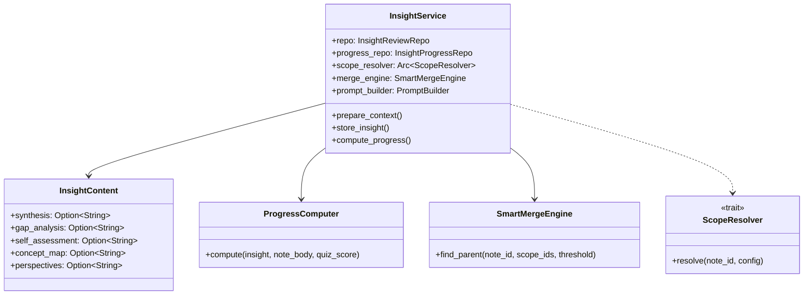

# Layer 4: Feature Insights (`crates/feature-insights/`)

## Overview

The `feature-insights` crate implements a versioned Insight Review system with learning progress tracking. It generates multi-tab analytical insights from notes using LLM calls, supports scope resolution (backlinks, semantic, project-based), smart merge for deduplication, progress tracking via flashcard success and semantic drift, and version evolution timelines.

## Dependencies

- `common`, `tools-core`, `storage`, `providers`, `feature-notes`
- External: `chrono`, `uuid`, `sqlx`, `sha2`, `futures-util`

## Module Organization

```
crates/feature-insights/src/
  lib.rs              # Re-exports
  types.rs            # Core types (InsightContent, ScopeConfig, InsightReviewRow, ProgressSnapshotRow)
  service.rs          # InsightService (orchestrator)
  repo.rs             # InsightReviewRepo (SQLite persistence)
  progress_repo.rs    # InsightProgressRepo (progress snapshots)
  progress.rs         # ProgressComputer (composite progress scoring)
  scope.rs            # ScopeResolver trait + NoopScopeResolver
  merge.rs            # SmartMergeEngine (deduplication)
  prompt_builder.rs   # PromptBuilder (LLM prompt construction)
  prompts.rs          # Prompt templates
  traits.rs           # FlashcardAccessor, InsightEmbedder traits
```

## Key Types (`types.rs`)

### InsightContent (5-Tab Structure)
```rust
pub struct InsightContent {
    pub synthesis: Option<String>,       // Main synthesis
    pub gap_analysis: Option<String>,    // Knowledge gaps
    pub self_assessment: Option<String>, // Self-assessment questions
    pub concept_map: Option<String>,     // Concept relationships
    pub perspectives: Option<String>,    // Multiple viewpoints
}
```

### ScopeConfig
```rust
pub struct ScopeConfig {
    pub scope_type: ScopeType,      // Backlinks, Semantic, Project, Manual
    pub radius: f64,                // Semantic similarity radius (default: 0.72)
    pub node_ids: Vec<String>,      // Resolved scope note IDs
    pub include_cognitive: bool,    // Include cognitive context
    pub deep_dive: bool,            // Enable deeper analysis
    pub merge_threshold: f64,       // Dedup threshold (default: 0.60)
}
```

### InsightReviewRow
Versioned insight record: `{ id, note_id, version, generated_at, content (JSON), input_hash, scope_config, persona_ids, parent_insight_id, token_cost_usd, superseded_at }`

### ProgressSnapshotRow
Progress tracking: `{ id, insight_review_id, version, flashcard_success, semantic_drift, gap_closure, quiz_score, overall_progress, computed_at }`

### ProgressWeights
Configurable composite score weights: `flashcard: 0.40, drift: 0.25, gap: 0.20, quiz: 0.15`

## InsightService (`service.rs`)

The central orchestrator. The LLM call stays in `app-core`'s insight handler (depends on `DynProvider` and event emission); this service handles everything before and after.

### Pipeline

1. **Scope resolution**: `resolve_scope(note_id, config)` -- finds related notes via backlinks, semantic similarity, or project membership
2. **Cache check**: `check_cache(note_id, input_hash)` -- skip LLM if content unchanged
3. **Context preparation**: `prepare_context(note, related, scope_ids, config, domains)` -- smart merge check + prompt building
4. **LLM call** (handled by app-core)
5. **Storage**: `store_insight(note_id, content, hash, scope, personas, parent, scope_ids)` -- persist + embed
6. **Progress**: `compute_progress(insight_id, note_body, quiz_score)` -- update progress snapshot

### Key Methods
- `prepare_context()` -> `PreparedInsight { context, scope_note_ids, parent_insight_id, overlap_score }`
- `store_insight()` -> persists + initial progress snapshot + background embedding
- `get_latest(note_id)` -- latest insight for a note
- `list_versions(note_id)` -- all versions
- `update_tab(insight_id, tab_name, content)` -- update single tab
- `compute_progress(insight_id, note_body, quiz_score)` -- composite progress
- `get_evolution(note_id)` -- version timeline with progress snapshots
- `compute_input_hash(title, body, related_ids)` -- SHA-256 cache key

## Handler Traits (`traits.rs`)

| Trait | Purpose |
|-------|---------|
| `FlashcardAccessor` | Access flashcard success rates for a note |
| `InsightEmbedder` | Embed insight content for semantic drift detection |
| `ScopeResolver` | Resolve related note IDs for insight generation context |

## Smart Merge (`merge.rs`)

`SmartMergeEngine` checks if a new insight should be merged with (or supersede) an existing one, preventing duplicate insights for overlapping note contexts. Returns parent insight ID and overlap score.

## Progress Computer (`progress.rs`)

Computes composite learning progress from four signals:
1. **Flashcard success** (40%) -- spaced repetition performance
2. **Semantic drift** (25%) -- how much understanding has evolved
3. **Gap closure** (20%) -- reduction in identified knowledge gaps
4. **Quiz score** (15%) -- direct assessment results

`generate_change_note()` produces human-readable change descriptions between versions.


