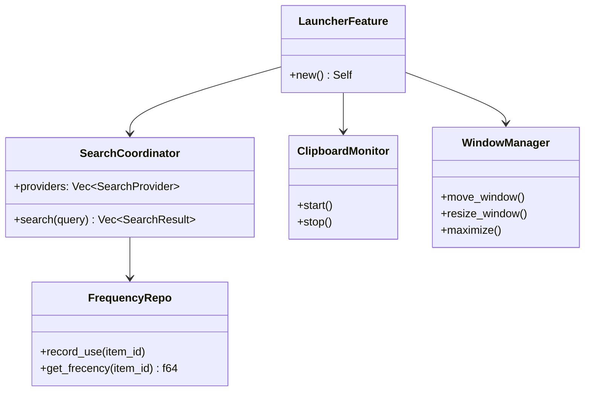

# Layer 4: Feature Launcher (`crates/feature-launcher/`)

## Overview

The `feature-launcher` crate implements a Spotlight/Alfred-style application launcher with multi-source search (apps, files, browser history, bookmarks, git repos, contacts, system preferences, SSH hosts, running apps, calculator, URL navigation, homebrew packages, custom scripts), clipboard history management, file watching, window management, and frecency-based ranking.

## Dependencies

- `common`, `storage`, `tools-core`, `platform-macos`
- External: `nucleo-matcher` (fuzzy matching), `meval` (calculator), `parking_lot`, `base64`, `notify` + `notify-debouncer-mini` (file watching), `which`, `shellexpand`, `dashmap`, `regex`, `futures-util`

## FeaturePackage Implementation

```rust
pub struct LauncherFeature;

impl FeaturePackage for LauncherFeature {
    fn name(&self) -> &str { "launcher" }
    fn tools(&self) -> Vec<DynTool> { vec![] } // launcher is UI-driven, not tool-driven
    fn migrations(&self) -> Vec<FeatureMigration> {
        // version 1: frequencies, clipboard history, FTS5
    }
    fn config_key(&self) -> &str { "launcher" }
    fn default_config(&self) -> Value {
        json!({
            "enabled": true,
            "clipboardHistoryEnabled": true,
            "clipboardMaxEntries": 1000,
            "scriptsDir": "~/.klyntbot/scripts"
        })
    }
}
```

## Module Organization

```
crates/feature-launcher/src/
  lib.rs                  # FeaturePackage impl
  types.rs                # SearchResult, LauncherItem, etc.
  clipboard/
    mod.rs                # ClipboardMonitor public API
    monitor.rs            # Background clipboard monitoring
  repos/
    mod.rs                # Repository aggregate
    clipboard.rs          # ClipboardRepo (history persistence)
    frequency.rs          # FrequencyRepo (frecency tracking)
  search/
    mod.rs                # Search coordinator
    app_index.rs          # macOS application indexing
    file_search.rs        # File search provider
    file_watcher.rs       # File system change watcher
    background.rs         # Background search index maintenance
    content_grep.rs       # Content search within files
    browser_history.rs    # Browser history search (Chrome, Safari, Arc)
    bookmarks.rs          # Browser bookmark search
    git_repos.rs          # Git repository discovery
    contacts.rs           # macOS Contacts search
    system_prefs.rs       # System Preferences panes
    ssh_hosts.rs          # SSH config hosts
    system_commands.rs    # System command search
    running_apps.rs       # Currently running applications
    calculator.rs         # Inline calculator (meval)
    url_navigation.rs     # Direct URL/path navigation
    brew.rs               # Homebrew package search
    script_runner.rs      # Custom script execution
  window_mgmt/
    mod.rs                # WindowManager
    accessibility.rs      # macOS accessibility APIs
    actions.rs            # Window actions (move, resize, fullscreen)
```

## Search Architecture

Multi-source federated search with fuzzy matching (`nucleo-matcher`) and frecency ranking.

### Search Providers

| Provider | Source | Description |
|----------|--------|-------------|
| `AppIndex` | `/Applications`, `~/Applications` | macOS .app bundles |
| `FileSearch` | Configurable directories | File name search |
| `FileWatcher` | notify + debouncer | Real-time file change tracking |
| `ContentGrep` | File contents | Content search within indexed files |
| `BrowserHistory` | Chrome, Safari, Arc DBs | Recent browser history |
| `Bookmarks` | Browser bookmark files | Saved bookmarks |
| `GitRepos` | Scanned directories | Git repository discovery |
| `Contacts` | macOS Contacts framework | Contact search |
| `SystemPrefs` | Static list | System Preference panes |
| `SshHosts` | `~/.ssh/config` | SSH host configuration |
| `SystemCommands` | PATH scanning | System commands/binaries |
| `RunningApps` | macOS APIs | Currently running applications |
| `Calculator` | meval | Inline math expression evaluation |
| `UrlNavigation` | URL detection | Direct URL/path opening |
| `Brew` | Homebrew | Package search and management |
| `ScriptRunner` | `~/.klyntbot/scripts/` | Custom user scripts |

### Ranking

Frecency-based: combines frequency of use with recency. Stored in SQLite via `FrequencyRepo`.

## Clipboard System

### ClipboardMonitor (`clipboard/monitor.rs`)
Background service that polls the macOS pasteboard, deduplicates entries, and stores clipboard history.

### ClipboardRepo (`repos/clipboard.rs`)
SQLite-backed clipboard history with FTS5 search, configurable max entries, and content type tracking.

## Window Management (`window_mgmt/`)

### WindowManager
Provides window manipulation actions using macOS accessibility APIs:
- Move, resize, maximize, minimize windows
- Split screen (left half, right half, quarters)
- Switch between windows/spaces

### Accessibility (`accessibility.rs`)
Wraps macOS accessibility APIs for window position/size queries and mutations.


