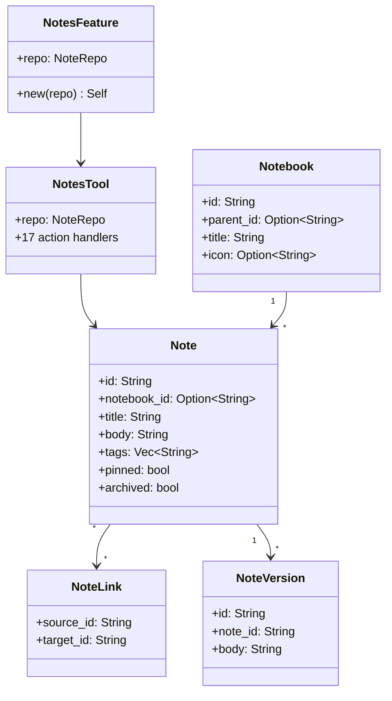

# Layer 4: Feature Notes (`crates/feature-notes/`)

## Overview

The `feature-notes` crate provides a knowledge management system with notebooks, notes, tags, bi-directional links, versioning, FTS5 full-text search, and an inbox capture mechanism. Notes are Markdown-based with optional HTML rendering.

## Dependencies

- `common`, `tools-core`, `storage`
- External: `chrono`, `uuid`, `sqlx`

## FeaturePackage Implementation

```rust
pub struct NotesFeature {
    repo: NoteRepo,
}

impl FeaturePackage for NotesFeature {
    fn name(&self) -> &str { "notes" }
    fn tools(&self) -> Vec<DynTool> { vec![Arc::new(NotesTool::new(self.repo.clone()))] }
    fn migrations(&self) -> Vec<FeatureMigration> {
        // version 6: notebooks, notes, tags, links, entity_mentions, versions
    }
    fn config_key(&self) -> &str { "notes" }
    fn default_config(&self) -> Value {
        json!({ "maxVersionsPerNote": 50, "versionCooldownMinutes": 5 })
    }
    fn health_check(&self) -> Result<HealthStatus> { self.repo.check_health() }
}
```

## Domain Models (`models.rs`)

### Notebook
```rust
pub struct Notebook {
    pub id: String,
    pub parent_id: Option<String>,  // nested notebooks
    pub title: String,
    pub icon: Option<String>,       // emoji icon
    pub color: Option<String>,
    pub sort_order: i32,
    pub created_at: DateTime<Utc>,
    pub updated_at: DateTime<Utc>,
}
```

### Note
```rust
pub struct Note {
    pub id: String,
    pub notebook_id: Option<String>,
    pub title: String,
    pub body: String,               // Markdown
    pub body_html: Option<String>,  // rendered HTML
    pub pinned: bool,
    pub archived: bool,
    pub icon: Option<String>,
    pub color: Option<String>,
    pub tags: Vec<String>,
    pub created_at: DateTime<Utc>,
    pub updated_at: DateTime<Utc>,
}
```

### Supporting Types

| Type | Description |
|------|-------------|
| `NoteVersion` | Version history entry (id, note_id, body, created_at) |
| `NoteLink` | Bi-directional link (source_id, target_id) |
| `NoteRow` | SQLite row with additional fields: `embedding_updated_at`, `split_content`, `split_mode`, `perspective_config`, `last_visited_at` |
| `NoteSearchResult` | FTS5 result with BM25 `rank` score |
| `InboxItemRow` | Quick capture item (id, content, status) |
| `NoteTagRow` | Note-tag join (note_id, tag) |

Row-to-domain conversions: `From<NoteRow> for Note`, `From<NotebookRow> for Notebook`, `From<NoteVersionRow> for NoteVersion`. Note: `From<NoteRow>` leaves tags empty -- use `Note::from_row(row, tags)` for complete conversion.

## NotesTool (17 Actions)

| Action | Description |
|--------|-------------|
| `create_note` | Create with title, body, notebook_id, tags |
| `get_note` | Get full note with tags, links, notebook info |
| `update_note` | Partial update (title, body, pinned, notebook) |
| `delete_note` | Delete by ID |
| `list_notes` | List by notebook (optional), with tags and previews |
| `search_notes` | FTS5 full-text search |
| `tag_note` | Set tags on a note |
| `link_notes` | Create links from source to targets |
| `create_notebook` | Create notebook with title, icon |
| `list_notebooks` | List notebooks with note counts |
| `update_notebook` | Update title, icon, color, parent |
| `archive_note` | Soft archive (hidden from list) |
| `unarchive_note` | Restore from archive |
| `list_archived` | List archived notes |
| `get_backlinks` | Find notes linking to this note |
| `capture_inbox` | Quick capture to inbox |
| `list_inbox` | List pending inbox items |

## Linking System

### Forward Links (`link_parser.rs`)
Parses `[[note-id]]` references in note bodies. Links are stored in the `note_links` table.

### Backlinks
`get_backlinks_with_context()` returns notes that link TO a given note, with the surrounding text context of the link.

### Repo Operations
- `set_links(source_id, target_ids)` -- replaces all outbound links
- `get_links_from(source_id)` -- outbound links
- `get_backlinks_with_context(target_id)` -- inbound links with context

## Embedding Support (`handlers/embedding.rs`)

Handler trait for embedding note content into vector storage. Used for semantic search and insight generation. Tracks `embedding_updated_at` per note.

## Database Schema (Migration v6)

Tables: `notebooks`, `notes`, `note_tags`, `note_links`, `note_versions`, `note_entity_mentions`, `note_inbox`, `notes_fts` (FTS5 virtual table).


