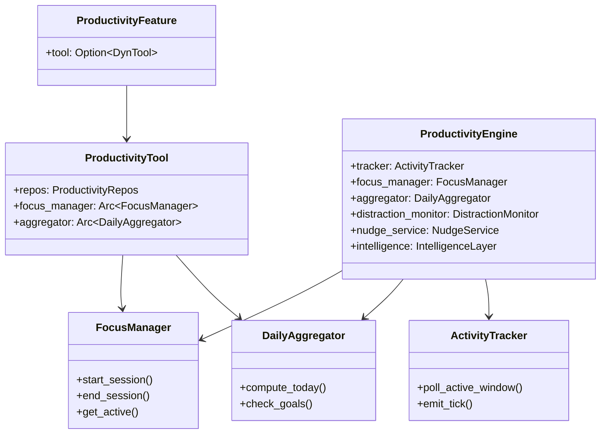

# Layer 4: Feature Productivity (`crates/feature-productivity/`)

## Overview

The `feature-productivity` crate provides comprehensive productivity tracking: macOS activity monitoring, focus session management (with Pomodoro support), daily aggregation, productivity scoring, goal tracking, distraction detection, nudge/intervention system, AI-powered intelligence layer (categorization, narratives, forecasting, quality scoring), and a dashboard event emitter. It is one of the largest Layer 4 crates with 60+ source files.

## Dependencies

- `common`, `tools-core`, `config`, `storage`, `bus`, `activity-log`, `platform-macos`
- External: `chrono`, `uuid`, `sqlx`, `tokio-util`, `regex`, `dirs`

## FeaturePackage Implementation

```rust
pub struct ProductivityFeature {
    tool: Option<DynTool>,
}

impl FeaturePackage for ProductivityFeature {
    fn name(&self) -> &str { "productivity" }
    fn tools(&self) -> Vec<DynTool> { self.tool.iter().cloned().collect() }
    fn migrations(&self) -> Vec<FeatureMigration> { /* version 1 */ }
    fn config_key(&self) -> &str { "productivity" }
    fn default_config(&self) -> Value { ProductivityConfig::default() }
}
```

Supports `migrations_only()` constructor for tests that only need schema.

## Module Organization

```
crates/feature-productivity/src/
  lib.rs                    # FeaturePackage impl + re-exports
  config.rs                 # ProductivityConfig
  engine.rs                 # ProductivityEngine (main coordinator)
  focus.rs                  # FocusManager (sessions, pomodoro)
  aggregator.rs             # DailyAggregator (compute summaries)
  bucket_aggregator.rs      # 5-minute bucket aggregation
  batch_writer.rs           # Batched DB writes for high-frequency events
  dashboard_emitter.rs      # Real-time dashboard event emission
  auto_focus.rs             # Auto-detect focus sessions from activity
  nudge.rs                  # NudgeService (break reminders, alerts)
  insights.rs               # Insight card generation
  patterns.rs               # ProductivityPatternAnalyzer
  project_detector.rs       # Auto-detect projects from file paths/URLs
  distraction_analyzer.rs   # Distraction analysis
  handler.rs                # ProductivityHandler trait
  tracker/                  # macOS activity tracker
    mod.rs                  # ActivityTracker
    macos.rs                # macOS-specific window monitoring
    categorizer/            # App/URL categorization
      mod.rs                # Categorizer
      browser.rs            # Browser URL categorization
  distraction/              # Distraction detection subsystem
    mod.rs
    classifier.rs           # ML-style distraction classifier
    heuristics.rs           # Rule-based distraction heuristics
    interceptor.rs          # Real-time distraction interception
    monitor.rs              # DistractionMonitor (background)
  intelligence/             # AI-powered intelligence layer
    mod.rs
    layer.rs                # IntelligenceLayer (orchestrator)
    categorization.rs       # LLM-powered app categorization
    narrative_generator.rs  # Daily narrative generation
    predictive_engine.rs    # Predict productivity patterns
    quality_scorer.rs       # Session quality scoring
    tracking_rules.rs       # User-defined tracking rules
    voice_journal.rs        # Voice journal processing
    intervention_router.rs  # Route interventions to channels
    session_aggregator/     # Aggregate session-level metrics
      mod.rs
      types.rs
  repos/                    # 20+ repository modules
    mod.rs                  # ProductivityRepos aggregate
    activity_event.rs       # ActivityEventRepo
    focus_session.rs        # FocusSessionRepo
    daily_summary.rs        # DailySummaryRepo
    distraction_pattern.rs  # DistractionPatternRepo
    goal.rs, nudge.rs, insight.rs, project.rs, tracking_rule.rs,
    time_entry.rs, privacy_rule.rs, calendar_event.rs, bucket.rs,
    activity_category.rs, categorization_cache.rs, intelligence_session.rs,
    quality_score.rs, learned_rule.rs, rule_evolution_log.rs,
    weekly_assessment.rs, narrative.rs, voice_journal.rs, forecast.rs
  types/                    # Domain types
    domain.rs               # All productivity domain types
    intelligence.rs         # Intelligence-specific types
    mod.rs
  tool/
    mod.rs                  # ProductivityTool (17 actions)
```

## Key Domain Types (`types/domain.rs`)

| Type | Description |
|------|-------------|
| `ActivityEvent` | Raw activity event (app_name, window_title, url, category, duration, project, focus_session) |
| `ActivityTick` | Real-time tick from ActivityTracker (emitted every poll interval) |
| `ActivityCategory` | Categorization rule (productive/neutral/distracting) with matching rules |
| `CategoryType` | Productive, Neutral, Distracting |
| `FocusSession` | Focus/Pomodoro session with quality scoring, interruptions, distraction events |
| `SessionType` | Focus, Pomodoro, Break |
| `SessionSource` | Manual, AutoDetected, Pomodoro |
| `DailySummary` | Aggregated daily metrics (active/idle/focus time, scores, top apps/categories) |
| `ProductivityGoal` | Goal with type (daily/weekly), metric, target value |
| `GoalMetric` | ProductiveHours, FocusSessions, ProductivityScore, MaxDistractingMins, ProjectHours |
| `NudgeRecord` | Nudge delivery record (BreakReminder, FocusSuggestion, DailySummary, BurnoutAlert) |
| `InsightCard` | Generated insight (9 types: DeepWorkTrend, DistractionSpike, PeakHourShift, etc.) |
| `TimeEntry` | Manual time log entry |
| `ProductivityProject` | Auto-detected or user-defined project |
| `DistractionPattern` | Recorded distraction occurrence with context |
| `ActivityBucket` | 5-minute aggregation bucket |
| `WeeklyAssessment` | Weekly productivity assessment |

## ProductivityTool (17 Actions)

| Action | Description |
|--------|-------------|
| `focus_start` | Start focus session (optional action_id, project, duration) |
| `focus_end` | End session with notes, get quality report |
| `focus_status` | Active session status |
| `pomodoro_start` | Start Pomodoro with configurable work/break mins |
| `activity_today` | Today's activity summary |
| `activity_summary` | Date range summary (group by day/week/month/project) |
| `activity_week` | Past 7 days summary |
| `activity_score` | Productivity score breakdown |
| `activity_compare` | Compare periods (today vs yesterday, this week vs last) |
| `set_goal` | Set productivity goal (metric + target) |
| `check_goals` | Check goal progress |
| `list_goals` | List active goals |
| `remove_goal` | Remove a goal |
| `log_time` | Manual time entry |
| `activity_export` | Export data as CSV or JSON |
| `list_categories` | List activity categories |
| `set_category` | Create/update categorization rules |

## Core Services

### ProductivityEngine (`engine.rs`)
Main coordinator that ties together the tracker, focus manager, aggregator, distraction monitor, nudge service, and intelligence layer.

### FocusManager (`focus.rs`)
Manages focus sessions and Pomodoro timers. Tracks active sessions, computes quality scores based on distraction events and interruptions.

### DailyAggregator (`aggregator.rs`)
Computes `DailySummary` from raw activity events. Includes `get_or_compute()` for lazy computation and `check_goals()` for goal evaluation.

### ActivityTracker (`tracker/`)
macOS-specific activity monitoring using `platform-macos` crate. Polls active window every few seconds, categorizes apps/URLs, detects context switches, and emits `ActivityTick` events.

### Distraction Subsystem (`distraction/`)
Multi-layer distraction detection: heuristic rules, ML-style classifier, real-time interceptor, and background monitor. Feeds into nudge system and coaching.

### Intelligence Layer (`intelligence/`)
LLM-powered intelligence: automatic categorization of unknown apps, daily narrative generation, predictive patterns, session quality scoring, tracking rule learning, and voice journal processing.

## Productivity Scoring

The productivity score (0-100) is computed from:
- Ratio of productive to total active time
- Focus session completion and quality
- Context switch frequency
- Deep work block count and duration
- Distraction recovery time


