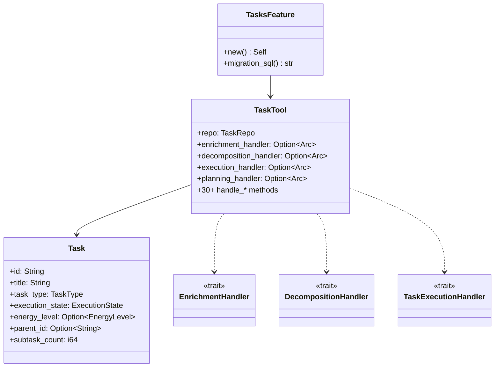

# Layer 4: Feature Tasks (`crates/feature-tasks/`)

## Overview

The `feature-tasks` crate implements agentic task management for klyntbot. It provides a unified `TaskTool` with 30+ actions covering CRUD, focus tracking, dependency management, recurrence, AI-powered decomposition, agentic execution, proactive suggestions, day planning, forecasting, and semantic search. Tasks support three execution modes: manual, agentic (fully automated), and hybrid.

## Dependencies

- `common`, `tools-core`, `tools-core-macros`, `storage`, `bus`
- External: `chrono`, `uuid`, `rrule`, `sqlx`, `futures-util`

## FeaturePackage Implementation

```rust
pub struct TasksFeature;

impl FeaturePackage for TasksFeature {
    fn name(&self) -> &str { "tasks" }
    fn tools(&self) -> Vec<DynTool> { vec![] } // TaskTool wired directly in agent builder
    fn migrations(&self) -> Vec<FeatureMigration> { /* version 1: core tables */ }
    fn config_key(&self) -> &str { "tasks" }
    fn default_config(&self) -> Value { TasksConfig::default() }
}
```

The TaskTool is wired directly in the agent builder (not via `FeaturePackage::tools()`) because it requires many injected handler dependencies.

## Key Types

### Task Entity (`types/entity.rs`)

The core `Task` struct with 50+ fields covering:

- **Identity**: `id` (8-char UUID prefix), `title`, `description`, `tags`
- **Organization**: `area_id` (required), `project_id`, `key_result_id`, `objective_id`, `parent_id`, `group_id`
- **Status lifecycle**: `status` (todo/doing/done/someday), `completed`, `completed_at`
- **Focus tracking**: `focused_at`, `focus_deadline`, `focus_expired_count`
- **Time tracking**: `total_tracked_secs`, `estimated_minutes`, `actual_minutes`
- **Recurrence**: `recurrence_rule` (RRULE), `recurrence_parent_id`, `is_template`, `next_instance_date`
- **Agentic fields**: `task_type` (Manual/Agentic/Hybrid), `acceptance_criteria`, `agent_config`, `execution_state`, `spawned_execution_id`, `context_snapshot`
- **Planning**: `energy_level` (Low/Medium/High/Deep), `estimated_focus_blocks`, `complexity_score`
- **Derived fields** (populated by handlers): `subtask_count`, `attachments`, `time_entries`, `blocked_by`, `blocks`

Implements `From<TaskRow>` / `From<&Task> for TaskRow` for storage layer conversion.

### Supporting Types

| Type | File | Description |
|------|------|-------------|
| `TaskType` | `entity.rs` | Manual, Agentic, Hybrid |
| `EnergyLevel` | `entity.rs` | Low, Medium, High, Deep |
| `TaskStatus` | `entity.rs` | Todo, Doing, Done, Someday |
| `ExecutionState` | `execution.rs` | Idle, Queued, Running, AwaitingApproval, Completed, Failed, Cancelled |
| `AgentConfig` | `execution.rs` | `require_approval`, `retry_policy` |
| `RetryPolicy` | `execution.rs` | `max_retries`, `base_delay_secs`, `exponential_backoff` |
| `ContextSnapshot` | `execution.rs` | Facts, parent chain, sibling titles, active blockers |
| `ExecutionConfig` | `execution.rs` | Execution parameters (max_iterations, timeout, cost) |
| `TaskSuggestion` | `suggestion.rs` | AI-generated suggestions with confidence scores |
| `SuggestionAction` | `suggestion.rs` | SetPriority, SetDueDate, AddTag, MoveToProject, Decompose, etc. |
| `ActiveTaskFocus` | `active_focus.rs` | Currently focused task state |
| `Attachment` | `planning.rs` | Task attachments (links, files, notes) |
| `TimeEntry` | `planning.rs` | Time tracking entries |
| `WorkingHours` | `planning.rs` | Configurable work schedule (start, end, lunch) |
| `ScopeOverrides` | `planning.rs` | Per-project/area config overrides |
| `EstimationRecord` | `planning.rs` | Historical estimation accuracy data |

## TaskTool (30+ Actions)

### Action Groups

| Group | Actions | Description |
|-------|---------|-------------|
| **CRUD** | `create`, `update`, `complete`, `delete`, `show` | Basic task lifecycle |
| **Query** | `list`, `summary`, `tree`, `search` | Listing, aggregation, hierarchy view, hybrid search |
| **Focus** | `focus`, `unfocus`, `log_time` | Focus slot management with deadlines |
| **Dependencies** | `add_dep`, `remove_dep` | Task blocking relationships (blocks, depends_on, related) |
| **Batch** | `batch` | Atomic batch operations (complete, delete, tag, reorder) |
| **Recurrence** | `recur`, `list_recurring`, `delete_recurring` | RRULE-based recurring tasks |
| **Planning** | `plan_day` | AI-powered daily planning via `DayPlanningHandler` |
| **Decomposition** | `decompose` | AI subtask generation via `DecompositionHandler` |
| **Execution** | `execute`, `cancel_execution` | Agentic task execution via `TaskExecutionHandler` |
| **Suggestions** | `suggest`, `apply_suggestion`, `dismiss_suggestion`, `list_suggestions` | Proactive AI suggestions |
| **Forecasting** | `forecast_task`, `forecast_project`, `accuracy_report` | Estimation accuracy and project timeline forecasting |

### Builder Pattern

```rust
TaskTool::new(repo, max_focus_slots, focus_deadline_hours, timezone)
    .with_area_repo(area_repo)
    .with_enrichment_handler(handler)
    .with_embedding_handler(embedding_handler)
    .with_embedding_store(vector_store)
    .with_search_config(threshold, rrf_k)
    .with_decomposition_handler(decomp_handler)
    .with_execution_handler(exec_handler)
    .with_planning_handler(plan_handler)
    .with_proactive_handler(proactive_handler)
    .with_suggestion_applier(applier)
    .with_forecast_handler(forecast_handler)
    .with_progress_handler(progress_handler)
    .with_domain_bus(bus)
    .with_config(tasks_config)
```

## Handler Traits (Dependency Inversion)

All handler traits are defined in `handlers/` and implemented in the agent crate (Layer 5):

| Trait | File | Purpose |
|-------|------|---------|
| `EnrichmentHandler` | `enrichment.rs` | LLM-powered task enrichment (auto-set priority, tags, project) |
| `EmbeddingHandler` | `embedding.rs` | Generate embeddings for semantic search |
| `DecompositionHandler` | `decomposition.rs` | AI subtask generation from complex tasks |
| `TaskExecutionHandler` | `execution.rs` | Run agentic task execution pipeline |
| `DayPlanningHandler` | `planning.rs` | Generate daily task plans via LLM |
| `ProactiveHandler` | `proactive.rs` | Generate proactive suggestions |
| `SuggestionApplier` | `suggestion_applier.rs` | Execute accepted suggestions |
| `ForecastHandler` | `forecast.rs` | Estimation accuracy and project forecasting |
| `ProgressHandler` | `progress.rs` | Cascade KR progress on task completion |

## Configuration (`TasksConfig`)

Key configuration fields (camelCase JSON):

- `maxFocusSlots` (3) -- simultaneous focused tasks
- `focusDeadlineHours` (8) -- focus auto-expiry
- `wipLimit` (5) -- work-in-progress limit
- `enrichment.autoApplyThreshold` (0.70) -- confidence threshold for auto-enrichment
- `search.semanticThreshold` (0.50) -- cosine similarity minimum
- `search.rrfK` (60) -- Reciprocal Rank Fusion parameter
- `proactiveSuggestions` (true) -- enable AI suggestions
- `suggestionAutoApplyThreshold` (0.85) -- auto-apply confidence
- `decompositionAutoApplyThreshold` (0.90) -- auto-apply decomposition confidence
- `workingHours` -- start/end/lunch times
- `staleDays` (14) -- stale task detection
- `forecastMinSampleSize` (5) -- minimum data for forecasting
- `cognitiveIntegration` (true) -- integrate with cognitive memory

## Scoring Algorithm (`scoring.rs`)

Task priority scoring: `score = urgency * priority_weight + age_days * 0.1`

- **Urgency** (0-10): overdue=10, due today=5, tomorrow=3, this week=2, later=1, no date=1
- **Priority weight**: P1=5, P2=4, P3=3 (default), P4=2, P5=1
- **Age bonus**: 0.1 per day since creation

## Complexity Evaluation (`complexity.rs`)

`evaluate_task_complexity()` produces `TaskComplexitySignals` considering description length, subtask count, dependency count, acceptance criteria presence, and estimated duration.


