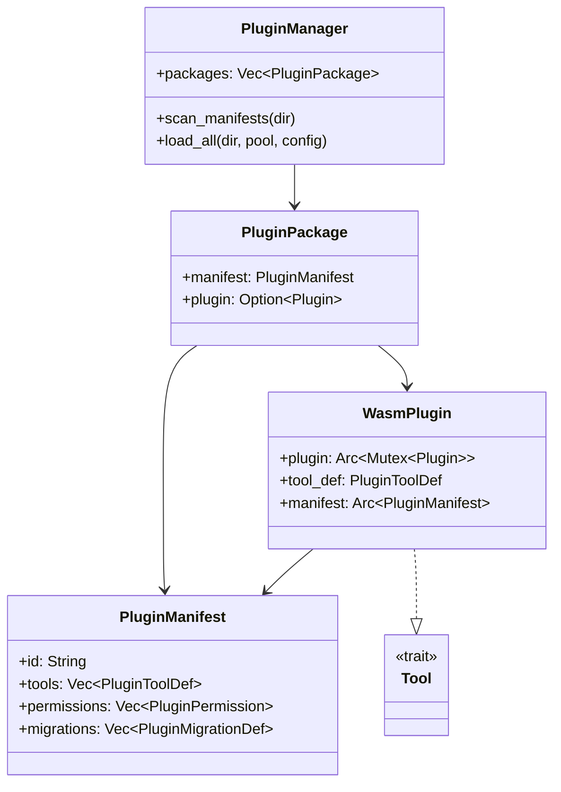

# Layer 4: Plugin Runtime (`crates/plugin-runtime/`)

## Overview

The `plugin-runtime` crate implements a WASM-based plugin sandbox for klyntbot. It discovers, loads, and executes WASM plugins from `~/.klyntbot/plugins/`, wrapping each plugin's tools as `Tool` implementations and registering them into the agent's `ToolRegistry`. Plugins run in a sandboxed Extism runtime with configurable memory limits and declared permissions.

## Dependencies

- `common`, `config`, `bus`, `storage`, `tools-core`
- External: `extism` (v1, WASM runtime), `serde`, `serde_json`, `reqwest`, `dirs`, `anyhow`, `thiserror`

## Module Organization

```
crates/plugin-runtime/src/
  lib.rs              # Re-exports
  manifest.rs         # PluginManifest deserialization (klyntbot.plugin.json)
  manager.rs          # PluginManager (discovery + loading)
  wasm_plugin.rs      # WasmPlugin (Tool trait implementation)
  plugin_package.rs   # PluginPackage (FeaturePackage-like wrapper)
  host/
    mod.rs            # Host function bindings for WASM plugins
```

## Plugin Discovery and Loading

### Directory Structure
```
~/.klyntbot/plugins/
  notion-connector/
    klyntbot.plugin.json    # Manifest
    plugin.wasm             # WASM binary
  github-tools/
    klyntbot.plugin.json
    plugin.wasm
```

### PluginManager (`manager.rs`)

1. **Scan**: `scan_manifests(dir)` -- reads `klyntbot.plugin.json` from each subdirectory
2. **Load**: `load_all(dir, pool, config, bus_sender)` -- validates and instantiates all discovered plugins
3. **Skip conditions**: disabled in config, directory doesn't exist, invalid manifest, WASM load failure (logged as warning, doesn't block other plugins)

```rust
pub struct PluginManager {
    packages: Vec<PluginPackage>,
    plugins_dir: PathBuf,
}

impl PluginManager {
    pub fn default_plugins_dir() -> PathBuf;     // ~/.klyntbot/plugins/
    pub fn scan_manifests(dir) -> Vec<(PluginManifest, PathBuf)>;
    pub fn load_all(dir, pool, config, bus_sender) -> Self;
    pub fn packages(&self) -> &[PluginPackage];
    pub fn into_packages(self) -> Vec<PluginPackage>;
}
```

## Plugin Manifest (`manifest.rs`)

The `klyntbot.plugin.json` manifest file defines a plugin's identity, tools, permissions, cron jobs, migrations, and config schema.

### PluginManifest
```rust
pub struct PluginManifest {
    pub id: String,                              // Unique plugin ID
    pub name: String,                            // Display name
    pub version: String,                         // SemVer
    pub description: String,
    pub author: String,
    pub min_klyntbot_version: Option<String>,    // Minimum compatible version
    pub tools: Vec<PluginToolDef>,               // Tool definitions
    pub cron_jobs: Vec<PluginCronJob>,           // Scheduled tasks
    pub migrations: Vec<PluginMigrationDef>,     // SQLite migrations
    pub permissions: Vec<PluginPermission>,       // Required permissions
    pub config_schema: HashMap<String, PluginConfigField>,  // User config
}
```

### PluginPermission (3 levels)
| Permission | Effect |
|-----------|--------|
| `Network` | HTTP access from host functions -> Elevated permission level |
| `Storage` | SQLite access from host functions -> Standard permission level |
| `Agent` | Agent delegation capability -> Elevated permission level |

### PluginToolDef
```rust
pub struct PluginToolDef {
    pub name: String,
    pub description: String,
    pub parameters: Value,  // JSON Schema
}
```

### PluginCronJob, PluginMigrationDef, PluginConfigField
Supporting types for scheduled tasks, database migrations, and user-configurable settings.

## WasmPlugin (`wasm_plugin.rs`)

Wraps an Extism plugin instance as a `Tool` implementation:

```rust
pub struct WasmPlugin {
    plugin: Arc<Mutex<extism::Plugin>>,
    tool_def: PluginToolDef,
    manifest: Arc<PluginManifest>,
}

#[async_trait]
impl Tool for WasmPlugin {
    fn name(&self) -> &str { &self.tool_def.name }
    fn description(&self) -> &str { &self.tool_def.description }
    fn parameters(&self) -> Value { self.tool_def.parameters.clone() }
    fn permission_level(&self) -> PermissionLevel {
        // Elevated if Network or Agent permission; Standard otherwise
    }
    async fn execute(&self, args: Value, _ctx: &RoutingContext) -> Result<String> {
        // Serialize args -> call WASM function -> return string output
        let input = serde_json::to_string(&args)?;
        let output = plugin.call::<&str, &str>(func_name, &input)?;
        Ok(output.to_string())
    }
}
```

### Permission Level Computation
- Plugins with `Network` or `Agent` permission -> `PermissionLevel::Elevated`
- All others -> `PermissionLevel::Standard`

## PluginPackage (`plugin_package.rs`)

Wraps a plugin manifest and its loaded WASM instance into a `FeaturePackage`-compatible structure. Provides tool registration, migration application, and cron job scheduling.

## Host Functions (`host/mod.rs`)

`build_host_functions()` creates the Extism host function bindings available to WASM plugins:

- **Storage**: SQLite query/execute (scoped to plugin's namespace)
- **Network**: HTTP GET/POST (gated by `PluginPermission::Network`)
- **Bus**: Outbound message sending (gated by bus_sender availability)

## Sandboxing

- **Memory limits**: Configurable via `config.plugins.sandboxMemoryMb` (converted to WASM pages: 64KB/page)
- **Permission enforcement**: Host functions check plugin permissions before executing
- **Namespace isolation**: Storage operations are prefixed with `plugin_{id}_` to prevent cross-plugin data access
- **WASM sandbox**: Extism provides CPU/memory isolation at the WASM runtime level

## Configuration

Controlled via `config.json` -> `plugins`:
```json
{
  "plugins": {
    "enabled": true,
    "sandboxMemoryMb": 64
  }
}
```


