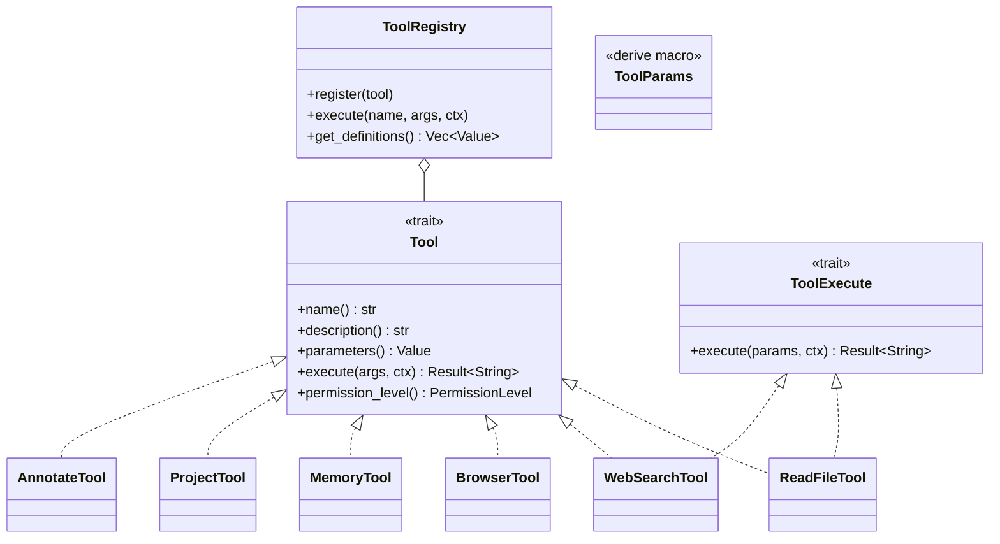

# Layer 4: Tools Crate (`crates/tools/`)

## Overview

The `tools` crate provides core tool implementations and domain tool interfaces for the klyntbot agent system. It is organized into three groups: **system tools** (pure operations with no domain state), **domain tools** (business logic tools interacting with storage and external services), and **embedding infrastructure** (fastembed + LanceDB). Feature-specific tools (tasks, finance, notes, productivity) live in their own `feature-*` crates and depend on `tools-core` directly.

## Dependencies

- `common`, `tools-core`, `tools-core-macros`, `config`, `storage`, `cognitive`, `bus`
- External: `reqwest`, `scraper`, `html2text`, `url`, `walkdir`, `globset`, `regex`, `fastembed` (optional)

## Module Organization

```
crates/tools/src/
  lib.rs              # Re-exports from tools-core + module declarations
  registry.rs         # Re-exports ToolRegistry from tools-core
  permissions.rs      # Re-exports PermissionLevel, ToolPermissions
  params.rs           # Re-exports ParamExtractor
  search_utils.rs     # RRF merge utilities for hybrid search
  todo_types.rs       # Legacy action/todo types
  conversation_recall.rs  # ConversationRecallHandler trait
  progress_handler.rs     # ProgressHandler trait
  system/             # System tools (no domain state)
    filesystem.rs     # ReadFileTool, WriteFileTool, EditFileTool, ListDirTool
    web.rs            # WebSearchTool, WebFetchTool
    browser.rs        # BrowserTool (agent-browser CLI)
    message.rs        # MessageTool (cross-channel messaging)
    ask_user.rs       # AskUserTool (structured user interaction)
    glob_tool.rs      # GlobTool (file pattern matching)
    grep.rs           # GrepTool (regex content search)
  domain/             # Domain tools (interact with storage/services)
    memory_tool.rs    # MemoryTool (semantic conversation search)
    project_tool.rs   # ProjectTool (CRUD + task listing)
    area_tool.rs      # AreaTool (PARA area management)
    okr_tool.rs       # OkrTool (objectives + key results)
    cron_tool.rs      # CronTool (scheduling via CronHandler trait)
    delegation.rs     # DelegationTool (agent-to-agent composition)
    learning_tool.rs  # LearningTool (learning system insights)
    agent_task_tool.rs # AgentTaskTool (subagent task board)
    spawn.rs          # SpawnTool (subagent creation)
    context_request.rs # ContextRequestTool (mid-execution context expansion)
    annotate.rs       # AnnotateTool (persistent entity annotations)
    docs.rs           # DocsTool (documentation/content registry)
  embedding/          # Embedding infrastructure
    embedding_engine.rs # EmbeddingEngine (fastembed wrapper)
    embedding_store.rs  # EmbeddingStore (LanceDB vector store)
```

## Tool Derive Macro Pattern

Tools use `#[derive(Tool)]` from `tools-core-macros` with strongly-typed params:

```rust
#[derive(Debug, ToolParams)]
pub struct ReadFileParams {
    #[param(required)]
    pub path: String,
}

#[derive(tools_core::Tool)]
#[tool(
    name = "read_file",
    description = "Read the contents of a file.",
    params = "ReadFileParams",
    permission = "read_only",
    category = "FileSystem",
    tags = "file,read",
    cost = "Free"
)]
pub struct ReadFileTool { base: FsToolBase }

impl tools_core::ToolExecute for ReadFileTool {
    type Params = ReadFileParams;
    async fn execute(&self, params: ReadFileParams, _ctx: &RoutingContext) -> Result<String> { ... }
}
```

The macro generates the `Tool` trait impl: `name()`, `description()`, `parameters()` (JSON Schema from `ToolParams`), `permission_level()`, `metadata()`, and `execute()` (which deserializes args into `Params` and delegates to `ToolExecute`).

## Multi-Action Tools Pattern (`#[tool_actions]`)

For tools with multiple actions dispatched via an `action` parameter, the `#[tool_actions]` proc macro auto-generates the dispatch:

```rust
#[tool_actions(
    name = "annotate",
    description = "CRUD for persistent annotations.",
    category = "Memory",
    tags = "annotation,note",
    cost = "Free"
)]
impl AnnotateTool {
    #[action(name = "create")]
    async fn handle_create(&self, params: CreateParams, _ctx: &RoutingContext) -> Result<String> { ... }

    #[action(name = "get")]
    async fn handle_get(&self, params: GetParams, _ctx: &RoutingContext) -> Result<String> { ... }
}
```

Each action has its own `ActionParams` struct. The macro generates the `Tool` trait impl with a unified JSON Schema containing `action` as an enum and the union of all action params.

## Tool Registry Integration

`ToolRegistry` (defined in `tools-core`, re-exported here) stores `DynTool` (`Arc<dyn Tool>`) instances indexed by name. Key operations:

- `register(tool)` -- adds a tool (extracts name via `Tool::name()`)
- `execute(name, args, ctx)` -- looks up tool, checks permissions, calls `execute`
- `get_definitions()` -- returns JSON Schema definitions for all tools (for LLM function calling)
- Permission enforcement: `ToolPermissions` maps channels to `PermissionLevel`; tools declare their minimum via `permission_level()`

Convenience registration functions exist for filesystem tools: `register_fs_tools()` (all 4) and `register_fs_read_tools()` (read_file + list_dir only, for read-only subagent profiles).

## System Tools

| Tool | Name | Description | Permission | Category |
|------|------|-------------|------------|----------|
| `ReadFileTool` | `read_file` | Read file contents | ReadOnly | FileSystem |
| `WriteFileTool` | `write_file` | Write content to file | Elevated | FileSystem |
| `EditFileTool` | `edit_file` | Find-and-replace in file | Elevated | FileSystem |
| `ListDirTool` | `list_dir` | List directory contents | ReadOnly | FileSystem |
| `GlobTool` | `glob` | Find files by glob pattern | ReadOnly | Search |
| `GrepTool` | `grep` | Regex content search | ReadOnly | Search |
| `WebSearchTool` | `web_search` | Brave Search API | Standard | Web |
| `WebFetchTool` | `web_fetch` | Fetch URL, extract text/markdown | Standard | Web |
| `BrowserTool` | `browser` | Browser automation (14 actions) | Elevated | Web |
| `MessageTool` | `message` | Cross-channel messaging via bus | Standard | Communication |
| `AskUserTool` | `ask_user` | Structured user questions (4 types) | Standard | Communication |

### BrowserTool Actions
`navigate`, `snapshot`, `click`, `type`, `fill`, `press`, `scroll`, `wait`, `get_text`, `screenshot`, `eval`, `fill_form`, `login_flow`, `submit_and_confirm`

Write-action guarding by `TrustLevel` (Full/Autonomous/Strict) prevents dangerous operations (purchases, deletions, payment field fills) without user confirmation.

### AskUserTool Question Types
`single_select`, `multi_select`, `yes_no`, `free_text` -- supports 1-4 questions per call with interactive UI (desktop/CLI) or text fallback.

## Domain Tools

| Tool | Name | Actions | Handler Trait | Category |
|------|------|---------|---------------|----------|
| `MemoryTool` | `memory` | search_conversations, search_all, purge, status | `ConversationRecallHandler` | Memory |
| `ProjectTool` | `project` | create, list, show, update, archive, tasks | Direct repo | TaskManagement |
| `AreaTool` | `area` | create, list, show, update, reorder | Direct repo | Productivity |
| `OkrTool` | `okr` | objective.{create,list,show,update,delete}, kr.{create,list,show,update,update_metric,delete} | Direct repo + `ProgressHandler` | Productivity |
| `CronTool` | `cron` | add, list, remove | `CronHandler` | System |
| `DelegationTool` | `delegate` | (single) | `DelegationHandler` | System |
| `SpawnTool` | `spawn` | spawn, cancel, status | `SpawnHandler` | System |
| `LearningTool` | `learning` | status, analyze, history | `LearningHandler` | Memory |
| `AgentTaskTool` | `agent_task` | list, claim, complete, fail | `AgentTaskHandler` | TaskManagement |
| `ContextRequestTool` | `context_request` | load, list | `ContextExpansionHandler` | System |
| `AnnotateTool` | `annotate` | create, get, list, delete, search | Direct repo (`AnnotationRepo`) | Memory |
| `DocsTool` | `docs` | search, get, list | `ContentRegistryHandler` | Search |

## Dependency Inversion Pattern

Domain tools that need agent-level functionality define handler traits at Layer 4 (tools) and receive implementations injected from Layer 5 (agent) as `Arc<dyn Trait>`. This breaks circular dependencies:

```
tools (L4) defines:  CronHandler, SpawnHandler, DelegationHandler, LearningHandler, ...
agent (L5) implements: CronHandlerImpl, SubagentManager, AgentRuntime, LearningHandlerImpl, ...
```

Tools are constructed with builder methods: `.with_handler(Arc<dyn Trait>)`.

## Embedding Infrastructure

- **`EmbeddingEngine`** -- wraps fastembed for local embedding generation. Feature-gated behind `semantic-search`.
- **`EmbeddingStore`** -- wraps LanceDB `VectorStore` for storage and similarity search.
- Consumers: `MemoryTool` (conversation recall), `TaskTool` (task semantic search), `SearchUtils` (RRF merge).


