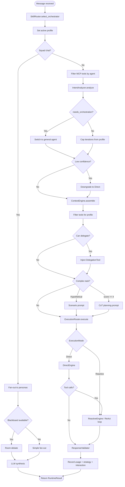

# Layer 5: Agent Crate Architecture

> `crates/agent/` -- Agent runtime, ReAct loop, intent pipeline, execution router, learning system, and all handler trait implementations.

## Overview

The agent crate is the orchestration layer of Klyntbot. It contains the `AgentLoop` (message processing loop), `AgentRuntime` (execution pipeline), intent analysis, execution engines, and all adapter implementations that bridge lower-layer trait contracts to concrete LLM-backed logic.

**Dependencies:** Nearly all lower-layer crates -- `common`, `bus`, `config`, `cognitive`, `providers`, `session`, `tools`, `tools-core`, `feature-tasks`, `feature-finance`, `feature-productivity`, `feature-coaching`, `feature-notes`, `plugin-runtime`, `mcp`, `scheduling`, `skill-system`, `context_engine`, `storage`, `activity-log`.

---

## Module Map

```
agent/src/
  lib.rs                     -- Re-exports, module declarations
  agent_loop/
    mod.rs                   -- AgentLoop struct, message processing, streaming
    builder.rs               -- AgentLoopBuilder (dependency wiring, tool registration)
  agent_runtime/
    mod.rs                   -- Module re-exports
    runtime.rs               -- AgentRuntime (10-step pipeline)
    scenario.rs              -- Scenario reasoning prompt builder
  agent_profile/
    mod.rs, manager.rs,      -- Agent profile management
    skill_loader.rs, types.rs
  intent_pipeline/
    mod.rs                   -- Module re-exports
    analysis.rs              -- IntentAnalyzer (4-layer cascade)
    router.rs                -- ExecutionRouter (Direct/Reactive dispatch)
    types.rs                 -- ExecutionMode, ComplexitySignals, IntentAnalysis
    engines/
      mod.rs                 -- ExecutionEngine trait, EngineResult
      direct.rs              -- DirectEngine (single LLM call)
      reactive.rs            -- ReactiveEngine (ReAct loop)
      debate.rs              -- Room debate engine (multi-persona)
      squad.rs               -- Squad fan-out/synthesis
  execution/
    core.rs                  -- ExecutionCore (LLM call + tool dispatch)
    types.rs                 -- ExecutionParams, CycleOutcome, ToolExecutionResult
    scratchpad.rs            -- ReAct scratchpad for iteration state
  confidence/
    evaluator.rs             -- ConfidenceEvaluator
    types.rs                 -- ConfidenceAssessment, DecisionAction
    log.rs                   -- DecisionLogger
    prompt.rs                -- Confidence prompt templates
  output/
    cost_tracker.rs          -- CostTracker (usage recording + budget alerts)
    validator.rs             -- ResponseValidator (content filtering)
  learning/
    service.rs               -- LearningService (background analysis)
    adaptive.rs              -- AdaptiveThresholds
    analyzer.rs              -- Outcome analysis
    interaction_recorder.rs  -- InteractionRecorder
    pattern_analyzer.rs      -- PatternAnalyzer
    recorder.rs              -- OutcomeRecorder
    tool_tracking.rs         -- ToolConfidenceMap
    types.rs                 -- OutcomeStore, ToolOutcome
  context_sources/           -- ContextSource implementations
  domain_searchers/          -- InsightForge domain searchers
  enrichment/                -- Task enrichment engine
  handlers/                  -- Feature handler implementations
  adapters/                  -- Trait adapter implementations
  services/                  -- Background services
  content_registry/          -- Content search registry
  events.rs                  -- AgentEvent enum
  persona.rs                 -- PersonaManager, PersonaChain
  subagent.rs                -- SubagentManager
  chat/                      -- Chat formatting
```

---

## AgentLoop

`AgentLoop` is the top-level message processing engine. It owns all runtime state and coordinates the full lifecycle of a user message.

### Construction (AgentLoopBuilder)

`AgentLoop::builder(bus, provider, config).with_pool(pool).build().await` performs extensive wiring:

1. **Skill discovery** -- scans built-in skills, user skills (`{data_dir}/skills/`), and project skills (`.agents/skills/`)
2. **Context sources** -- registers `IdentitySource`, `BootstrapSource`, `SessionContextSource`, `AreaSource`, `TodoSource`, `SkillContextSource`, `PersonaContextSource`, `PageContextSource`, `CognitiveContextSource`, `ProjectContextSource`, `AnnotationContextSource`, `ProductivityContextSource`, `WorkContextSource`
3. **Tool registry** -- registers filesystem, search, web, browser, message, ask-user, spawn, cron, task, OKR, area, project, annotate, memory, finance, notes, work context, productivity, learning tools, WASM plugin tools, and MCP tools
4. **Agent runtime** -- wires `SkillCatalog`, `SkillRouter`, `IntentAnalyzer`, `ContextEngine`, `ExecutionRouter`, `CostTracker`
5. **Background services** -- starts reminder engine, recurring task spawner, learning service, session cleanup, memory maintenance, cognitive consolidation, work context inference
6. **MCP servers** -- connects to configured MCP servers via `McpManager`

### Message Processing Flow

```rust
async fn process_message(&self, msg: InboundMessage) -> Result<()>
```

1. **Validate** message size
2. **Route reactions** to `handle_reaction()` (updates satisfaction score, no LLM call)
3. **Route system messages** to `process_system_message()` (subagent results, session resets)
4. **Track** last active channel for notifications
5. **Session** -- get or create session, add user message, extract history
6. **Embed** user message asynchronously (conversation recall)
7. **Activity log** -- fire-and-forget ingestion
8. **Pipeline** -- `run_pipeline()` through `AgentRuntime`
9. **Save** assistant response to session
10. **Publish** `ChatTurnCompleted` domain event (triggers cognitive consolidation)
11. **Send** response via `MessageBus`

### Streaming Mode

`process_direct_streaming()` returns a `StreamingHandle`:
- `event_rx: mpsc::Receiver<AgentEvent>` -- content chunks, tool status, progress events
- `interaction_rx: mpsc::Receiver<InteractionBundle>` -- ask_user tool requests
- `cancel_token: CancellationToken` -- cancel processing
- `handle: JoinHandle<Result<String>>` -- background task handle

### Key Capabilities

- **Hot-reload agents**: `reload_agents()` re-discovers skills and rebuilds the `SkillRouter`
- **MCP reconnect**: `reconnect_mcp_server()` / `disconnect_mcp_server()` for live server management
- **Reaction handling**: Maps emoji to satisfaction scores (thumbs up = 1.0, thumbs down = 0.0)
- **Graceful shutdown**: `shutdown()` stops all background services, MCP connections, cognitive pipeline

---

## AgentRuntime

`AgentRuntime` is the agent-first execution pipeline that replaces the older `IntentPipeline`. The key difference: **agent selection happens first**, and the agent profile shapes everything downstream.

### Fields

```rust
pub struct AgentRuntime {
    skill_catalog: Arc<RwLock<SkillCatalog>>,
    skill_router: Arc<RwLock<SkillRouter>>,
    analyzer: IntentAnalyzer,
    context_engine: Arc<ContextEngine>,
    router: ExecutionRouter,
    validator: ResponseValidator,
    cost_tracker: Arc<CostTracker>,
    config: PipelineConfig,
    strategy_repo: Option<StrategyRepo>,
    confidence_evaluator: Option<Arc<ConfidenceEvaluator>>,
    active_profile: Arc<RwLock<Option<Arc<SkillPackage>>>>,
    interaction_recorder: Option<InteractionRecorder>,
    procedural_rule_repo: Option<ProceduralRuleRepo>,
    tool_registry: Option<Arc<RwLock<ToolRegistry>>>,
    delegation_self_ref: OnceLock<Arc<dyn DelegationHandler>>,
    current_event_tx: RwLock<Option<Sender<AgentEvent>>>,
    squad_deps: Option<SquadDeps>,
}
```

### 10-Step Processing Pipeline

```rust
pub async fn process_message(&self, message, history, tool_definitions, tool_names,
    ctx, system_prompt, event_tx, cancel_token) -> Result<RuntimeResult>
```

| Step | Action | Detail |
|------|--------|--------|
| 1 | **Skill routing** | `SkillRouter.select_orchestrator(message, catalog)` matches the message to an agent (e.g., "general", "task-management", "finance-management") |
| 2 | **Set active profile** | Writes to `active_profile` (read by `SkillContextSource` during context assembly) |
| 2b | **Squad detection** | If `ctx.squad_id` is set, branches to multi-persona squad execution |
| 3 | **MCP tool filtering** | Filters MCP tool names based on agent's `mcp_tools` field |
| 3b | **Orchestration override** | If `analysis.needs_orchestration`, routes to "general" agent with coordination-only tools |
| 4 | **Intent classification** | `IntentAnalyzer.analyze()` -- 4-layer cascade (heuristics, embedding, LLM, cognitive boost) |
| 4b | **Cap iterations** | Clips `max_iterations` from agent profile (skipped for orchestration) |
| 5 | **Confidence check** | Downgrades to Direct mode on low confidence (instead of blocking with clarification) |
| 6 | **Context assembly** | `ContextEngine.assemble()` builds messages with system prompt, agent instructions, skills, memories |
| 7 | **Tool filtering** | `filter_tools_for_profile()` restricts tools by agent's `tools` and `mcp_tools` fields |
| 7b | **Delegation injection** | Injects `DelegationTool` if agent can delegate and depth < MAX_DELEGATION_DEPTH (2) |
| 7c | **Planning prompt** | Chain-of-thought planning for complex tasks (complexity_score >= 4) or scenario reasoning for hypotheticals |
| 8 | **Execution** | `ExecutionRouter.execute()` dispatches to Direct or Reactive engine |
| 9 | **Validation** | `ResponseValidator.validate()` checks response quality |
| 10 | **Recording** | Parallel writes: usage (CostTracker), strategy (StrategyRepo), interaction (InteractionRecorder) |

### RuntimeResult

```rust
pub struct RuntimeResult {
    pub content: String,
    pub mode_used: String,              // "direct", "reactive", "reactive(escalated)", "squad"
    pub classification: IntentAnalysis,
    pub validation: ValidationResult,
    pub agent_name: String,
    pub multi_voice: Option<String>,           // squad mode only
    pub persona_responses: Option<Vec<(String, String)>>,  // squad mode only
}
```

### Delegation

`AgentRuntime` implements `tools::DelegationHandler`:

1. Looks up the delegated skill package from the catalog
2. Sets the delegated agent as active profile
3. Builds context with the delegated agent's instructions
4. Filters tools to the delegated agent's allowed set
5. Optionally adds DelegationTool for chained delegation (depth + 1)
6. Executes via router with reduced budget (max 8 iterations)
7. Event filtering: suppresses sub-agent reasoning (ContentChunk, IterationStart) but forwards tool/skill events with agent attribution

Max delegation depth: 2. Orchestrator allowed tools: `["ask_user", "memory"]` + `delegate`.

### Squad Execution

Multi-persona fan-out for squad chats:

1. Resolve squad from `SquadRepo`
2. Build orchestrator context from system prompt + history
3. If blackboard repo available: room debate (`engines::debate::run_room_debate`)
4. Otherwise: simple fan-out (`squad::fan_out_personas`)
5. Synthesis: LLM call to synthesize persona responses
6. Returns `RuntimeResult` with `multi_voice` and `persona_responses`

---

## Intent Pipeline

### IntentAnalyzer (4-Layer Cascade)

Located in `intent_pipeline/analysis.rs`. Each layer is tried in order; the first to produce a result with sufficient confidence wins.

#### Layer 1: Aho-Corasick Heuristics (0ms)

Ultra-fast keyword classification using pre-compiled `AcMatchers` (global `OnceLock`):

- **Greeting detection**: exact match (`"hi"`, `"hello"`) + prefix match (`"hello "`, `"good morning"`)
- **Domain routing**: task management, finance, notes, automation -- substring patterns + verb/noun combinatorial matching
- **Negation handling**: `"don't"`, `"never"`, `"cancel"` + domain keyword = defer to LLM (can't parse intent)
- **Hypothetical detection**: `"what if"`, `"suppose"` + domain keyword = Reactive mode with `has_hypothetical` flag (triggers scenario reasoning)
- **Multi-agent detection**: triggers from 2+ domains (task + finance, etc.) = defer to LLM for orchestration
- **Complexity signals**: sequential language, failure risk, state tracking, retry indicators

Returns `Some(IntentAnalysis)` for clear-cut intents, `None` when ambiguous.

#### Layer 2: Embedding Fallback (<5ms)

Cosine similarity against pre-computed intent centroids (6 categories: TaskManagement, Finance, Notes, Automation, DirectQuestion, Greeting).

Each category has 4-6 exemplar sentences. Centroids are computed lazily as mean embeddings on first use.

#### Layer 3: LLM Classifier (bounded by timeout)

Sends a structured classification prompt requesting JSON:
```json
{
  "mode": "direct|reactive",
  "estimated_tool_calls": 0-10,
  "has_sequential_deps": true/false,
  "failure_risk": "low|medium|high",
  "needs_orchestration": true/false,
  "needs_clarification": true/false,
  "confidence": 0.0-1.0,
  "reasoning": "..."
}
```

Uses `classifier_provider()` (cheaper/faster model) when available. Includes dynamic few-shot context from `StrategyRepo` historical accuracy data.

#### Layer 4: Cognitive Boost (post-processing)

If `SemanticFactRepo` is available, searches for relevant facts about the user's patterns. High-confidence facts boost analysis confidence by up to ~0.045.

#### Post-Classification Overrides

- **MCP override**: Direct mode + message references MCP tools = upgrade to Reactive
- **Multi-agent force**: heuristic multi-agent triggers detected post-LLM = force `needs_orchestration`
- **Adaptive threshold**: historical heuristic accuracy adjusts the confidence threshold (higher accuracy = lower threshold, more heuristic acceptance)

### ExecutionMode

```rust
pub enum ExecutionMode {
    Direct,                           // Single LLM call, no tools
    Reactive { max_iterations: u32 }, // ReAct loop with tools
}
```

**Iteration budget formula**: `min(max(estimated_tool_calls * 3, 10) + 5, 30)`
- `* 3`: headroom per tool (call + reflection + planning)
- Floor of 10 for simple requests
- `+ 5` buffer for synthesis
- Ceiling of 30 as safety net

### ComplexitySignals

```rust
pub struct ComplexitySignals {
    pub estimated_tool_calls: u8,
    pub has_sequential_deps: bool,
    pub failure_risk: FailureRisk,       // Low, Medium, High
    pub requires_state_tracking: bool,
    pub requires_retries: bool,
    pub has_hypothetical: bool,
}
```

Complexity score (0-7): tool_calls(0-2) + sequential(0-2) + risk(0-1) + state(0-1) + retries(0-1).

### ExecutionRouter

Dispatches to the appropriate engine based on `ExecutionMode`:

- **Direct**: calls `DirectEngine.execute()`. If the LLM returns tool calls (misclassification), auto-escalates to Reactive with combined token usage.
- **Reactive**: calls `ReactiveEngine.execute()` with the configured `max_iterations`.

```rust
pub struct RouterResult {
    pub content: String,
    pub final_mode: String,    // "direct", "reactive", "reactive(escalated)"
    pub usage: Usage,
    pub iterations: u32,
    pub tool_name: Option<String>,
    pub traces: Vec<ReasoningTrace>,
    pub escalated: bool,
}
```

---

## Execution Engines

### ExecutionCore

Shared LLM call + tool dispatch logic used by both engines:

```rust
pub struct ExecutionCore {
    provider: DynProvider,
    tool_registry: Arc<RwLock<ToolRegistry>>,
    outcome_recorder: Option<Arc<OutcomeRecorder>>,
    domain_bus: Option<Arc<DomainEventBus>>,
}
```

Core method: `run_cycle()` -- sends messages to LLM, dispatches tool calls, records outcomes, emits events.

### DirectEngine

Single LLM call without tools. Returns `EngineResult::Complete` on text response, `EngineResult::Escalate` if tool calls detected (triggers router escalation to Reactive).

### ReactiveEngine (ReAct Loop)

Iterative Reason-Act-Observe loop:

```
for iteration in 0..max_iterations:
    1. Call LLM with messages + tool definitions
    2. If text response with stop → synthesize and return
    3. If tool calls → execute tools, append results as tool messages
    4. If cancelled → return partial result
    5. If max iterations → force synthesis with available results
```

Key behaviors:
- Planning prompt injection on first iteration (when complexity warrants it)
- Scratchpad tracks iteration state, tool results, reasoning traces
- Final synthesis: if the last iteration has tool results but no text, makes one more LLM call with all accumulated results
- Emits `AgentEvent::IterationStart`, `AgentEvent::ToolStart`, `AgentEvent::ToolEnd`, `AgentEvent::ContentChunk` events

### Debate Engine

Multi-round room debate for squad chat:
- Each persona responds independently per round
- Blackboard tracks claims, observations, agreements between rounds
- Multiple rounds allow personas to build on each other's responses
- Results from the final round are used for synthesis

### Squad Engine

Fan-out/synthesis pattern:
- `fan_out_personas()`: parallel LLM calls per persona
- `build_squad_synthesis_prompt()`: combines persona responses
- `format_multi_voice()`: markdown-formatted multi-voice output

---

## Handler Traits and Dependency Inversion

The agent crate implements traits defined in lower layers. This avoids circular dependencies -- lower layers define the interface, the agent crate provides the LLM-backed implementation.

### Adapters (`adapters/`)

| Adapter | Trait | Lower Layer | Purpose |
|---------|-------|-------------|---------|
| `CronHandlerAdapter` | `CronHandler` | tools | Bridges cron tool to scheduling service |
| `FinanceHandlerImpl` | `FinanceHandler` | feature-finance | LLM-powered financial analysis |
| `ProductivityHandlerImpl` | `ProductivityHandler` | feature-productivity | LLM-powered productivity insights |
| `ProgressHandlerImpl` | `ProgressHandler` | tools-core | KR-to-Objective progress cascade |
| `LearningHandlerImpl` | `LearningHandler` | tools | Adaptive threshold learning |
| `TextEmbedderImpl` | `TextEmbedder` | cognitive | Text-to-vector embedding |
| `SemanticFactEmbedderImpl` | `SemanticFactEmbedder` | cognitive | Fact embedding + vector storage |
| `ConversationRecallHandlerImpl` | `ConversationRecallHandler` | tools | Conversation memory embedding/search |
| `LlmExtractionHandler` | `ExtractionHandler` | cognitive | LLM-powered fact extraction |
| `LlmConsolidationHandler` | `ConsolidationHandler` | cognitive | LLM-powered memory consolidation |
| `HeuristicExtractionHandler` | `ExtractionHandler` | cognitive | Regex-based fallback extraction |
| `HeuristicConsolidationHandler` | `ConsolidationHandler` | cognitive | Rule-based fallback consolidation |

### Handlers (`handlers/`)

| Handler | Trait | Purpose |
|---------|-------|---------|
| `LlmDecompositionHandler` | `DecompositionHandler` | Decomposes tasks into subtasks via LLM |
| `LlmTaskExecutionHandler` | `TaskExecutionHandler` | Marks task execution steps |
| `LlmDayPlanningHandler` | `DayPlanningHandler` | Generates daily plans via LLM |
| `LlmProactiveHandler` | `ProactiveHandler` | Proactive task suggestions |
| `TaskSuggestionApplier` | `SuggestionApplier` | Applies accepted suggestions to tasks |
| `LlmForecastHandler` | `ForecastHandler` | Estimation accuracy forecasting |

### Runtime Trait Implementation

`AgentRuntime` itself implements `tools::DelegationHandler` for multi-agent delegation.

---

## Confidence System

### ConfidenceEvaluator

Configurable threshold-based confidence evaluation. Supports per-tool confidence overrides via `ToolConfidenceMap`.

When `analysis.confidence < threshold`, the runtime downgrades to Direct mode instead of blocking with a clarification message.

### DecisionLogger

Logs confidence decisions for analysis (which action was taken, what the score was).

---

## CostTracker

Records per-request token usage and estimated cost:

```rust
pub struct CostTracker {
    usage_repo: UsageRepo,
    monthly_budget: Option<f64>,
}
```

- `record()`: persists usage to DB with model, provider, mode, channel
- `check_budget()`: returns `BudgetAlert` if monthly spend exceeds threshold
- `estimate_cost()`: model-specific cost estimation

---

## Learning System

### LearningService

Background service that periodically analyzes interaction outcomes:
- `OutcomeStore`: records per-tool success/failure
- `AdaptiveThresholds`: adjusts confidence thresholds based on historical performance
- `InteractionRecorder`: logs agent/tool/channel/latency per interaction
- `PatternAnalyzer`: detects behavioral patterns from interaction logs
- `LearningEventBus`: publishes `ThresholdChanged` events for live threshold updates

### Feedback Loop

1. `OutcomeRecorder` records tool execution outcomes during ReAct loop
2. `LearningService` periodically analyzes outcomes
3. `AdaptiveThresholds` adjusts per-tool confidence thresholds
4. `ConfidenceEvaluator` reads updated thresholds
5. `ConfidenceSource` (context source) injects threshold into system prompt

---

## Context Sources (`context_sources/`)

Each implements `context_engine::ContextSource` and injects relevant information into the system prompt:

| Source | Priority | Content |
|--------|----------|---------|
| `IdentitySource` | 100 | User name, timezone, workspace info |
| `BootstrapSource` | 95 | Bootstrap file content from workspace |
| `SkillContextSource` | 90 | Active agent instructions + skill references |
| `PersonaContextSource` | 85 | Active persona instructions |
| `SessionContextSource` | 80 | Session-level context (page, mode) |
| `ConfidenceSource` | 70 | Current confidence threshold |
| `AnnotationContextSource` | 65 | Critical annotations |
| `CognitiveContextSource` | 60 | Static semantic facts + procedural rules |
| `ProjectContextSource` | 55 | Project instructions, role, memories |
| `AreaSource` | 50 | Active areas |
| `TodoSource` | 45 | Focus tasks |
| `ProductivityContextSource` | 40 | Current focus state, productivity score |
| `PageContextSource` | 35 | Page-level context for UI |

---

## Domain Searchers (`domain_searchers/`)

Implement `context_engine::DomainSearcher` for `InsightForge` multi-source retrieval:

| Searcher | Data Source |
|----------|-------------|
| `NoteSearcher` | `NoteRepo` (feature-notes) |
| `TaskSearcher` | `Repos` (storage) |
| `GraphSearcher` | `EntityRepo` (cognitive knowledge graph) |
| `FinanceSearcher` | `Repos` (storage) |

---

## Enrichment Engine

`EnrichmentEngine` enriches tasks with:
- **Duration estimation**: heuristic + optional LLM refinement
- **Priority inference**: from keywords and context
- **Scheduling hints**: based on task content

Implements `feature_tasks::EnrichmentHandler` via dependency inversion.

---

## Background Services (`services/`)

| Service | Purpose | Interval |
|---------|---------|----------|
| `ReminderEngine` | Checks upcoming task reminders, dispatches notifications | 5 min |
| `RecurringTaskSpawner` | Creates new instances of recurring tasks | 1 min |
| `SessionCleanupService` | Deletes expired sessions | Configurable (hours) |
| `MemoryMaintenanceService` | Prunes old conversation memories from vector store | Configurable (hours) |
| `NotificationDispatcher` | Routes notifications to configured targets | On demand |
| `LearningService` | Analyzes outcomes and adjusts thresholds | Configurable (seconds) |

---

## Events (`events.rs`)

`AgentEvent` is the unified event type for streaming transparency:

```rust
pub enum AgentEvent {
    ContentChunk { text: String },
    IterationStart { iteration: usize, max_iterations: usize },
    ToolStart { name: String, args: String, agent: Option<String> },
    ToolEnd { name: String, success: bool, duration_ms: u64, result: Option<String>, agent: Option<String> },
    SkillLoaded { name: String, trigger: String, agent: Option<String> },
    AgentSelected { name: String, description: String },
    ClassificationComplete { strategy: String, confidence: f32, source: String, duration_ms: u64 },
    ContextAssembled { total_tokens: usize, budget: usize, duration_ms: u64 },
    ExecutionStarted { engine: String, max_iterations: usize },
    PlanningStarted { complexity_score: u8 },
    DelegationStarted { from_agent: String, to_agent: String, query: String, depth: u32 },
    DelegationCompleted { from_agent: String, to_agent: String, success: bool, duration_ms: u64 },
    UsageReport { prompt_tokens: u32, completion_tokens: u32, ... },
    BudgetWarning { monthly_spend_usd: f64, ... },
    LearningEvent { event_type: String, detail: String },
    Done { content: String, message_id: Option<String> },
    Error { message: String },
}
```

---

## Full Message Processing Sequence

```mermaid
sequenceDiagram
    participant User
    participant Channel
    participant Bus as MessageBus
    participant Loop as AgentLoop
    participant Session as SessionManager
    participant Runtime as AgentRuntime
    participant Router as SkillRouter
    participant Analyzer as IntentAnalyzer
    participant CE as ContextEngine
    participant ER as ExecutionRouter
    participant Direct as DirectEngine
    participant Reactive as ReactiveEngine
    participant Core as ExecutionCore
    participant LLM as LLM Provider
    participant Tools as ToolRegistry
    participant Tracker as CostTracker

    User->>Channel: Send message
    Channel->>Bus: publish_inbound(InboundMessage)
    Bus->>Loop: inbound_rx.recv()
    Loop->>Loop: validate message
    Loop->>Session: get_or_create(session_key)
    Session-->>Loop: history
    Loop->>Runtime: process_message(msg, history, tools, ctx)

    Note over Runtime: Step 1: Skill routing
    Runtime->>Router: select_orchestrator(message)
    Router-->>Runtime: SkillPackage (e.g. "task-management")

    Note over Runtime: Step 2: Set active profile
    Runtime->>Runtime: active_profile = profile

    Note over Runtime: Step 4: Intent classification
    Runtime->>Analyzer: analyze(message, tool_names)
    Note over Analyzer: Layer 1: Aho-Corasick heuristics
    Note over Analyzer: Layer 2: Embedding fallback
    Note over Analyzer: Layer 3: LLM classifier
    Note over Analyzer: Layer 4: Cognitive boost
    Analyzer-->>Runtime: IntentAnalysis {mode, signals, confidence}

    Note over Runtime: Step 5: Confidence check
    Note over Runtime: Step 6: Context assembly
    Runtime->>CE: assemble(context_request)
    CE-->>Runtime: assembled messages + token count

    Note over Runtime: Step 7: Tool filtering
    Runtime->>Runtime: filter_tools_for_profile()

    Note over Runtime: Step 8: Execution
    Runtime->>ER: execute(mode, messages, tools, params)

    alt Direct Mode
        ER->>Direct: execute(messages, tools)
        Direct->>Core: run_cycle(messages, NO tools)
        Core->>LLM: chat(messages, None)
        LLM-->>Core: text response
        Core-->>Direct: CycleOutcome::TextResponse
        Direct-->>ER: EngineResult::Complete
    else Reactive Mode
        ER->>Reactive: execute(messages, tools)
        loop ReAct iterations (max N)
            Reactive->>Core: run_cycle(messages, tools)
            Core->>LLM: chat(messages, tools)
            alt Tool calls
                LLM-->>Core: tool_calls
                Core->>Tools: execute(tool_call)
                Tools-->>Core: tool result
                Core-->>Reactive: CycleOutcome::ToolCalls
            else Text response
                LLM-->>Core: text
                Core-->>Reactive: CycleOutcome::TextResponse
            end
        end
        Reactive-->>ER: EngineResult::Complete
    end

    ER-->>Runtime: RouterResult

    Note over Runtime: Step 9: Validate
    Note over Runtime: Step 10: Record usage
    Runtime->>Tracker: record(usage, model, mode, channel)
    Runtime-->>Loop: RuntimeResult

    Loop->>Session: save(assistant_response)
    Loop->>Bus: publish_outbound(OutboundMessage)
    Bus->>Channel: send(msg)
    Channel->>User: Deliver response
```

---

## AgentRuntime Flowchart


