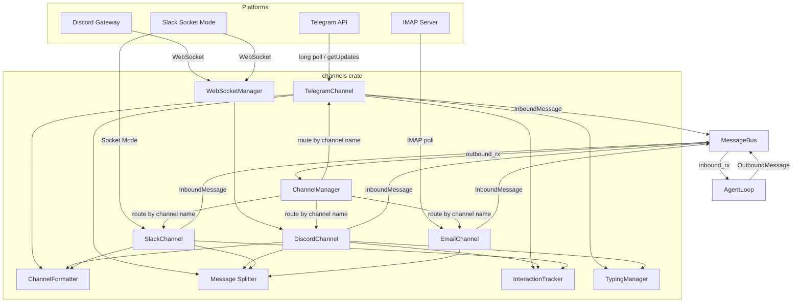

# Layer 5: Channels Crate Architecture

> `crates/channels/` -- Platform integrations for Telegram, Discord, Slack, and Email.

## Overview

The channels crate implements the **port/adapter pattern** for chat platform integrations. A single `Channel` trait defines the contract; each platform adapter implements it. The `ChannelManager` orchestrates lifecycle and outbound message dispatch via the `MessageBus`.

**Dependencies:** `common`, `bus`, `config`, `providers` (for voice transcription).

**Feature flags:** The `email` feature (on by default) gates IMAP/SMTP dependencies (`async-imap`, `lettre`, `mail-parser`, `native-tls`).

---

## Channel Trait

```rust
#[async_trait]
pub trait Channel: Send + Sync {
    fn name(&self) -> &str;
    async fn start(&self, bus: Arc<MessageBus>) -> Result<()>;
    async fn stop(&self) -> Result<()>;
    async fn send(&self, msg: &OutboundMessage) -> Result<()>;
    fn is_allowed(&self, sender_id: &str) -> bool;
    async fn send_typing(&self, chat_id: &str) -> Result<()>;           // default: no-op
    fn supports_interaction(&self) -> bool;                               // default: false
    async fn send_interaction(&self, chat_id: &str, request: &InteractionRequest) -> Result<FormResponse>;
}
```

Key design decisions:
- `start()` is a **long-running task** (polling loop or WebSocket connection). Each channel runs in its own `tokio::spawn`.
- `send()` handles outbound message delivery. Formatting and chunking happen inside via `formatter::formatter_for(channel)` and `utils::split_message()`.
- `is_allowed()` delegates to the shared `check_allowlist()` helper, which supports exact match and compound IDs (`"123|username"`).
- `supports_interaction()` + `send_interaction()` enable platform-native UI (inline keyboards, buttons, select menus) for the `ask_user` tool.

Type alias: `pub type DynChannel = Arc<dyn Channel>;`

---

## Channel Implementations

### TelegramChannel

| Aspect | Detail |
|---|---|
| **Transport** | HTTP long polling via `reqwest` (no teloxide dependency) |
| **API** | Telegram Bot API with retry logic (exponential backoff, max 3 retries) |
| **Inbound** | `getUpdates` with 30s timeout; handles `message`, `message_reaction`, `callback_query` |
| **Outbound** | `sendMessage` with HTML parse mode; falls back to plain text on HTML parse error |
| **Media** | Downloads photos, voice, audio, documents to `~/.klyntbot/media/` |
| **Voice** | Transcription via Groq API (`TranscriptionProvider`) when Groq key is configured |
| **Commands** | `/start`, `/reset` (publishes `__RESET_SESSION__` to bus), `/help` |
| **Interactions** | Inline keyboards for single-select, yes/no, multi-select; free-text via message interception |
| **Typing** | Re-sends `sendChatAction` every 4s (Telegram typing expires after ~5s) |
| **Message limit** | 4096 characters per message |

### DiscordChannel

| Aspect | Detail |
|---|---|
| **Transport** | Raw WebSocket Gateway (no serenity); managed by shared `WebSocketManager` |
| **Protocol** | Gateway v10 with JSON encoding; handles opcodes 0 (dispatch), 7 (reconnect), 9 (invalid session), 10 (hello), 11 (heartbeat ACK) |
| **Heartbeat** | Self-managed: spawns a dedicated task from HELLO payload (`heartbeat_interval`) |
| **Auth** | Sends IDENTIFY with bot token + intents (default 46593) after HELLO |
| **Inbound** | `MESSAGE_CREATE`, `MESSAGE_REACTION_ADD`, `INTERACTION_CREATE` events |
| **Outbound** | REST API (`POST /channels/{id}/messages`) with rate-limit handling (429 retry-after) |
| **Media** | Downloads attachments (max 20MB) to `~/.klyntbot/media/` |
| **Interactions** | Buttons (ActionRow, max 5 per row) or StringSelectMenu (>5 options); DEFERRED_UPDATE_MESSAGE acknowledgment |
| **Message limit** | 2000 characters per message |

### SlackChannel

| Aspect | Detail |
|---|---|
| **Transport** | Socket Mode WebSocket via `apps.connections.open` |
| **Auth** | `auth.test` to get bot user ID; Socket URL refreshed per connection attempt |
| **Inbound** | Socket Mode envelopes (`events_api`, `interactive`); handles `message`, `app_mention`, `reaction_added` |
| **Self-filtering** | Ignores own messages, bot/system subtypes; deduplicates `app_mention` vs `message` |
| **Outbound** | `chat.postMessage` REST API with optional thread_ts (non-DM channels only) |
| **Mention handling** | Strips `<@BOT_ID>` prefix from messages; responds in channels only when mentioned |
| **Reactions** | Adds `:eyes:` reaction to incoming messages; maps Slack shortcodes to Unicode emoji |
| **Interactions** | Block Kit: `section` + `actions` blocks with `button` elements; `static_select` for menus |
| **Message limit** | 8000 characters per message |

### EmailChannel

| Aspect | Detail |
|---|---|
| **Transport** | IMAP polling (configurable interval, min 5s) + SMTP for outbound |
| **TLS** | Supports both SSL and plain TCP for IMAP; SMTP via `lettre` relay |
| **Consent** | Requires explicit `consent_granted: true` in config before activation |
| **Inbound** | Polls UNSEEN messages; parses with `mail-parser`; extracts text/plain or converts HTML via `html2text` |
| **Dedup** | Tracks processed UIDs in a HashSet (capped at 10,000 entries) |
| **Threading** | Stores last `Message-ID` per sender; sets `In-Reply-To` and `References` headers |
| **Body limit** | Truncates at `max_body_chars` (default 12,000) |
| **Auto-reply** | Controlled by `auto_reply_enabled` config flag |
| **Message limit** | 8000 characters per message |

---

## Shared Infrastructure

### ChannelManager

`ChannelManager` owns the channel lifecycle:

1. `initialize_channels()` -- creates channel instances based on `Config.channels.*` enabled flags using the `init_channel!` macro
2. `start_all()` -- spawns each channel in a `tokio::spawn` task, then starts the outbound dispatcher loop
3. **Outbound dispatcher** -- reads from `MessageBus.outbound_rx`, routes to the correct channel by name, sends user-facing error feedback on delivery failure
4. `stop_all()` -- calls `stop()` on each channel

### WebSocketManager (`ws_manager`)

Shared connect-heartbeat-read loop for Discord and Slack:

```rust
pub trait WsHandler: Send + Sync {
    async fn on_connected(&self, write: &Arc<Mutex<WsSink>>) -> Result<Option<HeartbeatStrategy>>;
    async fn on_text_message(&self, text: &str, write: &Arc<Mutex<WsSink>>) -> Result<bool>;
    async fn on_disconnected(&self);
}
```

- Two heartbeat strategies: `Timeout` (Slack -- ping on idle) and `None` (Discord -- manages its own)
- Graceful close frame on shutdown
- Used with `reconnect_loop()` for automatic reconnection on error (5s delay)

### TypingManager (`shared/typing`)

Generic typing indicator lifecycle manager:
- `start(chat_id, interval, send_fn)` -- spawns a repeating task; aborts any existing task for the same chat
- `stop(chat_id)` -- aborts the task
- Interval is channel-specific: 4s for Telegram, 8s for Discord

### InteractionTracker (`shared/interaction`)

Thread-safe pending interaction state using `DashMap`:
- `PendingCallback::Single(oneshot::Sender)` for button presses
- `PendingCallback::FreeText(oneshot::Sender)` for text input
- `wait_for_callback()` / `wait_for_free_text()` -- 5 minute timeout
- `find_free_text_key()` -- lets inbound handlers intercept ordinary messages as interaction responses
- Callback data format: `"askuser:{chat_id}:{question_id}:{value}"`

### Message Formatting (`formatter`)

`ChannelFormatter` trait with four implementations:

| Formatter | Channel | Behavior |
|---|---|---|
| `TelegramFormatter` | telegram | Markdown to HTML; sentinel-protected code blocks; HTML entity escaping; URL injection prevention |
| `PassthroughFormatter` | discord | No-op (Discord supports native markdown) |
| `SlackFormatter` | slack | Markdown to Slack mrkdwn (`**bold**` to `*bold*`, `[text](url)` to `<url\|text>`) |
| `PlainTextFormatter` | email, unknown | Strips all markdown; links become `"text (url)"` |

All regexes are compiled once via `OnceLock` for zero per-call allocation.

### Message Splitting (`utils`)

`split_message(text, limit)` with priority-ordered split points:
1. Paragraph breaks (`\n\n`)
2. Line breaks (`\n`)
3. Sentence breaks (`. `, `! `, `? `)
4. Word breaks (spaces)
5. Hard character split (last resort, respects UTF-8 boundaries)

Per-channel limits: Telegram 4096, Discord 2000, Slack 8000, Email 8000, default 4000.

---

## Message Flow



### Inbound Path

1. Platform-specific adapter receives message (poll, WebSocket event, IMAP fetch)
2. Adapter checks allowlist via `check_allowlist()`
3. Adapter normalizes content (strips bot mention, transcribes voice, downloads media)
4. Adapter publishes `InboundMessage` to `MessageBus`
5. `AgentLoop` receives from `inbound_rx` and processes

### Outbound Path

1. `AgentLoop` publishes `OutboundMessage` to `MessageBus`
2. `ChannelManager` dispatcher reads from `outbound_rx`
3. Dispatcher looks up channel by name in the channels map
4. Channel formats content via `formatter_for(channel)`, splits via `split_message()`
5. Channel sends chunks with per-chunk error handling and rate-limit retry
6. On delivery failure, dispatcher sends user-facing error feedback (one retry only)
