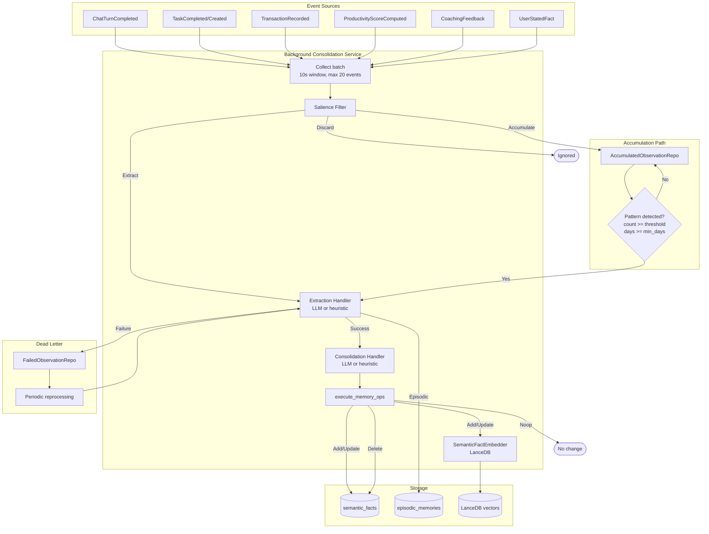
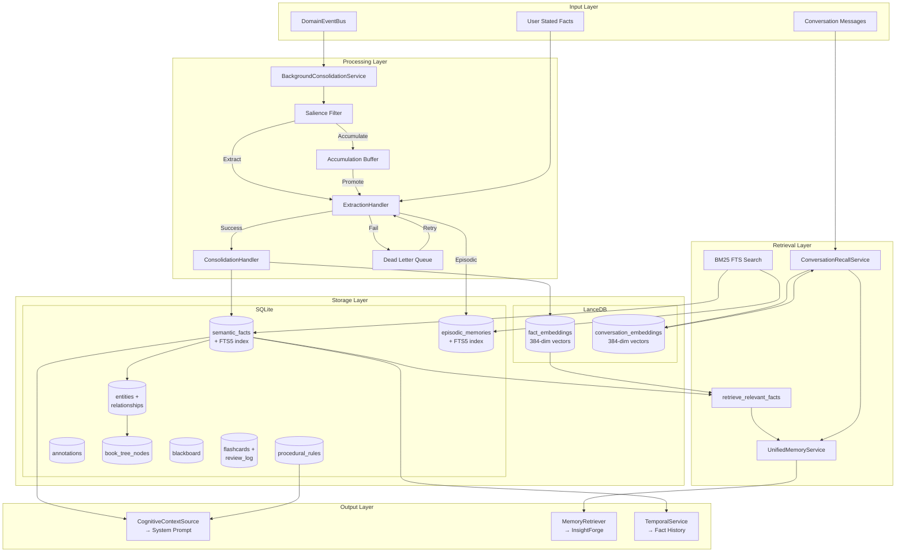

# Layer 5: Cognitive Crate Architecture

> `crates/cognitive/` -- Unified memory system with FSRS decay, bi-temporal facts, Mem0-style consolidation, weekly reflection, and spaced-repetition flashcards.

## Overview

The cognitive crate implements Klyntbot's persistent memory system. It stores what the agent learns about the user across conversations as structured semantic facts, episodic memories, and procedural rules. The system uses FSRS (Free Spaced Repetition Scheduler) for memory decay, bi-temporal storage for fact versioning, and a Mem0-inspired consolidation pipeline for deciding when to add, update, or supersede facts.

**Dependencies:** `common`, `storage`, `bus`, `context_engine`, `tools-core` (for `FeatureMigration`).

**Key design constraint:** Handler traits (`ExtractionHandler`, `ConsolidationHandler`, `ReflectionHandler`) are defined in cognitive but implemented in the agent crate via dependency inversion. This avoids a circular dependency -- cognitive defines the interface, agent provides the LLM-backed implementation.

---

## Module Map

```
cognitive/src/
  lib.rs              -- Re-exports
  types.rs            -- Core types (SemanticFact, EpisodicMemory, ProceduralRule, UserModel, etc.)
  embedder.rs         -- TextEmbedder + SemanticFactEmbedder traits
  repos/
    mod.rs            -- Repo exports, cognitive_migrations(), load_user_model()
    semantic_fact.rs  -- SemanticFactRepo (CRUD, FTS, archive)
    episodic_memory.rs-- EpisodicMemoryRepo
    procedural_rule.rs-- ProceduralRuleRepo
    annotation.rs     -- AnnotationRepo
    accumulated_observation.rs -- AccumulatedObservationRepo
    failed_observation.rs      -- FailedObservationRepo (dead-letter queue)
    event_log.rs      -- EventLogRepo, PipelineEventRecord
    persona.rs        -- PersonaRepo
    persona_accuracy.rs -- PersonaAccuracyRepo
    squad.rs          -- SquadRepo, ResolvedSquad
    blackboard.rs     -- BlackboardRepo (debate shared state)
    flashcard.rs      -- FlashcardRepo (FSRS-5 spaced repetition)
    entity.rs         -- EntityRepo (knowledge graph)
    book_tree.rs      -- SqliteBookTreeRepo (hierarchical content index)
    gt_link.rs        -- SqliteGTLinkRepo (graph-tree links)
    insight_cache.rs  -- InsightCacheRepo (deprecated)
    markdown_parser.rs-- parse_markdown_to_tree()
  search/
    mod.rs
    bm25.rs           -- BM25 full-text search via SQLite FTS5
  services/
    mod.rs
    background.rs     -- BackgroundConsolidationService
    extraction.rs     -- ExtractionHandler trait, ExtractedFact
    consolidation.rs  -- ConsolidationHandler trait, execute_memory_ops()
    retrieval.rs      -- retrieve_relevant_facts() with FSRS scoring
    memory_retriever.rs -- UnifiedMemoryService (MemoryRetriever impl)
    context_source.rs -- CognitiveContextSource (ContextSource impl)
    conversation_recall.rs -- ConversationRecallService
    reflection.rs     -- ReflectionHandler trait, weekly reflection
    decay.rs          -- FSRS decay + 6-factor relevance scoring
    salience.rs       -- Salience filter for DomainEvents
    compaction.rs     -- Memory archival + size budget enforcement
    temporal.rs       -- TemporalService (fact history, change summaries)
    situation.rs      -- UserSituation (coaching world model)
    memory_promotion.rs -- Scope promotion (persona -> squad -> global)
    fsrs5.rs          -- FSRS-5 spaced repetition algorithm
```

---

## Core Types (`types.rs`)

### SemanticFact

The primary memory unit -- a structured Subject-Predicate-Object (SPO) triple with bi-temporal markers and FSRS decay:

```rust
pub struct SemanticFact {
    pub id: String,
    pub domain: String,              // "identity", "energy", "work", "finance", "learning", "preferences", "general", "tasks", "coaching", "meta"
    pub subject: String,
    pub predicate: String,
    pub object: String,
    pub confidence: f64,             // 0.0-1.0
    pub source: String,              // "chat", "extraction", "reflection", "promoted:..."

    // Bi-temporal markers
    pub valid_from: String,          // When the fact became true in the real world
    pub valid_until: Option<String>, // When the fact stopped being true
    pub recorded_at: String,         // When the system recorded this fact
    pub superseded_at: Option<String>,
    pub superseded_by: Option<String>,

    // FSRS decay
    pub stability: f64,              // FSRS stability parameter (days)
    pub last_accessed: Option<String>,
    pub access_count: i64,

    // Scoping
    pub project_id: Option<String>,
    pub memory_type: String,         // "fact", "decision", "milestone", "pattern", "insight"
    pub scope_type: String,          // "global", "project", "squad", "persona"
    pub scope_id: Option<String>,
}
```

### EpisodicMemory

Narrative records of significant events:

```rust
pub struct EpisodicMemory {
    pub id: String,
    pub domain: String,
    pub content: String,
    pub summary: Option<String>,
    pub importance: f64,
    pub occurred_at: String,
    pub recorded_at: String,
    pub stability: f64,
    pub last_accessed: Option<String>,
    pub access_count: i64,
    pub project_id: Option<String>,
    pub scope_type: String,
    pub scope_id: Option<String>,
}
```

### ProceduralRule

Behavioral rules learned from patterns:

```rust
pub struct ProceduralRule {
    pub id: String,
    pub domain: String,              // "productivity", "tasks", "finance", "coaching", "general"
    pub rule_text: String,
    pub confidence: f64,
    pub source: String,
    pub signal_count: i64,
    pub created_at: String,
    pub updated_at: String,
    pub active: bool,
    pub project_id: Option<String>,
    pub scope_type: String,
    pub scope_id: Option<String>,
}
```

### UserModel

Organized view of all active semantic facts:

```rust
pub struct UserModel {
    pub identity: Vec<SemanticFact>,
    pub energy: Vec<SemanticFact>,
    pub work: Vec<SemanticFact>,
    pub finance: Vec<SemanticFact>,
    pub learning: Vec<SemanticFact>,
    pub preferences: Vec<SemanticFact>,
    pub other: Vec<SemanticFact>,    // general, tasks, coaching, meta
}
```

### Supporting Types

- `MemoryOp` -- `Add`, `Update`, `Delete`, `Noop` (consolidation decisions)
- `SalienceVerdict` -- `Extract`, `Accumulate`, `Discard` (event filtering)
- `Observation` -- domain event converted to a processing unit
- `Annotation` -- persistent notes attached to any entity (with priority, tags, expiry, text highlights)
- `UserSituation` -- coaching world model with normalized 0-1 signals

---

## Memory Pipeline



### Salience Filter (`salience.rs`)

Classifies `DomainEvent`s into three tiers:

| Verdict | Events | Processing |
|---------|--------|------------|
| **Extract** | `ChatTurnCompleted`, `UserStatedFact`, `UserCorrectedAI`, `BudgetAlert`, over-budget transactions, coaching feedback, high-quality sessions, narratives, voice journals | Immediate extraction |
| **Accumulate** | `ProductivityScoreComputed`, `ActivitySessionCompleted`, `FocusSessionStarted/Ended`, `DistractionDetected`, `TaskCreated`, normal `TaskCompleted`, normal `QualityScored` | Buffered for pattern detection |
| **Discard** | `SessionCreated`, `RuleEvolved` | Ignored |

Task completion with high deviation (>50%) is promoted to Extract.

### Accumulation and Promotion

Accumulated observations are buffered in-memory and persisted to `AccumulatedObservationRepo`. An observation is promoted to extraction when:
- Observation count >= `promote_threshold` (configurable)
- Seen across >= `min_days` distinct days

This prevents noise from one-off events while capturing genuine patterns.

### Extraction (`extraction.rs`)

Converts observations into `ExtractedFact` candidates:

```rust
pub struct ExtractedFact {
    pub domain: String,
    pub subject: String,
    pub predicate: String,
    pub object: String,
    pub confidence: f64,
    pub source: String,
}
```

`ExtractionHandler` trait (implemented in agent crate):
- **LLM path**: sends observation batch to LLM, parses structured SPO output
- **Heuristic fallback**: regex-based extraction when LLM fails
- Returns `BatchExtractionResult` with fallback tracking

Memory type classification: trigger phrases in object text map to `"decision"`, `"milestone"`, `"pattern"`, `"insight"`, or `"fact"` (default).

### Consolidation (`consolidation.rs`)

Mem0-style ADD/UPDATE/DELETE/NOOP decisions for each candidate fact:

1. Look up existing facts with matching subject/predicate
2. `ConsolidationHandler.decide_batch()` -- LLM or heuristic decides the operation
3. `execute_memory_ops()` -- applies decisions to `SemanticFactRepo` and `SemanticFactEmbedder`

Operations:
- **Add**: new fact, no conflict
- **Update**: supersedes an existing fact (old gets `superseded_at` + `superseded_by`)
- **Delete**: removes a fact (superseded by another)
- **Noop**: duplicate or irrelevant

### Dead-Letter Queue

Failed extractions are persisted to `FailedObservationRepo` with failure reason. Periodic reprocessing attempts recovery. Successfully reprocessed observations emit `DeadLetterReprocessed` events.

---

## Memory Retrieval

### FSRS Decay (`decay.rs`)

Core retrievability function: `R = exp(ln(0.9) * elapsed_days / stability)`

At stability=S days, retrievability is 0.9 (90% recall probability).

### 6-Factor Relevance Scoring

```rust
pub fn relevance_score(
    semantic_similarity: f64,   // 0.3 weight (from vector search)
    retrievability: f64,        // 0.2 weight (FSRS decay)
    importance: f64,            // 0.15 weight (confidence)
    access_frequency: f64,      // 0.1 weight (log-normalized access count)
    situational_boost: f64,     // 0.2 weight (from UserSituation)
    temporal_recency: f64,      // 0.05 weight (recency of valid_from)
    weights: &RelevanceWeights,
) -> f64
```

### Retrieval (`retrieval.rs`)

`retrieve_relevant_facts()` uses two paths:

**Vector path** (embedder available + non-empty query + >= 3 results):
1. `search_similar(query, domains, top_k)` via LanceDB
2. Batch-load matched facts from SQLite
3. Score with real cosine similarity

**Fallback path** (no embedder, empty query, or < 3 results):
1. Load all active facts across requested domains
2. Score with `semantic_similarity = 0.5` (neutral)

Results are ranked by relevance score. Stability access count is updated on retrieval (reinforcement).

### UnifiedMemoryService (`memory_retriever.rs`)

Implements `context_engine::MemoryRetriever`. Merges two sources:

1. **Cognitive facts** -- FSRS-scored semantic facts from `retrieve_relevant_facts()`
2. **Conversation recall** -- time-decayed conversation messages from `ConversationRecallService`

Merge via Reciprocal Rank Fusion (RRF, k=60). Deduplication: facts win over conversation matches with the same content. Returns unified `MemoryEntry` list.

### ConversationRecallService (`conversation_recall.rs`)

Stores and searches conversation messages via vector embeddings:

- **Store**: embeds `"{role}: {content}"` via `TextEmbedder`, stores in `VectorStore` (LanceDB)
- **Search**: embeds query, searches LanceDB, applies time decay: `score * decay_factor^elapsed_days`
- **Config**: `decay_half_life_days` (default 138), `default_threshold` (0.4), `default_limit` (5)

### BM25 Search (`search/bm25.rs`)

Full-text search via SQLite FTS5 across cognitive tables:
- `search_semantic_facts()` -- searches `semantic_facts_fts` with domain filtering
- `search_episodic_memories()` -- searches `episodic_memories_fts`

Scores are negated FTS5 rank (higher = better match).

---

## Context Integration

### CognitiveContextSource (`context_source.rs`)

Implements `context_engine::ContextSource`. Injects into the system prompt:

1. **Static facts**: high-stability, high-confidence facts loaded from `SemanticFactRepo` (limit configurable)
2. **Procedural rules**: active rules from `ProceduralRuleRepo`
3. **Confidence threshold**: from shared atomic handle

Filtering: only facts above the confidence threshold (from learning system) are included.

### UserSituation (`situation.rs`)

Computed world model used by the coaching engine and memory retrieval:

```rust
pub struct UserSituation {
    pub energy_level: f64,           // 0.0 = depleted, 1.0 = peak
    pub focus_state: f64,            // 0.0 = scattered, 1.0 = deep focus
    pub deadline_pressure: f64,      // 0.0 = relaxed, 1.0 = critical
    pub distraction_risk: f64,       // 0.0 = low, 1.0 = high
    pub coaching_receptivity: f64,   // 0.0 = unreceptive, 1.0 = open
    pub task_avoidance_detected: bool,
    pub hours_active_today: f64,
    pub mins_since_break: f64,
    pub hour_of_day: u32,
    pub recent_context_switches: i32,
}
```

Computed from `SituationInputs` (productivity signals, task signals, user model signals, coaching signals).

---

## Weekly Reflection (`reflection.rs`)

Periodic cross-domain pattern synthesis:

1. Load episodic memories from past 7 days (minimum 20 required)
2. Load current `UserModel` and procedural rules
3. Call `ReflectionHandler.reflect()` (LLM-powered, defined here, implemented in agent)
4. Consolidate fact updates from reflection output
5. Apply rule updates (new or modified procedural rules)
6. Store the reflection summary as an episodic memory

### ReflectionOutput

```rust
pub struct ReflectionOutput {
    pub fact_updates: Vec<SemanticFact>,
    pub rule_updates: Vec<ProceduralRule>,
    pub summary: String,
}
```

---

## Memory Lifecycle

### Compaction (`compaction.rs`)

Daily background job:
1. Archive superseded facts older than 90 days
2. Delete episodic memories older than 90 days with low access count (<2)
3. Enforce size budget: if active facts > 10,000, archive low-stability (<0.1) facts

### Temporal Service (`temporal.rs`)

Time-oriented queries:
- `get_fact_history(subject, predicate)` -- all versions (active + archived), newest first
- `change_summary(from, to)` -- new facts, updated facts (old/new pairs), superseded facts, per-domain counts

### Memory Promotion (`memory_promotion.rs`)

Scope escalation pipeline:
- `promote_fact()` -- creates a copy in a higher scope (persona -> squad -> global)
- `promote_from_blackboard()` -- converts high-confidence blackboard entries to squad-scoped facts

---

## FSRS-5 Flashcard System (`fsrs5.rs`)

Separate from the cognitive memory decay system. Implements the full FSRS-5 spaced-repetition algorithm:

- **19 default weights**: initial stability/difficulty per rating, success/failure stability factors
- `retrievability(elapsed_days, stability)` -- power decay: `1 / (1 + t / (9 * S))`
- `initial_stability(rating)` / `initial_difficulty(rating)` -- from weights
- `next_stability()` / `next_difficulty()` -- updated after each review
- `optimal_interval(stability, desired_retention)` -- recommended review interval

Used by `FlashcardRepo` for scheduling flashcard reviews.

---

## Knowledge Graph

### EntityRepo (`repos/entity.rs`)

Graph storage for entities and relationships:
- `EntityRow`: name, entity_type, description, aliases, source
- `RelationshipRow`: from_entity_id, to_entity_id, relation_type, confidence
- `GraphNeighborhood`: entity + inbound/outbound relationships (for scenario reasoning graph traversal)

### BookTree (`repos/book_tree.rs`)

Hierarchical content index (BookRAG):
- Tree nodes with parent-child relationships
- Content chunks indexed for retrieval
- Skill trees built at startup

### GT-Links (`repos/gt_link.rs`)

Graph-to-tree links connecting knowledge graph entities to book tree nodes.

---

## Squads and Personas

### SquadRepo (`repos/squad.rs`)

Multi-persona squad management:
- `SquadRow`: id, name, description, mode (round-robin, debate, etc.)
- `SquadMemberRow`: squad_id, persona_name, role
- `ResolvedSquad`: squad + fully resolved persona details

### BlackboardRepo (`repos/blackboard.rs`)

Shared state for room debate:
- `BlackboardEntry`: content, entry_type (observation, claim, agreement, question), author, confidence, session_key, squad_id
- Used by debate engine to track emerging consensus across rounds

### PersonaRepo (`repos/persona.rs`)

Persona management:
- `PersonaRow`: name, description, system_prompt, skills, voice_style, expertise_areas
- `PersonaAccuracyRepo`: tracks per-persona prediction accuracy for adaptive weighting

---

## Memory Architecture Diagram



---

## Integration with Agent Runtime

The cognitive crate integrates with the agent runtime at multiple points:

1. **Context assembly**: `CognitiveContextSource` injects static facts and procedural rules into the system prompt
2. **Memory retrieval**: `UnifiedMemoryService` (as `MemoryRetriever`) provides dynamic memory for `InsightForge` queries
3. **Background processing**: `BackgroundConsolidationService` subscribes to `DomainEventBus` and processes events asynchronously
4. **Conversation embedding**: `ConversationRecallService` embeds messages via `TextEmbedder` (implemented in agent)
5. **Fact extraction**: `ExtractionHandler` and `ConsolidationHandler` are implemented in agent with LLM providers
6. **Situation awareness**: `UserSituation` modulates memory retrieval relevance scoring and coaching interventions
7. **Squad execution**: `SquadRepo`, `BlackboardRepo`, and `PersonaRepo` support multi-persona debate
8. **Learning feedback**: confidence thresholds from the learning system filter which facts enter the context
