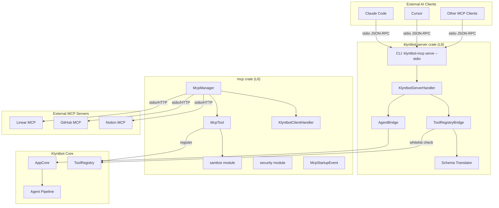
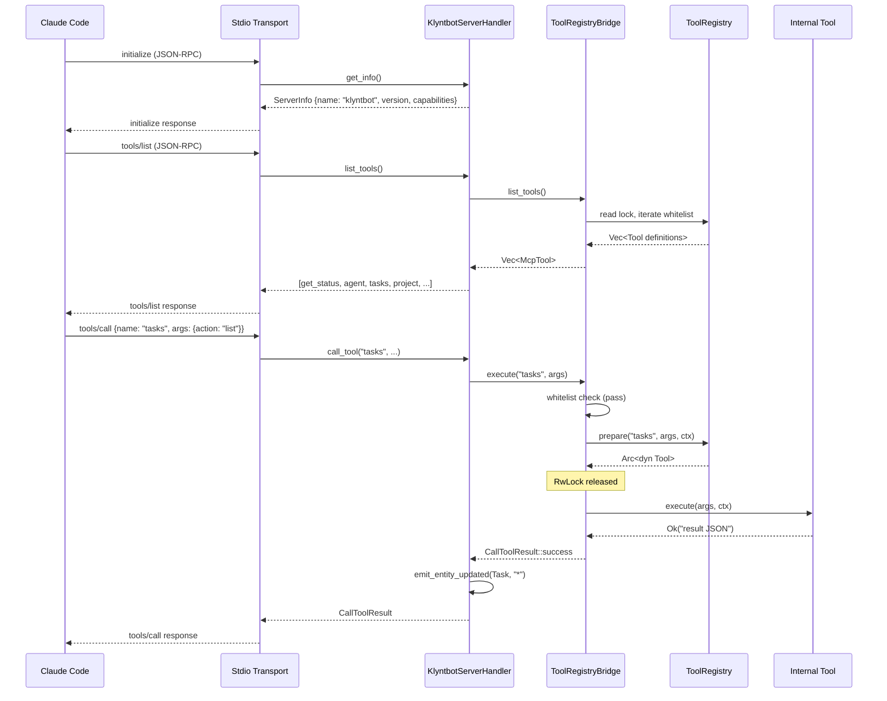
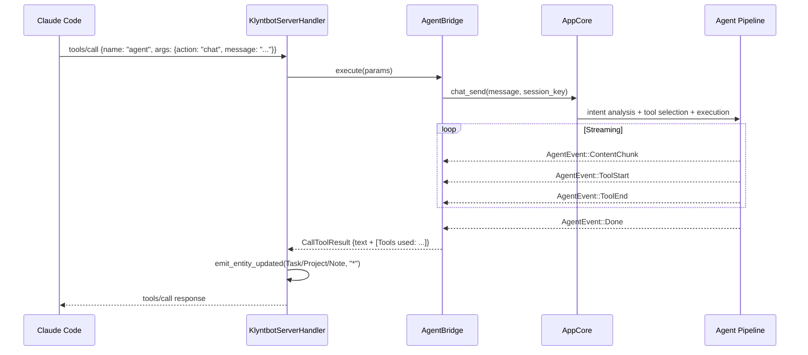
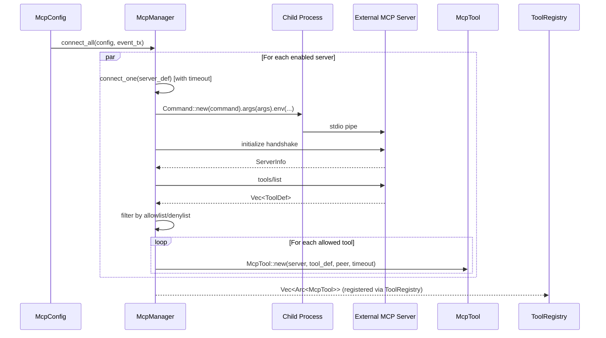

# Layer 6: MCP (Model Context Protocol)

## Overview

The MCP layer provides bidirectional Model Context Protocol integration. Klyntbot acts as both an **MCP client** (connecting to external MCP servers like Linear, GitHub, Notion) and an **MCP server** (exposing its own tools to external AI agents like Claude Code and Cursor).

The implementation is split across two crates:

| Crate | Role | Binary |
|---|---|---|
| `mcp` | Client-side connections, tool discovery, name sanitization, server security primitives | Library only |
| `klyntbot-server` | Full MCP server with ToolRegistryBridge, AgentBridge, CLI | `klyntbot-mcp` binary |

Both crates build on the [`rmcp`](https://crates.io/crates/rmcp) library for protocol handling, transport layers, and JSON-RPC message framing.

## Architecture Diagram



## MCP Client Implementation

### McpManager

`McpManager` is the lifecycle controller for all outbound MCP server connections. It lives in `crates/mcp/src/client/manager.rs`.

**Responsibilities:**
- Connects to all configured MCP servers at startup (parallel via `JoinSet`)
- Discovers tools from each server via `tools/list`
- Wraps each discovered tool as an `McpTool` (implements `tools_core::Tool`)
- Emits `McpStartupEvent` progress events for UI observability
- Supports individual server reconnect and disconnect
- Graceful shutdown of all connections via `disconnect_all()`

**Connection flow:**
1. Read `McpConfig.servers` from config
2. Skip disabled servers
3. For each enabled server, spawn a connection task with `startup_timeout_sec` timeout
4. Establish transport (stdio subprocess or HTTP)
5. Run `initialize` handshake via rmcp
6. Discover tools via `list_all_tools()` (handles pagination)
7. Filter tools by server-level allowlist/denylist (`enabled_tools` / `disabled_tools`)
8. Wrap each allowed tool as `McpTool`

**Transport support:**
- **Stdio** -- spawns a child process via `TokioChildProcess`. Process group cleanup is handled by rmcp's `process_wrap` crate (kills entire process tree on drop).
- **HTTP** -- uses `StreamableHttpClientTransport` for Streamable HTTP connections. Supports custom headers and OAuth Bearer tokens.

**OAuth injection:** When `McpServerDef.oauth` is configured, the access token is injected as an environment variable (stdio) or Bearer auth header (HTTP) into the subprocess/request.

### McpTool (Tool Adapter)

`McpTool` in `crates/mcp/src/client/tool_adapter.rs` adapts a remote MCP tool to klyntbot's internal `tools_core::Tool` trait, allowing seamless registration in the `ToolRegistry` alongside built-in tools.

**Key properties:**
- `namespaced_name`: The sanitized `mcp_{server}_{tool}` name used in the registry
- `original_name`: The raw MCP tool name sent in `tools/call` requests
- `input_schema`: JSON Schema from the MCP server's `inputSchema`
- `peer`: Shared `Arc<Peer<RoleClient>>` handle for JSON-RPC calls
- `tool_timeout`: Per-server timeout for tool calls

**Permission level:** All MCP tools are `PermissionLevel::Elevated` since they make network calls to external servers.

**Execution:** Calls `peer.call_tool()` with the original tool name and arguments. Extracts text content from the response. Reports server-side errors via `KlyntbotError::Tool`.

### KlyntbotClientHandler

`crates/mcp/src/client/handler.rs` implements rmcp's `ClientHandler` trait, handling server-initiated requests:
- `get_info()` -- returns client identity ("klyntbot" + version)
- `on_logging_message()` -- routes server logs to tracing (warn for errors, debug for info)
- `on_tool_list_changed()` -- logs notification (dynamic refresh not yet implemented)
- `on_resource_list_changed()` / `on_prompt_list_changed()` -- debug logging

Sampling, elicitation, and roots listing use rmcp's default implementations (return appropriate errors).

### McpStartupEvent

`crates/mcp/src/client/events.rs` defines progress events emitted during `McpManager::connect_all()`:

| Variant | Meaning |
|---|---|
| `Starting { server_name }` | Connection attempt beginning |
| `Ready { server_name, tool_count }` | Connected, tools discovered |
| `Failed { server_name, error }` | Connection failed |
| `Skipped { server_name }` | Server disabled in config |
| `Complete { ready, failed, skipped }` | All connection attempts finished |

Events are sent via `tokio::sync::mpsc::Sender<McpStartupEvent>`, allowing the agent loop or desktop UI to show connection progress.

## Tool Name Sanitization

The `sanitize` module (`crates/mcp/src/client/sanitize.rs`) ensures tool names are safe for LLM function-calling APIs (which typically require `[a-zA-Z0-9_-]`).

### Functions

| Function | Purpose |
|---|---|
| `sanitize_name(s)` | Replace non-alphanumeric/underscore/hyphen chars with `_` |
| `build_tool_name(server, tool)` | Build `mcp_{sanitized_server}_{sanitized_tool}`, truncate at 64 chars with hash suffix |
| `extract_server_name(tool_name)` | Extract server segment from `mcp_linear_list_issues` -> `"linear"` |
| `server_prefix(server)` | Build `mcp_{sanitized_server}_` prefix for bulk unregistration |

**Truncation strategy:** If the combined name exceeds 64 characters, it is truncated to 55 characters and an 8-character hex hash suffix is appended (prefixed with `_`) to preserve uniqueness.

**Examples:**
```
build_tool_name("linear", "list_issues")  -> "mcp_linear_list_issues"
build_tool_name("my.server", "get/data")  -> "mcp_my_server_get_data"
```

## MCP Server Implementation

### Standalone Server (klyntbot-server crate)

The `klyntbot-server` crate (`crates/klyntbot-server/`) provides the full MCP server binary. It is used both as a standalone `klyntbot-mcp` CLI binary and as a library embedded in the desktop app.

**CLI (`klyntbot-mcp`):**
```
klyntbot-mcp serve --stdio    # Stdio transport (for Claude Code / IDE)
klyntbot-mcp serve --http     # HTTP transport (not yet implemented)
klyntbot-mcp tools --list     # List exposed tools
klyntbot-mcp tools --schema <name>  # Show tool schema (not yet available)
```

**Startup sequence:**
1. Parse CLI args (clap)
2. Configure tracing (stderr for stdio, stdout for HTTP)
3. Load config via `config::load_with_env_overrides()`
4. Initialize `AppCore` in `Server` mode
5. Build `KlyntbotServerHandler` with whitelist from `config.mcp.server.exposed_tools`
6. Start rmcp service on stdio transport
7. Wait for service completion or Ctrl+C, then call `app.shutdown()`

### KlyntbotServerHandler

`crates/klyntbot-server/src/handler.rs` implements rmcp's `ServerHandler` trait. It combines three tool sources:

1. **Built-in `get_status` tool** -- returns server status, version, and mode
2. **`agent` tool** (if whitelisted) -- delegates natural language to the full AI pipeline via `AgentBridge`
3. **Registry tools** -- all other whitelisted tools via `ToolRegistryBridge`

**`list_tools`** returns the union of all three sources. **`call_tool`** dispatches by name: `get_status` is handled inline, `agent` goes to `AgentBridge`, everything else goes through `ToolRegistryBridge`.

**Entity update events:** After mutating tool calls, the handler emits `entity:updated` events via `AppEventEmitter` so the desktop UI can refresh. Read-only actions (`list`, `show`, `get`, `search`, `status`, `stats`, `query`) are excluded.

### ToolRegistryBridge

`crates/klyntbot-server/src/bridge/registry.rs` translates MCP calls into internal `Tool::execute()` invocations.

**Flow:**
1. **Whitelist check** -- reject if tool name is not in `exposed_tools`
2. **Build `RoutingContext`** -- channel=`MCP_CHANNEL`, chat_id=`"mcp-session"`, `is_direct_mode=true`
3. **Prepare** -- acquire read lock on `ToolRegistry`, validate params, clone `Arc<dyn Tool>`, drop lock
4. **Execute** -- call `tool.execute(arguments, &ctx)` (lock is released, concurrent requests proceed)
5. **Map result** -- success returns `CallToolResult::success(Content::text(...))`, errors return `CallToolResult::error(...)` (tool errors are non-fatal MCP results, not JSON-RPC errors)

**Schema translation:** The `bridge::schema` module converts internal tool schemas (OpenAI JSON Schema format from `Tool::parameters()`) to rmcp `Tool` definitions via `internal_to_mcp_tool()`.

### AgentBridge

`crates/klyntbot-server/src/bridge/agent.rs` routes the `agent` MCP tool to klyntbot's full AI pipeline.

**Actions:**
- `chat` -- sends a natural language message through `AppCore::chat_send()`, collects the streamed response
- `status` -- returns agent running status and mode

**Stream collection:** `collect_agent_stream()` consumes the `AgentEvent` stream using `tokio::select! biased`:
- `ContentChunk` -- appended to response text
- `ToolStart` -- tool name logged
- `Done` / `Error` -- terminates collection
- Interactive prompts (`InteractionBundle`) are auto-declined with `FormResponse::Cancelled` since MCP has no interactive prompt capability

**Response format:** Returns `CallToolResult::success` with the response text and an optional `[Tools used: ...]` annotation.

## MCP Call Flow



### Agent Tool Call Flow



## MCP Client Connection Flow



## Security

The `security` module (`crates/mcp/src/server/security.rs`) provides input validation for tools exposed via MCP:

| Function | Purpose |
|---|---|
| `validate_path(path, allowed_base)` | Canonicalizes path, ensures it stays within `allowed_base`. Blocks traversal attacks (`../`) and absolute paths outside the base. |
| `sanitize_input(input)` | Strips control characters (preserves `\n` and `\t`), truncates to `MAX_INPUT_LENGTH` (50,000 chars). |

**Constants:**
- `MAX_INPUT_LENGTH = 50_000` -- maximum input parameter length

## Tool Whitelisting and Access Control

Access control operates at two levels:

### Server-side (exposing klyntbot tools)

Configured via `config.json` -> `mcp.server.exposedTools`:

```json
{
  "mcp": {
    "server": {
      "exposedTools": ["tasks", "project", "area", "notes", "memory", "okr", "finance", "productivity", "work_context", "agent"]
    }
  }
}
```

The `ToolRegistryBridge` checks every `call_tool` request against this whitelist before execution. Tools not in the list return an `invalid_request` JSON-RPC error.

**Default whitelist** (from `default_exposed_tools()` in `crates/config/src/schema/mcp.rs`):
`tasks`, `project`, `area`, `notes`, `memory`, `okr`, `finance`, `productivity`, `work_context`, `agent`

### Client-side (filtering external MCP server tools)

Each `McpServerDef` supports per-server tool filtering:

- **`enabled_tools`** (allowlist) -- when set, only these tools are registered
- **`disabled_tools`** (denylist) -- when set, these tools are excluded
- Allowlist takes precedence over denylist when both are set
- No filters means all discovered tools are registered

## How External AI Clients Connect

External AI clients connect to klyntbot via the `klyntbot-mcp` binary over stdio transport.

**Claude Code configuration** (`~/.claude.json`):
```json
{
  "mcpServers": {
    "klyntbot": {
      "command": "<path>/target/debug/klyntbot-mcp",
      "args": ["serve", "--stdio"],
      "env": { "KLYNTBOT_HOME": "~/.klyntbot-dev" }
    }
  }
}
```

**How it works:**
1. Claude Code spawns `klyntbot-mcp serve --stdio` as a child process
2. Communication happens over stdin/stdout using JSON-RPC 2.0
3. All tracing/log output is redirected to stderr so stdout stays clean for protocol messages
4. Claude Code calls `tools/list` to discover available tools
5. Tools appear as `mcp__klyntbot__<tool_name>` in Claude Code (double underscore is Claude Code's namespacing)
6. Tool calls are dispatched through `KlyntbotServerHandler` -> `ToolRegistryBridge` / `AgentBridge`

**Desktop app embedding:** The desktop app can also embed the MCP server, sharing the same `AppCore` instance. The `klyntbot-server` crate is used as a library in this case.

## Configuration Types

All config types live in `crates/config/src/schema/mcp.rs` (lower layer, no circular dependency with `mcp` crate).

### McpConfig
Top-level MCP configuration.

| Field | Type | Default | Description |
|---|---|---|---|
| `enabled` | `bool` | `true` | Master switch for MCP client connections |
| `servers` | `Vec<McpServerDef>` | `[]` | External MCP servers to connect to |
| `server` | `McpServerSettings` | see below | Settings for klyntbot's own MCP server |

### McpServerDef
Defines a single external MCP server connection.

| Field | Type | Default | Description |
|---|---|---|---|
| `name` | `String` | required | Server identifier (used in tool name prefix) |
| `transport` | `McpTransport` | required | Stdio or HTTP transport config |
| `enabled` | `bool` | `true` | Whether to connect at startup |
| `oauth` | `Option<McpOAuthCredentials>` | `None` | OAuth credentials for authenticated servers |
| `startup_timeout_sec` | `u64` | `10` | Connection + discovery timeout |
| `tool_timeout_sec` | `u64` | `120` | Per-tool-call timeout |
| `enabled_tools` | `Option<Vec<String>>` | `None` | Allowlist of tool names |
| `disabled_tools` | `Option<Vec<String>>` | `None` | Denylist of tool names |

### McpTransport
Transport configuration (tagged enum via `serde(tag = "transport")`).

| Variant | Fields | Description |
|---|---|---|
| `Stdio` | `command`, `args`, `env` | Spawns a subprocess, communicates via stdin/stdout |
| `Http` | `url`, `headers` | Streamable HTTP connection |

### McpServerSettings
Settings for klyntbot's own MCP server.

| Field | Type | Default | Description |
|---|---|---|---|
| `enabled` | `bool` | `false` | Enable MCP server |
| `port` | `u16` | `3100` | HTTP transport port |
| `host` | `String` | `"127.0.0.1"` | HTTP transport bind address |
| `exposed_tools` | `Vec<String>` | see default list | Whitelist of internal tools to expose |
| `auth` | `McpAuthConfig` | disabled | Authentication config |

### McpOAuthCredentials

| Field | Type | Description |
|---|---|---|
| `provider` | `String` | Provider identifier (e.g. "linear", "github") |
| `access_token` | `Secret<String>` | OAuth access token |
| `refresh_token` | `Option<Secret<String>>` | Optional refresh token |
| `expires_at` | `Option<String>` | ISO-8601 expiry timestamp |
| `env_var` | `String` | Env var name injected into subprocess |

## Public Types and Traits

### `mcp` crate exports

| Type | Kind | Description |
|---|---|---|
| `McpManager` | struct | Lifecycle manager for external MCP server connections |
| `McpTool` | struct | Adapts remote MCP tool to `tools_core::Tool` |
| `McpStartupEvent` | enum | Startup progress events (Starting, Ready, Failed, Skipped, Complete) |
| `McpServerRunner` | struct | Runs lightweight MCP server on stdio (built-in `get_status` only) |
| `KlyntbotServerHandler` | struct | rmcp `ServerHandler` impl (in `mcp` crate, lightweight version) |
| `KlyntbotClientHandler` | struct | rmcp `ClientHandler` impl for handling server-initiated requests |
| `sanitize::sanitize_name` | fn | Sanitize a single name segment |
| `sanitize::build_tool_name` | fn | Build `mcp_{server}_{tool}` namespaced name |
| `sanitize::extract_server_name` | fn | Extract server from namespaced tool name |
| `sanitize::server_prefix` | fn | Build prefix for bulk operations |
| `security::validate_path` | fn | Path traversal protection |
| `security::sanitize_input` | fn | Input sanitization (control chars, length limit) |
| `security::MAX_INPUT_LENGTH` | const | 50,000 characters |

### `klyntbot-server` crate exports

| Type | Kind | Description |
|---|---|---|
| `KlyntbotServerHandler` | struct | Full `ServerHandler` with ToolRegistryBridge + AgentBridge |
| `ToolRegistryBridge` | struct | Translates MCP calls to `ToolRegistry` lookups and `Tool::execute()` |
| `AgentBridge` | struct | Routes `agent` tool to `AppCore::chat_send()` pipeline |
| `Cli` / `Command` | structs | Clap CLI definition for `klyntbot-mcp` binary |

## File Index

| File | Description |
|---|---|
| `crates/mcp/src/lib.rs` | Crate root, re-exports |
| `crates/mcp/src/server/mod.rs` | Server module root |
| `crates/mcp/src/server/handler.rs` | Lightweight `McpServerRunner` + `KlyntbotServerHandler` |
| `crates/mcp/src/server/security.rs` | Path validation, input sanitization |
| `crates/mcp/src/client/mod.rs` | Client module root |
| `crates/mcp/src/client/manager.rs` | `McpManager` -- connection lifecycle |
| `crates/mcp/src/client/handler.rs` | `KlyntbotClientHandler` -- server-initiated request handling |
| `crates/mcp/src/client/tool_adapter.rs` | `McpTool` -- adapts MCP tools to `Tool` trait |
| `crates/mcp/src/client/sanitize.rs` | Tool name sanitization (`mcp_{server}_{tool}`) |
| `crates/mcp/src/client/events.rs` | `McpStartupEvent` enum |
| `crates/config/src/schema/mcp.rs` | All MCP config types (`McpConfig`, `McpServerDef`, etc.) |
| `crates/klyntbot-server/src/main.rs` | `klyntbot-mcp` binary entry point |
| `crates/klyntbot-server/src/lib.rs` | Library root, re-exports |
| `crates/klyntbot-server/src/handler.rs` | Full `KlyntbotServerHandler` with bridges |
| `crates/klyntbot-server/src/bridge/registry.rs` | `ToolRegistryBridge` |
| `crates/klyntbot-server/src/bridge/agent.rs` | `AgentBridge` + stream collection |
| `crates/klyntbot-server/src/bridge/schema.rs` | OpenAI schema to MCP Tool translator |
| `crates/klyntbot-server/src/cli.rs` | Clap CLI definition |
| `crates/klyntbot-server/src/logging.rs` | Tracing configuration for stdio/HTTP |
